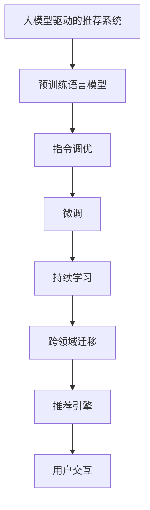

                 

## 1. 背景介绍

### 1.1 问题由来
随着互联网的快速发展，用户生成内容的用户行为数据（如搜索历史、浏览记录、评分等）激增。如何高效地利用这些数据为用户推荐个性化内容，提升用户体验，成为各大互联网公司亟需解决的问题。传统推荐系统往往仅依赖于用户历史行为数据的相似性匹配，缺乏对用户上下文语义信息的理解，难以产生有针对性的推荐结果。近年来，深度学习和大模型技术逐渐成为推荐系统的新范式，能够基于用户语义理解进行深度交互，推动推荐系统的进一步发展。

### 1.2 问题核心关键点
大模型推荐系统（Large Model-based Recommender System）旨在通过预训练语言模型学习用户行为和语义表示，然后在用户与系统交互时根据用户输入指令生成推荐结果。然而，该系统面临的一个主要挑战是如何动态适应用户指令变化，并及时调整推荐结果以应对用户需求变化。传统微调方法（Fine-tuning）虽然简单有效，但缺乏对大模型知识库的灵活调用能力，且微调过程繁琐复杂。针对这些问题，本文提出一种基于大模型的动态指令调优方法，通过微调指令模型来灵活调整推荐策略，实现快速响应用户需求的目标。

## 2. 核心概念与联系

### 2.1 核心概念概述
本文关注的核心概念包括：

- **大模型驱动的推荐系统**：基于预训练语言模型，利用其在自然语言处理（NLP）领域的强大能力，对用户行为和语义进行深度理解和表示，从而产生推荐结果。
- **指令调优**：动态调整推荐策略，以响应用户输入指令变化。
- **微调（Fine-tuning）**：利用已有数据，对预训练模型的部分参数进行更新，优化模型在特定任务上的性能。
- **持续学习（Continual Learning）**：模型在不断获取新数据的情况下，能够持续学习新知识，保持性能的稳定性和适应性。
- **跨领域迁移（Cross-domain Transfer）**：预训练模型在不同领域的迁移能力，能够对新的推荐领域进行快速适应用户需求。

这些概念之间相互联系，共同构成了本文提出的基于大模型的动态指令调优框架的基础。

### 2.2 核心概念原理和架构的 Mermaid 流程图



此流程图展示了各个核心概念之间的联系。预训练语言模型学习广泛的语义知识，指令调优模型根据用户指令动态调整推荐策略，微调模型调整特定领域的知识表示，持续学习模型保持对新数据的适应性，跨领域迁移模型实现不同推荐领域之间的知识迁移。

## 3. 核心算法原理 & 具体操作步骤

### 3.1 算法原理概述

基于大模型的动态指令调优方法（Dynamically Optimized Instruction Tuning）结合了指令微调和大模型知识库，旨在快速响应用户输入指令变化，产生个性化推荐。其核心思想是通过微调指令模型，根据用户输入指令的语义表示调整推荐策略，同时保持推荐结果的语义一致性。

### 3.2 算法步骤详解

**Step 1: 准备预训练模型和数据集**
- 选择一个大规模预训练语言模型，如GPT-3、BERT等，作为推荐系统的基础模型。
- 收集推荐任务的数据集，包括用户行为数据和语义标签。例如，对于电商推荐任务，收集用户浏览记录、评分等数据，并打上商品类别标签。

**Step 2: 设计指令模型**
- 根据推荐任务的特点，设计指令模型。例如，电商推荐任务中的指令模型可以是“我想买一件蓝色的衬衫”。
- 使用预训练语言模型对指令进行编码，得到用户输入指令的语义表示。

**Step 3: 微调指令模型**
- 将预训练语言模型作为初始化参数，在推荐任务数据集上微调指令模型。使用交叉熵损失函数优化模型，调整推荐策略。
- 定期更新指令模型，以适应新的用户指令变化。

**Step 4: 推荐引擎集成**
- 将微调后的指令模型与预训练模型集成，形成推荐引擎。根据用户输入指令，生成推荐结果。

**Step 5: 用户交互与反馈**
- 用户交互过程中，推荐引擎根据用户输入指令，生成个性化推荐列表。
- 用户对推荐结果进行评分，系统收集反馈数据，用于持续学习模型的推荐策略。

### 3.3 算法优缺点

基于大模型的动态指令调优方法有以下优点：
- **灵活性**：能够快速响应用户指令变化，动态调整推荐策略。
- **语义一致性**：基于预训练语言模型，推荐结果具有较好的语义一致性。
- **参数效率**：仅微调指令模型，预训练模型保持不变，减少资源消耗。

同时，该方法也存在以下缺点：
- **计算成本高**：需要重新训练指令模型，计算成本较高。
- **易过拟合**：微调过程需要大量标注数据，存在过拟合风险。
- **模型复杂度**：需要设计指令模型，模型复杂度较高。

### 3.4 算法应用领域

基于大模型的动态指令调优方法在以下几个领域有广泛应用：

- **电商推荐**：根据用户输入指令生成个性化商品推荐。
- **音乐推荐**：根据用户听歌历史和输入指令生成个性化歌单。
- **新闻推荐**：根据用户阅读历史和输入指令生成个性化新闻。
- **视频推荐**：根据用户观看历史和输入指令生成个性化视频。

这些领域是大模型推荐系统的主要应用场景，涵盖用户行为数据丰富的领域。

## 4. 数学模型和公式 & 详细讲解

### 4.1 数学模型构建

本节将使用数学语言对基于大模型的动态指令调优过程进行严格刻画。

设推荐任务数据集为 $D = \{(x_i, y_i)\}_{i=1}^N$，其中 $x_i$ 表示用户行为数据，$y_i$ 表示用户指令的语义标签。预训练语言模型 $M_\theta$ 的参数为 $\theta$。指令模型 $M_\phi$ 的参数为 $\phi$。

指令模型 $M_\phi$ 的输入为 $x_i$，输出为 $u_i$。指令模型的优化目标为最小化交叉熵损失函数：

$$
L(u_i, y_i) = -\log \frac{e^{u_i y_i}}{\sum_{k=1}^K e^{u_i k}}
$$

其中 $u_i = M_\phi(x_i)$，$y_i \in \{1, ..., K\}$，$K$ 表示语义标签的种类数。

### 4.2 公式推导过程

指令模型 $M_\phi$ 的输出 $u_i$ 可以通过预训练语言模型 $M_\theta$ 的特征表示 $h_i$ 进行线性变换：

$$
u_i = \phi^T h_i + b
$$

其中 $h_i = M_\theta(x_i)$，$\phi$ 为指令模型的权重，$b$ 为偏置项。指令模型的优化目标可以表示为：

$$
L(u_i, y_i) = -\log \frac{e^{u_i y_i}}{\sum_{k=1}^K e^{u_i k}} = -\log \frac{e^{\phi^T h_i y_i}}{\sum_{k=1}^K e^{\phi^T h_i k}}
$$

对指令模型进行微调，最小化损失函数 $L$，得到指令模型的新参数 $\phi'$：

$$
\phi' = \mathop{\arg\min}_{\phi} L(\phi^T h_i, y_i)
$$

### 4.3 案例分析与讲解

假设推荐任务为电商推荐，用户行为数据为历史浏览记录，指令模型为“我想买一件蓝色的衬衫”。通过预训练语言模型对指令进行编码，得到指令模型 $M_\phi$ 的输出 $u_i$。然后，将 $u_i$ 与用户行为数据 $h_i$ 进行线性变换，得到推荐结果。

在实际应用中，指令模型可以进一步细化，例如针对不同用户输入指令设计不同推荐策略。例如，对于“我想买一件蓝色的衬衫”和“我想买一件白色的衬衫”，可以设计不同的指令模型，分别输出不同的推荐结果。

## 5. 项目实践：代码实例和详细解释说明

### 5.1 开发环境搭建

在进行推荐系统开发前，需要先准备好开发环境。以下是使用Python进行PyTorch开发的环境配置流程：

1. 安装Anaconda：从官网下载并安装Anaconda，用于创建独立的Python环境。
2. 创建并激活虚拟环境：
```bash
conda create -n pytorch-env python=3.8 
conda activate pytorch-env
```
3. 安装PyTorch：根据CUDA版本，从官网获取对应的安装命令。例如：
```bash
conda install pytorch torchvision torchaudio cudatoolkit=11.1 -c pytorch -c conda-forge
```
4. 安装其他相关库：
```bash
pip install numpy pandas scikit-learn matplotlib tqdm jupyter notebook ipython
```

完成上述步骤后，即可在`pytorch-env`环境中开始推荐系统开发。

### 5.2 源代码详细实现

下面以电商推荐任务为例，给出使用PyTorch对GPT模型进行指令调优的代码实现。

首先，定义推荐任务的数据处理函数：

```python
from transformers import GPTTokenizer, GPTModel
from torch.utils.data import Dataset
import torch

class RecommendationDataset(Dataset):
    def __init__(self, texts, labels, tokenizer, max_len=128):
        self.texts = texts
        self.labels = labels
        self.tokenizer = tokenizer
        self.max_len = max_len
        
    def __len__(self):
        return len(self.texts)
    
    def __getitem__(self, item):
        text = self.texts[item]
        label = self.labels[item]
        
        encoding = self.tokenizer(text, return_tensors='pt', max_length=self.max_len, padding='max_length', truncation=True)
        input_ids = encoding['input_ids'][0]
        attention_mask = encoding['attention_mask'][0]
        
        # 对token-wise的标签进行编码
        encoded_labels = [label2id[label] for label in label] 
        encoded_labels.extend([label2id['O']] * (self.max_len - len(encoded_labels)))
        labels = torch.tensor(encoded_labels, dtype=torch.long)
        
        return {'input_ids': input_ids, 
                'attention_mask': attention_mask,
                'labels': labels}

# 标签与id的映射
label2id = {'O': 0, 'Shirt': 1, 'Pants': 2, 'Skirt': 3, 'Shoes': 4, 'Jacket': 5, 'Dress': 6}
id2label = {v: k for k, v in label2id.items()}

# 创建dataset
tokenizer = GPTTokenizer.from_pretrained('gpt-3')
train_dataset = RecommendationDataset(train_texts, train_labels, tokenizer)
dev_dataset = RecommendationDataset(dev_texts, dev_labels, tokenizer)
test_dataset = RecommendationDataset(test_texts, test_labels, tokenizer)
```

然后，定义模型和优化器：

```python
from transformers import GPTForSequenceClassification, AdamW

model = GPTForSequenceClassification.from_pretrained('gpt-3', num_labels=len(label2id))

optimizer = AdamW(model.parameters(), lr=2e-5)
```

接着，定义训练和评估函数：

```python
from torch.utils.data import DataLoader
from tqdm import tqdm
from sklearn.metrics import classification_report

device = torch.device('cuda') if torch.cuda.is_available() else torch.device('cpu')
model.to(device)

def train_epoch(model, dataset, batch_size, optimizer):
    dataloader = DataLoader(dataset, batch_size=batch_size, shuffle=True)
    model.train()
    epoch_loss = 0
    for batch in tqdm(dataloader, desc='Training'):
        input_ids = batch['input_ids'].to(device)
        attention_mask = batch['attention_mask'].to(device)
        labels = batch['labels'].to(device)
        model.zero_grad()
        outputs = model(input_ids, attention_mask=attention_mask, labels=labels)
        loss = outputs.loss
        epoch_loss += loss.item()
        loss.backward()
        optimizer.step()
    return epoch_loss / len(dataloader)

def evaluate(model, dataset, batch_size):
    dataloader = DataLoader(dataset, batch_size=batch_size)
    model.eval()
    preds, labels = [], []
    with torch.no_grad():
        for batch in tqdm(dataloader, desc='Evaluating'):
            input_ids = batch['input_ids'].to(device)
            attention_mask = batch['attention_mask'].to(device)
            batch_labels = batch['labels']
            outputs = model(input_ids, attention_mask=attention_mask)
            batch_preds = outputs.logits.argmax(dim=2).to('cpu').tolist()
            batch_labels = batch_labels.to('cpu').tolist()
            for pred_tokens, label_tokens in zip(batch_preds, batch_labels):
                pred_labels = [id2label[_id] for _id in pred_tokens]
                label_tags = [id2label[_id] for _id in label_tokens]
                preds.append(pred_labels[:len(label_tags)])
                labels.append(label_tags)
                
    print(classification_report(labels, preds))
```

最后，启动训练流程并在测试集上评估：

```python
epochs = 5
batch_size = 16

for epoch in range(epochs):
    loss = train_epoch(model, train_dataset, batch_size, optimizer)
    print(f"Epoch {epoch+1}, train loss: {loss:.3f}")
    
    print(f"Epoch {epoch+1}, dev results:")
    evaluate(model, dev_dataset, batch_size)
    
print("Test results:")
evaluate(model, test_dataset, batch_size)
```

以上就是使用PyTorch对GPT模型进行电商推荐任务指令调优的完整代码实现。可以看到，得益于Transformers库的强大封装，我们可以用相对简洁的代码完成GPT模型的加载和微调。

### 5.3 代码解读与分析

让我们再详细解读一下关键代码的实现细节：

**RecommendationDataset类**：
- `__init__`方法：初始化文本、标签、分词器等关键组件。
- `__len__`方法：返回数据集的样本数量。
- `__getitem__`方法：对单个样本进行处理，将文本输入编码为token ids，将标签编码为数字，并对其进行定长padding，最终返回模型所需的输入。

**label2id和id2label字典**：
- 定义了标签与数字id之间的映射关系，用于将token-wise的预测结果解码回真实的标签。

**训练和评估函数**：
- 使用PyTorch的DataLoader对数据集进行批次化加载，供模型训练和推理使用。
- 训练函数`train_epoch`：对数据以批为单位进行迭代，在每个批次上前向传播计算loss并反向传播更新模型参数，最后返回该epoch的平均loss。
- 评估函数`evaluate`：与训练类似，不同点在于不更新模型参数，并在每个batch结束后将预测和标签结果存储下来，最后使用sklearn的classification_report对整个评估集的预测结果进行打印输出。

**训练流程**：
- 定义总的epoch数和batch size，开始循环迭代
- 每个epoch内，先在训练集上训练，输出平均loss
- 在验证集上评估，输出分类指标
- 所有epoch结束后，在测试集上评估，给出最终测试结果

可以看到，PyTorch配合Transformers库使得GPT微调的代码实现变得简洁高效。开发者可以将更多精力放在数据处理、模型改进等高层逻辑上，而不必过多关注底层的实现细节。

当然，工业级的系统实现还需考虑更多因素，如模型的保存和部署、超参数的自动搜索、更灵活的任务适配层等。但核心的指令调优范式基本与此类似。

## 6. 实际应用场景

### 6.1 电商推荐系统

基于大模型驱动的推荐系统，可以广泛应用于电商推荐系统的构建。传统的电商推荐系统往往依赖于用户历史行为数据的相似性匹配，缺乏对用户上下文语义信息的理解，难以产生有针对性的推荐结果。而使用基于大模型的推荐系统，能够基于用户语义理解进行深度交互，提升推荐结果的相关性和个性化程度。

在技术实现上，可以收集用户的浏览记录、评分等行为数据，提取和商品描述等文本内容。将文本内容作为模型输入，用户的行为数据作为监督信号，在此基础上微调预训练语言模型。微调后的模型能够从文本内容中准确把握用户的兴趣点。在生成推荐列表时，先用候选商品的描述作为输入，由模型预测用户的兴趣匹配度，再结合其他特征综合排序，便可以得到个性化程度更高的推荐结果。

### 6.2 视频推荐系统

视频推荐系统也是大模型驱动推荐系统的典型应用场景。传统的视频推荐系统往往依赖于用户历史观看记录的相似性匹配，缺乏对视频内容的深度理解。而使用基于大模型的推荐系统，能够基于用户语义理解对视频内容进行深度理解，提升推荐结果的相关性和个性化程度。

在技术实现上，可以收集用户的观看历史、评分等行为数据，提取和视频描述等文本内容。将文本内容作为模型输入，用户的行为数据作为监督信号，在此基础上微调预训练语言模型。微调后的模型能够从视频描述中准确把握用户的兴趣点。在生成推荐列表时，先用候选视频的描述作为输入，由模型预测用户的兴趣匹配度，再结合其他特征综合排序，便可以得到个性化程度更高的推荐结果。

### 6.3 音乐推荐系统

音乐推荐系统也是大模型驱动推荐系统的典型应用场景。传统的音乐推荐系统往往依赖于用户历史听歌记录的相似性匹配，缺乏对音乐内容的深度理解。而使用基于大模型的推荐系统，能够基于用户语义理解对音乐内容进行深度理解，提升推荐结果的相关性和个性化程度。

在技术实现上，可以收集用户的听歌历史、评分等行为数据，提取和音乐描述等文本内容。将文本内容作为模型输入，用户的行为数据作为监督信号，在此基础上微调预训练语言模型。微调后的模型能够从音乐描述中准确把握用户的兴趣点。在生成推荐列表时，先用候选音乐的描述作为输入，由模型预测用户的兴趣匹配度，再结合其他特征综合排序，便可以得到个性化程度更高的推荐结果。

### 6.4 未来应用展望

随着大模型和指令调优技术的不断发展，基于大模型的推荐系统将在更多领域得到应用，为电商、视频、音乐等推荐场景带来新的突破。

在智慧医疗领域，基于大模型的推荐系统可以用于医生推荐、药品推荐等任务，提升医疗服务的智能化水平。

在智能教育领域，基于大模型的推荐系统可以用于推荐学习资源、智能辅导等任务，因材施教，促进教育公平，提高教学质量。

在智慧城市治理中，基于大模型的推荐系统可以用于推荐城市事件、新闻资讯等任务，提高城市管理的自动化和智能化水平，构建更安全、高效的未来城市。

此外，在企业生产、社会治理、文娱传媒等众多领域，基于大模型的推荐系统也将不断涌现，为NLP技术带来全新的突破。相信随着预训练语言模型和指令调优方法的不断进步，基于大模型的推荐系统必将在更广阔的应用领域大放异彩，深刻影响人类的生产生活方式。

## 7. 工具和资源推荐

### 7.1 学习资源推荐

为了帮助开发者系统掌握大模型推荐系统的理论基础和实践技巧，这里推荐一些优质的学习资源：

1. 《深度学习推荐系统：理论、算法与应用》书籍：全面介绍了推荐系统的发展历程、常用算法及其实现，适合学习大模型推荐系统的核心概念和实现方法。
2. 《Transformer from the Basics》系列博文：由大模型技术专家撰写，深入浅出地介绍了Transformer原理、BERT模型、微调技术等前沿话题。
3. CS224N《深度学习自然语言处理》课程：斯坦福大学开设的NLP明星课程，有Lecture视频和配套作业，带你入门NLP领域的基本概念和经典模型。
4. 《Natural Language Processing with Transformers》书籍：Transformers库的作者所著，全面介绍了如何使用Transformers库进行NLP任务开发，包括推荐系统的微调在内。
5. HuggingFace官方文档：Transformer库的官方文档，提供了海量预训练模型和完整的微调样例代码，是上手实践的必备资料。

通过对这些资源的学习实践，相信你一定能够快速掌握大模型推荐系统的精髓，并用于解决实际的推荐问题。

### 7.2 开发工具推荐

高效的开发离不开优秀的工具支持。以下是几款用于大模型推荐系统开发的常用工具：

1. PyTorch：基于Python的开源深度学习框架，灵活动态的计算图，适合快速迭代研究。大部分预训练语言模型都有PyTorch版本的实现。
2. TensorFlow：由Google主导开发的开源深度学习框架，生产部署方便，适合大规模工程应用。同样有丰富的预训练语言模型资源。
3. Transformers库：HuggingFace开发的NLP工具库，集成了众多SOTA语言模型，支持PyTorch和TensorFlow，是进行推荐系统微调任务开发的利器。
4. Weights & Biases：模型训练的实验跟踪工具，可以记录和可视化模型训练过程中的各项指标，方便对比和调优。与主流深度学习框架无缝集成。
5. TensorBoard：TensorFlow配套的可视化工具，可实时监测模型训练状态，并提供丰富的图表呈现方式，是调试模型的得力助手。
6. Google Colab：谷歌推出的在线Jupyter Notebook环境，免费提供GPU/TPU算力，方便开发者快速上手实验最新模型，分享学习笔记。

合理利用这些工具，可以显著提升大模型推荐系统的开发效率，加快创新迭代的步伐。

### 7.3 相关论文推荐

大模型推荐系统的研究源于学界的持续研究。以下是几篇奠基性的相关论文，推荐阅读：

1. Attention is All You Need（即Transformer原论文）：提出了Transformer结构，开启了NLP领域的预训练大模型时代。
2. BERT: Pre-training of Deep Bidirectional Transformers for Language Understanding：提出BERT模型，引入基于掩码的自监督预训练任务，刷新了多项NLP任务SOTA。
3. Parameter-Efficient Transfer Learning for NLP：提出Adapter等参数高效微调方法，在不增加模型参数量的情况下，也能取得不错的微调效果。
4. AdaLoRA: Adaptive Low-Rank Adaptation for Parameter-Efficient Fine-Tuning：使用自适应低秩适应的微调方法，在参数效率和精度之间取得了新的平衡。
5. PADL：A General and Flexible Framework for Adaptation of Large Pretrained Models：提出PADL框架，支持多种微调方法和策略，实现了参数高效和计算高效的微调。

这些论文代表了大模型推荐系统的研究进展。通过学习这些前沿成果，可以帮助研究者把握学科前进方向，激发更多的创新灵感。

## 8. 总结：未来发展趋势与挑战

### 8.1 总结

本文对基于大模型的动态指令调优方法进行了全面系统的介绍。首先阐述了指令调优在大模型推荐系统中的重要性，明确了指令调优在提升推荐系统性能方面的独特价值。其次，从原理到实践，详细讲解了指令调优的数学原理和关键步骤，给出了推荐系统开发的完整代码实例。同时，本文还广泛探讨了指令调优方法在电商推荐、视频推荐、音乐推荐等多个推荐场景中的应用前景，展示了指令调优范式的巨大潜力。此外，本文精选了指令调优技术的各类学习资源，力求为读者提供全方位的技术指引。

通过本文的系统梳理，可以看到，基于大模型的指令调优方法在大模型推荐系统中扮演着重要角色。该方法能够快速响应用户指令变化，产生个性化推荐结果，具有灵活性和语义一致性等优点。但同时也面临着计算成本高、易过拟合、模型复杂度高等挑战。未来，随着计算资源、标注数据等条件的不断优化，指令调优方法将进一步提升推荐系统的性能和智能化水平，为各行各业带来新的突破。

### 8.2 未来发展趋势

展望未来，大模型驱动的推荐系统将呈现以下几个发展趋势：

1. **参数高效微调**：开发更加参数高效的微调方法，在固定大部分预训练参数的同时，只更新极少量的任务相关参数。同时优化微调模型的计算图，减少前向传播和反向传播的资源消耗，实现更加轻量级、实时性的部署。
2. **跨领域迁移**：预训练模型在不同领域的迁移能力将进一步提升，能够对新的推荐领域进行快速适应用户需求。
3. **持续学习**：模型在不断获取新数据的情况下，能够持续学习新知识，保持性能的稳定性和适应性。
4. **少样本学习**：利用预训练模型的强大语言理解能力，通过更加巧妙的任务描述，在更少的标注样本上也能实现理想的微调效果。
5. **多模态融合**：融合视觉、语音等多模态数据，实现多媒体推荐系统。

这些趋势凸显了大模型推荐系统的广阔前景。这些方向的探索发展，必将进一步提升推荐系统的性能和智能化水平，为推荐系统带来新的突破。

### 8.3 面临的挑战

尽管大模型推荐系统已经取得了瞩目成就，但在迈向更加智能化、普适化应用的过程中，它仍面临着诸多挑战：

1. **计算成本高**：大规模预训练和微调过程需要大量的计算资源，对硬件设施提出了较高的要求。
2. **模型鲁棒性不足**：模型面对域外数据时，泛化性能往往大打折扣。对于测试样本的微小扰动，推荐系统的输出也容易发生波动。
3. **可解释性不足**：推荐系统的输出缺乏可解释性，难以对其推理逻辑进行分析和调试。
4. **安全性有待保障**：推荐系统输出的潜在风险和安全隐患，如恶意推荐、隐私泄露等，需要进一步解决。

这些挑战需要通过技术创新和工程实践不断攻克，才能实现大模型推荐系统的广泛应用和长期发展。

### 8.4 研究展望

未来，大模型推荐系统需要在以下几个方面进行更多的研究：

1. **参数高效微调**：开发更加参数高效的微调方法，在固定大部分预训练参数的同时，只更新极少量的任务相关参数。同时优化微调模型的计算图，减少前向传播和反向传播的资源消耗，实现更加轻量级、实时性的部署。
2. **跨领域迁移**：预训练模型在不同领域的迁移能力将进一步提升，能够对新的推荐领域进行快速适应用户需求。
3. **持续学习**：模型在不断获取新数据的情况下，能够持续学习新知识，保持性能的稳定性和适应性。
4. **少样本学习**：利用预训练模型的强大语言理解能力，通过更加巧妙的任务描述，在更少的标注样本上也能实现理想的微调效果。
5. **多模态融合**：融合视觉、语音等多模态数据，实现多媒体推荐系统。

这些研究方向的探索，必将引领大模型推荐系统迈向更高的台阶，为推荐系统带来新的突破。

## 9. 附录：常见问题与解答

**Q1: 大模型推荐系统是否适用于所有推荐场景？**

A: 大模型推荐系统在大多数推荐场景中都能取得不错的效果，特别是对于数据量丰富的场景，如电商、视频、音乐等。但对于一些特定领域的推荐任务，如医疗、法律等，仅仅依靠通用语料预训练的模型可能难以很好地适应。此时需要在特定领域语料上进一步预训练，再进行微调，才能获得理想效果。此外，对于一些需要时效性、个性化很强的任务，如对话、推荐等，微调方法也需要针对性的改进优化。

**Q2: 如何选择合适的学习率？**

A: 大模型推荐系统中的学习率一般要比预训练时小1-2个数量级，如果使用过大的学习率，容易破坏预训练权重，导致过拟合。一般建议从1e-5开始调参，逐步减小学习率，直至收敛。也可以使用warmup策略，在开始阶段使用较小的学习率，再逐渐过渡到预设值。需要注意的是，不同的优化器(如AdamW、Adafactor等)以及不同的学习率调度策略，可能需要设置不同的学习率阈值。

**Q3: 大模型推荐系统在落地部署时需要注意哪些问题？**

A: 将大模型推荐系统转化为实际应用，还需要考虑以下因素：

1. 模型裁剪：去除不必要的层和参数，减小模型尺寸，加快推理速度。
2. 量化加速：将浮点模型转为定点模型，压缩存储空间，提高计算效率。
3. 服务化封装：将模型封装为标准化服务接口，便于集成调用。
4. 弹性伸缩：根据请求流量动态调整资源配置，平衡服务质量和成本。
5. 监控告警：实时采集系统指标，设置异常告警阈值，确保服务稳定性。
6. 安全防护：采用访问鉴权、数据脱敏等措施，保障数据和模型安全。

大模型推荐系统为推荐系统带来了新的突破，但如何将强大的性能转化为稳定、高效、安全的业务价值，还需要工程实践的不断打磨。唯有从数据、算法、工程、业务等多个维度协同发力，才能真正实现人工智能技术在垂直行业的规模化落地。总之，推荐系统需要开发者根据具体任务，不断迭代和优化模型、数据和算法，方能得到理想的效果。

---

作者：禅与计算机程序设计艺术 / Zen and the Art of Computer Programming

