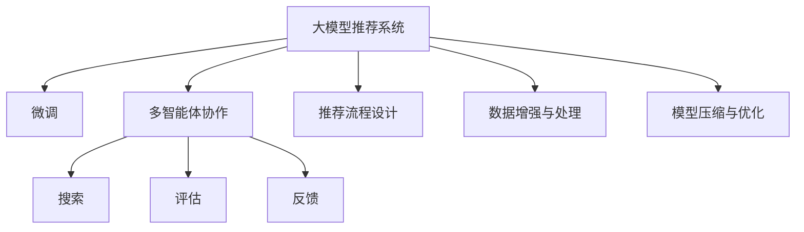

                 

## 1. 背景介绍

### 1.1 问题由来

随着互联网技术的发展，推荐系统在电子商务、社交媒体、在线视频、新闻阅读等多个领域得到广泛应用，极大地提升了用户体验，增强了平台黏性，带来了显著的经济收益。然而，传统的推荐系统通常基于单一模型，难以应对复杂多变的用户需求和动态数据环境。近年来，随着大模型和深度学习技术的发展，一种新的推荐系统范式应运而生——基于大模型的推荐系统。

大模型推荐系统，利用大规模预训练语言模型（如BERT、GPT等），通过微调或者结合更多智能体（如搜索、评估、反馈等），将多源数据和背景知识融合到模型中，提升推荐精度和多样性。该方法能够有效克服传统推荐系统存在的冷启动问题，同时提升推荐的个性化和上下文相关性。

### 1.2 问题核心关键点

大模型推荐系统的核心在于如何利用大模型的强大语言理解能力和泛化能力，结合多智能体协作，构建多层次、多维度、动态适应的推荐系统。该范式通过如下几个关键点实现：
- **大模型预训练与微调**：利用大规模无标签数据进行预训练，构建通用语言模型，通过微调将其适配到推荐任务中。
- **多智能体协作**：结合搜索、评估、反馈等多智能体，实现多层次数据融合，提升推荐质量。
- **推荐流程设计**：设计合理的推荐流程，合理分配多智能体的权值，确保推荐结果的公平性和多样性。
- **数据增强与处理**：对数据进行增强和预处理，确保模型能够高效适应动态数据环境。
- **模型压缩与优化**：在保持模型效果的同时，压缩模型大小，提升推理速度和资源利用效率。

本文聚焦于大模型驱动的推荐系统多智能体协作，探讨其在推荐系统中的应用，以期为推荐系统的未来发展提供新的思路。

## 2. 核心概念与联系

### 2.1 核心概念概述

为更好地理解大模型推荐系统多智能体协作的原理和架构，本节将介绍几个关键概念：

- **大模型推荐系统**：利用大规模预训练语言模型，通过微调或结合多智能体，实现推荐任务适配的推荐系统。
- **微调**：在大模型预训练的基础上，通过有监督学习优化模型在特定任务上的性能。
- **多智能体协作**：将搜索、评估、反馈等多智能体整合到推荐系统中，实现多层次数据融合，提升推荐质量。
- **推荐流程设计**：合理设计推荐流程，分配多智能体的权值，确保推荐结果的公平性和多样性。
- **数据增强与处理**：对数据进行增强和预处理，确保模型能够高效适应动态数据环境。
- **模型压缩与优化**：在保持模型效果的同时，压缩模型大小，提升推理速度和资源利用效率。

这些核心概念之间的逻辑关系可以通过以下Mermaid流程图来展示：



这个流程图展示了大模型推荐系统的核心概念及其之间的关系：

1. 大模型推荐系统通过微调适配推荐任务。
2. 结合多智能体协作，实现多层次数据融合。
3. 通过推荐流程设计、数据增强、模型压缩等多环节优化，提升推荐质量。

这些概念共同构成了大模型推荐系统的学习和应用框架，使其能够在复杂的推荐场景中发挥强大能力。通过理解这些核心概念，我们可以更好地把握大模型推荐系统的原理和优化方向。

## 3. 核心算法原理 & 具体操作步骤
### 3.1 算法原理概述

基于大模型的推荐系统多智能体协作，本质上是一个有监督的细粒度迁移学习过程。其核心思想是：将预训练的大模型视作一个强大的"特征提取器"，通过微调结合多智能体协作，优化模型在推荐任务上的性能。

形式化地，假设预训练模型为 $M_{\theta}$，其中 $\theta$ 为预训练得到的模型参数。给定推荐任务 $T$ 的标注数据集 $D=\{(x_i, y_i)\}_{i=1}^N$，推荐系统的优化目标是最小化经验风险，即找到最优参数：

$$
\theta^* = \mathop{\arg\min}_{\theta} \mathcal{L}(M_{\theta},D)
$$

其中 $\mathcal{L}$ 为针对任务 $T$ 设计的损失函数，用于衡量模型预测输出与真实标签之间的差异。常见的损失函数包括交叉熵损失、均方误差损失等。

### 3.2 算法步骤详解

基于大模型的推荐系统多智能体协作一般包括以下几个关键步骤：

**Step 1: 准备预训练模型和数据集**
- 选择合适的预训练语言模型 $M_{\theta}$ 作为初始化参数，如 BERT、GPT等。
- 准备推荐任务 $T$ 的标注数据集 $D$，划分为训练集、验证集和测试集。一般要求标注数据与预训练数据的分布不要差异过大。

**Step 2: 添加推荐适配层**
- 根据任务类型，在预训练模型顶层设计合适的输出层和损失函数。
- 对于分类任务，通常在顶层添加线性分类器和交叉熵损失函数。
- 对于生成任务，通常使用语言模型的解码器输出概率分布，并以负对数似然为损失函数。

**Step 3: 设置推荐超参数**
- 选择合适的优化算法及其参数，如 AdamW、SGD 等，设置学习率、批大小、迭代轮数等。
- 设置正则化技术及强度，包括权重衰减、Dropout、Early Stopping等。
- 确定冻结预训练参数的策略，如仅微调顶层，或全部参数都参与微调。

**Step 4: 执行梯度训练**
- 将训练集数据分批次输入模型，前向传播计算损失函数。
- 反向传播计算参数梯度，根据设定的优化算法和学习率更新模型参数。
- 周期性在验证集上评估模型性能，根据性能指标决定是否触发 Early Stopping。
- 重复上述步骤直到满足预设的迭代轮数或 Early Stopping 条件。

**Step 5: 多智能体协作**
- 集成搜索、评估、反馈等多智能体，实现多层次数据融合。
- 设计推荐流程，确定各智能体的权值，确保推荐结果的公平性和多样性。

**Step 6: 测试和部署**
- 在测试集上评估微调后模型 $M_{\hat{\theta}}$ 的性能，对比微调前后的精度提升。
- 使用微调后的模型对新样本进行推荐，集成到实际的应用系统中。
- 持续收集新的数据，定期重新微调模型，以适应数据分布的变化。

以上是基于大模型的推荐系统多智能体协作的一般流程。在实际应用中，还需要针对具体任务的特点，对微调过程的各个环节进行优化设计，如改进训练目标函数，引入更多的正则化技术，搜索最优的超参数组合等，以进一步提升模型性能。

### 3.3 算法优缺点

基于大模型的推荐系统多智能体协作方法具有以下优点：
1. 高效协同。多智能体协作能够整合多层次数据，提升推荐精度和多样性，缓解单一模型的不足。
2. 通用适用。适用于各种推荐任务，包括商品推荐、内容推荐、广告推荐等，设计简单的任务适配层即可实现微调。
3. 参数高效。利用参数高效微调技术，在固定大部分预训练参数的情况下，仍可取得不错的推荐效果。
4. 效果显著。在学术界和工业界的诸多任务上，基于微调的方法已经刷新了多项推荐系统SOTA。

同时，该方法也存在一定的局限性：
1. 依赖标注数据。微调的效果很大程度上取决于标注数据的质量和数量，获取高质量标注数据的成本较高。
2. 迁移能力有限。当目标任务与预训练数据的分布差异较大时，微调的性能提升有限。
3. 可解释性不足。微调模型的决策过程通常缺乏可解释性，难以对其推理逻辑进行分析和调试。

尽管存在这些局限性，但就目前而言，基于大模型的推荐系统多智能体协作仍是最主流的方法。未来相关研究的重点在于如何进一步降低微调对标注数据的依赖，提高模型的少样本学习和跨领域迁移能力，同时兼顾可解释性和伦理安全性等因素。

### 3.4 算法应用领域

基于大模型的推荐系统多智能体协作方法，在推荐系统领域已经得到了广泛的应用，覆盖了几乎所有常见任务，例如：

- 商品推荐：如电商平台推荐、零售商推荐等。通过微调使模型学习用户行为和商品属性，推荐相关商品。
- 内容推荐：如视频推荐、新闻推荐等。将用户历史行为和当前兴趣作为输入，推荐相关内容。
- 广告推荐：如定向广告推荐、品牌推荐等。利用用户历史行为和属性，推荐相关广告。

除了上述这些经典任务外，大模型推荐系统多智能体协作还被创新性地应用到更多场景中，如个性化广告、在线教育、游戏推荐等，为推荐系统带来了全新的突破。随着预训练模型和推荐方法的不断进步，相信推荐系统必将在更广阔的应用领域大放异彩。

## 4. 数学模型和公式 & 详细讲解  
### 4.1 数学模型构建

本节将使用数学语言对基于大模型的推荐系统多智能体协作过程进行更加严格的刻画。

记预训练语言模型为 $M_{\theta}$，其中 $\theta$ 为预训练得到的模型参数。假设推荐任务 $T$ 的训练集为 $D=\{(x_i,y_i)\}_{i=1}^N$，$x_i$ 为用户行为向量，$y_i$ 为推荐结果向量。

定义模型 $M_{\theta}$ 在数据样本 $(x,y)$ 上的损失函数为 $\ell(M_{\theta}(x),y)$，则在数据集 $D$ 上的经验风险为：

$$
\mathcal{L}(\theta) = \frac{1}{N}\sum_{i=1}^N \ell(M_{\theta}(x_i),y_i)
$$

其中 $\ell$ 为推荐系统的损失函数，用于衡量模型预测输出与真实标签之间的差异。常见的损失函数包括交叉熵损失、均方误差损失等。

微调的优化目标是最小化经验风险，即找到最优参数：

$$
\theta^* = \mathop{\arg\min}_{\theta} \mathcal{L}(\theta)
$$

在实践中，我们通常使用基于梯度的优化算法（如SGD、Adam等）来近似求解上述最优化问题。设 $\eta$ 为学习率，$\lambda$ 为正则化系数，则参数的更新公式为：

$$
\theta \leftarrow \theta - \eta \nabla_{\theta}\mathcal{L}(\theta) - \eta\lambda\theta
$$

其中 $\nabla_{\theta}\mathcal{L}(\theta)$ 为损失函数对参数 $\theta$ 的梯度，可通过反向传播算法高效计算。

### 4.2 公式推导过程

以下我们以商品推荐任务为例，推导交叉熵损失函数及其梯度的计算公式。

假设模型 $M_{\theta}$ 在用户行为向量 $x$ 上的推荐结果为 $\hat{y}=M_{\theta}(x) \in [0,1]$，表示商品被用户购买的概率。真实标签 $y \in [0,1]$。则交叉熵损失函数定义为：

$$
\ell(M_{\theta}(x),y) = -y\log \hat{y} + (1-y)\log (1-\hat{y})
$$

将其代入经验风险公式，得：

$$
\mathcal{L}(\theta) = -\frac{1}{N}\sum_{i=1}^N [y_i\log M_{\theta}(x_i)+(1-y_i)\log(1-M_{\theta}(x_i))]
$$

根据链式法则，损失函数对参数 $\theta_k$ 的梯度为：

$$
\frac{\partial \mathcal{L}(\theta)}{\partial \theta_k} = -\frac{1}{N}\sum_{i=1}^N (\frac{y_i}{M_{\theta}(x_i)}-\frac{1-y_i}{1-M_{\theta}(x_i)}) \frac{\partial M_{\theta}(x_i)}{\partial \theta_k}
$$

其中 $\frac{\partial M_{\theta}(x_i)}{\partial \theta_k}$ 可进一步递归展开，利用自动微分技术完成计算。

在得到损失函数的梯度后，即可带入参数更新公式，完成模型的迭代优化。重复上述过程直至收敛，最终得到适应推荐任务的最优模型参数 $\theta^*$。

## 5. 项目实践：代码实例和详细解释说明
### 5.1 开发环境搭建

在进行推荐系统多智能体协作实践前，我们需要准备好开发环境。以下是使用Python进行PyTorch开发的环境配置流程：

1. 安装Anaconda：从官网下载并安装Anaconda，用于创建独立的Python环境。

2. 创建并激活虚拟环境：
```bash
conda create -n pytorch-env python=3.8 
conda activate pytorch-env
```

3. 安装PyTorch：根据CUDA版本，从官网获取对应的安装命令。例如：
```bash
conda install pytorch torchvision torchaudio cudatoolkit=11.1 -c pytorch -c conda-forge
```

4. 安装Transformers库：
```bash
pip install transformers
```

5. 安装各类工具包：
```bash
pip install numpy pandas scikit-learn matplotlib tqdm jupyter notebook ipython
```

完成上述步骤后，即可在`pytorch-env`环境中开始推荐系统多智能体协作的实践。

### 5.2 源代码详细实现

下面我们以商品推荐任务为例，给出使用Transformers库对BERT模型进行推荐系统微调的PyTorch代码实现。

首先，定义推荐任务的数据处理函数：

```python
from transformers import BertTokenizer
from torch.utils.data import Dataset
import torch

class RecommendationDataset(Dataset):
    def __init__(self, user_behaviors, items, tokenizer, max_len=128):
        self.user_behaviors = user_behaviors
        self.items = items
        self.tokenizer = tokenizer
        self.max_len = max_len
        
    def __len__(self):
        return len(self.user_behaviors)
    
    def __getitem__(self, item):
        user_behavior = self.user_behaviors[item]
        item = self.items[item]
        
        encoding = self.tokenizer(user_behavior, return_tensors='pt', max_length=self.max_len, padding='max_length', truncation=True)
        user_ids = encoding['input_ids'][0]
        attention_mask = encoding['attention_mask'][0]
        
        # 对item的描述进行编码
        item_encodings = self.tokenizer(item['description'], return_tensors='pt', max_length=self.max_len, padding='max_length', truncation=True)
        item_ids = item_encodings['input_ids'][0]
        item_mask = item_encodings['attention_mask'][0]
        
        return {'user_ids': user_ids, 
                'attention_mask': attention_mask,
                'item_ids': item_ids,
                'item_mask': item_mask}
```

然后，定义模型和优化器：

```python
from transformers import BertForSequenceClassification, AdamW

model = BertForSequenceClassification.from_pretrained('bert-base-cased', num_labels=len(item_labels))

optimizer = AdamW(model.parameters(), lr=2e-5)
```

接着，定义训练和评估函数：

```python
from torch.utils.data import DataLoader
from tqdm import tqdm
from sklearn.metrics import roc_auc_score

device = torch.device('cuda') if torch.cuda.is_available() else torch.device('cpu')
model.to(device)

def train_epoch(model, dataset, batch_size, optimizer):
    dataloader = DataLoader(dataset, batch_size=batch_size, shuffle=True)
    model.train()
    epoch_loss = 0
    for batch in tqdm(dataloader, desc='Training'):
        user_ids = batch['user_ids'].to(device)
        attention_mask = batch['attention_mask'].to(device)
        item_ids = batch['item_ids'].to(device)
        item_mask = batch['item_mask'].to(device)
        model.zero_grad()
        outputs = model(user_ids, attention_mask=attention_mask, labels=item_ids)
        loss = outputs.loss
        epoch_loss += loss.item()
        loss.backward()
        optimizer.step()
    return epoch_loss / len(dataloader)

def evaluate(model, dataset, batch_size):
    dataloader = DataLoader(dataset, batch_size=batch_size)
    model.eval()
    preds, labels = [], []
    with torch.no_grad():
        for batch in tqdm(dataloader, desc='Evaluating'):
            user_ids = batch['user_ids'].to(device)
            attention_mask = batch['attention_mask'].to(device)
            item_ids = batch['item_ids'].to(device)
            item_mask = batch['item_mask'].to(device)
            batch_preds = model(user_ids, attention_mask=attention_mask)[0].tolist()
            batch_labels = item_ids.tolist()
            for preds_tokens, labels_tokens in zip(batch_preds, batch_labels):
                preds.append(preds_tokens[:len(labels_tokens)])
                labels.append(labels_tokens)
                
    auc = roc_auc_score(labels, preds)
    print(f"AUC: {auc:.3f}")
```

最后，启动训练流程并在测试集上评估：

```python
epochs = 5
batch_size = 16

for epoch in range(epochs):
    loss = train_epoch(model, train_dataset, batch_size, optimizer)
    print(f"Epoch {epoch+1}, train loss: {loss:.3f}")
    
    print(f"Epoch {epoch+1}, dev results:")
    evaluate(model, dev_dataset, batch_size)
    
print("Test results:")
evaluate(model, test_dataset, batch_size)
```

以上就是使用PyTorch对BERT进行推荐系统微调的完整代码实现。可以看到，得益于Transformers库的强大封装，我们可以用相对简洁的代码完成BERT模型的加载和微调。

### 5.3 代码解读与分析

让我们再详细解读一下关键代码的实现细节：

**RecommendationDataset类**：
- `__init__`方法：初始化用户行为、物品描述、分词器等关键组件。
- `__len__`方法：返回数据集的样本数量。
- `__getitem__`方法：对单个样本进行处理，将用户行为和物品描述输入编码为token ids，并对其进行定长padding，最终返回模型所需的输入。

**交叉熵损失函数**：
- 利用推荐任务的标注数据，计算模型的预测结果与真实标签之间的交叉熵损失。

**训练和评估函数**：
- 使用PyTorch的DataLoader对数据集进行批次化加载，供模型训练和推理使用。
- 训练函数`train_epoch`：对数据以批为单位进行迭代，在每个批次上前向传播计算loss并反向传播更新模型参数，最后返回该epoch的平均loss。
- 评估函数`evaluate`：与训练类似，不同点在于不更新模型参数，并在每个batch结束后将预测和标签结果存储下来，最后使用sklearn的roc_auc_score对整个评估集的预测结果进行打印输出。

**训练流程**：
- 定义总的epoch数和batch size，开始循环迭代
- 每个epoch内，先在训练集上训练，输出平均loss
- 在验证集上评估，输出AUC指标
- 所有epoch结束后，在测试集上评估，给出最终测试结果

可以看到，PyTorch配合Transformers库使得BERT微调的代码实现变得简洁高效。开发者可以将更多精力放在数据处理、模型改进等高层逻辑上，而不必过多关注底层的实现细节。

当然，工业级的系统实现还需考虑更多因素，如模型的保存和部署、超参数的自动搜索、更灵活的任务适配层等。但核心的微调范式基本与此类似。

## 6. 实际应用场景
### 6.1 智能广告推荐

基于大模型的推荐系统多智能体协作，可以广泛应用于智能广告推荐系统的构建。传统广告推荐往往需要手动设置参数，难以适应复杂的用户行为和广告内容。而使用微调后的推荐系统，可以7x24小时不间断服务，自动学习用户兴趣和行为，推荐高效精准的广告内容。

在技术实现上，可以收集用户的浏览记录、点击记录、购买记录等行为数据，以及广告的标题、描述、标签等属性数据，构建监督数据集。在此基础上对预训练语言模型进行微调，使其能够学习用户行为与广告内容的关联。微调后的推荐系统能够自动生成个性化广告推荐结果，满足用户的多样化需求，提升广告转化率。

### 6.2 个性化电商推荐

传统的电商推荐系统往往基于单一模型，难以应对不同用户和商品之间的复杂关联。而基于大模型的推荐系统多智能体协作，能够整合多层次数据，提升推荐精度和多样性。

在实践中，可以收集用户的历史购买记录、浏览记录、评分记录等行为数据，以及商品的标题、描述、图片等属性数据，构建推荐任务的数据集。通过微调优化模型，使模型能够学习用户与商品的关联，自动生成个性化推荐结果，提升用户满意度和购买转化率。

### 6.3 视频内容推荐

视频推荐系统面临内容多样性、用户偏好动态变化等挑战。基于大模型的推荐系统多智能体协作，可以有效地整合多源数据，提升推荐的准确性和多样性。

在技术实现上，可以收集用户的视频观看记录、评分记录、搜索记录等行为数据，以及视频内容的标题、描述、时长等属性数据，构建推荐任务的数据集。通过微调优化模型，使模型能够学习用户与视频的关联，自动生成个性化推荐结果，提升用户粘性和平台留存率。

### 6.4 未来应用展望

随着大模型和推荐系统技术的不断发展，基于微调的多智能体协作范式将在更多领域得到应用，为推荐系统的未来发展提供新的思路。

在智慧城市治理中，推荐系统可以用于推荐公共服务设施、优化城市资源配置，提升城市管理效率。

在智能医疗领域，推荐系统可以用于推荐诊疗方案、药物配对等，提升医疗服务水平和患者满意度。

在教育领域，推荐系统可以用于推荐学习资源、个性化课程等，提升教育质量和学生学习体验。

此外，在企业生产、社会治理、文娱传媒等众多领域，基于大模型的推荐系统多智能体协作也将不断涌现，为行业带来新的业务机会和创新点。相信随着技术的日益成熟，多智能体协作推荐系统必将在推荐系统的落地应用中发挥更大的作用。

## 7. 工具和资源推荐
### 7.1 学习资源推荐

为了帮助开发者系统掌握大模型推荐系统多智能体协作的理论基础和实践技巧，这里推荐一些优质的学习资源：

1. 《Transformer from Principle to Practice》系列博文：由大模型技术专家撰写，深入浅出地介绍了Transformer原理、BERT模型、推荐系统微调技术等前沿话题。

2. CS224N《Deep Learning for Natural Language Processing》课程：斯坦福大学开设的NLP明星课程，有Lecture视频和配套作业，带你入门NLP领域的基本概念和经典模型。

3. 《Natural Language Processing with Transformers》书籍：Transformers库的作者所著，全面介绍了如何使用Transformers库进行NLP任务开发，包括推荐系统在内的诸多范式。

4. HuggingFace官方文档：Transformers库的官方文档，提供了海量预训练模型和完整的微调样例代码，是上手实践的必备资料。

5. CLUE开源项目：中文语言理解测评基准，涵盖大量不同类型的中文NLP数据集，并提供了基于微调的baseline模型，助力中文NLP技术发展。

通过对这些资源的学习实践，相信你一定能够快速掌握大模型推荐系统多智能体协作的精髓，并用于解决实际的推荐问题。
###  7.2 开发工具推荐

高效的开发离不开优秀的工具支持。以下是几款用于大模型推荐系统多智能体协作开发的常用工具：

1. PyTorch：基于Python的开源深度学习框架，灵活动态的计算图，适合快速迭代研究。大部分预训练语言模型都有PyTorch版本的实现。

2. TensorFlow：由Google主导开发的开源深度学习框架，生产部署方便，适合大规模工程应用。同样有丰富的预训练语言模型资源。

3. Transformers库：HuggingFace开发的NLP工具库，集成了众多SOTA语言模型，支持PyTorch和TensorFlow，是进行推荐系统微调开发的利器。

4. Weights & Biases：模型训练的实验跟踪工具，可以记录和可视化模型训练过程中的各项指标，方便对比和调优。与主流深度学习框架无缝集成。

5. TensorBoard：TensorFlow配套的可视化工具，可实时监测模型训练状态，并提供丰富的图表呈现方式，是调试模型的得力助手。

6. Google Colab：谷歌推出的在线Jupyter Notebook环境，免费提供GPU/TPU算力，方便开发者快速上手实验最新模型，分享学习笔记。

合理利用这些工具，可以显著提升大模型推荐系统多智能体协作的开发效率，加快创新迭代的步伐。

### 7.3 相关论文推荐

大语言模型和推荐系统的发展源于学界的持续研究。以下是几篇奠基性的相关论文，推荐阅读：

1. Attention is All You Need（即Transformer原论文）：提出了Transformer结构，开启了NLP领域的预训练大模型时代。

2. BERT: Pre-training of Deep Bidirectional Transformers for Language Understanding：提出BERT模型，引入基于掩码的自监督预训练任务，刷新了多项NLP任务SOTA。

3. Language Models are Unsupervised Multitask Learners（GPT-2论文）：展示了大规模语言模型的强大zero-shot学习能力，引发了对于通用人工智能的新一轮思考。

4. Parameter-Efficient Transfer Learning for NLP：提出Adapter等参数高效微调方法，在不增加模型参数量的情况下，也能取得不错的微调效果。

5. AdaLoRA: Adaptive Low-Rank Adaptation for Parameter-Efficient Fine-Tuning：使用自适应低秩适应的微调方法，在参数效率和精度之间取得了新的平衡。

6. Model-Agnostic Meta-Learning for Few-Shot Recommendation：引入元学习的推荐系统，提升少样本推荐效果。

这些论文代表了大语言模型和推荐系统的发展脉络。通过学习这些前沿成果，可以帮助研究者把握学科前进方向，激发更多的创新灵感。

## 8. 总结：未来发展趋势与挑战

### 8.1 总结

本文对基于大模型的推荐系统多智能体协作方法进行了全面系统的介绍。首先阐述了基于大模型的推荐系统多智能体协作的研究背景和意义，明确了多智能体协作在拓展预训练模型应用、提升推荐精度和多样性方面的独特价值。其次，从原理到实践，详细讲解了推荐系统的数学原理和关键步骤，给出了推荐系统微调的完整代码实例。同时，本文还广泛探讨了推荐系统多智能体协作在智能广告、电商推荐、视频内容推荐等多个行业领域的应用前景，展示了多智能体协作范式的巨大潜力。此外，本文精选了推荐系统多智能体协作技术的各类学习资源，力求为开发者提供全方位的技术指引。

通过本文的系统梳理，可以看到，基于大模型的推荐系统多智能体协作技术正在成为推荐系统的重要范式，极大地拓展了推荐模型的应用边界，催生了更多的落地场景。得益于大规模语料的预训练，多智能体协作推荐系统能够高效融合多源数据，提升推荐精度和多样性，克服传统推荐系统的不足。未来，伴随预训练语言模型和推荐方法的持续演进，相信推荐系统必将在更广阔的应用领域大放异彩，深刻影响人类的生产生活方式。

### 8.2 未来发展趋势

展望未来，大模型推荐系统多智能体协作技术将呈现以下几个发展趋势：

1. 模型规模持续增大。随着算力成本的下降和数据规模的扩张，预训练语言模型的参数量还将持续增长。超大规模语言模型蕴含的丰富语言知识，有望支撑更加复杂多变的推荐任务。

2. 多智能体协作技术不断优化。未来将涌现更多高效的多智能体协作方法，如联邦学习、元学习等，提升推荐系统的效果和效率。

3. 推荐系统个性化程度提升。随着数据多样性和用户行为动态性的提升，多智能体协作推荐系统能够更准确地捕捉用户兴趣和行为模式，提供更加个性化和多样化的推荐。

4. 跨模态融合增强。推荐系统将更多地结合视觉、语音等多模态数据，提升推荐系统的表现力和用户体验。

5. 实时推荐技术发展。未来的推荐系统将实现实时推荐，能够快速响应用户的变化，提升推荐系统的即时性和精准性。

6. 推荐系统伦理和安全备受关注。推荐系统的发展也将越来越重视伦理和安全问题，防止数据滥用和推荐偏见。

以上趋势凸显了大模型推荐系统多智能体协作技术的广阔前景。这些方向的探索发展，必将进一步提升推荐系统的性能和应用范围，为推荐系统的未来发展提供新的动力。

### 8.3 面临的挑战

尽管大模型推荐系统多智能体协作技术已经取得了显著成就，但在迈向更加智能化、普适化应用的过程中，仍面临诸多挑战：

1. 数据隐私保护。推荐系统的训练和应用过程中，涉及用户隐私数据，如何保护用户隐私数据安全是关键问题。

2. 冷启动问题。新用户和新商品初期缺乏足够的数据，推荐系统难以给出准确推荐。如何处理冷启动问题，提升新用户和新商品推荐效果，仍是一大难题。

3. 动态数据处理。推荐系统需要实时更新数据，如何高效处理和融合动态数据，提升推荐系统性能，是需要解决的重要问题。

4. 多智能体协同优化。多智能体协作推荐系统需要合理分配各智能体的权值，确保推荐结果的公平性和多样性，如何优化协同过程，提升整体性能，还需要进一步研究。

5. 模型可解释性不足。推荐系统的决策过程通常缺乏可解释性，难以对其推理逻辑进行分析和调试。如何赋予推荐系统更强的可解释性，将是亟待攻克的难题。

6. 伦理和安全性问题。推荐系统可能存在推荐偏见和恶意推荐，如何确保推荐系统的公正性和安全性，需要进一步研究和规范。

这些挑战凸显了推荐系统多智能体协作技术的复杂性。未来需要多方协同努力，在保护用户隐私、提升推荐效果、保障数据安全等方面不断探索和优化，才能实现推荐系统的可持续发展。

### 8.4 研究展望

面对推荐系统多智能体协作面临的种种挑战，未来的研究需要在以下几个方面寻求新的突破：

1. 探索无监督和半监督推荐方法。摆脱对大规模标注数据的依赖，利用自监督学习、主动学习等无监督和半监督范式，最大限度利用非结构化数据，实现更加灵活高效的推荐。

2. 研究多智能体协同优化算法。开发更加高效的协同优化方法，合理分配各智能体的权值，确保推荐结果的公平性和多样性。

3. 融合因果分析和博弈论工具。将因果分析方法引入推荐系统，识别出推荐过程的关键特征，增强推荐结果的公平性和逻辑性。借助博弈论工具刻画人机交互过程，主动探索并规避推荐系统的脆弱点，提高系统稳定性。

4. 结合常识推理和知识图谱。将符号化的先验知识，如知识图谱、逻辑规则等，与神经网络模型进行巧妙融合，引导推荐系统学习更准确、合理的推荐策略。

5. 纳入伦理道德约束。在推荐系统训练目标中引入伦理导向的评估指标，过滤和惩罚有偏见、有害的推荐内容，确保推荐系统的公正性和安全性。

这些研究方向的探索，必将引领推荐系统多智能体协作技术迈向更高的台阶，为推荐系统的未来发展提供新的动力。面向未来，推荐系统多智能体协作技术还需要与其他人工智能技术进行更深入的融合，如知识表示、因果推理、强化学习等，多路径协同发力，共同推动推荐系统的进步。只有勇于创新、敢于突破，才能不断拓展推荐系统的边界，让智能技术更好地造福人类社会。

## 9. 附录：常见问题与解答

**Q1：大模型推荐系统多智能体协作是否适用于所有推荐任务？**

A: 大模型推荐系统多智能体协作在大多数推荐任务上都能取得不错的效果，特别是对于数据量较小的任务。但对于一些特定领域的任务，如医疗、法律等，仅仅依靠通用语料预训练的模型可能难以很好地适应。此时需要在特定领域语料上进一步预训练，再进行微调，才能获得理想效果。此外，对于一些需要时效性、个性化很强的任务，如视频推荐、内容推荐等，推荐方法也需要针对性的改进优化。

**Q2：推荐系统多智能体协作如何实现多层次数据融合？**

A: 推荐系统多智能体协作通过将搜索、评估、反馈等多智能体整合到推荐系统中，实现多层次数据融合。具体而言，可以采用如下方法：
1. 搜索智能体：通过搜索用户历史行为、商品描述等信息，提取用户兴趣和商品属性。
2. 评估智能体：利用提取出的用户兴趣和商品属性，结合推荐模型进行推荐结果评估，选择最优结果。
3. 反馈智能体：根据用户的反馈行为，动态调整推荐模型参数，提升推荐效果。

这些智能体的协同作用，能够有效整合多层次数据，提升推荐系统的表现。

**Q3：推荐系统多智能体协作中的推荐流程设计需要注意哪些问题？**

A: 推荐系统多智能体协作中的推荐流程设计需要合理分配各智能体的权值，确保推荐结果的公平性和多样性。具体而言，可以采用如下方法：
1. 设计多智能体协作框架，明确各智能体的功能。
2. 合理分配各智能体的权值，确保推荐结果的公平性和多样性。
3. 动态调整各智能体的参数，提升推荐系统性能。

在推荐流程设计过程中，需要注意避免单一智能体对推荐结果的过度影响，同时兼顾各智能体的权值和贡献，确保推荐系统性能的全面提升。

**Q4：推荐系统多智能体协作中如何处理冷启动问题？**

A: 推荐系统多智能体协作中的冷启动问题可以通过以下方法解决：
1. 利用用户历史行为和属性数据，进行多层次数据融合，提升推荐效果。
2. 引入元学习、主动学习等方法，在少量数据上快速学习推荐策略。
3. 结合知识图谱、逻辑规则等先验知识，提升推荐系统的表现力。

通过多层次数据融合和智能体协作，可以有效提升推荐系统对新用户和新商品的推荐效果，解决冷启动问题。

**Q5：推荐系统多智能体协作中的数据隐私保护需要注意哪些问题？**

A: 推荐系统多智能体协作中的数据隐私保护需要注意以下问题：
1. 在推荐系统训练和应用过程中，涉及用户隐私数据，需要严格遵守数据隐私法律法规。
2. 采用差分隐私、联邦学习等技术，保护用户隐私数据安全。
3. 设计数据匿名化和去标识化方法，确保数据隐私保护。

通过严格的数据隐私保护措施，可以有效保障用户隐私数据安全，提升推荐系统的可信度和可靠性。

**Q6：推荐系统多智能体协作中的推荐系统可解释性不足如何解决？**

A: 推荐系统多智能体协作中的推荐系统可解释性不足可以通过以下方法解决：
1. 引入可解释性增强技术，如知识图谱、逻辑规则等先验知识，提升推荐系统的可解释性。
2. 设计推荐系统的透明性机制，如解释性模型、可视化工具等，确保用户对推荐结果的理解和信任。
3. 结合因果分析和博弈论工具，提升推荐系统的公平性和逻辑性。

通过多层次数据融合和智能体协作，可以有效提升推荐系统的可解释性，增强用户对推荐结果的理解和信任。

**Q7：推荐系统多智能体协作中的推荐系统伦理和安全性问题如何解决？**

A: 推荐系统多智能体协作中的推荐系统伦理和安全性问题可以通过以下方法解决：
1. 在推荐系统训练目标中引入伦理导向的评估指标，过滤和惩罚有偏见、有害的推荐内容，确保推荐系统的公正性和安全性。
2. 设计推荐系统的透明性机制，如解释性模型、可视化工具等，确保用户对推荐结果的理解和信任。
3. 结合常识推理和知识图谱，提升推荐系统的公平性和逻辑性。

通过合理设计推荐系统的透明性机制，可以有效提升推荐系统的伦理和安全性，确保推荐系统的公正性和安全性。

**Q8：推荐系统多智能体协作中的推荐系统动态数据处理需要注意哪些问题？**

A: 推荐系统多智能体协作中的推荐系统动态数据处理需要注意以下问题：
1. 实时更新数据，提升推荐系统性能。
2. 采用数据增强、数据清洗等方法，确保数据的准确性和完整性。
3. 设计高效的模型训练和推理算法，提升推荐系统的实时性和性能。

通过实时更新数据和高效数据处理，可以有效提升推荐系统的实时性和性能，满足用户需求。

