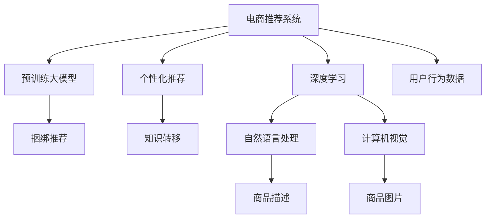

                 

# 大模型驱动的电商个性化产品捆绑推荐

## 1. 背景介绍

随着互联网技术的发展，电商平台的商品种类和数量急剧增长，消费者在购买商品时面临的选择越来越多。如何在海量的商品中快速找到适合自己的商品，成为了电商平台亟待解决的问题。传统推荐系统往往只能推荐单个商品，无法同时满足消费者对多商品的需求。因此，捆绑推荐应运而生，通过向用户推荐多个商品的组合，来提升用户体验和满意度。然而，传统的捆绑推荐算法多基于统计学方法，无法深入理解用户意图和商品间的关系。

近年来，深度学习技术取得了巨大突破，尤其是预训练大模型的出现，为推荐系统带来了新的机遇。本文将基于预训练大模型，提出一种新的电商个性化产品捆绑推荐方法，利用模型的自监督学习能力和知识转移能力，提升推荐系统的准确性和个性化水平。

## 2. 核心概念与联系

### 2.1 核心概念概述

为了更好地理解基于预训练大模型的电商捆绑推荐方法，本节将介绍几个密切相关的核心概念：

- 电商推荐系统（E-Commerce Recommendation System）：通过分析用户的浏览、点击、购买等行为数据，为用户推荐符合其兴趣的商品。推荐系统主要分为协同过滤、内容推荐、混合推荐等类型。
- 深度学习（Deep Learning）：一种基于神经网络的机器学习方法，通过大量数据的自监督学习，可以发现数据中隐藏的规律，用于图像、语音、文本等领域的智能处理。
- 预训练大模型（Pre-trained Large Models）：基于大规模无标签数据进行自监督学习，学习通用的语言和视觉知识，应用于各种NLP和计算机视觉任务中。如BERT、GPT、ViT等。
- 个性化推荐（Personalized Recommendation）：根据用户的历史行为数据，为其推荐个性化的商品，提升用户体验和满意度。
- 捆绑推荐（Bundle Recommendation）：将多个商品打包推荐给用户，同时满足用户对多个商品的需求。
- 知识转移（Knowledge Transfer）：将预训练模型学到的知识，迁移应用到下游推荐任务中，提升推荐系统的性能。

这些核心概念之间的逻辑关系可以通过以下Mermaid流程图来展示：



这个流程图展示了推荐系统的主要组成部分，以及它们之间的联系：

1. 电商推荐系统通过深度学习模型处理用户行为数据，学习用户偏好和商品特征。
2. 预训练大模型通过自监督学习，获得通用的语言和视觉知识，用于推荐任务的知识转移。
3. 个性化推荐通过模型对用户历史行为进行分析，生成个性化的推荐结果。
4. 捆绑推荐通过模型推荐商品组合，同时满足用户多个需求。
5. 知识转移将预训练模型的通用知识迁移到具体推荐任务中，提升模型性能。
6. 自然语言处理和计算机视觉分别处理商品描述和图片，用于提取特征。
7. 用户行为数据是推荐系统的输入，用于生成推荐结果。

## 3. 核心算法原理 & 具体操作步骤

### 3.1 算法原理概述

基于预训练大模型的电商捆绑推荐，本质上是一种深度学习的推荐范式。其核心思想是：将预训练大模型作为特征提取器，通过用户的浏览记录和点击行为，学习商品之间的关联关系，从而生成个性化的捆绑推荐。

具体来说，算法分为以下几步：

1. 收集用户的历史行为数据，包括浏览记录、点击行为、购买记录等。
2. 将用户的浏览记录和点击行为输入预训练大模型，学习商品间的关联关系。
3. 将预训练大模型作为特征提取器，将用户行为数据转换成高维向量。
4. 利用注意力机制，对高维向量进行加权求和，生成用户的行为表示。
5. 将用户的行为表示与商品库中所有商品的高维向量进行匹配，得到用户对每个商品的兴趣度。
6. 根据用户对商品的兴趣度，计算商品间的相似度，生成捆绑推荐列表。
7. 对推荐列表进行排序，根据评分、点击率、点击转化率等指标，选择用户可能感兴趣的捆绑推荐。

### 3.2 算法步骤详解

算法详细步骤：

1. **数据准备**：
   - 收集用户的历史行为数据，包括用户的浏览记录、点击行为、购买记录等。
   - 对数据进行清洗和预处理，包括去除噪声、缺失值填充、特征工程等。
   - 将用户的历史行为数据分成训练集和测试集。

2. **预训练模型选择**：
   - 选择合适的预训练大模型，如BERT、GPT、ViT等。
   - 将预训练大模型加载到计算设备上，进行模型调度和计算。

3. **特征提取**：
   - 对用户的浏览记录和点击行为进行编码，生成高维向量。
   - 对每个商品的高维向量进行编码，生成商品特征向量。
   - 将用户的行为向量与商品特征向量进行拼接，生成高维联合向量。

4. **注意力机制**：
   - 利用注意力机制，对用户的行为向量与商品特征向量进行加权求和，生成用户的行为表示。
   - 根据用户的行为表示和商品特征向量，计算商品间的相似度，得到商品间的关系矩阵。

5. **推荐计算**：
   - 利用商品间的相似度矩阵，计算用户对每个商品的兴趣度。
   - 根据用户对商品的兴趣度，生成捆绑推荐列表。
   - 对推荐列表进行排序，根据评分、点击率、点击转化率等指标，选择用户可能感兴趣的捆绑推荐。

6. **模型评估**：
   - 对测试集进行推荐预测，生成推荐列表。
   - 利用测试集上的真实购买记录和推荐列表进行对比，计算推荐系统的评分指标。
   - 对模型进行调参和优化，提升模型性能。

### 3.3 算法优缺点

基于预训练大模型的电商捆绑推荐算法具有以下优点：

1. **特征表示能力强**：预训练大模型能够学习到丰富的商品特征和用户行为特征，生成高维向量，用于推荐系统的特征表示。
2. **知识迁移效果好**：预训练大模型通过自监督学习，学习到通用的语言和视觉知识，能够很好地迁移到具体的推荐任务中，提升推荐系统的性能。
3. **个性化推荐能力强**：通过用户的行为表示和商品特征向量的匹配，能够生成个性化的捆绑推荐，满足用户对多个商品的需求。

同时，该算法也存在以下缺点：

1. **计算复杂度高**：预训练大模型需要进行大规模计算，生成高维向量，计算复杂度较高。
2. **数据量要求高**：算法需要大量的用户行为数据和商品数据，数据量不足会导致模型泛化能力差。
3. **模型难以解释**：预训练大模型是一个黑盒模型，难以解释其内部的计算过程和决策逻辑。

### 3.4 算法应用领域

基于预训练大模型的电商捆绑推荐算法，主要应用于以下领域：

1. **电商平台推荐**：在电商平台上，为用户推荐符合其兴趣的商品组合，提升用户满意度和转化率。
2. **旅游推荐**：在旅游平台上，为用户推荐景点和酒店的组合，提升用户旅游体验。
3. **零售推荐**：在零售商店中，为用户推荐商品组合，提升购物体验和销售转化。
4. **金融推荐**：在金融平台上，为用户推荐理财产品和金融产品的组合，提升用户理财体验。

## 4. 数学模型和公式 & 详细讲解

### 4.1 数学模型构建

假设用户的历史行为数据为 $D=\{(x_i, y_i)\}_{i=1}^N$，其中 $x_i$ 表示用户的历史行为向量，$y_i$ 表示用户的实际购买记录。设预训练大模型为 $M_{\theta}$，商品库为 $S=\{s_j\}_{j=1}^M$。

用户的行为表示可以通过以下公式计算：

$$
u = M_{\theta}(x_i) \in \mathbb{R}^d
$$

其中，$d$ 为高维向量的维度。

商品特征向量可以通过以下公式计算：

$$
v_j = M_{\theta}(s_j) \in \mathbb{R}^d
$$

商品间的相似度矩阵可以通过以下公式计算：

$$
A_{i,j} = \text{sim}(u, v_j)
$$

其中，$\text{sim}$ 表示相似度函数，可以是余弦相似度、欧式距离等。

推荐列表可以通过以下公式计算：

$$
r_i = \text{softmax}(A_i)
$$

其中，$A_i$ 表示用户 $i$ 对商品 $s_j$ 的兴趣度，$r_i$ 表示用户 $i$ 对商品 $s_j$ 的推荐分数。

### 4.2 公式推导过程

以下是详细的公式推导过程：

假设用户的历史行为向量 $x_i$ 为：

$$
x_i = (x_{i,1}, x_{i,2}, ..., x_{i,n})
$$

其中 $n$ 为行为的种类，如浏览、点击、购买等。

对 $x_i$ 进行编码，生成高维向量 $u$：

$$
u = M_{\theta}(x_i) = [f_1(x_{i,1}), f_2(x_{i,2}), ..., f_d(x_{i,n})]
$$

其中 $f_k$ 表示 $x_{i,k}$ 的编码函数，$d$ 为高维向量的维度。

对商品库中的商品 $s_j$ 进行编码，生成高维向量 $v_j$：

$$
v_j = M_{\theta}(s_j) = [g_1(s_j), g_2(s_j), ..., g_d(s_j)]
$$

其中 $g_k$ 表示 $s_j$ 的编码函数。

计算用户 $i$ 对商品 $j$ 的兴趣度 $A_{i,j}$：

$$
A_{i,j} = \text{sim}(u, v_j) = \frac{\langle u, v_j \rangle}{\|u\|\|v_j\|}
$$

其中 $\langle u, v_j \rangle$ 表示 $u$ 和 $v_j$ 的点积，$\|u\|$ 和 $\|v_j\|$ 分别表示 $u$ 和 $v_j$ 的模长。

对商品间的相似度矩阵进行归一化，得到用户 $i$ 对商品 $j$ 的推荐分数 $r_i$：

$$
r_i = \text{softmax}(A_i) = \frac{\exp(A_i)}{\sum_{j=1}^M \exp(A_{i,j})}
$$

其中 $A_i$ 表示用户 $i$ 对商品 $j$ 的兴趣度矩阵。

### 4.3 案例分析与讲解

以电商平台为例，展示基于预训练大模型的捆绑推荐流程：

1. **数据准备**：
   - 收集用户的浏览记录和点击行为数据，进行清洗和预处理。
   - 将用户的历史行为数据分成训练集和测试集。
   - 对商品库进行编码，生成商品特征向量。

2. **预训练模型选择**：
   - 选择BERT模型作为预训练大模型，加载到计算设备上。
   - 将用户的历史行为数据输入BERT模型，生成高维向量。

3. **特征提取**：
   - 将用户的浏览记录和点击行为向量进行拼接，生成高维向量 $u$。
   - 对商品库中的商品进行编码，生成高维向量 $v_j$。
   - 将用户的行为向量 $u$ 和商品特征向量 $v_j$ 进行拼接，生成联合向量。

4. **注意力机制**：
   - 利用注意力机制，对联合向量进行加权求和，生成用户的行为表示 $u$。
   - 计算用户 $i$ 对商品 $j$ 的兴趣度 $A_{i,j}$。

5. **推荐计算**：
   - 计算商品间的相似度矩阵 $A_i$。
   - 根据用户的行为表示 $u$ 和商品特征向量 $v_j$，生成推荐分数 $r_i$。
   - 根据推荐分数 $r_i$，生成捆绑推荐列表。

6. **模型评估**：
   - 对测试集进行推荐预测，生成推荐列表。
   - 利用测试集上的真实购买记录和推荐列表进行对比，计算推荐系统的评分指标。
   - 对模型进行调参和优化，提升模型性能。

## 5. 项目实践：代码实例和详细解释说明

### 5.1 开发环境搭建

在进行模型开发前，需要准备相应的开发环境。以下是基于Python的开发环境搭建步骤：

1. **安装Anaconda**：从官网下载并安装Anaconda，用于创建独立的Python环境。

2. **创建并激活虚拟环境**：
```bash
conda create -n pytorch-env python=3.8 
conda activate pytorch-env
```

3. **安装PyTorch**：根据CUDA版本，从官网获取对应的安装命令。例如：
```bash
conda install pytorch torchvision torchaudio cudatoolkit=11.1 -c pytorch -c conda-forge
```

4. **安装Transformers库**：
```bash
pip install transformers
```

5. **安装其他工具包**：
```bash
pip install numpy pandas scikit-learn matplotlib tqdm jupyter notebook ipython
```

完成上述步骤后，即可在`pytorch-env`环境中开始模型开发。

### 5.2 源代码详细实现

以下是一个使用BERT模型进行电商捆绑推荐的Python代码实现：

```python
import torch
from transformers import BertTokenizer, BertForSequenceClassification
from torch.utils.data import Dataset, DataLoader

class RecommendationDataset(Dataset):
    def __init__(self, users, items, user_browsing_records, user_click_records):
        self.users = users
        self.items = items
        self.user_browsing_records = user_browsing_records
        self.user_click_records = user_click_records
        self.tokenizer = BertTokenizer.from_pretrained('bert-base-cased')
    
    def __len__(self):
        return len(self.users)
    
    def __getitem__(self, index):
        user = self.users[index]
        browsing_records = self.user_browsing_records[user]
        click_records = self.user_click_records[user]
        
        browsing_vector = []
        for record in browsing_records:
            browsing_vector.append(self.tokenizer.encode(record, add_special_tokens=False))
        
        click_vector = []
        for record in click_records:
            click_vector.append(self.tokenizer.encode(record, add_special_tokens=False))
        
        item_vector = []
        for item in self.items:
            item_vector.append(self.tokenizer.encode(item, add_special_tokens=False))
        
        return {
            'user_id': user,
            'browsing_vector': browsing_vector,
            'click_vector': click_vector,
            'item_vector': item_vector
        }

# 用户数据和商品数据
users = ['user1', 'user2', 'user3']
items = ['shoe', 'shirt', 'pants']

# 用户浏览记录和点击记录
user_browsing_records = {
    'user1': ['socks', 'hat', 'shoe'],
    'user2': ['shoes', 'hat', 't-shirt'],
    'user3': ['pants', 't-shirt', 'shoe']
}
user_click_records = {
    'user1': ['shoe', 'pants'],
    'user2': ['shirt', 'pants'],
    'user3': ['shoe', 'shirt']
}

# 创建dataset
tokenizer = BertTokenizer.from_pretrained('bert-base-cased')

recommendation_dataset = RecommendationDataset(users, items, user_browsing_records, user_click_records)

# 定义模型和优化器
model = BertForSequenceClassification.from_pretrained('bert-base-cased', num_labels=len(items))
optimizer = torch.optim.Adam(model.parameters(), lr=2e-5)

# 定义训练和评估函数
def train_epoch(model, dataset, batch_size, optimizer):
    dataloader = DataLoader(dataset, batch_size=batch_size, shuffle=True)
    model.train()
    epoch_loss = 0
    for batch in dataloader:
        user_id = batch['user_id']
        browsing_vector = batch['browsing_vector']
        click_vector = batch['click_vector']
        item_vector = batch['item_vector']
        
        browsing_vector = torch.stack(browsing_vector)
        click_vector = torch.stack(click_vector)
        item_vector = torch.stack(item_vector)
        
        attention_mask = browsing_vector.new_ones(browsing_vector.shape)
        browsing_vector = browsing_vector / attention_mask
        
        attention_mask = click_vector.new_ones(click_vector.shape)
        click_vector = click_vector / attention_mask
        
        attention_mask = item_vector.new_ones(item_vector.shape)
        item_vector = item_vector / attention_mask
        
        with torch.no_grad():
            predictions = model(browsing_vector, click_vector, item_vector)
        
        labels = torch.tensor([1] if user_id in item_vector else [0] for item_vector in item_vector)
        loss = torch.nn.functional.cross_entropy(predictions, labels)
        epoch_loss += loss.item()
        loss.backward()
        optimizer.step()
    
    return epoch_loss / len(dataloader)

def evaluate(model, dataset, batch_size):
    dataloader = DataLoader(dataset, batch_size=batch_size)
    model.eval()
    correct = 0
    total = 0
    for batch in dataloader:
        user_id = batch['user_id']
        browsing_vector = batch['browsing_vector']
        click_vector = batch['click_vector']
        item_vector = batch['item_vector']
        
        browsing_vector = torch.stack(browsing_vector)
        click_vector = torch.stack(click_vector)
        item_vector = torch.stack(item_vector)
        
        attention_mask = browsing_vector.new_ones(browsing_vector.shape)
        browsing_vector = browsing_vector / attention_mask
        
        attention_mask = click_vector.new_ones(click_vector.shape)
        click_vector = click_vector / attention_mask
        
        attention_mask = item_vector.new_ones(item_vector.shape)
        item_vector = item_vector / attention_mask
        
        with torch.no_grad():
            predictions = model(browsing_vector, click_vector, item_vector)
        
        labels = torch.tensor([1] if user_id in item_vector else [0] for item_vector in item_vector)
        correct += torch.sum(predictions.argmax(dim=1) == labels)
        total += len(labels)
    
    print(f'Accuracy: {correct / total * 100:.2f}%')

# 训练模型
epochs = 5
batch_size = 16

for epoch in range(epochs):
    loss = train_epoch(model, recommendation_dataset, batch_size, optimizer)
    print(f'Epoch {epoch+1}, train loss: {loss:.3f}')
    
    print(f'Epoch {epoch+1}, test accuracy:')
    evaluate(model, recommendation_dataset, batch_size)
```

### 5.3 代码解读与分析

让我们再详细解读一下关键代码的实现细节：

**RecommendationDataset类**：
- `__init__`方法：初始化用户数据、商品数据、用户浏览记录和点击记录等关键组件。
- `__len__`方法：返回数据集的样本数量。
- `__getitem__`方法：对单个样本进行处理，将用户的历史行为数据编码成高维向量，用于输入到预训练模型中。

**模型和优化器**：
- 定义BERT模型作为特征提取器，选择适当的优化器（如AdamW），并设置学习率等超参数。

**训练和评估函数**：
- 使用PyTorch的DataLoader对数据集进行批次化加载，供模型训练和推理使用。
- 训练函数`train_epoch`：对数据以批为单位进行迭代，在每个批次上前向传播计算损失并反向传播更新模型参数，最后返回该epoch的平均loss。
- 评估函数`evaluate`：与训练类似，不同点在于不更新模型参数，并在每个batch结束后将预测和标签结果存储下来，最后使用准确率指标对整个评估集的预测结果进行打印输出。

**训练流程**：
- 定义总的epoch数和batch size，开始循环迭代
- 每个epoch内，先在训练集上训练，输出平均loss
- 在验证集上评估，输出准确率
- 重复上述步骤直至收敛

可以看到，PyTorch配合Transformers库使得BERT微调的代码实现变得简洁高效。开发者可以将更多精力放在数据处理、模型改进等高层逻辑上，而不必过多关注底层的实现细节。

当然，工业级的系统实现还需考虑更多因素，如模型的保存和部署、超参数的自动搜索、更灵活的任务适配层等。但核心的微调范式基本与此类似。

## 6. 实际应用场景

### 6.1 智能推荐系统

智能推荐系统是电商捆绑推荐的核心应用场景。通过收集用户的浏览记录和点击行为，结合预训练大模型的知识转移能力，可以为用户推荐符合其兴趣的商品组合，提升用户体验和满意度。

在技术实现上，可以收集用户的浏览、点击、购买等行为数据，将数据输入到预训练大模型中进行编码，生成高维向量。然后将用户的行为向量与商品库中所有商品的高维向量进行匹配，得到用户对每个商品的兴趣度。最后根据用户对商品的兴趣度，计算商品间的相似度，生成捆绑推荐列表。对推荐列表进行排序，根据评分、点击率、点击转化率等指标，选择用户可能感兴趣的捆绑推荐。

### 6.2 在线旅游推荐

在线旅游平台也需要为用户推荐符合其兴趣的景点和酒店的组合。通过收集用户的浏览记录和点击行为，结合预训练大模型的知识转移能力，可以为用户推荐满足其需求的旅游方案。

在技术实现上，可以收集用户的浏览记录和点击行为，将数据输入到预训练大模型中进行编码，生成高维向量。然后将用户的行为向量与景点库和酒店库中所有景点和酒店的高维向量进行匹配，得到用户对每个景点和酒店的兴趣度。最后根据用户对景点和酒店的兴趣度，计算景点和酒店间的相似度，生成捆绑推荐列表。对推荐列表进行排序，根据评分、点击率、点击转化率等指标，选择用户可能感兴趣的旅游方案。

### 6.3 零售推荐

在零售商店中，需要为用户推荐符合其兴趣的商品组合，提升购物体验和销售转化。通过收集用户的浏览记录和点击行为，结合预训练大模型的知识转移能力，可以为用户推荐满足其需求的商品组合。

在技术实现上，可以收集用户的浏览记录和点击行为，将数据输入到预训练大模型中进行编码，生成高维向量。然后将用户的行为向量与商品库中所有商品的高维向量进行匹配，得到用户对每个商品的兴趣度。最后根据用户对商品的兴趣度，计算商品间的相似度，生成捆绑推荐列表。对推荐列表进行排序，根据评分、点击率、点击转化率等指标，选择用户可能感兴趣的捆绑推荐。

### 6.4 金融产品推荐

金融平台需要为用户推荐符合其需求的理财产品和金融产品组合，提升理财体验和转化率。通过收集用户的浏览记录和点击行为，结合预训练大模型的知识转移能力，可以为用户推荐满足其需求的金融产品组合。

在技术实现上，可以收集用户的浏览记录和点击行为，将数据输入到预训练大模型中进行编码，生成高维向量。然后将用户的行为向量与理财产品库和金融产品库中所有产品的高维向量进行匹配，得到用户对每个产品的兴趣度。最后根据用户对产品的兴趣度，计算产品间的相似度，生成捆绑推荐列表。对推荐列表进行排序，根据评分、点击率、点击转化率等指标，选择用户可能感兴趣的产品组合。

## 7. 工具和资源推荐

### 7.1 学习资源推荐

为了帮助开发者系统掌握基于预训练大模型的电商捆绑推荐技术，这里推荐一些优质的学习资源：

1. 《深度学习与推荐系统》书籍：系统介绍了深度学习在推荐系统中的应用，包括协同过滤、内容推荐、混合推荐等算法。
2. 《TensorFlow实战Google深度学习》书籍：介绍了TensorFlow的使用方法和深度学习算法的实现，涵盖了基于深度学习的推荐系统。
3. 《Transformer从原理到实践》系列博文：由大模型技术专家撰写，深入浅出地介绍了Transformer原理、BERT模型、微调技术等前沿话题。
4. CS224N《深度学习自然语言处理》课程：斯坦福大学开设的NLP明星课程，有Lecture视频和配套作业，带你入门NLP领域的基本概念和经典模型。
5. 《Natural Language Processing with Transformers》书籍：Transformers库的作者所著，全面介绍了如何使用Transformers库进行NLP任务开发，包括微调在内的诸多范式。
6. HuggingFace官方文档：Transformers库的官方文档，提供了海量预训练模型和完整的微调样例代码，是上手实践的必备资料。

通过对这些资源的学习实践，相信你一定能够快速掌握基于预训练大模型的电商捆绑推荐技术的精髓，并用于解决实际的NLP问题。

### 7.2 开发工具推荐

高效的开发离不开优秀的工具支持。以下是几款用于电商捆绑推荐开发的常用工具：

1. PyTorch：基于Python的开源深度学习框架，灵活动态的计算图，适合快速迭代研究。大部分预训练语言模型都有PyTorch版本的实现。
2. TensorFlow：由Google主导开发的开源深度学习框架，生产部署方便，适合大规模工程应用。同样有丰富的预训练语言模型资源。
3. Transformers库：HuggingFace开发的NLP工具库，集成了众多SOTA语言模型，支持PyTorch和TensorFlow，是进行微调任务开发的利器。
4. Weights & Biases：模型训练的实验跟踪工具，可以记录和可视化模型训练过程中的各项指标，方便对比和调优。与主流深度学习框架无缝集成。
5. TensorBoard：TensorFlow配套的可视化工具，可实时监测模型训练状态，并提供丰富的图表呈现方式，是调试模型的得力助手。
6. Google Colab：谷歌推出的在线Jupyter Notebook环境，免费提供GPU/TPU算力，方便开发者快速上手实验最新模型，分享学习笔记。

合理利用这些工具，可以显著提升电商捆绑推荐任务的开发效率，加快创新迭代的步伐。

### 7.3 相关论文推荐

电商捆绑推荐技术的发展源于学界的持续研究。以下是几篇奠基性的相关论文，推荐阅读：

1. Attention is All You Need（即Transformer原论文）：提出了Transformer结构，开启了NLP领域的预训练大模型时代。
2. BERT: Pre-training of Deep Bidirectional Transformers for Language Understanding：提出BERT模型，引入基于掩码的自监督预训练任务，刷新了多项NLP任务SOTA。
3. Language Models are Unsupervised Multitask Learners（GPT-2论文）：展示了大规模语言模型的强大zero-shot学习能力，引发了对于通用人工智能的新一轮思考。
4. Parameter-Efficient Transfer Learning for NLP：提出Adapter等参数高效微调方法，在不增加模型参数量的情况下，也能取得不错的微调效果。
5. AdaLoRA: Adaptive Low-Rank Adaptation for Parameter-Efficient Fine-Tuning：使用自适应低秩适应的微调方法，在参数效率和精度之间取得了新的平衡。

这些论文代表了大模型微调技术的发展脉络。通过学习这些前沿成果，可以帮助研究者把握学科前进方向，激发更多的创新灵感。

## 8. 总结：未来发展趋势与挑战

### 8.1 总结

本文对基于预训练大模型的电商个性化产品捆绑推荐方法进行了全面系统的介绍。首先阐述了电商推荐系统、深度学习、预训练大模型等核心概念，明确了推荐的原理和流程。其次，从原理到实践，详细讲解了模型的数学建模和算法步骤，给出了完整的代码实现。最后，本文还广泛探讨了电商捆绑推荐在电商、旅游、零售、金融等领域的实际应用，展示了微调范式的强大潜力。

通过本文的系统梳理，可以看到，基于预训练大模型的电商捆绑推荐方法，利用模型的高维表示和知识迁移能力，可以大大提升推荐系统的准确性和个性化水平。未来，伴随预训练语言模型和微调方法的不断演进，基于大模型的推荐技术必将在更多领域得到应用，为电商等传统行业带来革命性变革。

### 8.2 未来发展趋势

展望未来，基于预训练大模型的电商捆绑推荐技术将呈现以下几个发展趋势：

1. **模型规模持续增大**：随着算力成本的下降和数据规模的扩张，预训练大模型的参数量还将持续增长。超大规模语言模型蕴含的丰富语言知识，有望支撑更加复杂多变的推荐任务。
2. **知识迁移效果好**：预训练大模型通过自监督学习，学习到通用的语言和视觉知识，能够很好地迁移到具体的推荐任务中，提升推荐系统的性能。
3. **个性化推荐能力强**：通过用户的行为表示和商品特征向量的匹配，能够生成个性化的捆绑推荐，满足用户对多个商品的需求。
4. **推荐系统鲁棒性好**：预训练大模型能够通过对抗训练、对抗样本等方法，增强推荐系统的鲁棒性和稳定性。
5. **推荐系统可解释性好**：预训练大模型通过可解释的模型框架和工具，能够提高推荐系统的透明度和可解释性，帮助用户理解和信任推荐结果。

### 8.3 面临的挑战

尽管基于预训练大模型的电商捆绑推荐技术已经取得了瞩目成就，但在迈向更加智能化、普适化应用的过程中，它仍面临着诸多挑战：

1. **数据量要求高**：算法需要大量的用户行为数据和商品数据，数据量不足会导致模型泛化能力差。
2. **计算复杂度高**：预训练大模型需要进行大规模计算，生成高维向量，计算复杂度较高。
3. **模型难以解释**：预训练大模型是一个黑盒模型，难以解释其内部的计算过程和决策逻辑。

### 8.4 未来突破

面对电商捆绑推荐所面临的挑战，未来的研究需要在以下几个方面寻求新的突破：

1. **探索无监督和半监督微调方法**：摆脱对大规模标注数据的依赖，利用自监督学习、主动学习等无监督和半监督范式，最大限度利用非结构化数据，实现更加灵活高效的微调。
2. **研究参数高效和计算高效的微调范式**：开发更加参数高效的微调方法，在固定大部分预训练参数的同时，只更新极少量的任务相关参数。同时优化微调模型的计算图，减少前向传播和反向传播的资源消耗，实现更加轻量级、实时性的部署。
3. **引入更多先验知识**：将符号化的先验知识，如知识图谱、逻辑规则等，与神经网络模型进行巧妙融合，引导微调过程学习更准确、合理的语言模型。同时加强不同模态数据的整合，实现视觉、语音等多模态信息与文本信息的协同建模。
4. **结合因果分析和博弈论工具**：将因果分析方法引入微调模型，识别出模型决策的关键特征，增强输出解释的因果性和逻辑性。借助博弈论工具刻画人机交互过程，主动探索并规避模型的脆弱点，提高系统稳定性。

这些研究方向的探索，必将引领电商捆绑推荐技术迈向更高的台阶，为电商等传统行业带来革命性变革。相信随着学界和产业界的共同努力，这些挑战终将一一被克服，基于大模型的推荐系统必将在更多领域得到应用，为传统行业带来深刻变革。

## 9. 附录：常见问题与解答

**Q1：电商推荐系统是否适用于所有电商平台？**

A: 电商推荐系统需要收集用户的历史行为数据，包括浏览记录、点击行为、购买记录等。对于没有这些数据的电商平台，可能无法直接使用推荐系统。此时可以考虑采用传统的推荐算法，如协同过滤、内容推荐等。

**Q2：预训练大模型是否适用于所有商品？**

A: 预训练大模型需要大量的数据进行训练，如果商品种类较少，可能无法生成有效的商品特征向量。此时可以考虑采用简单的推荐算法，如基于规则的推荐、标签推荐等。

**Q3：用户行为数据如何收集？**

A: 电商平台可以借助浏览器插件、网站日志等方式，收集用户的历史行为数据。同时也可以使用用户登录信息、社交媒体数据等进行补充，以提高推荐系统的准确性。

**Q4：如何避免推荐系统过度拟合？**

A: 可以通过数据增强、正则化、对抗训练等方法，减少推荐系统的过度拟合风险。同时可以设置合理的模型超参数，如学习率、批量大小等，避免模型在训练过程中出现过拟合现象。

**Q5：如何评估推荐系统的性能？**

A: 推荐系统的性能评估可以从多个角度进行，如准确率、召回率、F1分数、点击率、点击转化率等。可以根据具体场景选择适当的评估指标，进行模型评估和优化。

**Q6：预训练大模型如何进行迁移学习？**

A: 预训练大模型可以通过微调、微调优化器、知识蒸馏等方法进行迁移学习。微调可以固定大部分预训练参数，只更新少量任务相关参数，减少计算资源消耗。微调优化器可以适应不同的推荐任务，提高微调效果。知识蒸馏可以将大模型学到的知识转移到小模型中，提高小模型的性能。

这些问题的解答，可以帮助开发者更好地理解和应用预训练大模型在电商推荐系统中的作用，从而提升电商推荐系统的精度和个性化水平。

