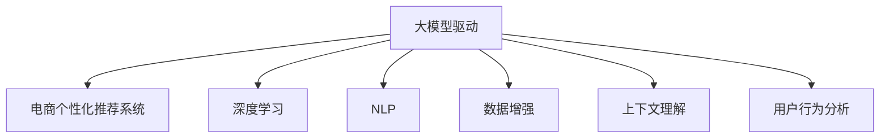

                 

# 大模型驱动的电商个性化购物指南

> 关键词：大模型驱动, 电商个性化, 购物指南, 推荐系统, 自然语言处理, 深度学习, 数据增强, 上下文理解, 用户行为分析

## 1. 背景介绍

### 1.1 问题由来
在当前数字化时代，电子商务市场迅猛发展，消费者购物行为日益复杂，个性化需求日益凸显。如何精准识别用户需求，高效推荐商品，提升用户体验和交易转化率，是电商领域亟待解决的重大挑战。传统的推荐系统依赖用户行为数据，难以突破推荐内容同质化问题，而新兴的大模型驱动的个性化推荐系统，通过自然语言处理和大规模预训练模型，有望显著改善推荐质量，实现电商用户需求的个性化匹配。

## 2. 核心概念与联系

### 2.1 核心概念概述

为更好地理解大模型驱动的电商个性化推荐系统，本节将介绍几个密切相关的核心概念：

- 大模型驱动(Size-Model-Driven)：指利用深度学习模型，特别是大规模预训练语言模型，从大规模文本数据中学习通用知识，并通过迁移学习、微调等方法，提取用户个性化需求，生成个性化推荐结果的推荐系统范式。

- 电商个性化推荐系统(E-Commerce Personalized Recommendation System)：根据电商用户的历史行为、浏览记录、评价反馈等数据，结合大模型提取的用户特征，为每个用户生成个性化的商品推荐列表的系统。

- 推荐系统(Recommendation System)：使用机器学习算法，根据用户兴趣和历史行为，推荐商品、文章、视频等内容的系统。电商个性化推荐系统属于推荐系统的一种特殊形式，侧重于电商用户的购物需求。

- 自然语言处理(Natural Language Processing, NLP)：利用深度学习模型处理、分析和生成自然语言文本的学科。电商个性化推荐系统需要应用NLP技术，从用户评论、商品描述等文本中提取有用信息。

- 深度学习(Deep Learning)：一类基于神经网络的机器学习方法，通过多层次的非线性特征提取，实现复杂的模式识别和数据建模。电商个性化推荐系统依赖深度学习模型提取用户需求和商品特征。

- 数据增强(Data Augmentation)：通过对训练数据进行增广处理，扩充数据集规模，提升模型泛化能力。电商个性化推荐系统常使用数据增强方法丰富用户行为数据，减少过拟合风险。

- 上下文理解(Contextual Understanding)：指模型能够理解用户行为背后的上下文信息，如时间、地点、情境等。电商个性化推荐系统需要理解用户在不同场景下的需求变化，实现更为精准的推荐。

- 用户行为分析(User Behavior Analysis)：通过分析用户行为数据，了解用户兴趣偏好、购买意愿等信息，指导推荐系统的个性化生成。电商个性化推荐系统常采用用户行为分析方法，构建用户画像，提升推荐效果。

这些核心概念之间的逻辑关系可以通过以下Mermaid流程图来展示：



这个流程图展示了大模型驱动的电商个性化推荐系统的核心概念及其之间的关系：

1. 大模型驱动基于深度学习和大规模预训练模型。
2. 电商个性化推荐系统是大模型驱动的具体应用场景。
3. 深度学习和大规模预训练模型是技术实现的核心工具。
4. 自然语言处理、数据增强、上下文理解和用户行为分析等技术手段，共同支撑电商个性化推荐系统的构建和优化。

## 3. 核心算法原理 & 具体操作步骤

### 3.1 算法原理概述

大模型驱动的电商个性化推荐系统主要依赖深度学习和大规模预训练模型。通过预训练模型学习海量的文本数据，学习通用的语言和知识表示，然后在电商用户的购物行为数据上进行微调，提取用户个性化需求，生成个性化推荐结果。

算法核心流程如下：

1. **预训练模型选择与加载**：选择合适的预训练模型，如BERT、GPT等，并加载到系统中。
2. **数据预处理**：清洗、归一化电商用户的行为数据、评论数据、商品数据等，构建合适的训练样本。
3. **模型微调**：使用电商用户数据对预训练模型进行微调，提取用户需求和商品特征。
4. **个性化推荐**：结合微调后的模型和用户行为数据，生成个性化推荐结果，反馈给用户。
5. **反馈优化**：收集用户反馈，重新训练模型，不断优化推荐效果。

### 3.2 算法步骤详解

以下是大模型驱动的电商个性化推荐系统详细的算法步骤：

**Step 1: 数据预处理**

电商用户的行为数据、评论数据和商品数据需要经过清洗、归一化、特征提取等预处理步骤，构建训练样本。具体流程包括：

1. **数据清洗**：去除无用的噪声数据，如非数字字符、缺失值等。
2. **归一化**：对数据进行标准化处理，如将评分数据归一化到[0,1]区间。
3. **特征提取**：将文本数据转换为模型可处理的数字向量，如使用BertEmbedding将商品描述和用户评论转换为向量表示。

**Step 2: 模型选择与加载**

选择合适的预训练模型，如BERT、GPT等，并加载到系统中。例如：

```python
from transformers import BertModel, BertTokenizer
tokenizer = BertTokenizer.from_pretrained('bert-base-uncased')
model = BertModel.from_pretrained('bert-base-uncased')
```

**Step 3: 模型微调**

使用电商用户数据对预训练模型进行微调，提取用户需求和商品特征。具体步骤包括：

1. **构建训练集**：将用户行为数据、评论数据和商品数据构建为训练样本。
2. **模型初始化**：将预训练模型的参数作为初始化权重，加载到微调模型中。
3. **训练微调模型**：使用训练集对微调模型进行迭代训练，更新模型参数。

**Step 4: 个性化推荐**

结合微调后的模型和用户行为数据，生成个性化推荐结果，反馈给用户。具体流程如下：

1. **用户画像构建**：使用微调模型提取用户的行为特征、兴趣偏好等。
2. **商品特征提取**：使用微调模型提取商品的描述、属性等特征。
3. **推荐生成**：根据用户画像和商品特征，生成个性化推荐列表。
4. **推荐展示**：将推荐列表展示给用户，并收集用户反馈。

**Step 5: 反馈优化**

收集用户反馈，重新训练模型，不断优化推荐效果。具体步骤包括：

1. **反馈收集**：收集用户对推荐结果的评分、点击率、购买率等反馈数据。
2. **模型重训练**：根据反馈数据，重新训练微调模型，更新模型参数。
3. **效果评估**：使用测试集评估模型的推荐效果，并不断调整参数，优化推荐结果。

### 3.3 算法优缺点

大模型驱动的电商个性化推荐系统具有以下优点：

1. **高质量推荐**：大模型能够学习到丰富的语言和知识表示，提供高质量的个性化推荐。
2. **高效迭代**：微调过程可以快速迭代，提升推荐效果，满足用户实时需求。
3. **泛化能力强**：通过微调模型，能够处理不同用户、不同商品的多样化需求。
4. **适应性强**：通过不断收集用户反馈，微调模型能够适应数据分布的变化。

同时，该算法也存在一定的局限性：

1. **数据需求高**：微调过程需要大量的电商用户数据，数据获取成本较高。
2. **模型复杂**：大规模预训练模型参数量庞大，计算资源消耗大。
3. **过度拟合风险**：电商数据噪声较多，微调模型容易过拟合。
4. **实时性挑战**：大规模模型推理速度较慢，实时推荐存在延迟。

尽管存在这些局限性，但就目前而言，大模型驱动的推荐系统仍然是目前电商个性化推荐的最主流范式。未来相关研究的重点在于如何进一步降低数据需求，提高模型实时性，同时兼顾用户隐私和数据安全性。

### 3.4 算法应用领域

大模型驱动的电商个性化推荐系统在以下领域得到了广泛应用：

- 商品推荐：根据用户历史行为和浏览记录，推荐相关商品。
- 价格优化：根据用户对商品价格的反馈，动态调整商品定价。
- 广告投放：根据用户画像，精准投放广告。
- 库存管理：根据用户购买趋势，优化商品库存。
- 用户画像分析：构建详细的用户画像，进行精准营销。

除了这些常见的应用外，大模型驱动的推荐系统还在用户行为分析、供应链管理、金融风控等诸多领域展现了强大的潜力。

## 4. 数学模型和公式 & 详细讲解 & 举例说明

### 4.1 数学模型构建

本节将使用数学语言对大模型驱动的电商个性化推荐系统进行更加严格的刻画。

记电商用户行为数据为 $D=\{(x_i,y_i)\}_{i=1}^N, x_i \in \mathcal{X}, y_i \in \mathcal{Y}$，其中 $\mathcal{X}$ 为用户行为数据集，$\mathcal{Y}$ 为用户行为标签集。假设微调后的模型为 $M_{\theta}:\mathcal{X} \rightarrow \mathcal{Y}$，其中 $\theta$ 为微调后的模型参数。定义模型 $M_{\theta}$ 在输入 $x$ 上的损失函数为 $\ell(M_{\theta}(x),y)$，则在数据集 $D$ 上的经验风险为：

$$
\mathcal{L}(\theta) = \frac{1}{N}\sum_{i=1}^N \ell(M_{\theta}(x_i),y_i)
$$

微调的优化目标是最小化经验风险，即找到最优参数：

$$
\theta^* = \mathop{\arg\min}_{\theta} \mathcal{L}(\theta)
$$

在实践中，我们通常使用基于梯度的优化算法（如SGD、Adam等）来近似求解上述最优化问题。设 $\eta$ 为学习率，$\lambda$ 为正则化系数，则参数的更新公式为：

$$
\theta \leftarrow \theta - \eta \nabla_{\theta}\mathcal{L}(\theta) - \eta\lambda\theta
$$

其中 $\nabla_{\theta}\mathcal{L}(\theta)$ 为损失函数对参数 $\theta$ 的梯度，可通过反向传播算法高效计算。

### 4.2 公式推导过程

以下我们以推荐系统中的二分类任务为例，推导交叉熵损失函数及其梯度的计算公式。

假设模型 $M_{\theta}$ 在输入 $x$ 上的输出为 $\hat{y}=M_{\theta}(x) \in [0,1]$，表示用户对商品感兴趣的概率。真实标签 $y \in \{0,1\}$。则二分类交叉熵损失函数定义为：

$$
\ell(M_{\theta}(x),y) = -[y\log \hat{y} + (1-y)\log (1-\hat{y})]
$$

将其代入经验风险公式，得：

$$
\mathcal{L}(\theta) = -\frac{1}{N}\sum_{i=1}^N [y_i\log M_{\theta}(x_i)+(1-y_i)\log(1-M_{\theta}(x_i))]
$$

根据链式法则，损失函数对参数 $\theta_k$ 的梯度为：

$$
\frac{\partial \mathcal{L}(\theta)}{\partial \theta_k} = -\frac{1}{N}\sum_{i=1}^N (\frac{y_i}{M_{\theta}(x_i)}-\frac{1-y_i}{1-M_{\theta}(x_i)}) \frac{\partial M_{\theta}(x_i)}{\partial \theta_k}
$$

其中 $\frac{\partial M_{\theta}(x_i)}{\partial \theta_k}$ 可进一步递归展开，利用自动微分技术完成计算。

在得到损失函数的梯度后，即可带入参数更新公式，完成模型的迭代优化。重复上述过程直至收敛，最终得到适应电商用户需求的最优模型参数 $\theta^*$。

### 4.3 案例分析与讲解

以电商商品推荐为例，假设我们有一个基于BERT的电商推荐系统，通过用户行为数据和商品描述对模型进行微调。

首先，定义电商推荐任务的数据处理函数：

```python
from transformers import BertTokenizer
from torch.utils.data import Dataset

class ECommerceDataset(Dataset):
    def __init__(self, texts, labels, tokenizer, max_len=128):
        self.texts = texts
        self.labels = labels
        self.tokenizer = tokenizer
        self.max_len = max_len
        
    def __len__(self):
        return len(self.texts)
    
    def __getitem__(self, item):
        text = self.texts[item]
        label = self.labels[item]
        
        encoding = self.tokenizer(text, return_tensors='pt', max_length=self.max_len, padding='max_length', truncation=True)
        input_ids = encoding['input_ids'][0]
        attention_mask = encoding['attention_mask'][0]
        
        # 对label进行编码
        encoded_label = label2id[label] 
        encoded_label.extend([label2id['O']] * (self.max_len - len(encoded_label)))
        labels = torch.tensor(encoded_label, dtype=torch.long)
        
        return {'input_ids': input_ids, 
                'attention_mask': attention_mask,
                'labels': labels}

# 标签与id的映射
label2id = {'O': 0, 'Buy': 1, 'Ignore': 2}
id2label = {v: k for k, v in label2id.items()}

# 创建dataset
tokenizer = BertTokenizer.from_pretrained('bert-base-uncased')

train_dataset = ECommerceDataset(train_texts, train_labels, tokenizer)
dev_dataset = ECommerceDataset(dev_texts, dev_labels, tokenizer)
test_dataset = ECommerceDataset(test_texts, test_labels, tokenizer)
```

然后，定义模型和优化器：

```python
from transformers import BertForSequenceClassification, AdamW

model = BertForSequenceClassification.from_pretrained('bert-base-uncased', num_labels=len(label2id))

optimizer = AdamW(model.parameters(), lr=2e-5)
```

接着，定义训练和评估函数：

```python
from torch.utils.data import DataLoader
from tqdm import tqdm
from sklearn.metrics import classification_report

device = torch.device('cuda') if torch.cuda.is_available() else torch.device('cpu')
model.to(device)

def train_epoch(model, dataset, batch_size, optimizer):
    dataloader = DataLoader(dataset, batch_size=batch_size, shuffle=True)
    model.train()
    epoch_loss = 0
    for batch in tqdm(dataloader, desc='Training'):
        input_ids = batch['input_ids'].to(device)
        attention_mask = batch['attention_mask'].to(device)
        labels = batch['labels'].to(device)
        model.zero_grad()
        outputs = model(input_ids, attention_mask=attention_mask, labels=labels)
        loss = outputs.loss
        epoch_loss += loss.item()
        loss.backward()
        optimizer.step()
    return epoch_loss / len(dataloader)

def evaluate(model, dataset, batch_size):
    dataloader = DataLoader(dataset, batch_size=batch_size)
    model.eval()
    preds, labels = [], []
    with torch.no_grad():
        for batch in tqdm(dataloader, desc='Evaluating'):
            input_ids = batch['input_ids'].to(device)
            attention_mask = batch['attention_mask'].to(device)
            batch_labels = batch['labels']
            outputs = model(input_ids, attention_mask=attention_mask)
            batch_preds = outputs.logits.argmax(dim=2).to('cpu').tolist()
            batch_labels = batch_labels.to('cpu').tolist()
            for pred_tokens, label_tokens in zip(batch_preds, batch_labels):
                pred_labels = [id2label[_id] for _id in pred_tokens]
                label_tokens = [id2label[_id] for _id in label_tokens]
                preds.append(pred_labels[:len(label_tokens)])
                labels.append(label_tokens)
                
    print(classification_report(labels, preds))
```

最后，启动训练流程并在测试集上评估：

```python
epochs = 5
batch_size = 16

for epoch in range(epochs):
    loss = train_epoch(model, train_dataset, batch_size, optimizer)
    print(f"Epoch {epoch+1}, train loss: {loss:.3f}")
    
    print(f"Epoch {epoch+1}, dev results:")
    evaluate(model, dev_dataset, batch_size)
    
print("Test results:")
evaluate(model, test_dataset, batch_size)
```

以上就是使用PyTorch对BERT进行电商商品推荐任务微调的完整代码实现。可以看到，得益于Transformers库的强大封装，我们可以用相对简洁的代码完成BERT模型的加载和微调。

## 5. 项目实践：代码实例和详细解释说明

### 5.1 开发环境搭建

在进行微调实践前，我们需要准备好开发环境。以下是使用Python进行PyTorch开发的环境配置流程：

1. 安装Anaconda：从官网下载并安装Anaconda，用于创建独立的Python环境。

2. 创建并激活虚拟环境：
```bash
conda create -n pytorch-env python=3.8 
conda activate pytorch-env
```

3. 安装PyTorch：根据CUDA版本，从官网获取对应的安装命令。例如：
```bash
conda install pytorch torchvision torchaudio cudatoolkit=11.1 -c pytorch -c conda-forge
```

4. 安装Transformers库：
```bash
pip install transformers
```

5. 安装各类工具包：
```bash
pip install numpy pandas scikit-learn matplotlib tqdm jupyter notebook ipython
```

完成上述步骤后，即可在`pytorch-env`环境中开始微调实践。

### 5.2 源代码详细实现

这里我们以电商商品推荐为例，给出使用Transformers库对BERT模型进行微调的PyTorch代码实现。

首先，定义电商推荐任务的数据处理函数：

```python
from transformers import BertTokenizer
from torch.utils.data import Dataset
import torch

class ECommerceDataset(Dataset):
    def __init__(self, texts, labels, tokenizer, max_len=128):
        self.texts = texts
        self.labels = labels
        self.tokenizer = tokenizer
        self.max_len = max_len
        
    def __len__(self):
        return len(self.texts)
    
    def __getitem__(self, item):
        text = self.texts[item]
        label = self.labels[item]
        
        encoding = self.tokenizer(text, return_tensors='pt', max_length=self.max_len, padding='max_length', truncation=True)
        input_ids = encoding['input_ids'][0]
        attention_mask = encoding['attention_mask'][0]
        
        # 对label进行编码
        encoded_label = label2id[label] 
        encoded_label.extend([label2id['O']] * (self.max_len - len(encoded_label)))
        labels = torch.tensor(encoded_label, dtype=torch.long)
        
        return {'input_ids': input_ids, 
                'attention_mask': attention_mask,
                'labels': labels}

# 标签与id的映射
label2id = {'O': 0, 'Buy': 1, 'Ignore': 2}
id2label = {v: k for k, v in label2id.items()}

# 创建dataset
tokenizer = BertTokenizer.from_pretrained('bert-base-uncased')

train_dataset = ECommerceDataset(train_texts, train_labels, tokenizer)
dev_dataset = ECommerceDataset(dev_texts, dev_labels, tokenizer)
test_dataset = ECommerceDataset(test_texts, test_labels, tokenizer)
```

然后，定义模型和优化器：

```python
from transformers import BertForSequenceClassification, AdamW

model = BertForSequenceClassification.from_pretrained('bert-base-uncased', num_labels=len(label2id))

optimizer = AdamW(model.parameters(), lr=2e-5)
```

接着，定义训练和评估函数：

```python
from torch.utils.data import DataLoader
from tqdm import tqdm
from sklearn.metrics import classification_report

device = torch.device('cuda') if torch.cuda.is_available() else torch.device('cpu')
model.to(device)

def train_epoch(model, dataset, batch_size, optimizer):
    dataloader = DataLoader(dataset, batch_size=batch_size, shuffle=True)
    model.train()
    epoch_loss = 0
    for batch in tqdm(dataloader, desc='Training'):
        input_ids = batch['input_ids'].to(device)
        attention_mask = batch['attention_mask'].to(device)
        labels = batch['labels'].to(device)
        model.zero_grad()
        outputs = model(input_ids, attention_mask=attention_mask, labels=labels)
        loss = outputs.loss
        epoch_loss += loss.item()
        loss.backward()
        optimizer.step()
    return epoch_loss / len(dataloader)

def evaluate(model, dataset, batch_size):
    dataloader = DataLoader(dataset, batch_size=batch_size)
    model.eval()
    preds, labels = [], []
    with torch.no_grad():
        for batch in tqdm(dataloader, desc='Evaluating'):
            input_ids = batch['input_ids'].to(device)
            attention_mask = batch['attention_mask'].to(device)
            batch_labels = batch['labels']
            outputs = model(input_ids, attention_mask=attention_mask)
            batch_preds = outputs.logits.argmax(dim=2).to('cpu').tolist()
            batch_labels = batch_labels.to('cpu').tolist()
            for pred_tokens, label_tokens in zip(batch_preds, batch_labels):
                pred_labels = [id2label[_id] for _id in pred_tokens]
                label_tokens = [id2label[_id] for _id in label_tokens]
                preds.append(pred_labels[:len(label_tokens)])
                labels.append(label_tokens)
                
    print(classification_report(labels, preds))
```

最后，启动训练流程并在测试集上评估：

```python
epochs = 5
batch_size = 16

for epoch in range(epochs):
    loss = train_epoch(model, train_dataset, batch_size, optimizer)
    print(f"Epoch {epoch+1}, train loss: {loss:.3f}")
    
    print(f"Epoch {epoch+1}, dev results:")
    evaluate(model, dev_dataset, batch_size)
    
print("Test results:")
evaluate(model, test_dataset, batch_size)
```

以上就是使用PyTorch对BERT进行电商商品推荐任务微调的完整代码实现。可以看到，得益于Transformers库的强大封装，我们可以用相对简洁的代码完成BERT模型的加载和微调。

## 6. 实际应用场景

### 6.1 智能客服系统

基于大模型驱动的电商个性化推荐系统，可以广泛应用于智能客服系统的构建。传统客服往往需要配备大量人力，高峰期响应缓慢，且一致性和专业性难以保证。而使用基于推荐系统的智能客服系统，可以实时回答用户问题，快速响应客户咨询，用自然流畅的语言解答各类常见问题。

在技术实现上，可以收集企业内部的历史客服对话记录，将问题-答案对作为推荐任务，训练推荐模型，推荐系统根据用户输入的文本描述，自动匹配最佳答案。对于客户提出的新问题，还可以接入检索系统实时搜索相关内容，动态组织生成回答。如此构建的智能客服系统，能大幅提升客户咨询体验和问题解决效率。

### 6.2 金融舆情监测

金融机构需要实时监测市场舆论动向，以便及时应对负面信息传播，规避金融风险。传统的人工监测方式成本高、效率低，难以应对网络时代海量信息爆发的挑战。基于大模型驱动的文本分类和情感分析技术，为金融舆情监测提供了新的解决方案。

具体而言，可以收集金融领域相关的新闻、报道、评论等文本数据，并对其进行主题标注和情感标注。在此基础上对预训练语言模型进行微调，使其能够自动判断文本属于何种主题，情感倾向是正面、中性还是负面。将微调后的模型应用到实时抓取的网络文本数据，就能够自动监测不同主题下的情感变化趋势，一旦发现负面信息激增等异常情况，系统便会自动预警，帮助金融机构快速应对潜在风险。

### 6.3 个性化推荐系统

当前的推荐系统往往只依赖用户历史行为数据进行物品推荐，无法深入理解用户的真实兴趣偏好。基于大模型驱动的推荐系统，能够从电商用户的历史行为、浏览记录、评论反馈等数据中学习，构建详细的用户画像，结合商品描述、属性等特征，生成个性化推荐列表。

在技术实现上，可以收集用户浏览、点击、评论、分享等行为数据，提取和商品描述、标签等文本内容。使用大模型提取用户特征和商品特征，根据相似度计算推荐结果。结合用户画像，生成更加精准的推荐列表。用户反馈的数据可以用于模型微调，不断优化推荐效果。

## 7. 工具和资源推荐

### 7.1 学习资源推荐

为了帮助开发者系统掌握大模型驱动的电商个性化推荐系统理论基础和实践技巧，这里推荐一些优质的学习资源：

1. 《深度学习与自然语言处理》系列博文：由大模型技术专家撰写，深入浅出地介绍了深度学习和大规模预训练模型在NLP中的应用。

2. 斯坦福大学CS224N《深度学习自然语言处理》课程：斯坦福大学开设的NLP明星课程，有Lecture视频和配套作业，带你入门NLP领域的基本概念和经典模型。

3. 《Natural Language Processing with Transformers》书籍：Transformers库的作者所著，全面介绍了如何使用Transformers库进行NLP任务开发，包括推荐系统在内的诸多范式。

4. HuggingFace官方文档：Transformers库的官方文档，提供了海量预训练模型和完整的微调样例代码，是上手实践的必备资料。

5. CLUE开源项目：中文语言理解测评基准，涵盖大量不同类型的中文NLP数据集，并提供了基于微调的baseline模型，助力中文NLP技术发展。

通过对这些资源的学习实践，相信你一定能够快速掌握大模型驱动的电商个性化推荐系统的精髓，并用于解决实际的NLP问题。

### 7.2 开发工具推荐

高效的开发离不开优秀的工具支持。以下是几款用于大模型驱动的电商个性化推荐系统开发的常用工具：

1. PyTorch：基于Python的开源深度学习框架，灵活动态的计算图，适合快速迭代研究。大部分预训练语言模型都有PyTorch版本的实现。

2. TensorFlow：由Google主导开发的开源深度学习框架，生产部署方便，适合大规模工程应用。同样有丰富的预训练语言模型资源。

3. Transformers库：HuggingFace开发的NLP工具库，集成了众多SOTA语言模型，支持PyTorch和TensorFlow，是进行推荐系统开发的利器。

4. Weights & Biases：模型训练的实验跟踪工具，可以记录和可视化模型训练过程中的各项指标，方便对比和调优。与主流深度学习框架无缝集成。

5. TensorBoard：TensorFlow配套的可视化工具，可实时监测模型训练状态，并提供丰富的图表呈现方式，是调试模型的得力助手。

6. Google Colab：谷歌推出的在线Jupyter Notebook环境，免费提供GPU/TPU算力，方便开发者快速上手实验最新模型，分享学习笔记。

合理利用这些工具，可以显著提升大模型驱动的电商个性化推荐系统的开发效率，加快创新迭代的步伐。

### 7.3 相关论文推荐

大模型驱动的电商个性化推荐系统的发展源于学界的持续研究。以下是几篇奠基性的相关论文，推荐阅读：

1. Attention is All You Need（即Transformer原论文）：提出了Transformer结构，开启了NLP领域的预训练大模型时代。

2. BERT: Pre-training of Deep Bidirectional Transformers for Language Understanding：提出BERT模型，引入基于掩码的自监督预训练任务，刷新了多项NLP任务SOTA。

3. Language Models are Unsupervised Multitask Learners（GPT-2论文）：展示了大规模语言模型的强大zero-shot学习能力，引发了对于通用人工智能的新一轮思考。

4. Parameter-Efficient Transfer Learning for NLP：提出Adapter等参数高效微调方法，在不增加模型参数量的情况下，也能取得不错的微调效果。

5. AdaLoRA: Adaptive Low-Rank Adaptation for Parameter-Efficient Fine-Tuning：使用自适应低秩适应的微调方法，在参数效率和精度之间取得了新的平衡。

这些论文代表了大模型驱动的电商个性化推荐系统的发展脉络。通过学习这些前沿成果，可以帮助研究者把握学科前进方向，激发更多的创新灵感。

## 8. 总结：未来发展趋势与挑战

### 8.1 总结

本文对大模型驱动的电商个性化推荐系统进行了全面系统的介绍。首先阐述了电商个性化推荐系统的研究背景和意义，明确了电商推荐系统在大规模电商市场中的重要性和迫切需求。其次，从原理到实践，详细讲解了大模型驱动的推荐系统数学原理和关键步骤，给出了电商推荐任务开发的完整代码实例。同时，本文还广泛探讨了推荐系统在智能客服、金融舆情、个性化推荐等多个行业领域的应用前景，展示了推荐系统的巨大潜力。此外，本文精选了推荐技术的各类学习资源，力求为读者提供全方位的技术指引。

通过本文的系统梳理，可以看到，大模型驱动的电商个性化推荐系统正在成为电商推荐系统的最主流范式，极大地拓展了电商推荐系统的应用边界，催生了更多的落地场景。得益于大规模语料的预训练，推荐系统能够从电商用户的海量数据中学习，提供高质量的个性化推荐。未来，伴随预训练语言模型和微调方法的持续演进，相信电商推荐系统将在更广阔的应用领域大放异彩，深刻影响人类的生产生活方式。

### 8.2 未来发展趋势

展望未来，大模型驱动的电商个性化推荐系统将呈现以下几个发展趋势：

1. **模型规模持续增大**。随着算力成本的下降和数据规模的扩张，预训练语言模型的参数量还将持续增长。超大规模语言模型蕴含的丰富语言知识，有望支撑更加复杂多变的电商推荐任务。

2. **推荐范式日趋多样**。除了传统的全参数微调外，未来会涌现更多参数高效的推荐方法，如Adapter、LoRA等，在节省计算资源的同时也能保证推荐精度。

3. **持续学习成为常态**。随着数据分布的不断变化，推荐模型也需要持续学习新知识以保持性能。如何在不遗忘原有知识的同时，高效吸收新样本信息，将成为重要的研究课题。

4. **标注样本需求降低**。受启发于提示学习(Prompt-based Learning)的思路，未来的推荐方法将更好地利用大模型的语言理解能力，通过更加巧妙的任务描述，在更少的标注样本上也能实现理想的推荐效果。

5. **多模态推荐崛起**。当前的推荐主要聚焦于纯文本数据，未来会进一步拓展到图像、视频、语音等多模态数据推荐。多模态信息的融合，将显著提升推荐系统对现实世界的理解和建模能力。

6. **模型通用性增强**。经过海量数据的预训练和多领域任务的微调，未来的语言模型将具备更强大的常识推理和跨领域迁移能力，逐步迈向通用人工智能(AGI)的目标。

以上趋势凸显了大模型驱动的电商推荐系统的广阔前景。这些方向的探索发展，必将进一步提升推荐系统的性能和应用范围，为电商市场带来变革性影响。

### 8.3 面临的挑战

尽管大模型驱动的电商推荐系统已经取得了瞩目成就，但在迈向更加智能化、普适化应用的过程中，它仍面临着诸多挑战：

1. **数据需求高**。推荐系统需要大量的电商用户数据，数据获取成本较高。如何在不牺牲推荐效果的情况下，降低数据需求，是未来的研究方向。

2. **模型鲁棒性不足**。当前推荐模型面对域外数据时，泛化性能往往大打折扣。对于测试样本的微小扰动，推荐模型的预测也容易发生波动。如何提高推荐模型的鲁棒性，避免灾难性遗忘，还需要更多理论和实践的积累。

3. **实时性挑战**。大规模模型推理速度较慢，实时推荐存在延迟。如何在保证性能的同时，优化推理速度，缩短推荐响应时间，将是重要的优化方向。

4. **用户隐私和数据安全**。电商推荐系统需要收集和分析用户数据，如何保护用户隐私和数据安全，避免数据泄露，也是重要课题。

5. **推荐冷启动问题**。对于新用户和新商品，缺乏足够的历史行为数据，难以进行精准推荐。如何通过冷启动策略，快速构建用户画像和商品特征，提升推荐效果，是推荐系统的重要研究方向。

6. **推荐内容同质化**。随着推荐系统的普及，用户逐渐陷入推荐算法构建的"信息茧房"，推荐内容逐渐同质化，难以突破。如何避免推荐算法导致的用户信息窄化，是推荐系统的重要挑战。

这些挑战凸显了大模型驱动的电商推荐系统面临的多维度问题。解决这些挑战，需要从数据获取、模型训练、推荐算法、用户体验等多个方面进行全面优化，才能真正实现个性化推荐的智能化和普及化。

### 8.4 研究展望

面对大模型驱动的电商推荐系统所面临的种种挑战，未来的研究需要在以下几个方面寻求新的突破：

1. **探索无监督和半监督推荐方法**。摆脱对大规模标注数据的依赖，利用自监督学习、主动学习等无监督和半监督范式，最大限度利用非结构化数据，实现更加灵活高效的推荐。

2. **研究参数高效和计算高效的推荐范式**。开发更加参数高效的推荐方法，在固定大部分预训练参数的同时，只更新极少量的任务相关参数。同时优化推荐模型的计算图，减少前向传播和反向传播的资源消耗，实现更加轻量级、实时性的部署。

3. **融合因果和对比学习范式**。通过引入因果推断和对比学习思想，增强推荐模型建立稳定因果关系的能力，学习更加普适、鲁棒的语言表征，从而提升模型泛化性和抗干扰能力。

4. **引入更多先验知识**。将符号化的先验知识，如知识图谱、逻辑规则等，与神经网络模型进行巧妙融合，引导推荐过程学习更准确、合理的商品特征。同时加强不同模态数据的整合，实现视觉、语音等多模态信息与文本信息的协同建模。

5. **结合因果分析和博弈论工具**。将因果分析方法引入推荐模型，识别出模型决策的关键特征，增强推荐输出的因果性和逻辑性。借助博弈论工具刻画人机交互过程，主动探索并规避推荐模型的脆弱点，提高系统稳定性。

6. **纳入伦理道德约束**。在推荐模型训练目标中引入伦理导向的评估指标，过滤和惩罚有偏见、有害的输出倾向。同时加强人工干预和审核，建立推荐行为的监管机制，确保推荐结果符合人类价值观和伦理道德。

这些研究方向的探索，必将引领大模型驱动的电商推荐系统迈向更高的台阶，为构建安全、可靠、可解释、可控的推荐系统铺平道路。面向未来，大模型驱动的推荐系统还需要与其他人工智能技术进行更深入的融合，如知识表示、因果推理、强化学习等，多路径协同发力，共同推动电商推荐系统的进步。只有勇于创新、敢于突破，才能不断拓展电商推荐系统的边界，让推荐技术更好地造福电商市场和用户。

## 9. 附录：常见问题与解答

**Q1：电商推荐系统是否适用于所有电商市场？**

A: 电商推荐系统适用于大多数电商市场，尤其是数据量充足、用户行为多样化的市场。但对于一些数据稀疏、用户行为单一的市场，如小型本地电商，推荐系统的效果可能不佳。此时需要结合线下推荐、人工干预等手段，补充电商推荐系统的不足。

**Q2：电商推荐系统如何应对新商品推荐问题？**

A: 对于新商品推荐，推荐系统可以通过以下几种方式解决：

1. **数据收集**：收集新商品的相关数据，如用户评论、商品描述、标签等，用于训练推荐模型。

2. **标签扩充**：给新商品打上标签，通过微调模型，学习新商品的特征。

3. **相似商品推荐**：基于新商品与已有商品的相似度，推荐类似的商品。

4. **冷启动策略**：采用基于内容的推荐、协同过滤等方法，快速为新商品和用户画像。

**Q3：电商推荐系统如何平衡个性化和多样性？**

A: 电商推荐系统需要平衡个性化和多样性，防止过度推荐同质化商品。以下几种方法可以尝试：

1. **多样性约束**：在推荐算法中加入多样性约束，限制推荐商品的多样性，避免过度个性化。

2. **推荐组合**：结合个性化推荐和多样化推荐，推荐多种不同类型的商品，增加用户体验的多样性。

3. **用户画像**：通过构建详细的用户画像，了解用户的偏好和需求，精准推荐个性化商品，同时考虑多种商品类型，丰富用户体验。

4. **用户反馈**：收集用户对推荐结果的反馈，动态调整推荐策略，实现个性化和多样性的平衡。

**Q4：电商推荐系统如何处理用户隐私问题？**

A: 电商推荐系统需要收集和分析用户数据，如何保护用户隐私和数据安全，避免数据泄露，是重要课题。以下几种方法可以尝试：

1. **匿名化处理**：对用户数据进行匿名化处理，去除敏感信息，保护用户隐私。

2. **数据加密**：采用数据加密技术，保护用户数据的传输和存储安全。

3. **权限控制**：限制系统对用户数据的访问权限，确保数据访问合法性。

4. **隐私保护算法**：采用差分隐私、联邦学习等隐私保护算法，保护用户数据的隐私。

5. **用户知情同意**：确保用户对数据收集和使用知情同意，透明化数据使用规则。

**Q5：电商推荐系统如何避免推荐内容同质化？**

A: 电商推荐系统需要避免推荐内容同质化，以下几种方法可以尝试：

1. **推荐多样化**：通过多样性约束、推荐组合等方法，推荐多种不同类型的商品，增加商品多样性。

2. **内容丰富化**：在商品描述、标签等文本数据中加入更多维度，增加商品内容的丰富性。

3. **用户画像精细化**：通过用户行为分析、情感分析等方法，了解用户的深层次需求，推荐更加多样化的商品。

4. **动态调整**：根据用户反馈和行为变化，动态调整推荐策略，适应用户需求的动态变化。

**Q6：电商推荐系统如何优化模型实时性？**

A: 电商推荐系统需要优化模型实时性，以下几种方法可以尝试：

1. **模型裁剪**：去除不必要的层和参数，减小模型尺寸，加快推理速度。

2. **量化加速**：将浮点模型转为定点模型，压缩存储空间，提高计算效率。

3. **模型并行**：采用模型并行、数据并行等技术，提高模型的计算效率。

4. **缓存机制**：采用缓存机制，减少重复计算，提高推荐速度。

5. **分布式计算**：采用分布式计算技术，将模型计算分布在多台服务器上，提高计算效率。

综上所述，大模型驱动的电商个性化推荐系统在电商市场具有广泛的应用前景。通过不断优化数据获取、模型训练、推荐算法等环节，可以进一步提升推荐系统的智能化水平，提升用户体验和交易转化率。但同时也需要注意隐私保护、数据安全、推荐同质化等问题，实现个性化推荐与用户体验的平衡。未来，伴随着算力成本的下降和数据量的增加，推荐系统将变得更加智能和高效，为电商市场的健康发展注入新的活力。

---

作者：禅与计算机程序设计艺术 / Zen and the Art of Computer Programming

