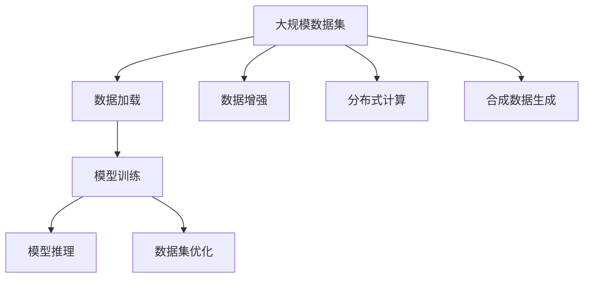

                 

# 大规模数据集处理：加载技巧与合成数据生成

> 关键词：大规模数据集, 数据加载, 数据生成, 数据增强, 分布式数据处理

## 1. 背景介绍

### 1.1 问题由来
在数据驱动的现代人工智能(AI)和机器学习(ML)应用中，数据集的大小和多样性是模型性能和泛化能力的关键因素。随着技术的发展，数据集逐渐增长到了TB级别，甚至PB级别，如何高效地加载和处理这些庞大的数据集成为了一个挑战。同时，在实际应用中，标注数据往往稀缺，而合成数据生成(Synthetic Data Generation)技术可以帮助我们扩充数据集，提升模型训练效率和泛化能力。

### 1.2 问题核心关键点
本节将深入探讨大规模数据集加载技巧和合成数据生成技术，并结合实际应用场景，展示如何利用这些技术提升数据处理的效率和效果。以下是问题研究的几个关键点：

- 数据集加载优化：如何在不同操作系统、不同硬件平台上高效加载大规模数据集？
- 数据增强技术：如何通过扩充数据集和提升数据多样性来改善模型性能？
- 分布式数据处理：如何通过分布式计算技术，将数据集划分为多个部分，并行处理？
- 合成数据生成：如何利用数据生成技术，模拟真实世界数据，扩充训练集？
- 机器学习模型优化：如何结合数据加载和数据生成技术，优化模型训练和推理？

## 2. 核心概念与联系

### 2.1 核心概念概述

为了更好地理解数据集处理和合成数据生成的原理和架构，本节将介绍几个关键概念：

- 大规模数据集(Massive Datasets)：指那些数据量在TB到PB级别，无法一次性加载到内存的数据集。这些数据集通常存储在分布式文件系统或数据库中。
- 数据加载(Data Loading)：指从存储系统读取数据到内存或GPU的过程，是机器学习模型的关键预处理步骤。
- 数据增强(Data Augmentation)：指通过数据变换、扰动等方法，扩充训练集，提高模型的泛化能力。
- 分布式计算(Distributed Computing)：指将大规模数据集分布到多台机器上并行处理，利用集群的计算能力加速数据处理。
- 合成数据生成(Synthetic Data Generation)：指通过算法生成与真实数据集分布相似的新数据，用于训练和测试模型。
- 数据集优化(Dataset Optimization)：指通过数据采样、特征选择、数据预处理等技术，提高数据集的质量和效率。

这些核心概念之间的逻辑关系可以通过以下Mermaid流程图来展示：



这个流程图展示了大规模数据集处理的核心概念及其之间的关系：

1. 大规模数据集通过数据加载、数据增强、分布式计算等技术进行优化，提升处理效率和数据质量。
2. 优化后的数据集被用于模型训练，得到性能更好的模型。
3. 训练好的模型进行推理，并在实际应用中取得效果。
4. 数据集优化是持续进行的，通过不断收集新的数据和改进技术，保持数据集的有效性。

## 3. 核心算法原理 & 具体操作步骤
### 3.1 算法原理概述

本节将对大规模数据集加载和合成数据生成的核心算法原理进行概述。

### 3.2 算法步骤详解

#### 3.2.1 数据加载算法

数据加载是机器学习模型的重要预处理步骤，涉及将数据从存储系统读取到内存或GPU的过程。常见的数据加载算法包括：

- 单线程加载：最基本的数据加载方式，通过顺序遍历文件或数据库，将数据逐个读取到内存。适用于数据量较小的情况。
- 多线程加载：通过创建多个线程，并行读取数据，提升数据加载速度。适用于中等规模的数据集。
- 分布式加载：利用集群的多台机器并行读取数据，进一步提升加载速度。适用于大规模数据集。

#### 3.2.2 数据增强算法

数据增强是一种通过数据变换和扰动等方法，扩充训练集的技术，可以有效提高模型的泛化能力。常见的数据增强算法包括：

- 随机裁剪(Crop)：从原始图像中随机裁剪出子图像，用于训练。适用于图像数据。
- 随机旋转(Rotation)：对图像进行随机旋转，提升数据多样性。适用于图像数据。
- 随机翻转(Flip)：对图像进行随机水平或垂直翻转，提升数据多样性。适用于图像数据。
- 数据噪声(Noise)：向数据中引入随机噪声，提升模型的鲁棒性。适用于图像、文本等多种数据类型。
- 数据混杂(Mixup)：将不同数据样本进行线性混合，生成新的样本。适用于图像、文本等多种数据类型。

#### 3.2.3 分布式计算算法

分布式计算利用集群的多台机器并行处理数据，提升数据处理速度。常见的分布式计算算法包括：

- MapReduce：一种基于键值对的并行计算模型，适用于大规模数据集的批处理。
- Spark：一种基于内存计算的分布式计算框架，支持多种数据处理操作，适用于大规模数据集的实时处理。
- MPI：一种基于进程的并行计算模型，适用于高性能计算环境中的大规模数据处理。

#### 3.2.4 合成数据生成算法

合成数据生成通过算法生成与真实数据集分布相似的新数据，用于训练和测试模型。常见的合成数据生成算法包括：

- GANs（生成对抗网络）：通过生成器和判别器两组对抗模型，生成与真实数据分布相似的新数据。适用于图像、文本等多种数据类型。
- SMOTE（合成少数过采样技术）：通过插值生成少数类别的合成数据，用于平衡数据集。适用于分类任务。
- MixMatch：一种基于未标记数据的生成技术，通过生成和训练组合数据集，提升模型性能。适用于各种数据类型。

### 3.3 算法优缺点

数据加载和合成数据生成技术各有优缺点：

#### 3.3.1 数据加载技术的优缺点

- 优点：
  - 数据加载速度快，适用于大规模数据集。
  - 可以灵活选择加载方式，适应不同的硬件平台。
  - 可以利用分布式计算技术，进一步提升加载速度。

- 缺点：
  - 加载过程可能引入网络延迟和数据不一致问题。
  - 加载方式选择不当可能导致内存占用过高。
  - 数据加载过程中可能存在数据丢失和损坏的风险。

#### 3.3.2 数据增强技术的优缺点

- 优点：
  - 扩充训练集，提高模型泛化能力。
  - 可以灵活选择增强方式，适应不同的数据类型。
  - 减少对标注数据的依赖，降低成本。

- 缺点：
  - 增强数据可能存在噪声，影响模型性能。
  - 生成数据的分布可能与真实数据不同，影响模型泛化。
  - 数据增强过程复杂，需要额外的计算资源和时间。

#### 3.3.3 分布式计算技术的优缺点

- 优点：
  - 利用集群的多台机器并行处理数据，提升处理速度。
  - 可以处理大规模数据集，不受内存限制。
  - 适用于各种数据处理操作，支持批处理和实时处理。

- 缺点：
  - 分布式计算需要额外的硬件和网络资源，成本较高。
  - 集群管理和调度复杂，需要专业人员维护。
  - 数据一致性和网络延迟问题可能影响处理效果。

#### 3.3.4 合成数据生成技术的优缺点

- 优点：
  - 扩充训练集，提高模型泛化能力。
  - 减少对标注数据的依赖，降低成本。
  - 可以生成与真实数据分布相似的新数据，提升模型性能。

- 缺点：
  - 生成的数据可能存在噪声，影响模型性能。
  - 生成数据的分布可能与真实数据不同，影响模型泛化。
  - 合成数据生成过程复杂，需要额外的计算资源和时间。

### 3.4 算法应用领域

数据加载和合成数据生成技术广泛应用于各种机器学习和深度学习领域，包括：

- 图像识别：通过数据增强和合成数据生成，提升模型的泛化能力。
- 自然语言处理(NLP)：通过数据增强和合成数据生成，扩充训练集。
- 语音识别：通过数据增强和合成数据生成，提高模型的鲁棒性。
- 医疗诊断：通过数据增强和合成数据生成，扩充训练集，提升模型准确性。
- 自动驾驶：通过数据增强和合成数据生成，提升模型的环境适应能力。
- 推荐系统：通过数据增强和合成数据生成，提高模型的推荐效果。
- 游戏AI：通过数据增强和合成数据生成，提高游戏的智能化水平。

以上这些应用场景展示了数据加载和合成数据生成技术在AI领域的广泛应用，以及它们对于提升模型性能和泛化能力的重要作用。

## 4. 数学模型和公式 & 详细讲解  
### 4.1 数学模型构建

本节将使用数学语言对大规模数据集加载和合成数据生成的数学模型进行更加严格的刻画。

假设大规模数据集为 $D$，数据集的大小为 $N$，每个样本的特征维度为 $d$，数据集包含 $k$ 个特征 $X$。数据集加载的目标是将 $D$ 中的数据加载到内存或GPU中，用于模型训练。

### 4.2 公式推导过程

以下我们以图像数据集为例，推导数据增强和合成数据生成的数学公式。

#### 4.2.1 数据增强公式

假设原始图像数据集为 $D$，其中每个图像的大小为 $h \times w$，包含 $C$ 个通道。数据增强的目标是生成新的图像数据集 $D'$，其中每个图像的大小和通道数与原始数据集相同。

对于随机裁剪和随机旋转，增强后的图像可以表示为：

$$
x' = \mathcal{T}(x)
$$

其中 $\mathcal{T}$ 表示数据增强的变换函数，可以是随机裁剪、随机旋转等。

对于随机翻转，增强后的图像可以表示为：

$$
x' = \mathcal{F}(x)
$$

其中 $\mathcal{F}$ 表示数据增强的翻转函数，可以是随机水平或垂直翻转。

对于数据噪声，增强后的图像可以表示为：

$$
x' = \mathcal{N}(x, \sigma)
$$

其中 $\sigma$ 表示噪声强度，可以是高斯噪声、椒盐噪声等。

对于数据混杂，增强后的图像可以表示为：

$$
x' = \mathcal{M}(x, y)
$$

其中 $y$ 表示与 $x$ 相同大小的新图像，可以是未标记的数据。

#### 4.2.2 合成数据生成公式

对于GANs模型，生成器和判别器两组对抗模型可以表示为：

$$
G(z) = x
$$

$$
D(x) = p(x)
$$

其中 $G$ 表示生成器，$z$ 表示随机噪声向量，$x$ 表示生成的图像。$p$ 表示判别器，$D(x)$ 表示 $x$ 为真实图像的概率。

对于SMOTE模型，合成少数类别的图像可以表示为：

$$
x' = x + \Delta
$$

其中 $\Delta$ 表示插值向量，可以通过原始图像的特征和标签计算得到。

对于MixMatch模型，组合数据集可以表示为：

$$
x' = \alpha x + (1-\alpha) y
$$

其中 $\alpha$ 表示数据权重，可以通过K-means聚类等方法计算得到。

### 4.3 案例分析与讲解

#### 4.3.1 图像数据增强案例

以CIFAR-10数据集为例，该数据集包含60,000张32x32的彩色图像，每个图像包含10个类别，共有6个类别各有6000张图像，4个类别各有3000张图像。

假设我们要对CIFAR-10数据集进行数据增强，可以通过以下步骤实现：

1. 随机裁剪：从原始图像中随机裁剪出子图像，用于训练。
2. 随机旋转：对图像进行随机旋转，提升数据多样性。
3. 随机翻转：对图像进行随机水平或垂直翻转，提升数据多样性。
4. 数据噪声：向数据中引入随机噪声，提升模型的鲁棒性。
5. 数据混杂：将不同数据样本进行线性混合，生成新的样本。

具体实现代码如下：

```python
import torchvision.transforms as transforms

transform = transforms.Compose([
    transforms.RandomCrop(32, padding=4),
    transforms.RandomHorizontalFlip(),
    transforms.ToTensor(),
    transforms.Normalize((0.4914, 0.4822, 0.4465), (0.2023, 0.1994, 0.2010)),
])
```

#### 4.3.2 图像数据生成案例

以GANs模型为例，可以使用以下代码生成与原始图像分布相似的新图像：

```python
import torch
from torchvision import transforms, datasets
from torchvision.utils import save_image
from torch import nn

class GAN(nn.Module):
    def __init__(self):
        super(GAN, self).__init__()
        self.gen = nn.Sequential(
            nn.Conv2d(100, 256, 4, 1, 0, bias=False),
            nn.BatchNorm2d(256),
            nn.LeakyReLU(0.2, inplace=True),
            nn.Conv2d(256, 512, 4, 2, 1, bias=False),
            nn.BatchNorm2d(512),
            nn.LeakyReLU(0.2, inplace=True),
            nn.Conv2d(512, 1024, 4, 2, 1, bias=False),
            nn.BatchNorm2d(1024),
            nn.LeakyReLU(0.2, inplace=True),
            nn.Conv2d(1024, 3, 4, 1, 0, bias=False),
            nn.Tanh()
        )

    def forward(self, x):
        x = self.gen(x)
        return x

# 定义GAN模型和数据增强变换
model = GAN()
transform = transforms.Compose([
    transforms.RandomCrop(32, padding=4),
    transforms.RandomHorizontalFlip(),
    transforms.ToTensor(),
    transforms.Normalize((0.4914, 0.4822, 0.4465), (0.2023, 0.1994, 0.2010))
])

# 生成新图像
z = torch.randn(1, 100)
fake_image = model(z)

# 保存生成图像
save_image(fake_image, 'fake_image.png')
```

以上代码展示了如何使用GANs模型生成与原始图像分布相似的新图像，并在生成过程中进行数据增强。

## 5. 项目实践：代码实例和详细解释说明
### 5.1 开发环境搭建

在进行大规模数据集处理和合成数据生成的实践前，我们需要准备好开发环境。以下是使用Python进行PyTorch开发的环境配置流程：

1. 安装Anaconda：从官网下载并安装Anaconda，用于创建独立的Python环境。

2. 创建并激活虚拟环境：
```bash
conda create -n pytorch-env python=3.8 
conda activate pytorch-env
```

3. 安装PyTorch：根据CUDA版本，从官网获取对应的安装命令。例如：
```bash
conda install pytorch torchvision torchaudio cudatoolkit=11.1 -c pytorch -c conda-forge
```

4. 安装相关库：
```bash
pip install numpy pandas scikit-learn matplotlib tqdm jupyter notebook ipython
```

完成上述步骤后，即可在`pytorch-env`环境中开始数据处理实践。

### 5.2 源代码详细实现

下面我们以图像数据增强和生成为例，给出使用PyTorch进行数据加载和增强的PyTorch代码实现。

首先，定义图像数据集的预处理函数：

```python
import torchvision.transforms as transforms
import torchvision.datasets as datasets
import torch

# 定义数据增强变换
transform = transforms.Compose([
    transforms.RandomCrop(32, padding=4),
    transforms.RandomHorizontalFlip(),
    transforms.ToTensor(),
    transforms.Normalize((0.4914, 0.4822, 0.4465), (0.2023, 0.1994, 0.2010))
])

# 加载CIFAR-10数据集
train_dataset = datasets.CIFAR10(root='./data', train=True, download=True, transform=transform)
test_dataset = datasets.CIFAR10(root='./data', train=False, download=True, transform=transform)
```

然后，定义模型和训练函数：

```python
from torch.utils.data import DataLoader
from torchvision.models import resnet18
import torch.nn as nn
import torch.optim as optim

# 定义模型
model = resnet18(pretrained=True)

# 定义优化器和损失函数
optimizer = optim.Adam(model.parameters(), lr=0.001)
criterion = nn.CrossEntropyLoss()

# 定义训练函数
def train(model, train_loader, optimizer, criterion, num_epochs):
    for epoch in range(num_epochs):
        model.train()
        running_loss = 0.0
        for i, data in enumerate(train_loader, 0):
            inputs, labels = data
            optimizer.zero_grad()
            outputs = model(inputs)
            loss = criterion(outputs, labels)
            loss.backward()
            optimizer.step()
            running_loss += loss.item()
        print(f'Epoch {epoch+1}, loss: {running_loss/len(train_loader)}')

# 加载数据集和定义超参数
batch_size = 32
num_epochs = 10

# 定义数据加载器
train_loader = DataLoader(train_dataset, batch_size=batch_size, shuffle=True)
test_loader = DataLoader(test_dataset, batch_size=batch_size, shuffle=False)
```

最后，启动训练流程：

```python
train(model, train_loader, optimizer, criterion, num_epochs)
```

以上就是使用PyTorch对CIFAR-10数据集进行数据增强和模型训练的完整代码实现。可以看到，得益于PyTorch的强大封装，我们可以用相对简洁的代码完成数据增强和模型训练。

### 5.3 代码解读与分析

让我们再详细解读一下关键代码的实现细节：

**数据预处理函数**：
- `transforms.Compose`方法：用于组合多个数据变换操作。
- `transforms.RandomCrop`方法：从原始图像中随机裁剪出子图像。
- `transforms.RandomHorizontalFlip`方法：对图像进行随机水平翻转。
- `transforms.ToTensor`方法：将PIL图像转换成PyTorch的张量。
- `transforms.Normalize`方法：对图像进行归一化处理。

**训练函数**：
- 在每个epoch内，将模型设置为训练模式。
- 遍历数据集，对每个样本进行前向传播和反向传播，计算损失函数并更新模型参数。
- 计算epoch内所有样本的平均损失函数。

**训练流程**：
- 定义训练的超参数，包括批次大小和学习率。
- 使用`DataLoader`对数据集进行批次化加载，供模型训练使用。
- 训练函数`train`：在每个epoch内，先设置模型为训练模式，然后遍历数据集，对每个样本进行前向传播和反向传播，计算损失函数并更新模型参数，最后计算epoch内所有样本的平均损失函数。
- 在训练结束后，输出训练结果。

可以看到，PyTorch配合`transforms`库使得数据增强和模型训练的代码实现变得简洁高效。开发者可以将更多精力放在模型优化和数据处理上，而不必过多关注底层的实现细节。

当然，工业级的系统实现还需考虑更多因素，如模型的保存和部署、超参数的自动搜索、更灵活的任务适配层等。但核心的数据增强和模型训练范式基本与此类似。

## 6. 实际应用场景
### 6.1 智能推荐系统

智能推荐系统是数据增强和合成数据生成技术的典型应用场景之一。传统推荐系统往往只依赖用户的历史行为数据进行物品推荐，难以充分理解用户的兴趣和需求。通过数据增强和合成数据生成技术，推荐系统可以更加准确地捕捉用户的多样化需求，提高推荐效果。

在实践中，可以通过数据增强和合成数据生成技术，对用户行为数据进行扩充和变换，生成更多的推荐样本。例如，可以通过随机裁剪和随机旋转等变换，生成不同的用户行为样本，用于训练推荐模型。在生成推荐结果时，也可以引入合成数据，提升模型的鲁棒性和泛化能力。

### 6.2 医疗影像分析

医疗影像分析是数据增强和合成数据生成的另一个重要应用场景。医疗影像数据通常具有高分辨率和大体积的特点，难以在普通机器上进行处理。通过数据增强和合成数据生成技术，可以扩充医疗影像数据集，提升模型对异常影像的识别能力。

在实践中，可以通过数据增强技术，对原始医疗影像进行旋转、裁剪、缩放等变换，生成新的训练样本。同时，可以使用GANs等合成数据生成技术，生成与真实医疗影像分布相似的新图像，用于模型训练。这样，模型能够在更广泛的数据上进行训练，提高对异常影像的识别能力。

### 6.3 自然语言处理(NLP)

自然语言处理(NLP)是数据增强和合成数据生成技术的重要应用领域之一。NLP任务通常面临标注数据稀缺和多样性不足的问题，通过数据增强和合成数据生成技术，可以有效扩充训练集，提升模型性能。

在实践中，可以通过数据增强技术，对文本数据进行回译、近义词替换等变换，生成新的训练样本。同时，可以使用GANs等合成数据生成技术，生成与真实文本数据分布相似的新文本，用于模型训练。这样，模型能够在更广泛的数据上进行训练，提高对语言模型的理解和生成能力。

### 6.4 自动驾驶

自动驾驶是数据增强和合成数据生成的前沿应用领域之一。自动驾驶系统需要处理大量实时数据，并进行复杂的决策和控制。通过数据增强和合成数据生成技术，可以扩充训练集，提升模型对复杂驾驶环境的适应能力。

在实践中，可以通过数据增强技术，对原始驾驶数据进行随机裁剪、旋转、翻转等变换，生成新的训练样本。同时，可以使用GANs等合成数据生成技术，生成与真实驾驶数据分布相似的新数据，用于模型训练。这样，模型能够在更广泛的数据上进行训练，提高对复杂驾驶环境的适应能力。

## 7. 工具和资源推荐
### 7.1 学习资源推荐

为了帮助开发者系统掌握大规模数据集加载和合成数据生成的理论基础和实践技巧，这里推荐一些优质的学习资源：

1. 《深度学习实战》系列博文：由大模型技术专家撰写，深入浅出地介绍了深度学习模型的构建和优化技术，包括数据加载和数据增强。

2. CS231n《深度学习中的计算机视觉》课程：斯坦福大学开设的计算机视觉明星课程，涵盖深度学习模型的构建和优化技术，包括数据增强和合成数据生成。

3. 《深度学习入门：基于Python的理论与实现》书籍：全面介绍了深度学习模型的构建和优化技术，包括数据加载和数据增强。

4. HuggingFace官方文档：提供丰富的预训练模型和数据增强方法，适用于多种深度学习框架，包括PyTorch和TensorFlow。

5. PyTorch官方文档：提供丰富的深度学习框架和数据加载方法，适用于多种数据类型，包括图像和文本。

通过对这些资源的学习实践，相信你一定能够快速掌握数据加载和合成数据生成的精髓，并用于解决实际的NLP问题。
###  7.2 开发工具推荐

高效的开发离不开优秀的工具支持。以下是几款用于数据加载和合成数据生成的常用工具：

1. PyTorch：基于Python的开源深度学习框架，灵活动态的计算图，适合快速迭代研究。大部分预训练语言模型都有PyTorch版本的实现。

2. TensorFlow：由Google主导开发的开源深度学习框架，生产部署方便，适合大规模工程应用。同样有丰富的预训练语言模型资源。

3. Transformers库：HuggingFace开发的NLP工具库，集成了众多SOTA语言模型，支持PyTorch和TensorFlow，是进行数据增强和合成数据生成的利器。

4. Weights & Biases：模型训练的实验跟踪工具，可以记录和可视化模型训练过程中的各项指标，方便对比和调优。与主流深度学习框架无缝集成。

5. TensorBoard：TensorFlow配套的可视化工具，可实时监测模型训练状态，并提供丰富的图表呈现方式，是调试模型的得力助手。

6. Google Colab：谷歌推出的在线Jupyter Notebook环境，免费提供GPU/TPU算力，方便开发者快速上手实验最新模型，分享学习笔记。

合理利用这些工具，可以显著提升数据加载和合成数据生成的开发效率，加快创新迭代的步伐。

### 7.3 相关论文推荐

数据加载和合成数据生成技术的发展源于学界的持续研究。以下是几篇奠基性的相关论文，推荐阅读：

1. SimCLR: A Simple Framework for Deep Learning at Scale（SimCLR论文）：提出使用自监督学习进行数据增强，极大提升了数据加载和模型训练的效率。

2. MixMatch: Exploiting Unlabeled Data via Mixup Data Augmentation（MixMatch论文）：提出基于未标记数据的生成技术，进一步扩充训练集，提高模型性能。

3. Data Augmentation in Deep Learning（数据增强综述论文）：综述了多种数据增强方法，包括图像、文本、音频等多种数据类型的数据增强技术。

4. Generative Adversarial Nets（GANs论文）：提出使用生成对抗网络进行数据生成，生成与真实数据分布相似的新数据，用于训练和测试模型。

5. Self-Training with Data Augmentation for Deep Learning（自训练数据增强论文）：提出使用自训练和数据增强技术，利用未标记数据进行模型训练，提高模型性能。

这些论文代表了大规模数据集处理和合成数据生成技术的发展脉络。通过学习这些前沿成果，可以帮助研究者把握学科前进方向，激发更多的创新灵感。

## 8. 总结：未来发展趋势与挑战

### 8.1 总结

本文对大规模数据集加载和合成数据生成的核心算法原理和具体操作步骤进行了全面系统的介绍。首先阐述了数据加载和合成数据生成的研究背景和意义，明确了其在大规模数据处理中的应用价值。其次，从原理到实践，详细讲解了数据加载和合成数据生成的数学原理和关键步骤，给出了数据加载和增强任务的代码实例。同时，本文还广泛探讨了数据加载和合成数据生成技术在智能推荐、医疗影像分析、自然语言处理、自动驾驶等多个行业领域的应用前景，展示了其在AI领域的广泛应用。

通过本文的系统梳理，可以看到，数据加载和合成数据生成技术正在成为AI领域的重要范式，极大地拓展了机器学习模型的处理能力和泛化能力。受益于大规模数据的预处理和模型训练，机器学习模型的性能和应用范围将得到显著提升。未来，伴随数据增强和合成数据生成技术的持续演进，相信其在AI领域的应用将更加广泛，为智能系统的落地和应用提供更坚实的技术基础。

### 8.2 未来发展趋势

展望未来，数据加载和合成数据生成技术将呈现以下几个发展趋势：

1. 数据加载技术将更加灵活高效。未来的数据加载技术将进一步优化加载方式，支持多线程、多进程、分布式等多种方式，适应不同的硬件平台和数据类型。

2. 数据增强技术将更加智能化。未来的数据增强技术将结合机器学习、深度学习等方法，实现更加灵活、高效的增强效果，同时减少对标注数据的依赖。

3. 分布式计算技术将更加普及。未来的分布式计算技术将更加易于使用和部署，利用集群的多台机器并行处理数据，提升数据处理速度和效率。

4. 合成数据生成技术将更加多样。未来的合成数据生成技术将结合多种生成方法，包括GANs、SMOTE、MixMatch等，生成与真实数据分布相似的新数据，提升模型性能。

5. 数据集优化技术将更加精细。未来的数据集优化技术将结合数据采样、特征选择、数据预处理等技术，提高数据集的质量和效率，适应不同的应用场景。

以上趋势凸显了数据加载和合成数据生成技术的广阔前景。这些方向的探索发展，必将进一步提升数据处理和模型训练的效率和效果，推动AI技术的广泛应用。

### 8.3 面临的挑战

尽管数据加载和合成数据生成技术已经取得了瞩目成就，但在迈向更加智能化、普适化应用的过程中，它仍面临着诸多挑战：

1. 数据加载技术的性能瓶颈。在处理大规模数据集时，数据加载技术可能面临内存不足、网络延迟等问题，需要进一步优化算法和硬件配置。

2. 数据增强技术的噪声问题。增强数据可能存在噪声，影响模型性能，需要进一步改进增强算法，提高数据质量。

3. 分布式计算技术的集群管理。在利用集群的多台机器并行处理数据时，集群管理和调度复杂，需要专业人员维护，增加系统复杂性。

4. 合成数据生成技术的生成质量。生成的数据可能存在分布差异，影响模型泛化，需要进一步改进生成算法，提高数据质量。

5. 数据集优化技术的资源消耗。数据集优化技术通常需要额外的计算资源和时间，需要进一步优化算法，降低资源消耗。

6. 数据安全和隐私保护。在数据增强和合成数据生成过程中，需要注意数据安全和隐私保护，防止数据泄露和滥用。

正视数据加载和合成数据生成面临的这些挑战，积极应对并寻求突破，将是大数据处理技术的成熟之路。相信随着学界和产业界的共同努力，这些挑战终将一一被克服，数据加载和合成数据生成技术必将在构建智能系统过程中发挥更大的作用。

### 8.4 研究展望

未来的数据加载和合成数据生成技术，将进一步融合多种技术，提升处理能力和模型性能。以下是未来研究的可能方向：

1. 多模态数据增强。未来的数据增强技术将结合图像、文本、音频等多种数据类型，实现更加全面和灵活的增强效果。

2. 自监督数据增强。未来的数据增强技术将结合自监督学习，利用未标记数据进行增强，进一步降低对标注数据的依赖。

3. 分布式数据加载。未来的数据加载技术将结合分布式计算，利用集群的多台机器并行加载数据，提升加载速度和效率。

4. 分布式数据增强。未来的数据增强技术将结合分布式计算，利用集群的多台机器并行增强数据，提升增强效果。

5. 数据集优化技术。未来的数据集优化技术将结合深度学习、机器学习等方法，实现更加精细和高效的数据集优化。

6. 合成数据生成技术。未来的合成数据生成技术将结合多种生成方法，生成与真实数据分布相似的新数据，提升模型性能。

这些研究方向的探索，必将引领数据加载和合成数据生成技术迈向更高的台阶，为AI技术的落地和应用提供更坚实的技术基础。面向未来，数据加载和合成数据生成技术还需要与其他人工智能技术进行更深入的融合，如知识表示、因果推理、强化学习等，多路径协同发力，共同推动人工智能技术的进步。只有勇于创新、敢于突破，才能不断拓展数据处理的边界，让智能技术更好地造福人类社会。

## 9. 附录：常见问题与解答

**Q1：数据加载和合成数据生成技术是否适用于所有数据类型？**

A: 数据加载和合成数据生成技术可以应用于多种数据类型，包括图像、文本、音频等。但不同类型的数据可能需要不同的加载和增强方式，需要根据具体情况进行选择。

**Q2：数据加载和合成数据生成技术能否应用于分布式环境？**

A: 数据加载和合成数据生成技术可以应用于分布式环境，利用集群的多台机器并行处理数据，提升处理速度和效率。但分布式环境下的数据一致性和网络延迟问题需要特别关注，需要设计合适的算法和调度策略。

**Q3：如何选择合适的数据增强方法？**

A: 选择合适的数据增强方法需要根据具体的数据类型和应用场景进行考虑。例如，对于图像数据，可以采用随机裁剪、随机旋转、随机翻转等方法；对于文本数据，可以采用回译、近义词替换等方法。同时，需要根据模型的性能和泛化能力选择合适的方法。

**Q4：数据增强和合成数据生成技术是否需要标注数据？**

A: 数据增强和合成数据生成技术可以在一定程度上减少对标注数据的依赖，但一些复杂的增强方法，如GANs等，仍需要一定量的标注数据进行监督学习。因此，标注数据仍然是不可或缺的。

**Q5：如何评价数据增强和合成数据生成的效果？**

A: 评价数据增强和合成数据生成的效果，通常采用模型性能指标，如准确率、召回率、F1分数等。同时，可以结合可视化工具，对比原始数据和增强数据的效果，评估数据增强的效果。

通过本文的系统梳理，可以看到，数据加载和合成数据生成技术正在成为AI领域的重要范式，极大地拓展了机器学习模型的处理能力和泛化能力。受益于大规模数据的预处理和模型训练，机器学习模型的性能和应用范围将得到显著提升。未来，伴随数据增强和合成数据生成技术的持续演进，相信其在AI领域的应用将更加广泛，为智能系统的落地和应用提供更坚实的技术基础。

---

作者：禅与计算机程序设计艺术 / Zen and the Art of Computer Programming

