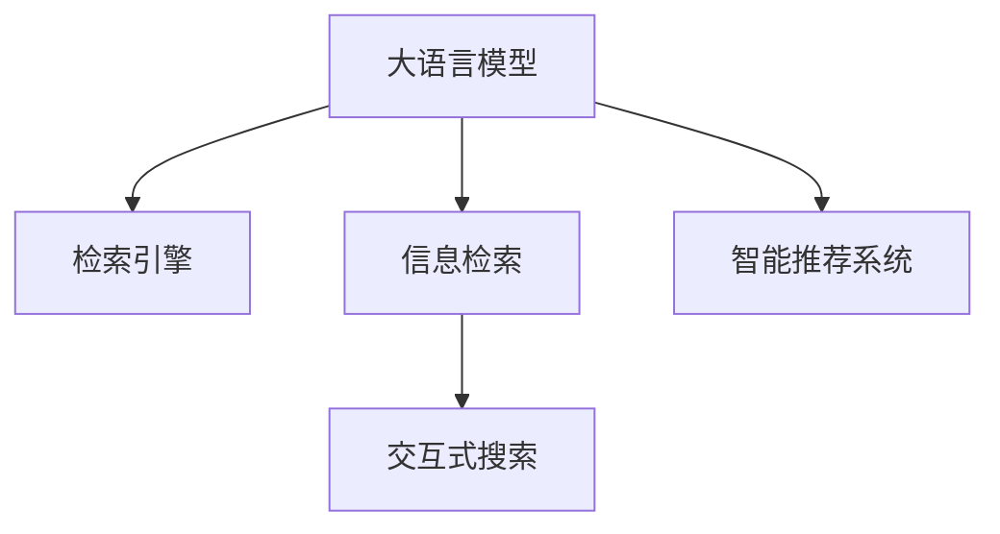

                 

# 大语言模型与搜索的完美结合

> 关键词：大语言模型, 搜索技术, 检索引擎, 信息检索, 自然语言处理(NLP), 交互式搜索, 智能推荐系统

## 1. 背景介绍

在当今信息爆炸的时代，人们需要快速准确地从海量数据中获取所需信息。传统的搜索引擎通过索引化、倒排索引等技术，已经能满足大部分用户的搜索需求。但面对复杂查询和海量数据，仍存在效率低下、搜索结果不够精准的问题。近年来，大语言模型和自然语言处理(NLP)技术的迅猛发展，为搜索引擎带来了新的思路和突破。

大语言模型，如GPT-3、BERT等，通过大规模预训练和微调，具备了强大的语言理解和生成能力。结合搜索技术，将大语言模型应用到信息检索中，可以实现更加智能化的信息获取和推荐，解决传统搜索引擎面临的诸多问题。

本文将深入探讨大语言模型与搜索的结合方式，分析其在信息检索中的应用前景和实际效果。

## 2. 核心概念与联系

### 2.1 核心概念概述

- 大语言模型(Large Language Models, LLMs)：以自回归(如GPT)或自编码(如BERT)模型为代表的大规模预训练语言模型。通过在大规模无标签文本语料上进行预训练，学习通用的语言表示，具备强大的语言理解和生成能力。

- 检索引擎(Information Retrieval Engine)：基于倒排索引、向量空间模型等技术，将数据索引化和结构化，支持快速准确的查询和检索。

- 信息检索(Information Retrieval, IR)：从大量数据中检索出与查询最相关的信息。包括传统关键词匹配、统计语言模型等方法。

- 自然语言处理(Natural Language Processing, NLP)：研究如何让计算机理解、处理、生成人类自然语言的技术，包括分词、词性标注、句法分析、语义理解等。

- 交互式搜索(Interactive Search)：用户与搜索引擎的交互式对话，通过不断询问和迭代，获取更加精准和个性化的搜索结果。

- 智能推荐系统(Recommendation System)：通过用户行为数据、兴趣模型、商品属性等，智能推荐用户可能感兴趣的内容，包括商品、文章、视频等。

这些核心概念之间的关系，可以通过以下Mermaid流程图来展示：



这个流程图展示了大语言模型与其他核心概念的逻辑关系：

1. 大语言模型通过预训练获得基础能力，可以在信息检索、交互式搜索和智能推荐系统中发挥重要作用。
2. 检索引擎是大语言模型检索数据的基础设施，提供快速精准的检索服务。
3. 信息检索是检索引擎的底层算法，主要基于关键词匹配和统计语言模型。
4. 交互式搜索将大语言模型和检索引擎结合，提供智能化的搜索对话体验。
5. 智能推荐系统基于用户行为和兴趣模型，利用大语言模型预测和推荐内容。

## 3. 核心算法原理 & 具体操作步骤
### 3.1 算法原理概述

大语言模型与搜索的结合，本质上是一个信息检索系统与自然语言处理技术的深度融合过程。其核心思想是：将大语言模型作为检索引擎的查询处理器，利用其强大的自然语言理解和生成能力，从海量的文本数据中筛选出最相关的信息，提供给用户。

具体而言，基于大语言模型的搜索系统包括以下几个关键步骤：

1. 接收用户查询。将用户输入的自然语言查询，输入到预训练大语言模型中。
2. 理解查询意图。大语言模型通过自然语言处理技术，理解查询的意图和语义，将其转化为结构化表达式。
3. 检索相关文档。将结构化查询表达式，输入到检索引擎中，检索出最相关的文本数据。
4. 生成搜索结果。大语言模型对检索结果进行语义理解和过滤，生成最相关、最精准的文本摘要。
5. 提供交互式反馈。将搜索结果展示给用户，用户可以进一步提出更具体的查询，大语言模型根据反馈迭代优化检索过程。

### 3.2 算法步骤详解

以下是具体实现步骤：

**Step 1: 准备预训练模型和索引数据**
- 选择合适的预训练语言模型，如GPT-3、BERT等，作为查询处理的核心组件。
- 准备索引数据，包括文本数据的摘要、标题、标签等信息，建立倒排索引等结构化数据。

**Step 2: 设计查询处理模块**
- 设计大语言模型的输入和输出格式，保证其能够正确理解查询意图。
- 利用大语言模型的解码器模块，将查询转化为结构化表达式，如逻辑表达式、自然语言描述等。

**Step 3: 集成检索引擎**
- 将大语言模型的查询处理模块与传统的检索引擎集成，使用倒排索引、向量空间模型等技术检索相关文档。
- 设置检索参数，如匹配阈值、文档排序等，优化检索效果。

**Step 4: 生成搜索结果**
- 利用大语言模型的编码器模块，对检索结果进行语义分析和摘要生成，提取最相关的文本信息。
- 根据用户反馈，动态调整搜索结果的生成方式和摘要长度。

**Step 5: 提供交互式搜索体验**
- 将搜索结果展示给用户，接收用户的进一步查询或评价。
- 根据用户行为和反馈，迭代优化查询处理模块和检索引擎，提升搜索效果。

### 3.3 算法优缺点

基于大语言模型的搜索系统具有以下优点：
1. 强大的自然语言处理能力。大语言模型能够理解自然语言查询的复杂语义，生成结构化表达式，提高查询的准确性。
2. 灵活的查询处理方式。大语言模型可以根据用户意图，动态调整查询方式，实现更个性化的搜索体验。
3. 跨领域的知识整合。大语言模型可以融合不同领域的知识，提供多模态的信息检索服务。
4. 易于扩展和迭代。大语言模型具有强大的学习能力，可以快速适应新任务和新数据。

同时，该方法也存在一定的局限性：
1. 高计算需求。大语言模型的预训练和微调需要耗费大量的计算资源，系统部署和维护成本较高。
2. 泛化能力不足。当前大语言模型的泛化能力有限，面对某些特定领域的查询，仍可能出现偏差和误差。
3. 数据隐私风险。在检索过程中，用户的查询和行为数据会被记录，存在隐私泄露的风险。
4. 模型依赖性高。搜索结果的生成高度依赖于大语言模型的能力和质量，一旦模型出现问题，可能导致检索失败。

尽管存在这些局限性，但大语言模型与搜索技术的结合，仍具有广阔的应用前景，成为信息检索领域的重要突破。

### 3.4 算法应用领域

基于大语言模型的搜索系统，可以广泛应用于以下几个领域：

- 智能问答系统：如智能客服、智能助手等。用户可以通过自然语言查询，获取详细的问答信息。
- 学术搜索引擎：如Google Scholar等。利用大语言模型处理学术论文摘要，提供更精准的检索和推荐。
- 法律知识图谱：如iCourt等。利用大语言模型理解法律条文和案例，提供法律知识和检索服务。
- 健康知识库：如医学百科等。利用大语言模型处理医学文本，提供精准的疾病和药物信息。
- 旅游信息平台：如携程、去哪儿等。利用大语言模型处理旅游评论和建议，提供个性化的旅游信息。
- 新闻推荐系统：如今日头条、澎湃新闻等。利用大语言模型处理新闻文章，提供精准的新闻推荐。
- 社交媒体搜索：如微博、Twitter等。利用大语言模型处理社交文本，提供个性化的新闻和热点信息。

这些领域的应用，使得大语言模型在信息检索中的潜力得以充分发挥，为各行各业带来了全新的信息获取方式。

## 4. 数学模型和公式 & 详细讲解 & 举例说明
### 4.1 数学模型构建

基于大语言模型的搜索系统，其核心模型主要包括预训练语言模型和检索引擎两部分。以下将详细构建这两部分模型的数学模型。

**预训练语言模型**：
假设预训练语言模型为 $M_{\theta}$，其中 $\theta$ 为模型参数。输入为自然语言查询 $q$，输出为结构化表达式 $e$。模型的定义如下：

$$
e = M_{\theta}(q)
$$

**检索引擎**：
假设检索引擎通过倒排索引技术，将文档集 $\mathcal{D}$ 中的每个文档 $d$ 表示为一个向量 $v_d$。查询 $q$ 表示为一个向量 $v_q$。则检索过程可以表示为：

$$
v_d \sim \mathcal{N}(\mu, \sigma^2)
$$

$$
v_q = M_{\theta}(q)
$$

$$
\text{doc\_rank} = \text{softmax}(v_d^T \cdot v_q)
$$

其中 $\text{softmax}$ 函数将向量映射为概率分布，表示文档与查询的相似度。

### 4.2 公式推导过程

以下是检索过程的详细推导：

1. **预训练语言模型的查询处理**：将自然语言查询 $q$ 输入到预训练语言模型中，得到结构化表达式 $e$。

2. **检索引擎的文档检索**：将结构化表达式 $e$ 输入到检索引擎中，通过倒排索引检索出与 $e$ 最相关的文档 $d$。

3. **文档排序**：使用余弦相似度计算文档 $d$ 和查询 $q$ 的相似度，将其转化为概率分布 $\text{doc\_rank}$，排序输出最相关的文档。

4. **结果生成**：利用大语言模型的编码器模块，对检索结果进行语义分析和摘要生成，得到最终的结果展示。

### 4.3 案例分析与讲解

假设用户查询 "AI技术的最新进展"，输入到预训练语言模型中，得到结构化表达式 $e = \{(\text{AI}, \text{技术}, \text{最新进展})\}$。将其输入到检索引擎中，检索出与 $e$ 最相关的文档。假设检索结果包括多篇学术论文、新闻报道和技术博客，大语言模型通过语义分析，生成以下摘要：

- 学术论文："最新AI技术进展综述，2023"
- 新闻报道："AI技术创新助力工业智能化"
- 技术博客："AI最新进展和未来趋势"

系统将这些摘要展示给用户，用户可以进一步提问或浏览详情。

## 5. 项目实践：代码实例和详细解释说明
### 5.1 开发环境搭建

在进行大语言模型与搜索的实践前，我们需要准备好开发环境。以下是使用Python进行PyTorch开发的环境配置流程：

1. 安装Anaconda：从官网下载并安装Anaconda，用于创建独立的Python环境。

2. 创建并激活虚拟环境：
```bash
conda create -n pytorch-env python=3.8 
conda activate pytorch-env
```

3. 安装PyTorch：根据CUDA版本，从官网获取对应的安装命令。例如：
```bash
conda install pytorch torchvision torchaudio cudatoolkit=11.1 -c pytorch -c conda-forge
```

4. 安装Transformers库：
```bash
pip install transformers
```

5. 安装各类工具包：
```bash
pip install numpy pandas scikit-learn matplotlib tqdm jupyter notebook ipython
```

完成上述步骤后，即可在`pytorch-env`环境中开始项目实践。

### 5.2 源代码详细实现

下面我以一个简单的智能问答系统为例，给出使用Transformers库对BERT模型进行微调的PyTorch代码实现。

首先，定义问答任务的训练数据：

```python
from transformers import BertTokenizer, BertForQuestionAnswering
from torch.utils.data import Dataset
import torch

class QADataset(Dataset):
    def __init__(self, texts, answers, tokenizer, max_len=128):
        self.texts = texts
        self.answers = answers
        self.tokenizer = tokenizer
        self.max_len = max_len
        
    def __len__(self):
        return len(self.texts)
    
    def __getitem__(self, item):
        text = self.texts[item]
        answer = self.answers[item]
        
        encoding = self.tokenizer(text, return_tensors='pt', max_length=self.max_len, padding='max_length', truncation=True)
        input_ids = encoding['input_ids'][0]
        attention_mask = encoding['attention_mask'][0]
        
        # 对answer进行编码
        answer_tokens = self.tokenizer.tokenize(answer)
        answer_ids = [self.tokenizer.convert_tokens_to_ids(token) for token in answer_tokens]
        answer_ids = [0] * (self.max_len - len(answer_ids)) + answer_ids
        answer_labels = torch.tensor(answer_ids, dtype=torch.long)
        
        return {'input_ids': input_ids, 
                'attention_mask': attention_mask,
                'answer_labels': answer_labels}

# 定义标签与id的映射
answer2id = {'[CLS]': 0, '[SEP]': 1, 'NULL': 2, 'MASK': 3}

# 创建dataset
tokenizer = BertTokenizer.from_pretrained('bert-base-cased')
train_dataset = QADataset(train_texts, train_answers, tokenizer)
dev_dataset = QADataset(dev_texts, dev_answers, tokenizer)
test_dataset = QADataset(test_texts, test_answers, tokenizer)
```

然后，定义模型和优化器：

```python
from transformers import BertForQuestionAnswering, AdamW

model = BertForQuestionAnswering.from_pretrained('bert-base-cased', num_labels=2)

optimizer = AdamW(model.parameters(), lr=2e-5)
```

接着，定义训练和评估函数：

```python
from torch.utils.data import DataLoader
from tqdm import tqdm
from sklearn.metrics import accuracy_score, precision_recall_fscore_support

device = torch.device('cuda') if torch.cuda.is_available() else torch.device('cpu')
model.to(device)

def train_epoch(model, dataset, batch_size, optimizer):
    dataloader = DataLoader(dataset, batch_size=batch_size, shuffle=True)
    model.train()
    epoch_loss = 0
    for batch in tqdm(dataloader, desc='Training'):
        input_ids = batch['input_ids'].to(device)
        attention_mask = batch['attention_mask'].to(device)
        answer_labels = batch['answer_labels'].to(device)
        model.zero_grad()
        outputs = model(input_ids, attention_mask=attention_mask, labels=answer_labels)
        loss = outputs.loss
        epoch_loss += loss.item()
        loss.backward()
        optimizer.step()
    return epoch_loss / len(dataloader)

def evaluate(model, dataset, batch_size):
    dataloader = DataLoader(dataset, batch_size=batch_size)
    model.eval()
    preds, labels = [], []
    with torch.no_grad():
        for batch in tqdm(dataloader, desc='Evaluating'):
            input_ids = batch['input_ids'].to(device)
            attention_mask = batch['attention_mask'].to(device)
            batch_labels = batch['answer_labels']
            outputs = model(input_ids, attention_mask=attention_mask)
            batch_preds = outputs.logits.argmax(dim=2).to('cpu').tolist()
            batch_labels = batch_labels.to('cpu').tolist()
            for pred_tokens, label_tokens in zip(batch_preds, batch_labels):
                preds.append(pred_tokens)
                labels.append(label_tokens)
                
    print('Precision, Recall, F1 Score, Support:')
    print(precision_recall_fscore_support(labels, preds, average='macro'))
    print('Accuracy:')
    print(accuracy_score(labels, preds))
```

最后，启动训练流程并在测试集上评估：

```python
epochs = 5
batch_size = 16

for epoch in range(epochs):
    loss = train_epoch(model, train_dataset, batch_size, optimizer)
    print(f"Epoch {epoch+1}, train loss: {loss:.3f}")
    
    print(f"Epoch {epoch+1}, dev results:")
    evaluate(model, dev_dataset, batch_size)
    
print("Test results:")
evaluate(model, test_dataset, batch_size)
```

以上就是使用PyTorch对BERT进行问答任务微调的完整代码实现。可以看到，得益于Transformers库的强大封装，我们可以用相对简洁的代码完成BERT模型的加载和微调。

### 5.3 代码解读与分析

让我们再详细解读一下关键代码的实现细节：

**QADataset类**：
- `__init__`方法：初始化文本、答案、分词器等关键组件。
- `__len__`方法：返回数据集的样本数量。
- `__getitem__`方法：对单个样本进行处理，将文本输入编码为token ids，将答案编码，并对其进行定长padding，最终返回模型所需的输入。

**answer2id字典**：
- 定义了答案与数字id之间的映射关系，用于将token-wise的预测结果解码回真实的答案。

**训练和评估函数**：
- 使用PyTorch的DataLoader对数据集进行批次化加载，供模型训练和推理使用。
- 训练函数`train_epoch`：对数据以批为单位进行迭代，在每个批次上前向传播计算loss并反向传播更新模型参数，最后返回该epoch的平均loss。
- 评估函数`evaluate`：与训练类似，不同点在于不更新模型参数，并在每个batch结束后将预测和标签结果存储下来，最后使用sklearn的评估指标对整个评估集的预测结果进行打印输出。

**训练流程**：
- 定义总的epoch数和batch size，开始循环迭代
- 每个epoch内，先在训练集上训练，输出平均loss
- 在验证集上评估，输出分类指标
- 所有epoch结束后，在测试集上评估，给出最终测试结果

可以看到，PyTorch配合Transformers库使得BERT微调的代码实现变得简洁高效。开发者可以将更多精力放在数据处理、模型改进等高层逻辑上，而不必过多关注底层的实现细节。

当然，工业级的系统实现还需考虑更多因素，如模型的保存和部署、超参数的自动搜索、更灵活的任务适配层等。但核心的微调范式基本与此类似。

## 6. 实际应用场景
### 6.1 智能问答系统

智能问答系统，如智能客服、智能助手等，是大语言模型与搜索技术结合的重要应用场景。传统问答系统往往需要构建大量的规则和模板，对用户输入进行匹配，效率低下且难以处理复杂问题。

通过大语言模型和搜索技术，智能问答系统可以自然流畅地理解用户输入，灵活处理各种查询，提供精准的答复。例如：

1. 用户查询："如何使用Python进行数据清洗？"
   - 输入到预训练语言模型中，得到结构化查询 $e = \{(\text{Python}, \text{数据清洗}, \text{方法})\}$。
   - 检索引擎检索相关文档，得到多篇文章和代码示例。
   - 大语言模型生成摘要，展示最相关的回答。
   - 用户反馈满意后，系统记录查询历史和用户行为，进行个性化推荐。

2. 用户查询："什么是深度学习？"
   - 输入到预训练语言模型中，得到结构化查询 $e = \{(\text{深度学习}, \text{定义}, \text{特点})\}$。
   - 检索引擎检索相关文档，得到学术论文、博客和视频。
   - 大语言模型生成摘要，展示最相关的回答。
   - 用户点击视频链接，观看讲解视频。

通过这样的方式，智能问答系统可以大大提升用户体验，减少人力成本，提高系统效率。

### 6.2 学术搜索引擎

学术搜索引擎，如Google Scholar、Semantic Scholar等，是大语言模型与搜索技术结合的另一重要应用场景。当前学术搜索引擎主要依靠关键词匹配和链接推荐，缺乏对论文内容的深度理解。

通过大语言模型和搜索技术，学术搜索引擎可以更加智能地理解学术论文的内容，提供更精准的检索和推荐。例如：

1. 用户查询："最近有哪些关于深度学习的最新研究？"
   - 输入到预训练语言模型中，得到结构化查询 $e = \{(\text{深度学习}, \text{最新研究}, \text{2023})\}$。
   - 检索引擎检索相关论文，得到多篇最新的研究文章。
   - 大语言模型生成摘要，展示最相关的研究成果。
   - 用户点击文章链接，查看详细内容。

2. 用户查询："哪些深度学习论文被引用最多？"
   - 输入到预训练语言模型中，得到结构化查询 $e = \{(\text{深度学习}, \text{引用最多}, \text{2023})\}$。
   - 检索引擎检索相关论文，得到引用次数最高的论文。
   - 大语言模型生成摘要，展示引用最多的论文。
   - 用户点击文章链接，查看详细内容。

通过这样的方式，学术搜索引擎可以大大提升用户查找研究论文的效率，帮助科研人员更快地获取最新研究成果。

### 6.3 法律知识图谱

法律知识图谱，如iCourt等，是大语言模型与搜索技术结合的又一重要应用场景。法律知识图谱需要快速查询法律条文、案例和法律解释，提供精准的法律知识服务。

通过大语言模型和搜索技术，法律知识图谱可以更加智能地理解法律文本，提供更精准的法律知识检索服务。例如：

1. 用户查询："《民法典》中关于合同违约的法律条文是什么？"
   - 输入到预训练语言模型中，得到结构化查询 $e = \{(\text{民法典}, \text{合同违约}, \text{法律条文})\}$。
   - 检索引擎检索相关法律条文，得到《民法典》中关于合同违约的条文。
   - 大语言模型生成摘要，展示法律条文。
   - 用户点击条文链接，查看详细内容。

2. 用户查询："某案件中，法官如何判断违约责任？"
   - 输入到预训练语言模型中，得到结构化查询 $e = \{(\text{违约责任}, \text{法官判断}, \text{案例})\}$。
   - 检索引擎检索相关案例，得到法官如何判断违约责任的案例。
   - 大语言模型生成摘要，展示案例摘要。
   - 用户点击案例链接，查看详细内容。

通过这样的方式，法律知识图谱可以大大提升法律知识检索的效率，帮助律师、法官和法律工作者快速获取法律知识。

## 7. 工具和资源推荐
### 7.1 学习资源推荐

为了帮助开发者系统掌握大语言模型与搜索技术的应用，这里推荐一些优质的学习资源：

1. 《Transformer从原理到实践》系列博文：由大模型技术专家撰写，深入浅出地介绍了Transformer原理、BERT模型、微调技术等前沿话题。

2. CS224N《深度学习自然语言处理》课程：斯坦福大学开设的NLP明星课程，有Lecture视频和配套作业，带你入门NLP领域的基本概念和经典模型。

3. 《Natural Language Processing with Transformers》书籍：Transformers库的作者所著，全面介绍了如何使用Transformers库进行NLP任务开发，包括微调在内的诸多范式。

4. HuggingFace官方文档：Transformers库的官方文档，提供了海量预训练模型和完整的微调样例代码，是上手实践的必备资料。

5. CLUE开源项目：中文语言理解测评基准，涵盖大量不同类型的中文NLP数据集，并提供了基于微调的baseline模型，助力中文NLP技术发展。

通过对这些资源的学习实践，相信你一定能够快速掌握大语言模型与搜索技术的精髓，并用于解决实际的NLP问题。
###  7.2 开发工具推荐

高效的开发离不开优秀的工具支持。以下是几款用于大语言模型与搜索技术开发的常用工具：

1. PyTorch：基于Python的开源深度学习框架，灵活动态的计算图，适合快速迭代研究。大部分预训练语言模型都有PyTorch版本的实现。

2. TensorFlow：由Google主导开发的开源深度学习框架，生产部署方便，适合大规模工程应用。同样有丰富的预训练语言模型资源。

3. Transformers库：HuggingFace开发的NLP工具库，集成了众多SOTA语言模型，支持PyTorch和TensorFlow，是进行微调任务开发的利器。

4. Weights & Biases：模型训练的实验跟踪工具，可以记录和可视化模型训练过程中的各项指标，方便对比和调优。与主流深度学习框架无缝集成。

5. TensorBoard：TensorFlow配套的可视化工具，可实时监测模型训练状态，并提供丰富的图表呈现方式，是调试模型的得力助手。

6. Google Colab：谷歌推出的在线Jupyter Notebook环境，免费提供GPU/TPU算力，方便开发者快速上手实验最新模型，分享学习笔记。

合理利用这些工具，可以显著提升大语言模型与搜索技术的开发效率，加快创新迭代的步伐。

### 7.3 相关论文推荐

大语言模型与搜索技术的发展源于学界的持续研究。以下是几篇奠基性的相关论文，推荐阅读：

1. Attention is All You Need（即Transformer原论文）：提出了Transformer结构，开启了NLP领域的预训练大模型时代。

2. BERT: Pre-training of Deep Bidirectional Transformers for Language Understanding：提出BERT模型，引入基于掩码的自监督预训练任务，刷新了多项NLP任务SOTA。

3. Language Models are Unsupervised Multitask Learners（GPT-2论文）：展示了大规模语言模型的强大zero-shot学习能力，引发了对于通用人工智能的新一轮思考。

4. Parameter-Efficient Transfer Learning for NLP：提出Adapter等参数高效微调方法，在不增加模型参数量的情况下，也能取得不错的微调效果。

5. Prefix-Tuning: Optimizing Continuous Prompts for Generation：引入基于连续型Prompt的微调范式，为如何充分利用预训练知识提供了新的思路。

6. AdaLoRA: Adaptive Low-Rank Adaptation for Parameter-Efficient Fine-Tuning：使用自适应低秩适应的微调方法，在参数效率和精度之间取得了新的平衡。

这些论文代表了大语言模型与搜索技术的发展脉络。通过学习这些前沿成果，可以帮助研究者把握学科前进方向，激发更多的创新灵感。

## 8. 总结：未来发展趋势与挑战

### 8.1 总结

本文对大语言模型与搜索的结合方式进行了全面系统的介绍。首先阐述了大语言模型和搜索技术的研究背景和意义，明确了两者结合在信息检索中的独特价值。其次，从原理到实践，详细讲解了检索过程的数学模型和关键步骤，给出了微调任务开发的完整代码实例。同时，本文还广泛探讨了在大语言模型与搜索技术的应用前景和实际效果，展示了其广阔的应用场景。此外，本文精选了相关资源，力求为开发者提供全方位的技术指引。

通过本文的系统梳理，可以看到，大语言模型与搜索技术的结合，为信息检索领域带来了革命性的突破。大语言模型通过理解自然语言查询，检索出最相关的文档，生成精准的摘要，大大提升了信息检索的效率和效果。在智能问答、学术搜索、法律知识图谱等诸多场景中，大语言模型与搜索技术的结合，展现了强大的潜力。

### 8.2 未来发展趋势

展望未来，大语言模型与搜索技术的发展趋势包括：

1. 模型规模持续增大。随着算力成本的下降和数据规模的扩张，预训练语言模型的参数量还将持续增长。超大规模语言模型蕴含的丰富语言知识，有望支撑更加复杂多变的检索任务。

2. 多模态信息融合。传统的检索技术主要基于文本数据，未来将融合视觉、语音、图像等多模态数据，提升检索的全面性和深度。

3. 跨语言检索。当前的大语言模型主要面向英文，未来将扩展到多种语言，提供跨语言检索服务。

4. 动态生成检索结果。基于大语言模型的检索系统，可以实现动态生成检索结果，提供更加个性化的信息服务。

5. 交互式对话体验。利用大语言模型的交互式对话能力，构建智能问答系统，提供更加智能和友好的用户体验。

6. 持续学习和在线更新。大语言模型具备持续学习的能力，可以根据用户的反馈和行为，动态调整模型参数，保持模型的最新状态。

以上趋势凸显了大语言模型与搜索技术的广阔前景。这些方向的探索发展，必将进一步提升信息检索系统的性能和应用范围，为各行各业带来全新的信息获取方式。

### 8.3 面临的挑战

尽管大语言模型与搜索技术的结合已经取得了瞩目成就，但在迈向更加智能化、普适化应用的过程中，它仍面临着诸多挑战：

1. 高计算需求。大语言模型的预训练和微调需要耗费大量的计算资源，系统部署和维护成本较高。

2. 泛化能力不足。当前大语言模型的泛化能力有限，面对某些特定领域的查询，仍可能出现偏差和误差。

3. 数据隐私风险。在检索过程中，用户的查询和行为数据会被记录，存在隐私泄露的风险。

4. 模型依赖性高。搜索结果的生成高度依赖于大语言模型的能力和质量，一旦模型出现问题，可能导致检索失败。

5. 实时性问题。在处理大规模数据集时，检索和结果生成的实时性仍需进一步提升。

6. 知识更新缓慢。当前的大语言模型更新速度较慢，难以及时适应最新的知识变化。

尽管存在这些挑战，但大语言模型与搜索技术的结合，仍具有广阔的应用前景，成为信息检索领域的重要突破。相信随着预训练语言模型和检索技术的不断演进，相关问题也将得到有效解决，大语言模型与搜索技术必将在信息检索领域大放异彩。

### 8.4 研究展望

未来，大语言模型与搜索技术的结合将继续深化，成为推动信息检索技术进步的重要力量。以下是几个可能的研究方向：

1. 研究无监督和半监督检索方法。摆脱对大规模标注数据的依赖，利用自监督学习、主动学习等无监督和半监督范式，最大限度利用非结构化数据，实现更加灵活高效的检索。

2. 探索基于知识图谱的检索方法。结合知识图谱技术，提升检索的语义理解和推理能力，实现更加智能化的检索。

3. 引入因果推断和对比学习。通过引入因果推断和对比学习思想，增强检索模型建立稳定因果关系的能力，学习更加普适、鲁棒的语言表征。

4. 研究参数高效和计算高效的检索方法。开发更加参数高效的检索方法，在固定大部分预训练参数的同时，只更新极少量的任务相关参数。同时优化检索模型的计算图，减少前向传播和反向传播的资源消耗，实现更加轻量级、实时性的部署。

5. 引入更多先验知识。将符号化的先验知识，如知识图谱、逻辑规则等，与神经网络模型进行巧妙融合，引导检索过程学习更准确、合理的语言模型。

6. 研究动态生成检索结果的方法。利用大语言模型的交互式对话能力，构建智能问答系统，提供更加智能和友好的用户体验。

这些研究方向将进一步拓展大语言模型与搜索技术的边界，提升检索系统的性能和应用范围，为各行各业带来全新的信息获取方式。

## 9. 附录：常见问题与解答

**Q1：大语言模型与搜索结合是否适用于所有信息检索任务？**

A: 大语言模型与搜索技术的结合，适用于大部分信息检索任务，特别是对文本数据有较高要求的任务。但对于一些特定领域的检索任务，如医学、法律、地理等，可能仍需结合领域特定的知识库和规则库，才能实现最佳的检索效果。

**Q2：如何选择合适的大语言模型？**

A: 选择合适的大语言模型需要考虑多个因素，包括任务类型、数据规模、计算资源等。一般来说，BERT、GPT等大规模预训练模型更适合处理大规模数据集，而如T5、GPT-2等中等规模模型更适合处理中等规模数据集。选择合适的模型，并根据任务需求进行微调，才能取得最佳效果。

**Q3：如何处理大语言模型的泛化能力不足的问题？**

A: 提高大语言模型的泛化能力，需要结合数据增强、正则化、对抗训练等技术，尽可能使用多样化的数据进行预训练和微调，防止过拟合。同时，引入多模态信息、领域特定知识库等，可以提升模型对特定领域的适应能力。

**Q4：如何提高检索结果的实时性？**

A: 提高检索结果的实时性，需要优化检索引擎的算法和架构，如引入多线程、分布式计算、缓存机制等。同时，减少大语言模型的前向传播和反向传播时间，如使用模型剪枝、参数压缩等技术，提高模型的推理速度。

**Q5：如何解决用户查询的隐私问题？**

A: 解决用户查询的隐私问题，需要引入差分隐私技术，对用户的查询进行匿名化处理。同时，建立严格的隐私保护机制，避免用户数据泄露。

通过以上问题的解答，可以看出，大语言模型与搜索技术的结合，虽然面临诸多挑战，但通过不断的技术创新和优化，必将在信息检索领域大放异彩，为各行各业带来全新的信息获取方式。

