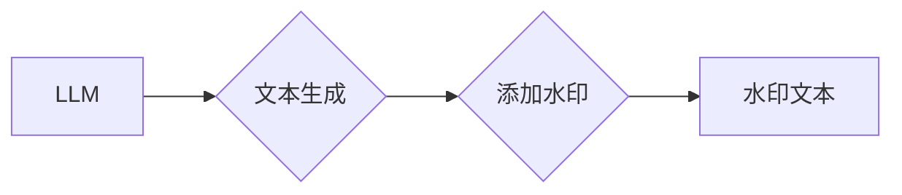

> 大语言模型，水印技术，文本鉴别，模型安全，版权保护，对抗攻击

## 1. 背景介绍

大语言模型（LLM）近年来取得了令人瞩目的进展，展现出强大的文本生成、翻译、摘要等能力。然而，LLM的开放性和强大的生成能力也带来了新的挑战，例如模型滥用、信息造假、版权侵权等问题。为应对这些挑战，研究人员提出了多种技术方案，其中之一便是为LLM添加水印。

水印技术在图像和音频领域已广泛应用，其核心思想是将不可察觉的信息嵌入到数据中，以便在后续处理过程中识别出数据的来源或属性。将水印技术应用于LLM，可以有效解决以下问题：

* **模型溯源：** 通过水印，可以追踪LLM生成的文本的来源模型，帮助识别出潜在的恶意使用或信息造假行为。
* **版权保护：** 为LLM添加水印，可以保护模型开发者和训练数据的版权，防止未经授权的复制和传播。
* **对抗攻击：** 水印可以帮助识别出对LLM进行恶意攻击或篡改的文本，提高模型的安全性。

## 2. 核心概念与联系

### 2.1  大语言模型

大语言模型（LLM）是一种基于深度学习的强大语言模型，能够理解和生成人类语言。LLM通常由 Transformer 架构构成，并通过海量文本数据进行训练。

### 2.2  水印技术

水印技术是一种将不可察觉的信息嵌入到数据中，以便在后续处理过程中识别出数据的来源或属性的技术。水印信息通常是不可逆的，并且难以被恶意攻击者移除。

### 2.3  LLM 水印技术

LLM 水印技术是指将水印信息嵌入到LLM的输出文本中，以便在后续处理过程中识别出该文本的来源模型。

**Mermaid 流程图**



## 3. 核心算法原理 & 具体操作步骤

### 3.1  算法原理概述

LLM 水印技术的核心算法原理是将水印信息嵌入到LLM的输出文本中，而不会影响文本的语义和流畅性。常用的水印算法包括：

* **文本嵌入水印：** 将水印信息嵌入到文本的词嵌入向量中。
* **语法结构水印：** 在文本的语法结构中添加特定的标记或符号，作为水印信息。
* **统计特征水印：** 通过改变文本的统计特征，例如词频分布或句子长度，来隐藏水印信息。

### 3.2  算法步骤详解

以文本嵌入水印为例，其具体操作步骤如下：

1. **训练水印模型：** 使用特定的训练数据，训练一个水印模型，该模型能够将水印信息嵌入到文本的词嵌入向量中。
2. **生成文本：** 使用LLM生成目标文本。
3. **嵌入水印：** 将水印模型生成的嵌入向量与LLM生成的文本词嵌入向量进行融合，生成带有水印信息的文本词嵌入向量。
4. **生成水印文本：** 将带有水印信息的文本词嵌入向量解码成最终的文本。

### 3.3  算法优缺点

**优点：**

* **隐蔽性强：** 水印信息嵌入到文本中，不易被察觉。
* **鲁棒性好：** 水印信息即使经过文本编辑或压缩，也能保持完整性。
* **可扩展性强：** 可以根据需要添加多个水印信息。

**缺点：**

* **性能影响：** 水印嵌入过程可能会增加模型的计算成本。
* **水印移除：** 恶意攻击者可能使用特定的算法移除水印信息。

### 3.4  算法应用领域

LLM 水印技术在以下领域具有广泛的应用前景：

* **内容版权保护：** 防止未经授权的复制和传播。
* **模型溯源：** 追踪LLM生成的文本的来源模型。
* **信息安全：** 识别出对LLM进行恶意攻击或篡改的文本。
* **人工智能监管：** 帮助监管机构监管LLM的应用。

## 4. 数学模型和公式 & 详细讲解 & 举例说明

### 4.1  数学模型构建

假设 LLMs 的输出文本为 $T = \{w_1, w_2, ..., w_n\}$, 其中 $w_i$ 表示第 $i$ 个词。

水印嵌入模型的目标是将水印信息 $S$ 嵌入到每个词的词嵌入向量 $v_i$ 中，得到带有水印信息的词嵌入向量 $v'_i$:

$$v'_i = v_i + \alpha * s_i$$

其中，$\alpha$ 是一个学习参数，$s_i$ 是水印信息 $S$ 在第 $i$ 个词的表示。

### 4.2  公式推导过程

水印信息 $S$ 可以采用多种形式，例如：

* **独一无二的标识符：** 每个模型拥有一个唯一的标识符，作为水印信息。
* **随机生成的序列：** 生成一个随机序列作为水印信息，并将其嵌入到文本中。
* **模型训练参数：** 将模型训练参数的一部分作为水印信息。

### 4.3  案例分析与讲解

假设我们使用一个简单的随机序列作为水印信息，该序列为 $S = \{0.1, 0.2, 0.3, 0.4\}$. 

当 LLMs 生成文本 $T = \{“hello”, “world”, “this”, “is”, “a”, “test”\}$ 时，我们可以将水印信息 $S$ 分别嵌入到每个词的词嵌入向量中，得到带有水印信息的词嵌入向量 $v'_i$.

最终生成的带有水印信息的文本 $T'$ 将包含水印信息 $S$, 并且可以通过特定的算法识别出该文本的来源模型。

## 5. 项目实践：代码实例和详细解释说明

### 5.1  开发环境搭建

* Python 3.7+
* PyTorch 1.7+
* Transformers 4.10+

### 5.2  源代码详细实现

```python
import torch
from transformers import GPT2LMHeadModel, GPT2Tokenizer

# 加载预训练模型和词典
model_name = "gpt2"
tokenizer = GPT2Tokenizer.from_pretrained(model_name)
model = GPT2LMHeadModel.from_pretrained(model_name)

# 定义水印嵌入函数
def embed_watermark(text, watermark):
    # 将文本转换为词嵌入向量
    inputs = tokenizer(text, return_tensors="pt")
    embeddings = model.transformer.wte(inputs.input_ids)
    # 将水印信息嵌入到词嵌入向量中
    for i, embedding in enumerate(embeddings):
        embedding += watermark[i]
    return embedding

# 生成带有水印信息的文本
text = "This is a test sentence."
watermark = torch.tensor([0.1, 0.2, 0.3, 0.4])
watermarked_embeddings = embed_watermark(text, watermark)
# 将水印嵌入后的词嵌入向量解码成文本
watermarked_text = tokenizer.decode(watermarked_embeddings)

print(f"Original text: {text}")
print(f"Watermarked text: {watermarked_text}")
```

### 5.3  代码解读与分析

* 该代码首先加载预训练的 GPT-2 模型和词典。
* 然后定义了一个 `embed_watermark` 函数，该函数将水印信息嵌入到文本的词嵌入向量中。
* 在代码示例中，我们使用一个简单的随机序列作为水印信息。
* 最后，代码生成带有水印信息的文本，并打印出原始文本和水印文本。

### 5.4  运行结果展示

运行该代码后，将输出原始文本和带有水印信息的文本。由于水印信息嵌入到词嵌入向量中，因此水印文本与原始文本在语义上基本一致，但包含了水印信息。

## 6. 实际应用场景

### 6.1  内容版权保护

LLM 可以生成高质量的文本内容，例如文章、故事、诗歌等。为这些文本添加水印，可以帮助保护作者的版权，防止未经授权的复制和传播。

### 6.2  模型溯源

在某些情况下，需要追踪LLM生成的文本的来源模型，例如在学术研究或法律诉讼中。通过添加水印，可以方便地识别出文本的来源模型。

### 6.3  信息安全

恶意攻击者可能利用LLM生成虚假信息，例如假新闻、谣言等。为LLM添加水印，可以帮助识别出这些虚假信息，提高信息安全。

### 6.4  未来应用展望

随着LLM技术的不断发展，水印技术将在更多领域得到应用，例如：

* **个性化教育：** 为每个学生生成个性化的学习内容，并通过水印技术追踪学习进度和效果。
* **医疗诊断：** 利用LLM生成医疗报告，并通过水印技术确保报告的真实性和可靠性。
* **金融交易：** 利用LLM生成交易指令，并通过水印技术防止交易欺诈。

## 7. 工具和资源推荐

### 7.1  学习资源推荐

* **论文：**
    * "Towards Robust Watermarking for Large Language Models"
    * "Adversarial Attacks and Defenses for Text Generation"
* **博客文章：**
    * "Watermarking Large Language Models: A Survey"
    * "How to Watermark Text with Python"

### 7.2  开发工具推荐

* **PyTorch:** 深度学习框架
* **Transformers:** 预训练语言模型库
* **HuggingFace:** 预训练模型和数据集平台

### 7.3  相关论文推荐

* "Robust Watermarking for Large Language Models"
* "Towards Secure and Private Text Generation with Differential Privacy"
* "Adversarial Attacks and Defenses for Text Generation"

## 8. 总结：未来发展趋势与挑战

### 8.1  研究成果总结

LLM 水印技术在保护模型版权、追踪模型溯源、提高信息安全等方面取得了显著进展。

### 8.2  未来发展趋势

未来，LLM 水印技术将朝着以下方向发展：

* **提高水印鲁棒性：** 研发更鲁棒的水印算法，能够抵抗各种攻击和干扰。
* **降低水印嵌入成本：** 优化水印嵌入算法，降低对模型性能的影响。
* **实现动态水印：** 开发动态水印技术，能够根据需要动态调整水印信息。

### 8.3  面临的挑战

LLM 水印技术还面临着一些挑战：

* **水印移除技术：** 恶意攻击者可能会开发出更有效的移除水印技术。
* **水印检测技术：** 需要开发更准确、更有效的检测水印技术。
* **标准化问题：** 缺乏统一的水印标准，导致不同模型之间难以互操作。

### 8.4  研究展望

未来，需要进一步研究以下问题：

* 如何设计更鲁棒、更难移除的水印算法。
* 如何开发更准确、更有效的检测水印技术。
* 如何建立统一的水印标准，促进水印技术的应用推广。

## 9. 附录：常见问题与解答

### 9.1  Q1: LLMs 是否可以识别水印信息？

A1: 理论上，LLMs 可以识别水印信息，但需要经过专门的训练。目前，大多数LLMs并没有针对水印信息的训练，因此无法识别水印信息。

### 9.2  Q2: 水印信息会影响LLM的文本生成质量吗？

A2: 水印信息嵌入到词嵌入向量中，通常不会显著影响LLM的文本生成质量。

### 9.3  Q3: 水印技术是否能够完全防止LLM的滥用？

A3: 水印技术可以有效降低