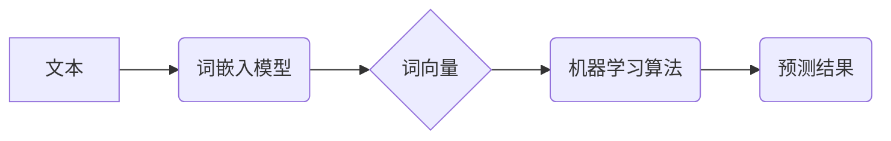

> 大语言模型，文本向量化，词嵌入，Word2Vec，GloVe，BERT，Transformer，自然语言处理，深度学习

## 1. 背景介绍

近年来，深度学习在自然语言处理 (NLP) 领域取得了突破性进展，大语言模型 (LLM) 作为其重要组成部分，展现出强大的文本理解和生成能力。然而，LLM 的训练和应用离不开文本的有效表示，即文本向量化。文本向量化将文本转换为数字向量，为机器学习算法提供可理解的输入，从而实现对文本的分析、分类、生成等任务。

传统的文本表示方法，如词袋模型 (Bag-of-Words) 和 TF-IDF，虽然简单易用，但缺乏语义信息，难以捕捉词语之间的语义关系。随着深度学习的发展，词嵌入技术应运而生，它将每个词语映射到一个低维稠密的向量空间，使得相似的词语拥有相似的向量表示。

## 2. 核心概念与联系

文本向量化是将文本转换为数字向量的一种技术，为机器学习算法提供可理解的输入。

**核心概念:**

* **词嵌入 (Word Embedding):** 将每个词语映射到一个低维稠密的向量空间，使得相似的词语拥有相似的向量表示。
* **词向量 (Word Vector):**  每个词语对应的向量表示。
* **语义相似度 (Semantic Similarity):**  衡量两个词语语义上的相似程度。

**架构图:**



## 3. 核心算法原理 & 具体操作步骤

### 3.1  算法原理概述

词嵌入算法的目标是学习一个词向量空间，使得语义相似的词语在该空间中距离较近。常见的词嵌入算法包括 Word2Vec 和 GloVe。

* **Word2Vec:** 基于神经网络，通过预测上下文词来学习词向量。主要有两种模型：CBOW (Continuous Bag-of-Words) 和 Skip-gram。
* **GloVe (Global Vectors for Word Representation):** 基于全局词共现矩阵，通过矩阵分解来学习词向量。

### 3.2  算法步骤详解

**Word2Vec (Skip-gram):**

1. **输入:** 文本语料库。
2. **构建词对:** 从语料库中提取词对，例如 "国王" 和 "皇冠"。
3. **训练神经网络:** 使用神经网络模型，输入一个词语，预测其上下文词语。
4. **更新词向量:** 通过反向传播算法，更新词向量的参数，使得预测的上下文词语与实际上下文词语越相近越好。
5. **输出:** 每个词语的词向量表示。

**GloVe:**

1. **构建词共现矩阵:** 计算每个词语与其他词语共现的次数，形成词共现矩阵。
2. **矩阵分解:** 使用矩阵分解技术，将词共现矩阵分解成两个低维矩阵，分别代表词向量的行和列。
3. **输出:** 每个词语的词向量表示。

### 3.3  算法优缺点

**Word2Vec:**

* **优点:** 能够学习到语义相似的词语具有相似的向量表示，效果较好。
* **缺点:** 训练时间较长，对计算资源要求较高。

**GloVe:**

* **优点:** 训练时间较短，对计算资源要求较低。
* **缺点:** 效果不如 Word2Vec。

### 3.4  算法应用领域

词嵌入技术广泛应用于自然语言处理领域，例如：

* **文本分类:** 根据文本内容自动分类。
* **文本相似度计算:** 衡量两个文本的语义相似度。
* **机器翻译:** 将一种语言翻译成另一种语言。
* **问答系统:** 回答用户提出的问题。

## 4. 数学模型和公式 & 详细讲解 & 举例说明

### 4.1  数学模型构建

Word2Vec 的 Skip-gram 模型可以看作是一个多层感知机 (MLP)，其输入层为目标词，输出层为上下文词的概率分布。

**模型结构:**

* **输入层:**  目标词的 one-hot 编码。
* **隐藏层:**  一个全连接层，其输出为词向量的表示。
* **输出层:**  一个 softmax 层，其输出为上下文词的概率分布。

### 4.2  公式推导过程

**目标函数:**

$$
J(\theta) = -\frac{1}{T} \sum_{t=1}^{T} \sum_{w \in C(w_t)} \log p(w | w_t)
$$

其中:

* $J(\theta)$ 为目标函数，$\theta$ 为模型参数。
* $T$ 为语料库中词对的数量。
* $w_t$ 为目标词。
* $C(w_t)$ 为目标词 $w_t$ 的上下文词集合。
* $p(w | w_t)$ 为目标词 $w_t$ 给定上下文词 $w$ 的概率。

**softmax 函数:**

$$
p(w | w_t) = \frac{exp(v_w^T h_{w_t})}{\sum_{u \in V} exp(v_u^T h_{w_t})}
$$

其中:

* $v_w$ 为上下文词 $w$ 的词向量。
* $h_{w_t}$ 为目标词 $w_t$ 的隐藏层输出。
* $V$ 为词典的大小。

### 4.3  案例分析与讲解

假设我们有一个语料库，包含以下句子:

* "The cat sat on the mat."
* "The dog chased the ball."

我们可以使用 Word2Vec 训练一个词嵌入模型，学习到以下词向量:

* "cat": [0.2, 0.3, 0.1]
* "dog": [0.5, 0.4, 0.2]
* "mat": [0.1, 0.2, 0.3]
* "ball": [0.3, 0.5, 0.1]

我们可以观察到，"cat" 和 "dog" 的词向量在某些维度上比较接近，因为它们都是动物。

## 5. 项目实践：代码实例和详细解释说明

### 5.1  开发环境搭建

* Python 3.6+
* TensorFlow 或 PyTorch

### 5.2  源代码详细实现

```python
# 使用 TensorFlow 实现 Word2Vec Skip-gram 模型

import tensorflow as tf

# 定义模型参数
embedding_dim = 100
window_size = 2

# 创建词嵌入层
embedding = tf.keras.layers.Embedding(input_dim=vocab_size, output_dim=embedding_dim)

# 创建输入层
input_layer = tf.keras.layers.Input(shape=(window_size,))

# 创建隐藏层
hidden_layer = embedding(input_layer)

# 创建输出层
output_layer = tf.keras.layers.Dense(units=vocab_size, activation='softmax')

# 创建模型
model = tf.keras.Model(inputs=input_layer, outputs=output_layer)

# 编译模型
model.compile(optimizer='adam', loss='categorical_crossentropy')

# 训练模型
model.fit(x_train, y_train, epochs=10)

# 获取词向量
word_vectors = embedding.get_weights()[0]
```

### 5.3  代码解读与分析

* **词嵌入层:** 将每个词语映射到一个低维稠密的向量空间。
* **输入层:** 接收上下文词的 one-hot 编码。
* **隐藏层:** 将上下文词的向量表示进行变换。
* **输出层:** 预测目标词的概率分布。
* **模型编译:** 使用 Adam 优化器和交叉熵损失函数。
* **模型训练:** 使用训练数据训练模型。
* **词向量获取:** 从词嵌入层中获取每个词语的词向量表示。

### 5.4  运行结果展示

训练完成后，我们可以使用获取到的词向量来进行语义相似度计算、文本分类等任务。

## 6. 实际应用场景

### 6.1  文本分类

词嵌入技术可以用于文本分类任务，例如情感分析、主题分类等。

### 6.2  文本相似度计算

词嵌入技术可以用于计算文本的语义相似度，例如文档相似度、问答匹配等。

### 6.3  机器翻译

词嵌入技术可以用于机器翻译任务，例如将一种语言翻译成另一种语言。

### 6.4  未来应用展望

随着深度学习技术的不断发展，词嵌入技术将应用于更多领域，例如：

* **对话系统:** 构建更自然、更智能的对话系统。
* **知识图谱:** 建立更完善的知识图谱。
* **代码生成:** 自动生成代码。

## 7. 工具和资源推荐

### 7.1  学习资源推荐

* **书籍:**
    * "Speech and Language Processing" by Jurafsky and Martin
    * "Deep Learning" by Goodfellow, Bengio, and Courville
* **在线课程:**
    * Coursera: Natural Language Processing Specialization
    * edX: Deep Learning

### 7.2  开发工具推荐

* **TensorFlow:** 开源深度学习框架。
* **PyTorch:** 开源深度学习框架。
* **Gensim:** 词嵌入工具包。

### 7.3  相关论文推荐

* "Efficient Estimation of Word Representations in Vector Space" by Mikolov et al. (2013)
* "Global Vectors for Word Representation" by Pennington et al. (2014)

## 8. 总结：未来发展趋势与挑战

### 8.1  研究成果总结

词嵌入技术取得了显著的进展，为自然语言处理领域提供了强大的工具。

### 8.2  未来发展趋势

* **更强大的模型:** 研究更强大的词嵌入模型，例如 Transformer 模型。
* **跨语言词嵌入:** 研究跨语言词嵌入，实现不同语言之间的语义理解。
* **动态词嵌入:** 研究动态词嵌入，能够随着时间变化而更新词向量。

### 8.3  面临的挑战

* **数据稀疏性:** 许多语言的数据稀疏，难以训练高质量的词嵌入模型。
* **语义歧义:** 许多词语具有多义性，难以捕捉其不同的语义含义。
* **可解释性:** 词嵌入模型的决策过程难以解释，缺乏透明度。

### 8.4  研究展望

未来研究将继续探索更强大的词嵌入模型，解决数据稀疏性、语义歧义等问题，提高词嵌入技术的准确性和可解释性。

## 9. 附录：常见问题与解答

**Q1: 词嵌入模型的训练需要多少数据？**

**A1:** 词嵌入模型的训练数据量取决于模型的复杂度和任务的难度。一般来说，需要至少几万到几十万个词语的语料库。

**Q2: 如何选择合适的词嵌入模型？**

**A2:** 选择合适的词嵌入模型需要根据具体的任务和数据特点进行选择。Word2Vec 和 GloVe 是两种常用的词嵌入模型，Word2Vec 效果较好，但训练时间较长；GloVe 训练时间较短，但效果不如 Word2Vec。

**Q3: 如何评估词嵌入模型的性能？**

**A3:** 可以使用语义相似度、词义相关性等指标来评估词嵌入模型的性能。

**作者：禅与计算机程序设计艺术 / Zen and the Art of Computer Programming**<end_of_turn>

<end_of_turn>