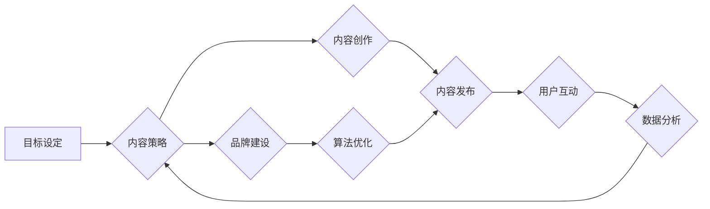

> 社交媒体运营，内容策略，用户互动，数据分析，品牌建设，算法优化，社交平台

## 1. 背景介绍

在当今数字时代，社交媒体已成为人们获取信息、交流互动、分享体验的重要平台。对于企业和个人而言，有效地运营社交媒体账号已成为不可或缺的营销策略。然而，社交媒体运营并非易事，需要深入了解平台规则、用户行为、内容趋势等多方面因素，并制定科学的运营策略。

## 2. 核心概念与联系

社交媒体运营的核心概念包括：

* **内容策略:**  指制定明确的目标、确定目标受众、规划内容类型、风格和发布频率等一系列规划。
* **用户互动:**  积极与用户进行交流，回复评论、私信、举办活动等，建立良好的用户关系。
* **数据分析:**  通过分析平台数据，了解用户行为、内容表现、营销效果等，不断优化运营策略。
* **品牌建设:**  利用社交媒体平台塑造品牌形象，提升品牌知名度和美誉度。
* **算法优化:**  了解平台算法规则，优化内容格式、标签、发布时间等，提高内容曝光率。

**社交媒体运营流程图:**



## 3. 核心算法原理 & 具体操作步骤

### 3.1  算法原理概述

社交媒体平台的算法主要用于推荐内容、排序帖子、匹配用户兴趣等。这些算法通常基于机器学习技术，通过分析用户行为数据，预测用户可能感兴趣的内容。

常见的算法类型包括：

* **协同过滤:**  根据用户相似度推荐内容。
* **内容基准:**  根据内容主题、标签、关键词等特征推荐内容。
* **深度学习:**  利用神经网络模型，学习用户行为模式，推荐个性化内容。

### 3.2  算法步骤详解

1. **数据收集:**  平台收集用户行为数据，包括浏览记录、点赞、评论、分享等。
2. **数据预处理:**  对收集到的数据进行清洗、转换、特征提取等处理。
3. **模型训练:**  利用机器学习算法，训练推荐模型。
4. **模型评估:**  评估模型的推荐效果，并进行调整优化。
5. **内容推荐:**  根据用户行为和模型预测，推荐相关内容。

### 3.3  算法优缺点

**优点:**

* **个性化推荐:**  根据用户兴趣，推荐更精准的内容。
* **提升用户粘性:**  提供更符合用户需求的内容，提高用户使用时长和活跃度。
* **提高广告效果:**  精准投放广告，提升广告转化率。

**缺点:**

* **信息茧房:**  算法可能会推荐用户已经熟悉的类型内容，导致信息单一化。
* **数据隐私:**  算法需要大量用户数据，可能存在数据隐私泄露风险。
* **算法偏差:**  算法训练数据可能存在偏差，导致推荐结果不公平。

### 3.4  算法应用领域

社交媒体算法广泛应用于：

* **内容推荐:**  推荐新闻、视频、文章等内容。
* **用户匹配:**  匹配用户兴趣相似的群体，促进社交互动。
* **广告投放:**  精准投放广告，提高广告效果。
* **社区管理:**  识别和过滤恶意内容，维护社区秩序。

## 4. 数学模型和公式 & 详细讲解 & 举例说明

### 4.1  数学模型构建

社交媒体算法通常基于概率模型，例如贝叶斯网络、马尔科夫链等。这些模型可以用来预测用户行为、推荐内容、识别恶意内容等。

**举例:**

假设我们想要预测用户是否会点赞一条帖子。我们可以构建一个贝叶斯网络模型，其中节点代表用户特征、帖子特征、点赞行为等变量。模型的边表示变量之间的依赖关系。

### 4.2  公式推导过程

贝叶斯网络模型的推理过程基于贝叶斯定理：

$$P(A|B) = \frac{P(B|A)P(A)}{P(B)}$$

其中：

* $P(A|B)$ 是在已知事件 B 发生的情况下，事件 A 发生的概率。
* $P(B|A)$ 是在已知事件 A 发生的情况下，事件 B 发生的概率。
* $P(A)$ 是事件 A 发生的概率。
* $P(B)$ 是事件 B 发生的概率。

### 4.3  案例分析与讲解

我们可以利用贝叶斯网络模型，根据用户的历史行为数据、帖子的内容特征等信息，预测用户是否会点赞一条帖子。

**举例:**

假设用户 A 过去点赞过很多科技类帖子，而帖子 B 是关于科技领域的最新进展。根据贝叶斯网络模型，我们可以推断出用户 A 点赞帖子 B 的概率较高。

## 5. 项目实践：代码实例和详细解释说明

### 5.1  开发环境搭建

* 操作系统: Windows/macOS/Linux
* 编程语言: Python
* 开发工具: PyCharm/VS Code
* 库依赖: pandas, numpy, scikit-learn

### 5.2  源代码详细实现

```python
import pandas as pd
from sklearn.model_selection import train_test_split
from sklearn.linear_model import LogisticRegression

# 加载数据
data = pd.read_csv('social_media_data.csv')

# 特征工程
features = ['user_age', 'user_gender', 'post_category', 'post_length']
target = 'like'

# 数据分割
X_train, X_test, y_train, y_test = train_test_split(data[features], data[target], test_size=0.2)

# 模型训练
model = LogisticRegression()
model.fit(X_train, y_train)

# 模型评估
accuracy = model.score(X_test, y_test)
print(f'模型准确率: {accuracy}')

# 预测
new_data = pd.DataFrame({'user_age': [25], 'user_gender': ['male'], 'post_category': ['technology'], 'post_length': [200]})
prediction = model.predict(new_data)
print(f'预测结果: {prediction}')
```

### 5.3  代码解读与分析

* 代码首先加载社交媒体数据，并进行特征工程，选择用户特征和帖子特征作为模型输入。
* 然后将数据分割为训练集和测试集，用于模型训练和评估。
* 使用逻辑回归模型进行训练，并评估模型的准确率。
* 最后，使用训练好的模型预测新数据的点赞行为。

### 5.4  运行结果展示

运行代码后，会输出模型的准确率和对新数据的预测结果。

## 6. 实际应用场景

### 6.1  内容推荐

社交媒体平台利用算法推荐用户可能感兴趣的内容，例如新闻、视频、文章等。

### 6.2  用户匹配

社交媒体平台利用算法匹配用户兴趣相似的群体，促进社交互动。

### 6.3  广告投放

社交媒体平台利用算法精准投放广告，提高广告效果。

### 6.4  未来应用展望

* **个性化内容生成:**  利用人工智能技术，生成更符合用户个性化的内容。
* **虚拟社交体验:**  构建虚拟社交环境，提供更沉浸式的社交体验。
* **跨平台数据整合:**  整合不同平台的用户数据，提供更全面的用户画像。

## 7. 工具和资源推荐

### 7.1  学习资源推荐

* **书籍:**
    * 《社交媒体营销》
    * 《算法设计手册》
* **在线课程:**
    * Coursera: 数据科学
    * Udacity: 人工智能

### 7.2  开发工具推荐

* **数据分析工具:**
    * Python: pandas, numpy, scikit-learn
    * R: tidyverse
* **社交媒体管理工具:**
    * Hootsuite
    * Buffer

### 7.3  相关论文推荐

* **社交媒体算法研究:**
    * "The Filter Bubble"
    * "On the Dangers of Stochastic Parrots: Can Language Models Be Too Big?"

## 8. 总结：未来发展趋势与挑战

### 8.1  研究成果总结

社交媒体运营已成为数字营销的重要组成部分，算法技术在内容推荐、用户匹配、广告投放等方面发挥着重要作用。

### 8.2  未来发展趋势

* **人工智能技术:**  人工智能技术将进一步提升社交媒体运营的智能化水平。
* **隐私保护:**  随着数据隐私意识的增强，社交媒体平台将更加注重用户隐私保护。
* **内容真实性:**  社交媒体平台将更加重视内容真实性和可靠性。

### 8.3  面临的挑战

* **算法偏差:**  算法训练数据可能存在偏差，导致推荐结果不公平。
* **信息茧房:**  算法可能会推荐用户已经熟悉的类型内容，导致信息单一化。
* **网络安全:**  社交媒体平台面临着网络攻击和数据泄露的风险。

### 8.4  研究展望

未来研究将重点关注以下方面:

* **公平算法设计:**  开发更公平、更透明的算法模型。
* **个性化内容生成:**  利用人工智能技术，生成更符合用户个性化的内容。
* **跨平台数据整合:**  整合不同平台的用户数据，提供更全面的用户画像。

## 9. 附录：常见问题与解答

* **如何提高社交媒体账号的曝光率?**

可以通过优化内容格式、标签、发布时间等，以及利用平台广告等方式提高账号的曝光率。

* **如何与用户进行有效的互动?**

可以通过积极回复评论、私信、举办活动等方式与用户进行互动，建立良好的用户关系。

* **如何分析社交媒体数据?**

可以通过使用平台自带的分析工具，或者使用第三方数据分析工具，分析用户行为、内容表现、营销效果等数据。


作者：禅与计算机程序设计艺术 / Zen and the Art of Computer Programming 
<end_of_turn>