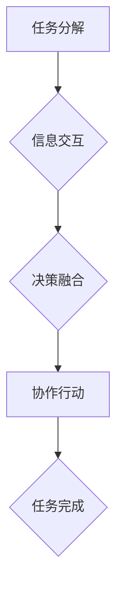

> 多智能体协同，任务完成度，人工智能，机器学习，分布式计算，协作算法，智能体

## 1. 背景介绍

在当今科技飞速发展的时代，人工智能（AI）正以惊人的速度发展，并逐渐渗透到各个领域。其中，多智能体协同（Multi-Agent Collaboration，MAC）作为人工智能的重要研究方向之一，引起了广泛关注。

多智能体协同是指多个智能体在共同目标下，通过信息交互和协作行动，实现更高效、更智能的任务完成。与单智能体系统相比，多智能体协同系统具有以下优势：

* **鲁棒性强:** 多个智能体协同工作，即使部分智能体出现故障，也能保证整体任务的完成。
* **适应性强:** 多智能体系统可以根据环境变化和任务需求，灵活调整协作策略，提高适应性。
* **效率高:** 多个智能体并行工作，可以显著提高任务完成效率。

多智能体协同技术在许多领域都有着广泛的应用前景，例如：

* **自动驾驶:** 多个传感器和智能体协同工作，可以实现更安全、更智能的自动驾驶。
* **机器人协作:** 多个机器人协同工作，可以完成复杂的任务，例如搬运、组装等。
* **网络安全:** 多个智能体协同工作，可以提高网络安全防御能力。
* **金融交易:** 多个智能体协同工作，可以优化交易策略，提高投资收益。

## 2. 核心概念与联系

**2.1 多智能体系统**

多智能体系统由多个独立的智能体组成，每个智能体都具有感知环境、做出决策和执行行动的能力。智能体之间可以通过通信和协作，共同完成任务。

**2.2 智能体**

智能体是多智能体系统中的基本单元，它是一个能够感知环境、做出决策并执行行动的独立实体。智能体可以是软件程序、机器人、传感器等。

**2.3 协作算法**

协作算法是多智能体系统中实现智能体协作的关键技术。协作算法可以帮助智能体进行信息共享、决策融合和行动协调，从而提高任务完成效率。

**2.4 任务分解**

任务分解是指将一个复杂的任务分解成多个子任务，每个子任务可以由一个或多个智能体独立完成。任务分解可以提高任务的执行效率和鲁棒性。

**2.5 信息交互**

信息交互是多智能体系统中智能体之间进行沟通和协作的基础。信息交互可以是同步的，也可以是异步的。

**2.6 决策融合**

决策融合是指多个智能体根据各自的感知信息和决策结果，进行融合和决策，最终达成一致的行动方案。

**2.7 协作策略**

协作策略是指多智能体系统中智能体之间协作的方式和规则。协作策略可以是预先定义的，也可以是动态调整的。

**2.8 Mermaid 流程图**



## 3. 核心算法原理 & 具体操作步骤

### 3.1 算法原理概述

多智能体协同算法的原理是基于智能体之间的信息共享、决策融合和行动协调。常见的协作算法包括：

* **中心化控制:** 一个中央控制器负责分配任务和协调智能体行动。
* **分布式控制:** 智能体之间直接通信和协作，无需中央控制器。
* **混合控制:** 将中心化控制和分布式控制相结合，根据任务需求选择不同的控制方式。

### 3.2 算法步骤详解

以分布式控制为例，多智能体协同算法的具体操作步骤如下：

1. **任务分解:** 将复杂任务分解成多个子任务，每个子任务可以由一个或多个智能体独立完成。
2. **智能体感知:** 智能体感知环境信息，例如传感器数据、位置信息等。
3. **信息共享:** 智能体之间通过通信协议共享感知信息和决策结果。
4. **决策融合:** 智能体根据共享信息和自身知识，进行决策融合，达成一致的行动方案。
5. **行动执行:** 智能体执行决策结果，完成子任务。
6. **任务完成:** 所有子任务完成，最终完成整个任务。

### 3.3 算法优缺点

**优点:**

* **鲁棒性强:** 即使部分智能体出现故障，也能保证整体任务的完成。
* **适应性强:** 智能体可以根据环境变化和任务需求，灵活调整协作策略。

**缺点:**

* **通信开销大:** 智能体之间需要频繁通信，可能会导致通信开销大。
* **协调复杂:** 多个智能体协作需要复杂的协调机制，算法设计难度较高。

### 3.4 算法应用领域

多智能体协同算法广泛应用于以下领域:

* **自动驾驶:** 多个传感器和智能体协同工作，可以实现更安全、更智能的自动驾驶。
* **机器人协作:** 多个机器人协同工作，可以完成复杂的任务，例如搬运、组装等。
* **网络安全:** 多个智能体协同工作，可以提高网络安全防御能力。
* **金融交易:** 多个智能体协同工作，可以优化交易策略，提高投资收益。

## 4. 数学模型和公式 & 详细讲解 & 举例说明

### 4.1 数学模型构建

多智能体协同系统可以抽象为一个图论模型，其中智能体作为节点，信息交互作为边。

* **节点:** 代表每个智能体，每个节点具有状态、行为和感知能力。
* **边:** 代表智能体之间的信息交互，边上携带信息内容和交互时间。

### 4.2 公式推导过程

**4.2.1 信息传递模型:**

假设智能体 $i$ 向智能体 $j$ 发送信息 $m$，信息传递时间为 $t$，则可以表示为：

$$
P_{ij}(m,t) = \alpha_{ij} \cdot e^{-\beta_{ij} \cdot t}
$$

其中：

* $P_{ij}(m,t)$ 为智能体 $j$ 在时间 $t$ 接收信息 $m$ 的概率。
* $\alpha_{ij}$ 为智能体 $i$ 和 $j$ 之间的通信强度。
* $\beta_{ij}$ 为信息衰减系数。

**4.2.2 决策融合模型:**

假设智能体 $i$ 收到来自其他智能体的信息 $M = \{m_1, m_2, ..., m_n\}$，则智能体 $i$ 的决策 $d_i$ 可以表示为：

$$
d_i = f(M, w_i)
$$

其中：

* $f$ 为决策融合函数。
* $w_i$ 为智能体 $i$ 的权重。

### 4.3 案例分析与讲解

**案例:** 多智能体协同完成寻路任务

假设有多个智能体分布在不同的位置，需要协同完成从起点到终点的寻路任务。

* **任务分解:** 将寻路任务分解成多个子任务，例如寻找路径、避开障碍物等。
* **信息交互:** 智能体之间共享位置信息、路径信息和障碍物信息。
* **决策融合:** 智能体根据共享信息和自身知识，融合决策，选择最优路径。
* **行动执行:** 智能体沿着最优路径移动，最终到达终点。

## 5. 项目实践：代码实例和详细解释说明

### 5.1 开发环境搭建

* 操作系统: Ubuntu 20.04
* Python 版本: 3.8
* 必要的库: numpy, matplotlib, networkx

### 5.2 源代码详细实现

```python
import networkx as nx
import numpy as np

# 定义智能体类
class Agent:
    def __init__(self, id, position):
        self.id = id
        self.position = position
        self.knowledge = {}

    def perceive(self, environment):
        # 获取环境信息
        pass

    def communicate(self, other_agent, message):
        # 发送信息
        pass

    def decide(self):
        # 决策
        pass

# 定义环境类
class Environment:
    def __init__(self, graph):
        self.graph = graph

    def get_neighbors(self, node):
        # 获取节点的邻居节点
        return list(self.graph.neighbors(node))

# 创建环境和智能体
graph = nx.Graph()
agents = [Agent(i, (i, i)) for i in range(5)]

# 运行模拟
for _ in range(100):
    for agent in agents:
        agent.perceive(environment)
        agent.communicate(other_agents, agent.knowledge)
        agent.decide()

```

### 5.3 代码解读与分析

* **智能体类:** 定义了智能体的基本属性和行为，包括感知环境、通信、决策等。
* **环境类:** 定义了环境的结构和行为，包括获取节点邻居等。
* **代码流程:** 首先创建环境和智能体，然后进行模拟运行，每个智能体感知环境、与其他智能体通信、做出决策，最终完成任务。

### 5.4 运行结果展示

运行代码后，可以观察到智能体在环境中移动，协同完成任务。

## 6. 实际应用场景

### 6.1 自动驾驶

多智能体协同技术可以应用于自动驾驶，例如：

* **车队协作:** 多辆自动驾驶汽车协同行驶，提高道路通行效率。
* **环境感知:** 多个传感器协同感知环境，提高自动驾驶汽车的安全性。

### 6.2 机器人协作

多智能体协同技术可以应用于机器人协作，例如：

* **工业机器人协作:** 多个机器人协同完成复杂的任务，例如装配、焊接等。
* **服务机器人协作:** 多个机器人协同提供服务，例如送餐、清洁等。

### 6.3 网络安全

多智能体协同技术可以应用于网络安全，例如：

* **入侵检测:** 多个智能体协同分析网络流量，检测入侵行为。
* **恶意软件防御:** 多个智能体协同防御恶意软件攻击。

### 6.4 未来应用展望

多智能体协同技术在未来将有更广泛的应用，例如：

* **智慧城市:** 多个智能体协同管理城市资源，提高城市效率。
* **医疗保健:** 多个智能体协同提供医疗服务，提高医疗质量。
* **教育:** 多个智能体协同提供个性化教育服务。

## 7. 工具和资源推荐

### 7.1 学习资源推荐

* **书籍:**
    * Multi-Agent Systems: A Modern Approach by Shoham, Leyton-Brown
    * Introduction to Multiagent Systems by Wooldridge
* **在线课程:**
    * Coursera: Multi-Agent Systems
    * edX: Introduction to Multi-Agent Systems

### 7.2 开发工具推荐

* **Python:** 广泛用于多智能体系统开发，拥有丰富的库和工具。
* **ROS (Robot Operating System):** 用于机器人开发的开源平台，支持多智能体协作。
* **Gazebo:** 用于机器人仿真和测试的开源平台。

### 7.3 相关论文推荐

* **Multi-Agent Reinforcement Learning: A Survey** by Busoniu, Babuska, & De Schutter
* **Decentralized Multi-Agent Pathfinding: A Survey** by  Kurniawati, Felner, & Koenig
* **Cooperative Multi-Agent Learning** by  Kearns & Singh

## 8. 总结：未来发展趋势与挑战

### 8.1 研究成果总结

多智能体协同技术取得了显著的进展，在多个领域得到了应用。

### 8.2 未来发展趋势

* **更智能的协作算法:** 研究更智能、更鲁棒、更适应环境变化的协作算法。
* **更复杂的场景应用