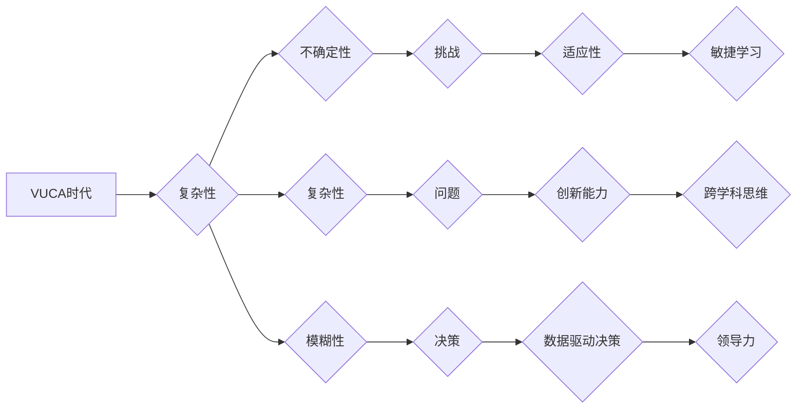

> VUCA时代, 复杂系统, 敏捷学习, 跨学科思维, 数据驱动决策, 人工智能, 深度学习, 创新能力, 适应性, 领导力

## 1. 背景介绍

当今世界正处于快速变化、充满不确定性的VUCA时代。VUCA是一个首字母缩写，代表着**复杂性（Volatility）、不确定性（Uncertainty）、复杂性（Complexity）和模糊性（Ambiguity）**。在这个时代，传统的学习模式和技能体系已经无法满足人们不断变化的需求。

VUCA时代对个人和组织提出了严峻的挑战，也孕育着无限的机遇。为了在充满挑战的时代中脱颖而出，我们需要掌握新的学习体系，培养适应VUCA时代的重要技能。

## 2. 核心概念与联系

**2.1 VUCA时代概述**

VUCA时代是指全球化、信息化、科技革命等因素共同作用下，世界呈现出快速变化、充满不确定性、复杂性和模糊性的时代特征。

* **复杂性（Volatility）：** 世界变化速度加快，事件发生频率增加，趋势难以预测。
* **不确定性（Uncertainty）：** 未来充满未知，难以预知事件的走向和结果。
* **复杂性（Complexity）：** 系统相互关联，问题相互影响，难以找到单一的解决方案。
* **模糊性（Ambiguity）：** 信息缺乏清晰的界限，难以区分真假，判断标准模糊。

**2.2 核心概念联系**

VUCA时代的核心概念相互关联，共同构成了一个复杂的系统。

* 复杂性导致不确定性增加，模糊性加剧。
* 不确定性加剧了复杂性，使得问题更加难以解决。
* 模糊性使得决策更加困难，增加了风险。

**2.3 核心概念与技能联系**

VUCA时代对个人和组织提出了新的挑战，也需要新的技能来应对。

* **敏捷学习：** 适应快速变化的环境，不断学习新知识和技能。
* **跨学科思维：** 融合不同领域的知识，解决复杂问题。
* **数据驱动决策：** 基于数据分析，做出更明智的决策。
* **创新能力：** 提出新的想法，创造新的价值。
* **适应性：** 能够适应不断变化的环境，灵活应对挑战。
* **领导力：** 能够带领团队在VUCA时代中取得成功。

**2.4 Mermaid 流程图**



## 3. 核心算法原理 & 具体操作步骤

**3.1 算法原理概述**

在VUCA时代，我们需要掌握一些核心算法原理，以便更好地应对挑战。例如，机器学习算法可以帮助我们从海量数据中提取有价值的信息，做出更明智的决策。深度学习算法可以帮助我们模拟人类大脑的学习过程，解决更复杂的问题。

**3.2 算法步骤详解**

以机器学习算法为例，其基本步骤包括：

1. **数据收集和预处理:** 收集相关数据，并进行清洗、转换、特征提取等预处理工作。
2. **模型选择:** 根据具体问题选择合适的机器学习模型，例如线性回归、逻辑回归、决策树、支持向量机等。
3. **模型训练:** 使用训练数据训练模型，调整模型参数，使其能够准确地预测目标变量。
4. **模型评估:** 使用测试数据评估模型的性能，例如准确率、召回率、F1-score等。
5. **模型部署:** 将训练好的模型部署到实际应用场景中，用于预测新的数据。

**3.3 算法优缺点**

不同的机器学习算法具有不同的优缺点，需要根据具体问题选择合适的算法。例如，线性回归算法简单易实现，但对非线性关系的拟合能力较差。决策树算法可以处理非线性关系，但容易过拟合。支持向量机算法可以处理高维数据，但训练时间较长。

**3.4 算法应用领域**

机器学习算法广泛应用于各个领域，例如：

* **图像识别:** 自动识别图像中的物体、场景等。
* **自然语言处理:** 处理文本数据，例如文本分类、情感分析、机器翻译等。
* **推荐系统:** 根据用户的历史行为推荐相关商品或服务。
* **金融预测:** 预测股票价格、信用风险等。

## 4. 数学模型和公式 & 详细讲解 & 举例说明

**4.1 数学模型构建**

在机器学习中，我们通常使用数学模型来表示数据之间的关系。例如，线性回归模型可以用以下公式表示：

$$y = wx + b$$

其中：

* $y$ 是目标变量
* $x$ 是输入变量
* $w$ 是权重参数
* $b$ 是偏置参数

**4.2 公式推导过程**

线性回归模型的权重参数 $w$ 和偏置参数 $b$ 可以通过最小二乘法来求解。最小二乘法是一种常用的优化算法，其目标是找到使得模型预测值与实际值之间的误差最小化的参数值。

**4.3 案例分析与讲解**

假设我们有一个数据集，包含房屋面积和房屋价格的信息。我们可以使用线性回归模型来预测房屋价格。

* 输入变量 $x$：房屋面积
* 目标变量 $y$：房屋价格

通过训练线性回归模型，我们可以得到模型参数 $w$ 和 $b$。然后，我们可以使用这个模型来预测新的房屋价格。例如，如果一个房屋面积为100平方米，我们可以使用以下公式来预测其价格：

$$y = wx + b$$

其中 $x = 100$。

## 5. 项目实践：代码实例和详细解释说明

**5.1 开发环境搭建**

为了实现机器学习项目，我们需要搭建一个开发环境。常用的开发环境包括：

* Python 语言环境
* 机器学习库，例如 scikit-learn、TensorFlow、PyTorch 等

**5.2 源代码详细实现**

以下是一个使用 scikit-learn 库实现线性回归模型的 Python 代码示例：

```python
from sklearn.linear_model import LinearRegression
from sklearn.model_selection import train_test_split
from sklearn.metrics import mean_squared_error

# 加载数据
data = ...

# 将数据分为训练集和测试集
X_train, X_test, y_train, y_test = train_test_split(data[:, :-1], data[:, -1], test_size=0.2)

# 创建线性回归模型
model = LinearRegression()

# 训练模型
model.fit(X_train, y_train)

# 预测测试集数据
y_pred = model.predict(X_test)

# 计算模型性能
mse = mean_squared_error(y_test, y_pred)
print(f"Mean Squared Error: {mse}")
```

**5.3 代码解读与分析**

这段代码首先加载数据，然后将数据分为训练集和测试集。接着，创建了一个线性回归模型，并使用训练集训练模型。最后，使用测试集数据预测目标变量，并计算模型性能。

**5.4 运行结果展示**

运行这段代码后，会输出模型的性能指标，例如均方误差 (MSE)。MSE 越小，模型的预测性能越好。

## 6. 实际应用场景

**6.1 医疗诊断**

机器学习算法可以帮助医生诊断疾病，例如癌症、心血管疾病等。

**6.2 金融风险管理**

机器学习算法可以帮助金融机构识别和管理风险，例如信用风险、市场风险等。

**6.3 个性化推荐**

机器学习算法可以帮助电商平台提供个性化商品推荐，提高用户体验。

**6.4 自动驾驶**

机器学习算法是自动驾驶汽车的核心技术之一，可以帮助汽车识别道路环境、做出驾驶决策。

**6.5 未来应用展望**

随着人工智能技术的不断发展，机器学习算法将在更多领域得到应用，例如：

* **教育:** 个性化学习、智能辅导
* **制造业:** 智能制造、预测性维护
* **农业:** 智能农业、精准种植

## 7. 工具和资源推荐

**7.1 学习资源推荐**

* **在线课程:** Coursera、edX、Udacity 等平台提供丰富的机器学习课程。
* **书籍:** 《机器学习》 (周志华)、《深度学习》 (Ian Goodfellow) 等书籍是机器学习学习的经典教材。
* **博客和论坛:** Kaggle、Towards Data Science 等平台提供大量的机器学习博客文章和论坛讨论。

**7.2 开发工具推荐**

* **Python:** 机器学习开发的常用语言。
* **scikit-learn:** Python 机器学习库，提供各种机器学习算法和工具。
* **TensorFlow:** Google 开发的深度学习框架。
* **PyTorch:** Facebook 开发的深度学习框架。

**7.3 相关论文推荐**

* **《机器学习》 (周志华)**
* **《深度学习》 (Ian Goodfellow)**
* **《Pattern Recognition and Machine Learning》 (Christopher M. Bishop)**

## 8. 总结：未来发展趋势与挑战

**8.1 研究成果总结**

近年来，机器学习算法取得了显著的进展，在各个领域都取得了成功应用。

**8.2 未来发展趋势**

未来，机器学习算法将朝着以下方向发展：

* **更强大的模型:** 开发更强大的深度学习模型，能够解决更复杂的问题。
* **更有效的算法:** 开发更有效的机器学习算法，提高模型的效率和准确性。
* **更广泛的应用:** 将机器学习算法应用到更多领域，例如医疗、教育、农业等。

**8.3 面临的挑战**

机器学习算法也面临一些挑战，例如：

* **数据隐私:** 如何保护数据隐私，避免数据泄露。
* **算法可解释性:** 如何解释机器学习模型的决策过程，提高模型的可信度。
* **算法公平性:** 如何确保机器学习算法公平公正，避免算法歧视。

**8.4 研究展望**

未来，我们需要继续研究和探索机器学习算法，解决上述挑战，推动机器学习技术的发展。

## 9. 附录：常见问题与解答

**9.1 什么是机器学习？**

机器学习是一种人工智能技术，它通过算法学习数据，从数据中提取规律，从而能够预测未来事件或做出决策。

**9.2 机器学习算法有哪些？**

常见的机器学习算法包括：线性回归、逻辑回归、决策树、支持向量机、神经网络等。

**9.3 如何选择合适的机器学习算法？**

选择合适的机器学习算法需要根据具体问题和数据特点来决定。

**9.4 如何评估机器学习模型的性能？**

常用的机器学习模型性能指标包括：准确率、召回率、F1-score、均方误差等。

**9.5 机器学习的应用场景有哪些？**

机器学习广泛应用于各个领域，例如：医疗诊断、金融风险管理、个性化推荐、自动驾驶等。


作者：禅与计算机程序设计艺术 / Zen and the Art of Computer Programming 
<end_of_turn>