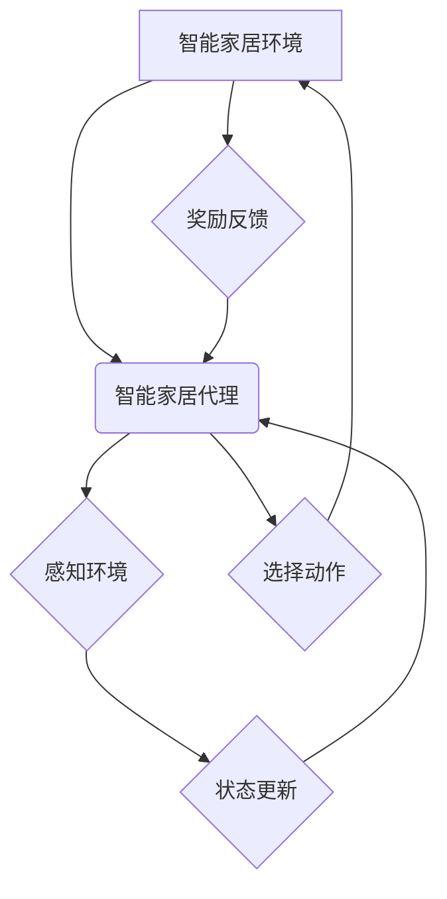

> 强化学习，智能家居，强化学习算法，深度学习，环境交互，奖励机制，状态空间，动作空间

## 1. 背景介绍

智能家居正以惊人的速度发展，它将我们的生活变得更加便捷、舒适和安全。从智能照明和温度控制到语音助手和远程监控，智能家居技术正在改变我们与家园的互动方式。然而，传统的基于规则或模式识别的智能家居系统往往难以应对复杂、动态的环境变化。

强化学习 (Reinforcement Learning, RL) 作为一种机器学习范式，为智能家居的未来发展提供了新的可能性。它能够通过与环境交互学习最优策略，从而实现更智能、更适应性强的家居自动化控制。

## 2. 核心概念与联系

强化学习的核心概念是**代理 (Agent)**、**环境 (Environment)**、**状态 (State)**、**动作 (Action)**、**奖励 (Reward)** 和**策略 (Policy)**。

* **代理:** 智能家居系统中的智能体，负责感知环境、做出决策并执行动作。
* **环境:** 智能家居系统所处的外部世界，包括各种传感器数据、设备状态和用户行为等。
* **状态:** 环境在特定时刻的描述，例如房间温度、灯光状态、用户位置等。
* **动作:** 代理可以执行的操作，例如调节温度、打开灯光、播放音乐等。
* **奖励:** 环境对代理动作的反馈，可以是正向奖励（例如用户满意）或负向奖励（例如设备故障）。
* **策略:** 代理根据当前状态选择动作的规则，目标是最大化累积的奖励。

**强化学习在智能家居中的应用架构**



## 3. 核心算法原理 & 具体操作步骤

### 3.1  算法原理概述

强化学习算法的核心是通过**试错学习**的方式，不断调整策略以最大化累积的奖励。常见的强化学习算法包括：

* **Q-学习:** 通过构建**Q表**来存储每个状态-动作对的价值函数，并根据奖励和价值函数更新Q表，最终学习出最优策略。
* **SARSA:** 与Q-学习类似，但SARSA在更新Q表时使用的是当前状态-动作对的实际价值，而不是预测的价值。
* **Deep Q-Network (DQN):** 将深度神经网络应用于Q-学习，能够处理高维状态空间和复杂环境。

### 3.2  算法步骤详解

以Q-学习为例，其具体操作步骤如下：

1. **初始化Q表:** 将所有状态-动作对的Q值初始化为0。
2. **环境交互:** 代理与环境交互，观察当前状态并选择一个动作。
3. **获得奖励:** 环境根据代理的动作提供奖励。
4. **更新Q值:** 使用Bellman方程更新Q表中的Q值，公式如下：

 $$Q(s,a) = Q(s,a) + \alpha [r + \gamma \max_{a'} Q(s',a') - Q(s,a)]$$

其中：

* $Q(s,a)$ 是状态$s$下执行动作$a$的Q值。
* $\alpha$ 是学习率，控制着学习速度。
* $r$ 是获得的奖励。
* $\gamma$ 是折扣因子，控制着未来奖励的权重。
* $s'$ 是执行动作$a$后进入的下一个状态。
* $a'$ 是在下一个状态$s'$中选择的最优动作。

5. **重复步骤2-4:** 直到代理学习出最优策略。

### 3.3  算法优缺点

**优点:**

* 能够学习复杂环境中的最优策略。
* 不需要事先定义规则，能够适应动态变化的环境。

**缺点:**

* 训练过程可能需要大量的时间和数据。
* 容易陷入局部最优解。

### 3.4  算法应用领域

强化学习在智能家居中的应用领域非常广泛，例如：

* **智能照明:** 根据用户行为和环境光照情况自动调节灯光亮度和颜色。
* **智能温度控制:** 根据用户偏好和环境温度自动调节空调温度。
* **智能家居安全:** 通过监控摄像头和传感器数据，识别异常行为并报警。
* **个性化家居服务:** 根据用户的习惯和需求，提供个性化的家居服务，例如自动播放音乐、提醒日程安排等。

## 4. 数学模型和公式 & 详细讲解 & 举例说明

### 4.1  数学模型构建

强化学习的数学模型主要包括状态空间、动作空间、奖励函数和价值函数。

* **状态空间:** 智能家居环境的所有可能状态的集合。例如，房间温度、灯光状态、用户位置等。
* **动作空间:** 智能家居代理可以执行的所有动作的集合。例如，调节温度、打开灯光、播放音乐等。
* **奖励函数:** 将环境状态和代理动作映射到奖励值的功能。奖励值可以是正向奖励（例如用户满意）或负向奖励（例如设备故障）。
* **价值函数:** 评估状态或状态-动作对的期望累积奖励的功能。

### 4.2  公式推导过程

强化学习算法的核心是通过更新价值函数来学习最优策略。常用的价值函数更新公式是Bellman方程：

$$V(s) = \max_{a} \mathbb{E}[r + \gamma V(s') | s, a]$$

其中：

* $V(s)$ 是状态$s$的价值函数。
* $r$ 是获得的奖励。
* $\gamma$ 是折扣因子。
* $s'$ 是执行动作$a$后进入的下一个状态。
* $\mathbb{E}$ 表示期望值。

### 4.3  案例分析与讲解

例如，假设智能家居系统需要学习如何调节房间温度。状态空间可以包含房间温度、用户偏好等信息，动作空间可以包含调节温度的多个值。奖励函数可以根据房间温度与用户偏好之间的差异来确定奖励值。通过不断与环境交互，智能家居系统可以学习到最优的温度调节策略，从而使用户感到舒适。

## 5. 项目实践：代码实例和详细解释说明

### 5.1  开发环境搭建

* Python 3.x
* TensorFlow 或 PyTorch 深度学习框架
* OpenAI Gym 或其他强化学习库

### 5.2  源代码详细实现

```python
import gym
import tensorflow as tf

# 定义环境
env = gym.make('CartPole-v1')

# 定义神经网络模型
model = tf.keras.Sequential([
    tf.keras.layers.Dense(128, activation='relu'),
    tf.keras.layers.Dense(env.action_space.n)
])

# 定义损失函数和优化器
optimizer = tf.keras.optimizers.Adam()
loss_fn = tf.keras.losses.SparseCategoricalCrossentropy()

# 训练循环
for episode in range(1000):
    state = env.reset()
    done = False
    total_reward = 0

    while not done:
        # 选择动作
        action = model.predict(state[None, :])[0]
        action = tf.argmax(action).numpy()

        # 执行动作并获取奖励
        next_state, reward, done, _ = env.step(action)

        # 更新模型参数
        with tf.GradientTape() as tape:
            prediction = model(state[None, :])
            loss = loss_fn(tf.one_hot(action, depth=env.action_space.n), prediction)
        gradients = tape.gradient(loss, model.trainable_variables)
        optimizer.apply_gradients(zip(gradients, model.trainable_variables))

        # 更新状态
        state = next_state

        # 更新总奖励
        total_reward += reward

    print(f'Episode {episode+1}, Total Reward: {total_reward}')

# 保存模型
model.save('cartpole_model.h5')
```

### 5.3  代码解读与分析

这段代码实现了基于DQN算法的CartPole环境训练。

* 首先，定义了环境和神经网络模型。
* 然后，定义了损失函数和优化器。
* 训练循环中，代理与环境交互，选择动作，执行动作并获取奖励。
* 根据奖励和状态信息，更新神经网络模型的参数。
* 最后，保存训练好的模型。

### 5.4  运行结果展示

训练完成后，模型能够在CartPole环境中保持平衡杆的稳定时间达到较高的水平。

## 6. 实际应用场景

### 6.1  智能照明

* 根据用户行为和环境光照情况自动调节灯光亮度和颜色，营造舒适的氛围。
* 通过传感器检测用户位置，自动开启或关闭灯光，节省能源。
* 根据时间和场景自动切换灯光模式，例如，晚上使用暖色灯光，白天使用白光。

### 6.2  智能温度控制

* 根据用户偏好和环境温度自动调节空调温度，保持舒适的室内温度。
* 通过传感器检测房间温度和湿度，自动调节空调运行模式，提高能源效率。
* 根据用户日程安排，提前调节空调温度，节省能源。

### 6.3  智能家居安全

* 通过监控摄像头和传感器数据，识别异常行为，例如入侵、火灾等，并及时报警。
* 根据用户行为模式，识别异常情况，例如，长时间无人在家，自动触发安全措施。
* 通过智能门锁，实现远程控制和身份验证，提高家居安全。

### 6.4  未来应用展望

随着人工智能技术的不断发展，强化学习在智能家居中的应用将更加广泛和深入。例如：

* **个性化家居服务:** 根据用户的习惯和需求，提供个性化的家居服务，例如自动播放音乐、提醒日程安排等。
* **主动式家居管理:** 智能家居系统能够主动学习用户的行为模式，并根据需要自动执行任务，例如，自动清洁房间、自动购物等。
* **跨设备协同:** 智能家居系统能够与其他设备协同工作，例如，与智能汽车协同控制家居环境，与智能医疗设备协同提供健康服务等。

## 7. 工具和资源推荐

### 7.1  学习资源推荐

* **书籍:**
    * Reinforcement Learning: An Introduction by Richard S. Sutton and Andrew G. Barto
    * Deep Reinforcement Learning Hands-On by Maxim Lapan
* **在线课程:**
    * Deep Reinforcement Learning Specialization by DeepLearning.AI
    * Reinforcement Learning by David Silver (University of DeepMind)

### 7.2  开发工具推荐

* **Python:** 作为强化学习开发的主要语言，Python拥有丰富的库和工具。
* **TensorFlow:** Google开发的开源深度学习框架，支持强化学习算法的实现。
* **PyTorch:** Facebook开发的开源深度学习框架，也支持强化学习算法的实现。
* **OpenAI Gym:** 用于强化学习算法开发和测试的开源环境库。

### 7.3  相关论文推荐

* **Deep Q-Network (DQN):** Mnih et al. (2015)
* **Proximal Policy Optimization (PPO):** Schulman et al. (2017)
* **Asynchronous Advantage Actor-Critic (A3C):** Mnih et al. (2016)

## 8. 总结：未来发展趋势与挑战

### 8.1  研究成果总结

强化学习在智能家居领域的应用取得了显著进展，例如，智能照明、智能温度控制、智能家居安全等方面都取得了突破。

### 8.2  未来发展趋势

* **更复杂的智能家居环境:** 未来智能家居环境将更加复杂，包含更多设备和传感器，强化学习算法需要能够处理更高维度的状态空间和更复杂的决策问题。
* **更个性化的家居服务:** 智能家居系统将更加注重个性化服务，需要能够学习用户的习惯和需求，并提供更加定制化的服务。
* **更安全的智能家居系统:** 智能家居