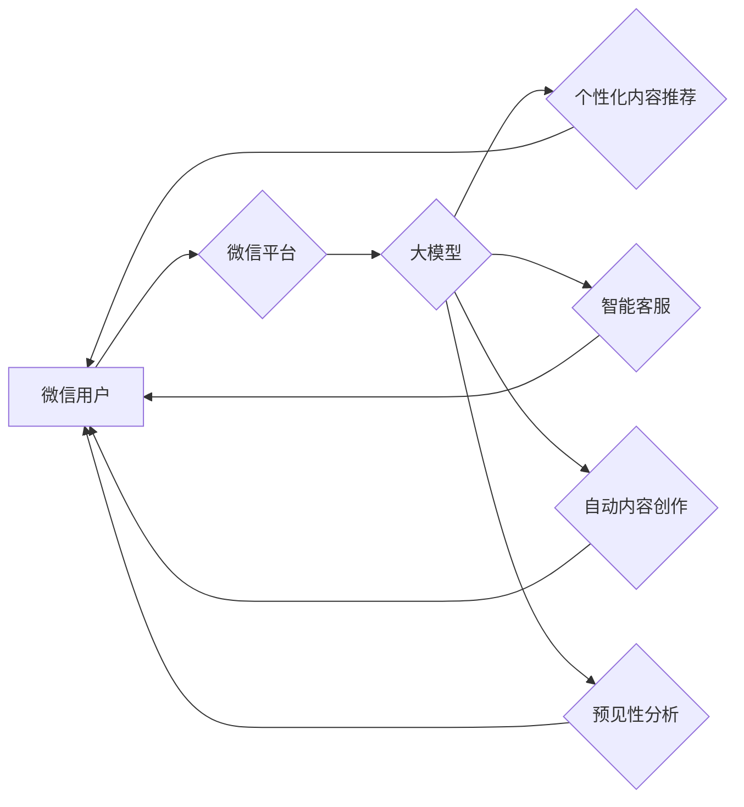

> 微信营销, 大模型, 自然语言处理, 聊天机器人, 内容生成, 个性化推荐, 预见性分析

## 1. 背景介绍

微信作为中国最受欢迎的社交平台之一，拥有超过12亿活跃用户，其庞大的用户群体和丰富的生态系统为企业提供了巨大的营销机遇。然而，随着用户对营销内容的审美疲劳和信息过载，传统的微信营销方式逐渐失去效力。

大模型技术的兴起为微信营销带来了新的可能性。大模型，即大型语言模型，通过训练海量文本数据，能够理解和生成人类语言，并具备强大的文本处理能力。将大模型应用于微信营销，可以实现个性化内容推荐、智能客服、自动内容创作等功能，提升营销效率和用户体验。

## 2. 核心概念与联系

### 2.1 微信营销

微信营销是指利用微信平台进行的营销活动，包括但不限于：

* **公众号运营:** 通过创建公众号发布内容，与用户互动，推广产品或服务。
* **朋友圈营销:** 利用朋友圈的社交属性，发布产品信息、活动推广等内容。
* **微信广告:** 在微信平台投放广告，精准触达目标用户。
* **微信小程序:** 开发小程序，提供用户体验和服务，提升用户粘性。

### 2.2 大模型

大模型是一种基于深度学习的机器学习模型，通过训练海量文本数据，学习语言的语法、语义和上下文关系，能够理解和生成人类语言。常见的代表性大模型包括：

* **GPT-3:** 由OpenAI开发，拥有1750亿参数，能够进行文本生成、翻译、问答等任务。
* **BERT:** 由Google开发，擅长理解文本语义，常用于搜索引擎优化和自然语言理解任务。
* **LaMDA:** 由Google开发，专注于对话生成，能够进行自然流畅的对话。

### 2.3 核心概念联系

大模型可以为微信营销提供以下核心功能：

* **个性化内容推荐:** 根据用户的兴趣爱好和行为数据，推荐个性化的产品信息和营销内容。
* **智能客服:** 利用大模型的自然语言理解能力，构建智能客服机器人，自动回复用户咨询，提升用户体验。
* **自动内容创作:** 利用大模型的文本生成能力，自动生成微信公众号文章、朋友圈文案等营销内容，提高营销效率。
* **预见性分析:** 通过分析用户行为数据和市场趋势，利用大模型进行预测分析，帮助企业制定更精准的营销策略。

**Mermaid 流程图**



## 3. 核心算法原理 & 具体操作步骤

### 3.1 算法原理概述

大模型的训练主要基于深度学习算法，特别是 Transformer 架构。Transformer 架构通过自注意力机制，能够捕捉文本序列中长距离依赖关系，提升模型的理解和生成能力。

### 3.2 算法步骤详解

1. **数据预处理:** 收集和清洗海量文本数据，进行分词、词向量化等预处理操作。
2. **模型训练:** 使用深度学习框架（如 TensorFlow 或 PyTorch）训练 Transformer 模型，通过反向传播算法优化模型参数。
3. **模型评估:** 使用测试集评估模型的性能，例如准确率、召回率、BLEU 等指标。
4. **模型部署:** 将训练好的模型部署到生产环境，用于实际应用。

### 3.3 算法优缺点

**优点:**

* 强大的文本理解和生成能力
* 能够捕捉长距离依赖关系
* 可迁移学习，在不同任务上进行泛化

**缺点:**

* 训练成本高，需要大量计算资源
* 模型参数量大，部署成本高
* 容易受到训练数据偏差的影响

### 3.4 算法应用领域

大模型在自然语言处理领域有着广泛的应用，例如：

* **机器翻译:** 将一种语言翻译成另一种语言。
* **文本摘要:** 自动生成文本的简短摘要。
* **问答系统:** 回答用户提出的问题。
* **对话系统:** 与用户进行自然流畅的对话。

## 4. 数学模型和公式 & 详细讲解 & 举例说明

### 4.1 数学模型构建

大模型的训练基于深度学习算法，其核心是构建一个复杂的数学模型，用来模拟人类语言的生成过程。

**Transformer 模型**

Transformer 模型的核心是自注意力机制，它能够捕捉文本序列中不同词之间的关系，并赋予每个词不同的权重。

**注意力机制公式:**

$$
Attention(Q, K, V) = softmax(\frac{QK^T}{\sqrt{d_k}})V
$$

其中：

* $Q$：查询矩阵
* $K$：键矩阵
* $V$：值矩阵
* $d_k$：键向量的维度
* $softmax$：softmax 函数

### 4.2 公式推导过程

注意力机制的公式通过计算查询向量 $Q$ 与键向量 $K$ 的点积，并使用 softmax 函数归一化，得到每个词对查询词的注意力权重。然后，将注意力权重与值向量 $V$ 进行加权求和，得到最终的输出。

### 4.3 案例分析与讲解

例如，在翻译句子 "The cat sat on the mat" 时，注意力机制可以将 "cat" 和 "sat" 关联起来，理解 "cat" 正在 "sat"，从而更好地翻译成 "猫坐在垫子上"。

## 5. 项目实践：代码实例和详细解释说明

### 5.1 开发环境搭建

* Python 3.7+
* TensorFlow 或 PyTorch 深度学习框架
* CUDA 和 cuDNN (可选，用于 GPU 加速)

### 5.2 源代码详细实现

```python
# 使用 TensorFlow 构建一个简单的 Transformer 模型
import tensorflow as tf

# 定义 Transformer 模型
class Transformer(tf.keras.Model):
    def __init__(self, vocab_size, embedding_dim, num_heads, num_layers):
        super(Transformer, self).__init__()
        self.embedding = tf.keras.layers.Embedding(vocab_size, embedding_dim)
        self.transformer_layers = tf.keras.layers.StackedRNNCells([
            tf.keras.layers.MultiHeadAttention(num_heads=num_heads, key_dim=embedding_dim)
            for _ in range(num_layers)
        ])

    def call(self, inputs):
        # Embedding 层
        embedded = self.embedding(inputs)
        # Transformer 层
        output = self.transformer_layers(embedded)
        return output

# 实例化模型
model = Transformer(vocab_size=10000, embedding_dim=128, num_heads=8, num_layers=6)

# 训练模型
model.compile(optimizer='adam', loss='mse')
model.fit(train_data, train_labels, epochs=10)

```

### 5.3 代码解读与分析

* 代码首先定义了一个 Transformer 模型类，包含 Embedding 层和 Transformer 层。
* Embedding 层将输入的词索引转换为词向量。
* Transformer 层使用多头注意力机制和多层网络结构，捕捉文本序列中的长距离依赖关系。
* 代码实例化模型并使用 Adam 优化器和均方误差损失函数进行训练。

### 5.4 运行结果展示

训练完成后，可以使用测试数据评估模型的性能，例如计算准确率、BLEU 等指标。

## 6. 实际应用场景

### 6.1 个性化内容推荐

利用大模型分析用户的兴趣爱好和行为数据，推荐个性化的产品信息和营销内容，提升用户参与度和转化率。

### 6.2 智能客服

构建智能客服机器人，自动回复用户咨询，提供24小时在线服务，提升用户体验和客服效率。

### 6.3 自动内容创作

利用大模型自动生成微信公众号文章、朋友圈文案等营销内容，提高营销效率和内容质量。

### 6.4 预见性分析

通过分析用户行为数据和市场趋势，利用大模型进行预测分析，帮助企业制定更精准的营销策略。

## 7. 工具和资源推荐

### 7.1 学习资源推荐

* **书籍:**
    * 《深度学习》
    * 《自然语言处理》
* **在线课程:**
    * Coursera: 深度学习
    * Udacity: 自然语言处理
* **开源项目:**
    * TensorFlow
    * PyTorch
    * Hugging Face

### 7.2 开发工具推荐

* **IDE:** PyCharm, VS Code
* **深度学习框架:** TensorFlow, PyTorch
* **云计算平台:** AWS, Azure, GCP

### 7.3 相关论文推荐

* Attention Is All You Need
* BERT: Pre-training of Deep Bidirectional Transformers for Language Understanding
* GPT-3: Language Models are Few-Shot Learners

## 8. 总结：未来发展趋势与挑战

### 8.1 研究成果总结

大模型技术在微信营销领域展现出巨大的潜力，能够提升营销效率、个性化体验和预见性分析能力。

### 8.2 未来发展趋势

* **模型规模和能力提升:** 未来大模型规模将进一步扩大，能力将更加强大，能够处理更复杂的任务。
* **多模态融合:** 大模型将融合文本、图像、音频等多模态数据，提供更丰富的用户体验。
* **边缘计算部署:** 大模型将部署到边缘设备，实现更低延迟和更高效率的应用。

### 8.3 面临的挑战

* **数据安全和隐私保护:** 大模型训练需要海量数据，如何保证数据安全和用户隐私是关键挑战。
* **模型可解释性和信任度:** 大模型的决策过程往往难以理解，如何提高模型的可解释性和信任度是重要课题。
* **伦理和社会影响:** 大模型的应用可能带来伦理和社会问题，需要进行深入研究和探讨。

### 8.4 研究展望

未来，大模型技术将继续发展，在微信营销领域发挥更重要的作用，为企业和用户带来更多价值。

## 9. 附录：常见问题与解答

### 9.1 如何选择合适的微信营销大模型？

选择合适的微信营销大模型需要考虑以下因素：

* **任务类型:** 不同的任务需要不同的模型，例如内容生成、客服机器人、个性化推荐等。
* **数据规模:** 模型的训练数据量会影响其性能，选择数据规模相匹配的模型。
* **计算资源:** 大模型训练需要大量的计算资源，选择合适的硬件环境。
* **成本:** 不同模型的训练和部署成本不同，需要根据预算选择。

### 9.2 如何保证大模型的安全性？

保证大模型的安全性需要采取以下措施：

* **数据加密:** 对训练数据进行加密，防止数据泄露。
* **模型安全审计:** 定期对模型进行安全审计，发现潜在的漏洞。
* **反恶意攻击:** 采用反恶意攻击技术，防止模型被恶意攻击。

### 9.3 如何提高大模型的可解释性？

提高大模型的可解释性可以通过以下方法：

* **使用可解释的模型架构:** 选择可解释性较高的模型架构，例如线性模型或决策树。
* **可视化模型决策过程:** 使用可视化工具展示模型的决策过程，帮助用户理解模型的 reasoning。
* **进行模型解释性分析:** 使用模型解释性分析技术，解释模型的预测结果。


作者：禅与计算机程序设计艺术 / Zen and the Art of Computer Programming 
<end_of_turn>