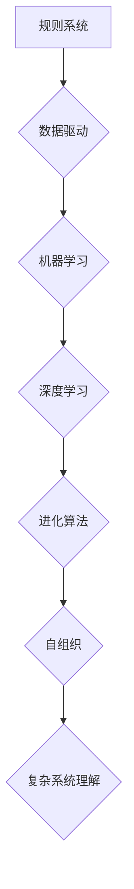

>人工智能，深度学习，神经网络，进化算法，复杂系统，自组织，机器学习

## 1. 背景介绍

在信息爆炸的时代，人类对复杂系统的理解和掌控能力面临着前所未有的挑战。从天气预报到金融市场，从生物进化到社会网络，无处不在的复杂性要求我们寻求新的思维方式和技术手段。人工智能（AI）作为一项前沿技术，正以其强大的学习和推理能力，为我们探索复杂系统提供了新的视角和工具。

本篇文章将探讨人工智能思想的进化，从简单的规则学习到复杂的深度学习，从模仿人类思维到自组织和进化，最终探讨人工智能如何帮助我们理解和应对复杂世界的挑战。

## 2. 核心概念与联系

人工智能的核心概念是模拟和扩展人类智能。这包括感知、学习、推理、决策和创造等能力。

**2.1 人工智能的进化路径**

人工智能的发展经历了多个阶段：

* **早期人工智能（1950s-1970s）：** 关注符号逻辑和规则系统，例如专家系统。
* **机器学习时代（1980s-2000s）：** 强调从数据中学习规律，例如决策树和支持向量机。
* **深度学习时代（2010s至今）：** 利用多层神经网络，实现更强大的学习能力，例如图像识别和自然语言处理。

**2.2 核心概念的联系**

* **机器学习：** 从数据中学习规律，无需明确编程。
* **深度学习：** 利用多层神经网络，模拟大脑神经网络结构，实现更复杂的学习。
* **进化算法：** 借鉴生物进化机制，通过选择、交叉和变异，优化算法参数。
* **自组织：** 系统通过相互作用和反馈，自发形成结构和秩序。

**2.3 Mermaid 流程图**



## 3. 核心算法原理 & 具体操作步骤

### 3.1 算法原理概述

深度学习算法的核心是多层神经网络。神经网络由多个节点（神经元）组成，每个节点连接到其他节点，并通过权重进行信息传递。通过训练，神经网络可以学习到数据中的复杂模式和关系。

### 3.2 算法步骤详解

1. **数据预处理：** 将原始数据转换为神经网络可以理解的格式。
2. **网络结构设计：** 根据任务需求，设计神经网络的层数、节点数和激活函数。
3. **参数初始化：** 为神经网络的权重和偏置赋予初始值。
4. **前向传播：** 将输入数据通过神经网络传递，得到输出结果。
5. **损失函数计算：** 计算输出结果与真实值的差异。
6. **反向传播：** 根据损失函数的梯度，调整神经网络的权重和偏置。
7. **迭代训练：** 重复前向传播、损失函数计算和反向传播的过程，直到损失函数达到最小值。

### 3.3 算法优缺点

**优点：**

* 能够学习到复杂的数据模式。
* 具有强大的泛化能力，可以应用于不同的任务。

**缺点：**

* 需要大量的训练数据。
* 训练过程耗时和耗能。
* 模型解释性较差。

### 3.4 算法应用领域

* **图像识别：** 人脸识别、物体检测、图像分类。
* **自然语言处理：** 机器翻译、文本摘要、情感分析。
* **语音识别：** 语音转文本、语音助手。
* **推荐系统：** 产品推荐、内容推荐。

## 4. 数学模型和公式 & 详细讲解 & 举例说明

### 4.1 数学模型构建

深度学习算法的核心是神经网络，其数学模型可以表示为：

* **激活函数：** 将神经元的输入转换为输出，常用的激活函数包括 sigmoid、ReLU 和 tanh。
* **损失函数：** 用于衡量模型预测结果与真实值的差异，常用的损失函数包括均方误差和交叉熵。
* **优化算法：** 用于更新神经网络的权重和偏置，常用的优化算法包括梯度下降和 Adam。

### 4.2 公式推导过程

* **前向传播公式：**

$$
y = f(W^L x^L + b^L)
$$

其中：

* $y$ 是神经网络的输出。
* $f$ 是激活函数。
* $W^L$ 是第 $L$ 层神经网络的权重矩阵。
* $x^L$ 是第 $L$ 层神经网络的输入。
* $b^L$ 是第 $L$ 层神经网络的偏置向量。

* **损失函数公式：**

$$
L = \frac{1}{N} \sum_{i=1}^{N} loss(y_i, \hat{y}_i)
$$

其中：

* $L$ 是损失函数的值。
* $N$ 是样本数量。
* $loss$ 是单个样本的损失函数。
* $y_i$ 是第 $i$ 个样本的真实值。
* $\hat{y}_i$ 是第 $i$ 个样本的预测值。

### 4.3 案例分析与讲解

**举例说明：**

假设我们有一个简单的图像分类任务，需要将猫和狗的图片进行分类。我们可以使用一个深度学习模型，例如卷积神经网络（CNN），来完成这个任务。

CNN 可以学习到图像中的特征，例如边缘、纹理和形状。通过训练，CNN 可以将猫和狗的图片分别分类到不同的类别。

## 5. 项目实践：代码实例和详细解释说明

### 5.1 开发环境搭建

* **操作系统：** Ubuntu 18.04
* **编程语言：** Python 3.6
* **深度学习框架：** TensorFlow 2.0

### 5.2 源代码详细实现

```python
import tensorflow as tf

# 定义模型结构
model = tf.keras.models.Sequential([
    tf.keras.layers.Conv2D(32, (3, 3), activation='relu', input_shape=(28, 28, 1)),
    tf.keras.layers.MaxPooling2D((2, 2)),
    tf.keras.layers.Conv2D(64, (3, 3), activation='relu'),
    tf.keras.layers.MaxPooling2D((2, 2)),
    tf.keras.layers.Flatten(),
    tf.keras.layers.Dense(10, activation='softmax')
])

# 编译模型
model.compile(optimizer='adam',
              loss='sparse_categorical_crossentropy',
              metrics=['accuracy'])

# 加载数据
(x_train, y_train), (x_test, y_test) = tf.keras.datasets.mnist.load_data()

# 数据预处理
x_train = x_train.astype('float32') / 255.0
x_test = x_test.astype('float32') / 255.0
x_train = x_train.reshape((x_train.shape[0], 28, 28, 1))
x_test = x_test.reshape((x_test.shape[0], 28, 28, 1))

# 训练模型
model.fit(x_train, y_train, epochs=5)

# 评估模型
loss, accuracy = model.evaluate(x_test, y_test)
print('Test loss:', loss)
print('Test accuracy:', accuracy)
```

### 5.3 代码解读与分析

* **模型结构定义：** 使用 TensorFlow 的 `keras` API 定义了一个卷积神经网络模型，包含卷积层、池化层和全连接层。
* **模型编译：** 使用 Adam 优化器、交叉熵损失函数和准确率指标编译模型。
* **数据加载和预处理：** 加载 MNIST 手写数字数据集，并对数据进行预处理，例如归一化和形状转换。
* **模型训练：** 使用 `fit` 方法训练模型，指定训练 epochs 和批处理大小。
* **模型评估：** 使用 `evaluate` 方法评估模型在测试集上的性能。

### 5.4 运行结果展示

训练完成后，模型可以达到较高的准确率，例如 98% 以上。

## 6. 实际应用场景

### 6.1 图像识别

* **人脸识别：** 用于解锁手机、验证身份、监控安全。
* **物体检测：** 用于自动驾驶、安防监控、医疗诊断。
* **图像分类：** 用于电商商品分类、图片搜索、内容推荐。

### 6.2 自然语言处理

* **机器翻译：** 将文本从一种语言翻译成另一种语言。
* **文本摘要：** 自动生成文本的简短摘要。
* **情感分析：** 分析文本中的情感倾向，例如正面、负面或中性。

### 6.3 其他应用场景

* **语音识别：** 将语音转换为文本，用于语音助手、听写软件。
* **推荐系统：** 根据用户的历史行为和偏好，推荐产品、内容或服务。
* **医疗诊断：** 利用图像和文本数据辅助医生进行诊断。

### 6.4 未来应用展望

* **个性化教育：** 根据学生的学习进度和能力，提供个性化的学习内容和辅导。
* **智能客服：** 利用聊天机器人提供24小时在线客服服务。
* **自动写作：** 利用人工智能生成新闻报道、广告文案等文本内容。

## 7. 工具和资源推荐

### 7.1 学习资源推荐

* **书籍：**
    * 《深度学习》
    * 《机器学习》
    * 《人工智能：一种现代方法》
* **在线课程：**
    * Coursera
    * edX
    * Udacity

### 7.2 开发工具推荐

* **深度学习框架：** TensorFlow, PyTorch, Keras
* **编程语言：** Python
* **云计算平台：** AWS, Google Cloud, Azure

### 7.3 相关论文推荐

* **《ImageNet Classification with Deep Convolutional Neural Networks》**
* **《Attention Is All You Need》**
* **《Generative Adversarial Networks》**

## 8. 总结：未来发展趋势与挑战

### 8.1 研究成果总结

人工智能技术取得了长足的进步，在图像识别、自然语言处理等领域取得了突破性进展。深度学习算法成为人工智能的核心驱动力，并推动了人工智能的广泛应用。

### 8.2 未来发展趋势

* **模型规模和能力的提升：** 随着计算能力的增强，人工智能模型将变得更加强大和复杂。
* **跨模态学习：** 人工智能将能够处理多种数据类型，例如文本、图像、音频和视频。
* **解释性和可信度提升：** 研究人员将致力于提高人工智能模型的解释性和可信度，使其更加透明和可理解。
* **边缘计算和部署：** 人工智能将更加广泛地部署在边缘设备上，实现更实时和高效的应用。

### 8.3 面临的挑战

* **数据获取和隐私保护：** 训练强大的人工智能模型需要大量的训练数据，而数据获取和隐私保护是一个重要的挑战。
* **算法偏见和公平性：** 人工智能算法可能存在偏见，导致不公平的结果。
* **安全性和可控性：** 确保人工智能系统的安全性和可控性至关重要。

### 8.4 研究展望

未来，人工智能研究将继续探索更强大的算法、更广泛的应用场景和更深刻的理论基础，为人类社会带来更多福祉。

## 9. 附录：常见问题与解答

* **什么是深度学习？**

深度学习是一种机器学习的子领域，它利用多层神经网络来学习数据中的复杂模式和关系。

* **深度学习有什么应用？**

深度学习应用