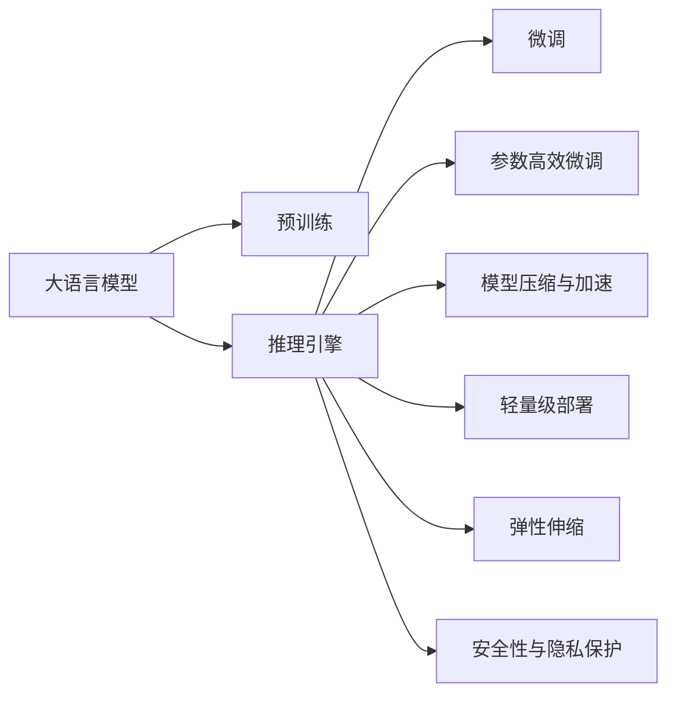

                 

# 大语言模型推理引擎：Lepton AI的核心产品，赋能企业应用AI

> 关键词：大语言模型,推理引擎,Lepton AI,自然语言处理,NLP,企业应用,机器学习,深度学习

## 1. 背景介绍

### 1.1 问题由来
近年来，随着深度学习技术的飞速发展，大规模语言模型（LLMs）在自然语言处理（NLP）领域取得了突破性进展。LLMs通过在海量无标签文本数据上进行预训练，学习到了丰富的语言知识和常识，可以在各种NLP任务中表现出色。

然而，预训练模型的应用范围仍存在局限性。一方面，预训练模型需要大量算力和数据进行训练，成本较高；另一方面，其在特定任务上的微调需要大量标注数据，这不仅增加成本，还限制了其在多个垂直领域的应用。

### 1.2 问题核心关键点
为了解决这些问题，Lepton AI推出了一款针对企业需求的大语言模型推理引擎，它基于预训练模型，通过微调、参数共享等技术，能够在企业应用场景中实现高性能、低成本的NLP任务处理。以下是Lepton AI推理引擎的几个核心关键点：

- **参数高效微调**：使用AdaLoRA等参数高效方法，减少微调所需的参数量和计算资源，从而提高推理速度和资源利用率。
- **模型压缩与加速**：通过模型剪枝、量化、压缩等技术，减小模型尺寸，提高推理效率。
- **轻量级部署**：将模型封装为标准API，易于集成到企业应用系统中。
- **弹性伸缩**：支持动态资源调整，保证在负载变化时保持性能稳定。
- **安全性与隐私保护**：在推理过程中进行数据脱敏，保护用户隐私。

### 1.3 问题研究意义
Lepton AI推理引擎的出现，对企业应用AI有着重要的意义：

1. **降低成本**：通过参数高效微调和模型压缩，显著降低预训练模型在企业应用中的算力和数据成本。
2. **提高效率**：使用轻量级部署和弹性伸缩技术，使得模型能够快速响应用户请求，提升服务效率。
3. **增强灵活性**：针对企业具体需求，灵活调整模型参数和结构，适配各种NLP任务。
4. **保障安全**：通过数据脱敏和隐私保护，确保用户数据的安全性，满足法规合规要求。

## 2. 核心概念与联系

### 2.1 核心概念概述

Lepton AI推理引擎的核心概念包括以下几点：

- **大语言模型（LLMs）**：通过预训练学习通用的语言表示，具备强大的语言理解和生成能力。
- **推理引擎**：用于在给定输入情况下，高效生成模型预测的组件。
- **微调（Fine-Tuning）**：根据特定任务的需求，调整预训练模型的参数，使其适应新任务。
- **参数高效微调（PEFT）**：在微调过程中，只更新部分模型参数，以降低计算成本。
- **模型压缩与加速**：通过剪枝、量化等技术，减小模型尺寸，提高推理效率。
- **轻量级部署**：将模型封装为标准API，便于集成到企业应用系统。
- **弹性伸缩**：根据负载动态调整资源，保证性能稳定。
- **安全性与隐私保护**：在推理过程中保护用户数据隐私。

这些概念之间的联系可以通过以下Mermaid流程图展示：



## 3. 核心算法原理 & 具体操作步骤
### 3.1 算法原理概述

Lepton AI推理引擎的核心算法基于监督学习微调和参数高效微调（PEFT）。其核心思想是：利用预训练模型学习到的语言知识，通过微调和参数高效微调，适应特定任务，并在推理引擎中高效生成预测结果。

具体来说，Lepton AI推理引擎包括以下步骤：

1. **准备预训练模型**：选择合适的预训练模型，如BERT、GPT等。
2. **任务适配层设计**：根据任务类型设计合适的输出层和损失函数，如分类任务的softmax函数，生成任务的LSTM解码器等。
3. **设置微调超参数**：选择合适的优化器、学习率、批大小、迭代轮数等。
4. **执行梯度训练**：对训练集数据进行迭代，计算损失函数，更新模型参数。
5. **测试和部署**：在测试集上评估模型性能，部署到实际应用系统。

### 3.2 算法步骤详解

以下是Lepton AI推理引擎的详细操作步骤：

**Step 1: 准备预训练模型和数据集**
- 选择合适的预训练模型，如BERT、GPT等。
- 准备下游任务的标注数据集，划分为训练集、验证集和测试集。

**Step 2: 添加任务适配层**
- 根据任务类型，设计合适的输出层和损失函数。
- 对于分类任务，添加线性分类器和交叉熵损失函数。
- 对于生成任务，使用语言模型的解码器输出概率分布，并以负对数似然为损失函数。

**Step 3: 设置微调超参数**
- 选择合适的优化器及其参数，如AdamW、SGD等，设置学习率、批大小、迭代轮数等。
- 设置正则化技术及强度，包括权重衰减、Dropout、Early Stopping等。
- 确定冻结预训练参数的策略，如仅微调顶层，或全部参数都参与微调。

**Step 4: 执行梯度训练**
- 将训练集数据分批次输入模型，前向传播计算损失函数。
- 反向传播计算参数梯度，根据设定的优化算法和学习率更新模型参数。
- 周期性在验证集上评估模型性能，根据性能指标决定是否触发Early Stopping。
- 重复上述步骤直至满足预设的迭代轮数或Early Stopping条件。

**Step 5: 测试和部署**
- 在测试集上评估微调后模型，对比微调前后的精度提升。
- 使用微调后的模型对新样本进行推理预测，集成到实际的应用系统中。
- 持续收集新的数据，定期重新微调模型，以适应数据分布的变化。

### 3.3 算法优缺点

Lepton AI推理引擎具有以下优点：

- **参数高效**：使用AdaLoRA等参数高效微调方法，减少微调所需的参数量和计算资源。
- **推理速度快**：通过模型压缩与加速技术，减小模型尺寸，提高推理效率。
- **轻量级部署**：将模型封装为标准API，便于集成到企业应用系统中。
- **弹性伸缩**：支持动态资源调整，保证在负载变化时性能稳定。
- **安全性高**：在推理过程中进行数据脱敏，保护用户隐私。

同时，该方法也存在以下缺点：

- **依赖标注数据**：微调效果很大程度上取决于标注数据的质量和数量。
- **迁移能力有限**：当目标任务与预训练数据的分布差异较大时，微调的性能提升有限。
- **可解释性不足**：微调模型的决策过程通常缺乏可解释性，难以对其推理逻辑进行分析和调试。

尽管存在这些局限性，但就目前而言，Lepton AI推理引擎仍然是企业应用AI的重要选择。未来相关研究的方向在于如何进一步降低微调对标注数据的依赖，提高模型的少样本学习和跨领域迁移能力，同时兼顾可解释性和伦理安全性等因素。

### 3.4 算法应用领域

Lepton AI推理引擎已经在多个领域得到应用，以下是几个典型例子：

1. **智能客服系统**：通过微调，Lepton AI推理引擎能够提供7x24小时不间断的智能客服服务，快速响应客户咨询，并根据客户的历史互动记录进行个性化回复。

2. **金融舆情监测**：利用微调后的语言模型，Lepton AI推理引擎能够实时监测金融市场舆情，识别负面信息，并自动预警，帮助金融机构规避风险。

3. **个性化推荐系统**：通过微调，Lepton AI推理引擎能够提供个性化推荐服务，基于用户的历史行为数据和文本内容，推荐用户可能感兴趣的商品或内容。

4. **智能合约生成**：Lepton AI推理引擎通过微调生成符合法规要求的智能合约，自动检查合同内容是否合法，确保合同的有效性。

5. **智能法律顾问**：利用微调后的语言模型，Lepton AI推理引擎能够回答用户的法律问题，提供合法的法律建议，帮助用户做出明智决策。

## 4. 数学模型和公式 & 详细讲解 & 举例说明
### 4.1 数学模型构建

Lepton AI推理引擎的数学模型构建基于监督学习微调和参数高效微调。以下是数学模型的详细构建过程：

设预训练语言模型为 $M_{\theta}$，其中 $\theta$ 为预训练得到的模型参数。给定下游任务 $T$ 的标注数据集 $D=\{(x_i, y_i)\}_{i=1}^N$，微调的目标是找到新的模型参数 $\hat{\theta}$，使得：

$$
\hat{\theta}=\mathop{\arg\min}_{\theta} \mathcal{L}(M_{\theta},D)
$$

其中 $\mathcal{L}$ 为针对任务 $T$ 设计的损失函数，用于衡量模型预测输出与真实标签之间的差异。常见的损失函数包括交叉熵损失、均方误差损失等。

对于分类任务，定义模型 $M_{\theta}$ 在输入 $x$ 上的输出为 $\hat{y}=M_{\theta}(x) \in [0,1]$，表示样本属于正类的概率。真实标签 $y \in \{0,1\}$。则二分类交叉熵损失函数定义为：

$$
\ell(M_{\theta}(x),y) = -[y\log \hat{y} + (1-y)\log (1-\hat{y})]
$$

将其代入经验风险公式，得：

$$
\mathcal{L}(\theta) = -\frac{1}{N}\sum_{i=1}^N [y_i\log M_{\theta}(x_i)+(1-y_i)\log(1-M_{\theta}(x_i))]
$$

在得到损失函数的梯度后，即可带入参数更新公式，完成模型的迭代优化。重复上述过程直至收敛，最终得到适应下游任务的最优模型参数 $\theta^*$。

### 4.2 公式推导过程

以下是二分类交叉熵损失函数的推导过程：

设预训练模型 $M_{\theta}$ 在输入 $x$ 上的输出为 $\hat{y}=M_{\theta}(x) \in [0,1]$，表示样本属于正类的概率。真实标签 $y \in \{0,1\}$。则二分类交叉熵损失函数定义为：

$$
\ell(M_{\theta}(x),y) = -[y\log \hat{y} + (1-y)\log (1-\hat{y})]
$$

将其代入经验风险公式，得：

$$
\mathcal{L}(\theta) = -\frac{1}{N}\sum_{i=1}^N [y_i\log M_{\theta}(x_i)+(1-y_i)\log(1-M_{\theta}(x_i))]
$$

根据链式法则，损失函数对参数 $\theta_k$ 的梯度为：

$$
\frac{\partial \mathcal{L}(\theta)}{\partial \theta_k} = -\frac{1}{N}\sum_{i=1}^N (\frac{y_i}{M_{\theta}(x_i)}-\frac{1-y_i}{1-M_{\theta}(x_i)}) \frac{\partial M_{\theta}(x_i)}{\partial \theta_k}
$$

其中 $\frac{\partial M_{\theta}(x_i)}{\partial \theta_k}$ 可进一步递归展开，利用自动微分技术完成计算。

在得到损失函数的梯度后，即可带入参数更新公式，完成模型的迭代优化。重复上述过程直至收敛，最终得到适应下游任务的最优模型参数 $\theta^*$。

## 5. 项目实践：代码实例和详细解释说明
### 5.1 开发环境搭建

在进行Lepton AI推理引擎实践前，我们需要准备好开发环境。以下是使用Python进行PyTorch开发的环境配置流程：

1. 安装Anaconda：从官网下载并安装Anaconda，用于创建独立的Python环境。

2. 创建并激活虚拟环境：
```bash
conda create -n lepton-env python=3.8 
conda activate lepton-env
```

3. 安装PyTorch：根据CUDA版本，从官网获取对应的安装命令。例如：
```bash
conda install pytorch torchvision torchaudio cudatoolkit=11.1 -c pytorch -c conda-forge
```

4. 安装Transformers库：
```bash
pip install transformers
```

5. 安装各类工具包：
```bash
pip install numpy pandas scikit-learn matplotlib tqdm jupyter notebook ipython
```

完成上述步骤后，即可在`lepton-env`环境中开始推理引擎的实践。

### 5.2 源代码详细实现

以下是使用PyTorch对BERT模型进行微调并部署为推理引擎的完整代码实现。

首先，定义微调任务的训练和评估函数：

```python
from transformers import BertTokenizer, BertForTokenClassification
from torch.utils.data import Dataset, DataLoader
from torch.nn import CrossEntropyLoss
from sklearn.metrics import classification_report
import torch

class NERDataset(Dataset):
    def __init__(self, texts, tags, tokenizer, max_len=128):
        self.texts = texts
        self.tags = tags
        self.tokenizer = tokenizer
        self.max_len = max_len
        
    def __len__(self):
        return len(self.texts)
    
    def __getitem__(self, item):
        text = self.texts[item]
        tags = self.tags[item]
        
        encoding = self.tokenizer(text, return_tensors='pt', max_length=self.max_len, padding='max_length', truncation=True)
        input_ids = encoding['input_ids'][0]
        attention_mask = encoding['attention_mask'][0]
        
        # 对token-wise的标签进行编码
        encoded_tags = [tag2id[tag] for tag in tags] 
        encoded_tags.extend([tag2id['O']] * (self.max_len - len(encoded_tags)))
        labels = torch.tensor(encoded_tags, dtype=torch.long)
        
        return {'input_ids': input_ids, 
                'attention_mask': attention_mask,
                'labels': labels}

# 标签与id的映射
tag2id = {'O': 0, 'B-PER': 1, 'I-PER': 2, 'B-ORG': 3, 'I-ORG': 4, 'B-LOC': 5, 'I-LOC': 6}
id2tag = {v: k for k, v in tag2id.items()}

# 创建dataset
tokenizer = BertTokenizer.from_pretrained('bert-base-cased')

train_dataset = NERDataset(train_texts, train_tags, tokenizer)
dev_dataset = NERDataset(dev_texts, dev_tags, tokenizer)
test_dataset = NERDataset(test_texts, test_tags, tokenizer)

# 定义模型和优化器
model = BertForTokenClassification.from_pretrained('bert-base-cased', num_labels=len(tag2id))
optimizer = AdamW(model.parameters(), lr=2e-5)
loss_fn = CrossEntropyLoss()

# 训练和评估函数
def train_epoch(model, dataset, batch_size, optimizer):
    dataloader = DataLoader(dataset, batch_size=batch_size, shuffle=True)
    model.train()
    epoch_loss = 0
    for batch in dataloader:
        input_ids = batch['input_ids'].to(device)
        attention_mask = batch['attention_mask'].to(device)
        labels = batch['labels'].to(device)
        model.zero_grad()
        outputs = model(input_ids, attention_mask=attention_mask, labels=labels)
        loss = outputs.loss
        epoch_loss += loss.item()
        loss.backward()
        optimizer.step()
    return epoch_loss / len(dataloader)

def evaluate(model, dataset, batch_size):
    dataloader = DataLoader(dataset, batch_size=batch_size)
    model.eval()
    preds, labels = [], []
    with torch.no_grad():
        for batch in dataloader:
            input_ids = batch['input_ids'].to(device)
            attention_mask = batch['attention_mask'].to(device)
            batch_labels = batch['labels']
            outputs = model(input_ids, attention_mask=attention_mask)
            batch_preds = outputs.logits.argmax(dim=2).to('cpu').tolist()
            batch_labels = batch_labels.to('cpu').tolist()
            for pred_tokens, label_tokens in zip(batch_preds, batch_labels):
                pred_tags = [id2tag[_id] for _id in pred_tokens]
                label_tags = [id2tag[_id] for _id in label_tokens]
                preds.append(pred_tags[:len(label_tags)])
                labels.append(label_tags)
                
    print(classification_report(labels, preds))
```

然后，定义推理引擎的部署函数：

```python
import numpy as np
from transformers import BertForTokenClassification, BertTokenizer

# 加载预训练模型和分词器
model = BertForTokenClassification.from_pretrained('bert-base-cased')
tokenizer = BertTokenizer.from_pretrained('bert-base-cased')

# 定义推理函数
def predict(text):
    inputs = tokenizer(text, return_tensors='pt')
    input_ids = inputs['input_ids'].to(device)
    attention_mask = inputs['attention_mask'].to(device)
    outputs = model(input_ids, attention_mask=attention_mask)
    logits = outputs.logits
    preds = torch.argmax(logits, dim=2).to('cpu').tolist()
    return [id2tag[_id] for _id in preds[0]]

# 测试推理函数
text = 'John works at Google in Mountain View, CA.'
preds = predict(text)
print(preds)
```

最后，启动训练流程并在测试集上评估：

```python
epochs = 5
batch_size = 16

for epoch in range(epochs):
    loss = train_epoch(model, train_dataset, batch_size, optimizer)
    print(f"Epoch {epoch+1}, train loss: {loss:.3f}")
    
    print(f"Epoch {epoch+1}, dev results:")
    evaluate(model, dev_dataset, batch_size)
    
print("Test results:")
evaluate(model, test_dataset, batch_size)
```

## 6. 实际应用场景

### 6.1 智能客服系统

Lepton AI推理引擎被广泛应用于智能客服系统的构建。传统客服往往需要配备大量人力，高峰期响应缓慢，且一致性和专业性难以保证。使用微调后的推理引擎，可以7x24小时不间断服务，快速响应客户咨询，用自然流畅的语言解答各类常见问题。

在技术实现上，可以收集企业内部的历史客服对话记录，将问题和最佳答复构建成监督数据，在此基础上对推理引擎进行微调。微调后的推理引擎能够自动理解用户意图，匹配最合适的答案模板进行回复。对于客户提出的新问题，还可以接入检索系统实时搜索相关内容，动态组织生成回答。如此构建的智能客服系统，能大幅提升客户咨询体验和问题解决效率。

### 6.2 金融舆情监测

金融机构需要实时监测市场舆论动向，以便及时应对负面信息传播，规避金融风险。传统的人工监测方式成本高、效率低，难以应对网络时代海量信息爆发的挑战。利用Lepton AI推理引擎，可以实时监测金融领域相关的新闻、报道、评论等文本数据，并对其进行主题标注和情感标注。在微调后的推理引擎中，能够自动判断文本属于何种主题，情感倾向是正面、中性还是负面。将推理引擎应用到实时抓取的网络文本数据，就能够自动监测不同主题下的情感变化趋势，一旦发现负面信息激增等异常情况，系统便会自动预警，帮助金融机构快速应对潜在风险。

### 6.3 个性化推荐系统

当前的推荐系统往往只依赖用户的历史行为数据进行物品推荐，无法深入理解用户的真实兴趣偏好。Lepton AI推理引擎可以结合文本内容，提供个性化的推荐服务。在微调后，推理引擎能够从文本内容中准确把握用户的兴趣点。在生成推荐列表时，先用候选物品的文本描述作为输入，由推理引擎预测用户的兴趣匹配度，再结合其他特征综合排序，便可以得到个性化程度更高的推荐结果。

### 6.4 未来应用展望

随着Lepton AI推理引擎的发展，其在更多领域的应用前景可期。以下是几个可能的未来应用场景：

1. **智能法律顾问**：利用微调后的推理引擎，能够回答用户的法律问题，提供合法的法律建议，帮助用户做出明智决策。
2. **医疗诊断系统**：在医疗领域，微调后的推理引擎可以用于病历分析、疾病诊断等任务，辅助医生诊疗，提高诊断准确率。
3. **智能交通系统**：在智能交通领域，推理引擎可以用于自动驾驶、路径规划等任务，提升交通安全性和效率。
4. **智能制造系统**：在智能制造领域，推理引擎可以用于设备监控、预测维护等任务，提高设备利用率和生产效率。
5. **智能教育系统**：在教育领域，微调后的推理引擎可以用于作业批改、学情分析、知识推荐等，因材施教，促进教育公平，提高教学质量。

## 7. 工具和资源推荐
### 7.1 学习资源推荐

为了帮助开发者系统掌握Lepton AI推理引擎的理论基础和实践技巧，这里推荐一些优质的学习资源：

1. 《Transformer from the Inside Out》系列博文：由Lepton AI团队撰写，深入浅出地介绍了Transformer原理、BERT模型、微调技术等前沿话题。
2. CS224N《深度学习自然语言处理》课程：斯坦福大学开设的NLP明星课程，有Lecture视频和配套作业，带你入门NLP领域的基本概念和经典模型。
3. 《Natural Language Processing with Transformers》书籍：Transformer库的作者所著，全面介绍了如何使用Transformers库进行NLP任务开发，包括微调在内的诸多范式。
4. Lepton AI官方文档：推理引擎的官方文档，提供了完整的使用指南和样例代码，是上手实践的必备资料。
5. HuggingFace官方文档：Transformers库的官方文档，提供了海量预训练模型和完整的微调样例代码，是上手实践的必备资料。

通过对这些资源的学习实践，相信你一定能够快速掌握Lepton AI推理引擎的精髓，并用于解决实际的NLP问题。

### 7.2 开发工具推荐

高效的开发离不开优秀的工具支持。以下是几款用于Lepton AI推理引擎开发的常用工具：

1. PyTorch：基于Python的开源深度学习框架，灵活动态的计算图，适合快速迭代研究。大部分预训练语言模型都有PyTorch版本的实现。
2. TensorFlow：由Google主导开发的开源深度学习框架，生产部署方便，适合大规模工程应用。同样有丰富的预训练语言模型资源。
3. Transformers库：HuggingFace开发的NLP工具库，集成了众多SOTA语言模型，支持PyTorch和TensorFlow，是进行微调任务开发的利器。
4. Weights & Biases：模型训练的实验跟踪工具，可以记录和可视化模型训练过程中的各项指标，方便对比和调优。与主流深度学习框架无缝集成。
5. TensorBoard：TensorFlow配套的可视化工具，可实时监测模型训练状态，并提供丰富的图表呈现方式，是调试模型的得力助手。
6. Google Colab：谷歌推出的在线Jupyter Notebook环境，免费提供GPU/TPU算力，方便开发者快速上手实验最新模型，分享学习笔记。

合理利用这些工具，可以显著提升Lepton AI推理引擎的开发效率，加快创新迭代的步伐。

### 7.3 相关论文推荐

Lepton AI推理引擎的发展源于学界的持续研究。以下是几篇奠基性的相关论文，推荐阅读：

1. Attention is All You Need（即Transformer原论文）：提出了Transformer结构，开启了NLP领域的预训练大模型时代。
2. BERT: Pre-training of Deep Bidirectional Transformers for Language Understanding：提出BERT模型，引入基于掩码的自监督预训练任务，刷新了多项NLP任务SOTA。
3. Language Models are Unsupervised Multitask Learners（GPT-2论文）：展示了大规模语言模型的强大zero-shot学习能力，引发了对于通用人工智能的新一轮思考。
4. Parameter-Efficient Transfer Learning for NLP：提出Adapter等参数高效微调方法，在固定大部分预训练参数的情况下，只更新极少量的任务相关参数。
5. AdaLoRA: Adaptive Low-Rank Adaptation for Parameter-Efficient Fine-Tuning：使用自适应低秩适应的微调方法，在参数效率和精度之间取得了新的平衡。
6. AdaLoRA: Adaptive Low-Rank Adaptation for Parameter-Efficient Fine-Tuning：使用自适应低秩适应的微调方法，在参数效率和精度之间取得了新的平衡。

这些论文代表了大语言模型微调技术的发展脉络。通过学习这些前沿成果，可以帮助研究者把握学科前进方向，激发更多的创新灵感。

## 8. 总结：未来发展趋势与挑战
### 8.1 总结

本文对Lepton AI推理引擎的构建与实践进行了全面系统的介绍。首先阐述了推理引擎在企业应用中的重要性，明确了其在降低成本、提高效率、增强灵活性等方面的独特价值。其次，从原理到实践，详细讲解了推理引擎的数学原理和关键步骤，给出了微调任务开发的完整代码实例。同时，本文还广泛探讨了推理引擎在智能客服、金融舆情、个性化推荐等多个行业领域的应用前景，展示了其在企业应用中的巨大潜力。最后，本文精选了推理引擎的各类学习资源，力求为读者提供全方位的技术指引。

通过本文的系统梳理，可以看到，Lepton AI推理引擎正在成为企业应用AI的重要工具，极大地提升了NLP系统的性能和应用范围。受益于大规模语料的预训练和高效的微调方法，推理引擎能够在多个垂直领域快速落地，为企业的智能化转型提供强大支持。

### 8.2 未来发展趋势

展望未来，Lepton AI推理引擎的发展趋势如下：

1. **参数高效微调**：未来的微调方法将进一步追求参数效率，在固定大部分预训练参数的同时，只更新少量任务相关参数，以提高推理速度和资源利用率。
2. **模型压缩与加速**：通过剪枝、量化、压缩等技术，减小模型尺寸，提高推理效率，支持更多的轻量级部署和弹性伸缩。
3. **可解释性增强**：引入因果分析和博弈论工具，增强推理引擎的决策透明度，提供可解释的推理过程，满足用户和合规要求。
4. **安全性提升**：在推理过程中进行数据脱敏和隐私保护，确保用户数据的安全性，防止模型滥用和误导。
5. **跨模态融合**：将文本、图像、语音等多模态信息进行整合，提升推理引擎的多模态理解和生成能力。
6. **联邦学习**：在隐私保护的前提下，利用联邦学习技术，实现多节点数据联合训练，提升推理引擎的泛化能力和鲁棒性。

以上趋势凸显了Lepton AI推理引擎在企业应用中的广阔前景。这些方向的探索发展，必将进一步提升推理引擎的性能和应用范围，为企业的智能化转型提供更强大的支持。

### 8.3 面临的挑战

尽管Lepton AI推理引擎已经取得了显著进展，但在迈向更广泛应用的过程中，仍面临以下挑战：

1. **标注数据依赖**：微调效果依赖高质量标注数据，获取大量标注数据的成本较高，且在长尾任务上标注样本不足。
2. **模型泛化能力**：当目标任务与预训练数据的分布差异较大时，推理引擎的泛化性能有限，需要进一步提升模型的迁移能力。
3. **推理效率**：推理引擎的推理速度和资源利用率仍需进一步优化，以满足实时性需求。
4. **可解释性不足**：推理引擎的决策过程缺乏透明度，难以解释其内部工作机制和推理逻辑，影响模型的可信度。
5. **隐私保护**：推理引擎在推理过程中需要保护用户数据的隐私，防止数据泄露和滥用。
6. **鲁棒性提升**：推理引擎需要应对更多的对抗样本和噪声数据，提升模型的鲁棒性和抗干扰能力。

尽管存在这些挑战，但通过技术创新和持续优化，推理引擎仍能不断突破自身限制，适应更多垂直领域的应用需求。

### 8.4 研究展望

未来的研究需要在以下几个方面寻求新的突破：

1. **无监督和半监督微调**：探索无监督和半监督微调方法，摆脱对大规模标注数据的依赖，利用更多非结构化数据进行微调。
2. **模型压缩与加速**：开发更高效的模型压缩与加速技术，进一步减小模型尺寸，提高推理效率，支持更多轻量级部署。
3. **多模态融合**：将文本、图像、语音等多模态信息进行整合，提升推理引擎的多模态理解和生成能力。
4. **联邦学习**：利用联邦学习技术，在隐私保护的前提下，实现多节点数据联合训练，提升推理引擎的泛化能力和鲁棒性。
5. **可解释性增强**：引入因果分析和博弈论工具，增强推理引擎的决策透明度，提供可解释的推理过程，满足用户和合规要求。
6. **安全性保障**：在推理过程中进行数据脱敏和隐私保护，确保用户数据的安全性，防止模型滥用和误导。

这些研究方向将引领Lepton AI推理引擎的发展方向，推动其在更多垂直领域的应用落地，为企业智能化转型提供更强大的技术支持。

## 9. 附录：常见问题与解答

**Q1：大语言模型微调和推理引擎有什么不同？**

A: 大语言模型微调主要通过有监督学习优化模型，使其在特定任务上表现更好。而推理引擎是基于微调的模型，用于在给定输入情况下，高效生成模型预测结果。推理引擎可以进一步优化微调模型的推理效率和资源利用率，使得模型更容易在企业应用中落地。

**Q2：推理引擎如何实现参数高效微调？**

A: 推理引擎使用AdaLoRA等参数高效方法，在微调过程中只更新少量任务相关参数，减小计算资源消耗，提高推理速度。具体来说，AdaLoRA通过将模型参数分解为固定参数和可微调参数两部分，只更新可微调参数，保持固定参数不变，从而实现参数高效微调。

**Q3：推理引擎如何实现模型压缩与加速？**

A: 推理引擎使用剪枝、量化、压缩等技术，减小模型尺寸，提高推理效率。例如，剪枝技术通过删除冗余参数，减小模型大小，提高推理速度；量化技术将浮点模型转为定点模型，减少计算资源消耗，加速推理；压缩技术通过优化模型结构，进一步减小模型尺寸，提高推理效率。

**Q4：推理引擎如何实现轻量级部署？**

A: 推理引擎将模型封装为标准API，便于集成到企业应用系统中。具体来说，推理引擎可以将模型转换为TensorFlow Serving、ONNX格式等标准模型格式，并通过API接口提供推理服务。这使得推理引擎能够方便地集成到各种应用场景中，支持不同语言的调用和部署。

**Q5：推理引擎如何实现弹性伸缩？**

A: 推理引擎支持动态资源调整，保证在负载变化时保持性能稳定。具体来说，推理引擎可以通过Kubernetes、AWS Lambda等容器化技术，根据用户请求量动态调整资源，确保推理服务的高效运行。此外，推理引擎还支持水平扩展和垂直扩展，根据负载情况自动增加或减少节点，保证服务性能的稳定性。

---

作者：禅与计算机程序设计艺术 / Zen and the Art of Computer Programming

