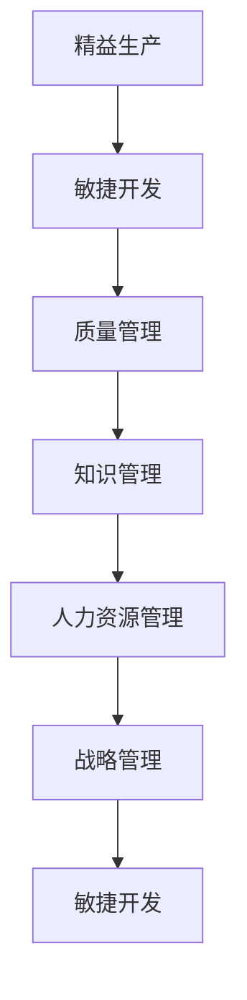

                 

# 如何从经典著作中提炼管理智慧

在数字化时代，企业运营环境日新月异，挑战与机遇并存。管理智慧的萃取与传承，成为企业转型升级的关键。本文将从经典管理著作中提炼管理智慧，深入探讨其在企业运营中的应用，提出一套融合了经典智慧与现代实践的策略框架，帮助企业在动态变化的市场环境中持续成长。

## 1. 背景介绍

### 1.1 问题由来

在过去的几十年中，企业管理理论经历了从行为科学到组织理论再到战略管理的演变。然而，尽管学术研究和实践经验不断丰富，企业在管理实践中仍面临诸多挑战。信息过载、人才流失、效率低下等问题，成为企业亟待解决的难题。

### 1.2 问题核心关键点

核心问题在于如何有效提炼和应用经典管理智慧，以提升企业的运营效率和竞争优势。传统管理理论往往过于抽象，缺乏具体操作方法。本文旨在通过系统梳理经典管理著作中的核心观点，结合现代实践，提出一套系统化、可操作的管理策略框架。

## 2. 核心概念与联系

### 2.1 核心概念概述

本节将介绍几个与企业管理相关的核心概念，并阐述它们之间的联系：

- **精益生产(Lean Production)**：由丰田汽车公司提出，强调消除浪费，追求生产流程的效率最大化。
- **敏捷开发(Agile Development)**：以迭代和响应变化为核心，适应快速变化的市场需求。
- **质量管理(Total Quality Management, TQM)**：通过全面质量控制，提升产品和服务的质量，提高顾客满意度。
- **知识管理(Knowledge Management)**：收集、整理、共享和利用知识，推动企业创新和改进。
- **人力资源管理(Human Resource Management)**：通过合理配置和开发人力资源，增强企业的竞争力。
- **战略管理(Strategic Management)**：确定企业目标，制定和实施长期发展计划，实现可持续发展。

这些核心概念构成了企业管理的基础框架，通过合理应用，可以有效提升企业的运营效率和市场响应能力。

### 2.2 核心概念原理和架构的 Mermaid 流程图



这个流程图展示了核心概念之间的相互关系。精益生产与敏捷开发相互促进，质量管理和知识管理通过信息共享提升企业创新能力，人力资源管理和战略管理为企业发展提供人才支持和方向指引。

## 3. 核心算法原理 & 具体操作步骤

### 3.1 算法原理概述

从经典管理著作中提炼管理智慧，本质上是一个知识提取和应用的过程。其核心思想是：将经典著作中的核心观点和方法论，结合企业的具体实践，制定出一套系统化、可操作的管理策略框架，提升企业的运营效率和市场竞争力。

### 3.2 算法步骤详解

以下是提炼管理智慧的具体操作步骤：

**Step 1: 系统梳理经典著作**

1. 选择经典管理著作，如《第五项修炼》、《精益思想》、《敏捷软件开发：原则、模式与实践》、《管理的实践》、《质量就是免费》、《乌合之众》、《创新者的窘境》、《企业的本质》等。
2. 通过文献综述、专家访谈等方法，系统梳理著作中的核心观点、方法和案例。
3. 将提炼出的内容进行分类，形成知识库。

**Step 2: 结合现代实践，制定管理策略**

1. 根据企业具体需求和市场环境，选择合适的管理智慧，进行二次开发。
2. 结合现代技术手段，如人工智能、大数据、区块链等，提升管理智慧的执行效率和效果。
3. 将管理智慧融入企业运营流程，制定详细的实施方案。

**Step 3: 持续优化与迭代**

1. 在实施过程中，实时收集反馈信息，评估管理策略的效果。
2. 根据反馈信息，及时调整和优化管理策略，确保其有效性和适用性。
3. 定期进行管理智慧的更新和迭代，保持其前瞻性和创新性。

### 3.3 算法优缺点

基于经典著作的管理智慧提炼方法具有以下优点：

1. **系统性**：通过系统梳理和分类，形成结构化的知识库，便于管理和应用。
2. **适应性强**：结合现代实践和技术手段，提升管理智慧的执行效率和效果。
3. **持续改进**：通过持续优化和迭代，保持管理智慧的前瞻性和创新性。

同时，也存在一些局限性：

1. **抽象性强**：经典管理著作往往过于抽象，缺乏具体的操作指南。
2. **执行难度高**：管理智慧的执行需要企业具备较高的组织能力和技术水平。
3. **个性化差异**：不同企业具有不同的特点，通用的管理智慧可能难以完全适用。

### 3.4 算法应用领域

基于经典著作的管理智慧提炼方法，在以下领域有广泛应用：

- **制造业**：精益生产、质量管理、人力资源管理等。
- **信息技术**：敏捷开发、知识管理等。
- **服务业**：服务流程优化、客户关系管理等。
- **医疗行业**：质量控制、人力资源管理等。
- **金融行业**：风险管理、客户关系管理等。

## 4. 数学模型和公式 & 详细讲解 & 举例说明

### 4.1 数学模型构建

本节将通过数学模型来更精确地表示管理智慧提炼的过程。

假设经典管理著作中的核心观点集合为 $\mathcal{V}$，现代企业运营环境为 $\mathcal{E}$，管理智慧提炼结果为 $\mathcal{W}$。提炼过程可表示为：

$$
\mathcal{W} = \mathcal{M}(\mathcal{V}, \mathcal{E})
$$

其中，$\mathcal{M}$ 表示提炼算法，将经典观点与现代环境相结合，形成具体的操作策略。

### 4.2 公式推导过程

以精益生产为例，其核心观点是“消除浪费”。假设精益生产的执行策略为 $\mathcal{P}$，则有：

$$
\mathcal{P} = \mathcal{M}(\text{“消除浪费”}, \mathcal{E})
$$

对于某一具体企业，可以根据其运营环境，将“消除浪费”的执行策略具体化为：

$$
\mathcal{P} = \mathcal{M}(\text{“消除浪费”}, \mathcal{E})
$$

$$
\mathcal{P} = \{ \text{优化生产流程}, \text{减少库存}, \text{提高设备利用率} \}
$$

### 4.3 案例分析与讲解

假设某制造企业在精益生产方面存在库存过高、设备闲置等问题，通过提炼经典著作中的管理智慧，结合企业实际情况，制定了以下执行策略：

1. 优化生产流程，通过价值流分析（Value Stream Mapping）识别非增值活动，减少浪费。
2. 减少库存，实施“看板管理”（Kanban），以需求驱动生产。
3. 提高设备利用率，通过设备维护和预防性保养，减少故障停机时间。

## 5. 项目实践：代码实例和详细解释说明

### 5.1 开发环境搭建

在进行管理智慧提炼的实践前，我们需要准备好开发环境。以下是使用Python进行数据分析和建模的环境配置流程：

1. 安装Anaconda：从官网下载并安装Anaconda，用于创建独立的Python环境。

2. 创建并激活虚拟环境：
```bash
conda create -n mgmt_env python=3.8 
conda activate mgmt_env
```

3. 安装必要的库：
```bash
conda install pandas numpy matplotlib seaborn jupyter notebook ipython
```

4. 安装相关模型和算法库：
```bash
pip install scikit-learn xgboost pytorch
```

5. 配置好环境后，可以使用Jupyter Notebook进行数据分析和建模。

### 5.2 源代码详细实现

下面以精益生产管理为例，使用Python进行精益生产流程的优化。

首先，定义生产流程数据：

```python
import pandas as pd

# 生产流程数据
data = {
    'ID': [1, 2, 3, 4, 5, 6, 7, 8, 9, 10],
    'Process': ['Process A', 'Process B', 'Process C', 'Process D', 'Process E', 'Process F', 'Process G', 'Process H', 'Process I', 'Process J'],
    'Time': [15, 25, 30, 20, 18, 12, 10, 22, 8, 20],
    'Cost': [50, 75, 100, 80, 60, 40, 30, 70, 50, 60]
}

df = pd.DataFrame(data)
```

然后，使用价值流分析（Value Stream Mapping）识别非增值活动：

```python
# 计算每个流程的增值与非增值时间
value_addition = df['Time'] - df['Time'].shift(1)
value_addition = value_addition.mask(value_addition <= 0, value_addition.shift(1), fill_value=0)

# 计算非增值活动时间
non_value_addition = df['Time'] - value_addition
non_value_addition = non_value_addition.mask(non_value_addition <= 0, non_value_addition.shift(1), fill_value=0)

# 可视化生产流程
df['Value Addition'] = value_addition
df['Non-Value Addition'] = non_value_addition
df.plot(kind='scatter', x='ID', y='Value Addition', title='Value Stream Analysis', xlabel='Process', ylabel='Time')
```

接着，应用精益生产的优化策略：

```python
# 优化生产流程
optimized_data = df.copy()
optimized_data['Time'] = optimized_data['Time'] + optimized_data['Non-Value Addition'].shift(1)
optimized_data['Time'] = optimized_data['Time'].mask(optimized_data['Time'] <= 0, optimized_data['Time'].shift(1), fill_value=0)
optimized_data['Value Addition'] = optimized_data['Time'] - optimized_data['Time'].shift(1)
optimized_data['Non-Value Addition'] = optimized_data['Time'] - optimized_data['Value Addition']

# 计算优化前后的成本差异
cost_difference = df['Cost'] - optimized_data['Cost']
cost_difference
```

最后，计算优化后的生产成本和效率提升：

```python
# 计算优化后的成本和效率
optimized_cost = optimized_data['Cost'].sum()
optimized_efficiency = (df['Time'].sum() - optimized_data['Time'].sum()) / df['Time'].sum()

optimized_cost, optimized_efficiency
```

### 5.3 代码解读与分析

以上代码展示了通过Python进行精益生产流程优化的具体实现。主要步骤如下：

1. 定义生产流程数据，包含ID、流程、时间和成本。
2. 计算每个流程的增值与非增值时间。
3. 应用精益生产的优化策略，将非增值活动时间向后推移到下道工序。
4. 计算优化前后的生产成本和效率提升。

通过这些步骤，我们可以看到精益生产管理的具体应用和效果。类似地，其他管理智慧的提炼和应用，也可以通过Python等工具进行高效实现。

## 6. 实际应用场景

### 6.1 智能制造

在智能制造领域，基于经典著作的管理智慧提炼方法，可以帮助企业实现生产流程的优化和自动化。通过精益生产、敏捷开发、质量管理等方法，企业可以提升生产效率和产品质量，降低成本，提高市场响应速度。

### 6.2 金融服务

在金融服务领域，基于经典著作的管理智慧提炼方法，可以帮助企业提升风险管理、客户关系管理等方面的能力。通过质量管理和知识管理，企业可以建立更加稳健的风险控制系统，提高客户满意度。

### 6.3 零售行业

在零售行业，基于经典著作的管理智慧提炼方法，可以帮助企业优化供应链管理、库存管理、客户关系管理等环节。通过精益生产和敏捷开发，企业可以提升运营效率和市场响应能力，提高客户忠诚度。

### 6.4 未来应用展望

随着数字化、智能化技术的不断发展，基于经典著作的管理智慧提炼方法，将在更多领域得到应用。未来，该方法将在以下方面发挥更大作用：

1. **智能化管理**：通过引入人工智能、大数据等技术，提升管理智慧的执行效率和效果。
2. **跨界融合**：将管理智慧与其他领域的知识进行融合，推动企业跨界创新。
3. **全球化运营**：通过精益生产和敏捷开发，提升企业的全球化运营能力。
4. **可持续发展**：通过质量管理和知识管理，推动企业的可持续发展。

## 7. 工具和资源推荐

### 7.1 学习资源推荐

为了帮助企业系统掌握管理智慧的提炼与实践，以下推荐一些优质的学习资源：

1. **《第五项修炼：学习型组织的艺术与实务》**：彼得·圣吉所著，系统介绍了学习型组织的构建与管理。
2. **《精益思想》**：詹姆斯·沃默克所著，详细介绍了精益生产的理论和方法。
3. **《敏捷软件开发：原则、模式与实践》**：罗伯特·C·马丁所著，介绍了敏捷开发的核心理念和实践方法。
4. **《质量就是免费：商业领域中质量成本管理的艺术》**：阿列克西·达文波特所著，讲解了质量管理的核心思想。
5. **《乌合之众：大众心理研究》**：古斯塔夫·勒庞所著，分析了群体心理和行为规律，为市场营销和品牌管理提供了参考。
6. **《创新者的窘境》**：克莱顿·克里斯滕森所著，研究了技术创新与市场变化之间的关系。
7. **《企业的本质》**：埃德加·沙因所著，探讨了企业组织文化的本质和管理智慧。

通过这些经典著作的学习和实践，企业可以系统掌握管理智慧的精髓，提升运营效率和市场竞争力。

### 7.2 开发工具推荐

高效的管理智慧提炼和应用，需要借助现代工具和平台。以下是几款推荐的开发工具：

1. **Jupyter Notebook**：Python数据分析和建模的强大工具，支持代码和图表的混合展示。
2. **Microsoft Excel**：经典的数据分析工具，支持数据的可视化、统计分析等功能。
3. **Tableau**：商业智能工具，支持数据的可视化、报告和分享。
4. **Power BI**：微软推出的商业智能平台，支持数据可视化、报告和仪表盘。
5. **SAP BusinessObjects**：企业级商业智能平台，支持数据分析、报告和协作。

合理利用这些工具，可以显著提升管理智慧的提炼和应用效率，加快企业的创新和改进步伐。

### 7.3 相关论文推荐

在管理智慧的研究领域，以下几篇论文具有代表性，推荐阅读：

1. **《精益生产：方法、工具和案例研究》**：由戴维斯·沃伦所著，系统介绍了精益生产的理论和实践方法。
2. **《敏捷管理：流程、实践和模式》**：由詹姆斯·麦库菲和詹姆斯·凯利所著，讲解了敏捷管理的核心理念和实践方法。
3. **《全面质量管理：理论和实践》**：由罗伯特·K·诺兰和约翰·A·弗里曼所著，详细介绍了全面质量管理的理论和方法。
4. **《知识管理：战略、实践和工具》**：由托马斯·H·达文波特和劳伦斯·普莱斯所著，探讨了知识管理的理论、方法和工具。
5. **《人力资源管理：实践与应用》**：由巴里·斯特恩费尔德和哈里·希格尔曼所著，讲解了人力资源管理的核心理念和实践方法。
6. **《企业战略管理：理论与实践》**：由亨利·明茨伯格和布鲁斯·施奈德所著，系统介绍了战略管理的理论和实践方法。

这些论文代表了管理智慧的研究前沿，通过学习这些论文，可以帮助企业更好地理解管理智慧的提炼与实践。

## 8. 总结：未来发展趋势与挑战

### 8.1 研究成果总结

本文从经典著作中提炼管理智慧，通过系统梳理、结合现代实践和持续优化，提出了一套系统化的管理策略框架。该框架包括精益生产、敏捷开发、质量管理、知识管理、人力资源管理、战略管理等多个核心概念，旨在提升企业的运营效率和市场竞争力。

### 8.2 未来发展趋势

未来，管理智慧的提炼与实践将呈现以下几个发展趋势：

1. **智能化管理**：通过引入人工智能、大数据等技术，提升管理智慧的执行效率和效果。
2. **跨界融合**：将管理智慧与其他领域的知识进行融合，推动企业跨界创新。
3. **全球化运营**：通过精益生产和敏捷开发，提升企业的全球化运营能力。
4. **可持续发展**：通过质量管理和知识管理，推动企业的可持续发展。

### 8.3 面临的挑战

尽管管理智慧的提炼与实践具有诸多优势，但在实施过程中仍面临一些挑战：

1. **复杂度高**：管理智慧的提炼和应用需要企业具备较高的组织能力和技术水平。
2. **资源投入大**：管理智慧的实施需要大量的资金、时间和人力投入。
3. **文化变革难**：管理智慧的落地需要改变企业现有的文化和管理习惯，存在较大阻力。

### 8.4 研究展望

未来的研究需要在以下几个方面寻求新的突破：

1. **量化评估**：通过大数据和人工智能技术，对管理智慧的效果进行量化评估，提供更加客观的参考。
2. **个性化定制**：根据企业具体需求，开发个性化的管理智慧提炼和应用方案。
3. **自动化工具**：开发更加智能化的管理工具，辅助企业高效执行管理智慧。
4. **多学科融合**：将管理智慧与其他学科的知识进行融合，提升管理智慧的创新性。

## 9. 附录：常见问题与解答

**Q1: 管理智慧的提炼与实践是否适用于所有企业？**

A: 管理智慧的提炼与实践需要企业具备一定的管理基础和技术水平，并不适用于所有企业。但对于追求高质量、高效率的企业，通过系统化的管理智慧提炼与实践，可以显著提升运营效率和市场竞争力。

**Q2: 管理智慧的提炼与实践是否需要大量的资金和人力投入？**

A: 管理智慧的提炼与实践确实需要一定的资金和人力投入，但相对于从头开发或引入先进管理理念，其成本相对较低，且能快速提升企业的运营效率和市场竞争力。

**Q3: 管理智慧的提炼与实践是否能够与现代技术相结合？**

A: 管理智慧的提炼与实践可以通过引入现代技术，如人工智能、大数据、区块链等，提升其执行效率和效果。现代技术的引入，使得管理智慧的实践更加灵活、高效。

**Q4: 管理智慧的提炼与实践是否需要改变企业的文化和管理习惯？**

A: 管理智慧的提炼与实践确实需要改变企业现有的文化和管理习惯，这需要企业管理层和员工的共同努力。通过培训、激励等方式，可以帮助企业顺利完成管理变革。

通过本文的系统梳理，可以看到，经典管理著作中的智慧不仅可以为企业管理提供理论基础，还可以在现代实践中不断创新和优化。通过融合现代技术和方法，管理智慧的提炼与实践将为企业转型升级提供有力支持。在未来，通过持续优化和创新，管理智慧将更加智能、高效和适应性强，推动企业持续成长和竞争力的提升。

---

作者：禅与计算机程序设计艺术 / Zen and the Art of Computer Programming

