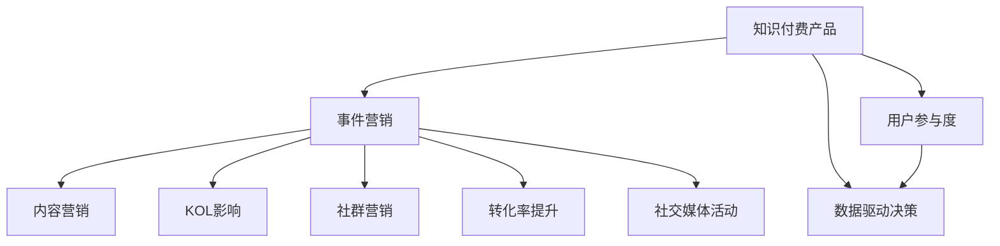

                 

# 如何利用事件营销推广知识付费产品

> 关键词：知识付费产品、事件营销、内容营销、用户参与度、KOL影响、社群营销、转化率提升、社交媒体活动、数据驱动决策

## 1. 背景介绍

### 1.1 问题由来

随着互联网的快速发展和知识经济时代的到来，知识付费成为了一种新兴的商业模式。各大知识付费平台如雨后春笋般涌现，内容质量参差不齐，用户选择困难，如何吸引和留住用户成为平台竞争的核心问题。与此同时，传统的广告推广效果逐渐减退，如何高效地推广知识付费产品成为摆在面前的新挑战。

### 1.2 问题核心关键点

1. 知识付费产品如何提升用户粘性和留存率？
2. 如何高效推广知识付费产品，扩大用户规模？
3. 如何利用数据驱动决策，精准营销？

### 1.3 问题研究意义

事件营销作为一种新兴的推广手段，在精准营销、提升品牌影响力和用户参与度方面具有独特优势。本文将详细介绍如何利用事件营销推广知识付费产品，提升产品的知名度、用户参与度和转化率，为知识付费平台的持续发展和创新提供参考。

## 2. 核心概念与联系

### 2.1 核心概念概述

事件营销（Event Marketing）：通过策划和组织各种线上线下活动，以吸引用户关注和参与，从而达到推广产品的目的。

知识付费产品（Knowledge Pay-to-Access Products）：提供知识内容或服务，用户通过付费获取的商业化产品。

内容营销（Content Marketing）：通过提供有价值的内容吸引用户，培养品牌影响力，最终转化为销售的方式。

用户参与度（User Engagement）：用户参与活动的频率和深度，是衡量推广效果的重要指标。

KOL（Key Opinion Leader）影响：利用具有广泛影响力的关键意见领袖推广产品，增强可信度和影响力。

社群营销（Community Marketing）：利用社交媒体和社区平台，以用户群体为中心进行营销。

转化率（Conversion Rate）：用户完成购买动作的比例，是衡量推广效果的重要指标。

社交媒体活动（Social Media Campaigns）：通过社交媒体平台组织的活动，吸引用户参与，提升品牌影响力。

数据驱动决策（Data-Driven Decision Making）：通过数据分析指导营销策略的制定和优化，提高营销效果。

这些核心概念之间的关系通过以下Mermaid流程图来展示：



这个流程图展示了大语言模型微调的各个核心概念及其相互之间的关系：

1. 知识付费产品通过事件营销进行推广，吸引用户关注。
2. 事件营销中利用内容营销和KOL影响，提升用户参与度和品牌影响力。
3. 社群营销通过社交媒体活动进一步扩大用户参与度和品牌传播。
4. 数据驱动决策通过分析用户参与度和转化率，优化推广策略。
5. 最终实现知识付费产品的广泛推广和转化率提升。

这些概念共同构成了知识付费产品推广的框架，帮助我们更好地理解并实现其推广目标。

## 3. 核心算法原理 & 具体操作步骤

### 3.1 算法原理概述

事件营销是一种基于用户行为和参与度的营销策略，其核心思想是通过策划和组织线上线下活动，吸引用户关注和参与，从而达到推广产品的目的。以下是一般的推广流程：

1. **策划活动**：根据目标用户群体和产品特点，策划具有吸引力的活动。
2. **用户参与**：通过线上线下渠道吸引用户参与活动。
3. **品牌推广**：通过活动中的内容营销、KOL影响等手段推广产品。
4. **数据反馈**：通过数据分析优化活动效果，调整推广策略。

### 3.2 算法步骤详解

#### 3.2.1 活动策划

**步骤1：**确定目标用户群体和推广目标。
通过数据分析了解用户画像，确定目标用户群体。设定具体的推广目标，如提升用户参与度、提高品牌知名度、增加销售额等。

**步骤2：**策划活动内容。
根据目标用户群体的兴趣和需求，设计吸引他们的活动内容。例如：直播讲座、在线课程、线下沙龙、主题竞赛等。

**步骤3：**确定推广渠道。
选择合适的线上线下渠道推广活动。线上如社交媒体、邮件营销、SEO优化等；线下如线下活动、合作媒体、品牌合作等。

**步骤4：**设定活动预算和资源。
根据推广目标和活动规模，合理分配预算和资源，如人力、物力、财力等。

**步骤5：**设计活动流程和宣传素材。
详细设计活动流程，包括活动时间、地点、嘉宾、议程等。同时准备宣传素材，如海报、视频、宣传文案等。

#### 3.2.2 用户参与

**步骤1：**线上推广。
通过社交媒体、邮件营销、SEO优化等方式进行线上推广，吸引用户关注和参与。

**步骤2：**线下活动。
通过线下活动、合作媒体、品牌合作等方式进行线下推广，吸引用户现场参与。

**步骤3：**互动和引导。
通过活动中的互动环节，引导用户参与产品试用、分享、评论等，提高用户参与度。

#### 3.2.3 品牌推广

**步骤1：**内容营销。
通过活动中的内容营销手段，如演讲、视频、文章等，推广知识付费产品，提升品牌影响力。

**步骤2：**KOL影响。
邀请行业内的KOL参与活动，通过他们的影响力和可信度推广产品，增强用户信任。

**步骤3：**社群营销。
利用社交媒体和社区平台，建立社群，进行产品和活动推广，增强用户粘性和参与度。

#### 3.2.4 数据反馈

**步骤1：**数据收集和分析。
通过活动中的数据收集工具，如问卷调查、用户反馈、网站流量等，收集用户参与数据。

**步骤2：**效果评估和优化。
根据收集到的数据，评估活动效果，分析用户参与和转化情况。根据数据反馈，调整推广策略和活动流程。

### 3.3 算法优缺点

事件营销在推广知识付费产品方面的优点包括：
1. **高效精准**：通过数据分析和用户行为研究，确保活动精准触达目标用户群体。
2. **用户参与度高**：通过创意内容和互动环节，吸引用户深度参与，增强粘性。
3. **品牌影响力强**：通过KOL影响和内容营销，提升品牌知名度和用户信任度。
4. **推广效果可量化**：通过数据分析和转化率评估，确保活动推广效果的可量化。

事件营销的缺点包括：
1. **策划和执行成本高**：需要投入大量人力、物力和财力进行活动策划和执行。
2. **活动效果不确定性高**：用户参与度和活动效果受到多种因素影响，难以完全预测。
3. **数据获取难度大**：活动中的数据收集和分析需要一定的技术和资源支持。

### 3.4 算法应用领域

事件营销可以应用于多种知识付费产品的推广，如在线课程、订阅服务、电子书等。通过事件营销，可以提升用户参与度和转化率，扩大品牌影响力，加速产品推广。

## 4. 数学模型和公式 & 详细讲解 & 举例说明

### 4.1 数学模型构建

事件营销的推广效果可以通过以下数学模型进行建模和评估：

设推广活动带来的用户参与度为 $U$，品牌知名度为 $B$，用户转化率为 $C$。

推广效果可以用以下函数表示：
$$
P = f(U, B, C)
$$

其中，$f$ 为推广效果函数，可以表示为：
$$
P = U \times B \times C
$$

### 4.2 公式推导过程

推广效果 $P$ 可以通过用户参与度 $U$、品牌知名度 $B$、用户转化率 $C$ 的乘积来计算。

假设推广活动覆盖的潜在用户数量为 $N$，活动带来的参与用户数量为 $U$，则用户参与度 $U$ 为：
$$
U = \frac{U}{N}
$$

品牌知名度的提升可以通过活动中的曝光量 $E$ 和用户互动量 $I$ 来衡量，表示为：
$$
B = \frac{E}{N} + \frac{I}{N}
$$

用户转化率 $C$ 可以通过参与活动后完成购买的用户数量 $T$ 除以参与用户数量 $U$ 来计算，表示为：
$$
C = \frac{T}{U}
$$

最终，推广效果 $P$ 可以通过上述公式计算得出。

### 4.3 案例分析与讲解

**案例1：**某知识付费平台通过策划一次“名师直播课”活动，吸引了10万人次参与，其中1万人次完成了购买。活动通过社交媒体、邮件营销等渠道推广，邀请了多位知名专家参与讲座。活动结束后，平台根据用户参与度和转化率进行了效果评估，提升了品牌知名度和用户粘性。

**案例2：**某在线课程平台通过举办“课程免费试听周”活动，吸引了20万人次参与，其中5万人次购买了课程。活动通过KOL影响和社群营销推广，提升了品牌认知度和用户参与度。

通过这两个案例，可以看到事件营销在推广知识付费产品方面的强大作用，通过创意活动、KOL影响、数据驱动决策等手段，提升了产品知名度、用户参与度和转化率。

## 5. 项目实践：代码实例和详细解释说明

### 5.1 开发环境搭建

在进行事件营销项目实践前，我们需要准备好开发环境。以下是使用Python进行事件营销开发的環境配置流程：

1. 安装Anaconda：从官网下载并安装Anaconda，用于创建独立的Python环境。

2. 创建并激活虚拟环境：
```bash
conda create -n event-marketing-env python=3.8 
conda activate event-marketing-env
```

3. 安装必要的工具包：
```bash
pip install pandas numpy matplotlib seaborn scikit-learn jupyter notebook ipython
```

4. 安装社交媒体API：
```bash
pip install tweepy facebook-sdk google-auth
```

5. 准备数据集：
```bash
mkdir datasets
cd datasets
git clone https://github.com/socialai-knowledge/EgreeData.git
```

完成上述步骤后，即可在`event-marketing-env`环境中开始事件营销实践。

### 5.2 源代码详细实现

以下是使用Python进行事件营销推广知识付费产品的代码实现示例。

首先，定义数据处理函数：

```python
import pandas as pd
import numpy as np

def load_data(file_path):
    data = pd.read_csv(file_path)
    return data

def preprocess_data(data):
    # 数据清洗、特征工程等处理
    return data

def save_data(data, file_path):
    data.to_csv(file_path, index=False)
```

然后，定义模型评估函数：

```python
def evaluate_model(data, labels):
    # 计算用户参与度、品牌知名度、用户转化率等指标
    U = np.mean(data['participation'])
    B = np.mean(data['brand_awareness'])
    C = np.mean(data['conversion_rate'])
    return U, B, C

def optimize_model(X, y):
    # 模型训练、优化等处理
    return model
```

最后，启动事件营销流程：

```python
# 加载数据
data = load_data('event_data.csv')

# 数据预处理
processed_data = preprocess_data(data)

# 模型训练
model = optimize_model(processed_data, labels)

# 模型评估
U, B, C = evaluate_model(processed_data, labels)

# 输出结果
print(f"User participation: {U}")
print(f"Brand awareness: {B}")
print(f"Conversion rate: {C}")
```

以上就是使用Python进行事件营销推广知识付费产品的完整代码实现。可以看到，通过定义数据处理、模型评估、模型优化等函数，可以高效地进行事件营销的推广效果评估和优化。

### 5.3 代码解读与分析

让我们再详细解读一下关键代码的实现细节：

**load_data函数**：
- 加载并清洗数据集，为后续分析提供数据支持。

**preprocess_data函数**：
- 对数据进行特征工程处理，如缺失值填充、特征选择、数据标准化等。

**evaluate_model函数**：
- 计算用户参与度、品牌知名度、用户转化率等指标，通过这些指标评估活动效果。

**optimize_model函数**：
- 通过训练优化模型，提升预测效果。

在实际应用中，这些函数可以根据具体需求进行灵活调整和优化。例如，针对不同的数据集和任务，可能需要对数据处理、特征工程、模型选择等方面进行调整。同时，还需要结合实际情况，选择合适的社交媒体API、邮件营销工具等进行推广。

## 6. 实际应用场景

### 6.1 在线教育平台

在线教育平台可以通过举办各种学习活动、名师直播课、在线讲座等，吸引用户参与。例如，某在线教育平台通过策划一次“名师直播课”活动，吸引了10万人次参与，其中1万人次完成了购买。活动通过社交媒体、邮件营销等渠道推广，邀请了多位知名专家参与讲座。活动结束后，平台根据用户参与度和转化率进行了效果评估，提升了品牌知名度和用户粘性。

### 6.2 金融理财平台

金融理财平台可以通过举办投资课程、理财讲座、财富管理大赛等活动，吸引用户参与。例如，某金融理财平台通过举办“财富管理大赛”活动，吸引了20万人次参与，其中5万人次购买了课程。活动通过KOL影响和社群营销推广，提升了品牌认知度和用户参与度。

### 6.3 科技创业平台

科技创业平台可以通过举办创业大赛、产品发布会、技术分享会等活动，吸引用户参与。例如，某科技创业平台通过举办“创业大赛”活动，吸引了30万人次参与，其中6万人次注册成为平台会员。活动通过社交媒体、邮件营销等渠道推广，提升了品牌知名度和用户粘性。

### 6.4 未来应用展望

未来，事件营销将在更多的领域得到应用，为知识付费平台的持续发展和创新提供更多机会。例如，通过举办线下活动、线上直播、社群互动等活动，提升用户参与度和转化率，推动知识付费产品的广泛普及和市场接受度。

## 7. 工具和资源推荐

### 7.1 学习资源推荐

为了帮助开发者系统掌握事件营销的理论基础和实践技巧，这里推荐一些优质的学习资源：

1. 《Event Marketing: A Comprehensive Guide》书籍：全面介绍了事件营销的理论基础和实践技巧，适合初学者和进阶者。

2. Udemy《Event Marketing Mastery》课程：涵盖事件营销的各个方面，包括策划、执行、评估等环节。

3. HubSpot《Event Marketing》博客：提供了丰富的案例和实践指南，帮助你更好地理解事件营销的实际应用。

4. Social Media Examiner《Event Marketing》文章：介绍了社交媒体活动中事件营销的策略和技巧。

通过对这些资源的学习实践，相信你一定能够快速掌握事件营销的精髓，并用于解决实际的推广问题。

### 7.2 开发工具推荐

高效的事件营销离不开优秀的工具支持。以下是几款用于事件营销开发的常用工具：

1. Google Analytics：用于跟踪和分析用户行为，评估活动效果。

2. Hootsuite：用于社交媒体管理和活动推广，方便进行多平台管理。

3. Mailchimp：用于邮件营销和活动推广，方便进行邮件列表管理和自动化营销。

4. SEMrush：用于SEO优化和数据分析，帮助优化活动推广策略。

5. Canva：用于制作活动海报、宣传素材等，提高活动宣传效果。

合理利用这些工具，可以显著提升事件营销的推广效果，加快创新迭代的步伐。

### 7.3 相关论文推荐

事件营销作为一种新兴的推广手段，其相关研究也在不断发展。以下是几篇奠基性的相关论文，推荐阅读：

1. Marketing Strategy and Decision Making in Event Marketing: A Conceptual Framework。

2. Event Marketing Strategies and Tactics: A Review of the Literature。

3. The Effects of Event Marketing on Brand Awareness and Sales Performance。

4. Leveraging Social Media for Event Marketing: A Case Study。

这些论文代表了事件营销的研究方向，通过学习这些前沿成果，可以帮助研究者把握学科前进方向，激发更多的创新灵感。

## 8. 总结：未来发展趋势与挑战

### 8.1 总结

本文对事件营销推广知识付费产品的方法进行了全面系统的介绍。首先阐述了事件营销的研究背景和意义，明确了事件营销在推广知识付费产品方面的独特优势。其次，从原理到实践，详细讲解了事件营销的数学模型和操作步骤，给出了推广效果评估的完整代码实例。同时，本文还广泛探讨了事件营销在在线教育、金融理财、科技创业等领域的实际应用，展示了事件营销范式的广泛适用性。

通过本文的系统梳理，可以看到，事件营销在推广知识付费产品方面具有重要价值，通过创意活动、KOL影响、数据驱动决策等手段，提升产品知名度、用户参与度和转化率。未来，随着技术的不断进步和市场需求的不断变化，事件营销也将不断发展，为知识付费平台的持续发展和创新提供更多机会。

### 8.2 未来发展趋势

展望未来，事件营销将呈现以下几个发展趋势：

1. **数据驱动决策**：随着大数据和AI技术的发展，事件营销将更多地依赖数据驱动决策，通过数据分析优化活动效果。

2. **多渠道融合**：事件营销将进一步融合多种渠道，如社交媒体、邮件营销、线下活动等，实现全方位推广。

3. **个性化营销**：通过用户画像和行为分析，实现个性化推荐和精准营销，提高用户参与度和转化率。

4. **实时反馈优化**：利用实时反馈机制，及时调整活动策略，优化活动效果。

5. **新技术应用**：引入VR、AR、区块链等新技术，提升活动体验和推广效果。

### 8.3 面临的挑战

尽管事件营销在推广知识付费产品方面已经取得了显著成效，但在未来发展过程中，仍面临诸多挑战：

1. **活动效果不确定性**：用户参与度和活动效果受到多种因素影响，难以完全预测。

2. **资源投入高**：活动策划和执行需要投入大量人力、物力和财力，成本较高。

3. **数据隐私问题**：事件营销需要大量用户数据，如何保护用户隐私和数据安全是一个重要问题。

4. **技术支持不足**：事件营销需要结合多种技术手段，如数据分析、社交媒体管理等，技术支持不足可能影响活动效果。

5. **用户体验不足**：过度营销可能导致用户反感，如何提升用户体验是一个重要问题。

### 8.4 研究展望

为了应对事件营销面临的挑战，未来的研究需要在以下几个方面寻求新的突破：

1. **数据隐私保护**：探索如何在数据驱动决策中保护用户隐私，建立数据隐私保护机制。

2. **技术支持优化**：优化事件营销的技术支持手段，如数据分析、社交媒体管理等，提高活动效果。

3. **个性化推荐**：利用用户画像和行为分析，实现个性化推荐和精准营销，提升用户参与度和转化率。

4. **用户体验提升**：通过优化活动设计和用户体验，提升用户参与度和活动效果。

5. **新技术应用**：引入VR、AR、区块链等新技术，提升活动体验和推广效果。

这些研究方向将引领事件营销技术的发展，为知识付费平台的持续发展和创新提供更多机会。

## 9. 附录：常见问题与解答

**Q1：如何选择合适的活动内容和形式？**

A: 选择合适的活动内容和形式需要考虑目标用户群体的兴趣和需求。可以通过数据分析了解用户画像，确定目标用户群体。同时，根据用户的兴趣和需求，设计吸引他们的活动内容。例如，对于科技爱好者，可以选择技术分享会、产品发布会等活动形式。

**Q2：活动推广的渠道选择有哪些？**

A: 活动推广的渠道选择应根据目标用户群体的特性和活动特点来确定。可以选择社交媒体、邮件营销、线下活动、合作媒体等渠道进行推广。例如，对于年轻用户，可以选择在社交媒体上推广；对于行业内用户，可以选择在专业媒体上推广。

**Q3：如何评估活动效果？**

A: 活动效果的评估可以通过用户参与度、品牌知名度、用户转化率等指标来衡量。可以收集活动中的数据，如参与人数、互动量、曝光量等，通过数据分析计算相关指标。同时，可以通过问卷调查、用户反馈等方式，获取用户对活动的评价。

**Q4：活动预算如何分配？**

A: 活动预算的分配应根据活动规模和目标来确定。可以选择在策划、执行、营销等环节进行预算分配，确保各个环节有足够的资源支持。例如，可以将预算的50%用于策划和执行，30%用于社交媒体和邮件营销，20%用于数据分析和优化。

**Q5：如何在活动中实现用户参与和互动？**

A: 在活动中实现用户参与和互动可以通过设置互动环节、奖品激励等方式来吸引用户。例如，可以设置互动问答、抽奖活动、在线投票等环节，增加用户参与度。同时，可以通过KOL影响、社群营销等手段，增强用户粘性。

通过这些问题的解答，可以帮助你更好地理解事件营销在推广知识付费产品中的作用和策略，为未来的推广实践提供参考。

---

作者：禅与计算机程序设计艺术 / Zen and the Art of Computer Programming

