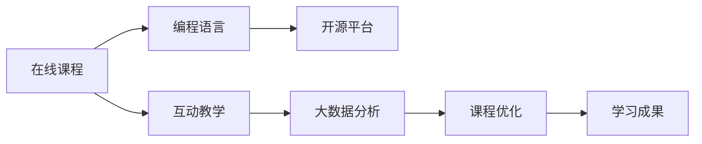

                 

# 如何利用技术能力创建在线课程

> 关键词：在线教育,技术能力,编程课程,开源平台,互动教学

## 1. 背景介绍

### 1.1 问题由来

随着科技的迅速发展，在线教育逐渐成为一种新兴的教育形式。它打破了时间和空间的限制，使得学习者能够随时随地获取知识，极大地提高了教育的普及率和效率。但在线教育的挑战同样显著，比如课程内容的同质化、教学互动性不足等问题，这些都亟待解决。

### 1.2 问题核心关键点

本文聚焦于如何利用技术能力来创建高质量的在线课程。通过整合编程、人工智能、交互设计等多领域的知识，构建出一个内容丰富、互动性强、易于使用的在线课程平台。

### 1.3 问题研究意义

在当前技术驱动的教育背景下，利用技术能力创建在线课程，不仅能够推动在线教育质量的提升，还能推动教育资源的均衡分布，使更多人能够获得优质的教育资源。同时，这种技术驱动的教育模式，还能促进计算机科学和其他STEM学科的发展，激发更多人对编程和技术的兴趣。

## 2. 核心概念与联系

### 2.1 核心概念概述

在线教育的核心在于“互联网+教育”，将互联网技术和教育内容有机结合，创造全新的教学方式和学习体验。在本节，我们将介绍以下几个核心概念：

- **在线课程（Online Course）**：通过互联网平台提供的学习内容集合，一般包含视频讲座、编程作业、互动讨论等元素。
- **编程语言（Programming Language）**：如Python、JavaScript等，用于实现课程内容的自动化和互动性。
- **开源平台（Open Source Platform）**：如GitHub、Mozilla等，提供代码共享、协作开发的平台，使开发者能够便捷地发布和更新课程内容。
- **互动教学（Interactive Teaching）**：利用编程、游戏化等手段，增加学生的学习兴趣和互动性，提升教学效果。
- **大数据分析（Big Data Analysis）**：通过收集和分析学生的学习数据，优化课程内容设计和教学方法。

### 2.2 核心概念原理和架构的 Mermaid 流程图



### 2.3 核心概念联系

上述概念间的关系可以简单概括为：利用编程语言和开源平台开发和发布在线课程，通过互动教学增加学生的参与感，利用大数据分析优化课程内容和教学方法，最终实现良好的学习效果。

## 3. 核心算法原理 & 具体操作步骤

### 3.1 算法原理概述

创建在线课程的核心算法原理包括以下几个方面：

1. **内容自动化生成**：利用编程语言和开源平台，自动生成课程内容，包括视频、文字、作业等。
2. **互动性增强**：通过编程实现互动教学，增加学生的参与感和兴趣。
3. **个性化推荐**：利用大数据分析学生的学习行为和表现，进行个性化推荐，提升学习效果。
4. **教学质量监控**：通过数据分析和反馈，监控课程的教学质量，不断优化课程内容。

### 3.2 算法步骤详解

1. **需求分析**：明确课程目标、受众、教学内容和互动形式等关键要素。
2. **课程设计**：根据需求分析结果，设计课程结构和教学内容。
3. **内容制作**：利用编程语言和开源平台，自动化生成课程内容，如视频讲解、作业设计等。
4. **互动教学实现**：在课程中加入互动环节，如编程作业、讨论论坛、游戏化挑战等，增加学生的参与感。
5. **大数据分析**：收集学生的学习数据，如观看时长、作业提交情况等，进行分析，优化课程内容。
6. **教学质量监控**：利用学生的反馈和成绩，监控课程质量，进行相应的调整和优化。

### 3.3 算法优缺点

**优点**：

- **自动化生成内容**：减少了人工制作的繁琐工作，提高了课程开发的效率。
- **互动性增强**：增加学生的参与感，提升学习兴趣和效果。
- **个性化推荐**：通过数据分析，提供个性化的学习路径，提升学习效果。

**缺点**：

- **技术门槛较高**：需要掌握编程语言和开源平台的使用，有一定的技术门槛。
- **依赖数据质量**：课程质量和大数据分析效果，依赖于学生的学习数据质量。
- **互动形式单一**：目前互动形式仍较为单一，有待进一步丰富和优化。

### 3.4 算法应用领域

在线课程技术主要应用于以下几个领域：

- **K12教育**：提供丰富多样的课程内容，支持学生的在线学习。
- **高等教育**：为大学学生和教师提供高质量的在线教学资源。
- **职业培训**：提供技能培训课程，支持在职人员的职业发展。
- **企业培训**：为公司员工提供专业技能培训，提升工作效率和职业素质。
- **终身学习**：支持成人自发学习，满足学习者个性化需求。

## 4. 数学模型和公式 & 详细讲解 & 举例说明

### 4.1 数学模型构建

在线课程的核心数学模型主要包括以下几个方面：

1. **内容生成模型**：利用编程语言和开源平台，自动生成课程内容。
2. **互动教学模型**：通过编程实现互动教学，如编程作业、讨论论坛等。
3. **个性化推荐模型**：利用大数据分析学生的学习数据，进行个性化推荐。

### 4.2 公式推导过程

1. **内容生成模型**：
   - 内容生成器 $G$：根据课程设计，生成视频、文本、作业等内容。
   - 内容生成公式：$G(x) = \text{Content}(x)$，其中 $x$ 为课程设计信息。

2. **互动教学模型**：
   - 互动教学器 $I$：通过编程实现互动教学，如编程作业、讨论论坛等。
   - 互动教学公式：$I(y) = \text{Interactive}(y)$，其中 $y$ 为课程内容和学生反馈信息。

3. **个性化推荐模型**：
   - 推荐器 $R$：利用大数据分析学生的学习数据，进行个性化推荐。
   - 推荐公式：$R(z) = \text{Recommendation}(z)$，其中 $z$ 为学生的学习数据。

### 4.3 案例分析与讲解

以Python编程语言为例，展示如何利用编程实现在线课程的自动化生成和互动教学：

1. **内容生成**：
   - 使用Python的`Videolectures`库，自动生成视频讲解内容。
   - 使用`Textbook`库，生成课程文本内容和作业。
   - 代码示例：
     ```python
     import videolectures
     course = videolectures.create_course(title="Python基础")
     lecture = videolectures.add_lecture(course, "变量与数据类型")
     videolectures.upload_lecture(lecture)
     ```

2. **互动教学**：
   - 利用Python的`Khan Academy`平台，实现编程作业和互动讨论。
   - 代码示例：
     ```python
     import khanacademy
     course = khanacademy.create_course("Python基础")
     exercise = khanacademy.add_exercise(course, "变量赋值")
     khanacademy.upload_exercise(exercise)
     ```

3. **个性化推荐**：
   - 使用Python的`TensorFlow`和`Keras`库，进行学生的学习数据分析和推荐。
   - 代码示例：
     ```python
     import tensorflow as tf
     from keras.models import Sequential
     model = Sequential()
     model.add(tf.keras.layers.Dense(32, input_dim=10, activation='relu'))
     model.add(tf.keras.layers.Dense(1, activation='sigmoid'))
     model.compile(loss='binary_crossentropy', optimizer='adam', metrics=['accuracy'])
     model.fit(X_train, y_train, epochs=10, batch_size=32)
     ```

## 5. 项目实践：代码实例和详细解释说明

### 5.1 开发环境搭建

为了实现在线课程的自动化生成和互动教学，我们需要搭建一个开发环境，包含以下关键组件：

1. **编程语言**：Python，需要安装`Videolectures`、`Textbook`、`Khan Academy`等库。
2. **开源平台**：如GitHub，用于代码托管和协作开发。
3. **大数据分析工具**：如TensorFlow、Keras等，用于学生的学习数据分析和推荐。
4. **开发工具**：如Jupyter Notebook、PyCharm等，支持代码编写和调试。

### 5.2 源代码详细实现

以Python编程课程为例，展示在线课程的实现流程：

1. **课程设计**：
   - 设计课程结构和教学内容，包括视频讲解、编程作业、互动讨论等。
   - 代码示例：
     ```python
     course_structure = {
         "name": "Python基础",
         "lectures": [
             {"title": "变量与数据类型", "video": "variable.py"},
             {"title": "函数与模块", "video": "function.py"},
             {"title": "面向对象编程", "video": "class.py"}
         ],
         "exercises": [
             {"title": "变量赋值", "khan": "variable.py"},
             {"title": "函数定义", "khan": "function.py"},
             {"title": "类与实例", "khan": "class.py"}
         ]
     }
     ```

2. **内容生成**：
   - 利用Python的`Videolectures`库，自动生成视频讲解内容。
   - 代码示例：
     ```python
     import videolectures
     course = videolectures.create_course(title=course_structure["name"])
     for lecture in course_structure["lectures"]:
         videolectures.add_lecture(course, lecture["title"])
         videolectures.upload_lecture(course, lecture["video"])
     ```

3. **互动教学**：
   - 利用Python的`Khan Academy`平台，实现编程作业和互动讨论。
   - 代码示例：
     ```python
     import khanacademy
     course = khanacademy.create_course(title=course_structure["name"])
     for exercise in course_structure["exercises"]:
         khanacademy.add_exercise(course, exercise["title"])
         khanacademy.upload_exercise(course, exercise["khan"])
     ```

4. **个性化推荐**：
   - 使用Python的`TensorFlow`和`Keras`库，进行学生的学习数据分析和推荐。
   - 代码示例：
     ```python
     import tensorflow as tf
     from keras.models import Sequential
     model = Sequential()
     model.add(tf.keras.layers.Dense(32, input_dim=10, activation='relu'))
     model.add(tf.keras.layers.Dense(1, activation='sigmoid'))
     model.compile(loss='binary_crossentropy', optimizer='adam', metrics=['accuracy'])
     model.fit(X_train, y_train, epochs=10, batch_size=32)
     ```

### 5.3 代码解读与分析

上述代码实现了Python编程课程的自动化生成和互动教学，关键点包括：

1. **课程设计**：定义课程结构和教学内容，包括视频讲解和编程作业。
2. **内容生成**：利用`Videolectures`库自动生成视频讲解内容，利用`Khan Academy`平台实现编程作业和互动讨论。
3. **个性化推荐**：使用`TensorFlow`和`Keras`库，进行学生的学习数据分析和推荐。

### 5.4 运行结果展示

1. **视频讲解**：生成并上传视频内容，供学生观看学习。
2. **编程作业**：在`Khan Academy`平台上发布编程作业，学生完成作业后，系统会给出自动评分和反馈。
3. **个性化推荐**：根据学生的学习数据，生成个性化的推荐内容，帮助学生提升学习效果。

## 6. 实际应用场景

### 6.1 在线教育平台

在线教育平台如Coursera、edX等，广泛应用了在线课程技术，为全球学生提供了丰富的学习资源。平台通过自动化生成课程内容和互动教学，大大提高了课程开发的效率和学生的学习体验。

### 6.2 企业培训系统

企业培训系统利用在线课程技术，为员工提供在线培训课程，提升员工的专业技能和工作效率。平台通过个性化推荐和互动教学，增强员工的参与感和学习效果。

### 6.3 智能教育产品

智能教育产品如Khan Academy、Coursera等，利用在线课程技术，为学生提供了个性化的学习路径和互动教学体验，极大提升了学生的学习效果和兴趣。

### 6.4 未来应用展望

随着技术的不断进步，在线课程技术将进一步普及和应用，推动在线教育的普及和发展。未来，在线课程技术将更注重个性化推荐和互动教学，提升学生的学习体验和效果。同时，结合AI和大数据分析，实现更加精准的学习路径和个性化指导，使教育更加高效和公平。

## 7. 工具和资源推荐

### 7.1 学习资源推荐

为了帮助开发者快速掌握在线课程技术，我们推荐以下学习资源：

1. **《在线教育技术基础》**：一本详细介绍在线教育技术原理和应用的书籍，涵盖课程设计、内容生成、互动教学等多个方面。
2. **Coursera官方文档**：Coursera的详细开发文档和示例代码，帮助开发者快速上手在线课程开发。
3. **Khan Academy教程**：Khan Academy的官方教程，包含丰富的编程作业和互动教学实现方法。
4. **TensorFlow官方文档**：TensorFlow的详细文档和示例代码，帮助开发者进行大数据分析。
5. **GitHub教程**：GitHub的详细教程和代码示例，帮助开发者进行代码托管和协作开发。

### 7.2 开发工具推荐

为了提升在线课程开发的效率和质量，我们推荐以下开发工具：

1. **Jupyter Notebook**：支持代码编写、数据处理和可视化，非常适合在线课程的开发和调试。
2. **PyCharm**：功能强大的Python开发工具，支持代码自动补全、调试和测试，非常适合在线课程的开发。
3. **Visual Studio Code**：轻量级、功能强大的开发工具，支持多种语言和插件，非常适合在线课程的开发和协作。

### 7.3 相关论文推荐

为了深入理解在线课程技术的最新进展和应用，我们推荐以下相关论文：

1. **《基于在线课程的个性化学习研究》**：介绍基于在线课程的个性化学习方法和应用效果，涵盖内容生成、互动教学和大数据分析等方面。
2. **《在线课程的互动教学设计》**：讨论在线课程的互动教学方法和设计原则，提升学生的学习体验和效果。
3. **《大规模在线教育数据分析与优化》**：研究大规模在线教育数据的高效分析和优化方法，提升在线课程的质量和效果。

## 8. 总结：未来发展趋势与挑战

### 8.1 总结

本文详细介绍了如何利用技术能力创建高质量的在线课程。首先，明确了在线课程的核心概念和关键技术，如内容自动化生成、互动教学、大数据分析等。其次，通过具体的编程示例，展示了如何实现在线课程的自动化生成和互动教学。最后，探讨了在线课程在实际应用中的挑战和未来发展方向。

### 8.2 未来发展趋势

在线课程技术的未来发展趋势包括以下几个方面：

1. **自动化程度提高**：随着AI和大数据技术的进步，内容生成和个性化推荐将更加智能化和自动化。
2. **互动形式多样化**：未来的互动教学将更加丰富和多样化，增加学生的参与感和兴趣。
3. **学习数据智能化**：通过更加先进的大数据分析方法，优化课程内容和学习路径，提升学生的学习效果。
4. **多模态教学融合**：结合视频、音频、文本等多种形式，实现多模态教学，提升学生的学习体验。
5. **跨平台无缝协作**：实现跨平台无缝协作，支持多种设备和终端，提升学生的学习便捷性。

### 8.3 面临的挑战

在线课程技术在发展过程中，也面临着诸多挑战：

1. **内容质量难以保证**：自动化生成内容的质量难以保证，需要不断优化和改进。
2. **学生互动性不足**：互动教学的形式和内容仍较为单一，需要不断创新和改进。
3. **数据隐私和安全**：学生的数据隐私和安全问题需要高度重视，保护学生信息不被滥用。
4. **技术门槛较高**：开发和维护在线课程需要较高的技术门槛，需要不断提升开发者的技术能力。
5. **用户体验优化**：提升用户的学习体验，需要不断优化界面设计、互动形式等。

### 8.4 研究展望

未来在线课程技术的研究方向包括：

1. **内容生成自动化**：利用AI和大数据技术，实现更加智能和高效的内容生成。
2. **互动教学创新**：引入更多的互动形式和内容，提升学生的参与感和兴趣。
3. **个性化推荐优化**：通过更加精准和智能的大数据分析，实现更加个性化的推荐。
4. **多模态教学融合**：结合视频、音频、文本等多种形式，实现多模态教学。
5. **用户体验提升**：提升用户的学习体验，实现跨平台无缝协作。

总之，在线课程技术在未来的发展中，需要不断提升技术水平和用户体验，实现更加智能化、高效化和人性化的在线教育。

## 9. 附录：常见问题与解答

### Q1：如何选择合适的编程语言和开源平台？

A: 根据课程的需求和开发者的技术背景，选择合适的编程语言和开源平台。例如，Python语言易于学习和使用，适合初学者和开发者，而JavaScript语言则适合Web应用开发。

### Q2：如何设计课程内容和结构？

A: 根据课程目标和受众，设计合理的课程结构和内容。课程结构应包含视频讲解、编程作业、互动讨论等环节，内容应涵盖基础知识、实践应用和项目案例等。

### Q3：如何实现互动教学？

A: 利用编程工具和开源平台，实现互动教学。例如，在编程作业中设置自动评分和反馈，在讨论论坛中实现实时互动和讨论。

### Q4：如何进行大数据分析？

A: 利用编程语言和开源平台，进行学生的学习数据分析和推荐。例如，使用TensorFlow和Keras库进行学生行为数据的分析和推荐。

### Q5：如何优化在线课程的质量和效果？

A: 通过不断的技术改进和用户反馈，优化在线课程的质量和效果。例如，利用数据分析优化课程内容和学习路径，提升学生的学习体验和效果。

---

作者：禅与计算机程序设计艺术 / Zen and the Art of Computer Programming

