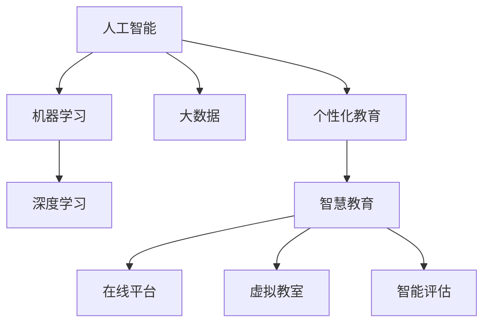

                 

# 如何利用技术能力进行教育科技革命

> 关键词：教育科技革命,人工智能,机器学习,深度学习,大数据,个性化教育,智慧教育

## 1. 背景介绍

### 1.1 问题由来
随着信息技术在教育领域的深入应用，教育科技革命的浪潮正在席卷全球。然而，传统的教育模式在应对快速变化的教育需求方面显得力不从心，需要一种新的技术手段来推动教育模式的变革。

教育科技革命的驱动力来自于以下几个方面：
- **技术进步**：人工智能、机器学习、深度学习、大数据等技术的快速发展，为个性化教育提供了技术支撑。
- **需求变化**：随着社会的发展，人们对教育的需求从传统的知识传授转向更加注重能力的培养，如批判性思维、创新能力、协作能力等。
- **政策支持**：各国政府对教育科技的支持力度不断加大，为教育技术的应用提供了政策保障和资源支持。

### 1.2 问题核心关键点
教育科技革命的核心在于利用技术手段，尤其是人工智能和大数据，实现教育的个性化、智能化、规模化。具体关键点包括：

- **个性化教育**：根据学生的个体差异，提供定制化的教学方案。
- **智能化教学**：利用机器学习算法，实现自动化评估和反馈。
- **规模化教育**：通过在线教育平台，打破时间和空间的限制，实现大规模、低成本的教育。

## 2. 核心概念与联系

### 2.1 核心概念概述

为更好地理解教育科技革命的技术基础，本节将介绍几个核心概念：

- **人工智能**：指通过计算机模拟人的智能行为，包括感知、学习、推理、决策等能力，广泛应用于教育领域。
- **机器学习**：一种数据驱动的学习方式，通过大量数据训练模型，使其能够从数据中学习规律，并应用于新的数据集。
- **深度学习**：机器学习的一种高级形式，使用多层神经网络结构，可以从数据中提取高层次的抽象特征。
- **大数据**：指规模庞大、复杂多样的数据集，能够支持复杂的分析和挖掘任务。
- **个性化教育**：根据学生的兴趣、能力、需求等，提供定制化的教学方案。
- **智慧教育**：通过智能化手段，如在线平台、虚拟教室、智能评估等，实现教育的自动化、个性化和规模化。

这些核心概念之间的逻辑关系可以通过以下Mermaid流程图来展示：



这个流程图展示了个智革命的技术基础和关键组成：

1. 人工智能通过大数据和深度学习实现智能化的教学和评估。
2. 个性化教育结合了人工智能的智能和人类的理解，提供定制化的教学方案。
3. 智慧教育通过在线平台、虚拟教室、智能评估等技术手段，实现教育的规模化、自动化和个性化。

## 3. 核心算法原理 & 具体操作步骤
### 3.1 算法原理概述

教育科技革命的核心算法原理主要集中在机器学习、深度学习和个性化推荐上。以下是对这些核心算法的详细阐述：

**机器学习**：
- 数据驱动：通过分析大量的学生行为数据，如学习时间、答题情况、视频观看等，来预测学生的学习效果和需求。
- 监督学习：利用标注好的数据集训练模型，使其能够对新的数据进行分类和预测。
- 无监督学习：在无标注的数据上，通过聚类、降维等方法发现数据的结构和模式。

**深度学习**：
- 多层网络：通过多层神经网络结构，逐步提取数据的高级特征。
- 端到端学习：深度学习能够直接从原始数据学习到目标变量，减少了中间变量，提高了预测的准确性。
- 迁移学习：利用预训练的深度学习模型，将其在特定领域的知识迁移到新的任务上，减少新任务的数据需求。

**个性化推荐**：
- 协同过滤：通过分析用户的行为数据，推荐用户可能感兴趣的内容。
- 内容推荐：通过分析内容的特征，推荐与用户兴趣相似的内容。
- 混合推荐：结合协同过滤和内容推荐，提供更准确的个性化推荐。

### 3.2 算法步骤详解

基于机器学习、深度学习和个性化推荐等核心算法，教育科技革命的实施步骤主要包括以下几个环节：

**Step 1: 数据收集与预处理**
- 收集学生的行为数据，包括学习时间、作业成绩、在线互动等。
- 对数据进行清洗、标注和归一化处理，以保证数据的质量和一致性。

**Step 2: 特征提取与建模**
- 利用机器学习算法提取学生特征，如学习风格、知识水平、兴趣爱好等。
- 使用深度学习模型，如卷积神经网络（CNN）、循环神经网络（RNN）等，构建预测模型。
- 利用迁移学习，使用预训练的深度学习模型，如BERT、GPT等，进行微调或特征提取。

**Step 3: 模型训练与评估**
- 在标注数据上训练预测模型，优化模型的参数。
- 使用交叉验证等方法评估模型的性能，确保模型具有良好的泛化能力。

**Step 4: 应用部署与优化**
- 将训练好的模型部署到在线平台或虚拟教室中。
- 实时分析学生的学习行为，提供个性化推荐和智能反馈。
- 根据反馈和效果，不断优化模型和算法，提升教学效果。

### 3.3 算法优缺点

教育科技革命中使用的核心算法具有以下优点：
- **精准性**：通过大数据和深度学习，能够准确预测学生的学习效果和需求。
- **高效性**：利用机器学习算法，可以自动完成学生评估和推荐，节省大量人工成本。
- **灵活性**：通过个性化推荐和智能评估，能够满足不同学生的个性化需求。

同时，这些算法也存在一些局限性：
- **数据依赖**：算法的效果高度依赖于数据的质量和数量。
- **模型复杂性**：深度学习模型通常较为复杂，需要大量计算资源进行训练和优化。
- **解释性不足**：深度学习模型通常是“黑盒”模型，难以解释其内部工作机制。

### 3.4 算法应用领域

教育科技革命的应用领域非常广泛，以下是几个典型的应用场景：

**在线教育平台**：
- 通过分析学生的学习行为，提供个性化的课程推荐和习题练习。
- 利用智能评估系统，实时反馈学生的学习进度和效果。

**虚拟教室**：
- 利用虚拟现实（VR）和增强现实（AR）技术，提供沉浸式的学习体验。
- 通过自然语言处理（NLP）技术，实现智能问答和互动。

**智能评估系统**：
- 利用机器学习算法，自动评估学生的作业和考试。
- 提供个性化的反馈和建议，帮助学生改进学习效果。

**教育数据分析**：
- 通过大数据分析，发现教育领域的规律和趋势。
- 为教育政策的制定和优化提供数据支持。

**个性化推荐系统**：
- 根据学生的学习兴趣和能力，推荐合适的学习资源和活动。
- 帮助学生最大化地利用时间，提高学习效率。

除了上述这些经典应用外，教育科技革命还在更多领域得到了广泛的应用，如智慧课堂、学习管理系统（LMS）、家长门户等，为教育模式的变革提供了新的技术手段。

## 4. 数学模型和公式 & 详细讲解  
### 4.1 数学模型构建

本节将使用数学语言对教育科技革命的算法原理进行更加严格的刻画。

记学生行为数据为 $D=\{(x_i,y_i)\}_{i=1}^N, x_i \in \mathcal{X}, y_i \in \mathcal{Y}$，其中 $x_i$ 为输入（行为特征），$y_i$ 为输出（学习效果）。

定义预测模型的损失函数为 $\ell(y_i,\hat{y}_i)$，其中 $\hat{y}_i$ 为模型预测的学习效果。则经验风险为：

$$
\mathcal{L}(\theta) = \frac{1}{N} \sum_{i=1}^N \ell(y_i,\hat{y}_i)
$$

在深度学习中，通常使用均方误差（MSE）、交叉熵（CE）等损失函数。以均方误差为例，预测模型 $M_{\theta}$ 在输入 $x_i$ 上的预测值为 $\hat{y}_i=M_{\theta}(x_i)$，则均方误差为：

$$
\ell(y_i,\hat{y}_i) = \frac{1}{2}(y_i - \hat{y}_i)^2
$$

利用反向传播算法更新模型参数 $\theta$：

$$
\theta \leftarrow \theta - \eta \nabla_{\theta}\mathcal{L}(\theta)
$$

其中 $\eta$ 为学习率，$\nabla_{\theta}\mathcal{L}(\theta)$ 为损失函数对参数 $\theta$ 的梯度。

### 4.2 公式推导过程

以下我们以学生成绩预测为例，推导深度学习模型的损失函数及其梯度的计算公式。

假设预测模型的输出为 $\hat{y}_i \in [0,1]$，表示学生 $i$ 在课程 $j$ 上获得通过的概率。真实标签 $y_i \in \{0,1\}$。则二分类交叉熵损失函数定义为：

$$
\ell(y_i,\hat{y}_i) = -[y_i\log \hat{y}_i + (1-y_i)\log (1-\hat{y}_i)]
$$

将其代入经验风险公式，得：

$$
\mathcal{L}(\theta) = -\frac{1}{N}\sum_{i=1}^N [y_i\log M_{\theta}(x_i)+(1-y_i)\log(1-M_{\theta}(x_i))]
$$

根据链式法则，损失函数对参数 $\theta_k$ 的梯度为：

$$
\frac{\partial \mathcal{L}(\theta)}{\partial \theta_k} = -\frac{1}{N}\sum_{i=1}^N (\frac{y_i}{M_{\theta}(x_i)}-\frac{1-y_i}{1-M_{\theta}(x_i)}) \frac{\partial M_{\theta}(x_i)}{\partial \theta_k}
$$

其中 $\frac{\partial M_{\theta}(x_i)}{\partial \theta_k}$ 可进一步递归展开，利用自动微分技术完成计算。

在得到损失函数的梯度后，即可带入参数更新公式，完成模型的迭代优化。重复上述过程直至收敛，最终得到适应特定任务的最优模型参数 $\theta^*$。

## 5. 项目实践：代码实例和详细解释说明
### 5.1 开发环境搭建

在进行教育科技革命的项目实践前，我们需要准备好开发环境。以下是使用Python进行PyTorch开发的环境配置流程：

1. 安装Anaconda：从官网下载并安装Anaconda，用于创建独立的Python环境。

2. 创建并激活虚拟环境：
```bash
conda create -n pytorch-env python=3.8 
conda activate pytorch-env
```

3. 安装PyTorch：根据CUDA版本，从官网获取对应的安装命令。例如：
```bash
conda install pytorch torchvision torchaudio cudatoolkit=11.1 -c pytorch -c conda-forge
```

4. 安装Transformers库：
```bash
pip install transformers
```

5. 安装各类工具包：
```bash
pip install numpy pandas scikit-learn matplotlib tqdm jupyter notebook ipython
```

完成上述步骤后，即可在`pytorch-env`环境中开始教育科技革命的实践。

### 5.2 源代码详细实现

这里我们以学生成绩预测为例，使用PyTorch对深度学习模型进行开发。

首先，定义数据处理函数：

```python
from torch.utils.data import Dataset
import torch

class StudentDataset(Dataset):
    def __init__(self, features, labels):
        self.features = features
        self.labels = labels
        
    def __len__(self):
        return len(self.features)
    
    def __getitem__(self, item):
        feature = self.features[item]
        label = self.labels[item]
        return {'feature': feature, 
                'label': label}
```

然后，定义模型和优化器：

```python
from torch.nn import Linear, ReLU, Dropout
from torch.nn import BCEWithLogitsLoss
from torch.optim import Adam

model = torch.nn.Sequential(
    Linear(10, 32), ReLU(), Dropout(0.5), 
    Linear(32, 1), Sigmoid()
)

criterion = BCEWithLogitsLoss()
optimizer = Adam(model.parameters(), lr=0.001)
```

接着，定义训练和评估函数：

```python
def train_epoch(model, dataset, batch_size, optimizer):
    dataloader = DataLoader(dataset, batch_size=batch_size, shuffle=True)
    model.train()
    epoch_loss = 0
    for batch in tqdm(dataloader, desc='Training'):
        features = batch['feature'].to(device)
        labels = batch['label'].to(device)
        model.zero_grad()
        outputs = model(features)
        loss = criterion(outputs, labels)
        epoch_loss += loss.item()
        loss.backward()
        optimizer.step()
    return epoch_loss / len(dataloader)

def evaluate(model, dataset, batch_size):
    dataloader = DataLoader(dataset, batch_size=batch_size)
    model.eval()
    preds, labels = [], []
    with torch.no_grad():
        for batch in tqdm(dataloader, desc='Evaluating'):
            features = batch['feature'].to(device)
            labels = batch['label'].to(device)
            batch_preds = model(features).detach().cpu().numpy()
            batch_labels = labels.cpu().numpy()
            for pred, label in zip(batch_preds, batch_labels):
                preds.append(pred)
                labels.append(label)
                
    return preds, labels
```

最后，启动训练流程并在测试集上评估：

```python
epochs = 10
batch_size = 32

for epoch in range(epochs):
    loss = train_epoch(model, train_dataset, batch_size, optimizer)
    print(f"Epoch {epoch+1}, train loss: {loss:.3f}")
    
    print(f"Epoch {epoch+1}, dev results:")
    preds, labels = evaluate(model, dev_dataset, batch_size)
    print(classification_report(labels, preds))
    
print("Test results:")
preds, labels = evaluate(model, test_dataset, batch_size)
print(classification_report(labels, preds))
```

以上就是使用PyTorch对深度学习模型进行学生成绩预测的完整代码实现。可以看到，得益于PyTorch的强大封装，我们可以用相对简洁的代码完成深度学习模型的构建和微调。

### 5.3 代码解读与分析

让我们再详细解读一下关键代码的实现细节：

**StudentDataset类**：
- `__init__`方法：初始化特征和标签，用于数据集的准备。
- `__len__`方法：返回数据集的样本数量。
- `__getitem__`方法：对单个样本进行处理，将其输入特征和标签返回。

**模型定义**：
- 使用线性层、ReLU激活函数和Dropout技术，构建一个简单的多层感知器（MLP）模型。
- 输出层使用Sigmoid函数，用于二分类任务。

**损失函数和优化器**：
- 使用二元交叉熵损失函数，计算预测值和真实标签之间的差异。
- 使用Adam优化器，设置初始学习率为0.001，优化模型参数。

**训练和评估函数**：
- 使用PyTorch的DataLoader对数据集进行批次化加载，供模型训练和推理使用。
- 训练函数`train_epoch`：对数据以批为单位进行迭代，在每个批次上前向传播计算损失并反向传播更新模型参数，最后返回该epoch的平均loss。
- 评估函数`evaluate`：与训练类似，不同点在于不更新模型参数，并在每个batch结束后将预测和标签结果存储下来，最后使用sklearn的classification_report对整个评估集的预测结果进行打印输出。

**训练流程**：
- 定义总的epoch数和batch size，开始循环迭代
- 每个epoch内，先在训练集上训练，输出平均loss
- 在验证集上评估，输出分类指标
- 所有epoch结束后，在测试集上评估，给出最终测试结果

可以看到，PyTorch配合TensorFlow等深度学习框架，使得深度学习模型的开发变得简洁高效。开发者可以将更多精力放在数据处理、模型改进等高层逻辑上，而不必过多关注底层的实现细节。

当然，工业级的系统实现还需考虑更多因素，如模型的保存和部署、超参数的自动搜索、更灵活的任务适配层等。但核心的深度学习模型构建和微调范式基本与此类似。

## 6. 实际应用场景
### 6.1 在线教育平台

基于深度学习模型和机器学习算法的在线教育平台，能够实时分析学生的学习行为，提供个性化的课程推荐和习题练习。平台可以通过学生在学习系统中的操作记录、答题情况、视频观看等数据，构建学生的行为特征向量，并利用预测模型预测其学习效果。根据预测结果，平台可以推荐适合学生的学习资源和习题，帮助学生提高学习效率。

### 6.2 虚拟教室

利用虚拟现实（VR）和增强现实（AR）技术，虚拟教室可以提供沉浸式的学习体验。学生可以在虚拟环境中进行互动和协作，提高学习兴趣和参与度。同时，利用自然语言处理（NLP）技术，虚拟教室可以实现智能问答和互动，帮助学生解决学习中的疑惑。

### 6.3 智能评估系统

智能评估系统能够利用机器学习算法，自动评估学生的作业和考试。系统可以根据学生的答题情况和历史记录，分析学生的知识掌握情况和学习效果，提供个性化的反馈和建议，帮助学生改进学习策略，提升学习效果。

### 6.4 教育数据分析

教育数据分析可以通过大数据技术，发现教育领域的规律和趋势。利用在线平台和虚拟教室的数据，可以分析学生的学习行为、成绩分布、知识掌握情况等，为教育政策的制定和优化提供数据支持。

### 6.5 个性化推荐系统

个性化推荐系统可以根据学生的学习兴趣和能力，推荐合适的学习资源和活动。系统可以利用协同过滤、内容推荐等技术，分析学生的学习历史和行为数据，推荐与其兴趣和需求相符的内容，帮助学生最大化地利用时间，提高学习效率。

除了上述这些经典应用外，教育科技革命还在更多领域得到了广泛的应用，如智慧课堂、学习管理系统（LMS）、家长门户等，为教育模式的变革提供了新的技术手段。

## 7. 工具和资源推荐
### 7.1 学习资源推荐

为了帮助开发者系统掌握教育科技革命的理论基础和实践技巧，这里推荐一些优质的学习资源：

1. 《深度学习》系列书籍：由深度学习领域的专家撰写，全面介绍了深度学习的原理、算法和应用。
2. 《机器学习实战》书籍：通过实战项目，介绍了机器学习算法的实现和应用。
3. 《Python深度学习》书籍：结合Python语言，深入讲解了深度学习的核心技术。
4. Coursera、edX等在线课程平台：提供丰富的深度学习和机器学习课程，涵盖理论基础和实践应用。
5. Kaggle竞赛：通过参与数据挖掘和机器学习竞赛，实践深度学习和机器学习算法。

通过对这些资源的学习实践，相信你一定能够快速掌握教育科技革命的技术精髓，并用于解决实际的教育问题。
###  7.2 开发工具推荐

高效的开发离不开优秀的工具支持。以下是几款用于教育科技革命开发的常用工具：

1. PyTorch：基于Python的开源深度学习框架，灵活动态的计算图，适合快速迭代研究。大部分深度学习模型都有PyTorch版本的实现。
2. TensorFlow：由Google主导开发的开源深度学习框架，生产部署方便，适合大规模工程应用。同样有丰富的深度学习模型资源。
3. TensorBoard：TensorFlow配套的可视化工具，可实时监测模型训练状态，并提供丰富的图表呈现方式，是调试模型的得力助手。
4. Weights & Biases：模型训练的实验跟踪工具，可以记录和可视化模型训练过程中的各项指标，方便对比和调优。与主流深度学习框架无缝集成。
5. Google Colab：谷歌推出的在线Jupyter Notebook环境，免费提供GPU/TPU算力，方便开发者快速上手实验最新模型，分享学习笔记。

合理利用这些工具，可以显著提升教育科技革命的开发效率，加快创新迭代的步伐。

### 7.3 相关论文推荐

教育科技革命的研究源于学界的持续研究。以下是几篇奠基性的相关论文，推荐阅读：

1. DNN: A Deep Learning Framework for Automated Education Outcomes（教育成果自动化的深度学习框架）：提出了基于深度学习的教育成果自动化预测模型。
2. Mining Knowledge from Student Behavior Data（从学生行为数据中挖掘知识）：通过分析学生的学习行为数据，发现学习效果与行为特征之间的关系，提出基于机器学习的学生学习效果预测模型。
3. Adaptive Learning Environments: An Overview（自适应学习环境综述）：综述了自适应学习环境的研究进展和应用案例，为教育科技革命提供了理论基础。
4. Online Learning Analytics for Knowledge Tracing（基于知识追踪的在线学习分析）：通过知识追踪技术，分析学生的学习过程，提供个性化的学习建议。
5. Smart Education for Smart People: The Role of Knowledge Discovery in Education（智能教育：知识发现的角色）：讨论了知识发现在智能教育中的应用，为教育科技革命提供了新的视角。

这些论文代表了大规模学习模式和知识发现技术的研究脉络。通过学习这些前沿成果，可以帮助研究者把握学科前进方向，激发更多的创新灵感。

## 8. 总结：未来发展趋势与挑战
### 8.1 总结

本文对教育科技革命中基于深度学习和大数据技术的算法原理和实践技巧进行了全面系统的介绍。首先阐述了教育科技革命的背景和核心概念，明确了技术在个性化教育、智能化教学、规模化教育中的应用潜力。其次，从原理到实践，详细讲解了深度学习模型在教育领域的应用，给出了完整的代码实现。同时，本文还广泛探讨了深度学习技术在在线教育平台、虚拟教室、智能评估系统、教育数据分析、个性化推荐系统等多个行业领域的应用前景，展示了技术的巨大价值。此外，本文精选了深度学习技术的各类学习资源，力求为读者提供全方位的技术指引。

通过本文的系统梳理，可以看到，基于深度学习和大数据技术的教育科技革命正在蓬勃发展，极大地提升了教育的个性化、智能化和规模化水平。受益于大数据和深度学习技术的支撑，未来教育模式必将迎来重大变革，为人类社会的可持续发展提供新的动力。

### 8.2 未来发展趋势

展望未来，教育科技革命将呈现以下几个发展趋势：

1. **智能化和自动化**：随着深度学习技术的发展，教育系统将更加智能化和自动化，能够自动分析学生的学习行为，提供个性化的学习方案和建议。
2. **个性化教育**：利用大数据和深度学习，能够实现更加精准和个性化的教学，根据学生的兴趣和能力进行定制化的课程推荐和学习资源分配。
3. **实时化**：通过在线平台和虚拟教室，教育系统将实现实时化的教学和评估，能够实时监测学生的学习效果，并根据反馈进行动态调整。
4. **跨界融合**：教育科技革命将与医疗、金融、娱乐等其他领域进行深度融合，实现跨界的协同创新。
5. **公平和普及**：通过在线教育和智能评估系统，教育资源将更加公平和普及，缩小城乡和地区间的教育差距。
6. **伦理和隐私保护**：随着技术的应用，数据隐私和伦理问题将成为重要的研究课题，需要制定相应的规范和政策。

以上趋势凸显了教育科技革命的广阔前景。这些方向的探索发展，必将进一步提升教育系统的智能化和个性化水平，为人类社会的可持续发展提供新的动力。

### 8.3 面临的挑战

尽管教育科技革命已经取得了显著的进展，但在迈向更加智能化、普适化应用的过程中，它仍面临着诸多挑战：

1. **数据隐私和安全**：教育系统需要处理大量的学生数据，如何保障数据隐私和安全是一个重要问题。
2. **数据质量和标注**：教育数据的标注和处理需要大量人力和时间，如何高效获取和处理数据是一个难题。
3. **技术复杂性**：深度学习模型通常较为复杂，需要大量计算资源进行训练和优化，如何降低技术门槛是一个挑战。
4. **效果评估**：教育效果的评估方法需要科学和全面，如何建立有效的评估标准是一个难题。
5. **教师和学生的接受度**：新技术的应用需要得到教师和学生的认可和接受，如何推广新技术是一个挑战。
6. **持续优化**：教育系统的优化需要持续进行，如何建立有效的优化机制是一个难题。

正视教育科技革命面临的这些挑战，积极应对并寻求突破，将是大规模学习模式和知识发现技术走向成熟的必由之路。相信随着学界和产业界的共同努力，这些挑战终将一一被克服，教育科技革命必将在构建公平、智能、普适的教育系统中扮演越来越重要的角色。

### 8.4 研究展望

面对教育科技革命所面临的种种挑战，未来的研究需要在以下几个方面寻求新的突破：

1. **隐私保护和伦理**：在技术应用中，需要考虑数据隐私和伦理问题，制定相应的规范和政策。
2. **数据质量和标注**：如何高效获取和处理教育数据，减少标注成本，提升数据质量。
3. **模型优化和效率**：如何优化深度学习模型，降低技术门槛，提升模型的训练和推理效率。
4. **效果评估和优化**：如何建立科学和全面的效果评估标准，不断优化教育系统和学习策略。
5. **教师和学生接受度**：如何提高教师和学生对新技术的接受度，推动大规模学习模式的普及应用。
6. **跨界融合**：如何实现教育与其他领域的深度融合，实现跨界的协同创新。

这些研究方向的探索，必将引领教育科技革命技术的持续进步，为构建公平、智能、普适的教育系统铺平道路。面向未来，教育科技革命技术还需要与其他人工智能技术进行更深入的融合，如知识表示、因果推理、强化学习等，多路径协同发力，共同推动教育模式的变革。只有勇于创新、敢于突破，才能不断拓展教育技术的边界，让智能技术更好地造福人类社会。

## 9. 附录：常见问题与解答

**Q1：教育科技革命是否适用于所有教育场景？**

A: 教育科技革命在大多数教育场景中都能取得较好的效果，特别是对于数据量较大的任务。但对于一些特殊场景，如某些特定领域的教育，需要针对性地进行优化和改进。此外，对于需要高度互动和情感参与的课程，深度学习模型的应用也需要慎重考虑。

**Q2：如何选择合适的深度学习模型？**

A: 选择合适的深度学习模型需要考虑多个因素，如任务类型、数据量、计算资源等。常用的深度学习模型包括卷积神经网络（CNN）、循环神经网络（RNN）、长短期记忆网络（LSTM）、Transformer等。对于图像识别任务，CNN较为适合；对于序列数据，RNN和LSTM较为适合；对于自然语言处理任务，Transformer较为适合。

**Q3：深度学习模型在教育应用中面临哪些挑战？**

A: 深度学习模型在教育应用中面临以下挑战：
1. 数据质量：教育数据往往存在缺失、噪声等问题，影响模型的训练效果。
2. 模型解释性：深度学习模型通常是“黑盒”模型，难以解释其内部工作机制和决策逻辑。
3. 过拟合问题：深度学习模型容易过拟合，特别是在数据量较少的情况下。
4. 计算资源：深度学习模型通常需要大量的计算资源进行训练和推理，需要高效的硬件支持。

**Q4：如何提高深度学习模型的效果？**

A: 提高深度学习模型的效果可以从以下几个方面入手：
1. 数据预处理：对数据进行清洗、归一化和特征工程，提高数据质量。
2. 模型优化：使用优化器、正则化等技术，减少过拟合风险。
3. 超参数调优：调整学习率、批大小、迭代轮数等超参数，找到最优参数组合。
4. 模型集成：利用多个模型的预测结果进行集成，提高模型的泛化能力和鲁棒性。
5. 迁移学习：利用预训练模型，在特定领域的少量数据上进行微调，提升模型效果。

**Q5：教育科技革命的未来发展方向是什么？**

A: 教育科技革命的未来发展方向主要包括以下几个方面：
1. 智能化教育：通过深度学习技术，实现教育的智能化和自动化，提供个性化的学习方案和建议。
2. 个性化教育：利用大数据和深度学习，实现更加精准和个性化的教学，根据学生的兴趣和能力进行定制化的课程推荐和学习资源分配。
3. 实时化教学：通过在线平台和虚拟教室，实现实时化的教学和评估，能够实时监测学生的学习效果，并根据反馈进行动态调整。
4. 跨界融合：教育科技革命将与医疗、金融、娱乐等其他领域进行深度融合，实现跨界的协同创新。
5. 公平和普及：通过在线教育和智能评估系统，教育资源将更加公平和普及，缩小城乡和地区间的教育差距。

总之，教育科技革命的未来发展将更加智能化、个性化和普适化，为人类社会的可持续发展提供新的动力。

---

作者：禅与计算机程序设计艺术 / Zen and the Art of Computer Programming

