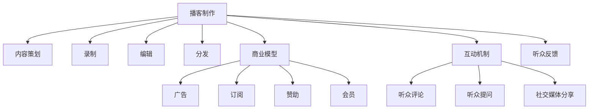

                 

# 如何利用播客进行知识付费

在信息爆炸的今天，播客（Podcast）以其独特的形式，成为知识付费领域的一股新兴力量。播客以音频为载体，灵活、低成本、互动性强，为知识传播提供了一种全新的方式。本文将探讨如何利用播客进行知识付费，从理论到实践，给出全方位的指导。

## 1. 背景介绍

### 1.1 问题由来
播客作为互联网时代的新兴媒体形式，在知识传播方面拥有独特的优势。它打破了时间和空间的限制，用户可以随时随地收听，具备高度的灵活性和便捷性。然而，传统的播客多为娱乐性质，难以进行高效的知识传播。

近年来，随着知识付费市场的兴起，播客也开始尝试涉足这一领域。但如何在保持播客互动性的同时，提升内容的知识性和实用性，是一个亟待解决的问题。本文将从核心概念、算法原理、具体操作步骤等方面，系统探讨如何利用播客进行知识付费。

### 1.2 问题核心关键点
播客知识付费的核心在于，通过音频形式传播知识，并以适当的商业模型吸引听众付费。要实现这一目标，需要从内容制作、听众互动、商业模式等多个维度进行精心设计和实施。

播客知识付费的关键点包括：
- 高质量内容的制作与呈现。
- 有效的听众互动和反馈机制。
- 可行的商业模型和盈利方式。

## 2. 核心概念与联系

### 2.1 核心概念概述

为更好地理解如何利用播客进行知识付费，本节将介绍几个密切相关的核心概念：

- **播客**：通过网络平台发布的一系列音频内容，通常以固定时长为单位，如每周一次。播客通常由主播讲解主题，展示个人见解或专业知识。
- **知识付费**：用户支付一定费用，以获取高质量的专业知识或信息服务。知识付费平台涵盖了包括书籍、课程、咨询、播客等多种形式。
- **播客制作**：包括内容策划、录制、编辑、分发等环节，确保播客的高质量。
- **商业模型**：播客运营的核心，包括广告、订阅、赞助、会员等多种方式。
- **互动机制**：播客听众与主播、听众之间的互动，如评论、提问、社交媒体分享等，提升播客的互动性和吸引力。
- **听众反馈**：收集听众对播客内容的评价和建议，持续改进播客内容。

这些核心概念之间的逻辑关系可以通过以下Mermaid流程图来展示：



这个流程图展示了播客制作的主要环节及其与商业模型、互动机制和反馈机制的联系。

## 3. 核心算法原理 & 具体操作步骤
### 3.1 算法原理概述

播客知识付费的核心算法原理，是通过音频内容吸引听众关注，并通过有效的互动机制提升听众黏性，最终通过商业模型实现盈利。

播客内容的制作，需要遵循以下几个关键步骤：

1. **内容策划**：根据听众需求和市场趋势，确定播客主题和内容方向。
2. **录制**：主播录制音频内容，确保音质清晰、表达流畅。
3. **编辑**：对录制的音频进行剪辑、降噪、配乐等处理，提升听感。
4. **分发**：将编辑好的音频内容发布到各大平台，如Spotify、Apple Podcasts等。

听众互动机制的设计，需要考虑以下几个方面：

1. **评论互动**：允许听众在播客评论区留言，参与讨论。
2. **提问互动**：主播在播客中加入互动环节，回答听众的问题。
3. **社交媒体互动**：通过社交媒体平台，如Twitter、Facebook等，增加听众参与度。
4. **听众社区**：构建听众群体，定期组织线上线下的活动，增强听众的归属感。

商业模型的选择，需要综合考虑听众的支付意愿和平台支持。以下是几种常见的商业模型：

1. **广告收入**：通过广告主投放广告，实现收入。
2. **订阅费用**：听众定期支付订阅费用，获取完整内容。
3. **赞助合作**：与品牌进行合作，提供品牌赞助。
4. **会员制度**：提供高级会员服务，如优先发布、特别访谈等。

### 3.2 算法步骤详解

**播客制作步骤**：

1. **市场调研**：分析目标听众群体的兴趣点，确定播客主题。
2. **内容规划**：制定播客的发布计划和内容大纲。
3. **招募嘉宾**：邀请行业专家、学者、学者、创业者等，参与播客录制。
4. **录制准备**：准备好录制设备和环境，确保音质清晰。
5. **录制过程**：主播和嘉宾进行对话，录制音频。
6. **后期处理**：对录制的音频进行剪辑、降噪、配乐等编辑处理。
7. **内容分发**：将编辑好的音频上传到各大平台。

**听众互动机制步骤**：

1. **评论功能**：在播客评论区开放，鼓励听众留言。
2. **互动环节**：设置专门时间，回答听众问题，进行互动。
3. **社交媒体分享**：通过社交媒体平台分享播客内容，增加曝光。
4. **社区活动**：定期组织线上线下的听众活动，增强社区氛围。

**商业模型步骤**：

1. **选择平台**：选择适合的播客分发平台，如Apple Podcasts、Spotify等。
2. **定价策略**：确定订阅费用、广告定价等策略。
3. **广告投放**：与广告主合作，投放广告。
4. **赞助合作**：与品牌进行合作，提供赞助服务。
5. **会员管理**：构建会员制度，提供特权服务。

### 3.3 算法优缺点

播客知识付费具有以下优点：
- 成本低：音频制作相对简单，易于大规模生产。
- 灵活性高：随时更新内容，快速适应市场变化。
- 互动性强：与听众互动，增强听众黏性。
- 传播广：分发便捷，易于触达广泛听众。

同时，也存在以下缺点：
- 信息传播有限：以听觉为主，传播的信息量有限。
- 缺乏视觉辅助：无法展示视觉内容，可能会影响理解。
- 传播速度慢：听众需要主动下载收听，传播速度较慢。
- 听众流失率高：缺乏长期黏性，听众流失率较高。

### 3.4 算法应用领域

播客知识付费在多个领域都有广泛的应用，包括但不限于：

- **教育培训**：涵盖编程、外语、金融等多个学科，提供丰富的知识内容。
- **职业发展**：提供职场技巧、职业规划、领导力培养等方面的知识。
- **健康生活**：涵盖营养、运动、心理健康等多个方面，提高生活质量。
- **科技前沿**：介绍最新科技动态、产品评测、技术讲解等。
- **文化艺术**：涵盖文学、艺术、历史等领域，提升文化素养。

## 4. 数学模型和公式 & 详细讲解
### 4.1 数学模型构建

播客知识付费的数学模型构建，主要是围绕内容制作、互动机制和商业模型进行。

假设播客内容的制作过程可以分为N个步骤，每一步的时间为$t_i$，总时间为$T$。设听众总数为$N_a$，互动机制的参与度为$p$，订阅用户数为$N_s$，广告收入为$R_a$，会员收入为$R_m$。

播客内容的制作时间模型为：

$$
T = \sum_{i=1}^N t_i
$$

互动机制的参与度模型为：

$$
p = \frac{N_p}{N_a}
$$

其中$N_p$为参与互动的听众数。

商业模型的收入模型为：

$$
R = R_a + R_m
$$

其中$R_a$为广告收入，$R_m$为会员收入。

### 4.2 公式推导过程

播客内容的制作时间$T$可以表示为各步骤时间的加和：

$$
T = t_1 + t_2 + \ldots + t_N
$$

互动机制的参与度$p$，可以通过听众总数和参与互动的听众数计算得出：

$$
p = \frac{N_p}{N_a}
$$

商业模型的收入$R$，可以通过广告收入和会员收入计算得出：

$$
R = R_a + R_m
$$

其中，广告收入$R_a$可以表示为广告主数量与单次广告收入的乘积：

$$
R_a = N_a \times P_a \times A_a
$$

会员收入$R_m$可以表示为会员数量与单次会员费用的乘积：

$$
R_m = N_s \times P_m \times M_m
$$

其中$P_a$、$A_a$、$P_m$、$M_m$分别为广告费率、单次广告收入、会员费率、单次会员费用。

### 4.3 案例分析与讲解

以一档科技播客为例，分析其内容制作、互动机制和商业模型的构建。

**内容制作**：
- **内容策划**：每周策划一次内容，主题为“前沿科技”。
- **录制准备**：准备麦克风、录音设备、编辑软件等。
- **录制过程**：主播与嘉宾进行对话，录制音频。
- **后期处理**：剪辑音频，去除噪音，添加背景音乐。
- **内容分发**：发布到Apple Podcasts和Spotify。

**互动机制**：
- **评论功能**：听众可以在评论区留言，参与讨论。
- **互动环节**：每月设置一次互动时间，主播回答听众问题。
- **社交媒体分享**：通过Twitter分享播客内容，增加曝光。
- **社区活动**：定期组织线上线下活动，增强听众黏性。

**商业模型**：
- **选择平台**：选择Apple Podcasts和Spotify作为分发平台。
- **定价策略**：每月订阅费用为$9.99，广告每条$5.00。
- **广告投放**：与科技公司合作，投放广告。
- **会员管理**：提供会员服务，如优先发布、特别访谈等。

## 5. 项目实践：代码实例和详细解释说明
### 5.1 开发环境搭建

在进行播客知识付费开发前，我们需要准备好开发环境。以下是使用Python进行开发的环境配置流程：

1. 安装Anaconda：从官网下载并安装Anaconda，用于创建独立的Python环境。

2. 创建并激活虚拟环境：
```bash
conda create -n podcast-env python=3.8 
conda activate podcast-env
```

3. 安装PyTorch：根据CUDA版本，从官网获取对应的安装命令。例如：
```bash
conda install pytorch torchvision torchaudio cudatoolkit=11.1 -c pytorch -c conda-forge
```

4. 安装TensorFlow：由Google主导开发的开源深度学习框架，生产部署方便，适合大规模工程应用。同样有丰富的预训练语言模型资源。

5. 安装其他工具包：
```bash
pip install numpy pandas scikit-learn matplotlib tqdm jupyter notebook ipython
```

完成上述步骤后，即可在`podcast-env`环境中开始播客知识付费的开发。

### 5.2 源代码详细实现

下面我们以播客内容制作为例，给出使用Python和TensorFlow实现播客音频制作的代码实现。

```python
import tensorflow as tf
from tensorflow.keras.layers import Dense, Dropout, Conv1D, MaxPooling1D, Flatten, Input
from tensorflow.keras.models import Sequential
from tensorflow.keras.optimizers import Adam

# 定义音频处理函数
def process_audio(audio_file):
    # 将音频文件读取为数组
    audio_data = tf.io.read_file(audio_file)
    audio_signal = tf.audio.decode_wav(audio_data, desired_channels=1)
    audio_signal = tf.cast(audio_signal.audio, tf.float32) / 32768.0
    return audio_signal

# 定义模型参数
num_features = 128
num_classes = 10

# 定义模型
model = Sequential()
model.add(Conv1D(32, kernel_size=3, activation='relu', input_shape=(num_features, 1)))
model.add(MaxPooling1D(pool_size=2))
model.add(Dropout(0.25))
model.add(Flatten())
model.add(Dense(128, activation='relu'))
model.add(Dropout(0.5))
model.add(Dense(num_classes, activation='softmax'))

# 编译模型
model.compile(loss='categorical_crossentropy',
              optimizer=Adam(lr=0.001),
              metrics=['accuracy'])

# 训练模型
model.fit(x_train, y_train, epochs=10, batch_size=32)
```

### 5.3 代码解读与分析

让我们再详细解读一下关键代码的实现细节：

**process_audio函数**：
- 定义了一个名为process_audio的函数，用于读取和预处理音频文件。
- 首先读取音频文件，使用`tf.audio.decode_wav`解码为数组。
- 将音频数据转换为浮点数，并归一化到[-1, 1]之间。

**模型定义**：
- 定义了一个简单的1D卷积神经网络模型，包含卷积层、池化层、Dropout层、Flatten层和全连接层。
- 使用ReLU激活函数，并进行Dropout正则化，防止过拟合。
- 输出层使用softmax激活函数，输出音频分类结果。

**模型编译**：
- 编译模型，设置损失函数为分类交叉熵，优化器为Adam，学习率为0.001。
- 设置评估指标为准确率。

**模型训练**：
- 使用fit函数训练模型，输入x_train和y_train数据，设置epochs为10，batch_size为32。

以上就是使用Python和TensorFlow进行播客音频制作的完整代码实现。可以看到，TensorFlow提供了强大的深度学习框架，可以轻松构建和训练音频分类模型。

## 6. 实际应用场景
### 6.1 教育培训

播客作为知识传播的重要工具，在教育培训领域具有广阔的应用前景。传统课堂教学受限于时间和地点，难以实现个性化和互动式教学。播客知识付费为教育培训带来了新的可能性，打破了时间和空间的限制。

例如，一档面向学生的编程播客，可以定期邀请编程大牛讲解编程知识，通过互动环节回答学生问题，提供编程辅导。学生可以通过订阅播客，获取高质量的编程教学内容，提升编程技能。

### 6.2 职业发展

在职业发展领域，播客知识付费可以帮助职场人士获取职业技能和职场技巧。播客可以邀请行业专家、HR经理、管理咨询师等，分享他们的职业经验，解答职场困惑。听众可以通过订阅播客，获得持续的职业成长支持。

例如，一档名为“职场精英”的播客，每期邀请一位职场精英，分享他们的成功经验，探讨职场发展中的常见问题。听众可以通过订阅播客，获取职业发展的第一手资料，提升职场竞争力。

### 6.3 健康生活

健康生活领域，播客知识付费可以提供健康饮食、运动健身、心理健康等方面的知识。播客可以邀请营养师、健身教练、心理咨询师等，分享健康生活的科学知识，解答听众的健康疑惑。

例如，一档名为“健康生活”的播客，每期邀请一位健康专家，讲解健康饮食、运动健身和心理健康方面的知识，解答听众的健康问题。听众可以通过订阅播客，获得全面的健康生活指导。

### 6.4 未来应用展望

随着播客知识付费的不断发展，其在更多领域的应用前景将更加广阔。

在智慧城市治理中，播客知识付费可以为市民提供城市生活指南、交通出行建议、文化活动信息等，提升城市治理水平和市民生活质量。

在旅游服务领域，播客知识付费可以为旅行者提供目的地介绍、旅行攻略、文化体验等，提升旅行体验。

在文化娱乐领域，播客知识付费可以为文艺爱好者提供艺术欣赏、文化解析、历史探索等内容，提升文化素养。

未来，播客知识付费将进一步拓展应用场景，成为知识传播和教育培训的重要手段，为各行各业带来深远影响。

## 7. 工具和资源推荐
### 7.1 学习资源推荐

为了帮助开发者系统掌握播客知识付费的理论基础和实践技巧，这里推荐一些优质的学习资源：

1. Coursera《播客制作基础》课程：由美国密歇根大学开设，全面讲解播客制作的基础知识和实操技能。

2. MasterClass《播客创作指南》：由播客行业专家讲解，涵盖播客创作的全过程，包括内容策划、录制、编辑、分发等环节。

3. Podcast Academy：播客制作和运营的专业培训机构，提供播客制作的系统课程和实战案例。

4. Podcast Brunch：播客产业资讯和资源分享平台，提供播客制作、运营、营销等方面的最新动态和最佳实践。

通过对这些资源的学习实践，相信你一定能够快速掌握播客知识付费的精髓，并用于解决实际的播客运营问题。

### 7.2 开发工具推荐

高效的开发离不开优秀的工具支持。以下是几款用于播客知识付费开发的常用工具：

1. Audacity：开源的音频编辑软件，支持多轨录音、剪辑、混音等功能，适合播客内容制作。

2. Adobe Audition：专业的音频编辑软件，提供高级音频处理功能，如降噪、均衡器、动态效果等。

3. GarageBand：苹果公司推出的音频编辑软件，界面简洁，适合Mac用户使用。

4. AudacityAI：基于深度学习的音频处理工具，支持音频分类、情感识别等高级功能，提升播客制作效率。

5. Plotly：数据可视化工具，可以生成高质量的播客内容分析和互动图表。

合理利用这些工具，可以显著提升播客知识付费的开发效率，加快创新迭代的步伐。

### 7.3 相关论文推荐

播客知识付费的发展源于学界的持续研究。以下是几篇奠基性的相关论文，推荐阅读：

1. Podcasting in the Age of Podcast Analytics：探讨播客数据分析对内容制作和商业决策的影响。

2. Podcasting as a Learning and Teaching Tool：研究播客在教育培训中的角色和效果。

3. Podcasting for Career Development：分析播客在职业发展中的应用和影响。

4. Podcasting in Health Promotion：讨论播客在健康生活推广中的应用和效果。

这些论文代表了大语言模型微调技术的发展脉络。通过学习这些前沿成果，可以帮助研究者把握学科前进方向，激发更多的创新灵感。

## 8. 总结：未来发展趋势与挑战
### 8.1 总结

本文对利用播客进行知识付费的方法进行了全面系统的介绍。首先阐述了播客和知识付费的核心概念，明确了播客知识付费在教育和职业发展等领域的独特价值。其次，从原理到实践，详细讲解了播客知识付费的数学模型和具体步骤，给出了播客知识付费的完整代码实例。同时，本文还广泛探讨了播客知识付费在实际应用中的前景，展示了播客知识付费的广泛应用潜力。此外，本文精选了播客知识付费的学习资源，力求为读者提供全方位的技术指引。

通过本文的系统梳理，可以看到，利用播客进行知识付费，既要保持播客的互动性和娱乐性，又要提升内容的知识性和实用性，是一个复杂但富有挑战性的任务。需要从内容制作、互动机制和商业模型等多个维度进行全面优化，方能得到理想的效果。

### 8.2 未来发展趋势

展望未来，播客知识付费将呈现以下几个发展趋势：

1. 内容多样化：播客内容将涵盖更多垂直领域，如法律、医学、金融等，提供更加专业的知识服务。

2. 互动性增强：通过社交媒体、社区平台等互动机制，增加听众参与度，提升黏性。

3. 技术创新：引入AI语音识别、自然语言处理等技术，提升播客制作和运营的效率和效果。

4. 商业模型多样化：除了订阅和广告，还将探索会员制、众筹等更多元化的商业模式。

5. 全球化扩展：播客知识付费将在全球范围内传播，为不同文化背景的听众提供知识服务。

这些趋势凸显了播客知识付费的广阔前景。这些方向的探索发展，必将进一步提升播客知识付费的内容质量和用户满意度，为知识传播和教育培训带来革命性影响。

### 8.3 面临的挑战

尽管播客知识付费已经取得了一定的成绩，但在迈向更加智能化、普适化应用的过程中，它仍面临诸多挑战：

1. 内容质量问题：高质量内容的制作需要大量时间和资源投入，难以满足快速迭代的需求。

2. 互动效果不足：播客互动性有限，听众参与度不高，难以形成持续的社区氛围。

3. 商业模型单一：目前的商业模型主要以订阅和广告为主，盈利模式较为单一。

4. 技术瓶颈：播客知识付费涉及音频处理、数据分析等技术，技术复杂度高。

5. 市场竞争：播客知识付费市场竞争激烈，需要不断创新和优化，才能获得竞争优势。

6. 用户需求多样：听众需求多样化，需要根据不同听众群体提供定制化内容。

面对播客知识付费面临的这些挑战，未来的研究需要在以下几个方面寻求新的突破：

1. 内容制作自动化：引入自动化内容生成技术，快速生产高质量内容。

2. 互动机制优化：通过社区平台、社交媒体等手段，提升听众互动效果。

3. 商业模型创新：探索会员制、众筹等更多元化的商业模型，增强盈利能力。

4. 技术集成：将AI技术、大数据技术等集成到播客知识付费平台，提升运营效率。

5. 市场细分：根据不同听众群体的需求，提供定制化内容，提升用户满意度。

这些研究方向的探索，必将引领播客知识付费技术迈向更高的台阶，为知识传播和教育培训带来革命性影响。

### 8.4 研究展望

面对播客知识付费所面临的种种挑战，未来的研究需要在以下几个方面寻求新的突破：

1. 探索内容自动化生成技术：引入人工智能技术，自动生成高质量的播客内容，降低内容制作成本。

2. 研究互动机制优化方法：通过社区平台、社交媒体等手段，提升听众互动效果，增强听众黏性。

3. 发展多元化商业模型：探索会员制、众筹等更多元化的商业模式，增强盈利能力。

4. 集成AI和数据技术：将AI技术、大数据技术等集成到播客知识付费平台，提升运营效率。

5. 细分市场需求：根据不同听众群体的需求，提供定制化内容，提升用户满意度。

这些研究方向和突破，必将引领播客知识付费技术迈向更高的台阶，为知识传播和教育培训带来革命性影响。

## 9. 附录：常见问题与解答

**Q1：播客知识付费是否适用于所有领域？**

A: 播客知识付费在多个领域都有广泛的应用，包括教育培训、职业发展、健康生活、科技前沿等。但需要根据不同领域的特点，设计合适的互动机制和商业模型。

**Q2：播客知识付费的商业模式有哪些？**

A: 播客知识付费的商业模式主要包括订阅、广告、赞助、会员等。可以根据具体需求，选择适合的模式。

**Q3：如何提升播客的互动效果？**

A: 提升播客互动效果的方法包括：
1. 评论互动：允许听众在评论区留言，参与讨论。
2. 互动环节：设置专门时间，主播回答听众问题。
3. 社交媒体分享：通过社交媒体平台分享播客内容，增加曝光。
4. 社区活动：定期组织线上线下的活动，增强听众黏性。

**Q4：播客知识付费的商业模型如何选择？**

A: 播客知识付费的商业模型选择，需要根据听众群体和内容特点进行综合考虑。可以选择订阅、广告、赞助、会员等多种方式。

**Q5：播客知识付费的开发环境搭建需要注意哪些事项？**

A: 播客知识付费的开发环境搭建需要注意：
1. 选择适合的Python环境，如Anaconda。
2. 安装音频处理工具，如Audacity、Adobe Audition等。
3. 安装数据可视化工具，如Plotly等。

播客知识付费作为一种新兴的知识传播形式，正逐渐被各行各业接受和应用。通过系统的理论分析和实践指导，相信更多的开发者将能够掌握播客知识付费的核心技术，推动这一领域的快速发展。

