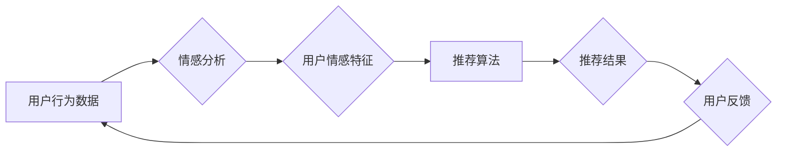

> 情感计算，推荐系统，自然语言处理，机器学习，深度学习，用户体验

## 1. 背景介绍

在当今数据爆炸的时代，推荐系统已成为互联网应用的核心组成部分，从电商平台的商品推荐到视频网站的影视推荐，无处不在。传统的推荐系统主要基于用户的历史行为数据，如浏览记录、购买记录等，但这种方法存在局限性，无法充分挖掘用户潜在需求和情感偏好。

随着人工智能技术的快速发展，情感计算逐渐成为推荐系统的重要研究方向。情感计算旨在理解和分析人类的情感表达，并将其应用于各种场景，例如情感分析、情感识别、情感分类等。将情感计算与推荐系统相结合，可以更深入地理解用户的需求，提供更加个性化、精准的推荐，从而提升用户体验。

## 2. 核心概念与联系

**2.1 情感计算与推荐系统的融合**

情感计算的核心是理解和分析人类的情感表达，而推荐系统旨在根据用户的兴趣和偏好提供个性化的内容推荐。将两者融合，可以实现以下目标：

* **更精准的推荐：** 通过分析用户的评论、反馈等情感信息，可以更准确地了解用户的喜好和需求，从而提供更精准的推荐。
* **个性化的体验：** 不同用户的情绪状态会影响他们的选择，情感驱动推荐可以根据用户的实时情绪状态，提供更符合其当前需求的推荐。
* **增强用户粘性：** 通过提供更符合用户情感需求的推荐，可以增强用户的参与度和粘性，提升用户体验。

**2.2  情感分析与推荐系统架构**

情感分析是情感计算的关键技术之一，它可以识别文本、语音等数据中的情感倾向，并将其分类为正向、负向或中性。情感分析结果可以作为推荐系统的输入，帮助系统更好地理解用户的需求。

**Mermaid 流程图**



## 3. 核心算法原理 & 具体操作步骤

**3.1 算法原理概述**

情感驱动推荐算法通常基于机器学习或深度学习技术，通过训练模型来学习用户情感特征与推荐内容之间的关系。常见的算法包括：

* **基于规则的推荐算法：** 这种算法基于预先定义的规则，例如，如果用户评论中包含“喜欢”等积极词汇，则认为用户对该内容有兴趣。
* **基于内容的推荐算法：** 这种算法根据内容的主题、标签等特征，推荐与用户兴趣相符的内容。
* **基于协同过滤的推荐算法：** 这种算法根据用户的历史行为数据，找到与用户兴趣相似的其他用户，并推荐他们喜欢的内容。
* **深度学习推荐算法：** 这种算法利用深度神经网络，学习用户情感特征和内容特征之间的复杂关系，提供更精准的推荐。

**3.2 算法步骤详解**

1. **数据收集与预处理：** 收集用户行为数据、文本评论等数据，并进行清洗、预处理，例如去除停用词、标点符号等。
2. **情感分析：** 使用情感分析模型，对文本数据进行情感分类，提取用户情感特征。
3. **特征工程：** 将用户情感特征、内容特征等信息进行融合，构建特征向量。
4. **模型训练：** 使用机器学习或深度学习算法，训练推荐模型，学习用户情感特征与推荐内容之间的关系。
5. **推荐结果生成：** 根据用户的当前情感状态和特征向量，预测用户对不同内容的兴趣，生成推荐结果。
6. **结果评估：** 使用指标如点击率、转化率等，评估推荐系统的性能。

**3.3 算法优缺点**

* **优点：**
    * 可以更精准地理解用户的需求，提供个性化推荐。
    * 可以根据用户的实时情绪状态，提供更符合其当前需求的推荐。
    * 可以增强用户的参与度和粘性，提升用户体验。
* **缺点：**
    * 情感分析技术仍存在一定的局限性，难以准确识别复杂的情感表达。
    * 需要大量的用户数据进行训练，才能获得较好的推荐效果。
    * 需要考虑用户隐私保护问题。

**3.4 算法应用领域**

情感驱动推荐算法在以下领域具有广泛的应用前景：

* **电商平台：** 根据用户的购物偏好和情绪状态，推荐个性化的商品。
* **视频网站：** 根据用户的观看历史和情绪状态，推荐个性化的视频内容。
* **社交媒体：** 根据用户的社交行为和情绪状态，推荐个性化的朋友和内容。
* **教育平台：** 根据学生的学习进度和情绪状态，推荐个性化的学习资源。

## 4. 数学模型和公式 & 详细讲解 & 举例说明

**4.1 数学模型构建**

情感驱动推荐系统可以构建一个数学模型，将用户情感特征、内容特征和推荐结果进行关联。

**用户情感特征向量：**

$$
u = (u_1, u_2, ..., u_n)
$$

其中，$u_i$ 表示用户对第 $i$ 种情感类型的强度。

**内容特征向量：**

$$
c = (c_1, c_2, ..., c_m)
$$

其中，$c_j$ 表示内容第 $j$ 种特征的强度。

**推荐得分：**

$$
score(u, c) = w_1 * u_1 * c_1 + w_2 * u_2 * c_2 + ... + w_n * u_n * c_n
$$

其中，$w_i$ 是权重系数，表示用户对第 $i$ 种情感类型的敏感度。

**4.2 公式推导过程**

推荐得分公式的推导过程基于以下假设：

* 用户对不同情感类型的敏感度不同。
* 内容的特征与用户的情感特征相关。

通过最小化推荐误差，可以学习到最佳的权重系数。

**4.3 案例分析与讲解**

假设用户对“快乐”的情感类型敏感度较高，而对“悲伤”的情感类型敏感度较低。如果推荐的内容包含“快乐”相关的特征，则推荐得分会较高，反之则较低。

## 5. 项目实践：代码实例和详细解释说明

**5.1 开发环境搭建**

* Python 3.x
* TensorFlow 或 PyTorch
* NLTK 或 spaCy

**5.2 源代码详细实现**

```python
import tensorflow as tf

# 定义模型结构
model = tf.keras.Sequential([
    tf.keras.layers.Embedding(input_dim=vocab_size, output_dim=embedding_dim),
    tf.keras.layers.LSTM(units=128),
    tf.keras.layers.Dense(units=1, activation='sigmoid')
])

# 编译模型
model.compile(optimizer='adam', loss='binary_crossentropy', metrics=['accuracy'])

# 训练模型
model.fit(X_train, y_train, epochs=10)

# 预测推荐结果
predictions = model.predict(X_test)
```

**5.3 代码解读与分析**

* 使用 Embedding 层将文本数据转换为向量表示。
* 使用 LSTM 层学习用户情感特征和内容特征之间的关系。
* 使用 Dense 层输出推荐得分。

**5.4 运行结果展示**

通过训练模型并测试其性能，可以评估情感驱动推荐系统的效果。

## 6. 实际应用场景

**6.1 电商平台**

* 根据用户的购物历史和评论情感，推荐个性化的商品。
* 在商品详情页展示用户对该商品的情感评价，帮助用户做出更明智的购买决策。

**6.2 视频网站**

* 根据用户的观看历史和情绪状态，推荐个性化的视频内容。
* 在视频播放过程中，根据用户的实时情绪状态，调整视频的播放速度或音量。

**6.3 社交媒体**

* 根据用户的社交行为和情绪状态，推荐个性化的朋友和内容。
* 在用户发布内容时，提供情感分析建议，帮助用户表达自己的情绪。

**6.4 未来应用展望**

* 情感驱动推荐系统将更加智能化，能够更准确地理解用户的需求和情感。
* 情感驱动推荐系统将更加个性化，能够根据用户的不同场景和需求提供个性化的推荐。
* 情感驱动推荐系统将更加安全可靠，能够更好地保护用户的隐私。

## 7. 工具和资源推荐

**7.1 学习资源推荐**

* **书籍：**
    * 《情感计算》
    * 《深度学习》
* **在线课程：**
    * Coursera 上的“情感分析”课程
    * edX 上的“机器学习”课程

**7.2 开发工具推荐**

* **Python：** 
    * TensorFlow
    * PyTorch
* **自然语言处理库：**
    * NLTK
    * spaCy

**7.3 相关论文推荐**

* “情感驱动推荐系统”
* “基于深度学习的情感分析”

## 8. 总结：未来发展趋势与挑战

**8.1 研究成果总结**

情感驱动推荐系统已取得了一定的进展，能够提供更加个性化、精准的推荐，提升用户体验。

**8.2 未来发展趋势**

* 情感分析技术的进步将使情感驱动推荐系统更加智能化。
* 多模态情感分析将成为未来发展趋势，例如结合文本、语音、图像等多模态数据进行情感分析。
* 情感驱动推荐系统将更加注重用户隐私保护。

**8.3 面临的挑战**

* 情感分析技术仍存在一定的局限性，难以准确识别复杂的情感表达。
* 需要大量的用户数据进行训练，才能获得较好的推荐效果。
* 需要考虑用户隐私保护问题。

**8.4 研究展望**

未来，情感驱动推荐系统将朝着更加智能化、个性化、安全可靠的方向发展，为用户提供更加优质的体验。

## 9. 附录：常见问题与解答

**9.1 如何评估情感驱动推荐系统的性能？**

常用的评估指标包括点击率、转化率、用户满意度等。

**9.2 如何保护用户隐私？**

情感驱动推荐系统需要对用户数据进行匿名化处理，并遵守相关隐私保护法规。

**9.3 情感驱动推荐系统有哪些应用场景？**

情感驱动推荐系统可以应用于电商平台、视频网站、社交媒体等领域。


作者：禅与计算机程序设计艺术 / Zen and the Art of Computer Programming 
<end_of_turn>