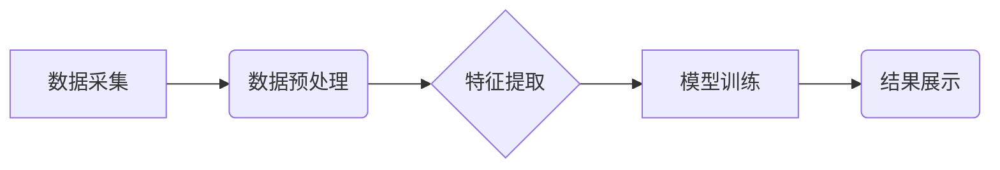

> 搜索引擎, 数据分析, 机器学习, 深度学习, 自然语言处理, 信息检索, 推荐系统

## 1. 背景介绍

在当今数据爆炸的时代，海量数据蕴藏着丰富的价值，而搜索数据分析系统作为挖掘数据价值的关键工具，扮演着越来越重要的角色。传统的搜索引擎主要依靠关键词匹配来检索信息，但随着搜索需求的复杂化，单纯的关键词匹配已难以满足用户需求。

人工智能技术的快速发展为搜索数据分析系统带来了新的机遇。机器学习、深度学习和自然语言处理等人工智能技术能够帮助搜索引擎更深入地理解用户意图，提供更精准、更个性化的搜索结果。

## 2. 核心概念与联系

搜索数据分析系统主要由以下几个核心模块组成：

* **数据采集模块:** 收集来自各种来源的数据，例如网页、文档、社交媒体等。
* **数据预处理模块:** 对采集到的数据进行清洗、转换、格式化等处理，使其能够被后续模块进行分析。
* **特征提取模块:** 从数据中提取关键特征，例如关键词、主题、情感等，为后续的分析提供基础。
* **模型训练模块:** 利用机器学习算法训练模型，例如分类模型、聚类模型、推荐模型等，以实现对数据的分析和预测。
* **结果展示模块:** 将分析结果以可视化、可理解的方式展示给用户。

**核心概念与架构流程图:**



## 3. 核心算法原理 & 具体操作步骤

### 3.1  算法原理概述

搜索数据分析系统中常用的算法包括：

* **关键词匹配算法:** 基于关键词的精确匹配或模糊匹配来检索信息。
* **TF-IDF算法:** 计算关键词在文档中出现的频率和重要性，用于衡量关键词的权重。
* **PageRank算法:** 评估网页的重要性，用于排序搜索结果。
* **聚类算法:** 将数据按照相似性进行分组，用于发现数据中的潜在结构。
* **推荐算法:** 基于用户历史行为和数据特征，推荐用户可能感兴趣的内容。

### 3.2  算法步骤详解

以TF-IDF算法为例，其具体步骤如下：

1. **计算词频(Term Frequency, TF):** 统计每个关键词在文档中出现的次数。
2. **计算逆向文档频率(Inverse Document Frequency, IDF):** 计算每个关键词在整个语料库中出现的频率，IDF值越高，关键词越独特。
3. **计算TF-IDF值:** 将TF值和IDF值相乘，得到每个关键词在文档中的权重。
4. **排序结果:** 根据TF-IDF值对文档进行排序，将TF-IDF值最高的文档排在前面。

### 3.3  算法优缺点

**TF-IDF算法的优点:**

* 计算简单，易于实现。
* 可以有效地衡量关键词的权重。

**TF-IDF算法的缺点:**

* 无法考虑关键词之间的语义关系。
* 对长尾关键词的处理效果较差。

### 3.4  算法应用领域

TF-IDF算法广泛应用于信息检索、文本分类、文档聚类等领域。

## 4. 数学模型和公式 & 详细讲解 & 举例说明

### 4.1  数学模型构建

TF-IDF算法的数学模型如下：

```latex
TF-IDF(t, d) = TF(t, d) * IDF(t)
```

其中：

* $TF(t, d)$ 表示关键词 $t$ 在文档 $d$ 中的词频。
* $IDF(t)$ 表示关键词 $t$ 在整个语料库中的逆向文档频率。

### 4.2  公式推导过程

* **词频计算:**

```latex
TF(t, d) = \frac{f(t, d)}{\sum_{t' \in d} f(t', d)}
```

其中：

* $f(t, d)$ 表示关键词 $t$ 在文档 $d$ 中出现的次数。
* $\sum_{t' \in d} f(t', d)$ 表示文档 $d$ 中所有关键词出现的总次数。

* **逆向文档频率计算:**

```latex
IDF(t) = log_e \frac{N}{df(t)}
```

其中：

* $N$ 表示语料库中文档总数。
* $df(t)$ 表示关键词 $t$ 在语料库中出现的文档数。

### 4.3  案例分析与讲解

假设有一个语料库包含1000篇文档，其中关键词“人工智能”出现在50篇文档中。则关键词“人工智能”的IDF值为：

```latex
IDF("人工智能") = log_e \frac{1000}{50} = log_e 20 \approx 2.996
```

## 5. 项目实践：代码实例和详细解释说明

### 5.1  开发环境搭建

本项目使用Python语言进行开发，所需环境如下：

* Python 3.x
* NLTK自然语言处理库
* Scikit-learn机器学习库

### 5.2  源代码详细实现

```python
import nltk
from sklearn.feature_extraction.text import TfidfVectorizer

# 数据集
documents = [
    "人工智能是未来发展的重要方向",
    "深度学习是人工智能的重要分支",
    "自然语言处理是人工智能的核心领域",
]

# 初始化TF-IDF向量化器
vectorizer = TfidfVectorizer()

# 将文本数据转换为TF-IDF矩阵
tfidf_matrix = vectorizer.fit_transform(documents)

# 打印TF-IDF矩阵
print(tfidf_matrix.toarray())
```

### 5.3  代码解读与分析

* `nltk`库用于文本预处理，例如分词、词干提取等。
* `TfidfVectorizer`类用于将文本数据转换为TF-IDF矩阵。
* `fit_transform()`方法用于同时训练模型和转换数据。
* `toarray()`方法将TF-IDF矩阵转换为NumPy数组，方便打印和分析。

### 5.4  运行结果展示

运行上述代码后，将输出一个TF-IDF矩阵，其中每个行代表一个文档，每个列代表一个关键词，矩阵元素表示关键词在文档中的权重。

## 6. 实际应用场景

搜索数据分析系统在各个领域都有广泛的应用场景：

* **搜索引擎优化(SEO):** 分析关键词的搜索量和竞争程度，帮助网站优化内容和结构，提高搜索排名。
* **市场调研:** 分析用户搜索行为和偏好，了解市场趋势和消费者需求。
* **内容推荐:** 基于用户历史行为和数据特征，推荐用户可能感兴趣的内容。
* **欺诈检测:** 分析用户行为和数据模式，识别潜在的欺诈行为。

### 6.4  未来应用展望

随着人工智能技术的不断发展，搜索数据分析系统将更加智能化、个性化和精准化。未来，搜索数据分析系统将能够：

* 更深入地理解用户意图，提供更精准的搜索结果。
* 提供更个性化的搜索体验，例如根据用户兴趣和历史行为推荐相关内容。
* 自动生成高质量的搜索结果摘要和问答。
* 帮助用户发现隐藏的知识和洞察。

## 7. 工具和资源推荐

### 7.1  学习资源推荐

* **书籍:**
    * 《信息检索》
    * 《自然语言处理》
    * 《机器学习》
* **在线课程:**
    * Coursera: 自然语言处理
    * edX: 信息检索
    * Udacity: 机器学习工程师

### 7.2  开发工具推荐

* **Python:** 
    * NLTK
    * Scikit-learn
    * Gensim
* **Elasticsearch:** 
    * 基于Lucene的开源搜索引擎
* **Solr:** 
    * 基于Java的开源搜索引擎

### 7.3  相关论文推荐

* **TF-IDF算法:**
    * Robertson, S. E., & Zaragoza, H. (2009). The tf-idf weighting scheme. In Foundations of information retrieval (pp. 101-114). Springer, Berlin, Heidelberg.
* **PageRank算法:**
    * Brin, S., & Page, L. (1998). The anatomy of a large-scale hypertextual web search engine. Computer networks and ISDN systems, 30(1-7), 107-117.

## 8. 总结：未来发展趋势与挑战

### 8.1  研究成果总结

搜索数据分析系统已取得了显著的成果，能够有效地帮助用户获取信息、发现知识和做出决策。

### 8.2  未来发展趋势

未来搜索数据分析系统将朝着以下方向发展：

* **更智能化:** 利用深度学习等人工智能技术，更深入地理解用户意图，提供更精准的搜索结果。
* **更个性化:** 基于用户历史行为和数据特征，提供更个性化的搜索体验。
* **更交互式:** 支持用户与搜索引擎进行交互，例如语音搜索、图像搜索等。

### 8.3  面临的挑战

搜索数据分析系统也面临着一些挑战：

* **数据质量:** 搜索数据质量直接影响搜索结果的准确性，需要不断改进数据采集、清洗和预处理技术。
* **算法复杂度:** 随着搜索需求的复杂化，算法模型也需要更加复杂，这会带来计算资源和开发成本的增加。
* **隐私保护:** 搜索数据包含大量用户隐私信息，需要采取有效的措施保护用户隐私。

### 8.4  研究展望

未来，搜索数据分析系统将继续是一个重要的研究方向，需要不断探索新的算法、技术和应用场景，以更好地服务于用户和社会。

## 9. 附录：常见问题与解答

* **什么是TF-IDF算法?**

TF-IDF算法是一种用于衡量关键词重要性的算法，它将关键词在文档中出现的频率和在整个语料库中出现的频率相结合，以计算关键词的权重。

* **如何使用TF-IDF算法进行文本分类?**

可以使用TF-IDF算法将文本数据转换为特征向量，然后使用机器学习算法进行文本分类。

* **搜索数据分析系统有哪些应用场景?**

搜索数据分析系统在各个领域都有广泛的应用场景，例如搜索引擎优化、市场调研、内容推荐、欺诈检测等。


作者：禅与计算机程序设计艺术 / Zen and the Art of Computer Programming 
<end_of_turn>