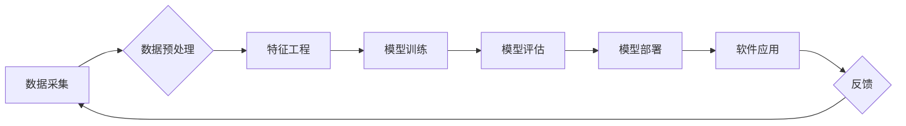

> 数据偏差、软件伦理、人工智能、公平性、可解释性、透明度、责任

## 1. 背景介绍

软件已经深刻地融入到我们生活的方方面面，从智能手机到自动驾驶汽车，再到医疗诊断和金融交易，软件无处不在。随着人工智能技术的飞速发展，软件正在朝着更加智能、自动化和自主化的方向演进。然而，在软件的快速发展过程中，一个不容忽视的问题逐渐浮出水面：数据偏差。

数据偏差是指训练机器学习模型的数据中存在偏见或不完整性，导致模型在预测或决策时产生不公平、不准确甚至有害的结果。这种偏差可能源于数据采集、处理、标注等各个环节，并可能反映社会中存在的各种偏见和歧视。

数据偏差的危害不容小觑。它不仅可能导致软件系统产生不公平的结果，损害用户的利益，甚至加剧社会不平等，还会损害软件系统的可信度和安全性。因此，解决数据偏差问题，构建更加公平、可信和安全的软件系统，已成为当今软件开发领域的一项重要课题。

## 2. 核心概念与联系

**2.1 数据偏差的类型**

数据偏差可以分为多种类型，包括：

* **样本偏差:** 训练数据样本不代表总体分布，导致模型对总体预测不准确。
* **特征偏差:** 特征选择不全面或存在偏见，导致模型对某些特征过度依赖或忽略重要特征。
* **标签偏差:** 标签标注不准确或存在偏见，导致模型学习到错误的映射关系。
* **认知偏差:** 开发者或标注人员的认知偏见影响数据采集、处理和标注，导致数据本身存在偏差。

**2.2 数据偏差的影响**

数据偏差可能导致以下一系列问题：

* **不公平性:** 模型对不同群体产生不同的预测结果，导致不公平的待遇或机会分配。
* **不准确性:** 模型的预测结果不准确，导致错误的决策或行动。
* **不可解释性:** 模型的决策过程难以理解，导致缺乏信任和可控性。
* **安全性:** 数据偏差可能被恶意利用，导致软件系统出现安全漏洞或被攻击。

**2.3 软件伦理与数据偏差**

软件伦理是指在软件开发和应用过程中，遵循道德规范、社会责任和人类利益的原则。数据偏差与软件伦理密切相关，因为数据偏差可能导致软件系统产生不公平、不准确甚至有害的结果，违背了软件伦理的基本原则。

**Mermaid 流程图**



## 3. 核心算法原理 & 具体操作步骤

**3.1 算法原理概述**

为了解决数据偏差问题，需要采用相应的算法和技术手段进行数据清洗、特征工程和模型训练。常见的算法包括：

* **数据清洗算法:** 用于识别和处理数据中的缺失值、异常值和重复值。
* **特征工程算法:** 用于选择、转换和生成特征，以减少数据偏差的影响。
* **公平性算法:** 用于在模型训练过程中，确保模型对不同群体产生公平的预测结果。

**3.2 算法步骤详解**

**数据清洗:**

1. 识别数据中的缺失值、异常值和重复值。
2. 根据具体情况选择合适的处理方法，例如删除、填充或替换。

**特征工程:**

1. 选择与目标变量相关的特征。
2. 对特征进行转换和生成，例如标准化、归一化、聚合和组合。
3. 使用特征选择算法，选择最优的特征集。

**公平性算法:**

1. 定义公平性指标，例如均等机会、差异化公平和群体公平。
2. 在模型训练过程中，使用公平性约束条件，例如正则化项或目标函数调整。
3. 评估模型的公平性，并根据结果进行调整。

**3.3 算法优缺点**

**数据清洗算法:**

* **优点:** 可以有效地处理数据中的噪声和错误。
* **缺点:** 可能导致数据信息丢失。

**特征工程算法:**

* **优点:** 可以提高模型的预测精度和鲁棒性。
* **缺点:** 需要专业知识和经验。

**公平性算法:**

* **优点:** 可以确保模型的公平性。
* **缺点:** 可能降低模型的预测精度。

**3.4 算法应用领域**

数据清洗、特征工程和公平性算法广泛应用于各个领域，例如：

* **金融:** 贷款审批、欺诈检测、风险管理。
* **医疗:** 疾病诊断、药物研发、患者分层。
* **教育:** 学生评估、个性化学习、招生录取。
* **司法:** 罪犯判决、风险评估、法律咨询。

## 4. 数学模型和公式 & 详细讲解 & 举例说明

**4.1 数学模型构建**

假设我们有一个分类问题，目标是预测样本属于某个类别。我们可以使用逻辑回归模型来进行预测。逻辑回归模型的数学模型如下：

$$
P(y=1|x) = \frac{1}{1 + e^{-(w^T x + b)}}
$$

其中：

* $P(y=1|x)$ 是样本 $x$ 属于类别 1 的概率。
* $w$ 是模型参数向量。
* $x$ 是样本特征向量。
* $b$ 是模型偏置项。

**4.2 公式推导过程**

逻辑回归模型的损失函数是交叉熵损失函数，其表达式如下：

$$
L(w,b) = -\frac{1}{N} \sum_{i=1}^{N} y_i \log(P(y_i=1|x_i)) + (1-y_i) \log(1-P(y_i=1|x_i))
$$

其中：

* $N$ 是样本数量。
* $y_i$ 是第 $i$ 个样本的真实类别标签。

通过梯度下降算法，可以求解出模型参数 $w$ 和 $b$，使得损失函数最小化。

**4.3 案例分析与讲解**

假设我们有一个数据集，用于预测客户是否会购买某个产品。我们可以使用逻辑回归模型进行预测。

* 特征包括客户的年龄、收入、购买历史等。
* 标签是客户是否购买了产品。

通过训练逻辑回归模型，我们可以得到模型参数 $w$ 和 $b$。然后，我们可以使用这些参数对新的客户进行预测，判断他们是否会购买产品。

## 5. 项目实践：代码实例和详细解释说明

**5.1 开发环境搭建**

* 操作系统: Ubuntu 20.04
* Python 版本: 3.8
* 必要的库: scikit-learn, pandas, numpy

**5.2 源代码详细实现**

```python
import pandas as pd
from sklearn.model_selection import train_test_split
from sklearn.linear_model import LogisticRegression
from sklearn.metrics import accuracy_score

# 加载数据
data = pd.read_csv('customer_data.csv')

# 分割数据
X = data.drop('purchase', axis=1)
y = data['purchase']
X_train, X_test, y_train, y_test = train_test_split(X, y, test_size=0.2, random_state=42)

# 训练模型
model = LogisticRegression()
model.fit(X_train, y_train)

# 预测结果
y_pred = model.predict(X_test)

# 评估模型
accuracy = accuracy_score(y_test, y_pred)
print(f'模型准确率: {accuracy}')
```

**5.3 代码解读与分析**

* 首先，我们加载数据并将其分割成训练集和测试集。
* 然后，我们使用逻辑回归模型训练模型。
* 最后，我们使用训练好的模型对测试集进行预测，并计算模型的准确率。

**5.4 运行结果展示**

运行上述代码后，我们可以得到模型的准确率。

## 6. 实际应用场景

数据偏差问题在各个领域都有广泛的应用场景，例如：

* **金融领域:** 贷款审批系统可能存在种族或性别偏见，导致某些群体难以获得贷款。
* **医疗领域:** 疾病诊断系统可能存在医疗资源分配不均导致的偏见，导致某些群体难以获得准确的诊断。
* **司法领域:** 罪犯判决系统可能存在社会偏见，导致某些群体更容易受到严厉的判决。

## 7. 工具和资源推荐

**7.1 学习资源推荐**

* **书籍:**
    * "Weapons of Math Destruction: How Big Data Increases Inequality and Threatens Democracy" by Cathy O'Neil
    * "Fairness and Machine Learning" by  Sarah M. Bender, Timnit Gebru, Angelina McMillan-Major, and Margaret Mitchell
* **在线课程:**
    * Coursera: "Machine Learning Fairness"
    * edX: "Algorithms for Fairness"

**7.2 开发工具推荐**

* **AIF360:** 一个开源工具包，用于评估和缓解机器学习模型中的公平性问题。
* **Fairlearn:** 一个Python库，用于公平性算法的开发和评估。

**7.3 相关论文推荐**

* "On the Dangers of Stochastic Parrots: Can Language Models Be Too Big?" by Emily M. Bender, Timnit Gebru, Angelina McMillan-Major, and Margaret Mitchell
* "Mitigating Bias in Machine Learning" by  Arvind Narayanan and Vitaly Shmatikov

## 8. 总结：未来发展趋势与挑战

**8.1 研究成果总结**

近年来，数据偏差问题在机器学习领域引起了广泛关注，并取得了一系列研究成果。

* 已经开发出多种算法和技术，用于识别和缓解数据偏差问题。
* 出现了许多开源工具和资源，用于评估和缓解机器学习模型中的公平性问题。

**8.2 未来发展趋势**

* **更加注重数据质量:** 提高数据采集、处理和标注的质量，减少数据偏差的产生。
* **开发更加鲁棒的算法:** 开发能够更好地应对数据偏差的算法，提高模型的公平性和准确性。
* **加强伦理规范:** 制定更加完善的软件伦理规范，指导软件开发和应用过程。

**8.3 面临的挑战**

* 数据偏差问题是一个复杂的问题，难以完全解决。
* 缺乏统一的公平性标准，难以评估和比较不同算法的公平性。
* 数据隐私保护与公平性之间存在冲突，需要找到平衡点。

**8.4 研究展望**

未来，需要继续深入研究数据偏差问题，开发更加有效的算法和技术，并加强与社会各界的合作，共同构建更加公平、可信和安全的软件系统。

## 9. 附录：常见问题与解答

**Q1: 如何识别数据偏差？**

**A1:** 可以通过分析数据分布、特征相关性、模型预测结果等方面识别数据偏差。

**Q2: 如何缓解数据偏差？**

**A2:** 可以采用数据清洗、特征工程、公平性算法等方法缓解数据偏差。

**Q3: 如何评估模型的公平性？**

**A3:** 可以使用公平性指标，例如均等机会、差异化公平和群体公平，评估模型的公平性。

作者：禅与计算机程序设计艺术 / Zen and the Art of Computer Programming


<end_of_turn>