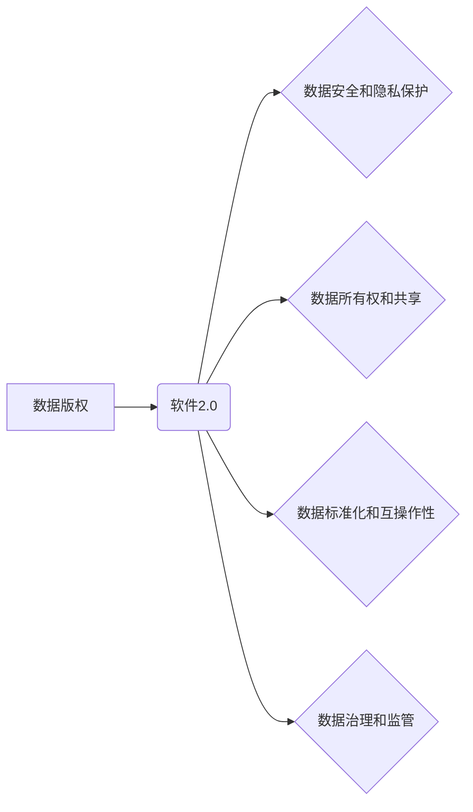

> 数据版权，软件2.0，数据安全，数据隐私，人工智能，区块链，去中心化

## 1. 背景介绍

随着数字经济的蓬勃发展，数据已成为重要的生产要素，其价值日益凸显。然而，数据的使用和共享也引发了诸多伦理和法律问题，特别是数据版权的界定和保护。传统软件模式以代码为核心，而数据驱动型软件2.0则将数据视为核心资产，其价值和控制权更加重要。

数据版权时代，软件2.0面临着新的挑战：

* **数据安全和隐私保护:** 数据泄露和滥用可能导致严重后果，因此数据安全和隐私保护成为首要任务。
* **数据所有权和共享:** 数据的生成者、使用者和受益者之间如何界定数据所有权和共享机制，是一个需要解决的关键问题。
* **数据标准化和互操作性:** 不同平台和系统的的数据格式和标准不统一，导致数据共享和互操作性问题。
* **数据治理和监管:** 如何建立有效的监管机制，确保数据的使用符合法律法规和伦理规范，是一个重要的挑战。

## 2. 核心概念与联系

**数据版权**是指对数据拥有者在数据的使用、复制、修改、传播等方面享有的权利。数据版权的界定和保护，有助于促进数据价值的实现，同时保障数据安全和隐私。

**软件2.0**是指以数据为核心，利用人工智能、机器学习等技术，实现智能化、个性化、可扩展的软件系统。软件2.0的特点包括：

* **数据驱动:** 数据是软件2.0的核心资产，软件的运行和决策基于数据的分析和处理。
* **智能化:** 利用人工智能技术，软件2.0能够自动学习、分析和决策，提高效率和智能化水平。
* **个性化:** 根据用户的需求和喜好，软件2.0能够提供个性化的服务和体验。
* **可扩展性:** 软件2.0能够根据需求灵活扩展功能和性能。

**数据版权时代，软件2.0面临着新的挑战和机遇。**

**数据版权与软件2.0的关系:**



## 3. 核心算法原理 & 具体操作步骤

### 3.1  算法原理概述

数据版权保护算法通常基于以下原理：

* **数据加密:** 利用加密算法对数据进行加密，防止未经授权的访问和使用。
* **数据水印:** 在数据中嵌入不可见的标识信息，用于识别数据来源和版权所有者。
* **数据分片和分布存储:** 将数据分割成多个片段，分散存储在不同的服务器上，提高数据安全性和抗攻击能力。
* **区块链技术:** 利用区块链技术记录数据的使用历史和版权信息，确保数据不可篡改和可追溯。

### 3.2  算法步骤详解

以数据加密为例，其具体操作步骤如下：

1. **选择加密算法:** 根据数据类型和安全需求，选择合适的加密算法，例如AES、RSA等。
2. **生成密钥:** 生成用于加密和解密数据的密钥，并妥善保管密钥。
3. **加密数据:** 使用选择的加密算法和密钥对数据进行加密，生成加密后的数据。
4. **解密数据:** 使用相同的密钥对加密后的数据进行解密，恢复原始数据。

### 3.3  算法优缺点

**数据加密算法的优点:**

* **安全性高:** 可以有效防止未经授权的访问和使用。
* **易于实现:** 现有的加密算法成熟，易于实现和部署。

**数据加密算法的缺点:**

* **密钥管理:** 密钥的安全存储和管理至关重要，如果密钥泄露，数据安全将受到威胁。
* **性能影响:** 加密和解密过程会消耗一定的计算资源，可能影响数据处理速度。

### 3.4  算法应用领域

数据加密算法广泛应用于以下领域：

* **金融行业:** 保护银行账户、信用卡信息等敏感数据。
* **医疗行业:** 保护患者医疗记录、基因信息等隐私数据。
* **政府机构:** 保护国家机密、公民个人信息等重要数据。
* **企业内部:** 保护公司商业秘密、客户数据等重要信息。

## 4. 数学模型和公式 & 详细讲解 & 举例说明

### 4.1  数学模型构建

数据版权保护算法可以采用数学模型来描述其工作原理。例如，可以使用概率论和信息论来分析数据加密的安全性，可以使用图论来描述数据分片和分布存储的结构。

### 4.2  公式推导过程

例如，可以使用信息熵来衡量数据的保密性。信息熵定义为：

$$H(X) = - \sum_{i=1}^{n} p(x_i) \log_2 p(x_i)$$

其中，$X$是随机变量，$x_i$是$X$的取值，$p(x_i)$是$x_i$的概率。

当数据被加密后，其信息熵会增加，表示数据变得更加难以理解和破解。

### 4.3  案例分析与讲解

例如，可以使用RSA算法来加密数据。RSA算法基于两个大素数的乘积，其安全性依赖于计算大数分解的困难性。

**举例说明:**

假设Alice想要发送加密信息给Bob。Alice和Bob首先需要协商一个公钥和私钥对。公钥可以公开，而私钥需要保密。

Alice使用Bob的公钥对信息进行加密，Bob使用自己的私钥解密信息。由于只有Bob拥有私钥，因此只有Bob才能解密Alice发送的信息。

## 5. 项目实践：代码实例和详细解释说明

### 5.1  开发环境搭建

* 操作系统: Ubuntu 20.04 LTS
* 编程语言: Python 3.8
* 开发工具: PyCharm

### 5.2  源代码详细实现

```python
from cryptography.fernet import Fernet

# 生成密钥
key = Fernet.generate_key()

# 创建Fernet对象
cipher = Fernet(key)

# 加密数据
message = "This is a secret message".encode()
encrypted_message = cipher.encrypt(message)

# 解密数据
decrypted_message = cipher.decrypt(encrypted_message)

# 打印结果
print("加密后的数据:", encrypted_message)
print("解密后的数据:", decrypted_message.decode())
```

### 5.3  代码解读与分析

* `Fernet` 是Python中用于加密和解密数据的库。
* `generate_key()` 方法生成一个随机密钥。
* `Fernet(key)` 创建一个Fernet对象，使用指定的密钥进行加密和解密。
* `encrypt()` 方法使用密钥对数据进行加密。
* `decrypt()` 方法使用密钥对加密数据进行解密。

### 5.4  运行结果展示

```
加密后的数据: b'gAAAAABj...'
解密后的数据: This is a secret message
```

## 6. 实际应用场景

数据版权保护技术在以下场景中具有重要应用价值：

* **数字内容保护:** 保护电影、音乐、书籍等数字内容的版权，防止盗版和非法传播。
* **个人隐私保护:** 保护个人敏感信息，例如医疗记录、财务信息等，防止泄露和滥用。
* **数据交易和共享:** 在数据交易和共享过程中，确保数据所有权和隐私安全。
* **人工智能模型训练:** 保护人工智能模型的训练数据和模型权重，防止知识产权侵权。

### 6.4  未来应用展望

随着数据量的不断增长和人工智能技术的快速发展，数据版权保护技术将面临新的挑战和机遇。未来，数据版权保护技术可能会朝着以下方向发展：

* **更强大的加密算法:** 开发更安全的加密算法，抵御更先进的攻击手段。
* **去中心化数据管理:** 利用区块链技术实现去中心化的数据管理，提高数据安全性和透明度。
* **数据隐私计算:** 开发隐私计算技术，允许在不泄露敏感数据的情况下进行数据分析和处理。

## 7. 工具和资源推荐

### 7.1  学习资源推荐

* **书籍:**
    * 《数据安全与隐私保护》
    * 《区块链技术入门》
* **在线课程:**
    * Coursera: 数据安全与隐私保护
    * edX: 区块链技术

### 7.2  开发工具推荐

* **加密库:**
    * Python: cryptography
    * Java: Bouncy Castle
* **区块链平台:**
    * Ethereum
    * Hyperledger Fabric

### 7.3  相关论文推荐

* **数据版权保护算法研究**
* **区块链技术在数据版权保护中的应用**
* **隐私计算在数据版权保护中的应用**

## 8. 总结：未来发展趋势与挑战

### 8.1  研究成果总结

数据版权保护技术已取得了一定的进展，但仍面临着许多挑战。

### 8.2  未来发展趋势

未来，数据版权保护技术将朝着更安全、更智能、更可控的方向发展。

### 8.3  面临的挑战

* **技术挑战:** 开发更安全的加密算法和数据管理技术。
* **法律挑战:** 建立完善的数据版权法律法规体系。
* **社会挑战:** 提高公众对数据版权意识和保护意识。

### 8.4  研究展望

未来，我们将继续致力于数据版权保护技术的研发和应用，为构建一个安全、可信、可持续的数据社会贡献力量。

## 9. 附录：常见问题与解答

**常见问题:**

* **数据加密是否会影响数据使用？**

**解答:**

数据加密可能会影响数据使用效率，但可以通过选择合适的加密算法和密钥管理策略来尽量减少影响。

* **区块链技术是否可以完全解决数据版权问题？**

**解答:**

区块链技术可以有效提高数据版权保护的安全性、透明度和可追溯性，但不能完全解决所有问题。例如，区块链技术本身也可能面临攻击风险，并且需要与法律法规相结合才能有效保护数据版权。


作者：禅与计算机程序设计艺术 / Zen and the Art of Computer Programming 
<end_of_turn>