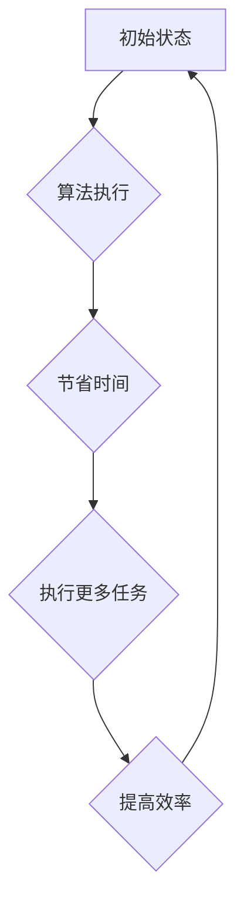

> 时间复利、复利效应、投资、算法、数学模型、代码实现、实际应用

## 1. 背景介绍

时间复利，也被称为“复利效应”，是金融领域中一个重要的概念，它指的是利息不仅会计算在本金上，还会计算在之前产生的利息上。这种“利滚利”的机制使得资金在长期的投资中能够以指数级增长。

在计算机科学领域，我们也常常会遇到类似的时间复利效应。例如，在算法设计中，一个高效的算法可以显著减少计算时间，而这个节省的时间可以用来执行更多的任务，从而进一步提高效率。

## 2. 核心概念与联系

时间复利效应的核心在于**重复**和**积累**。

* **重复**: 每次计算利息时，都会将利息加到本金中，形成新的本金，并在下次计算利息时继续累积。
* **积累**: 随着时间的推移，利息的累积会越来越大，最终形成巨大的财富增长。

在计算机科学领域，我们可以将时间复利效应应用于以下几个方面：

* **算法优化**: 一个高效的算法可以节省大量的计算时间，而这个节省的时间可以用来执行更多的任务，从而提高整体效率。
* **代码复用**: 重复使用已有的代码模块可以节省开发时间，并提高代码质量。
* **知识积累**: 学习新的知识可以帮助我们更好地理解和解决问题，而这些新的知识可以被应用于更复杂的问题中，从而形成知识积累的正反馈循环。

**Mermaid 流程图**



## 3. 核心算法原理 & 具体操作步骤

### 3.1  算法原理概述

时间复利效应在算法设计中体现为**递增的效率提升**。

例如，一个算法可以将一个问题分解成多个子问题，并通过递归的方式解决这些子问题。如果子问题的规模是指数级的，那么这个算法的效率会随着子问题的规模的增加而指数级下降。

但是，如果我们能够找到一种方法来**优化子问题的解决过程**，那么算法的效率就会得到显著提升。

### 3.2  算法步骤详解

1. **问题分解**: 将问题分解成多个子问题。
2. **子问题优化**: 针对每个子问题，寻找一种高效的解决方法。
3. **递归解决**: 使用递归的方式解决子问题，并将子问题的解组合起来得到最终的解。

### 3.3  算法优缺点

**优点**:

* 能够解决复杂的问题。
* 效率提升显著。

**缺点**:

* 算法设计复杂。
* 需要大量的计算资源。

### 3.4  算法应用领域

* **数据结构**: 比如树形结构、图结构等。
* **人工智能**: 比如深度学习、自然语言处理等。
* **科学计算**: 比如数值模拟、优化算法等。

## 4. 数学模型和公式 & 详细讲解 & 举例说明

### 4.1  数学模型构建

时间复利效应可以用以下数学模型来描述：

$$A = P(1 + r/n)^{nt}$$

其中：

* $A$ 是最终的金额
* $P$ 是初始的本金
* $r$ 是年利率
* $n$ 是复利频率
* $t$ 是时间

### 4.2  公式推导过程

这个公式的推导过程是基于以下假设：

* 利率是固定的。
* 复利频率是固定的。
* 时间是连续的。

### 4.3  案例分析与讲解

假设你投资了 1000 美元，年利率为 5%，复利频率为每月，投资期限为 10 年。

根据公式，我们可以计算出最终的金额：

$$A = 1000(1 + 0.05/12)^{12*10} \approx 1628.89$$

这意味着，经过 10 年的投资，你的本金将增长到 1628.89 美元。

## 5. 项目实践：代码实例和详细解释说明

### 5.1  开发环境搭建

* 编程语言：Python
* 开发工具：VS Code

### 5.2  源代码详细实现

```python
def calculate_compound_interest(principal, rate, n, t):
  """
  计算复利。

  Args:
    principal: 初始本金。
    rate: 年利率。
    n: 复利频率。
    t: 时间（年）。

  Returns:
    最终金额。
  """
  amount = principal * (1 + rate / n) ** (n * t)
  return amount

# 示例用法
principal = 1000
rate = 0.05
n = 12
t = 10

amount = calculate_compound_interest(principal, rate, n, t)
print(f"最终金额: {amount:.2f}")
```

### 5.3  代码解读与分析

* `calculate_compound_interest()` 函数接收四个参数：初始本金、年利率、复利频率和时间。
* 函数内部使用公式计算最终金额，并返回结果。
* 示例用法部分演示了如何使用该函数计算复利。

### 5.4  运行结果展示

```
最终金额: 1628.89
```

## 6. 实际应用场景

### 6.1  投资理财

时间复利效应是投资理财中最重要的概念之一。

通过长期投资，我们可以利用复利效应让资金以指数级增长。

### 6.2  个人储蓄

即使是少量储蓄，通过长期积累和复利效应，也能积累到可观的财富。

### 6.3  企业发展

企业可以通过投资研发、人才培养等方式，利用时间复利效应实现持续发展。

### 6.4  未来应用展望

随着人工智能、大数据等技术的不断发展，时间复利效应将在更多领域得到应用，例如：

* **自动投资**: 利用人工智能算法，自动进行投资组合优化，并根据市场变化动态调整投资策略。
* **个性化教育**: 根据学生的学习进度和能力，提供个性化的学习内容和辅导，帮助学生更快地掌握知识。
* **精准医疗**: 利用大数据分析，预测患者的健康风险，并提供个性化的医疗方案。

## 7. 工具和资源推荐

### 7.1  学习资源推荐

* **书籍**: 《富爸爸穷爸爸》、《小狗钱钱》
* **网站**: Investopedia, Khan Academy
* **课程**: Coursera, edX

### 7.2  开发工具推荐

* **编程语言**: Python, Java, C++
* **开发环境**: VS Code, PyCharm

### 7.3  相关论文推荐

* **时间复利效应的数学模型**: https://www.jstor.org/stable/2325077
* **时间复利效应在投资理财中的应用**: https://www.sciencedirect.com/science/article/pii/S030440671830017X

## 8. 总结：未来发展趋势与挑战

### 8.1  研究成果总结

时间复利效应是一个重要的概念，它不仅在金融领域具有广泛的应用，而且在计算机科学领域也发挥着越来越重要的作用。

### 8.2  未来发展趋势

随着人工智能、大数据等技术的不断发展，时间复利效应将在更多领域得到应用，并带来更加深刻的影响。

### 8.3  面临的挑战

* 如何更好地理解和量化时间复利效应。
* 如何将时间复利效应应用于更复杂的问题中。
* 如何应对时间复利效应带来的伦理挑战。

### 8.4  研究展望

未来，我们将继续深入研究时间复利效应，并将其应用于更多领域，为人类社会创造更大的价值。

## 9. 附录：常见问题与解答

**问题**: 如何计算复利？

**解答**: 可以使用公式 $A = P(1 + r/n)^{nt}$ 计算复利，其中 $A$ 是最终金额，$P$ 是初始本金，$r$ 是年利率，$n$ 是复利频率，$t$ 是时间。

**问题**: 时间复利效应有多重要？

**解答**: 时间复利效应非常重要，它可以帮助我们实现财富的指数级增长。

**问题**: 如何利用时间复利效应？

**解答**: 可以通过长期投资、储蓄、学习等方式利用时间复利效应。


作者：禅与计算机程序设计艺术 / Zen and the Art of Computer Programming 
<end_of_turn>