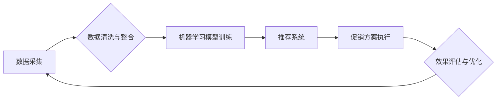

> 智能促销、机器学习、推荐系统、数据分析、营销策略、预测模型、客户行为

## 1. 背景介绍

在当今数据爆炸的时代，企业拥有海量用户数据，但如何有效利用这些数据提升营销效果，实现精准营销，成为企业亟需解决的关键问题。传统的促销策略往往依赖于经验和直觉，缺乏数据支撑，难以精准定位目标客户，导致资源浪费和营销效果不佳。智能促销策略的出现，为企业提供了全新的营销思路和解决方案。

智能促销策略是指利用机器学习、数据分析等先进技术，对用户行为、市场趋势等进行分析，并根据分析结果制定个性化、精准的促销方案，以提高营销效率和转化率。

## 2. 核心概念与联系

智能促销策略的核心概念包括：

* **数据分析:** 收集、清洗、整合用户行为数据、市场数据等，为智能促销策略提供数据基础。
* **机器学习:** 利用机器学习算法，从海量数据中挖掘用户行为模式、市场趋势等，构建预测模型。
* **推荐系统:** 基于用户行为和市场数据，推荐个性化促销方案，引导用户购买。
* **A/B测试:** 对不同的促销方案进行测试，比较效果，不断优化策略。

**核心概念架构图:**



## 3. 核心算法原理 & 具体操作步骤

### 3.1  算法原理概述

智能促销策略中常用的算法包括：

* **协同过滤:** 基于用户相似度或商品相似度，推荐用户可能感兴趣的商品。
* **内容过滤:** 基于用户偏好和商品特征，推荐用户可能感兴趣的商品。
* **深度学习:** 利用深度神经网络，从海量数据中学习更复杂的特征，提高推荐效果。

### 3.2  算法步骤详解

以协同过滤算法为例，其具体操作步骤如下：

1. **数据收集:** 收集用户行为数据，例如用户购买历史、浏览记录、评分等。
2. **用户相似度计算:** 计算用户之间的相似度，可以使用余弦相似度、皮尔逊相关系数等方法。
3. **商品推荐:** 根据用户相似度，推荐用户可能感兴趣的商品。

### 3.3  算法优缺点

**协同过滤算法:**

* **优点:** 可以推荐用户可能没有直接接触过的商品，发现新商品。
* **缺点:** 数据稀疏性问题，当用户行为数据不足时，算法效果会下降。

**内容过滤算法:**

* **优点:** 可以根据用户偏好精准推荐商品，避免推荐不相关的商品。
* **缺点:** 容易陷入“信息茧房”问题，用户只能看到自己感兴趣的商品，无法发现新事物。

**深度学习算法:**

* **优点:** 可以学习更复杂的特征，提高推荐效果。
* **缺点:** 需要大量的训练数据，训练成本较高。

### 3.4  算法应用领域

智能促销策略的算法广泛应用于：

* **电商平台:** 推荐商品、个性化促销、精准营销。
* **社交媒体:** 推广广告、推荐内容、用户画像分析。
* **金融行业:** 贷款推荐、理财产品推荐、风险控制。

## 4. 数学模型和公式 & 详细讲解 & 举例说明

### 4.1  数学模型构建

协同过滤算法的数学模型可以表示为：

$$
r_{ui} = \sum_{j=1}^{N} s_{uj} \cdot s_{ij}
$$

其中：

* $r_{ui}$ 表示用户 $u$ 对商品 $i$ 的评分。
* $s_{uj}$ 表示用户 $u$ 对商品 $j$ 的相似度。
* $s_{ij}$ 表示商品 $i$ 和商品 $j$ 的相似度。
* $N$ 表示所有商品的数量。

### 4.2  公式推导过程

协同过滤算法的原理是基于用户相似度和商品相似度，通过计算用户对商品的评分，并根据相似度进行加权平均，预测用户对未评分商品的评分。

### 4.3  案例分析与讲解

假设有两个用户 $u1$ 和 $u2$，他们都购买了商品 $A$ 和 $B$，并且对这两个商品的评分如下：

* $u1$ 对 $A$ 的评分为 5，对 $B$ 的评分为 4。
* $u2$ 对 $A$ 的评分为 4，对 $B$ 的评分为 5。

根据协同过滤算法，我们可以计算用户 $u1$ 和 $u2$ 的相似度，并预测用户 $u1$ 对商品 $C$ 的评分。

## 5. 项目实践：代码实例和详细解释说明

### 5.1  开发环境搭建

* Python 3.x
* scikit-learn
* pandas
* numpy

### 5.2  源代码详细实现

```python
import pandas as pd
from sklearn.metrics.pairwise import cosine_similarity

# 加载用户行为数据
data = pd.read_csv('user_behavior.csv')

# 计算用户相似度
user_similarity = cosine_similarity(data.pivot_table(index='user_id', columns='product_id', values='rating').fillna(0))

# 预测用户对商品C的评分
user_id = 1
product_id = 'C'
predicted_rating = np.dot(user_similarity[user_id], data.pivot_table(index='product_id', columns='user_id', values='rating').fillna(0)[product_id]) / np.linalg.norm(user_similarity[user_id])
```

### 5.3  代码解读与分析

* 首先，我们加载用户行为数据，并使用 `pivot_table` 方法将数据转换为用户-商品评分矩阵。
* 然后，我们使用 `cosine_similarity` 方法计算用户之间的相似度。
* 最后，我们使用预测公式，根据用户相似度和商品评分，预测用户对商品C的评分。

### 5.4  运行结果展示

运行代码后，我们可以得到用户对商品C的预测评分。

## 6. 实际应用场景

智能促销策略在电商平台、社交媒体、金融行业等领域都有广泛的应用场景。

### 6.1  电商平台

* **个性化推荐:** 根据用户的购买历史、浏览记录等数据，推荐用户可能感兴趣的商品。
* **精准营销:** 根据用户的兴趣爱好、消费习惯等数据，精准推送促销信息，提高转化率。
* **库存管理:** 利用预测模型，预测商品需求，优化库存管理，降低库存成本。

### 6.2  社交媒体

* **广告推荐:** 根据用户的兴趣爱好、社交关系等数据，推荐精准的广告，提高广告效果。
* **内容推荐:** 根据用户的阅读习惯、点赞记录等数据，推荐用户可能感兴趣的内容，提高用户粘性。
* **用户画像分析:** 利用机器学习算法，分析用户的行为数据，构建用户画像，为精准营销提供数据支持。

### 6.3  金融行业

* **贷款推荐:** 根据用户的信用记录、收入水平等数据，推荐合适的贷款产品，提高贷款审批效率。
* **理财产品推荐:** 根据用户的风险偏好、投资目标等数据，推荐合适的理财产品，帮助用户实现财富增值。
* **风险控制:** 利用机器学习算法，分析用户的行为数据，识别潜在的风险，降低金融机构的风险损失。

### 6.4  未来应用展望

随着人工智能技术的不断发展，智能促销策略将更加智能化、个性化、精准化。未来，智能促销策略将应用于更多领域，例如医疗、教育、旅游等，为用户提供更加个性化、便捷的服务。

## 7. 工具和资源推荐

### 7.1  学习资源推荐

* **书籍:**
    * 《推荐系统实践》
    * 《机器学习》
* **在线课程:**
    * Coursera: 机器学习
    * edX: 数据科学

### 7.2  开发工具推荐

* **Python:** 
    * scikit-learn
    * pandas
    * numpy
* **云平台:**
    * AWS
    * Azure
    * GCP

### 7.3  相关论文推荐

* **协同过滤算法:**
    * "Collaborative Filtering for Implicit Feedback Datasets"
* **深度学习推荐系统:**
    * "Deep Learning for Recommender Systems"

## 8. 总结：未来发展趋势与挑战

### 8.1  研究成果总结

智能促销策略的研究取得了显著成果，为企业提供了更加精准、高效的营销解决方案。

### 8.2  未来发展趋势

* **更加智能化:** 利用更先进的人工智能算法，例如强化学习、迁移学习等，提高智能促销策略的智能化水平。
* **更加个性化:** 基于更细粒度的用户数据，例如用户行为、情感、兴趣等，提供更加个性化的促销方案。
* **更加精准化:** 利用更精准的预测模型，预测用户购买行为，提高促销效果。

### 8.3  面临的挑战

* **数据隐私保护:** 智能促销策略需要大量用户数据，如何保护用户隐私成为一个重要挑战。
* **算法解释性:** 许多人工智能算法的决策过程难以解释，如何提高算法的解释性，增强用户信任成为一个重要问题。
* **算法公平性:** 智能促销策略可能会存在偏见，导致不公平的结果，如何保证算法的公平性成为一个重要挑战。

### 8.4  研究展望

未来，智能促销策略的研究将继续深入，探索更智能、更个性化、更精准的营销解决方案，为企业和用户创造更大的价值。

## 9. 附录：常见问题与解答

* **Q1: 智能促销策略会取代传统的营销策略吗？**

* **A1:** 智能促销策略可以有效提升营销效率，但不会完全取代传统的营销策略。传统的营销策略仍然需要根据具体情况进行调整和优化。

* **Q2: 如何保证智能促销策略的公平性？**

* **A2:** 

在设计智能促销策略时，需要考虑公平性问题，避免算法产生偏见。可以采用多种方法来保证算法的公平性，例如数据预处理、算法调优、公平性评估等。

* **Q3: 智能促销策略的数据隐私问题如何解决？**

* **A3:** 

在收集和使用用户数据时，需要严格遵守隐私保护法规，并采取相应的技术措施来保护用户隐私，例如数据加密、匿名化等。

作者：禅与计算机程序设计艺术 / Zen and the Art of Computer Programming


<end_of_turn>