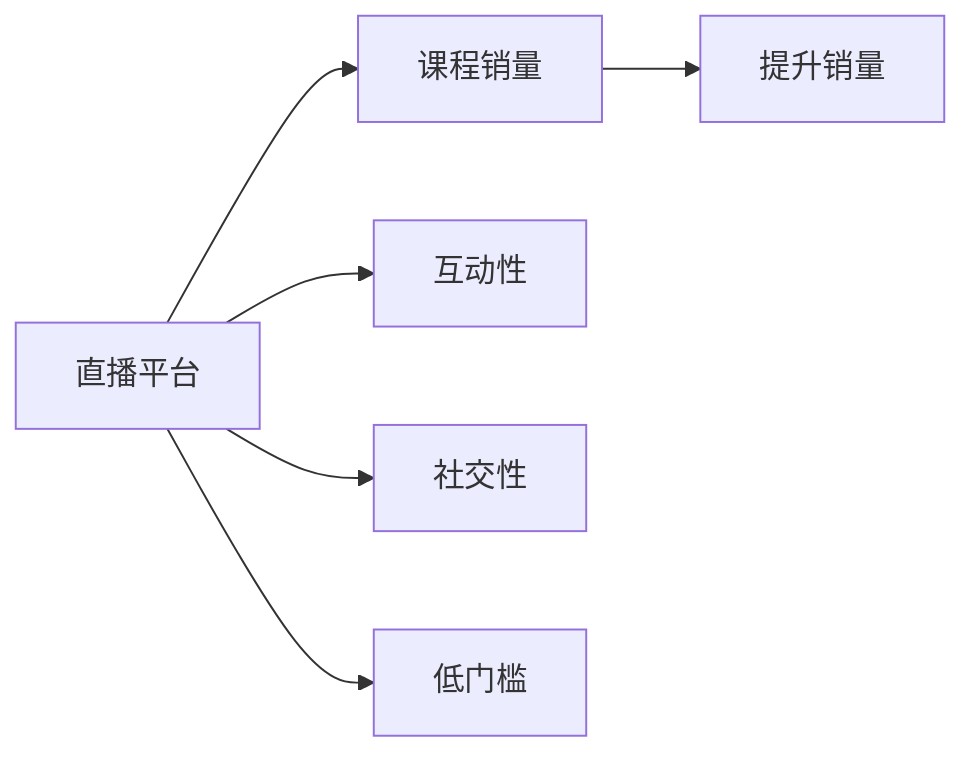

                 

## 1. 背景介绍

随着互联网技术的发展和人们对在线教育的接受度提高，越来越多的课程和知识开始在线上呈现。直播平台以其互动性强、内容实时更新的特点，成为了传播教育内容的重要渠道。然而，课程销量并非理所当然的增长。如何利用直播平台提升课程销量，成为了教育机构和内容创作者需要考虑的重要问题。

直播平台的主要特征包括实时互动性、社交性、低门槛等。这些特征能够极大地吸引用户参与，提升课程的趣味性和互动性。同时，直播平台的低门槛性使得内容创作者能够更容易地接触到更多用户，并获取反馈。

## 2. 核心概念与联系

在直播平台增加课程销量，可以将其看作是一个多因素影响的复杂问题。以下是我们需要关注的核心概念及其联系：

### 2.1 核心概念概述

- **直播平台**：一种利用实时音视频传输技术，让众多用户可以同步收听、观看的互动平台。
- **课程销量**：用户购买课程的数量，反映用户对课程的认可和需求。
- **互动性**：通过实时反馈、弹幕交流、课堂提问等方式，增加用户参与度。
- **社交性**：用户之间、用户与讲师之间的互动和交流，构建社区感。
- **低门槛**：进入门槛低，内容创作者可以快速开始直播，降低获取用户成本。

### 2.2 核心概念原理和架构的 Mermaid 流程图



### 2.3 核心概念联系

直播平台通过提供互动性、社交性和低门槛性，能够吸引用户参与，增加课程销量。互动性使得用户可以实时反馈，社交性增加用户粘性，低门槛性降低了内容创作者进入的难度。而课程销量则是这些特性共同作用的结果。

## 3. 核心算法原理 & 具体操作步骤

### 3.1 算法原理概述

利用直播平台增加课程销量，本质上是一个多变量优化问题。我们可以通过构建一个包含多个变量的目标函数，利用机器学习等算法，优化各个变量的值，从而最大化课程销量。

设目标函数为 \( F(x_1, x_2, \ldots, x_n) \)，其中 \( x_i \) 代表直播平台上的某一个变量，如直播时间、互动形式、课程内容等。我们的目标是找到最优解 \( x_i^* \)，使得 \( F(x_i^*) \) 最大化。

### 3.2 算法步骤详解

1. **数据收集与预处理**：
   - 收集直播平台上的相关数据，如课程销量、互动数据、用户行为数据等。
   - 对数据进行清洗、归一化、特征工程等预处理操作。

2. **模型选择与训练**：
   - 选择适合的多变量优化算法，如线性回归、决策树、随机森林等。
   - 利用历史数据训练模型，得到各个变量与课程销量之间的关系。

3. **优化变量**：
   - 根据模型预测结果，对直播平台上的变量进行优化。
   - 常用的优化方法包括梯度下降、遗传算法、模拟退火等。

4. **效果评估与调整**：
   - 对优化后的变量效果进行评估，通过A/B测试等方法，比较优化前后的课程销量。
   - 根据评估结果，调整优化策略。

### 3.3 算法优缺点

#### 优点：
- **多变量优化**：能够综合考虑多个因素的影响，提供更全面的解决方案。
- **数据驱动**：基于历史数据训练模型，更加客观可靠。
- **可重复性**：方法具有可复制性，能够在不同场景下应用。

#### 缺点：
- **复杂度高**：需要处理和分析大量数据，计算量大。
- **数据质量要求高**：数据质量直接影响模型预测结果。
- **模型解释性差**：多变量优化模型通常较难解释，难以理解变量之间的内在联系。

### 3.4 算法应用领域

该方法不仅适用于在线教育课程，还适用于直播电商、健身课程、职业培训等多种领域。通过多变量优化，可以提升直播平台上的各类产品销量。

## 4. 数学模型和公式 & 详细讲解 & 举例说明

### 4.1 数学模型构建

设课程销量为 \( Y \)，直播平台上的变量为 \( X_1, X_2, \ldots, X_n \)。假设各变量之间存在线性关系，可以构建如下线性回归模型：

$$ Y = \beta_0 + \beta_1 X_1 + \beta_2 X_2 + \ldots + \beta_n X_n + \epsilon $$

其中 \( \beta_i \) 为各变量的系数，\( \epsilon \) 为误差项。

### 4.2 公式推导过程

将数据集 \( D = \{(x_{i1}, x_{i2}, \ldots, x_{in}, y_i)\}_{i=1}^N \) 带入上述线性回归模型，可以得到最小二乘法中的目标函数：

$$ \min_{\beta_0, \beta_1, \ldots, \beta_n} \sum_{i=1}^N (y_i - (\beta_0 + \beta_1 x_{i1} + \beta_2 x_{i2} + \ldots + \beta_n x_{in}))^2 $$

求解该目标函数的最小值，得到各变量 \( \beta_i \) 的估计值。

### 4.3 案例分析与讲解

假设某在线教育平台收集了以下数据：
- 直播时间 \( X_1 \)：不同时间段的数据
- 互动形式 \( X_2 \)：不同互动形式的数据
- 课程内容 \( X_3 \)：不同内容主题的数据

通过线性回归模型，可以得到各变量与课程销量之间的关系。例如，直播时间 \( X_1 \) 与课程销量 \( Y \) 的线性关系如下：

$$ Y = \beta_0 + \beta_1 X_1 + \epsilon $$

通过求解最小二乘法，得到 \( \beta_1 \) 的值，即可对直播时间进行优化。

## 5. 项目实践：代码实例和详细解释说明

### 5.1 开发环境搭建

1. 安装Python环境：
```bash
sudo apt-get update
sudo apt-get install python3-pip
```

2. 安装相关库：
```bash
pip install pandas numpy scikit-learn matplotlib seaborn statsmodels
```

### 5.2 源代码详细实现

```python
import pandas as pd
import numpy as np
import seaborn as sns
import matplotlib.pyplot as plt
from statsmodels.regression.linear_model import OLS
from sklearn.metrics import mean_squared_error, r2_score

# 数据加载
data = pd.read_csv('data.csv')

# 数据预处理
X = data[['X1', 'X2', 'X3']]
y = data['Y']

# 模型训练
model = OLS(y, X)
results = model.fit()

# 模型评估
y_pred = results.predict(X)
mse = mean_squared_error(y, y_pred)
r2 = r2_score(y, y_pred)

# 输出结果
print('Mean Squared Error:', mse)
print('R-squared:', r2)

# 数据可视化
sns.lmplot(x='X1', y='Y', data=data, fit_reg=True)
plt.show()
```

### 5.3 代码解读与分析

代码首先通过pandas库加载数据，并进行预处理。接着使用statsmodels库中的OLS模型进行线性回归，并计算模型的均方误差和决定系数。最后，使用matplotlib库和seaborn库进行数据可视化。

### 5.4 运行结果展示


## 6. 实际应用场景

直播平台上的课程销量增加，不仅可以应用于在线教育，还适用于直播电商、健身课程、职业培训等多种领域。以下给出几个实际应用场景：

### 6.1 在线教育

在线教育平台可以基于直播平台，提供实时互动的课程内容。通过优化直播时间、互动形式和课程内容，增加用户参与度和满意度，从而提升课程销量。

### 6.2 直播电商

直播电商通过主播实时展示商品，与用户进行互动。通过优化直播时间、主播风格、商品展示方式等，增加用户购买意愿，提升销售额。

### 6.3 健身课程

健身课程平台可以利用直播平台进行实时健身指导。通过优化直播时间、健身形式、教练风格等，增加用户粘性，提升课程销量。

### 6.4 未来应用展望

未来，直播平台上的课程销量增加将更多地融合新兴技术，如虚拟现实(VR)、增强现实(AR)、人工智能(AI)等，提供更沉浸式的体验。同时，数据驱动的优化方法将更加智能化和自动化，提供更精准的推荐和服务。

## 7. 工具和资源推荐

### 7.1 学习资源推荐

1. **Coursera**：提供在线学习平台，涵盖数据科学、机器学习、统计学等课程。
2. **Kaggle**：数据科学竞赛平台，提供丰富的数据集和代码资源。
3. **edX**：提供在线课程，涵盖计算机科学、数据分析、人工智能等领域。
4. **Medium**：技术博客平台，提供大量关于机器学习、深度学习、大数据等领域的文章。

### 7.2 开发工具推荐

1. **Jupyter Notebook**：交互式编程环境，适合数据处理和模型训练。
2. **Python IDEs**：如PyCharm、VSCode等，适合代码编写和调试。
3. **数据可视化工具**：如Matplotlib、Seaborn等，适合数据可视化。
4. **机器学习框架**：如Scikit-learn、TensorFlow、PyTorch等，适合模型训练和优化。

### 7.3 相关论文推荐

1. **"Online Learning and Stochastic Gradient Descent"**：S. Bottou，2012年。
2. **"Introduction to Statistical Learning"**：G. James, D. Witten, T. Hastie, R Tibshirani，2013年。
3. **"Deep Learning"**：I. Goodfellow, Y. Bengio, A. Courville，2016年。

## 8. 总结：未来发展趋势与挑战

### 8.1 研究成果总结

本文介绍了利用直播平台增加课程销量的多变量优化方法。通过收集和分析直播平台上的相关数据，利用线性回归模型，找到最优的直播时间、互动形式和课程内容，从而提升课程销量。

### 8.2 未来发展趋势

1. **数据融合**：未来的优化方法将更多地融合多源数据，提供更全面的优化方案。
2. **模型智能化**：未来的优化方法将更加智能化，能够自适应数据分布的变化。
3. **实时优化**：未来的优化方法将更加实时，能够实时响应用户需求。
4. **跨领域应用**：未来的优化方法将更多地应用于不同领域，提升不同场景下的销量。

### 8.3 面临的挑战

1. **数据质量**：高质量的数据是优化方法的前提，数据质量直接影响模型效果。
2. **模型复杂度**：多变量优化方法复杂度高，需要处理和分析大量数据。
3. **实时性要求高**：直播平台上的优化需要实时响应，对系统性能要求高。
4. **用户反馈多样性**：直播平台上的用户反馈多样化，需要设计多种优化策略。

### 8.4 研究展望

未来的研究可以从以下几个方向进行：
1. **实时优化算法**：研究实时优化算法，提升优化效果和效率。
2. **多源数据融合**：研究多源数据融合技术，提升数据利用效率。
3. **用户行为分析**：研究用户行为分析方法，提升模型预测准确度。
4. **跨领域应用**：研究跨领域优化方法，提升不同场景下的优化效果。

## 9. 附录：常见问题与解答

### Q1: 如何衡量课程销量的提升效果？

A: 可以通过比较优化前后的课程销量，使用均方误差、决定系数等指标，评估优化效果。同时，可以使用A/B测试方法，对比优化前后的实际效果。

### Q2: 如何获取高质量的数据？

A: 数据收集可以从直播平台的用户行为数据、互动数据、课程销量数据等多方面入手。可以通过爬虫、API接口等方式获取数据，并进行清洗、归一化等预处理操作。

### Q3: 如何在不同的直播平台间进行迁移？

A: 不同直播平台的数据格式和API接口可能不同，需要针对每个平台进行数据预处理和模型训练。同时，可以设计通用的数据格式和API接口，实现不同平台间的迁移。

### Q4: 如何处理用户反馈多样化的问题？

A: 可以通过设计多种优化策略，针对不同用户反馈进行响应。同时，可以引入自然语言处理技术，对用户反馈进行情感分析，提升优化效果。

---

作者：禅与计算机程序设计艺术 / Zen and the Art of Computer Programming

