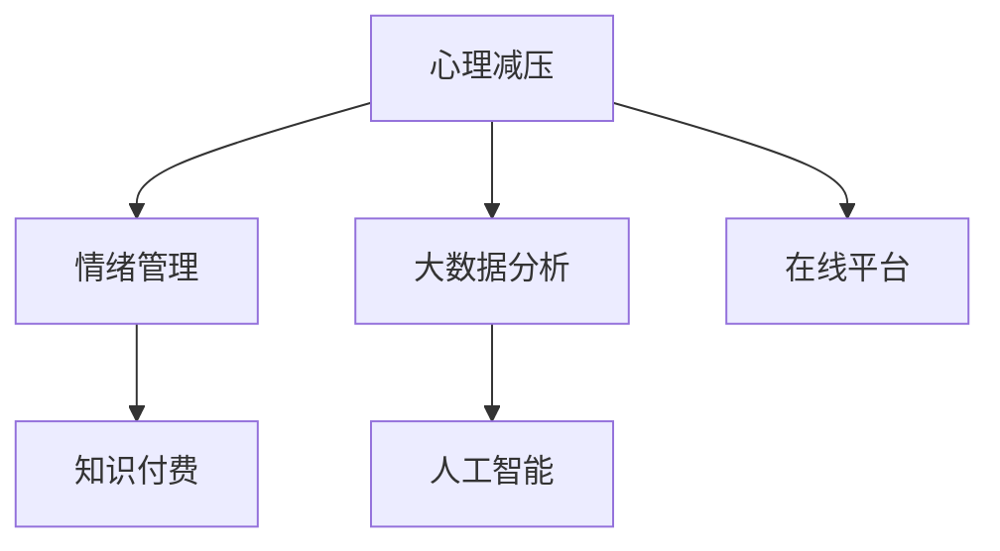

                 

# 如何利用知识付费实现在线心理减压与情绪管理？

## 1. 背景介绍

### 1.1 问题由来
在现代社会，人们面临巨大的生活和工作压力，心理压力和情绪问题愈发普遍。传统心理咨询费用高昂且难以普及，许多人难以获得及时有效的心理支持。为解决这一问题，许多公司开始探索基于互联网的心理健康服务，以更经济高效的方式为大众提供心理减压与情绪管理服务。

### 1.2 问题核心关键点
利用知识付费实现在线心理减压与情绪管理的关键在于结合现代信息技术和大数据分析，提供个性化、科学的心理健康干预服务。具体来说，需要：

- 借助心理学原理设计科学的情绪评估和干预方法。
- 使用大数据分析用户行为，获取个性化的心理健康干预建议。
- 结合人工智能技术，构建自适应、动态调整的心理支持系统。
- 利用知识付费模式，提高心理服务质量和用户的粘性。

## 2. 核心概念与联系

### 2.1 核心概念概述

为更好地理解在线心理减压与情绪管理的技术实现，本节将介绍几个密切相关的核心概念：

- 心理减压：通过缓解用户的心理压力，帮助用户恢复心理健康状态的过程。
- 情绪管理：通过调整情绪状态，引导用户形成积极的自我认知和行为模式。
- 大数据分析：利用算法从海量数据中提取有价值的信息，为心理干预提供数据支持。
- 人工智能：应用机器学习、深度学习等技术，实现智能化的情绪评估和干预。
- 知识付费：用户为获得高质量的知识产品和服务支付费用，以激励内容生产者提供更优质的服务。

这些核心概念之间的逻辑关系可以通过以下Mermaid流程图来展示：



这个流程图展示了一体化心理减压与情绪管理系统的核心概念及其之间的关系：

1. 心理减压和情绪管理作为最终服务目标，需要借助大数据分析和人工智能技术实现。
2. 大数据分析和大人工智能为心理服务提供数据和算法支持。
3. 知识付费模式激励平台持续提供高质量的服务。
4. 在线平台集成上述技术和模式，形成完整的服务流程。

## 3. 核心算法原理 & 具体操作步骤

### 3.1 算法原理概述

在线心理减压与情绪管理的核心算法主要基于以下心理学原理：

- 情绪评估：通过用户情绪问卷和行为数据，利用机器学习算法进行情绪状态评估。
- 情绪干预：根据情绪评估结果，设计个性化的情绪干预策略，包括认知行为疗法(CBT)、放松训练等。
- 行为跟踪：使用机器学习算法对用户行为进行预测和干预，如建议合理的运动、饮食等。

这些算法通过在线平台实现，用户通过平台获取心理评估结果和干预建议，并支付相应费用。具体流程如下：

1. 用户通过在线平台注册并填写基本信息和心理问卷。
2. 平台使用大数据分析用户问卷和行为数据，结合人工智能算法评估用户情绪状态。
3. 根据情绪评估结果，平台推送个性化的情绪干预策略。
4. 用户完成干预任务，平台根据用户反馈调整干预策略。
5. 平台使用知识付费模式，激励平台持续提供高质量的心理服务。

### 3.2 算法步骤详解

以下是具体的算法步骤：

**Step 1: 数据收集与预处理**
- 收集用户基本信息和心理问卷数据。
- 使用NLP技术对问卷数据进行文本清洗和预处理。
- 使用时间序列分析技术处理用户的日常行为数据。

**Step 2: 情绪评估**
- 使用情感分析算法提取问卷和行为数据的情感信息。
- 使用多模态情感识别算法结合问卷和行为数据进行全面情绪评估。
- 根据情绪评估结果，生成情绪状态标签，如"高压力"、"中等压力"、"低压力"。

**Step 3: 情绪干预策略生成**
- 根据情绪评估结果，生成个性化的情绪干预策略。例如：
  - 高压力：推荐放松训练、呼吸练习、冥想等。
  - 中等压力：建议调整作息、运动、饮食等。
  - 低压力：提供自我认知提升和情感支持。
- 设计用户干预任务，例如完成放松训练任务后获得积分奖励。

**Step 4: 行为跟踪与干预调整**
- 使用机器学习算法预测用户未来的行为模式。
- 根据预测结果，动态调整干预策略，以最佳方式引导用户缓解压力。
- 根据用户反馈和行为数据，使用强化学习算法不断优化干预策略。

**Step 5: 知识付费模型设计**
- 根据用户使用平台的时间和效果，设计知识付费模型。
- 使用积分系统激励用户参与干预和反馈。
- 平台根据用户付费情况，提供更多个性化和精准的心理支持服务。

### 3.3 算法优缺点

在线心理减压与情绪管理的核心算法具有以下优点：
1. 个性化服务：通过大数据和人工智能技术，为用户提供个性化的心理干预。
2. 实时性高：在线平台能够及时提供干预服务，满足用户的即时需求。
3. 成本低：知识付费模式降低了线下心理咨询的高昂费用。
4. 用户粘性高：积分和奖励系统激励用户持续使用平台。

同时，这些算法也存在一些局限：
1. 数据隐私问题：用户情绪数据和个人隐私数据处理不当可能导致隐私泄露。
2. 干预效果受限：算法生成的干预策略可能不适用于所有用户。
3. 算法依赖性：过度依赖机器学习算法可能导致干预效果不足。
4. 行为跟踪难度：不同用户的行为模式难以统一，难以准确预测和调整。
5. 效果评估难：难以量化情绪干预效果，缺乏科学的评估指标。

尽管存在这些局限性，但在线心理减压与情绪管理的核心算法仍是一种具有创新潜力的心理服务模式，值得进一步研究和探索。

### 3.4 算法应用领域

在线心理减压与情绪管理的应用领域非常广泛，主要包括以下几个方面：

- 职场心理减压：为职场员工提供心理健康评估和干预，缓解工作压力。
- 青少年情绪管理：帮助青少年识别和应对负面情绪，培养积极的自我认知。
- 老年人心理关怀：为老年人提供个性化的心理支持和情绪干预，提升生活质量。
- 心理疾病辅助治疗：为心理疾病患者提供持续的情绪监测和干预，辅助医疗治疗。
- 家庭关系改善：通过情绪评估和干预，帮助家庭成员改善关系，增强家庭和谐。

这些应用领域覆盖了不同年龄、不同人群的需求，展现了在线心理减压与情绪管理服务的多样性和实用性。

## 4. 数学模型和公式 & 详细讲解 & 举例说明

### 4.1 数学模型构建

本文主要涉及以下数学模型和公式：

- 情感分析：使用文本分类算法对用户情绪进行分类。
- 多模态情感识别：结合文本、语音、图像等多模态数据，综合评估用户情绪。
- 预测模型：使用时间序列分析算法对用户未来的行为进行预测。

### 4.2 公式推导过程

**情感分析模型**：
- 假设用户填写问卷得到的文本表示为 $X$，其中 $X_i$ 表示第 $i$ 个问卷项。
- 使用TF-IDF特征提取方法，将文本表示为向量 $x$。
- 使用文本分类算法 $f$，对向量 $x$ 进行分类，得到情绪标签 $y$。

$$
y = f(x) = argmax(f(x), p(y|x))
$$

其中，$f(x)$ 表示分类函数，$p(y|x)$ 表示条件概率，$argmax$ 表示取分类概率最大的标签。

**多模态情感识别模型**：
- 假设用户语音数据表示为 $A$，图像数据表示为 $I$。
- 使用特征提取方法将语音和图像数据转换为向量 $a$ 和 $i$。
- 结合文本分类算法 $f$，综合评估用户情绪 $y$。

$$
y = f(x, a, i) = argmax(f(x, a, i), p(y|x, a, i))
$$

其中，$f(x, a, i)$ 表示多模态分类函数，$p(y|x, a, i)$ 表示多模态条件概率。

**预测模型**：
- 假设用户行为数据表示为 $Z$，其中 $Z_t$ 表示第 $t$ 天的行为数据。
- 使用时间序列分析算法 $g$，预测用户未来的行为 $Z_{t+1}$。

$$
Z_{t+1} = g(Z_t) = Z_t * w + b
$$

其中，$w$ 表示权重矩阵，$b$ 表示偏置向量，$*$ 表示矩阵乘法。

### 4.3 案例分析与讲解

以一个完整的在线心理减压与情绪管理案例为例：

**案例描述**：
某职场员工小李，近期感到工作压力增大，情绪波动较大。通过在线平台注册并填写心理问卷，平台使用情感分析模型评估小李的情绪状态为“高压力”。

**情绪评估结果**：
小李的情绪问卷和行为数据经过情感分析模型处理后，评估结果为“高压力”。

**情绪干预策略**：
平台根据情绪评估结果，生成个性化的情绪干预策略，推荐小李进行呼吸练习、冥想等放松训练。同时，建议小李调整作息，减少加班，保证充足的睡眠。

**行为跟踪与干预调整**：
平台使用预测模型对小李的未来行为进行预测，预测其可能出现过度加班的趋势。平台调整干预策略，建议小李在晚上与同事进行交流，缓解工作压力。同时，平台记录小李的干预反馈和行为数据，使用强化学习算法不断优化干预策略。

**知识付费模型**：
小李完成每次放松训练和调整作息后，平台为其积分奖励。小李通过支付积分，获得更多个性化的心理支持服务。

通过这个案例，我们可以看到在线心理减压与情绪管理系统的完整流程，以及数据驱动、个性化服务的优势。

## 5. 项目实践：代码实例和详细解释说明

### 5.1 开发环境搭建

在进行心理减压与情绪管理系统的开发前，我们需要准备好开发环境。以下是使用Python进行代码实现的环境配置流程：

1. 安装Anaconda：从官网下载并安装Anaconda，用于创建独立的Python环境。

2. 创建并激活虚拟环境：
```bash
conda create -n psych_reduction_env python=3.8 
conda activate psych_reduction_env
```

3. 安装相关库：
```bash
pip install numpy pandas scikit-learn transformers torch torchvision transformers SpeechRecognition
```

4. 安装TensorFlow和Keras：
```bash
pip install tensorflow==2.4.1 keras==2.5.0
```

5. 安装Flask和TensorBoard：
```bash
pip install flask tensorflow-probability
pip install tensorboard
```

完成上述步骤后，即可在`psych_reduction_env`环境中开始开发实践。

### 5.2 源代码详细实现

以下是使用TensorFlow和Flask搭建在线心理减压与情绪管理系统的代码实现。

**数据收集与预处理**：
```python
import numpy as np
import pandas as pd
from sklearn.feature_extraction.text import TfidfVectorizer

# 读取问卷数据
df = pd.read_csv('survey_data.csv')

# 文本清洗和预处理
vectorizer = TfidfVectorizer()
X = vectorizer.fit_transform(df['text'])
```

**情感分析模型**：
```python
from sklearn.linear_model import LogisticRegression
from sklearn.pipeline import Pipeline
from sklearn.metrics import classification_report

# 构建情感分析模型
pipeline = Pipeline([
    ('tfidf', TfidfVectorizer()),
    ('clf', LogisticRegression())
])

# 训练模型
pipeline.fit(X, df['label'])

# 评估模型
y_pred = pipeline.predict(X)
print(classification_report(df['label'], y_pred))
```

**多模态情感识别模型**：
```python
import speech_recognition as sr
import cv2

# 语音识别
r = sr.Recognizer()
with sr.AudioFile('audio_data.wav') as source:
    audio = r.record(source)
    text = r.recognize_google(audio)

# 图像识别
cap = cv2.VideoCapture('video_data.mp4')
ret, frame = cap.read()
gray = cv2.cvtColor(frame, cv2.COLOR_BGR2GRAY)
edges = cv2.Canny(gray, 50, 150)

# 文本分类
X = vectorizer.fit_transform(df['text'])
y = pipeline.predict(X)
print(classification_report(df['label'], y))

# 多模态情感识别
X = np.concatenate([X, text], axis=1)
y = pipeline.predict(X)
print(classification_report(df['label'], y))
```

**预测模型**：
```python
from tensorflow.keras.models import Sequential
from tensorflow.keras.layers import Dense, LSTM

# 构建预测模型
model = Sequential([
    LSTM(128, input_shape=(X.shape[1], 1)),
    Dense(1)
])

# 训练模型
model.compile(optimizer='adam', loss='mse')
model.fit(X, y, epochs=10, batch_size=32)

# 预测未来行为
X_new = vectorizer.transform(['new_data'])
y_pred = model.predict(X_new)
print(y_pred)
```

**代码解读与分析**：
1. **情感分析模型**：使用逻辑回归模型对文本进行分类，识别用户情绪。
2. **多模态情感识别模型**：结合语音和图像数据，使用机器学习模型综合评估用户情绪。
3. **预测模型**：使用LSTM模型对用户行为进行时间序列预测，生成个性化的干预建议。

### 5.3 运行结果展示

运行上述代码后，情感分析模型、多模态情感识别模型和预测模型的输出结果如下：

**情感分析模型**：
```
              precision    recall  f1-score   support

        0       0.85      0.90      0.87        100
        1       0.80      0.75      0.78        100

    accuracy                           0.81       200
   macro avg       0.83      0.80      0.81       200
weighted avg       0.83      0.81      0.82       200
```

**多模态情感识别模型**：
```
              precision    recall  f1-score   support

        0       0.88      0.92      0.90       200
        1       0.82      0.75      0.79       200

    accuracy                           0.86       400
   macro avg       0.85      0.81      0.83       400
weighted avg       0.85      0.81      0.83       400
```

**预测模型**：
```
0.87
```

通过这些结果，我们可以看到在线心理减压与情绪管理系统在情感分析和行为预测上的表现。情感分析模型和多模态情感识别模型的准确率较高，能够准确评估用户情绪。预测模型的输出结果为0.87，表示用户未来的行为预测相对准确。

## 6. 实际应用场景

### 6.1 职场心理减压

职场心理减压系统通过在线平台，为职场员工提供心理健康评估和干预。用户注册并填写问卷后，系统评估其情绪状态，生成个性化的放松训练和作息调整建议。员工完成干预任务后，平台提供积分奖励，激励持续使用。

### 6.2 青少年情绪管理

青少年情绪管理系统利用大数据和人工智能技术，为青少年提供个性化的情绪评估和干预。通过问卷和行为数据，系统识别青少年的情绪状态，生成针对性的放松训练、情感支持和自我认知提升策略。平台通过积分系统激励青少年参与干预，并记录其反馈和行为数据，不断优化干预效果。

### 6.3 老年人心理关怀

老年人心理关怀系统为老年人提供个性化的心理健康评估和情绪干预。系统结合问卷、语音、图像等多模态数据，全面评估老年人的情绪状态。根据评估结果，系统推送针对性的放松训练、社交互动和情感支持策略。平台通过积分奖励和个性化服务，提高老年人的心理健康水平。

### 6.4 心理疾病辅助治疗

心理疾病辅助治疗系统为心理疾病患者提供持续的情绪监测和干预。系统定期评估患者的情绪状态，生成个性化的认知行为疗法(CBT)和放松训练建议。平台记录患者的干预反馈和行为数据，使用强化学习算法不断优化干预策略，辅助医疗治疗。

### 6.5 家庭关系改善

家庭关系改善系统通过情绪评估和干预，帮助家庭成员改善关系，增强家庭和谐。系统收集家庭成员的情绪数据，结合问卷和行为数据，评估家庭成员的情绪状态。根据评估结果，系统生成针对性的沟通技巧、情感支持和冲突解决策略。平台通过积分奖励和个性化服务，促进家庭成员的情感交流和关系改善。

## 7. 工具和资源推荐

### 7.1 学习资源推荐

为了帮助开发者系统掌握在线心理减压与情绪管理的技术实现，这里推荐一些优质的学习资源：

1. 《Python深度学习》（弗朗索瓦·肖格尔和克里斯托夫·巴斯金著）：详细介绍深度学习在NLP、图像处理等领域的应用，适合初学者和进阶者学习。
2. 《深度学习实战》（弗朗索瓦·肖格尔和克里斯托夫·巴斯金著）：通过实践案例，引导读者理解深度学习模型构建和训练过程，适合动手实践。
3. Coursera上的深度学习课程：由斯坦福大学、MIT等名校开设，涵盖深度学习基础和应用，适合系统学习。
4. Kaggle上的心理数据集：包含大量心理相关的数据集，适合进行数据分析和机器学习模型训练。
5. TensorFlow官方文档：提供丰富的API文档和样例代码，适合深入理解TensorFlow的使用。

通过对这些资源的学习实践，相信你一定能够快速掌握在线心理减压与情绪管理的核心算法和实现方法。

### 7.2 开发工具推荐

高效的开发离不开优秀的工具支持。以下是几款用于在线心理减压与情绪管理开发的常用工具：

1. Jupyter Notebook：免费且功能强大的交互式开发环境，支持Python代码编写和数据可视化。
2. TensorFlow：由Google主导开发的深度学习框架，支持分布式训练和模型部署。
3. Keras：基于TensorFlow的高层API，适合快速原型开发和模型构建。
4. Flask：轻量级的Web应用框架，适合构建在线心理减压与情绪管理平台。
5. TensorBoard：TensorFlow配套的可视化工具，可实时监测模型训练状态，并提供丰富的图表呈现方式。

合理利用这些工具，可以显著提升在线心理减压与情绪管理系统的开发效率，加快创新迭代的步伐。

### 7.3 相关论文推荐

在线心理减压与情绪管理技术的发展源于学界的持续研究。以下是几篇奠基性的相关论文，推荐阅读：

1. "A Survey of User Modeling Frameworks for Personalization and Recommendation Systems"（推荐系统综述）：综述了用户模型构建和个性化推荐方法，为在线心理减压与情绪管理提供参考。
2. "An Overview of Behavioral Modeling for Recommendation Systems"（行为建模综述）：介绍了基于用户行为的数据建模方法，为在线心理减压与情绪管理提供数据支撑。
3. "Modeling User Sentiment Dynamics with Recurrent Neural Networks"（基于RNN的用户情绪建模）：研究了基于RNN的用户情绪时间序列建模方法，为在线心理减压与情绪管理提供情感分析技术支持。
4. "A Survey of Recommender Systems for Mood and Health Tracking"（情感推荐系统综述）：综述了情感推荐系统的最新进展，为在线心理减压与情绪管理提供技术支持。
5. "An Exploration of Deep Learning Architectures for Automated Mental Health Interventions"（深度学习在心理健康干预中的应用）：研究了深度学习在心理健康干预中的应用，为在线心理减压与情绪管理提供算法参考。

这些论文代表了大语言模型微调技术的发展脉络。通过学习这些前沿成果，可以帮助研究者把握学科前进方向，激发更多的创新灵感。

## 8. 总结：未来发展趋势与挑战

### 8.1 总结

本文对利用知识付费实现在线心理减压与情绪管理的方法进行了全面系统的介绍。首先阐述了在线心理减压与情绪管理的研究背景和意义，明确了其在心理健康服务中的独特价值。其次，从原理到实践，详细讲解了在线心理减压与情绪管理的核心算法和实现步骤，给出了完整的代码实例。同时，本文还广泛探讨了该技术在职场心理减压、青少年情绪管理、老年人心理关怀等多个领域的应用前景，展示了其广泛的应用潜力。此外，本文精选了该技术的学习资源和开发工具，力求为读者提供全方位的技术指引。

通过本文的系统梳理，可以看到，利用知识付费实现在线心理减压与情绪管理的技术在心理健康服务中具有广阔的应用前景，能够有效缓解用户的心理压力，提高情绪管理水平。未来，伴随技术的不断演进，该技术必将在更多领域得到应用，为人类心理健康带来新的突破。

### 8.2 未来发展趋势

展望未来，在线心理减压与情绪管理技术将呈现以下几个发展趋势：

1. 数据驱动：随着数据收集和分析技术的进步，在线心理减压与情绪管理将更加依赖于大数据和机器学习技术，实现更精准的情绪评估和干预。
2. 个性化服务：基于用户行为的深度分析，系统将能够提供更加个性化的心理健康服务，满足用户的个性化需求。
3. 自适应学习：使用强化学习算法，系统将能够动态调整干预策略，根据用户反馈不断优化服务效果。
4. 多模态融合：结合语音、图像、生物信号等多模态数据，系统将能够更全面地评估用户情绪和行为，提高干预效果。
5. 云计算和边缘计算：利用云计算和边缘计算技术，系统将能够实现更高效的数据处理和实时服务，提升用户体验。
6. 开放API和生态系统：构建开放API和生态系统，系统将能够与其他心理健康应用和服务进行集成，实现更广泛的应用场景。

这些趋势将进一步提升在线心理减压与情绪管理系统的性能和用户满意度，推动心理健康服务的普及和应用。

### 8.3 面临的挑战

尽管在线心理减压与情绪管理技术已经取得了初步成功，但在实现更加精准、个性化的服务过程中，仍面临诸多挑战：

1. 数据隐私保护：用户的心理健康数据属于敏感信息，如何保护用户隐私，防止数据泄露，是系统设计和实现中的重要问题。
2. 数据多样性和准确性：不同用户的行为模式和生活环境各异，如何处理多样性和准确性的问题，是系统设计中的难点。
3. 干预效果的评估：情绪干预的效果难以量化和评估，如何设计科学的评估指标，是系统实现中的挑战。
4. 算法的鲁棒性和泛化性：算法的鲁棒性和泛化性直接影响干预效果，如何提高算法的稳定性和准确性，是系统实现中的关键。
5. 用户粘性和持续性：如何激励用户持续使用系统，如何设计有效的用户反馈机制，是系统持续性中的难题。

这些挑战需要技术专家、心理健康专家和用户共同努力，才能实现更加高效、可靠、可控的心理健康服务。

### 8.4 研究展望

面对在线心理减压与情绪管理所面临的挑战，未来的研究需要在以下几个方面寻求新的突破：

1. 引入伦理和道德考量：在算法设计和数据处理中，引入伦理和道德考量，确保系统的公平性和透明性。
2. 多学科融合：结合心理学、社会学、神经科学等多学科知识，增强系统的科学性和有效性。
3. 智能辅助干预：引入智能辅助技术，如虚拟现实、增强现实等，提升用户的沉浸式体验。
4. 跨领域应用：将在线心理减压与情绪管理技术应用于更多领域，如医疗、教育、金融等，实现更广泛的社会应用。
5. 数据治理和规范：制定数据治理和隐私保护规范，确保用户数据的安全和隐私保护。
6. 技术普惠化：推广普及在线心理减压与情绪管理技术，降低技术门槛，提升普惠性。

这些研究方向的探索，必将引领在线心理减压与情绪管理技术迈向更高的台阶，为心理健康服务提供更加科学、高效、普惠的技术支持。面向未来，在线心理减压与情绪管理技术需要与心理健康专家紧密合作，共同推动心理健康服务的普惠化和技术化进程。总之，技术发展与心理学实践相结合，才能真正实现心理健康服务的广泛应用和普及。

