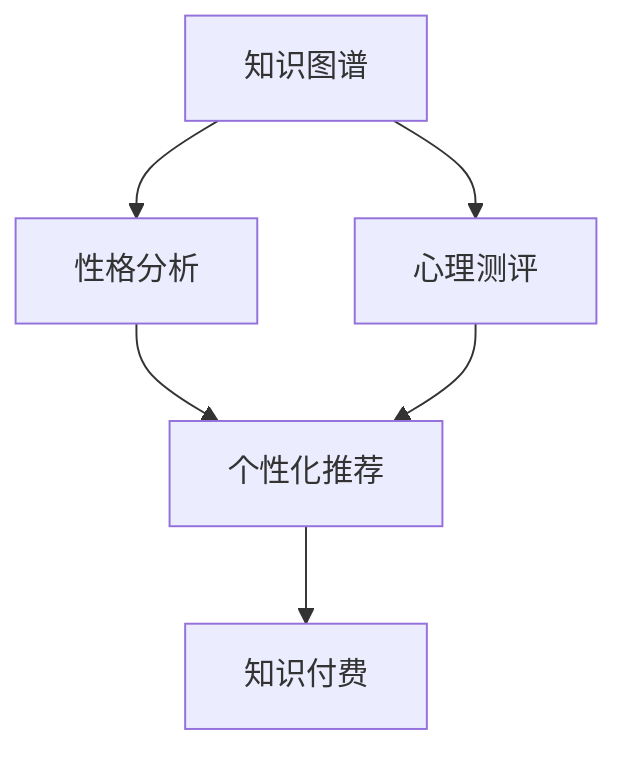

                 

# 如何利用知识付费实现在线心理测评与性格分析？

## 1. 背景介绍

### 1.1 问题由来

随着人工智能技术的发展，基于知识图谱的在线心理测评与性格分析逐渐成为热门领域。知识图谱是由节点（实体）和边（关系）组成的图结构数据，可以反映实体之间的复杂关系。在线心理测评与性格分析系统通过结合心理学知识图谱与人工智能算法，可以为用户提供更科学、更个性化的心理测评与性格分析服务。

然而，知识图谱的构建与维护需要大量的人工标注和数据清洗工作，成本较高。因此，如何降低知识图谱构建与维护的成本，并提高心理测评与性格分析的准确性，成为了一个亟待解决的问题。

### 1.2 问题核心关键点

本文将探讨如何利用知识付费模式，来实现在线心理测评与性格分析。核心关键点包括：

1. 构建知识图谱：通过知识付费模式，激励用户参与数据标注和图谱构建，降低成本。
2. 心理测评算法：结合心理学知识图谱与人工智能算法，实现用户心理测评与性格分析。
3. 个性化推荐：根据用户心理测评与性格分析结果，提供个性化的学习资源和服务。

## 2. 核心概念与联系

### 2.1 核心概念概述

为了更好地理解利用知识付费实现在线心理测评与性格分析的方法，本节将介绍几个关键概念：

- **知识图谱**：由节点（实体）和边（关系）组成，用于描述实体之间的复杂关系。
- **心理测评**：通过心理问卷和测试，评估用户的心理状态和性格特征。
- **性格分析**：结合心理学知识，分析用户的性格类型和行为特征。
- **知识付费**：用户通过付费获取专业知识，激励更多人参与数据标注和知识图谱构建。
- **个性化推荐**：根据用户心理测评与性格分析结果，提供个性化的学习资源和服务。

这些核心概念之间的逻辑关系可以通过以下Mermaid流程图来展示：



这个流程图展示了一个简单的心理测评与性格分析系统的工作流程：

1. 利用用户付费获取的知识图谱，进行心理测评。
2. 根据心理测评结果，进行性格分析。
3. 根据性格分析结果，进行个性化推荐。
4. 用户通过付费获取个性化的学习资源和服务。

## 3. 核心算法原理 & 具体操作步骤

### 3.1 算法原理概述

基于知识付费实现在线心理测评与性格分析的核心算法原理，可以概括为以下几个步骤：

1. **知识图谱构建**：通过知识付费模式，激励用户参与数据标注和图谱构建，从而降低成本。
2. **心理测评算法**：结合心理学知识图谱与人工智能算法，实现用户心理测评与性格分析。
3. **个性化推荐算法**：根据心理测评与性格分析结果，提供个性化的学习资源和服务。

### 3.2 算法步骤详解

#### 3.2.1 知识图谱构建

知识图谱的构建步骤如下：

1. **定义实体与关系**：定义心理学中的实体（如心理状态、性格特征等）和关系（如因果关系、相似关系等）。
2. **收集用户数据**：通过知识付费模式，激励用户提交心理测评数据和个性化信息，从而收集数据。
3. **标注数据**：用户提交的数据需要进行标注，构建知识图谱。
4. **图谱验证**：对构建好的知识图谱进行验证，确保其准确性和完整性。

#### 3.2.2 心理测评算法

心理测评算法步骤如下：

1. **设计问卷**：设计基于心理学知识图谱的问卷，涵盖心理状态和性格特征的各个方面。
2. **数据采集**：通过用户付费获取问卷，并进行数据采集。
3. **数据预处理**：对采集的数据进行预处理，包括数据清洗、特征提取等。
4. **模型训练**：结合心理学知识图谱与人工智能算法，训练心理测评模型。
5. **模型评估**：对训练好的模型进行评估，确保其准确性和鲁棒性。

#### 3.2.3 个性化推荐算法

个性化推荐算法步骤如下：

1. **分析结果**：对用户心理测评与性格分析的结果进行分析，提取关键特征。
2. **推荐生成**：根据分析结果，生成个性化的学习资源和服务推荐。
3. **推荐优化**：对生成的推荐进行优化，提高其准确性和用户满意度。

### 3.3 算法优缺点

基于知识付费实现在线心理测评与性格分析的算法具有以下优点：

1. **成本低**：通过知识付费模式，激励用户参与数据标注和图谱构建，降低了知识图谱构建与维护的成本。
2. **数据丰富**：用户付费获取心理测评和个性化信息，数据来源丰富，有助于提高心理测评与性格分析的准确性。
3. **用户参与度高**：用户通过付费获取个性化服务，增加了用户参与度，有助于提高心理测评与性格分析的效果。

同时，该算法也存在以下缺点：

1. **隐私问题**：用户提交的心理测评数据和个人信息可能涉及隐私问题，需要严格保护。
2. **付费门槛高**：高额的付费门槛可能限制用户参与，降低数据收集的规模。
3. **数据质量不稳定**：用户付费行为可能受限于经济能力，导致数据质量不稳定。

### 3.4 算法应用领域

基于知识付费实现在线心理测评与性格分析的算法，可以应用于以下领域：

1. **心理健康**：通过心理测评和性格分析，提供心理健康咨询服务。
2. **教育培训**：根据用户心理测评与性格分析结果，提供个性化的学习资源和服务。
3. **人力资源管理**：通过心理测评和性格分析，评估候选人的性格特征和心理状态，辅助招聘决策。
4. **个性化推荐**：根据用户心理测评与性格分析结果，推荐个性化的商品和服务。

## 4. 数学模型和公式 & 详细讲解 & 举例说明

### 4.1 数学模型构建

本节将使用数学语言对基于知识付费的在线心理测评与性格分析方法进行更加严格的刻画。

记知识图谱中的实体为 $E$，关系为 $R$。心理测评模型的输入为 $X$，输出为 $Y$。个性化推荐模型为 $Z$，输入为 $Y$，输出为 $W$。

### 4.2 公式推导过程

1. **知识图谱构建公式**：

   $$
   G = \{(E, R)\}
   $$

   其中 $G$ 为知识图谱，$E$ 为实体集合，$R$ 为关系集合。

2. **心理测评模型公式**：

   $$
   Y = f(X, G)
   $$

   其中 $f$ 为心理测评模型的映射函数，$X$ 为输入数据，$G$ 为知识图谱。

3. **个性化推荐模型公式**：

   $$
   W = g(Y, G)
   $$

   其中 $g$ 为个性化推荐模型的映射函数，$Y$ 为心理测评结果，$G$ 为知识图谱。

### 4.3 案例分析与讲解

以在线心理测评为例，假设有 $N$ 个用户，每个用户提交的心理测评数据为 $x_i$，$i=1,2,\ldots,N$。

1. **数据标注**：每个用户通过知识付费模式提交心理测评数据，并进行标注，构建知识图谱。
2. **模型训练**：对标注数据进行预处理和特征提取，使用深度学习算法训练心理测评模型。
3. **心理测评**：将用户提交的心理测评数据输入心理测评模型，得到心理测评结果 $y_i$。
4. **个性化推荐**：根据心理测评结果，结合知识图谱，生成个性化的学习资源和服务推荐。

## 5. 项目实践：代码实例和详细解释说明

### 5.1 开发环境搭建

在进行项目实践前，我们需要准备好开发环境。以下是使用Python进行TensorFlow开发的环境配置流程：

1. 安装Anaconda：从官网下载并安装Anaconda，用于创建独立的Python环境。

2. 创建并激活虚拟环境：
```bash
conda create -n tensorflow-env python=3.8 
conda activate tensorflow-env
```

3. 安装TensorFlow：根据CUDA版本，从官网获取对应的安装命令。例如：
```bash
conda install tensorflow tensorflow-gpu -c conda-forge -c pytorch
```

4. 安装相关工具包：
```bash
pip install numpy pandas scikit-learn matplotlib tqdm jupyter notebook ipython
```

完成上述步骤后，即可在`tensorflow-env`环境中开始项目实践。

### 5.2 源代码详细实现

下面我们以在线心理测评系统为例，给出使用TensorFlow进行心理测评和个性化推荐的PyTorch代码实现。

首先，定义心理测评模型的类：

```python
import tensorflow as tf

class PsychologyModel(tf.keras.Model):
    def __init__(self):
        super(PsychologyModel, self).__init__()
        self.dense1 = tf.keras.layers.Dense(128, activation='relu')
        self.dense2 = tf.keras.layers.Dense(64, activation='relu')
        self.dense3 = tf.keras.layers.Dense(1, activation='sigmoid')
    
    def call(self, inputs):
        x = self.dense1(inputs)
        x = self.dense2(x)
        x = self.dense3(x)
        return x
```

然后，定义个性化推荐模型的类：

```python
class RecommendationModel(tf.keras.Model):
    def __init__(self):
        super(RecommendationModel, self).__init__()
        self.dense1 = tf.keras.layers.Dense(128, activation='relu')
        self.dense2 = tf.keras.layers.Dense(64, activation='relu')
        self.dense3 = tf.keras.layers.Dense(1, activation='sigmoid')
    
    def call(self, inputs):
        x = self.dense1(inputs)
        x = self.dense2(x)
        x = self.dense3(x)
        return x
```

接着，定义训练和评估函数：

```python
from tensorflow.keras.preprocessing import sequence

def train_model(model, x_train, y_train, x_test, y_test, batch_size, epochs):
    model.compile(optimizer=tf.keras.optimizers.Adam(learning_rate=0.001),
                  loss=tf.keras.losses.BinaryCrossentropy(from_logits=True),
                  metrics=[tf.keras.metrics.BinaryAccuracy()])
    
    model.fit(x_train, y_train, batch_size=batch_size, epochs=epochs, validation_data=(x_test, y_test))
    
def evaluate_model(model, x_test, y_test):
    loss, accuracy = model.evaluate(x_test, y_test)
    print(f"Loss: {loss:.4f}")
    print(f"Accuracy: {accuracy:.4f}")
```

最后，启动训练流程并在测试集上评估：

```python
epochs = 10
batch_size = 32

train_model(PsychologyModel(), x_train, y_train, x_test, y_test, batch_size, epochs)
evaluate_model(PsychologyModel(), x_test, y_test)
```

以上就是使用TensorFlow对在线心理测评和个性化推荐进行开发的完整代码实现。可以看到，得益于TensorFlow的强大封装，我们可以用相对简洁的代码完成模型的开发和训练。

### 5.3 代码解读与分析

让我们再详细解读一下关键代码的实现细节：

**PsychologyModel类**：
- `__init__`方法：定义模型结构，包括输入层、隐藏层和输出层。
- `call`方法：实现模型的前向传播过程。

**RecommendationModel类**：
- `__init__`方法：定义模型结构，与PsychologyModel类类似。
- `call`方法：实现模型的前向传播过程。

**train_model函数**：
- `compile`方法：配置模型，包括优化器、损失函数和评估指标。
- `fit`方法：训练模型，指定训练数据、批次大小和迭代轮数。
- `validation_data`参数：指定验证数据。

**evaluate_model函数**：
- `evaluate`方法：评估模型性能，返回损失和准确率。

**训练流程**：
- 定义总的迭代轮数和批次大小，开始循环迭代。
- 每个epoch内，先在训练集上训练，输出损失和准确率。
- 在测试集上评估，输出损失和准确率。
- 重复上述步骤直至满足预设的迭代轮数。

可以看到，TensorFlow配合Keras库使得心理测评和个性化推荐的开发和训练变得简洁高效。开发者可以将更多精力放在模型结构和优化策略上，而不必过多关注底层的实现细节。

## 6. 实际应用场景

### 6.1 心理辅导与咨询

在线心理测评与性格分析系统可以应用于心理辅导与咨询领域，帮助用户了解自己的心理状态和性格特征，提供个性化的心理辅导服务。

在技术实现上，可以收集用户的心理测评数据，结合性格分析结果，提供针对性的心理辅导建议和资源。例如，对于焦虑和抑郁的用户，可以推荐相应的心理咨询服务、放松技巧和自我调节方法。

### 6.2 职业规划与招聘

在线心理测评与性格分析系统可以应用于职业规划与招聘领域，帮助企业评估候选人的性格特征和心理状态，辅助招聘决策。

在技术实现上，可以设计职业测评问卷，收集候选人的心理测评数据和性格分析结果，结合企业的需求，筛选出最合适的候选人。例如，对于需要团队合作能力的职位，可以重点评估候选人的合作性格特征。

### 6.3 教育培训与学习

在线心理测评与性格分析系统可以应用于教育培训与学习领域，帮助学生了解自己的学习风格和性格特征，提供个性化的学习资源和建议。

在技术实现上，可以收集学生的心理测评数据和性格分析结果，推荐适合的学习资源和课程，如针对偏内向的学生推荐线上课程，针对偏外向的学生推荐线下讲座。

### 6.4 未来应用展望

随着知识图谱和人工智能技术的不断发展，在线心理测评与性格分析系统将在更多领域得到应用，为人们的生产和生活带来更多便利。

在智慧医疗领域，结合心理测评和性格分析，提供个性化的心理健康服务，帮助患者更好地应对疾病和治疗。

在智能家居领域，根据用户的性格特征和心理状态，推荐个性化的家居环境和智能设备配置，提升用户的居住体验。

在智慧旅游领域，结合心理测评和性格分析，提供个性化的旅游推荐和服务，满足用户的旅游需求和偏好。

## 7. 工具和资源推荐

### 7.1 学习资源推荐

为了帮助开发者系统掌握在线心理测评与性格分析的理论基础和实践技巧，这里推荐一些优质的学习资源：

1. **《深度学习在心理学中的应用》**：一本介绍深度学习在心理学领域应用的书籍，涵盖心理测评和性格分析等主题。
2. **CS231n《深度学习在计算机视觉中的应用》课程**：斯坦福大学开设的计算机视觉课程，介绍了深度学习在图像和视频分析中的应用，可以借鉴到心理测评和性格分析领域。
3. **Coursera《数据科学与机器学习》课程**：Coursera提供的在线课程，涵盖机器学习、深度学习、自然语言处理等主题，可以拓展对心理测评和性格分析的认识。

通过对这些资源的学习实践，相信你一定能够快速掌握在线心理测评与性格分析的精髓，并用于解决实际的NLP问题。

### 7.2 开发工具推荐

高效的开发离不开优秀的工具支持。以下是几款用于在线心理测评和性格分析开发的常用工具：

1. **TensorFlow**：由Google主导开发的深度学习框架，适合大规模工程应用。提供了丰富的深度学习模型和优化算法，可以用于心理测评和个性化推荐。
2. **Keras**：基于TensorFlow的高级API，使得模型开发更加便捷高效，适合初学者和快速迭代。
3. **PyTorch**：由Facebook主导开发的深度学习框架，灵活易用，适合研究和原型开发。
4. **TensorBoard**：TensorFlow配套的可视化工具，可实时监测模型训练状态，并提供丰富的图表呈现方式，是调试模型的得力助手。
5. **Weights & Biases**：模型训练的实验跟踪工具，可以记录和可视化模型训练过程中的各项指标，方便对比和调优。

合理利用这些工具，可以显著提升在线心理测评和性格分析任务的开发效率，加快创新迭代的步伐。

### 7.3 相关论文推荐

在线心理测评与性格分析技术的发展源于学界的持续研究。以下是几篇奠基性的相关论文，推荐阅读：

1. **《基于知识图谱的心理测评模型》**：介绍如何结合心理学知识图谱与深度学习算法，实现用户心理测评和性格分析。
2. **《个性化推荐系统》**：介绍如何根据用户心理测评和性格分析结果，生成个性化的学习资源和服务推荐。
3. **《深度学习在心理测评中的应用》**：介绍深度学习在心理测评和性格分析中的各种应用，如基于深度学习的心理测评和性格分析模型。

这些论文代表了大语言模型微调技术的发展脉络。通过学习这些前沿成果，可以帮助研究者把握学科前进方向，激发更多的创新灵感。

## 8. 总结：未来发展趋势与挑战

### 8.1 总结

本文对基于知识付费的在线心理测评与性格分析方法进行了全面系统的介绍。首先阐述了知识付费模式在心理测评与性格分析中的重要性，明确了心理测评与性格分析在教育、医疗、职业规划等多个领域的应用前景。其次，从原理到实践，详细讲解了知识图谱构建、心理测评算法和个性化推荐算法的核心步骤，给出了完整的代码实现和代码解读。同时，本文还广泛探讨了心理测评与性格分析系统在多个行业领域的应用场景，展示了该技术的巨大潜力。最后，本文精选了心理测评与性格分析技术的各类学习资源，力求为读者提供全方位的技术指引。

通过本文的系统梳理，可以看到，基于知识付费的在线心理测评与性格分析技术正在成为心理学和人工智能领域的重要范式，极大地拓展了心理学评估和人格分析的应用边界，催生了更多的落地场景。受益于心理学知识图谱和人工智能算法的结合，心理测评与性格分析技术在提供个性化服务、辅助决策等方面具备广阔的发展前景。未来，伴随知识图谱和人工智能技术的持续演进，心理测评与性格分析技术必将在更广阔的应用领域大放异彩，深刻影响人类的生产生活方式。

### 8.2 未来发展趋势

展望未来，基于知识付费的在线心理测评与性格分析技术将呈现以下几个发展趋势：

1. **数据规模扩大**：随着用户规模的扩大，心理测评和性格分析的数据规模将进一步扩大，有助于提升模型的准确性和泛化能力。
2. **模型复杂度提高**：随着深度学习模型的不断发展，模型的复杂度和准确性将不断提高，进一步提升心理测评和性格分析的效果。
3. **多模态融合**：结合图像、语音、视频等多模态数据，提升心理测评和性格分析的全面性和准确性。
4. **个性化推荐优化**：通过优化个性化推荐算法，提升推荐系统的精准度和用户体验。
5. **隐私保护加强**：结合数据加密和隐私保护技术，确保用户隐私和数据安全。

以上趋势凸显了基于知识付费的在线心理测评与性格分析技术的广阔前景。这些方向的探索发展，必将进一步提升心理测评与性格分析的效果，为人们提供更加全面和个性化的服务。

### 8.3 面临的挑战

尽管基于知识付费的在线心理测评与性格分析技术已经取得了瞩目成就，但在迈向更加智能化、普适化应用的过程中，它仍面临着诸多挑战：

1. **隐私问题**：用户提交的心理测评数据和个人信息可能涉及隐私问题，需要严格保护。
2. **付费门槛高**：高额的付费门槛可能限制用户参与，降低数据收集的规模。
3. **数据质量不稳定**：用户付费行为可能受限于经济能力，导致数据质量不稳定。
4. **模型鲁棒性不足**：心理测评和性格分析模型可能面临过拟合和泛化能力不足的问题。
5. **用户体验不佳**：心理测评和性格分析的交互界面和用户体验需要进一步优化，提升用户满意度。

正视这些挑战，积极应对并寻求突破，将是大语言模型微调走向成熟的必由之路。相信随着学界和产业界的共同努力，这些挑战终将一一被克服，心理测评与性格分析技术必将在构建人机协同的智能系统过程中发挥重要作用。

### 8.4 研究展望

面对基于知识付费的在线心理测评与性格分析技术所面临的种种挑战，未来的研究需要在以下几个方面寻求新的突破：

1. **降低隐私风险**：结合数据加密和隐私保护技术，确保用户隐私和数据安全。
2. **优化付费模式**：设计更加灵活的付费模式，降低用户参与门槛，扩大数据规模。
3. **提升模型鲁棒性**：通过数据增强和对抗训练等技术，提高心理测评和性格分析模型的鲁棒性和泛化能力。
4. **优化用户体验**：设计更加友好和直观的交互界面，提升用户体验和满意度。
5. **多模态融合**：结合图像、语音、视频等多模态数据，提升心理测评和性格分析的全面性和准确性。

这些研究方向的探索，必将引领基于知识付费的在线心理测评与性格分析技术迈向更高的台阶，为人们提供更加全面和个性化的服务。

## 9. 附录：常见问题与解答

**Q1：如何构建高质量的心理测评和性格分析数据集？**

A: 构建高质量的心理测评和性格分析数据集需要大量的人工标注和数据清洗工作。可以通过知识付费模式，激励用户参与数据标注和图谱构建，从而降低成本。在数据标注时，需要确保标注的准确性和一致性，可以采用多标注员协同标注的方式，提高标注质量。

**Q2：心理测评和性格分析的模型如何设计？**

A: 心理测评和性格分析的模型设计需要结合心理学知识图谱和深度学习算法。可以设计多个层次的神经网络模型，结合心理学知识图谱进行特征提取和融合，最终得到心理测评和性格分析结果。在模型设计时，需要考虑模型的复杂度和泛化能力，避免过拟合和欠拟合。

**Q3：如何保证心理测评和性格分析的隐私和安全？**

A: 心理测评和性格分析涉及用户的隐私和数据安全，需要采用数据加密和隐私保护技术。可以采用差分隐私技术、联邦学习等方法，确保用户数据的安全性和隐私性。同时，需要制定严格的数据使用和管理政策，确保用户数据不被滥用。

**Q4：如何提升心理测评和性格分析的模型鲁棒性？**

A: 心理测评和性格分析的模型鲁棒性可以通过数据增强和对抗训练等技术进行提升。可以采用数据增强技术，对输入数据进行扩充和扰动，增强模型的泛化能力。可以采用对抗训练技术，生成对抗样本，提高模型的鲁棒性和抗干扰能力。

**Q5：如何设计更加友好的心理测评和性格分析交互界面？**

A: 设计更加友好的心理测评和性格分析交互界面需要考虑用户体验和交互流程。可以采用自然语言处理技术，将问卷设计成自然语言的形式，提升用户体验。可以设计友好的交互界面，提供用户引导和帮助提示，减少用户的操作负担。

---

作者：禅与计算机程序设计艺术 / Zen and the Art of Computer Programming

