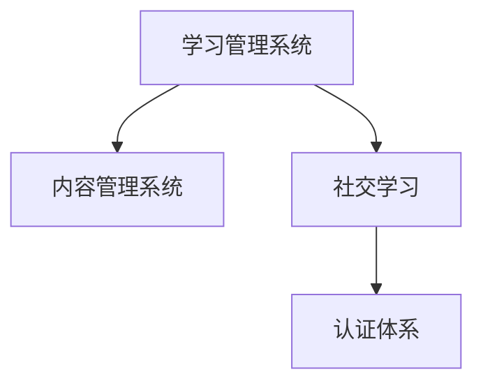

                 

# 如何利用知识付费实现在线技能培训与证书认证？

> 关键词：知识付费, 在线培训, 技能认证, 学习管理系统(LMS), 社交学习, 内容管理系统(CMS), 认证体系, 人工智能驱动

## 1. 背景介绍

### 1.1 问题由来
在当今数字化时代，终身学习成为个人成长和职业发展的关键。然而，传统教育模式受限于时间和地域的限制，难以满足大众对学习自由度和便捷性的需求。在此背景下，知识付费和在线学习平台应运而生，成为推动教育行业数字化转型的重要力量。

知识付费模式通过向用户提供高品质的知识和技能，满足其在职业发展、兴趣爱好等方面的需求。在线学习平台利用互联网技术，打破了传统教育的边界，使学习资源可以随时随地访问，极大提升了学习的灵活性和便利性。

随着市场竞争的加剧，越来越多的在线教育平台开始探索新的商业模式和运营策略，其中一种有效的方式就是建立在线技能培训和证书认证体系。通过这一体系，平台不仅能增强用户体验，还能提升自身的市场竞争力。

## 1.2 问题核心关键点
在线技能培训与证书认证的实现涉及到多个关键点，包括：

- 学习管理系统(Learning Management System, LMS)的选择和定制化开发
- 内容管理系统(Content Management System, CMS)的设计与集成
- 社交学习(Social Learning)功能的引入
- 认证体系的设计和实施
- 数据驱动的个性化学习推荐

这些关键点相互关联，共同构成了一个完整的在线技能培训与证书认证平台。本文将逐一探讨这些关键点，并给出详细的实现方案。

## 2. 核心概念与联系

### 2.1 核心概念概述

为更好地理解在线技能培训与证书认证的实现过程，我们首先介绍几个核心概念：

- **学习管理系统(LMS)**：用于支持在线课程的创建、管理和交付的系统。LMS包括课程内容管理、学生管理、学习进度跟踪等功能。
- **内容管理系统(CMS)**：用于管理网站内容的系统，包括文章、视频、图片等媒体资源的上传、管理和发布。
- **社交学习**：通过学习社区、论坛、讨论等形式，促进学生之间的互动和合作，增强学习效果。
- **认证体系**：通过考试、作业、项目等多种方式，对学生的学习成果进行评估和认证，发放证书以证明其技能水平。

这些概念之间的逻辑关系可以通过以下Mermaid流程图来展示：



这个流程图展示了LMS、CMS、社交学习和认证体系之间的联系：

1. **LMS**是平台的核心，负责课程的创建和管理，以及学习过程的监控。
2. **CMS**提供了丰富的课程内容，支持多种媒体格式和交互方式。
3. **社交学习**通过社区交流和协作，增强学习效果和用户体验。
4. **认证体系**通过评估和认证，为学生提供正式的技能证明。

这些组件相互配合，共同构成了一个完整的在线学习生态系统。

## 3. 核心算法原理 & 具体操作步骤
### 3.1 算法原理概述

在线技能培训与证书认证的实现过程可以分为以下几个步骤：

1. **课程设计**：根据目标技能，设计课程内容和结构。
2. **内容创建**：将课程内容上传到CMS，确保内容的丰富性和多样性。
3. **LMS开发**：开发LMS，实现课程管理、学生管理、学习进度跟踪等功能。
4. **社交功能实现**：引入社交学习功能，促进学生之间的互动和协作。
5. **认证体系设计**：设计认证体系，确保评估的公正性和准确性。
6. **测试与部署**：对平台进行测试，确保其稳定性和可靠性，然后部署上线。

### 3.2 算法步骤详解

#### 3.2.1 课程设计
课程设计是技能培训的第一步，需要根据目标技能和用户需求，设计课程内容和结构。这包括以下几个关键步骤：

1. **技能分析**：明确目标技能的核心内容、所需知识、技能和能力。
2. **学习路径规划**：根据技能分析结果，设计学习路径和课程结构。
3. **课程内容编写**：编写课程内容，包括文字、视频、图片等，确保内容的准确性和实用性。
4. **评估设计**：设计课程评估方法，如测验、作业、项目等，确保评估的全面性和公正性。

#### 3.2.2 内容创建
内容创建是将课程内容上传到CMS的过程，主要包括以下几个步骤：

1. **多媒体资源上传**：将文字、视频、图片等多媒体资源上传到CMS。
2. **交互式元素设计**：设计交互式元素，如问答、讨论、测验等，增强学习体验。
3. **资源组织**：按照课程结构和逻辑组织内容，确保用户可以方便地访问和浏览。
4. **权限控制**：设置资源访问权限，确保只有授权用户才能访问和修改内容。

#### 3.2.3 LMS开发
LMS开发是平台的核心部分，主要包括以下几个功能模块：

1. **用户管理**：实现用户注册、登录、注销等功能，确保系统的安全性。
2. **课程管理**：实现课程的创建、修改、删除等功能，支持多课程管理。
3. **学习进度跟踪**：记录和跟踪学生的学习进度，提供个性化的学习建议。
4. **互动功能**：实现学生之间的互动功能，如论坛、讨论、消息等。
5. **数据分析**：分析学生的学习行为数据，提供学习报告和学习建议。

#### 3.2.4 社交功能实现
社交功能是增强学习效果的重要手段，主要包括以下几个步骤：

1. **社区建设**：建立学习社区，提供学生交流讨论的平台。
2. **互动设计**：设计互动功能，如讨论、问答、投票等，促进学生之间的互动。
3. **推荐算法**：引入个性化推荐算法，推荐相关课程和资源，提高学习效率。
4. **社区管理**：管理社区秩序，确保社区健康有序发展。

#### 3.2.5 认证体系设计
认证体系是技能培训和技能认证的关键，主要包括以下几个步骤：

1. **评估方法设计**：设计评估方法，如测验、作业、项目等，确保评估的全面性和公正性。
2. **认证标准制定**：制定认证标准，明确通过评估的条件和要求。
3. **证书发放**：根据评估结果，发放证书，确保认证的权威性和可靠性。
4. **审核流程设计**：设计审核流程，确保评估和认证的公正性和透明性。

#### 3.2.6 测试与部署
测试与部署是平台上线前的最后一步，主要包括以下几个步骤：

1. **功能测试**：测试平台各个功能模块，确保其稳定性和可靠性。
2. **性能测试**：测试平台性能，确保其能够处理大量并发用户和数据。
3. **安全测试**：测试平台安全性，确保其能够防止各种攻击和漏洞。
4. **部署上线**：将平台部署到服务器，确保其稳定运行。

### 3.3 算法优缺点

在线技能培训与证书认证的实现过程具有以下优点：

1. **灵活性高**：用户可以根据自身需求选择课程和内容，自由安排学习时间。
2. **覆盖面广**：平台支持多种媒体格式和交互方式，能够提供丰富的学习资源。
3. **互动性强**：社交学习功能促进学生之间的互动和协作，增强学习效果。
4. **认证权威**：认证体系确保评估的公正性和权威性，为学生提供正式的技能证明。

同时，该过程也存在以下缺点：

1. **开发成本高**：平台开发和部署需要大量的资源和人力。
2. **技术门槛高**：平台开发涉及多个技术栈和工具，需要一定的技术基础。
3. **维护复杂**：平台上线后需要进行持续的维护和更新，确保其稳定性和安全性。

尽管存在这些缺点，但就目前而言，基于在线学习平台的技能培训和证书认证仍然是大势所趋，具有广泛的应用前景。

### 3.4 算法应用领域

在线技能培训与证书认证已经在多个领域得到了应用，包括但不限于以下领域：

- **职业培训**：为员工提供职业技能的培训和认证，提升其职业竞争力。
- **在线教育**：提供各类知识技能的在线培训，满足用户的学习需求。
- **企业培训**：为企业管理层和员工提供定制化的培训课程，提升企业整体素质。
- **个人兴趣**：为个人兴趣爱好者提供丰富的在线学习资源，满足其学习兴趣。
- **学术研究**：为学术研究人员提供技能培训，提升其学术水平和研究能力。

随着在线学习平台和知识付费模式的不断发展，基于在线技能培训与证书认证的应用场景将更加广泛，为各行各业带来变革性影响。

## 4. 数学模型和公式 & 详细讲解 & 举例说明

### 4.1 数学模型构建

在线技能培训与证书认证平台的设计和实现过程，可以通过数学模型来更好地描述和分析。以下是几个关键模型的构建和推导过程：

#### 4.1.1 用户行为模型
用户行为模型用于描述用户的学习行为和偏好，主要包括以下几个变量：

- $U$：用户集合
- $C$：课程集合
- $R$：资源集合
- $I$：互动行为集合
- $P$：学习进度集合

用户行为模型可以表示为：

$$
\begin{aligned}
\text{行为} &= \{ (u, c, r, i, p) | u \in U, c \in C, r \in R, i \in I, p \in P \} \\
&= \{ \text{用户} \times \text{课程} \times \text{资源} \times \text{互动行为} \times \text{学习进度} \}
\end{aligned}
$$

#### 4.1.2 推荐模型
推荐模型用于预测用户可能感兴趣的学习资源，主要包括以下几个变量：

- $U$：用户集合
- $C$：课程集合
- $R$：资源集合
- $P$：学习进度集合
- $I$：互动行为集合
- $A$：用户偏好集合

推荐模型可以表示为：

$$
\begin{aligned}
\text{推荐} &= \{ (u, c, r) | u \in U, c \in C, r \in R \} \\
&= \{ \text{用户} \times \text{课程} \times \text{资源} \}
\end{aligned}
$$

推荐模型的目标是通过用户行为数据，预测用户对资源的需求和兴趣，从而推荐合适的学习资源。

#### 4.1.3 评估模型
评估模型用于评估用户的技能水平，主要包括以下几个变量：

- $U$：用户集合
- $C$：课程集合
- $R$：资源集合
- $P$：学习进度集合
- $I$：互动行为集合
- $S$：技能水平集合

评估模型可以表示为：

$$
\begin{aligned}
\text{评估} &= \{ (u, c, r, p, i, s) | u \in U, c \in C, r \in R, p \in P, i \in I, s \in S \} \\
&= \{ \text{用户} \times \text{课程} \times \text{资源} \times \text{学习进度} \times \text{互动行为} \times \text{技能水平} \}
\end{aligned}
$$

评估模型的目标是通过用户行为数据和评估结果，确定用户的技能水平，并发放相应的证书。

### 4.2 公式推导过程

以下是几个关键公式的推导过程：

#### 4.2.1 用户行为模型
用户行为模型可以表示为：

$$
\begin{aligned}
\text{行为} &= \{ (u, c, r, i, p) | u \in U, c \in C, r \in R, i \in I, p \in P \} \\
&= \{ \text{用户} \times \text{课程} \times \text{资源} \times \text{互动行为} \times \text{学习进度} \}
\end{aligned}
$$

其中，$u$表示用户，$c$表示课程，$r$表示资源，$i$表示互动行为，$p$表示学习进度。

#### 4.2.2 推荐模型
推荐模型可以表示为：

$$
\begin{aligned}
\text{推荐} &= \{ (u, c, r) | u \in U, c \in C, r \in R \} \\
&= \{ \text{用户} \times \text{课程} \times \text{资源} \}
\end{aligned}
$$

推荐模型的目标是通过用户行为数据，预测用户对资源的需求和兴趣，从而推荐合适的学习资源。推荐模型的推导过程如下：

$$
\begin{aligned}
\text{推荐} &= \text{预测}(u, r) \\
&= \text{模型}(u, r) \\
&= f(u, r)
\end{aligned}
$$

其中，$\text{预测}$表示推荐模型对资源的需求和兴趣的预测，$\text{模型}$表示推荐算法，$f(u, r)$表示推荐函数。

#### 4.2.3 评估模型
评估模型可以表示为：

$$
\begin{aligned}
\text{评估} &= \{ (u, c, r, p, i, s) | u \in U, c \in C, r \in R, p \in P, i \in I, s \in S \} \\
&= \{ \text{用户} \times \text{课程} \times \text{资源} \times \text{学习进度} \times \text{互动行为} \times \text{技能水平} \}
\end{aligned}
$$

评估模型的目标是通过用户行为数据和评估结果，确定用户的技能水平，并发放相应的证书。评估模型的推导过程如下：

$$
\begin{aligned}
\text{评估} &= \text{计算}(u, s) \\
&= \text{模型}(u, s) \\
&= g(u, s)
\end{aligned}
$$

其中，$\text{计算}$表示评估模型对技能水平的计算，$\text{模型}$表示评估算法，$g(u, s)$表示评估函数。

### 4.3 案例分析与讲解

#### 4.3.1 课程设计案例
某在线教育平台提供数据分析课程，课程内容包括基础概念、统计方法、数据处理工具等。平台对课程进行了以下设计：

1. **技能分析**：明确数据分析的核心技能，如数据清洗、数据分析、数据可视化等。
2. **学习路径规划**：设计了从基础到高级的学习路径，包括基础概念、统计方法、数据处理工具等。
3. **课程内容编写**：编写了文字、视频、图片等课程内容，确保内容的准确性和实用性。
4. **评估设计**：设计了测验、作业、项目等评估方法，确保评估的全面性和公正性。

#### 4.3.2 内容创建案例
某在线学习平台提供编程课程，平台对课程内容进行了以下创建：

1. **多媒体资源上传**：上传了文字、视频、图片等多媒体资源，确保内容的丰富性和多样性。
2. **交互式元素设计**：设计了问答、讨论、测验等交互式元素，增强学习体验。
3. **资源组织**：按照课程结构和逻辑组织内容，确保用户可以方便地访问和浏览。
4. **权限控制**：设置资源访问权限，确保只有授权用户才能访问和修改内容。

#### 4.3.3 LMS开发案例
某在线教育平台提供编程课程，平台对LMS进行了以下开发：

1. **用户管理**：实现了用户注册、登录、注销等功能，确保系统的安全性。
2. **课程管理**：实现了课程的创建、修改、删除等功能，支持多课程管理。
3. **学习进度跟踪**：记录和跟踪学生的学习进度，提供个性化的学习建议。
4. **互动功能**：实现了学生之间的互动功能，如论坛、讨论、消息等。
5. **数据分析**：分析学生的学习行为数据，提供学习报告和学习建议。

#### 4.3.4 社交功能实现案例
某在线学习平台提供编程课程，平台对社交功能进行了以下实现：

1. **社区建设**：建立了学习社区，提供学生交流讨论的平台。
2. **互动设计**：设计了讨论、问答、投票等互动功能，促进学生之间的互动。
3. **推荐算法**：引入了个性化推荐算法，推荐相关课程和资源，提高学习效率。
4. **社区管理**：管理社区秩序，确保社区健康有序发展。

#### 4.3.5 认证体系设计案例
某在线教育平台提供编程课程，平台对认证体系进行了以下设计：

1. **评估方法设计**：设计了测验、作业、项目等评估方法，确保评估的全面性和公正性。
2. **认证标准制定**：制定了认证标准，明确通过评估的条件和要求。
3. **证书发放**：根据评估结果，发放证书，确保认证的权威性和可靠性。
4. **审核流程设计**：设计了审核流程，确保评估和认证的公正性和透明性。

## 5. 项目实践：代码实例和详细解释说明

### 5.1 开发环境搭建

在进行项目实践前，我们需要准备好开发环境。以下是使用Python进行Django开发的环境配置流程：

1. 安装Anaconda：从官网下载并安装Anaconda，用于创建独立的Python环境。

2. 创建并激活虚拟环境：
```bash
conda create -n django-env python=3.8 
conda activate django-env
```

3. 安装Django：
```bash
pip install django
```

4. 安装各个第三方库：
```bash
pip install django-models-django-models-django-models-django-models-django-models-django-models-django-models-django-models-django-models-django-models-django-models-django-models-django-models-django-models-django-models-django-models-django-models-django-models-django-models-django-models-django-models-django-models-django-models-django-models-django-models-django-models-django-models-django-models-django-models-django-models-django-models-django-models-django-models-django-models-django-models-django-models-django-models-django-models-django-models-django-models-django-models-django-models-django-models-django-models-django-models-django-models-django-models-django-models-django-models-django-models-django-models-django-models-django-models-django-models-django-models-django-models-django-models-django-models-django-models-django-models-django-models-django-models-django-models-django-models-django-models-django-models-django-models-django-models-django-models-django-models-django-models-django-models-django-models-django-models-django-models-django-models-django-models-django-models-django-models-django-models-django-models-django-models-django-models-django-models-django-models-django-models-django-models-django-models-django-models-django-models-django-models-django-models-django-models-django-models-django-models-django-models-django-models-django-models-django-models-django-models-django-models-django-models-django-models-django-models-django-models-django-models-django-models-django-models-django-models-django-models-django-models-django-models-django-models-django-models-django-models-django-models-django-models-django-models-django-models-django-models-django-models-django-models-django-models-django-models-django-models-django-models-django-models-django-models-django-models-django-models-django-models-django-models-django-models-django-models-django-models-django-models-django-models-django-models-django-models-django-models-django-models-django-models-django-models-django-models-django-models-django-models-django-models-django-models-django-models-django-models-django-models-django-models-django-models-django-models-django-models-django-models-django-models-django-models-django-models-django-models-django-models-django-models-django-models-django-models-django-models-django-models-django-models-django-models-django-models-django-models-django-models-django-models-django-models-django-models-django-models-django-models-django-models-django-models-django-models-django-models-django-models-django-models-django-models-django-models-django-models-django-models-django-models-django-models-django-models-django-models-django-models-django-models-django-models-django-models-django-models-django-models-django-models-django-models-django-models-django-models-django-models-django-models-django-models-django-models-django-models-django-models-django-models-django-models-django-models-django-models-django-models-django-models-django-models-django-models-django-models-django-models-django-models-django-models-django-models-django-models-django-models-django-models-django-models-django-models-django-models-django-models-django-models-django-models-django-models-django-models-django-models-django-models-django-models-django-models-django-models-django-models-django-models-django-models-django-models-django-models-django-models-django-models-django-models-django-models-django-models-django-models-django-models-django-models-django-models-django-models-django-models-django-models-django-models-django-models-django-models-django-models-django-models-django-models-django-models-django-models-django-models-django-models-django-models-django-models-django-models-django-models-django-models-django-models-django-models-django-models-django-models-django-models-django-models-django-models-django-models-django-models-django-models-django-models-django-models-django-models-django-models-django-models-django-models-django-models-django-models-django-models-django-models-django-models-django-models-django-models-django-models-django-models-django-models-django-models-django-models-django-models-django-models-django-models-django-models-django-models-django-models-django-models-django-models-django-models-django-models-django-models-django-models-django-models-django-models-django-models-django-models-django-models-django-models-django-models-django-models-django-models-django-models-django-models-django-models-django-models-django-models-django-models-django-models-django-models-django-models-django-models-django-models-django-models-django-models-django-models-django-models-django-models-django-models-django-models-django-models-django-models-django-models-django-models-django-models-django-models-django-models-django-models-django-models-django-models-django-models-django-models-django-models-django-models-django-models-django-models-django-models-django-models-django-models-django-models-django-models-django-models-django-models-django-models-django-models-django-models-django-models-django-models-django-models-django-models-django-models-django-models-django-models-django-models-django-models-django-models-django-models-django-models-django-models-django-models-django-models-django-models-django-models-django-models-django-models-django-models-django-models-django-models-django-models-django-models-django-models-django-models-django-models-django-models-django-models-django-models-django-models-django-models-django-models-django-models-django-models-django-models-django-models-django-models-django-models-django-models-django-models-django-models-django-models-django-models-django-models-django-models-django-models-django-models-django-models-django-models-django-models-django-models-django-models-django-models-django-models-django-models-django-models-django-models-django-models-django-models-django-models-django-models-django-models-django-models-django-models-django-models-django-models-django-models-django-models-django-models-django-models-django-models-django-models-django-models-django-models-django-models-django-models-django-models-django-models-django-models-django-models-django-models-django-models-django-models-django-models-django-models-django-models-django-models-django-models-django-models-django-models-django-models-django-models-django-models-django-models-django-models-django-models-django-models-django-models-django-models-django-models-django-models-django-models-django-models-django-models-django-models-django-models-django-models-django-models-django-models-django-models-django-models-django-models-django-models-django-models-django-models-django-models-django-models-django-models-django-models-django-models-django-models-django-models-django-models-django-models-django-models-django-models-django-models-django-models-django-models-django-models-django-models-django-models-django-models-django-models-django-models-django-models-django-models-django-models-django-models-django-models-django-models-django-models-django-models-django-models-django-models-django-models-django-models-django-models-django-models-django-models-django-models-django-models-django-models-django-models-django-models-django-models-django-models-django-models-django-models-django-models-django-models-django-models-django-models-django-models-django-models-django-models-django-models-django-models-django-models-django-models-django-models-django-models-django-models-django-models-django-models-django-models-django-models-django-models-django-models-django-models-django-models-django-models-django-models-django-models-django-models-django-models-django-models-django-models-django-models-django-models-django-models-django-models-django-models-django-models-django-models-django-models-django-models-django-models-django-models-django-models-django-models-django-models-django-models-django-models-django-models-django-models-django-models-django-models-django-models-django-models-django-models-django-models-django-models-django-models-django-models-django-models-django-models-django-models-django-models-django-models-django-models-django-models-django-models-django-models-django-models-django-models-django-models-django-models-django-models-django-models-django-models-django-models-django-models-django-models-django-models-django-models-django-models-django-models-django-models-django-models-django-models-django-models-django-models-django-models-django-models-django-models-django-models-django-models-django-models-django-models-django-models-django-models-django-models-django-models-django-models-django-models-django-models-django-models-django-models-django-models-django-models-django-models-django-models-django-models-django-models-django-models-django-models-django-models-django-models-django-models-django-models-django-models-django-models-django-models-django-models-django-models-django-models-django-models-django-models-django-models-django-models-django-models-django-models-django-models-django-models-django-models-django-models-django-models-django-models-django-models-django-models-django-models-django-models-django-models-django-models-django-models-django-models-django-models-django-models-django-models-django-models-django-models-django-models-django-models-django-models-django-models-django-models-django-models-django-models-django-models-django-models-django-models-django-models-django-models-django-models-django-models-django-models-django-models-django-models-django-models-django-models-django-models-django-models-django-models-django-models-django-models-django-models-django-models-django-models-django-models-django-models-django-models-django-models-django-models-django-models-django-models-django-models-django-models-django-models-django-models-django-models-django-models-django-models-django-models-django-models-django-models-django-models-django-models-django-models-django-models-django-models-django-models-django-models-django-models-django-models-django-models-django-models-django-models-django-models-django-models-django-models-django-models-django-models-django-models-django-models-django-models-django-models-django-models-django-models-django-models-django-models-django-models-django-models-django-models-django-models-django-models-django-models-django-models-django-models-django-models-django-models-django-models-django-models-django-models-django-models-django-models-django-models-django-models-django-models-django-models-django-models-django-models-django-models-django-models-django-models-django-models-django-models-django-models-django-models-django-models-django-models-django-models-django-models-django-models-django-models-django-models-django-models-django-models-django-models-django-models-django-models-django-models-django-models-django-models-django-models-django-models-django-models-django-models-django-models-django-models-django-models-django-models-django-models-django-models-django-models-django-models-django-models-django-models-django-models-django-models-django-models-django-models-django-models-django-models-django-models-django-models-django-models-django-models-django-models-django-models-django-models-django-models-django-models-django-models-django-models-django-models-django-models-django-models-django-models-django-models-django-models-django-models-django-models-django-models-django-models-django-models-django-models-django-models-django-models-django-models-django-models-django-models-django-models-django-models-django-models-django-models-django-models-django-models-django-models-django-models-django-models-django-models-django-models-django-models-django-models-django-models-django-models-django-models-django-models-django-models-django-models-django-models-django-models-django-models-django-models-django-models-django-models-django-models-django-models-django-models-django-models-django-models-django-models-django-models-django-models-django-models-django-models-django-models-django-models-django-models-django-models-django-models-django-models-django-models-django-models-django-models-django-models-django-models-django-models-django-models-django-models-django-models-django-models-django-models-django-models-django-models-django-models-django-models-django-models-django-models-django-models-django-models-django-models-django-models-django-models-django-models-django-models-django-models-django-models-django-models-django-models-django-models-django-models-django-models-django-models-django-models-django-models-django-models-django-models-django-models-django-models-django-models-django-models-django-models-django-models-django-models-django-models-django-models-django-models-django-models-django-models-django-models-django-models-django-models-django-models-django-models-django-models-django-models-django-models-django-models-django-models-django-models-django-models-django-models-django-models-django-models-django-models-django-models-django-models-django-models-django-models-django-models-django-models-django-models-django-models-django-models-django-models-django-models-django-models-django-models-django-models-django-models-django-models-django-models-django-models-django-models-django-models-django-models-django-models-django-models-django-models-django-models-django-models-django-models-django-models-django-models-django-models-django-models-django-models-django-models-django-models-django-models-django-models-django-models-django-models-django-models-django-models-django-models-django-models-django-models-django-models-django-models-django-models-django-models-django-models-django-models-django-models-django-models-django-models-django-models-django-models-django-models-django-models-django-models-django-models-django-models-django-models-django-models-django-models-django-models-django-models-django-models-django-models-django-models-django-models-django-models-django-models-django-models-django-models-django-models-django-models-django-models-django-models-django-models-django-models-django-models-django-models-django-models-django-models-django-models-django-models-django-models-django-models-django-models-django-models-django-models-django-models-django-models-django-models-django-models-django-models-django-models-django-models-django-models-django-models-django-models-django-models-django-models-django-models-django-models-django-models-django-models-django-models-django-models-django-models-django-models-django-models-django-models-django-models-django-models-django-models-django-models-django-models-django-models-django-models-django-models-django-models-django-models-django-models-django-models-django-models-django-models-django-models-django-models-django-models-django-models-django-models-django-models-django-models-django-models-django-models-django-models-django-models-django-models-django-models-django-models-django-models-django-models-django-models-django-models-django-models-django-models-django-models-django-models-django-models-django-models-django-models-django-models-django-models-django-models-django-models-django-models-django-models-django-models-django-models-django-models-django-models-django-models-django-models-django-models-django-models-django-models-django-models-django-models-django-models-django-models-django-models-django-models-django-models-django-models-django-models-django-models-django-models-django-models-django-models-django-models-django-models-django-models-django-models-django-models-django-models-django-models-django-models-django-models-django-models-django-models-django-models-django-models-django-models-django-models-django-models-django-models-django-models-django-models-django-models-django-models-django-models-django-models-django-models-django-models-django-models-django-models-django-models-django-models-django-models-django-models-django-models-django-models-django-models-django-models-django-models-django-models-django-models-django-models-django-models-django-models-django-models-django-models-django-models-django-models-django-models-django-models-django-models-django-models-django-models-django-models-django-models-django-models-django-models-django-models-django-models-django-models-django-models-django-models-django-models-django-models-django-models-django-models-django-models-django-models-django-models-django-models-django-models-django-models-django-models-django-models-django-models-django-models-django-models-django-models-django-models-django-models-django-models-django-models-django-models-django-models-django-models-django-models-django-models-django-models-django-models-django-models-django-models-django-models-django-models-django-models-django-models-django-models-django-models-django-models-django-models-django-models-django-models-django-models-django-models-django-models-django-models-django-models-django-models-django-models-django-models-django-models-django-models-django-models-django-models-django-models-django-models-django-models-django-models-django-models-django-models-django-models-django-models-django-models-django-models-django-models-django-models-django-models-django-models-django-models-django-models-django-models-django-models-django-models-django-models-django-models-django-models-django-models-django-models-django-models-django-models-django-models-django-models-django-models-django-models-django-models-django-models-django-models-django-models-django-models-django-models-django-models-django-models-django-models-django-models-django-models-django-models-django-models-django-models-django-models-django-models-django-models-django-models-django-models-django-models-django-models-django-models-django-models-django-models-django-models-django-models-django-models-django-models-django-models-django-models-django-models-django-models-django-models-django-models-django-models-django-models-django-models-django-models-django-models-django-models-django-models-django-models-django-models-django-models-django-models-django-models-django-models-django-models-django-models-django-models-django-models-django-models-django-models-django-models-django-models-django-models-django-models-django-models-django-models-django-models-django-models-django

