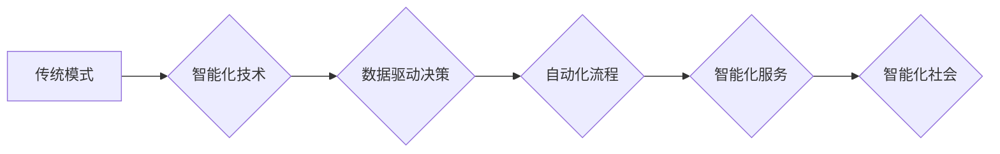

> 智能化、范式转换、人工智能、机器学习、深度学习、自动化、数据驱动

## 1. 背景介绍

在当今科技飞速发展的时代，智能化正在深刻地改变着我们生活的方方面面。从智能手机到自动驾驶汽车，从个性化推荐到医疗诊断，人工智能（AI）技术的应用日益广泛，并正在推动着社会经济的转型升级。

智能化范式转换是指以智能化技术为核心，对生产、生活、服务等各个领域进行全面革新的过程。这种转变不仅涉及到技术的进步，更重要的是对人类思维方式、工作模式和生活方式的根本改变。

## 2. 核心概念与联系

**2.1 智能化核心概念**

智能化是指赋予系统或设备以类似人类智能的能力，例如学习、推理、决策、感知和交互等。

**2.2 智能化范式转换**

智能化范式转换是指以智能化技术为核心，对生产、生活、服务等各个领域进行全面革新的过程。

**2.3 智能化技术架构**

智能化技术架构通常包括以下几个关键要素：

* **数据采集与处理:** 智能化系统需要大量的数据作为训练和运行的依据。数据采集、清洗、预处理等环节是智能化系统的基础。
* **机器学习与深度学习:** 机器学习和深度学习是智能化系统的核心算法，它们能够帮助系统从数据中学习规律，并进行预测、分类、识别等任务。
* **自然语言处理:** 自然语言处理技术能够使智能化系统理解和生成人类语言，从而实现人机交互。
* **计算机视觉:** 计算机视觉技术能够使智能化系统“看”世界，识别图像和视频中的物体、场景和行为。
* **云计算与大数据:** 云计算和大数据技术为智能化系统提供了强大的计算能力和存储空间，支持大规模数据处理和模型训练。

**2.4 智能化范式转换的流程图**



## 3. 核心算法原理 & 具体操作步骤

### 3.1 算法原理概述

机器学习算法是一种能够从数据中学习并不断改进的算法。它通过训练模型，使模型能够对输入数据进行预测或分类。常见的机器学习算法包括：

* **监督学习:** 利用标记数据训练模型，例如分类和回归问题。
* **无监督学习:** 利用未标记数据发现数据中的模式，例如聚类和降维。
* **强化学习:** 通过试错学习，使模型在特定环境中获得最大奖励。

### 3.2 算法步骤详解

**3.2.1 监督学习算法步骤:**

1. **数据收集和预处理:** 收集相关数据并进行清洗、转换、特征工程等预处理操作。
2. **模型选择:** 根据具体问题选择合适的监督学习算法，例如线性回归、逻辑回归、决策树、支持向量机等。
3. **模型训练:** 利用标记数据训练模型，调整模型参数，使模型能够准确预测或分类。
4. **模型评估:** 利用测试数据评估模型的性能，例如准确率、召回率、F1-score等。
5. **模型调优:** 根据评估结果，调整模型参数或选择其他算法，提高模型性能。
6. **模型部署:** 将训练好的模型部署到实际应用场景中，用于预测或分类新的数据。

**3.2.2 无监督学习算法步骤:**

1. **数据收集和预处理:** 收集相关数据并进行清洗、转换等预处理操作。
2. **模型选择:** 根据具体问题选择合适的无监督学习算法，例如k-means聚类、主成分分析等。
3. **模型训练:** 利用未标记数据训练模型，使模型能够发现数据中的模式。
4. **结果分析:** 分析模型训练的结果，例如聚类结果、降维后的特征等。

### 3.3 算法优缺点

**3.3.1 监督学习算法:**

* **优点:** 准确率高，能够解决分类和回归问题。
* **缺点:** 需要大量的标记数据，训练成本高。

**3.3.2 无监督学习算法:**

* **优点:** 不需要标记数据，能够发现数据中的潜在模式。
* **缺点:** 准确率相对较低，结果解释性较差。

### 3.4 算法应用领域

机器学习算法广泛应用于各个领域，例如：

* **图像识别:** 人脸识别、物体检测、图像分类等。
* **自然语言处理:** 文本分类、情感分析、机器翻译等。
* **推荐系统:** 商品推荐、内容推荐、用户画像等。
* **金融领域:** 风险评估、欺诈检测、信用评分等。
* **医疗领域:** 疾病诊断、药物研发、医疗影像分析等。

## 4. 数学模型和公式 & 详细讲解 & 举例说明

### 4.1 数学模型构建

机器学习算法通常基于数学模型，例如线性回归模型、逻辑回归模型、神经网络模型等。这些模型通过数学公式来描述数据之间的关系，并通过训练参数来拟合数据。

### 4.2 公式推导过程

例如，线性回归模型的数学公式如下：

$$
y = \theta_0 + \theta_1 x_1 + \theta_2 x_2 + ... + \theta_n x_n
$$

其中：

* $y$ 是预测值
* $\theta_0, \theta_1, ..., \theta_n$ 是模型参数
* $x_1, x_2, ..., x_n$ 是输入特征

通过最小化模型预测值与真实值的误差，可以求解出模型参数。

### 4.3 案例分析与讲解

例如，假设我们想要预测房屋价格，输入特征包括房屋面积、房间数量、地理位置等。我们可以使用线性回归模型来构建预测模型。通过训练模型，我们可以得到房屋价格与输入特征之间的关系，并利用该模型预测新房子的价格。

## 5. 项目实践：代码实例和详细解释说明

### 5.1 开发环境搭建

* Python 3.x
* TensorFlow 或 PyTorch 等深度学习框架
* Jupyter Notebook 或 VS Code 等代码编辑器

### 5.2 源代码详细实现

```python
import tensorflow as tf

# 定义模型结构
model = tf.keras.models.Sequential([
    tf.keras.layers.Dense(64, activation='relu', input_shape=(784,)),
    tf.keras.layers.Dense(10, activation='softmax')
])

# 编译模型
model.compile(optimizer='adam',
              loss='sparse_categorical_crossentropy',
              metrics=['accuracy'])

# 训练模型
model.fit(x_train, y_train, epochs=10)

# 评估模型
loss, accuracy = model.evaluate(x_test, y_test)
print('Test loss:', loss)
print('Test accuracy:', accuracy)
```

### 5.3 代码解读与分析

这段代码实现了简单的深度学习模型训练。

* `tf.keras.models.Sequential` 定义了一个顺序模型，即层级结构的模型。
* `tf.keras.layers.Dense` 定义了一个全连接层，每个神经元都连接到上一层的每个神经元。
* `activation='relu'` 指定了激活函数为ReLU函数，用于引入非线性。
* `input_shape=(784,)` 指定了输入数据的形状，这里假设输入数据为784维向量。
* `optimizer='adam'` 指定了优化算法为Adam算法，用于更新模型参数。
* `loss='sparse_categorical_crossentropy'` 指定了损失函数为稀疏类别交叉熵损失函数，用于分类问题。
* `metrics=['accuracy']` 指定了评估指标为准确率。
* `model.fit()` 函数用于训练模型，传入训练数据和训练轮数。
* `model.evaluate()` 函数用于评估模型，传入测试数据。

### 5.4 运行结果展示

训练完成后，可以查看模型的测试准确率，评估模型的性能。

## 6. 实际应用场景

智能化范式转换正在改变着各个领域的应用场景，例如：

### 6.1 制造业

* **智能工厂:** 利用传感器、机器学习等技术实现自动化生产、质量控制和预测维护。
* **协作机器人:** 与人类协同工作，提高生产效率和安全性。

### 6.2 医疗保健

* **疾病诊断:** 利用机器学习算法分析医疗影像和患者数据，辅助医生进行诊断。
* **个性化治疗:** 根据患者的基因信息和生活习惯，制定个性化的治疗方案。

### 6.3 金融服务

* **欺诈检测:** 利用机器学习算法识别异常交易行为，防止金融欺诈。
* **风险评估:** 利用机器学习算法评估客户的信用风险，为贷款和投资决策提供支持。

### 6.4 交通运输

* **自动驾驶:** 利用传感器、机器学习和计算机视觉技术实现车辆自动驾驶。
* **智能交通管理:** 利用大数据分析和预测模型优化交通流量，减少拥堵。

### 6.5 教育

* **个性化学习:** 根据学生的学习进度和能力，提供个性化的学习内容和教学方式。
* **智能评估:** 利用机器学习算法自动批改作业，提高评估效率。

## 7. 工具和资源推荐

### 7.1 学习资源推荐

* **在线课程:** Coursera、edX、Udacity 等平台提供丰富的机器学习和深度学习课程。
* **书籍:** 《深度学习》、《机器学习实战》等书籍是学习机器学习和深度学习的经典教材。
* **开源项目:** TensorFlow、PyTorch 等开源深度学习框架提供了丰富的学习资源和示例代码。

### 7.2 开发工具推荐

* **Python:** 机器学习和深度学习的编程语言。
* **Jupyter Notebook:** 用于编写和运行Python代码的交互式笔记本环境。
* **VS Code:** 功能强大的代码编辑器，支持Python和深度学习框架的开发。

### 7.3 相关论文推荐

* **《ImageNet Classification with Deep Convolutional Neural Networks》:** 
介绍了AlexNet模型，标志着深度学习在图像识别领域的突破。
* **《Attention Is All You Need》:** 
提出了Transformer模型， revolutionized natural language processing.

## 8. 总结：未来发展趋势与挑战

### 8.1 研究成果总结

智能化范式转换取得了显著的成果，人工智能技术在各个领域得到了广泛应用。

### 8.2 未来发展趋势

* **更强大的计算能力:** 量子计算、神经形态计算等新兴计算技术将推动人工智能算法的进一步发展。
* **更丰富的传感器数据:** 物联网、传感器技术的进步将为人工智能提供更丰富的数据源。
* **更智能的算法:** 迁移学习、联邦学习等新兴算法将提高人工智能算法的泛化能力和安全性。

### 8.3 面临的挑战

* **数据安全和隐私保护:** 人工智能算法依赖于大量数据，如何保障数据安全和隐私是重要的挑战。
* **算法可解释性和信任度:** 许多人工智能算法是黑箱模型，难以解释其决策过程，这降低了人们对人工智能的信任度。
* **伦理和社会影响:** 人工智能技术的发展可能带来一些伦理和社会问题，需要进行深入的思考和讨论。

### 8.4 研究展望

未来，人工智能技术将继续发展，并对人类社会产生更深远的影响。我们需要加强人工智能基础研究，探索人工智能的本质和边界，并积极应对人工智能带来的挑战，确保人工智能技术能够造福人类。

## 9. 附录：常见问题与解答

**9.1 什么是智能化？**

智能化是指赋予系统或设备以类似人类智能的能力，例如学习、推理、决策、感知和交互等。

**9.2 智能化范式转换有哪些特点？**

智能化范式转换的特点包括：

* 数据驱动决策
* 自动化流程
* 智能化服务
* 智能化社会

**9.3 机器学习算法有哪些？**

常见的机器学习算法包括：

* 监督学习
*