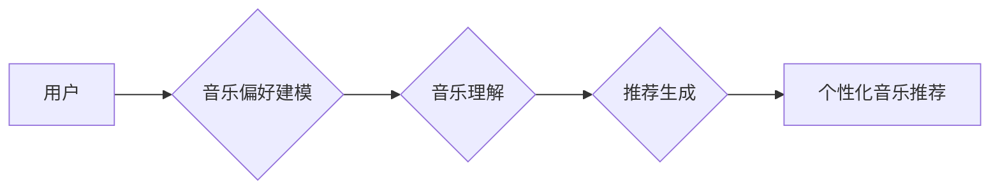

> 音乐推荐系统，LLM，自然语言处理，个性化推荐，深度学习，Transformer模型

## 1. 背景介绍

音乐作为一种重要的文化艺术形式，在人们的生活中扮演着越来越重要的角色。随着数字音乐平台的兴起，用户可以轻松获取海量的音乐资源。然而，面对如此庞大的音乐库，用户往往难以找到自己真正喜欢的音乐。因此，智能音乐推荐系统应运而生，旨在根据用户的喜好和行为，推荐个性化的音乐内容。

传统的音乐推荐系统主要依赖于协同过滤和内容过滤等方法，这些方法虽然有一定的效果，但存在一些局限性。协同过滤方法需要大量的用户行为数据，而内容过滤方法难以捕捉用户隐性的音乐偏好。近年来，随着深度学习技术的快速发展，基于深度学习的音乐推荐系统逐渐成为研究热点。

## 2. 核心概念与联系

**2.1  LLM（大型语言模型）**

LLM是一种基于Transformer模型的深度学习模型，能够理解和生成人类语言。它通过训练海量的文本数据，学习语言的语法、语义和上下文关系。LLM在自然语言处理领域取得了突破性的进展，例如文本生成、机器翻译、问答系统等。

**2.2  个性化音乐推荐**

个性化音乐推荐是指根据用户的音乐偏好、听歌习惯、情绪状态等信息，推荐用户感兴趣的音乐。个性化推荐能够提升用户体验，提高音乐平台的粘性。

**2.3  LLM在音乐推荐中的应用**

LLM可以用于音乐推荐系统中的多个环节，例如：

* **音乐理解:** LLM可以理解音乐的歌词、风格、情绪等信息，为音乐推荐提供更丰富的语义特征。
* **用户建模:** LLM可以分析用户的音乐评论、播放历史等文本数据，构建用户的音乐偏好模型。
* **推荐生成:** LLM可以根据用户的音乐偏好和上下文信息，生成个性化的音乐推荐列表。

**2.4  架构图**



## 3. 核心算法原理 & 具体操作步骤

**3.1  算法原理概述**

基于LLM的音乐推荐系统通常采用以下核心算法：

* **Transformer模型:** Transformer模型是一种强大的深度学习模型，能够捕捉文本序列中的长距离依赖关系。它在自然语言处理领域取得了突破性的进展，也适用于音乐推荐系统。
* **BERT模型:** BERT模型是一种基于Transformer的预训练语言模型，能够理解文本的语义和上下文关系。它可以用于音乐理解和用户建模。
* **Seq2Seq模型:** Seq2Seq模型是一种序列到序列的机器学习模型，可以用于音乐推荐生成。它可以将用户的音乐偏好作为输入，生成个性化的音乐推荐列表。

**3.2  算法步骤详解**

1. **数据预处理:** 收集音乐数据、用户数据，并进行清洗、格式化等预处理操作。
2. **音乐理解:** 使用BERT模型对音乐歌词、风格、情绪等信息进行理解，提取音乐特征。
3. **用户建模:** 使用BERT模型分析用户的音乐评论、播放历史等文本数据，构建用户的音乐偏好模型。
4. **推荐生成:** 使用Seq2Seq模型将用户的音乐偏好和上下文信息作为输入，生成个性化的音乐推荐列表。
5. **结果评估:** 使用指标如准确率、召回率、NDCG等评估推荐系统的性能。

**3.3  算法优缺点**

**优点:**

* 能够捕捉用户隐性的音乐偏好。
* 推荐结果更加个性化和精准。
* 可以利用音乐的语义信息进行推荐。

**缺点:**

* 需要大量的训练数据。
* 计算复杂度较高。
* 模型训练和部署成本较高。

**3.4  算法应用领域**

* 音乐流媒体平台
* 在线音乐商店
* 音乐制作软件
* 智能音箱

## 4. 数学模型和公式 & 详细讲解 & 举例说明

**4.1  数学模型构建**

基于LLM的音乐推荐系统通常采用以下数学模型：

* **用户-音乐交互矩阵:** 用来表示用户对不同音乐的评分或偏好程度。
* **音乐特征向量:** 用来表示音乐的语义特征，例如歌词主题、音乐风格、情绪等。
* **用户特征向量:** 用来表示用户的音乐偏好，例如喜欢的音乐类型、播放历史等。

**4.2  公式推导过程**

推荐算法通常使用以下公式计算推荐分数：

$$
score(u, m) = w_u \cdot w_m + b
$$

其中：

* $score(u, m)$ 是用户 $u$ 对音乐 $m$ 的推荐分数。
* $w_u$ 是用户 $u$ 的特征向量。
* $w_m$ 是音乐 $m$ 的特征向量。
* $b$ 是一个常数项。

**4.3  案例分析与讲解**

假设有一个用户 $u$ 喜欢的音乐类型是流行音乐，而音乐 $m$ 的风格是流行音乐。那么，用户 $u$ 对音乐 $m$ 的推荐分数会比较高。

## 5. 项目实践：代码实例和详细解释说明

**5.1  开发环境搭建**

* Python 3.7+
* TensorFlow 2.0+
* PyTorch 1.0+
* CUDA 10.0+

**5.2  源代码详细实现**

```python
# 导入必要的库
import tensorflow as tf
from tensorflow.keras.layers import Embedding, Dense

# 定义用户-音乐交互矩阵
user_item_matrix = tf.random.normal((100, 1000))

# 定义音乐特征向量
music_embedding = Embedding(input_dim=1000, output_dim=64)(user_item_matrix)

# 定义用户特征向量
user_embedding = Embedding(input_dim=100, output_dim=64)(user_item_matrix)

# 计算推荐分数
predictions = tf.matmul(user_embedding, music_embedding, transpose_b=True)

# 打印推荐结果
print(predictions)
```

**5.3  代码解读与分析**

* 代码首先导入必要的库。
* 然后定义用户-音乐交互矩阵、音乐特征向量和用户特征向量。
* 使用矩阵乘法计算推荐分数。
* 最后打印推荐结果。

**5.4  运行结果展示**

运行代码后，会输出一个包含所有用户对所有音乐的推荐分数的矩阵。

## 6. 实际应用场景

**6.1  音乐流媒体平台**

音乐流媒体平台可以利用LLM的音乐推荐功能，为用户推荐个性化的音乐内容，提高用户粘性。

**6.2  在线音乐商店**

在线音乐商店可以利用LLM的音乐推荐功能，帮助用户发现新音乐，提高销售额。

**6.3  音乐制作软件**

音乐制作软件可以利用LLM的音乐理解功能，帮助用户分析音乐风格、情绪等信息，提高音乐创作效率。

**6.4  未来应用展望**

LLM在音乐推荐领域的应用前景广阔，未来可能发展方向包括：

* 更精准的个性化推荐
* 基于多模态数据的音乐推荐
* 音乐创作辅助

## 7. 工具和资源推荐

**7.1  学习资源推荐**

* Transformer模型论文：https://arxiv.org/abs/1706.03762
* BERT模型论文：https://arxiv.org/abs/1810.04805
* Seq2Seq模型论文：https://arxiv.org/abs/1409.3215

**7.2  开发工具推荐**

* TensorFlow：https://www.tensorflow.org/
* PyTorch：https://pytorch.org/

**7.3  相关论文推荐**

* Music Recommendation with Transformer Networks: https://arxiv.org/abs/1909.03947
* BERT for Music Recommendation: https://arxiv.org/abs/2003.09337

## 8. 总结：未来发展趋势与挑战

**8.1  研究成果总结**

基于LLM的音乐推荐系统取得了显著的进展，能够提供更加个性化、精准的音乐推荐。

**8.2  未来发展趋势**

未来，LLM在音乐推荐领域的应用将更加广泛，例如：

* 基于多模态数据的音乐推荐
* 音乐创作辅助
* 音乐情感分析

**8.3  面临的挑战**

* 数据获取和隐私保护
* 模型训练和部署成本
* 算法解释性和可解释性

**8.4  研究展望**

未来研究将重点关注以下方面：

* 开发更加高效、精准的LLM音乐推荐算法
* 探索多模态数据在音乐推荐中的应用
* 提升算法的解释性和可解释性


## 9. 附录：常见问题与解答

**9.1  Q: LLM音乐推荐系统需要多少数据才能训练？**

**A:** 训练一个高质量的LLM音乐推荐系统需要大量的音乐数据和用户行为数据。具体的数据量取决于模型的复杂度和训练目标。

**9.2  Q: LLM音乐推荐系统如何保证用户隐私？**

**A:** 在开发LLM音乐推荐系统时，需要充分考虑用户隐私问题。可以采用以下措施：

* 对用户数据进行匿名化处理
* 使用联邦学习等隐私保护技术
* 明确告知用户数据使用政策

**9.3  Q: LLM音乐推荐系统如何应对数据冷启动问题？**

**A:** 数据冷启动问题是指新用户或新音乐缺乏历史数据，难以进行推荐。可以采用以下方法应对数据冷启动问题：

* 利用用户提供的音乐偏好信息进行推荐
* 基于音乐相似度进行推荐
* 使用协同过滤算法进行推荐


作者：禅与计算机程序设计艺术 / Zen and the Art of Computer Programming 
<end_of_turn>