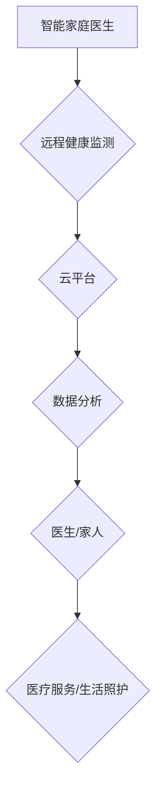

> 智能养老、远程健康监测、人工智能、机器学习、深度学习、物联网、云计算、智慧家庭

## 1. 背景介绍

随着全球人口老龄化进程的加速，养老服务需求日益增长。传统养老模式面临着人力资源短缺、服务质量参差不齐等问题。而人工智能（AI）、物联网（IoT）、云计算等新兴技术的快速发展为智慧养老提供了新的机遇。

智慧养老是指利用先进技术手段，为老年人提供个性化、智能化的养老服务，提升老年人的生活质量和健康水平。其中，智能家庭医生和远程健康监测是智慧养老的重要组成部分。

智能家庭医生是指利用人工智能技术，为老年人提供远程医疗咨询、健康管理、生活照护等服务。远程健康监测是指利用物联网技术，实时监测老年人的生理指标，并及时提醒医生或家人。

## 2. 核心概念与联系

**2.1 智能家庭医生**

智能家庭医生是一个集医疗咨询、健康管理、生活照护于一体的智能化服务平台。它利用自然语言处理（NLP）、机器学习（ML）等人工智能技术，能够理解和响应老年人的语音或文本指令，提供个性化的医疗建议、健康指导和生活帮助。

**2.2 远程健康监测**

远程健康监测系统通过传感器、物联网设备和云计算平台，实时采集老年人的生理数据，如血压、心率、血糖、体温等。这些数据将被传输到云端进行分析和处理，并根据预设的规则，及时提醒医生或家人，以便及时采取措施。

**2.3 核心概念架构**



**2.4 核心技术**

* **人工智能（AI）：** 自然语言处理（NLP）、机器学习（ML）、深度学习（DL）等技术，用于智能对话、健康风险评估、个性化服务等。
* **物联网（IoT）：** 传感器、物联网设备等，用于采集老年人的生理数据。
* **云计算：** 数据存储、处理、分析等，提供大数据支撑和服务平台。
* **大数据分析：** 挖掘老年人的健康数据，发现潜在的健康风险和个性化需求。

## 3. 核心算法原理 & 具体操作步骤

**3.1 算法原理概述**

智能家庭医生和远程健康监测系统中，常用的算法包括：

* **机器学习算法：** 用于预测老年人的健康风险、识别异常生理数据、个性化推荐健康方案等。常见的机器学习算法包括支持向量机（SVM）、决策树、随机森林、神经网络等。
* **深度学习算法：** 用于处理复杂的数据，例如图像识别、语音识别、自然语言理解等。深度学习算法可以从海量数据中学习更复杂的特征，提高算法的准确性和效率。
* **数据挖掘算法：** 用于挖掘老年人的健康数据，发现潜在的健康风险和个性化需求。常见的算法包括关联规则挖掘、聚类分析、分类分析等。

**3.2 算法步骤详解**

以机器学习算法为例，其基本步骤如下：

1. **数据收集：** 收集老年人的健康数据，包括生理指标、生活习惯、病史等。
2. **数据预处理：** 对收集到的数据进行清洗、转换、归一化等处理，使其适合机器学习算法的训练。
3. **模型选择：** 根据具体任务选择合适的机器学习算法。
4. **模型训练：** 使用训练数据训练机器学习模型，使其能够学习到数据中的规律。
5. **模型评估：** 使用测试数据评估模型的性能，例如准确率、召回率、F1-score等。
6. **模型部署：** 将训练好的模型部署到生产环境中，用于预测老年人的健康风险或提供个性化服务。

**3.3 算法优缺点**

* **优点：**
    * 可以自动学习和发现数据中的规律，提高预测准确率。
    * 可以处理海量数据，提供个性化服务。
    * 可以实时监测老年人的健康状况，及时提醒医生或家人。
* **缺点：**
    * 需要大量的训练数据，否则模型性能会下降。
    * 模型的解释性较差，难以理解模型的决策过程。
    * 算法本身存在一定的局限性，无法解决所有问题。

**3.4 算法应用领域**

* **健康风险预测：** 预测老年人的心血管疾病、糖尿病、癌症等风险。
* **疾病诊断辅助：** 辅助医生诊断老年人的疾病。
* **个性化健康管理：** 提供个性化的健康建议和生活指导。
* **远程医疗咨询：** 为老年人提供远程医疗咨询服务。
* **生活照护辅助：** 帮助老年人完成日常生活中的各种任务。

## 4. 数学模型和公式 & 详细讲解 & 举例说明

**4.1 数学模型构建**

在智能家庭医生系统中，我们可以使用数学模型来描述老年人的健康状态和风险。例如，我们可以使用以下公式来计算老年人的心血管疾病风险：

$$Risk = f(Age, BloodPressure, Cholesterol, SmokingHistory, FamilyHistory)$$

其中：

* Risk：心血管疾病风险
* Age：年龄
* BloodPressure：血压
* Cholesterol：胆固醇
* SmokingHistory：吸烟史
* FamilyHistory：家族病史

**4.2 公式推导过程**

该公式的推导过程需要基于大量的医学数据和统计分析。我们可以使用回归分析、逻辑回归等统计方法，根据老年人的各种特征，建立一个能够预测心血管疾病风险的数学模型。

**4.3 案例分析与讲解**

假设一个65岁的男性，他的血压为140/90 mmHg，胆固醇为240 mg/dL，有吸烟史，家族中有心血管疾病史。根据上述公式和训练好的模型，我们可以计算出他的心血管疾病风险为较高。

## 5. 项目实践：代码实例和详细解释说明

**5.1 开发环境搭建**

* 操作系统：Windows/Linux/macOS
* 编程语言：Python
* 框架：TensorFlow/PyTorch
* 库：NumPy、Pandas、Scikit-learn

**5.2 源代码详细实现**

```python
# 导入必要的库
import numpy as np
from sklearn.linear_model import LogisticRegression

# 加载训练数据
data = np.loadtxt("health_data.csv", delimiter=",")

# 分割数据为训练集和测试集
X_train, X_test, y_train, y_test = train_test_split(data[:, :-1], data[:, -1], test_size=0.2)

# 创建逻辑回归模型
model = LogisticRegression()

# 训练模型
model.fit(X_train, y_train)

# 评估模型性能
accuracy = model.score(X_test, y_test)
print("模型准确率:", accuracy)

# 使用模型预测新的数据
new_data = np.array([[65, 140, 90, 240, 1, 1]])
prediction = model.predict(new_data)
print("预测结果:", prediction)
```

**5.3 代码解读与分析**

* 该代码首先导入必要的库，然后加载训练数据。
* 数据被分割为训练集和测试集，用于训练和评估模型。
* 使用逻辑回归模型进行训练，并评估模型的准确率。
* 最后，使用训练好的模型预测新的数据。

**5.4 运行结果展示**

运行该代码后，会输出模型的准确率和预测结果。

## 6. 实际应用场景

**6.1 智能家庭医生应用场景**

* **远程医疗咨询：** 老年人可以通过智能家庭医生平台，与医生进行远程视频咨询，获得医疗建议和诊断。
* **健康管理：** 智能家庭医生可以根据老年人的健康数据，提供个性化的健康建议和生活指导，帮助他们预防和管理慢性疾病。
* **生活照护：** 智能家庭医生可以帮助老年人完成日常生活中的各种任务，例如提醒服药、预约医生、叫车等。

**6.2 远程健康监测应用场景**

* **慢性病管理：** 远程健康监测系统可以实时监测老年人的血糖、血压、心率等指标，帮助医生及时发现异常情况，并进行干预。
* **跌倒预警：** 远程健康监测系统可以利用传感器监测老年人的活动轨迹，一旦发现跌倒情况，及时报警。
* **居家养老：** 远程健康监测系统可以帮助老年人安全地居家养老，减少对子女的负担。

**6.4 未来应用展望**

随着人工智能、物联网、云计算等技术的不断发展，智能家庭医生和远程健康监测系统将更加智能化、个性化、便捷化。未来，它们将能够提供更全面的健康服务，帮助老年人更好地生活。

## 7. 工具和资源推荐

**7.1 学习资源推荐**

* **在线课程：** Coursera、edX、Udacity等平台提供人工智能、机器学习、深度学习等方面的在线课程。
* **书籍：** 《深度学习》、《机器学习实战》、《Python机器学习》等书籍。
* **博客和论坛：** 机器学习社区、深度学习社区等平台提供丰富的学习资源和讨论。

**7.2 开发工具推荐**

* **编程语言：** Python
* **框架：** TensorFlow、PyTorch
* **库：** NumPy、Pandas、Scikit-learn
* **云平台：** AWS、Azure、Google Cloud

**7.3 相关论文推荐**

* **深度学习在医疗保健中的应用：** https://arxiv.org/abs/1706.03762
* **机器学习在远程健康监测中的应用：** https://arxiv.org/abs/1803.01947

## 8. 总结：未来发展趋势与挑战

**8.1 研究成果总结**

近年来，智能家庭医生和远程健康监测系统取得了显著的进展，为智慧养老提供了新的解决方案。

**8.2 未来发展趋势**

* **更智能化：** 利用更先进的人工智能算法，提高系统的智能化水平，能够更好地理解和响应老年人的需求。
* **更个性化：** 基于大数据分析，提供更个性化的健康服务，满足不同老年人的需求。
* **更便捷化：** 利用物联网技术，实现更便捷的设备连接和数据传输，提高用户体验。

**8.3 面临的挑战**

* **数据安全和隐私保护：** 老年人的健康数据非常敏感，需要采取有效的措施保障数据安全和隐私。
* **算法的解释性和可信度：** 人工智能算法的决策过程往往难以理解，需要提高算法的解释性和可信度，才能获得老年人的信任。
* **技术成本和普及率：** 智能家庭医生和远程健康监测系统需要较高的技术成本，需要降低成本，提高普及率。

**8.4 研究展望**

未来，我们需要继续加强对智能家庭医生和远程健康监测系统的研究，解决上述挑战，推动其在智慧养老领域的应用，为老年人提供更优质的健康服务。

## 9. 附录：常见问题与解答

**9.1 如何保证数据安全和隐私保护？**

* 使用加密技术保护数据传输和存储。
* 严格控制数据访问权限，只允许授权人员访问数据。
* 遵守相关法律法规，保护老年人的个人信息。

**9.2 如何提高算法的解释性和可信度？**

* 使用可解释的机器学习算法，例如决策树、规则模型等。
* 对模型的决策过程进行可视化，帮助用户理解模型的决策逻辑。
* 通过大量的测试和验证，提高模型的准确性和可靠性。

**9.3 智能家庭医生和远程健康监测系统的价格是多少？**

* 智能家庭医生和远程健康监测系统的价格因功能、品牌、配置等因素而异，一般在几百到几千元不等