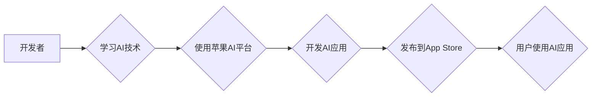

> 苹果、AI应用、开发者、机器学习、深度学习、自然语言处理、计算机视觉、软件开发

## 1. 背景介绍

近年来，人工智能（AI）技术飞速发展，已渗透到生活的方方面面。苹果公司作为科技巨头，也积极拥抱AI，并将其融入到其产品和服务中。2023年，苹果发布了一系列AI应用，为开发者提供了丰富的开发工具和资源，旨在推动AI应用的创新和发展。

苹果发布AI应用的开发者，意味着一个新的时代来临。开发者将有机会利用苹果强大的硬件平台和软件生态系统，开发出更智能、更便捷、更人性化的AI应用。

## 2. 核心概念与联系

### 2.1 AI应用的本质

AI应用的核心是利用机器学习算法，使计算机能够从数据中学习，并根据学习到的知识完成特定的任务。

### 2.2 苹果AI平台

苹果为开发者提供了丰富的AI平台和工具，包括：

* **Core ML:** 用于将机器学习模型集成到iOS、iPadOS、macOS和watchOS应用程序中的框架。
* **Create ML:** 一个用户友好的工具，允许开发者使用拖放界面构建机器学习模型。
* **Metal Performance Shaders:** 用于加速机器学习模型在GPU上的执行的框架。
* **Vision Framework:** 提供图像识别、物体检测、人脸识别等计算机视觉功能的框架。
* **Natural Language Framework:** 提供自然语言处理功能，例如文本分类、情感分析、机器翻译等。

### 2.3 开发者生态系统

苹果拥有庞大的开发者生态系统，包括数百万的开发者和丰富的开发资源。开发者可以利用这些资源，学习AI技术，开发AI应用，并将其发布到App Store。

**Mermaid 流程图**



## 3. 核心算法原理 & 具体操作步骤

### 3.1 算法原理概述

机器学习算法的核心是通过训练模型，使模型能够从数据中学习规律，并根据学习到的规律进行预测或分类。常见的机器学习算法包括：

* **监督学习:** 利用标记数据训练模型，例如分类和回归问题。
* **无监督学习:** 利用未标记数据训练模型，例如聚类和降维问题。
* **强化学习:** 通过奖励和惩罚机制训练模型，例如游戏和机器人控制问题。

### 3.2 算法步骤详解

**以监督学习为例，其基本步骤如下：**

1. **数据收集和预处理:** 收集相关数据，并进行清洗、转换和特征工程等预处理操作。
2. **模型选择:** 根据具体问题选择合适的机器学习算法模型。
3. **模型训练:** 利用训练数据训练模型，调整模型参数，使模型能够准确地预测或分类。
4. **模型评估:** 利用测试数据评估模型的性能，例如准确率、召回率、F1-score等。
5. **模型部署:** 将训练好的模型部署到实际应用场景中。

### 3.3 算法优缺点

不同的机器学习算法具有不同的优缺点，需要根据具体问题选择合适的算法。

### 3.4 算法应用领域

机器学习算法广泛应用于各个领域，例如：

* **图像识别:** 人脸识别、物体检测、图像分类等。
* **自然语言处理:** 文本分类、情感分析、机器翻译等。
* **推荐系统:** 商品推荐、内容推荐等。
* **医疗诊断:** 疾病预测、影像分析等。
* **金融风险控制:** 欺诈检测、信用评分等。

## 4. 数学模型和公式 & 详细讲解 & 举例说明

### 4.1 数学模型构建

机器学习算法通常基于数学模型，例如线性回归、逻辑回归、支持向量机等。这些模型通过数学公式来描述数据之间的关系。

### 4.2 公式推导过程

例如，线性回归模型的数学公式如下：

$$
y = \theta_0 + \theta_1 x_1 + \theta_2 x_2 + ... + \theta_n x_n
$$

其中：

* $y$ 是预测值
* $\theta_0, \theta_1, ..., \theta_n$ 是模型参数
* $x_1, x_2, ..., x_n$ 是输入特征

通过最小化模型预测值与真实值的误差，可以求解出模型参数。

### 4.3 案例分析与讲解

例如，假设我们想要预测房屋价格，输入特征包括房屋面积、房间数量、地理位置等。我们可以使用线性回归模型来构建预测模型。通过训练模型，我们可以得到模型参数，并利用这些参数预测新房子的价格。

## 5. 项目实践：代码实例和详细解释说明

### 5.1 开发环境搭建

开发AI应用需要准备相应的开发环境，例如：

* **macOS:** 苹果官方推荐的开发平台。
* **Xcode:** 苹果官方的集成开发环境。
* **Python:** 广泛使用的编程语言，用于机器学习算法开发。
* **TensorFlow/PyTorch:** 常用的机器学习框架。

### 5.2 源代码详细实现

以下是一个使用Core ML框架开发图像分类应用的代码示例：

```swift
import CoreML
import Vision

// 加载Core ML模型
let model = try! MobileNetV2(configuration: MLModelConfiguration())

// 创建图像请求
let request = VNCoreMLRequest(model: model) { (request, error) in
    // 处理请求结果
    if let results = request.results as? [VNClassificationObservation] {
        // 打印预测结果
        for result in results {
            print("\$result.identifier) - \$result.confidence)")
        }
    }
}

// 创建图像处理请求
let handler = VNImageRequestHandler(cgImage: image.cgImage!)

// 执行图像请求
try! handler.perform([request])
```

### 5.3 代码解读与分析

这段代码首先加载了MobileNetV2模型，这是一个预训练的图像分类模型。然后，它创建了一个图像请求，并将模型应用于图像。当请求完成时，它会返回预测结果，包括预测类别和置信度。

### 5.4 运行结果展示

运行这段代码后，将显示图像中预测的类别和置信度。例如，如果图像中包含一只猫，则输出结果可能为“cat - 0.95”。

## 6. 实际应用场景

### 6.1 图像识别

* **医疗诊断:** 利用图像识别技术，辅助医生诊断疾病，例如癌症检测、眼底病变识别等。
* **安防监控:** 利用图像识别技术，识别违禁物品、陌生人等，提高安防水平。
* **自动驾驶:** 利用图像识别技术，识别道路标志、车辆、行人等，辅助自动驾驶系统决策。

### 6.2 自然语言处理

* **智能客服:** 利用自然语言处理技术，构建智能客服系统，自动回复用户问题，提高客户服务效率。
* **机器翻译:** 利用自然语言处理技术，实现不同语言之间的机器翻译，打破语言障碍。
* **文本摘要:** 利用自然语言处理技术，自动生成文本摘要，节省用户阅读时间。

### 6.3 其他应用场景

* **个性化推荐:** 利用机器学习算法，根据用户的行为数据，推荐个性化的商品、内容等。
* **欺诈检测:** 利用机器学习算法，识别欺诈交易，保护用户财产安全。
* **金融风险控制:** 利用机器学习算法，评估金融风险，降低金融机构的损失。

### 6.4 未来应用展望

随着AI技术的不断发展，其应用场景将更加广泛，例如：

* **医疗保健:** AI将帮助医生进行更精准的诊断和治疗，提高医疗效率和质量。
* **教育:** AI将个性化学习体验，帮助学生更好地掌握知识。
* **娱乐:** AI将创造更沉浸式的娱乐体验，例如虚拟现实、增强现实等。

## 7. 工具和资源推荐

### 7.1 学习资源推荐

* **苹果官方文档:** https://developer.apple.com/documentation/
* **机器学习在线课程:** Coursera、edX、Udacity等平台提供丰富的机器学习在线课程。
* **机器学习书籍:** 《深入理解机器学习》、《Python机器学习实战》等。

### 7.2 开发工具推荐

* **Xcode:** 苹果官方的集成开发环境。
* **TensorFlow:** 常用的机器学习框架。
* **PyTorch:** 常用的机器学习框架。
* **Jupyter Notebook:** 用于机器学习代码开发和可视化分析的工具。

### 7.3 相关论文推荐

* **《ImageNet Classification with Deep Convolutional Neural Networks》:** https://arxiv.org/abs/1202.1038
* **《Attention Is All You Need》:** https://arxiv.org/abs/1706.03762

## 8. 总结：未来发展趋势与挑战

### 8.1 研究成果总结

苹果发布AI应用的开发者，标志着AI技术进入了一个新的发展阶段。开发者将有机会利用苹果强大的平台和资源，开发出更智能、更便捷、更人性化的AI应用，推动AI技术在各个领域的应用。

### 8.2 未来发展趋势

* **模型规模和性能提升:** AI模型将变得更大、更强大，能够处理更复杂的任务。
* **边缘计算的兴起:** AI模型将部署到边缘设备，实现更快速的响应和更低的延迟。
* **AI伦理和安全:** 随着AI技术的应用越来越广泛，AI伦理和安全问题将变得更加重要。

### 8.3 面临的挑战

* **数据获取和隐私保护:** AI模型的训练需要大量数据，如何获取高质量数据并保护用户隐私是一个挑战。
* **算法可解释性和公平性:** AI模型的决策过程往往难以理解，如何提高算法的可解释性和公平性是一个重要问题。
* **人才短缺:** AI领域人才需求量大，如何培养更多AI人才是一个挑战。

### 8.4 研究展望

未来，AI技术将继续发展，并对我们的生活产生更深远的影响。开发者需要不断学习和探索，开发出更创新、更实用的AI应用，为人类社会创造更多价值。

## 9. 附录：常见问题与解答

### 9.1 如何选择合适的AI算法？

选择合适的AI算法需要根据具体问题和数据特点进行分析。例如，对于分类问题，可以考虑使用逻辑回归、支持向量机等算法；对于回归问题，可以考虑使用线性回归、决策树等算法。

### 9.2 如何评估AI模型的性能？

常用的AI模型性能评估指标包括准确率、召回率、F1-score、AUC等。选择合适的评估指标需要根据具体问题和业务需求进行考虑。

### 9.3 如何部署AI模型？

AI模型的部署方式多种多样，例如部署到云服务器、边缘设备、移动设备等。选择合适的部署方式需要根据模型的规模、性能需求和应用场景进行考虑。


作者：禅与计算机程序设计艺术 / Zen and the Art of Computer Programming 
<end_of_turn>