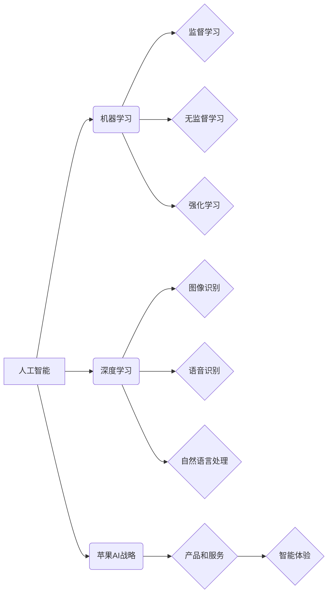

> 苹果, AI, 应用趋势, 机器学习, 深度学习, 自然语言处理, 计算机视觉, 人工智能伦理

## 1. 背景介绍

近年来，人工智能（AI）技术飞速发展，已渗透到生活的方方面面。苹果公司作为科技巨头，也积极布局AI领域，并将其融入到产品和服务中。从Siri语音助手到Face ID人脸识别，苹果已在多个领域应用AI技术，取得了显著成果。

李开复，作为一位享誉全球的人工智能专家，对苹果在AI领域的布局和发展趋势有着深刻的洞察。他认为，苹果未来将更加注重AI应用的场景化和个性化，并将AI技术融入到更多产品和服务中，打造更加智能、便捷的用户体验。

## 2. 核心概念与联系

### 2.1  人工智能（AI）

人工智能是指模拟人类智能行为的计算机系统。它涵盖了多个领域，包括机器学习、深度学习、自然语言处理、计算机视觉等。

### 2.2  机器学习（ML）

机器学习是人工智能的一个重要分支，它通过算法学习数据，从数据中发现规律，并做出预测或决策。机器学习算法可以分为监督学习、无监督学习和强化学习三种类型。

### 2.3  深度学习（DL）

深度学习是机器学习的一个子领域，它使用多层神经网络来模拟人类大脑的学习过程。深度学习算法能够处理海量数据，并提取出复杂的特征，在图像识别、语音识别、自然语言处理等领域取得了突破性进展。

### 2.4  苹果的AI战略

苹果的AI战略的核心是将AI技术融入到产品和服务中，为用户提供更加智能、便捷的体验。苹果在AI领域拥有强大的技术实力和丰富的资源，包括强大的芯片、海量数据和优秀的工程师团队。

**核心概念与联系流程图**



## 3. 核心算法原理 & 具体操作步骤

### 3.1  算法原理概述

深度学习算法的核心是多层神经网络。神经网络由多个层组成，每层包含多个神经元。神经元之间通过连接进行信息传递，每个连接都有一个权重。通过训练，神经网络可以学习到这些权重的最佳值，从而实现对数据的学习和预测。

### 3.2  算法步骤详解

1. **数据预处理:** 将原始数据进行清洗、转换和特征提取，使其适合深度学习算法的训练。
2. **网络结构设计:** 根据任务需求设计神经网络的结构，包括层数、神经元数量和激活函数等。
3. **参数初始化:** 为神经网络的参数（权重和偏置）进行随机初始化。
4. **前向传播:** 将输入数据通过神经网络进行前向传播，得到输出结果。
5. **损失函数计算:** 计算输出结果与真实值的差异，即损失函数的值。
6. **反向传播:** 将损失函数的梯度反向传播到神经网络的各个层，更新参数的值。
7. **迭代训练:** 重复步骤4-6，直到损失函数达到预设的阈值。

### 3.3  算法优缺点

**优点:**

* 能够处理海量数据，提取出复杂的特征。
* 在图像识别、语音识别、自然语言处理等领域取得了突破性进展。

**缺点:**

* 训练数据量大，训练时间长。
* 对硬件资源要求高。
* 算法的可解释性较差。

### 3.4  算法应用领域

深度学习算法广泛应用于各个领域，包括：

* **计算机视觉:** 图像识别、物体检测、图像分割、人脸识别等。
* **语音识别:** 语音转文本、语音助手等。
* **自然语言处理:** 文本分类、情感分析、机器翻译等。
* **推荐系统:** 商品推荐、内容推荐等。
* **医疗诊断:** 病情诊断、疾病预测等。

## 4. 数学模型和公式 & 详细讲解 & 举例说明

### 4.1  数学模型构建

深度学习算法的核心是多层神经网络。神经网络可以看作是一个复杂的数学模型，其输出结果可以通过一系列的数学运算得到。

### 4.2  公式推导过程

神经网络的输出结果可以通过以下公式计算：

$$
y = f(W^L x^L + b^L)
$$

其中：

* $y$ 是神经网络的输出结果。
* $f$ 是激活函数。
* $W^L$ 是第L层的权重矩阵。
* $x^L$ 是第L层的输入向量。
* $b^L$ 是第L层的偏置向量。

### 4.3  案例分析与讲解

假设我们有一个简单的两层神经网络，用于分类手写数字。

* 输入层：784个神经元，对应于MNIST数据集中的图像像素。
* 隐藏层：128个神经元。
* 输出层：10个神经元，对应于0-9的数字类别。

我们可以使用反向传播算法训练这个神经网络，使其能够准确地识别手写数字。

## 5. 项目实践：代码实例和详细解释说明

### 5.1  开发环境搭建

为了实现深度学习项目，我们需要搭建一个合适的开发环境。常用的开发环境包括：

* **Python:** 深度学习的编程语言。
* **TensorFlow/PyTorch:** 深度学习框架。
* **GPU:** 加速深度学习训练的硬件。

### 5.2  源代码详细实现

以下是一个使用TensorFlow实现手写数字分类的简单代码示例：

```python
import tensorflow as tf

# 定义模型
model = tf.keras.models.Sequential([
    tf.keras.layers.Flatten(input_shape=(28, 28)),
    tf.keras.layers.Dense(128, activation='relu'),
    tf.keras.layers.Dense(10, activation='softmax')
])

# 编译模型
model.compile(optimizer='adam',
              loss='sparse_categorical_crossentropy',
              metrics=['accuracy'])

# 训练模型
model.fit(x_train, y_train, epochs=5)

# 评估模型
loss, accuracy = model.evaluate(x_test, y_test)
print('Test loss:', loss)
print('Test accuracy:', accuracy)
```

### 5.3  代码解读与分析

这段代码定义了一个简单的两层神经网络，并使用TensorFlow框架进行训练和评估。

* `tf.keras.models.Sequential` 创建了一个顺序模型，即层级结构。
* `tf.keras.layers.Flatten` 将输入图像数据展平为一维向量。
* `tf.keras.layers.Dense` 定义全连接层，其中`activation`参数指定激活函数。
* `model.compile` 编译模型，指定优化器、损失函数和评估指标。
* `model.fit` 训练模型，传入训练数据和训练轮数。
* `model.evaluate` 评估模型，传入测试数据。

### 5.4  运行结果展示

训练完成后，我们可以使用测试数据评估模型的性能。输出结果会显示测试集上的损失值和准确率。

## 6. 实际应用场景

### 6.1  智能助手

深度学习算法可以用于构建更加智能的语音助手，例如Siri、Alexa和Google Assistant。这些助手可以理解用户的自然语言指令，并执行相应的操作，例如播放音乐、设置闹钟、查询天气等。

### 6.2  图像识别

深度学习算法可以用于识别图像中的物体、场景和人物。这在许多领域都有应用，例如自动驾驶、医疗诊断、安防监控等。

### 6.3  自然语言处理

深度学习算法可以用于处理自然语言，例如文本分类、情感分析、机器翻译等。这在许多领域都有应用，例如搜索引擎、社交媒体、客户服务等。

### 6.4  未来应用展望

随着深度学习算法的不断发展，其应用场景将更加广泛。未来，深度学习将应用于更多领域，例如：

* **个性化推荐:** 根据用户的兴趣和行为，提供更加个性化的产品和服务推荐。
* **医疗诊断:** 辅助医生进行疾病诊断，提高诊断准确率。
* **教育:** 提供个性化的学习方案，帮助学生更好地掌握知识。
* **金融:** 识别欺诈行为，提高金融安全。

## 7. 工具和资源推荐

### 7.1  学习资源推荐

* **课程:**
    * 深度学习 Specialization (Coursera)
    * fast.ai
    * TensorFlow 官方教程
* **书籍:**
    * 深度学习 (Ian Goodfellow)
    * 构建深度学习模型 (François Chollet)
* **博客:**
    * The Gradient
    * Towards Data Science

### 7.2  开发工具推荐

* **TensorFlow:** 开源深度学习框架。
* **PyTorch:** 开源深度学习框架。
* **Keras:** 高级深度学习API，可以运行在TensorFlow、Theano或CNTK上。

### 7.3  相关论文推荐

* **ImageNet Classification with Deep Convolutional Neural Networks (AlexNet)**
* **Deep Residual Learning for Image Recognition (ResNet)**
* **Attention Is All You Need (Transformer)**

## 8. 总结：未来发展趋势与挑战

### 8.1  研究成果总结

近年来，深度学习算法取得了显著的进展，在图像识别、语音识别、自然语言处理等领域取得了突破性成果。这些成果推动了人工智能技术的快速发展，并应用于越来越多的领域。

### 8.2  未来发展趋势

* **模型规模和复杂度提升:** 未来深度学习模型将更加庞大，包含更多的参数和层数，从而提高模型的表达能力和泛化能力。
* **数据驱动的学习:** 深度学习算法将更加依赖于海量数据，数据质量和数据多样性将成为更加重要的因素。
* **跨模态学习:** 深度学习模型将能够处理多种模态的数据，例如文本、图像、音频等，从而实现更加智能的交互和理解。
* **可解释性增强:** 研究人员将更加关注深度学习模型的可解释性，以便更好地理解模型的决策过程。

### 8.3  面临的挑战

* **数据隐私和安全:** 深度学习算法依赖于海量数据，如何保护数据隐私和安全是一个重要的挑战。
* **算法偏见:** 深度学习算法可能存在偏见，例如性别、种族等方面的偏见，需要采取措施解决这个问题。
* **计算资源需求:** 训练大型深度学习模型需要大量的计算资源，这对于资源有限的机构和个人来说是一个挑战。

### 8.4  研究展望

未来，深度学习研究将继续朝着更加智能、高效、可解释的方向发展。研究人员将探索新的算法、新的模型架构和新的应用场景，推动人工智能技术的进步。

## 9. 附录：常见问题与解答

### 9.1  什么是深度学习？

深度学习是一种机器学习的子领域，它使用多层神经网络来模拟人类大脑的学习过程。

### 9.2  深度学习有哪些应用？

深度学习应用广泛，包括图像识别、语音识别、自然语言处理、推荐系统等。

### 9.3  如何学习深度学习？

可以通过在线课程、书籍、博客等方式学习深度学习。

### 9.4  深度学习有哪些挑战？

深度学习面临着数据隐私、算法偏见、计算资源需求等挑战。

### 9.5  深度学习的未来发展趋势？

深度学习将朝着更加智能、高效、可解释的方向发展。


作者：禅与计算机程序设计艺术 / Zen and the Art of Computer Programming 
<end_of_turn>