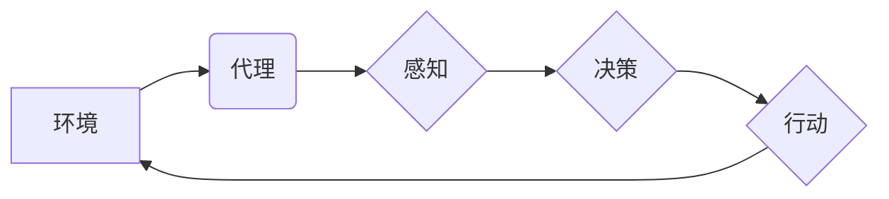

> 代理系统、复杂应用、智能化、分布式系统、机器学习

## 1. 背景介绍

在当今科技日新月异的时代，软件系统越来越复杂，传统的单一架构难以满足对灵活性和可扩展性的需求。代理系统 (Agents) 作为一种新的软件架构模式，逐渐成为构建复杂应用的热门选择。代理系统由自主、智能的个体组成，这些个体能够感知环境、做出决策并执行行动，从而实现复杂任务的分解和协同完成。

代理系统在各个领域都有着广泛的应用，例如：

* **电子商务**: 智能购物助手，根据用户的需求推荐商品，并自动完成购买流程。
* **金融**: 金融风险管理系统，通过分析市场数据和用户行为，识别潜在风险并采取相应的措施。
* **医疗**: 智能诊断系统，根据患者的症状和病史，辅助医生进行诊断和治疗方案制定。
* **工业自动化**: 智能机器人，能够自主完成生产线上的各种任务，提高生产效率和降低成本。

## 2. 核心概念与联系

代理系统是一个由多个智能个体组成的分布式系统，每个个体都具有以下特征：

* **自主性**: 代理能够独立地感知环境、做出决策并执行行动。
* **智能性**: 代理能够通过学习和推理，提高其决策和行动的效率。
* **交互性**: 代理能够与其他代理和环境进行交互，协同完成任务。
* **目标导向性**: 代理拥有明确的目标，并努力通过其行动来实现目标。

**代理系统架构**



## 3. 核心算法原理 & 具体操作步骤

### 3.1  算法原理概述

代理系统中常用的算法包括：

* **搜索算法**: 用于在状态空间中寻找最优路径或解。例如，A* 算法、深度优先搜索算法等。
* **决策树算法**: 用于将决策问题转化为树形结构，并通过学习数据来构建决策树模型。
* **强化学习算法**: 用于训练代理在环境中学习最优策略，通过奖励和惩罚机制来引导代理的行为。例如，Q 学习算法、SARSA 算法等。

### 3.2  算法步骤详解

以强化学习算法为例，其基本步骤如下：

1. **环境建模**: 建立代理与环境的交互模型，定义状态空间、动作空间和奖励函数。
2. **策略初始化**: 初始化代理的策略，例如随机策略或贪婪策略。
3. **环境交互**: 代理与环境进行交互，根据当前状态选择动作，并获得环境的反馈（奖励和下一个状态）。
4. **策略更新**: 根据获得的反馈，更新代理的策略，使其在未来能够选择更优的动作。
5. **重复步骤3-4**: 重复上述步骤，直到代理的策略收敛或达到预设的目标。

### 3.3  算法优缺点

**优点**:

* 可以学习复杂的决策策略，适应动态变化的环境。
* 不需要事先定义所有规则，能够自动发现最优策略。

**缺点**:

* 训练过程可能需要大量的数据和计算资源。
* 难以解释代理的决策过程，缺乏可解释性。

### 3.4  算法应用领域

强化学习算法广泛应用于以下领域：

* **游戏**: 训练游戏 AI，例如 AlphaGo、AlphaStar 等。
* **机器人**: 训练机器人进行自主导航、抓取等任务。
* **推荐系统**: 训练推荐系统，根据用户的行为和偏好推荐个性化内容。

## 4. 数学模型和公式 & 详细讲解 & 举例说明

### 4.1  数学模型构建

代理系统可以抽象为一个马尔可夫决策过程 (MDP)，其数学模型包括：

* **状态空间 S**: 所有可能的系统状态的集合。
* **动作空间 A**: 代理可以执行的动作的集合。
* **转移概率矩阵 P**: 描述从一个状态到另一个状态的概率分布。
* **奖励函数 R**: 描述代理在每个状态执行每个动作获得的奖励。
* **折扣因子 γ**: 控制未来奖励的权重。

### 4.2  公式推导过程

强化学习的目标是找到一个最优策略 π，使得代理在与环境交互的过程中获得最大的累积奖励。最优策略可以利用 Bellman 方程进行推导：

$$
V^*(s) = \max_a \sum_{s'} P(s'|s,a) [R(s,a,s') + \gamma V^*(s')]
$$

其中：

* $V^*(s)$ 是状态 $s$ 的最优价值函数。
* $a$ 是代理在状态 $s$ 可以执行的动作。
* $s'$ 是状态 $s$ 执行动作 $a$ 后可能到达的状态。
* $R(s,a,s')$ 是代理在状态 $s$ 执行动作 $a$ 后到达状态 $s'$ 获得的奖励。

### 4.3  案例分析与讲解

例如，训练一个代理玩游戏，我们可以将游戏状态定义为游戏画面，动作定义为游戏角色可以执行的操作，奖励函数定义为获得分数或完成任务的奖励。通过强化学习算法，代理可以学习到最优策略，从而在游戏中获得更高的分数或完成任务。

## 5. 项目实践：代码实例和详细解释说明

### 5.1  开发环境搭建

* Python 3.x
* TensorFlow 或 PyTorch 等深度学习框架
* OpenAI Gym 等强化学习环境

### 5.2  源代码详细实现

```python
import gym
import tensorflow as tf

# 定义代理网络
class Agent(tf.keras.Model):
    def __init__(self):
        super(Agent, self).__init__()
        self.dense1 = tf.keras.layers.Dense(64, activation='relu')
        self.dense2 = tf.keras.layers.Dense(32, activation='relu')
        self.output = tf.keras.layers.Dense(env.action_space.n)

    def call(self, state):
        x = self.dense1(state)
        x = self.dense2(x)
        return self.output(x)

# 创建代理实例
agent = Agent()

# 定义训练函数
def train(env, agent, epochs=100):
    for epoch in range(epochs):
        state = env.reset()
        done = False
        while not done:
            # 选择动作
            action = agent(tf.expand_dims(state, axis=0))[0]
            # 执行动作
            next_state, reward, done, _ = env.step(action)
            # 更新代理网络
            # ...

# 训练代理
train(env, agent)

# 测试代理
state = env.reset()
while True:
    # 选择动作
    action = agent(tf.expand_dims(state, axis=0))[0]
    # 执行动作
    next_state, reward, done, _ = env.step(action)
    # 更新状态
    state = next_state
    # 显示游戏画面
    # ...
    if done:
        break
```

### 5.3  代码解读与分析

* 代码首先定义了代理网络，使用多层感知机 (MLP) 结构。
* 然后创建代理实例，并定义训练函数。
* 训练函数使用强化学习算法，例如 Q 学习算法，更新代理网络的权重。
* 最后，测试代理在环境中执行任务。

### 5.4  运行结果展示

运行代码后，代理将在环境中执行任务，并根据奖励函数的反馈进行学习。随着训练的进行，代理的性能会逐渐提高。

## 6. 实际应用场景

### 6.1  智能客服系统

代理系统可以构建智能客服系统，自动回答用户常见问题，并根据用户需求提供个性化服务。

### 6.2  个性化推荐系统

代理系统可以构建个性化推荐系统，根据用户的行为和偏好推荐个性化商品或内容。

### 6.3  自动驾驶系统

代理系统可以构建自动驾驶系统，通过感知环境信息，做出驾驶决策，实现自动驾驶功能。

### 6.4  未来应用展望

代理系统在未来将有更广泛的应用，例如：

* **医疗诊断**: 智能诊断系统，辅助医生进行疾病诊断和治疗方案制定。
* **金融风险管理**: 智能风险管理系统，识别和应对金融风险。
* **工业自动化**: 智能机器人，提高生产效率和降低成本。

## 7. 工具和资源推荐

### 7.1  学习资源推荐

* **书籍**:
    * 《代理系统》
    * 《人工智能：现代方法》
* **在线课程**:
    * Coursera: 强化学习
    * Udacity: 自动驾驶

### 7.2  开发工具推荐

* **Python**: 广泛用于代理系统开发。
* **TensorFlow**: 深度学习框架，用于训练代理网络。
* **PyTorch**: 深度学习框架，用于训练代理网络。
* **OpenAI Gym**: 强化学习环境，用于训练代理系统。

### 7.3  相关论文推荐

* **Sutton, R. S., & Barto, A. G. (2018). Reinforcement learning: An introduction.**
* **Mnih, V., Kavukcuoglu, K., Silver, D., Rusu, A. A., Veness, J., Bellemare, M. G., ... & Hassabis, D. (2015). Human-level control through deep reinforcement learning.**

## 8. 总结：未来发展趋势与挑战

### 8.1  研究成果总结

代理系统研究取得了显著进展，在各个领域都有着广泛的应用。

### 8.2  未来发展趋势

* **更智能的代理**: 利用深度学习等技术，训练更智能的代理，使其能够更好地理解环境和做出更优的决策。
* **更协同的代理**: 研究代理之间的协作机制，实现更复杂的协同任务。
* **更安全可靠的代理**: 研究代理系统的安全性和可靠性，确保其在实际应用中能够安全可靠地运行。

### 8.3  面临的挑战

* **代理的解释性**: 强化学习算法难以解释代理的决策过程，缺乏可解释性。
* **代理的鲁棒性**: 代理系统在面对未知环境或异常情况时，可能表现出不稳定性。
* **代理的安全性**: 代理系统可能被恶意攻击，导致系统崩溃或数据泄露。

### 8.4  研究展望

未来，代理系统研究将继续朝着更智能、更协同、更安全可靠的方向发展。


## 9. 附录：常见问题与解答

**Q1: 代理系统与传统软件架构有什么区别？**

**A1:** 代理系统是一种分布式系统，由多个自主的智能个体组成，而传统软件架构通常是集中式的，由一个主程序控制所有功能。

**Q2: 如何选择合适的强化学习算法？**

**A2:** 选择合适的强化学习算法取决于具体的应用场景和任务需求。例如，对于离散动作空间的任务，可以使用 Q 学习算法；对于连续动作空间的任务，可以使用策略梯度算法。

**Q3: 如何评估代理系统的性能？**

**A3:** 代理系统的性能可以根据任务目标进行评估，例如，在游戏环境中，可以评估代理获得的分数；在推荐系统中，可以评估推荐的准确性和用户满意度。


作者：禅与计算机程序设计艺术 / Zen and the Art of Computer Programming 
<end_of_turn>