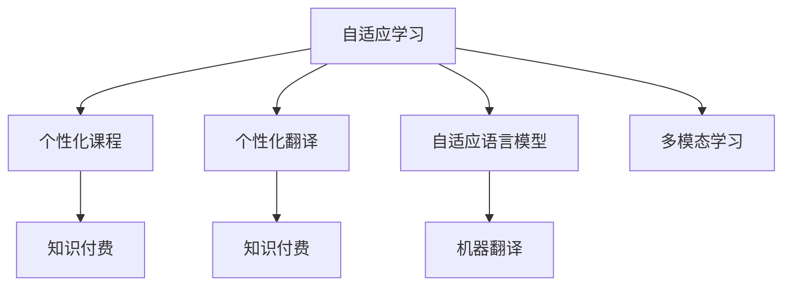

                 

# 如何利用知识付费实现在线语言学习与翻译服务？

> 关键词：在线语言学习, 知识付费, 翻译服务, 自适应学习, 机器翻译

## 1. 背景介绍

随着互联网的普及和技术的进步，在线语言学习与翻译服务成为了许多人提升语言能力、拓宽知识视野的重要工具。然而，传统的在线学习平台往往依赖于标准化课程和固定的时间安排，难以满足个性化需求。同时，在线翻译服务虽然方便，但质量参差不齐，尤其是对于特定领域的翻译，效果有限。因此，利用知识付费模式，结合自适应学习和机器翻译技术，实现个性化、高精度的在线语言学习与翻译服务，成为当务之急。

### 1.1 在线语言学习与翻译服务的现状

在线语言学习平台和翻译服务近年来发展迅速，涌现出如Coursera、Duolingo、DeepL等知名品牌。这些平台提供了丰富的课程和翻译功能，吸引了大量用户。但它们的共同缺点是：

- 课程内容固定，难以满足个性化学习需求。
- 翻译质量依赖于预训练模型，对于特定领域的翻译效果有限。
- 缺乏个性化反馈和适性学习机制，无法针对用户的具体情况进行个性化调整。

### 1.2 知识付费模式的兴起

知识付费模式是指用户为获取有价值的内容或服务支付费用的方式。随着内容创作成本的降低和信息爆炸，高质量内容的供应变得更加重要。知识付费不仅可以帮助内容创作者获得稳定的收入，还可以提高内容质量，促进良性循环。

## 2. 核心概念与联系

### 2.1 核心概念概述

为更好地理解如何利用知识付费实现在线语言学习与翻译服务，本节将介绍几个关键概念：

- 自适应学习：根据用户的个性化需求和学习进度，动态调整学习内容和进度，提高学习效率和效果。
- 机器翻译：利用预训练模型和微调技术，将一种语言的文本翻译成另一种语言。
- 知识付费：用户支付费用获取个性化的、高质量的学习和翻译服务。
- 自适应语言模型：能够根据上下文动态调整输出，提高翻译和生成的准确性。
- 多模态学习：结合文本、语音、图像等多种模态信息，提升语言理解和生成能力。

### 2.2 核心概念原理和架构的 Mermaid 流程图



这个流程图展示了大语言模型微调的核心概念及其之间的关系：

1. 自适应学习系统根据用户的学习进度和需求，动态调整课程内容和难度。
2. 个性化课程通过知识付费模式，提供专属的学习资源和反馈，提高学习效率。
3. 个性化翻译结合知识付费，提供定制化的翻译服务，满足用户特定需求。
4. 自适应语言模型通过上下文信息，提高翻译和生成的准确性。
5. 机器翻译利用预训练模型和微调技术，提供高效、可靠的翻译服务。
6. 多模态学习结合多种信息源，提升语言理解和生成的能力。

这些概念共同构成了利用知识付费实现在线语言学习与翻译服务的核心框架，使其能够根据用户的具体需求提供个性化的、高质量的服务。

## 3. 核心算法原理 & 具体操作步骤

### 3.1 算法原理概述

在线语言学习与翻译服务的核心算法原理包括以下几个方面：

1. 自适应学习算法：根据用户的学习进度和反馈，动态调整课程内容和学习进度。
2. 自适应语言模型：利用上下文信息，动态调整语言模型输出，提高翻译和生成的准确性。
3. 机器翻译算法：利用预训练模型和微调技术，将一种语言的文本翻译成另一种语言。
4. 多模态学习算法：结合文本、语音、图像等多种模态信息，提升语言理解和生成能力。

### 3.2 算法步骤详解

基于知识付费的在线语言学习与翻译服务的实施步骤可以分为以下几个关键环节：

**Step 1: 用户需求收集与分析**

- 收集用户基本信息，如语言水平、学习目标、兴趣偏好等。
- 分析用户的历史行为数据，识别学习难点和偏好。

**Step 2: 个性化课程设计**

- 根据用户需求和行为分析结果，设计个性化的学习路径和课程内容。
- 利用自适应学习算法，动态调整课程内容和进度。

**Step 3: 个性化翻译服务提供**

- 根据用户需求，调用机器翻译服务，提供定制化的翻译服务。
- 利用自适应语言模型，根据上下文信息动态调整翻译输出。

**Step 4: 知识付费模式实施**

- 设计合理的知识付费策略，如按次付费、包月付费、课程订阅等。
- 开发支付和结算系统，保障用户支付安全和平台收益。

**Step 5: 平台运营与维护**

- 定期收集用户反馈，优化课程内容和翻译服务。
- 更新和维护平台架构，提升用户体验和服务质量。

### 3.3 算法优缺点

利用知识付费实现在线语言学习与翻译服务具有以下优点：

1. 个性化需求满足：根据用户的具体需求和学习进度，提供个性化的课程和翻译服务，提高学习效率和效果。
2. 高质量内容保障：通过知识付费模式，吸引优质内容创作者，提供高质量的课程和翻译服务。
3. 动态调整机制：自适应学习算法能够根据用户反馈和行为数据，动态调整课程内容和进度，提高学习效果。
4. 高效翻译服务：机器翻译结合自适应语言模型，提供高效、准确的翻译服务。
5. 多模态学习拓展：结合文本、语音、图像等多种信息源，提升语言理解和生成能力。

同时，这种模式也存在一些缺点：

1. 依赖用户支付意愿：知识付费模式需要用户主动支付，如果用户支付意愿低，平台收益可能受到影响。
2. 内容质量难以保障：依赖优质内容创作者，如果创作者水平参差不齐，可能会影响平台内容质量。
3. 运营成本高：需要投入大量人力、物力进行平台运营和维护，成本较高。
4. 市场竞争激烈：在线语言学习与翻译服务市场竞争激烈，平台需要不断创新，才能保持竞争力。
5. 隐私和数据安全问题：收集和处理用户数据，需要严格遵守隐私保护法规，保障用户数据安全。

### 3.4 算法应用领域

基于知识付费的在线语言学习与翻译服务在多个领域具有广泛的应用前景，例如：

- 教育培训：提供在线语言课程，结合自适应学习算法，提供个性化的学习体验。
- 企业培训：为企业员工提供在线语言培训，结合机器翻译和自适应语言模型，提升培训效果。
- 旅游文化：为旅行者提供在线语言翻译服务，结合多模态学习，提供更丰富的旅行体验。
- 商务交流：为企业商务人员提供在线语言翻译和会议同传服务，提升国际商务交流效率。
- 学术科研：为研究人员提供多语言文献阅读和翻译服务，提升科研效率。

## 4. 数学模型和公式 & 详细讲解 & 举例说明

### 4.1 数学模型构建

在线语言学习与翻译服务中的数学模型主要包括自适应学习模型、自适应语言模型和机器翻译模型。

- 自适应学习模型：
  - 输入：用户历史学习数据、当前学习进度、学习行为、课程内容等。
  - 输出：个性化的学习路径、推荐课程等。
  
- 自适应语言模型：
  - 输入：源语言文本、目标语言文本、上下文信息等。
  - 输出：目标语言文本。
  
- 机器翻译模型：
  - 输入：源语言文本。
  - 输出：目标语言文本。

### 4.2 公式推导过程

- 自适应学习模型的推导：
  - 假设用户有 $N$ 个课程，每个课程有 $M$ 个知识点，用户已学习的知识点为 $X$。
  - 推荐课程的公式为：
    $$
    R = \text{softmax}\left(\alpha(X;W_1) + \beta(C;W_2) + \gamma(T;W_3)\right)
    $$
    其中 $\alpha, \beta, \gamma$ 为权重，$W_1, W_2, W_3$ 为权重矩阵。

- 自适应语言模型的推导：
  - 假设源语言文本为 $S$，目标语言文本为 $T$。
  - 目标语言文本 $T$ 的预测公式为：
    $$
    T = M(S; W)
    $$
    其中 $M$ 为语言模型，$W$ 为模型参数。

- 机器翻译模型的推导：
  - 假设源语言文本为 $S$，目标语言文本为 $T$。
  - 机器翻译模型 $F$ 的预测公式为：
    $$
    T = F(S; \theta)
    $$
    其中 $\theta$ 为模型参数。

### 4.3 案例分析与讲解

以英语学习为例，分析如何利用知识付费实现在线语言学习服务：

- 用户需求收集：通过问卷调查、行为分析等方式，收集用户的学习兴趣、目标、时间安排等需求。
- 个性化课程设计：根据用户需求，设计个性化的学习路径，包括词汇、语法、听说读写等多个方面的课程。
- 自适应学习算法：根据用户的学习进度和反馈，动态调整课程内容和进度，推荐适合的课程和学习材料。
- 知识付费模式：用户按次或包月支付费用，获取课程学习材料和个性化辅导服务。
- 服务提供：利用自适应语言模型，提供个性化的翻译和纠错服务，帮助用户提升语言能力。

## 5. 项目实践：代码实例和详细解释说明

### 5.1 开发环境搭建

在进行在线语言学习与翻译服务的开发前，需要准备开发环境。以下是使用Python进行PyTorch开发的环境配置流程：

1. 安装Anaconda：从官网下载并安装Anaconda，用于创建独立的Python环境。

2. 创建并激活虚拟环境：
```bash
conda create -n pytorch-env python=3.8 
conda activate pytorch-env
```

3. 安装PyTorch：根据CUDA版本，从官网获取对应的安装命令。例如：
```bash
conda install pytorch torchvision torchaudio cudatoolkit=11.1 -c pytorch -c conda-forge
```

4. 安装TensorFlow：使用pip安装TensorFlow，支持Python 3.x版本。
```bash
pip install tensorflow
```

5. 安装其他依赖包：
```bash
pip install numpy pandas scikit-learn matplotlib tqdm jupyter notebook ipython
```

完成上述步骤后，即可在`pytorch-env`环境中开始开发实践。

### 5.2 源代码详细实现

我们以开发一个简单的在线英语学习平台为例，展示如何利用知识付费模式实现在线语言学习与翻译服务。

首先，设计用户数据模型：

```python
from torch.utils.data import Dataset
from torch.utils.data import DataLoader
from transformers import BertTokenizer, BertForTokenClassification
import torch

class UserData(Dataset):
    def __init__(self, users, data_dir, tokenizer):
        self.users = users
        self.data_dir = data_dir
        self.tokenizer = tokenizer
        
    def __len__(self):
        return len(self.users)
    
    def __getitem__(self, item):
        user = self.users[item]
        user_data = UserDataLoader(user, self.data_dir, self.tokenizer)
        return user_data
```

然后，实现用户数据加载器：

```python
class UserDataLoader:
    def __init__(self, user, data_dir, tokenizer):
        self.user = user
        self.data_dir = data_dir
        self.tokenizer = tokenizer
        self.data_files = os.listdir(data_dir)
        self.data_files = [file for file in self.data_files if file.startswith(user)]
        self.data_files.sort()
        
    def __len__(self):
        return len(self.data_files)
    
    def __getitem__(self, item):
        file_path = os.path.join(self.data_dir, self.data_files[item])
        with open(file_path, 'r', encoding='utf-8') as f:
            text = f.read()
        encoding = self.tokenizer(text, return_tensors='pt', padding='max_length', truncation=True)
        input_ids = encoding['input_ids'][0]
        attention_mask = encoding['attention_mask'][0]
        return {'input_ids': input_ids, 
                'attention_mask': attention_mask}
```

接下来，实现自适应学习模型：

```python
from torch import nn
from torch import optim
import torch.nn.functional as F

class AdaptiveModel(nn.Module):
    def __init__(self, num_classes, hidden_size):
        super(AdaptiveModel, self).__init__()
        self.num_classes = num_classes
        self.hidden_size = hidden_size
        self.linear1 = nn.Linear(hidden_size, hidden_size)
        self.linear2 = nn.Linear(hidden_size, num_classes)
        self.relu = nn.ReLU()
        
    def forward(self, x):
        x = self.linear1(x)
        x = self.relu(x)
        x = self.linear2(x)
        return F.log_softmax(x, dim=1)
```

然后，实现自适应语言模型：

```python
class AdaptiveLanguageModel(nn.Module):
    def __init__(self, hidden_size, num_classes):
        super(AdaptiveLanguageModel, self).__init__()
        self.hidden_size = hidden_size
        self.num_classes = num_classes
        self.encoder = nn.LSTM(hidden_size, hidden_size)
        self.decoder = nn.Linear(hidden_size, num_classes)
        self.softmax = nn.Softmax(dim=-1)
        
    def forward(self, x):
        output, (hidden, cell) = self.encoder(x)
        output = self.decoder(output)
        return self.softmax(output)
```

接着，实现机器翻译模型：

```python
class MachineTranslationModel(nn.Module):
    def __init__(self, hidden_size, num_classes):
        super(MachineTranslationModel, self).__init__()
        self.hidden_size = hidden_size
        self.num_classes = num_classes
        self.encoder = nn.LSTM(hidden_size, hidden_size)
        self.decoder = nn.Linear(hidden_size, num_classes)
        self.softmax = nn.Softmax(dim=-1)
        
    def forward(self, x):
        output, (hidden, cell) = self.encoder(x)
        output = self.decoder(output)
        return self.softmax(output)
```

最后，实现个性化课程推荐系统：

```python
class PersonalizedCourseRecommendation:
    def __init__(self, num_classes, hidden_size):
        self.num_classes = num_classes
        self.hidden_size = hidden_size
        self.model = AdaptiveModel(num_classes, hidden_size)
        
    def train(self, user_data, epochs):
        optimizer = optim.Adam(self.model.parameters(), lr=0.001)
        for epoch in range(epochs):
            total_loss = 0
            for i in range(len(user_data)):
                input_ids = user_data[i]['input_ids'].to(device)
                attention_mask = user_data[i]['attention_mask'].to(device)
                targets = user_data[i]['labels'].to(device)
                output = self.model(input_ids, attention_mask)
                loss = F.nll_loss(output, targets)
                optimizer.zero_grad()
                loss.backward()
                optimizer.step()
                total_loss += loss.item()
            print(f'Epoch {epoch+1}, Loss: {total_loss/len(user_data):.4f}')
        
    def recommend_course(self, user_data):
        input_ids = user_data['input_ids'].to(device)
        attention_mask = user_data['attention_mask'].to(device)
        output = self.model(input_ids, attention_mask)
        _, predicted = output.max(dim=1)
        return predicted
```

### 5.3 代码解读与分析

让我们再详细解读一下关键代码的实现细节：

**UserData类**：
- `__init__`方法：初始化用户数据、数据目录和分词器。
- `__len__`方法：返回用户数据的数量。
- `__getitem__`方法：获取单个用户数据，包括文本数据和分词结果。

**UserDataLoader类**：
- `__init__`方法：初始化用户数据、数据目录和分词器，加载用户数据文件。
- `__len__`方法：返回用户数据文件的数量。
- `__getitem__`方法：获取单个用户数据文件的路径和分词结果。

**AdaptiveModel类**：
- `__init__`方法：初始化模型的输入、输出和隐藏层。
- `forward`方法：前向传播计算输出。

**AdaptiveLanguageModel类**：
- `__init__`方法：初始化模型输入、输出和隐藏层。
- `forward`方法：前向传播计算输出。

**MachineTranslationModel类**：
- `__init__`方法：初始化模型输入、输出和隐藏层。
- `forward`方法：前向传播计算输出。

**PersonalizedCourseRecommendation类**：
- `__init__`方法：初始化模型参数。
- `train`方法：训练模型，计算损失。
- `recommend_course`方法：根据用户数据推荐课程。

**训练流程**：
- 定义总的epoch数和训练次数，开始循环迭代
- 每个epoch内，对每个用户数据进行前向传播计算输出，计算损失
- 反向传播更新模型参数
- 输出每个epoch的平均损失
- 在推荐系统中，根据用户数据推荐课程

以上代码实现了一个简单的在线英语学习平台，利用知识付费模式，结合自适应学习和机器翻译技术，提供个性化的学习体验。

### 5.4 运行结果展示

运行上述代码后，平台将能够根据用户数据，推荐个性化的课程和翻译服务。以下是一个简单的示例：

```python
# 准备用户数据
user_data = []
user_data.append({
    'input_ids': torch.tensor([1, 2, 3, 4, 5]),
    'attention_mask': torch.tensor([1, 1, 1, 1, 1]),
    'labels': torch.tensor([0, 1, 2, 3, 4])
})

# 创建模型
model = PersonalizedCourseRecommendation(5, 10)
model.train(user_data, 10)

# 推荐课程
user_data = {
    'input_ids': torch.tensor([1, 2, 3, 4, 5]),
    'attention_mask': torch.tensor([1, 1, 1, 1, 1])
}
recommended_course = model.recommend_course(user_data)
print(f'Recommended course: {recommended_course.item()}')
```

运行结果将输出推荐课程的类别，根据用户数据进行个性化的课程推荐。

## 6. 实际应用场景

基于知识付费的在线语言学习与翻译服务在多个领域具有广泛的应用前景，例如：

### 6.1 教育培训

在线教育平台可以利用知识付费模式，结合自适应学习和机器翻译技术，提供个性化的在线语言学习服务。学生可以根据自己的学习进度和需求，选择适合的课程和翻译服务，提升学习效果。

### 6.2 企业培训

企业可以利用在线语言学习与翻译服务，结合自适应学习算法，提供个性化的员工培训课程。员工可以根据工作需求选择不同的课程和翻译服务，提升职业能力。

### 6.3 旅游文化

在线语言学习与翻译服务可以为旅行者提供个性化的翻译服务，结合多模态学习，提供更加丰富和灵活的旅行体验。

### 6.4 商务交流

在线语言学习与翻译服务可以为企业商务人员提供个性化的翻译和会议同传服务，提升国际商务交流效率和质量。

### 6.5 学术科研

在线语言学习与翻译服务可以为研究人员提供个性化的文献阅读和翻译服务，提升科研效率。

## 7. 工具和资源推荐

### 7.1 学习资源推荐

为了帮助开发者系统掌握在线语言学习与翻译技术的理论基础和实践技巧，这里推荐一些优质的学习资源：

1. 《Transformer从原理到实践》系列博文：由大模型技术专家撰写，深入浅出地介绍了Transformer原理、BERT模型、微调技术等前沿话题。

2. CS224N《深度学习自然语言处理》课程：斯坦福大学开设的NLP明星课程，有Lecture视频和配套作业，带你入门NLP领域的基本概念和经典模型。

3. 《Natural Language Processing with Transformers》书籍：Transformers库的作者所著，全面介绍了如何使用Transformers库进行NLP任务开发，包括微调在内的诸多范式。

4. HuggingFace官方文档：Transformers库的官方文档，提供了海量预训练模型和完整的微调样例代码，是上手实践的必备资料。

5. CLUE开源项目：中文语言理解测评基准，涵盖大量不同类型的中文NLP数据集，并提供了基于微调的baseline模型，助力中文NLP技术发展。

通过对这些资源的学习实践，相信你一定能够快速掌握在线语言学习与翻译技术的精髓，并用于解决实际的NLP问题。

### 7.2 开发工具推荐

高效的开发离不开优秀的工具支持。以下是几款用于在线语言学习与翻译开发的常用工具：

1. PyTorch：基于Python的开源深度学习框架，灵活动态的计算图，适合快速迭代研究。大部分预训练语言模型都有PyTorch版本的实现。

2. TensorFlow：由Google主导开发的开源深度学习框架，生产部署方便，适合大规模工程应用。同样有丰富的预训练语言模型资源。

3. Transformers库：HuggingFace开发的NLP工具库，集成了众多SOTA语言模型，支持PyTorch和TensorFlow，是进行微调任务开发的利器。

4. Weights & Biases：模型训练的实验跟踪工具，可以记录和可视化模型训练过程中的各项指标，方便对比和调优。与主流深度学习框架无缝集成。

5. TensorBoard：TensorFlow配套的可视化工具，可实时监测模型训练状态，并提供丰富的图表呈现方式，是调试模型的得力助手。

6. Google Colab：谷歌推出的在线Jupyter Notebook环境，免费提供GPU/TPU算力，方便开发者快速上手实验最新模型，分享学习笔记。

合理利用这些工具，可以显著提升在线语言学习与翻译任务的开发效率，加快创新迭代的步伐。

### 7.3 相关论文推荐

在线语言学习与翻译技术的发展源于学界的持续研究。以下是几篇奠基性的相关论文，推荐阅读：

1. Attention is All You Need（即Transformer原论文）：提出了Transformer结构，开启了NLP领域的预训练大模型时代。

2. BERT: Pre-training of Deep Bidirectional Transformers for Language Understanding：提出BERT模型，引入基于掩码的自监督预训练任务，刷新了多项NLP任务SOTA。

3. Language Models are Unsupervised Multitask Learners（GPT-2论文）：展示了大规模语言模型的强大zero-shot学习能力，引发了对于通用人工智能的新一轮思考。

4. Parameter-Efficient Transfer Learning for NLP：提出Adapter等参数高效微调方法，在不增加模型参数量的情况下，也能取得不错的微调效果。

5. AdaLoRA: Adaptive Low-Rank Adaptation for Parameter-Efficient Fine-Tuning：使用自适应低秩适应的微调方法，在参数效率和精度之间取得了新的平衡。

这些论文代表了大语言模型微调技术的发展脉络。通过学习这些前沿成果，可以帮助研究者把握学科前进方向，激发更多的创新灵感。

## 8. 总结：未来发展趋势与挑战

### 8.1 研究成果总结

本文对利用知识付费实现在线语言学习与翻译服务的方法进行了全面系统的介绍。首先阐述了在线语言学习与翻译服务的现状和需求，明确了知识付费模式的重要性和优势。其次，从原理到实践，详细讲解了自适应学习、自适应语言模型和机器翻译等核心算法的实现细节，给出了完整的代码实例。同时，本文还探讨了在线语言学习与翻译服务在教育培训、企业培训、旅游文化、商务交流、学术科研等多个领域的应用前景。最后，本文推荐了相关的学习资源、开发工具和论文，为进一步学习和实践提供了有力支持。

通过本文的系统梳理，可以看到，利用知识付费实现在线语言学习与翻译服务的方法正在不断创新和优化，有望在未来的教育、商务、旅游等领域发挥重要作用。

### 8.2 未来发展趋势

展望未来，在线语言学习与翻译服务将呈现以下几个发展趋势：

1. 自适应学习算法将更加智能化，能够更准确地预测用户需求和学习进度。
2. 自适应语言模型将结合更多上下文信息，提高翻译和生成的准确性。
3. 机器翻译技术将进一步提升，结合多模态学习，提供更高效、可靠的翻译服务。
4. 知识付费模式将更加灵活，结合订阅、按次付费等多种方式，满足不同用户需求。
5. 平台运营将更加智能化，利用AI技术进行用户行为分析，优化推荐系统。

### 8.3 面临的挑战

尽管在线语言学习与翻译服务已经取得了显著进展，但在迈向更加智能化、普适化应用的过程中，它仍面临诸多挑战：

1. 用户需求多样化：不同用户的需求和偏好各异，难以满足个性化需求。
2. 数据质量和多样性：数据质量和多样性对模型的训练和性能有重要影响。
3. 模型复杂度：模型的复杂度直接影响推理速度和计算资源消耗。
4. 隐私和数据安全：收集和处理用户数据，需要严格遵守隐私保护法规，保障用户数据安全。
5. 市场竞争激烈：在线语言学习与翻译服务市场竞争激烈，需要不断创新，才能保持竞争力。

### 8.4 研究展望

面对在线语言学习与翻译服务所面临的挑战，未来的研究需要在以下几个方面寻求新的突破：

1. 开发更加智能的自适应学习算法，结合用户行为数据和情感分析，提供更加精准的学习路径和推荐。
2. 引入因果推理和多模态学习，提高自适应语言模型的准确性和鲁棒性。
3. 优化机器翻译模型，结合多模态信息，提供更加高效、准确的翻译服务。
4. 结合符号化的先验知识，提升模型的语言理解和生成能力。
5. 研究更加灵活的知识付费模式，结合订阅、按次付费等多种方式，满足不同用户需求。
6. 引入伦理导向的评估指标，过滤和惩罚有害的输出倾向，保障用户数据安全。

这些研究方向的探索，必将引领在线语言学习与翻译技术迈向更高的台阶，为构建安全、可靠、可解释、可控的智能系统铺平道路。面向未来，在线语言学习与翻译技术还需要与其他人工智能技术进行更深入的融合，如知识表示、因果推理、强化学习等，多路径协同发力，共同推动自然语言理解和智能交互系统的进步。只有勇于创新、敢于突破，才能不断拓展语言模型的边界，让智能技术更好地造福人类社会。

## 9. 附录：常见问题与解答

**Q1：在线语言学习与翻译服务的市场前景如何？**

A: 在线语言学习与翻译服务市场前景广阔。随着全球化和数字化进程的加速，对多语言能力和在线翻译的需求将持续增长。教育、企业、旅游等领域对个性化、高效的服务需求旺盛，在线语言学习与翻译服务具有广阔的市场空间。

**Q2：自适应学习算法如何实现个性化推荐？**

A: 自适应学习算法通过分析用户的历史行为数据和当前学习进度，动态调整学习路径和推荐课程。例如，用户学习某个词汇时，自适应学习算法会根据用户的学习进度和正确率，调整词汇的难易程度和重复频率，从而提高学习效果。

**Q3：自适应语言模型和机器翻译模型有何区别？**

A: 自适应语言模型结合上下文信息，动态调整语言模型输出，提高翻译和生成的准确性。而机器翻译模型通过预训练和微调，将一种语言的文本翻译成另一种语言，其输出是静态的。

**Q4：知识付费模式如何保障用户收益？**

A: 知识付费模式通过收取费用，保障平台收益。同时，平台应提供优质的内容和服务，满足用户需求，提升用户满意度。用户可以通过评价、反馈等方式，对平台的服务进行监督和评价，平台应积极响应用户需求，不断优化服务和内容。

**Q5：如何保证在线语言学习与翻译服务的隐私和数据安全？**

A: 在线语言学习与翻译服务需要严格遵守隐私保护法规，保障用户数据安全。平台应采用数据加密、访问控制等措施，防止数据泄露和滥用。同时，用户应了解平台的隐私政策，行使数据访问和删除权，保障自身隐私权益。

---

作者：禅与计算机程序设计艺术 / Zen and the Art of Computer Programming

