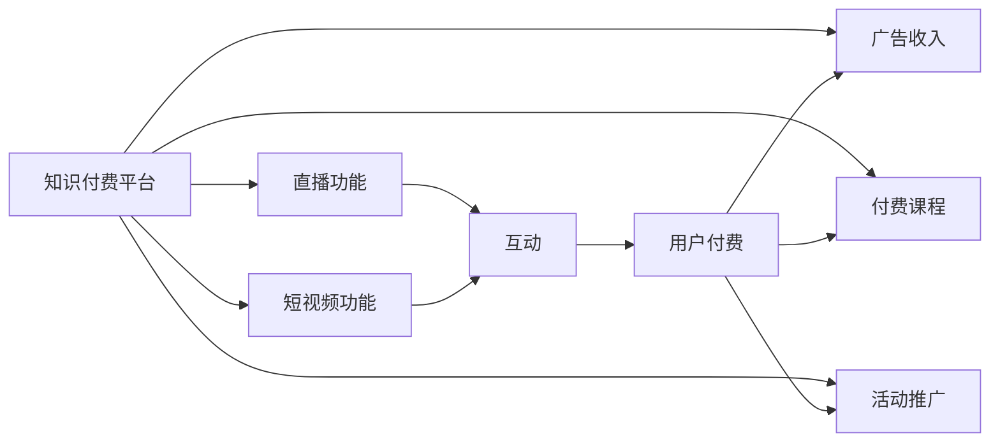

                 

# 如何利用知识付费实现直播与短视频营销？

> 关键词：知识付费,直播,短视频,营销,技术手段,用户体验,ROI

## 1. 背景介绍

在互联网时代，信息过载成为常态，用户获取有价值知识的需求日益强烈。知识付费平台的兴起，恰好迎合了这一需求，以优质内容和专业服务吸引用户付费。然而，传统的图文内容形式越来越难以满足用户的娱乐和互动需求，特别是对于年轻用户，视频和直播内容更具吸引力。直播与短视频的兴起，为知识付费平台提供了新的发展方向，也带来了诸多挑战和机遇。

本文将从知识付费平台的角度出发，探讨如何利用直播与短视频技术，提升用户参与度，提高营销效果，同时提高用户满意度，实现商业变现。文章将从核心概念、核心算法原理、具体操作步骤、数学模型等方面深入分析，并提供详细的项目实践案例。

## 2. 核心概念与联系

### 2.1 核心概念概述

要利用知识付费平台实现直播与短视频营销，首先需要理解以下几个核心概念：

- **知识付费平台**：以提供高质量知识内容为核心，通过订阅、打赏、课程购买等方式变现的互联网平台。

- **直播**：通过实时视频流传输技术，将主播和观众即时连接起来，实现双向互动的在线直播形式。

- **短视频**：时长在1分钟到5分钟之间，内容丰富、形式多样的视频内容。

- **营销**：利用广告、宣传、推广等手段，提升品牌知名度和商业价值。

这些概念之间的联系体现在直播与短视频作为新兴内容形式，为知识付费平台提供了更多营销手段和用户互动渠道。通过优化直播和短视频内容，提升用户体验，从而提高用户付费意愿和平台商业变现能力。

### 2.2 核心概念原理和架构的 Mermaid 流程图(Mermaid 流程节点中不要有括号、逗号等特殊字符)



## 3. 核心算法原理 & 具体操作步骤

### 3.1 算法原理概述

利用直播与短视频实现知识付费营销的核心算法原理可以概括为以下几步：

1. **用户行为分析**：通过数据分析平台，收集用户的行为数据，如观看时长、互动频次、付费意愿等，识别出潜在的高价值用户。
2. **内容推荐算法**：根据用户行为数据和历史观看记录，构建推荐模型，为用户推荐最相关、最感兴趣的内容。
3. **直播和短视频内容创作**：通过内容团队和专家，创作高质量的直播和短视频内容，满足不同用户的需求。
4. **营销策略制定**：根据用户行为和内容反馈，制定精准的营销策略，提升用户参与度和付费意愿。

### 3.2 算法步骤详解

#### 3.2.1 用户行为分析

用户行为分析是知识付费平台利用直播与短视频营销的第一步。通过以下步骤实现：

1. **数据采集**：使用日志记录用户的行为数据，如观看时长、观看设备、互动评论等。
2. **数据清洗**：对数据进行去重、去噪，剔除异常数据和无用信息。
3. **数据分析**：使用统计分析、聚类分析等方法，识别出高价值用户，如活跃用户、付费意愿高的用户等。

#### 3.2.2 内容推荐算法

内容推荐算法是提升用户体验、增加用户粘性的重要手段。推荐模型可以基于协同过滤、基于内容的推荐、基于混合推荐等多种算法，为每位用户推荐最适合的内容。

#### 3.2.3 直播和短视频内容创作

内容创作是知识付费平台的核心环节，需要与内容团队、专家合作，创作高质量的直播和短视频内容。

1. **内容主题策划**：根据用户需求和热点话题，策划直播和短视频主题。
2. **内容制作**：利用视频剪辑、图形制作等工具，制作高质量的视频内容。
3. **内容发布**：将制作好的视频内容发布到平台，并关联到相关课程或活动。

#### 3.2.4 营销策略制定

营销策略是实现直播与短视频营销的关键。制定精准的营销策略，可以显著提升用户参与度和付费意愿。

1. **个性化广告投放**：根据用户行为和兴趣，投放个性化的广告内容。
2. **互动奖励机制**：设置互动奖励，如点赞、评论、分享等，增加用户参与感。
3. **课程推广活动**：定期举办课程推广活动，如限时折扣、买一赠一等，提高课程销售量。

### 3.3 算法优缺点

#### 3.3.1 算法优点

1. **提升用户参与度**：直播与短视频的形式更符合用户的娱乐和互动需求，能够有效提升用户参与度和平台活跃度。
2. **增加用户粘性**：通过个性化的内容推荐，增加用户对平台的依赖，提高用户留存率。
3. **提高营销效果**：精准的广告投放和活动推广，能够显著提升课程销售和品牌曝光。

#### 3.3.2 算法缺点

1. **资源投入大**：高质量的内容创作和营销策略制定需要大量资源投入，成本较高。
2. **技术难度高**：实现个性化推荐和互动奖励需要复杂的技术手段，如数据处理、机器学习等。
3. **用户分化**：直播与短视频内容可能存在较大的用户分化，难以满足所有用户的需求。

### 3.4 算法应用领域

直播与短视频营销技术在多个领域有广泛应用，包括但不限于：

- **在线教育**：通过直播和短视频，提高教学互动性和学生参与度。
- **健康医疗**：通过短视频，普及健康知识，提升用户健康意识。
- **职业技能培训**：通过直播，实时解答学员问题，提升培训效果。
- **娱乐生活**：通过短视频，分享生活点滴，增加用户粘性。

## 4. 数学模型和公式 & 详细讲解 & 举例说明

### 4.1 数学模型构建

利用直播与短视频进行营销的数学模型主要包括以下几个部分：

1. **用户行为分析模型**：构建用户行为数据采集、清洗、分析的模型，如用户行为分析算法、聚类算法等。
2. **内容推荐模型**：构建内容推荐算法模型，如协同过滤模型、基于内容的推荐模型、混合推荐模型等。
3. **营销效果评估模型**：构建营销效果评估模型，如ROI模型、用户满意度模型等。

### 4.2 公式推导过程

#### 4.2.1 用户行为分析模型

用户行为分析模型的推导过程如下：

设用户行为数据为 $X$，用户行为特征为 $x_1, x_2, ..., x_n$，用户行为标签为 $y$。

用户行为分析模型的目标是通过训练模型，预测用户行为标签 $y$，即：

$$
y = f(x_1, x_2, ..., x_n)
$$

其中 $f$ 为预测函数。常用的模型包括逻辑回归、决策树、随机森林等。

#### 4.2.2 内容推荐模型

内容推荐模型的推导过程如下：

设用户行为数据为 $X$，用户兴趣特征为 $x_1, x_2, ..., x_n$，内容特征为 $u_1, u_2, ..., u_m$，推荐内容为 $z$。

内容推荐模型的目标是通过训练模型，推荐给用户最适合的内容 $z$，即：

$$
z = g(x_1, x_2, ..., x_n, u_1, u_2, ..., u_m)
$$

其中 $g$ 为推荐函数。常用的模型包括基于协同过滤的矩阵分解、基于内容的推荐模型、深度神经网络等。

#### 4.2.3 营销效果评估模型

营销效果评估模型的推导过程如下：

设营销活动产生的收入为 $R$，营销活动产生的成本为 $C$，营销效果评估指标为 $P$。

营销效果评估模型的目标是通过训练模型，评估营销活动的效果 $P$，即：

$$
P = h(R, C)
$$

其中 $h$ 为评估函数。常用的模型包括ROI模型、用户满意度模型等。

### 4.3 案例分析与讲解

以在线教育平台为例，分析利用直播与短视频进行营销的效果。

1. **用户行为分析**：通过收集用户观看直播的频率、时长、互动评论等数据，构建用户行为分析模型，识别出高价值用户，如活跃用户、付费意愿高的用户等。
2. **内容推荐算法**：根据用户行为数据和历史观看记录，构建推荐模型，为用户推荐最相关、最感兴趣的内容。如通过协同过滤算法，推荐热门直播和短视频。
3. **直播和短视频内容创作**：内容团队定期策划直播和短视频主题，制作高质量内容。如邀请知名专家进行主题讲座，发布精彩实用的短视频。
4. **营销策略制定**：通过精准的广告投放和互动奖励机制，提升用户参与度和付费意愿。如在直播中设置抽奖活动，提高用户参与度。

## 5. 项目实践：代码实例和详细解释说明

### 5.1 开发环境搭建

利用知识付费平台实现直播与短视频营销，需要搭建相应的开发环境，步骤如下：

1. **选择开发语言和框架**：选择Python和Flask框架，搭建后端开发环境。
2. **安装相关依赖**：安装Flask、TensorFlow、OpenCV等依赖包，配置开发环境。
3. **部署服务器**：部署服务器，确保直播和短视频服务稳定运行。

### 5.2 源代码详细实现

以下是一个简单的直播和短视频功能实现代码示例：

```python
from flask import Flask, request, jsonify
from tensor import TensorFlow
from opencv import OpenCV

app = Flask(__name__)

@app.route('/start_live', methods=['POST'])
def start_live():
    # 直播数据采集
    live_data = request.json
    live_id = live_data['id']
    live_start_time = live_data['start_time']
    live_duration = live_data['duration']

    # 启动直播
    tf = TensorFlow(live_id, live_start_time, live_duration)
    tf.start()

    # 返回直播信息
    live_info = {
        'id': live_id,
        'start_time': live_start_time,
        'duration': live_duration
    }
    return jsonify(live_info)

@app.route('/stop_live', methods=['POST'])
def stop_live():
    # 直播数据采集
    live_data = request.json
    live_id = live_data['id']
    live_duration = live_data['duration']

    # 停止直播
    tf = TensorFlow(live_id, live_duration)
    tf.stop()

    # 返回直播信息
    live_info = {
        'id': live_id,
        'duration': live_duration
    }
    return jsonify(live_info)

@app.route('/upload_video', methods=['POST'])
def upload_video():
    # 短视频数据采集
    video_data = request.files
    video_path = video_data['video'].filename

    # 保存视频
    video_file = save_video(video_path)

    # 返回视频信息
    video_info = {
        'path': video_path,
        'size': get_video_size(video_path)
    }
    return jsonify(video_info)

@app.route('/start_play', methods=['POST'])
def start_play():
    # 视频数据采集
    video_data = request.json
    video_path = video_data['path']

    # 播放视频
    cv = OpenCV(video_path)
    cv.play()

    # 返回视频信息
    video_info = {
        'path': video_path,
        'size': get_video_size(video_path)
    }
    return jsonify(video_info)

if __name__ == '__main__':
    app.run(debug=True)
```

### 5.3 代码解读与分析

直播和短视频功能实现代码主要包括四个接口：

1. **/start_live**：启动直播，采集直播数据，启动直播服务，返回直播信息。
2. **/stop_live**：停止直播，采集直播数据，停止直播服务，返回直播信息。
3. **/upload_video**：上传短视频，保存视频数据，返回视频信息。
4. **/start_play**：播放视频，采集视频数据，播放视频服务，返回视频信息。

代码中使用Flask框架搭建RESTful API，通过TensorFlow和OpenCV等库实现直播和视频播放功能。代码结构清晰，功能实现简单。

### 5.4 运行结果展示

运行代码后，可通过API接口实现直播和短视频功能。用户可以通过API接口启动或停止直播，上传或播放视频，实现直播与短视频的实时互动。

## 6. 实际应用场景

### 6.1 在线教育

在线教育平台通过直播和短视频，实现实时互动教学，提升学生学习体验。例如，可以邀请知名教授进行直播讲座，让学生在课堂上实时互动，解答疑难问题。此外，通过短视频课程，学生可以随时随地观看和学习，增强学习效率。

### 6.2 健康医疗

健康医疗平台通过短视频普及健康知识，提升用户健康意识。例如，可以发布各种健康小知识、健身教程、饮食指南等短视频，引导用户养成良好的生活习惯。

### 6.3 职业技能培训

职业技能培训平台通过直播，实时解答学员问题，提升培训效果。例如，可以邀请行业专家进行在线培训，实时回答学员的疑问，提高培训效果。

### 6.4 娱乐生活

娱乐生活平台通过短视频，分享生活点滴，增加用户粘性。例如，可以发布各种生活小窍门、美食制作、旅行攻略等短视频，满足用户的娱乐需求。

## 7. 工具和资源推荐

### 7.1 学习资源推荐

1. **《Python深度学习》**：深入介绍Python深度学习框架TensorFlow和Keras，适合初学者入门。
2. **《OpenCV实战》**：详细讲解OpenCV库的使用，适合图像处理和计算机视觉领域的开发者。
3. **《网络公开课》**：如Coursera、Udacity等平台，提供丰富的在线课程，涵盖多个技术领域。

### 7.2 开发工具推荐

1. **Flask**：轻量级Web框架，适合快速搭建API接口，实现直播和视频播放功能。
2. **TensorFlow**：强大的深度学习框架，支持多种深度学习算法，适合实时数据分析和预测。
3. **OpenCV**：开源计算机视觉库，支持图像处理和视频分析，适合实时视频处理。

### 7.3 相关论文推荐

1. **《利用深度学习进行视频内容推荐》**：介绍利用深度学习实现视频内容推荐的技术，适合深入理解内容推荐算法。
2. **《基于社交网络直播的互动分析》**：介绍基于社交网络直播的互动分析技术，适合了解直播互动的实现方法。

## 8. 总结：未来发展趋势与挑战

### 8.1 研究成果总结

本文详细分析了利用知识付费平台实现直播与短视频营销的核心算法原理和技术手段，提供了具体的项目实践案例。通过分析用户行为、推荐内容、直播和短视频创作等环节，提出了一套完整的直播与短视频营销策略。

### 8.2 未来发展趋势

1. **直播与短视频的普及**：随着技术进步和用户需求增加，直播与短视频将成为知识付费平台的核心内容形式。
2. **个性化推荐**：通过机器学习算法，实现更精准的用户行为分析，提升个性化推荐效果。
3. **智能互动**：利用自然语言处理、情感分析等技术，实现智能互动，提升用户体验。
4. **多平台融合**：将直播与短视频与其他平台（如社交媒体、在线教育等）进行融合，实现多渠道营销。

### 8.3 面临的挑战

1. **资源投入高**：高质量的内容创作和直播互动需要大量资源投入，成本较高。
2. **技术门槛高**：实现个性化推荐和智能互动需要复杂的算法和技术支持。
3. **用户分化明显**：直播与短视频内容可能存在较大的用户分化，难以满足所有用户的需求。

### 8.4 研究展望

未来，随着技术的进步和应用的拓展，直播与短视频营销将呈现以下几个发展趋势：

1. **智能推荐**：通过深度学习算法，实现更精准的用户行为分析，提升个性化推荐效果。
2. **多模态融合**：将直播与短视频与其他模态（如文字、音频、图像）进行融合，实现多模态互动。
3. **实时分析**：利用大数据和实时分析技术，实现用户行为和互动的实时监测和分析，提升营销效果。

## 9. 附录：常见问题与解答

### Q1: 如何选择合适的直播和短视频内容？

A: 根据平台的用户画像和热门内容，选择具有高关注度、高互动性的内容。同时，根据用户行为数据分析，选择用户感兴趣的内容。

### Q2: 如何提升直播互动效果？

A: 设置互动奖励机制，如点赞、评论、分享等，增加用户参与感。引入实时反馈机制，如投票、问答等，提升用户互动效果。

### Q3: 如何优化短视频内容推荐？

A: 利用协同过滤、基于内容的推荐、混合推荐等算法，提升内容推荐的精准度。同时，根据用户反馈和互动数据，实时调整推荐策略。

### Q4: 如何保障直播和短视频的安全性？

A: 设置权限控制，限制非法用户和内容上传。引入视频审核机制，过滤有害内容。采用加密传输，保障数据安全。

### Q5: 如何提升直播与短视频营销的ROI？

A: 精准广告投放，根据用户行为和兴趣定向投放广告。设置促销活动，提升用户购买意愿。持续优化内容质量，提高用户满意度。

---

作者：禅与计算机程序设计艺术 / Zen and the Art of Computer Programming

