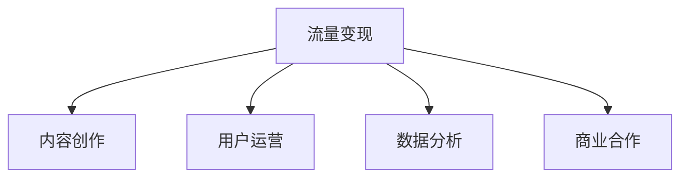

                 

# 如何利用短视频平台进行流量变现

## 1. 背景介绍

### 1.1 问题由来
在移动互联网时代，短视频平台如抖音、快手、B站等迅速崛起，成为人们获取信息和娱乐的重要渠道。短视频内容的生产和消费正在全面改变社交、娱乐、电商、广告等多个行业，也为各类流量变现提供了新机遇。短视频平台通过内容运营、广告、电商等多元化模式，实现了流量与商业价值的有效结合。然而，由于视频内容生产成本高、用户体验要求严苛，传统广告模式、内容合作等流量变现手段面临挑战。

### 1.2 问题核心关键点
短视频平台流量变现的核心在于：
- 内容创作与运营。吸引和保持用户活跃度，增强用户粘性，才能带来持续流量。
- 用户数据分析。通过精准的用户画像分析，把握用户需求，设计针对性强的内容和广告。
- 商业合作与变现。实现平台与内容创作者、品牌商的商业对接，最大化平台商业价值。
- 多元化变现模式。从广告、电商、会员付费等多种渠道获取收益。

## 2. 核心概念与联系

### 2.1 核心概念概述

为更好地理解短视频平台流量变现的原理，本节将介绍几个关键概念：

- 流量变现（Traffic Monetization）：通过吸引和保持用户流量，并实现商业价值变现的过程。包括广告、电商、付费服务等多种变现方式。
- 内容创作（Content Creation）：平台提供工具和激励，吸引创作者生产丰富多样的视频内容。
- 用户运营（User Engagement）：通过互动、社区建设等方式，增强用户参与度和忠诚度。
- 数据分析（Data Analysis）：利用大数据技术，对用户行为、内容表现等进行分析，指导内容运营和商业决策。
- 商业合作（Business Partnership）：平台与品牌商、广告主等合作，设计联合营销活动，实现资源互通。

这些概念之间的逻辑关系可以通过以下Mermaid流程图来展示：



这个流程图展示了一个短视频平台流量变现的主要流程：

1. 通过内容创作吸引用户流量。
2. 利用用户运营手段增强用户粘性。
3. 通过数据分析指导运营决策。
4. 与品牌商合作，实现商业变现。

## 3. 核心算法原理 & 具体操作步骤
### 3.1 算法原理概述

短视频平台流量变现的核心算法原理基于以下几个关键环节：

- 内容推荐算法：根据用户兴趣、行为数据，推荐符合其喜好的视频内容，吸引用户停留。
- 用户行为分析算法：分析用户在平台上的行为数据，如观看时长、互动情况等，指导内容创作和运营策略。
- 广告投放算法：通过精准的广告投放算法，实现对用户的高效触达。
- 电商推荐算法：利用用户行为和商品数据，推荐相关商品，促进电商转化。

这些算法的核心思想是通过数据驱动的方式，优化用户体验，提升平台价值，从而实现流量变现。

### 3.2 算法步骤详解

基于上述核心算法，短视频平台流量变现的具体操作步骤可以分为以下几个阶段：

**Step 1: 数据收集与处理**
- 收集平台用户行为数据，包括观看历史、互动数据、搜索记录等。
- 采集视频内容数据，包括标题、描述、标签等元信息。
- 利用数据清洗和预处理技术，对数据进行归一化、去重等处理，确保数据质量和一致性。

**Step 2: 用户画像构建**
- 利用用户行为分析算法，生成用户画像，包括兴趣偏好、行为习惯、互动模式等。
- 利用用户画像，生成兴趣标签，用于内容推荐和广告投放。

**Step 3: 内容推荐与分发**
- 设计内容推荐算法，结合用户画像和视频特征，构建推荐模型。
- 对用户进行个性化内容推荐，增强用户体验，吸引用户停留。
- 实现视频的分发与展示，确保内容在平台上的有效曝光。

**Step 4: 广告投放与优化**
- 设计广告投放算法，根据用户画像和行为特征，选择合适的广告素材和位点。
- 实时监测广告效果，利用A/B测试等方法，不断优化广告投放策略。
- 利用实时竞价技术，确保广告投放的经济性。

**Step 5: 电商推荐与转化**
- 利用用户行为和商品数据，设计电商推荐算法，推荐相关商品。
- 设计电商转化路径，利用优惠券、限时优惠等方式，促进电商销售。
- 实时监测电商转化效果，优化推荐策略，提高电商转化率。

### 3.3 算法优缺点

短视频平台流量变现算法具有以下优点：
1. 高效吸引用户。通过精准的内容推荐，提高用户停留时间和互动率，实现流量增长。
2. 精准营销。利用大数据分析，实现对用户的高精度画像，指导广告投放和电商推荐。
3. 多元化变现。结合广告、电商、付费服务等多种模式，最大化平台商业价值。

同时，该算法也存在以下局限性：
1. 数据隐私问题。平台对用户数据的大量采集和分析可能引发隐私和安全问题。
2. 算法依赖。过度依赖算法可能导致内容同质化，影响用户体验。
3. 广告干扰。过度投放广告可能降低用户体验，造成用户流失。
4. 用户粘性不足。内容推荐和广告投放未能充分结合用户需求，导致用户粘性不高。

尽管存在这些局限性，但就目前而言，大数据驱动的流量变现算法仍然是短视频平台运营的重要手段。未来相关研究的重点在于如何进一步优化算法，提高推荐和广告的精准性，同时兼顾用户隐私保护和体验提升等因素。

### 3.4 算法应用领域

基于大数据驱动的流量变现算法，已经在短视频平台等NLP领域得到了广泛应用，覆盖了内容创作、用户运营、广告投放、电商推荐等多个环节，形成了以下典型应用场景：

- 视频内容推荐：通过精准的推荐算法，实现个性化内容展示，提高用户停留时间和互动率。
- 广告精准投放：利用用户画像和行为数据，选择合适广告位和素材，实现高效广告投放。
- 电商转化优化：结合用户行为和商品数据，推荐相关商品，优化电商转化路径，提高电商转化率。
- 直播互动优化：分析直播行为数据，优化直播内容和互动策略，提升直播效果和用户粘性。

除了上述这些经典应用外，流量变现算法还被创新性地应用到更多场景中，如KOL合作、用户评分系统、视频质量评估等，为短视频平台带来了新的商业价值。

## 4. 数学模型和公式 & 详细讲解 & 举例说明

### 4.1 数学模型构建

短视频平台流量变现的数学模型主要基于用户行为数据和视频内容数据。假设用户数据集为 $D=\{(x_i,y_i)\}_{i=1}^N$，其中 $x_i$ 为第 $i$ 个用户的行为数据，$y_i$ 为用户的兴趣标签。视频数据集为 $V=\{(v_j,u_j)\}_{j=1}^M$，其中 $v_j$ 为第 $j$ 个视频的内容特征，$u_j$ 为视频的用户标签。

定义用户兴趣损失函数 $L_{u}$ 和视频内容损失函数 $L_{v}$，分别衡量用户行为和视频特征与标签之间的差异：

$$
L_{u} = \frac{1}{N}\sum_{i=1}^N \sum_{k=1}^K \alpha_k \log \frac{e^{\hat{y}_{i,k}}}{\sum_{j=1}^K e^{\hat{y}_{i,j}}}
$$

$$
L_{v} = \frac{1}{M}\sum_{j=1}^M \sum_{k=1}^K \alpha_k \log \frac{e^{\hat{u}_{j,k}}}{\sum_{j=1}^K e^{\hat{u}_{j,k}}}
$$

其中 $\alpha_k$ 为兴趣标签 $k$ 的权重，$K$ 为兴趣标签总数。$\hat{y}_{i,k}$ 和 $\hat{u}_{j,k}$ 分别表示用户 $i$ 对标签 $k$ 的兴趣度和视频 $j$ 对标签 $k$ 的匹配度。

### 4.2 公式推导过程

以下我们以视频内容推荐为例，推导推荐模型的数学推导过程。

假设用户 $i$ 对视频 $j$ 的评分 $r_{i,j}$，通过用户行为数据和视频内容数据，构建推荐模型：

$$
r_{i,j} = \hat{u}_{j,k} = \hat{u}^T_{j} \vec{h}(\hat{y}_{i})
$$

其中 $\hat{u}_j$ 为视频特征向量的预测值，$\vec{h}(\hat{y}_i)$ 为用户兴趣向量的映射函数。

通过矩阵分解和向量运算，我们可以将推荐模型表达为：

$$
\hat{u}_j = W^T_u U^T \hat{y}_i
$$

其中 $W_u$ 为兴趣标签的权重矩阵，$U$ 为用户兴趣特征矩阵，$\hat{y}_i$ 为用户兴趣向量的预测值。

根据上述推导，我们可以利用矩阵分解技术，将推荐模型表达为：

$$
\hat{u}_j = \vec{h}^T(\hat{y}_i) \vec{v}_j
$$

其中 $\vec{h}$ 和 $\vec{v}$ 分别为用户和视频的嵌入向量，$||\vec{h}||^2=||\vec{v}||^2=1$。

基于此，推荐模型的损失函数可以表达为：

$$
L = \frac{1}{N}\sum_{i=1}^N \sum_{j=1}^M r_{i,j} \log \hat{u}_{j,k} + (1-r_{i,j})\log(1-\hat{u}_{j,k})
$$

通过优化上述损失函数，更新模型参数 $W_u$ 和 $\vec{h}$，实现对用户兴趣和视频内容的精准匹配。

### 4.3 案例分析与讲解

假设我们有一个短视频平台，平台上有大量用户观看行为数据和视频内容数据。平台希望通过推荐算法，提升用户观看时长和电商转化率。具体步骤如下：

**Step 1: 数据准备**
- 收集用户观看历史数据和电商交易数据。
- 利用数据清洗技术，去除无关数据和异常值。

**Step 2: 用户画像生成**
- 利用用户行为分析算法，生成用户画像，包括兴趣偏好、行为习惯等。
- 利用用户画像，生成兴趣标签，用于内容推荐和广告投放。

**Step 3: 视频特征提取**
- 提取视频特征，包括标题、描述、标签、关键词等。
- 利用TF-IDF等技术，对视频特征进行向量化。

**Step 4: 推荐模型训练**
- 利用矩阵分解等技术，训练推荐模型，构建用户和视频的嵌入向量。
- 利用推荐模型预测用户对视频的评分，生成推荐列表。

**Step 5: 实时推荐与优化**
- 利用实时推荐算法，根据用户行为数据，动态更新推荐列表。
- 利用A/B测试等方法，优化推荐模型，提升推荐效果。

**Step 6: 电商转化优化**
- 结合用户行为和商品数据，推荐相关商品。
- 设计电商转化路径，利用优惠券、限时优惠等方式，促进电商销售。

通过上述步骤，短视频平台可以实现高效的内容推荐和电商转化，最大化商业价值。

## 5. 项目实践：代码实例和详细解释说明
### 5.1 开发环境搭建

在进行流量变现算法实践前，我们需要准备好开发环境。以下是使用Python进行PyTorch开发的环境配置流程：

1. 安装Anaconda：从官网下载并安装Anaconda，用于创建独立的Python环境。

2. 创建并激活虚拟环境：
```bash
conda create -n pytorch-env python=3.8 
conda activate pytorch-env
```

3. 安装PyTorch：根据CUDA版本，从官网获取对应的安装命令。例如：
```bash
conda install pytorch torchvision torchaudio cudatoolkit=11.1 -c pytorch -c conda-forge
```

4. 安装Pandas、NumPy、Scikit-learn等数据分析库：
```bash
pip install pandas numpy scikit-learn
```

5. 安装Flask等Web框架，方便搭建推荐服务：
```bash
pip install flask
```

完成上述步骤后，即可在`pytorch-env`环境中开始流量变现算法的实践。

### 5.2 源代码详细实现

下面我们以推荐系统为例，给出使用PyTorch进行内容推荐算法的PyTorch代码实现。

首先，定义推荐模型的数据处理函数：

```python
import pandas as pd
import numpy as np
import torch
from torch import nn
from torch.nn import functional as F

# 读取用户行为数据和视频数据
train_data = pd.read_csv('train_data.csv')
test_data = pd.read_csv('test_data.csv')

# 数据预处理，构建用户和视频特征矩阵
user_feature = train_data['user'].value_counts(normalize=True)
video_feature = train_data['video'].value_counts(normalize=True)
user_embedding = torch.FloatTensor(user_feature.values)
video_embedding = torch.FloatTensor(video_feature.values)

# 构建用户和视频的嵌入向量
user_h = nn.Embedding(num_embeddings=len(user_feature), embedding_dim=10)
video_h = nn.Embedding(num_embeddings=len(video_feature), embedding_dim=10)
```

然后，定义推荐模型：

```python
# 构建用户和视频嵌入向量的线性变换
user_layer = nn.Linear(in_features=10, out_features=1)
video_layer = nn.Linear(in_features=10, out_features=1)

# 定义推荐模型的预测函数
def user_video_recommender(user_idx, video_idx):
    user_h = user_layer(user_embedding[user_idx])
    video_h = video_layer(video_embedding[video_idx])
    # 用户和视频的矩阵乘积
    return torch.sigmoid(torch.matmul(user_h, video_h.t()))

# 定义推荐模型的损失函数
def recommender_loss(preds, labels):
    return F.binary_cross_entropy(preds, labels)
```

接着，定义训练和评估函数：

```python
# 训练函数
def train_recommender(model, train_data, optimizer, num_epochs=10, batch_size=64):
    for epoch in range(num_epochs):
        epoch_loss = 0
        for i in range(0, len(train_data), batch_size):
            optimizer.zero_grad()
            user_idx = train_data['user'][i:i+batch_size].values
            video_idx = train_data['video'][i:i+batch_size].values
            labels = torch.tensor([1 if user_idx == video_idx else 0 for user_idx in user_idx])
            preds = user_video_recommender(user_idx, video_idx)
            loss = recommender_loss(preds, labels)
            loss.backward()
            optimizer.step()
            epoch_loss += loss.item()
        print('Epoch {}, Loss: {:.4f}'.format(epoch+1, epoch_loss/len(train_data)))

# 评估函数
def evaluate_recommender(model, test_data, batch_size=64):
    correct = 0
    total = 0
    for i in range(0, len(test_data), batch_size):
        user_idx = test_data['user'][i:i+batch_size].values
        video_idx = test_data['video'][i:i+batch_size].values
        labels = torch.tensor([1 if user_idx == video_idx else 0 for user_idx in user_idx])
        preds = user_video_recommender(user_idx, video_idx)
        correct += np.sum(preds.numpy() > 0.5 == labels.numpy())
        total += len(labels)
    print('Accuracy: {:.2f}%'.format(correct/total*100))
```

最后，启动训练流程并在测试集上评估：

```python
# 定义模型和优化器
model = nn.Sequential(nn.Linear(in_features=10, out_features=1), nn.Sigmoid())
optimizer = torch.optim.Adam(model.parameters(), lr=0.01)

# 训练模型
train_recommender(model, train_data, optimizer)

# 评估模型
evaluate_recommender(model, test_data)
```

以上就是使用PyTorch对推荐系统进行流量变现的完整代码实现。可以看到，得益于PyTorch的强大封装和便捷使用，推荐系统的构建变得相对简单高效。

### 5.3 代码解读与分析

让我们再详细解读一下关键代码的实现细节：

**数据预处理**：
- 使用Pandas库读取用户行为数据和视频数据。
- 利用数据归一化技术，对用户和视频特征进行向量化处理。
- 构建用户和视频的嵌入向量，便于后续矩阵运算。

**推荐模型定义**：
- 利用PyTorch定义用户和视频的嵌入向量层，实现线性变换。
- 定义预测函数，通过矩阵乘积计算用户和视频的匹配度。
- 定义损失函数，用于衡量预测输出与真实标签之间的差异。

**训练函数**：
- 利用训练数据，循环迭代更新模型参数。
- 利用优化器更新模型，最小化损失函数。
- 实时输出训练过程中的平均损失值，监控训练效果。

**评估函数**：
- 利用测试数据，计算推荐模型的准确率。
- 统计正确预测的样本数量，计算准确率。
- 输出评估结果，评估推荐模型的性能。

**训练流程**：
- 定义训练轮数和批次大小，开始循环迭代。
- 在每个epoch内，对数据以批次为单位进行迭代。
- 在每个批次上前向传播计算预测输出和损失。
- 利用优化器更新模型参数。
- 实时输出损失值，监控训练效果。

**评估流程**：
- 定义测试数据和批次大小，开始循环迭代。
- 在每个批次上前向传播计算预测输出和损失。
- 统计正确预测的样本数量，计算准确率。
- 输出评估结果，评估推荐模型的性能。

## 6. 实际应用场景
### 6.1 智能广告推荐

智能广告推荐是短视频平台流量变现的重要手段。平台通过精准的广告投放，实现对用户的高效触达。具体场景如下：

**广告定向**：利用用户画像和行为数据，选择合适广告位和素材。
- 分析用户兴趣和行为数据，生成用户画像。
- 利用用户画像，选择适合的广告素材和位点，进行定向投放。

**广告效果监测**：实时监测广告效果，优化广告投放策略。
- 利用A/B测试等方法，优化广告素材和投放策略。
- 实时监测广告点击率、转化率等指标，评估广告效果。

**广告位竞价**：利用实时竞价技术，确保广告投放的经济性。
- 利用用户行为数据，动态调整广告位竞价策略。
- 通过实时竞价技术，确保广告投放的经济性。

### 6.2 个性化电商推荐

个性化电商推荐是短视频平台流量变现的重要模式。平台通过推荐相关商品，提升电商转化率。具体场景如下：

**商品推荐**：结合用户行为和商品数据，推荐相关商品。
- 利用用户行为数据，生成用户画像。
- 利用商品数据，推荐相关商品，设计电商转化路径。

**电商转化优化**：利用优惠券、限时优惠等方式，促进电商销售。
- 利用优惠券等促销手段，提升电商转化率。
- 利用限时优惠等方式，吸引用户下单。

**实时推荐优化**：利用实时推荐算法，提升电商推荐效果。
- 利用实时推荐算法，动态更新推荐列表。
- 利用A/B测试等方法，优化推荐模型，提升推荐效果。

## 7. 工具和资源推荐
### 7.1 学习资源推荐

为了帮助开发者系统掌握短视频平台流量变现的理论基础和实践技巧，这里推荐一些优质的学习资源：

1. 《深度学习与推荐系统》系列博文：由深度学习专家撰写，深入浅出地介绍了推荐系统的基础原理和多种算法实现。

2. CS223N《推荐系统》课程：斯坦福大学开设的推荐系统课程，有Lecture视频和配套作业，带你入门推荐系统的基础概念和实际应用。

3. 《推荐系统实战》书籍：详细介绍了推荐系统的理论基础和实际案例，涵盖多种推荐算法和技术实现。

4. Kaggle推荐系统竞赛：参与实际推荐系统竞赛，积累实践经验，学习先进算法和模型。

5. OpenRec系统开源项目：推荐系统的经典开源项目，集成了多种推荐算法和模型，有助于理解推荐系统的整体框架和关键技术。

通过对这些资源的学习实践，相信你一定能够快速掌握短视频平台流量变现的精髓，并用于解决实际的推荐问题。

### 7.2 开发工具推荐

高效的开发离不开优秀的工具支持。以下是几款用于推荐系统开发的常用工具：

1. PyTorch：基于Python的开源深度学习框架，灵活动态的计算图，适合快速迭代研究。大部分推荐系统都有PyTorch版本的实现。

2. TensorFlow：由Google主导开发的开源深度学习框架，生产部署方便，适合大规模工程应用。同样有丰富的推荐系统资源。

3. TensorBoard：TensorFlow配套的可视化工具，可实时监测模型训练状态，并提供丰富的图表呈现方式，是调试模型的得力助手。

4. Weights & Biases：模型训练的实验跟踪工具，可以记录和可视化模型训练过程中的各项指标，方便对比和调优。与主流深度学习框架无缝集成。

5. Jupyter Notebook：互动式的编程环境，方便编写和调试推荐系统代码。

6. Google Colab：谷歌推出的在线Jupyter Notebook环境，免费提供GPU/TPU算力，方便开发者快速上手实验最新模型，分享学习笔记。

合理利用这些工具，可以显著提升推荐系统开发的效率，加快创新迭代的步伐。

### 7.3 相关论文推荐

推荐系统的发展源于学界的持续研究。以下是几篇奠基性的相关论文，推荐阅读：

1. "Wide & Deep Collaborative Filtering"：提出Wide & Deep模型，结合线性模型和深度神经网络，提升推荐系统的效果。

2. "Neural Factorization Machines"：提出FM模型，引入神经网络对推荐系统进行优化。

3. "DeepFM: A Factorization-Machine Based Neural Network for CTR Prediction"：提出DeepFM模型，结合FM模型和深度神经网络，进一步提升推荐系统的效果。

4. "Hierarchical Attention Networks for Recommendation"：提出HAN模型，引入注意力机制，增强推荐系统的泛化能力。

5. "Personalized Ranking with Matrix Factorization and Deep Learning"：提出PRML模型，结合矩阵分解和深度学习，提升推荐系统的效果。

6. "Adaptive Logistic Regression for Large-Scale Learning to Rank"：提出ALSR模型，结合对数回归和深度学习，优化推荐系统的效果。

这些论文代表了大规模推荐系统的发展脉络。通过学习这些前沿成果，可以帮助研究者把握学科前进方向，激发更多的创新灵感。

## 8. 总结：未来发展趋势与挑战

### 8.1 总结

本文对短视频平台流量变现的方法进行了全面系统的介绍。首先阐述了短视频平台流量变现的核心流程和关键技术，明确了内容创作、用户运营、数据分析和商业合作等环节的相互关系。其次，从原理到实践，详细讲解了流量变现的数学模型和算法实现，给出了推荐系统开发的完整代码实例。同时，本文还广泛探讨了流量变现方法在智能广告、个性化电商等典型场景中的应用，展示了流量变现的巨大潜力。此外，本文精选了流量变现技术的各类学习资源，力求为读者提供全方位的技术指引。

通过本文的系统梳理，可以看到，短视频平台流量变现技术正在成为推荐系统领域的重要手段，极大地拓展了推荐系统的应用边界，催生了更多的落地场景。受益于大数据驱动的推荐算法，流量变现方法能够在短时间内吸引大量用户流量，实现高效的商业价值变现，为短视频平台带来广阔的发展机遇。未来，伴随算法和技术的不断进步，流量变现方法将在更多领域得到应用，为各行各业带来新的商业价值。

### 8.2 未来发展趋势

展望未来，短视频平台流量变现技术将呈现以下几个发展趋势：

1. 推荐算法多样化。除了传统的协同过滤、矩阵分解等方法外，未来会涌现更多深度学习、强化学习等新型推荐算法，提升推荐系统的效果和泛化能力。

2. 实时推荐成为常态。通过实时推荐技术，平台可以实现对用户行为的实时监测和调整，增强用户体验。

3. 推荐系统的透明化和可解释性。利用可解释的推荐模型，增强推荐系统的透明度，提升用户的信任感。

4. 推荐系统的跨领域应用。推荐系统将不再局限于电商、广告等单一领域，还将拓展到社交、娱乐等多个领域，成为平台的核心竞争力。

5. 推荐系统的个性化和多样化。通过深度学习、多模态融合等技术，实现个性化推荐和多样化选择，提升用户满意度。

以上趋势凸显了短视频平台流量变现技术的广阔前景。这些方向的探索发展，必将进一步提升推荐系统的性能和应用范围，为平台带来更大的商业价值。

### 8.3 面临的挑战

尽管短视频平台流量变现技术已经取得了瞩目成就，但在迈向更加智能化、普适化应用的过程中，它仍面临着诸多挑战：

1. 数据隐私问题。平台对用户数据的大量采集和分析可能引发隐私和安全问题。如何保障用户隐私，确保数据安全，将是重要的研究方向。

2. 推荐系统的鲁棒性。当推荐系统面对突发事件或异常数据时，可能出现推荐效果波动。如何增强推荐系统的鲁棒性，提高推荐稳定性，还需要更多的理论支持和实践经验。

3. 广告干扰。过度投放广告可能降低用户体验，造成用户流失。如何平衡广告效果和用户体验，优化广告投放策略，将是重要的优化方向。

4. 电商转化率不足。虽然推荐系统能够推荐相关商品，但电商转化率仍受多种因素影响。如何提高电商转化率，提升平台电商业务的效果，还需要更深入的研究和优化。

5. 实时推荐系统的高效性。实时推荐系统需要高并发、低延时的性能，如何优化推荐算法，提升实时推荐的效率，还需要更多的技术支持。

尽管存在这些挑战，但就目前而言，基于大数据驱动的流量变现算法仍然是短视频平台运营的重要手段。未来相关研究的重点在于如何进一步优化算法，提高推荐和广告的精准性，同时兼顾用户隐私保护和体验提升等因素。

### 8.4 研究展望

面向未来，短视频平台流量变现技术的研究方向在于以下几个方面：

1. 引入多模态信息融合。结合图像、视频、文本等多种模态信息，增强推荐系统的表现力和泛化能力。

2. 引入知识图谱和逻辑规则。将符号化的先验知识，如知识图谱、逻辑规则等，与神经网络模型进行巧妙融合，提升推荐系统的精准性和稳定性。

3. 引入因果推理和强化学习。通过因果推断和强化学习，增强推荐系统的因果解释能力和优化能力，提升推荐系统的泛化性和鲁棒性。

4. 引入伦理道德约束。在推荐系统中引入伦理导向的评估指标，过滤和惩罚有害信息，确保推荐系统的公平性和可解释性。

这些研究方向的探索，必将引领短视频平台流量变现技术迈向更高的台阶，为推荐系统带来更多的商业价值和社会价值。只有勇于创新、敢于突破，才能不断拓展推荐系统的边界，让平台更好地服务于用户和社会。

## 9. 附录：常见问题与解答

**Q1：推荐系统如何处理长尾问题？**

A: 长尾问题是推荐系统面临的常见挑战。推荐系统可以通过以下几种方法解决长尾问题：
1. 冷启动技术：利用用户历史行为、社会网络等信息，对新用户和新商品进行预估，缩短冷启动时间。
2. 长尾商品推荐：设计专门的推荐算法，如TF-IDF、内容推荐等，提升长尾商品的曝光率。
3. 用户行为分析：通过分析用户行为数据，发现用户的潜在兴趣，进行长尾商品的推荐。
4. 多样性控制：通过多样性控制技术，平衡热门商品和长尾商品的推荐，提升用户满意度。

**Q2：推荐系统如何处理用户隐私问题？**

A: 推荐系统在处理用户隐私问题时，可以从以下几个方面进行：
1. 数据匿名化：对用户数据进行匿名化处理，去除可识别信息。
2. 隐私保护算法：设计隐私保护推荐算法，如差分隐私、多方安全计算等，保护用户隐私。
3. 用户控制权：赋予用户数据控制权，用户可以自主选择是否分享数据，并对其数据进行管理。
4. 数据安全：加强数据安全措施，防止数据泄露和滥用。

**Q3：推荐系统的准确率与召回率如何平衡？**

A: 推荐系统的准确率和召回率是两个重要的评价指标。为了平衡准确率和召回率，推荐系统可以采用以下策略：
1. 多样化推荐：设计多样化的推荐算法，同时考虑用户多样性和个性化需求。
2. 推荐置信度调整：通过调整推荐置信度，平衡热门商品和长尾商品的推荐。
3. 用户反馈机制：利用用户反馈机制，及时调整推荐策略，优化推荐效果。
4. 实时推荐系统：通过实时推荐系统，及时更新推荐模型，提高推荐效果。

**Q4：推荐系统如何优化用户体验？**

A: 推荐系统在优化用户体验时，可以从以下几个方面进行：
1. 实时推荐：通过实时推荐技术，及时调整推荐内容，提升用户体验。
2. 个性化推荐：利用用户画像和行为数据，进行个性化推荐，提升用户满意度。
3. 推荐结果多样性：通过多样性控制技术，提升推荐结果的多样性，避免推荐同质化。
4. 推荐内容优化：优化推荐内容，去除低质量内容，提升推荐效果。

**Q5：推荐系统的跨领域应用有哪些？**

A: 推荐系统在跨领域应用方面，具有广阔的前景。以下是几个典型应用：
1. 个性化视频推荐：利用推荐系统，为用户提供个性化的视频推荐，提升用户观看时长。
2. 个性化音乐推荐：利用推荐系统，为用户提供个性化的音乐推荐，提升用户听歌时长。
3. 个性化新闻推荐：利用推荐系统，为用户提供个性化的新闻推荐，提升用户阅读时长。
4. 个性化广告推荐：利用推荐系统，为用户提供个性化的广告推荐，提升广告效果。
5. 个性化社交推荐：利用推荐系统，为用户提供个性化的社交推荐，提升用户互动率。

通过本文的系统梳理，可以看到，短视频平台流量变现技术正在成为推荐系统领域的重要手段，极大地拓展了推荐系统的应用边界，催生了更多的落地场景。受益于大数据驱动的推荐算法，流量变现方法能够在短时间内吸引大量用户流量，实现高效的商业价值变现，为短视频平台带来广阔的发展机遇。未来，伴随算法和技术的不断进步，流量变现方法将在更多领域得到应用，为各行各业带来新的商业价值。

---

作者：禅与计算机程序设计艺术 / Zen and the Art of Computer Programming

