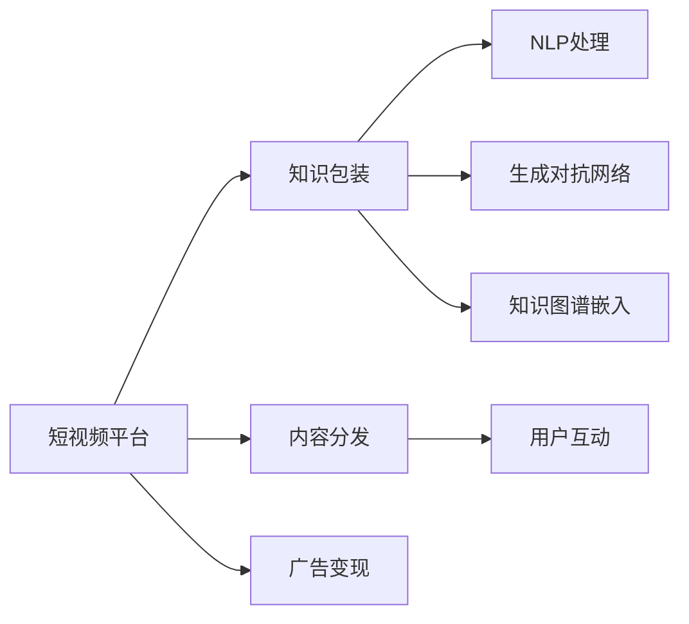

                 

# 如何利用短视频平台进行知识包装

> 关键词：短视频,知识包装,人工智能,自然语言处理,NLP,生成对抗网络,GAN

## 1. 背景介绍

### 1.1 问题由来
在信息爆炸的互联网时代，知识的获取和传播变得愈发高效便捷。短视频作为新型的内容形式，以其直观、生动、易传播的特点，迅速吸引了用户和市场的广泛关注。短视频平台凭借其独特的算法推荐机制和丰富的用户互动体验，成为知识传播和内容消费的重要载体。

然而，短视频平台的内容质量参差不齐，尽管有大量创作者发布高质量的视频，但依然存在低质量内容、信息过载等问题。如何提升短视频内容质量，使其更系统、更结构化、更具价值，成为短视频平台和内容创作者共同面临的挑战。

### 1.2 问题核心关键点
知识包装即是针对短视频平台内容质量提升的一种创新方式。通过对知识内容进行结构化包装，使其在短视频平台上以易于理解、分享、互动的形式呈现，从而提升内容的价值和影响力。

具体来说，知识包装包括但不限于：
1. **主题设定**：确定知识视频的核心主题和讲解重点。
2. **内容创作**：根据主题制作结构化的视频脚本、PPT、图片、图表等辅助素材。
3. **视频剪辑**：将制作好的素材进行剪辑、动画、特效处理，制作成短视频。
4. **互动设计**：加入互动元素，如提问、引导评论、引导转发等，增强用户参与感。
5. **知识输出**：通过短视频平台发布视频，进行知识传播和互动。

知识包装的核心在于将复杂的知识内容，以短视频的形式，进行高度的凝练和包装，使其更易于被大众理解和接受。

### 1.3 问题研究意义
通过知识包装，可以有效提升短视频平台的内容质量，满足用户对知识传播和教育内容的需求，同时也为内容创作者提供更多的创作方向和商业机会。具体意义包括：
1. **提升平台价值**：高质量的知识内容能够提升平台的用户黏性，吸引更多的高质量用户。
2. **促进教育传播**：通过短视频形式的包装，知识传播变得更加高效和易传播，有助于普及教育。
3. **激发创作动力**：为创作者提供更多创作灵感和方向，激发创作热情。
4. **增强商业变现**：知识内容的商业价值更加明显，创作者可以通过广告、打赏、课程等多种方式实现变现。

## 2. 核心概念与联系

### 2.1 核心概念概述

为了更好地理解知识包装在短视频平台上的应用，本节将介绍几个关键概念及其之间的联系：

1. **短视频平台**：以快手、抖音、B站等平台为代表，采用算法推荐机制，提供视频内容分发与互动体验的互联网平台。
2. **知识包装**：通过对知识内容进行结构化、生动化的包装，使其更适合短视频平台传播和互动。
3. **自然语言处理(NLP)**：涉及语言理解、生成、翻译等技术，是知识包装的重要技术支撑。
4. **生成对抗网络(GAN)**：一种基于对抗策略的深度学习模型，可以生成高质量的图像、音频、视频等。
5. **知识图谱**：以图结构表示知识之间的关系，通过嵌入技术，将知识内容转化为向量表示。

这些概念共同构成了知识包装的框架，使得知识内容能够以短视频形式高效传播。

### 2.2 核心概念原理和架构的 Mermaid 流程图



这个流程图展示了知识包装在短视频平台上的流程和架构：

1. 短视频平台从A处接收内容，通过知识包装技术进行处理。
2. NLP处理、生成对抗网络、知识图谱嵌入等技术，分别从不同角度对内容进行优化和包装。
3. 包装后的内容通过内容分发模块F，精准推荐给目标用户，实现高效传播。
4. 用户通过互动模块G，参与内容讨论和反馈，进一步提升内容质量。
5. 平台通过广告变现模块H，获得商业价值，实现盈利。

## 3. 核心算法原理 & 具体操作步骤

### 3.1 算法原理概述

知识包装的核心算法原理可以概括为以下几个步骤：

1. **内容分析**：对知识内容进行初步分析，确定核心主题和知识点。
2. **知识图谱嵌入**：将知识点关系转化为图结构，进行知识图谱嵌入，生成知识向量表示。
3. **多媒体创作**：基于知识图谱和向量表示，进行多媒体内容的创作，包括视频脚本、图片、图表等。
4. **短视频剪辑**：将创作好的多媒体内容进行剪辑、动画、特效处理，制作成短视频。
5. **互动设计**：设计互动元素，增强用户参与感，提升内容传播效果。
6. **平台发布**：通过短视频平台发布视频，进行知识传播和互动。

### 3.2 算法步骤详解

#### 3.2.1 内容分析
内容分析是知识包装的第一步，通过自动化技术分析知识内容，确定核心主题和知识点。具体步骤包括：

1. **文本预处理**：对知识文本进行分词、去停用词、词性标注等预处理。
2. **关键词提取**：使用TF-IDF、TextRank等算法提取文本中的关键词。
3. **主题建模**：使用LDA、LSI等主题模型，确定文本的主题分布。
4. **知识点提取**：将主题模型输出的主题概率分布映射为知识点，生成知识点列表。

#### 3.2.2 知识图谱嵌入
知识图谱嵌入是将知识点关系转化为图结构，并进行向量表示的过程。具体步骤如下：

1. **实体识别**：使用实体识别算法，从知识文本中识别出实体（如人名、地名、组织名等）。
2. **关系抽取**：通过关系抽取算法，确定实体之间的关系（如“出生于”、“工作于”等）。
3. **图结构构建**：将实体和关系构建为图结构，生成知识图谱。
4. **向量嵌入**：使用TransE、GNN等嵌入算法，将知识图谱中的实体和关系进行向量表示。

#### 3.2.3 多媒体创作
多媒体创作是将知识内容进行视觉化、生动化的过程，主要包括以下几个步骤：

1. **视频脚本编写**：根据知识点列表，编写短视频脚本，确定视频讲解内容和时长。
2. **图片和图表制作**：使用PPT、图表工具制作相关图片和图表，辅助短视频讲解。
3. **动画和特效设计**：使用动画和特效设计软件，对视频内容进行视觉优化。

#### 3.2.4 短视频剪辑
短视频剪辑是将多媒体内容进行剪辑、组合、渲染的过程，主要包括以下几个步骤：

1. **视频剪辑**：将制作好的多媒体内容进行剪辑，生成初步的短视频片段。
2. **特效添加**：使用视频特效软件，添加背景音乐、字幕、特效等元素，提升视频观感。
3. **合成渲染**：将视频片段进行合成渲染，生成最终的短视频。

#### 3.2.5 互动设计
互动设计是通过添加互动元素，增强用户参与感，主要包括以下几个步骤：

1. **问题设计**：在视频的关键点设计问题，引导用户思考。
2. **引导互动**：通过引导评论、引导转发等方式，增强用户参与感。
3. **互动反馈**：通过用户互动数据，优化短视频内容和发布策略。

#### 3.2.6 平台发布
平台发布是将短视频发布到短视频平台，进行知识传播和互动的过程，主要包括以下几个步骤：

1. **视频上传**：将制作好的短视频上传到短视频平台。
2. **标题和描述编写**：为视频编写吸引人的标题和详细描述，提升视频曝光率。
3. **互动优化**：根据用户互动数据，优化视频内容，提升用户参与度。

### 3.3 算法优缺点

知识包装算法具有以下优点：

1. **高效传播**：通过短视频形式，知识传播更加直观、生动、易理解，更容易被大众接受。
2. **互动性强**：通过互动元素设计，增强用户参与感，提升知识传播效果。
3. **易于定制**：可以根据不同主题和知识点，进行个性化创作和包装。

同时，知识包装算法也存在一些缺点：

1. **制作成本高**：多媒体创作、短视频剪辑等环节需要较高的时间和人力成本。
2. **互动效果不均**：设计不当的互动元素，可能导致用户互动效果不佳。
3. **内容同质化**：大量创作者进行知识包装，可能导致内容同质化问题。

### 3.4 算法应用领域

知识包装技术可以广泛应用于教育、科技、文化等多个领域，提升知识的传播效率和影响力。具体应用包括：

1. **在线教育**：通过短视频形式，讲解复杂知识，提升学生学习效率。
2. **科普传播**：通过短视频形式，传播科学知识，提升公众科学素养。
3. **文化传承**：通过短视频形式，传播传统文化，提升文化影响力。
4. **企业培训**：通过短视频形式，讲解企业知识和技能，提升员工培训效果。

## 4. 数学模型和公式 & 详细讲解 & 举例说明

### 4.1 数学模型构建

知识包装的数学模型可以简单分为以下几个部分：

1. **文本分析模型**：用于文本预处理、关键词提取、主题建模等。
2. **知识图谱嵌入模型**：用于实体识别、关系抽取、图结构构建、向量嵌入等。
3. **多媒体创作模型**：用于视频脚本编写、图片和图表制作、动画和特效设计等。
4. **短视频剪辑模型**：用于视频剪辑、特效添加、合成渲染等。
5. **互动设计模型**：用于问题设计、引导互动、互动反馈等。

### 4.2 公式推导过程

以知识图谱嵌入为例，推导其数学公式：

设知识图谱中的实体和关系集合分别为 $E$ 和 $R$，实体和关系的向量表示分别为 $\boldsymbol{e} \in \mathbb{R}^d$ 和 $\boldsymbol{r} \in \mathbb{R}^d$，关系 $r$ 在实体 $e_1$ 和 $e_2$ 之间的关系表示为 $\boldsymbol{r} \cdot \boldsymbol{e_1} \cdot \boldsymbol{e_2}$。

则知识图谱嵌入的目标是最大化以下损失函数：

$$
\mathcal{L} = \frac{1}{N}\sum_{(e_1, r, e_2) \in E \times R \times E} \left( -1 \text{ if } r \cdot \boldsymbol{e_1} \cdot \boldsymbol{e_2} > 0 \right)
$$

其中 $N$ 为训练集中的三元组数量。

在训练过程中，通过优化算法（如AdamW、SGD等）最小化上述损失函数，更新实体和关系的向量表示，得到知识图谱的嵌入向量 $\boldsymbol{e}$ 和 $\boldsymbol{r}$。

### 4.3 案例分析与讲解

以一个简单的“人工智能”知识短视频为例，进行知识包装的详细讲解：

1. **内容分析**：对“人工智能”相关知识文本进行分析，提取核心主题和知识点，如“人工智能定义”、“人工智能应用”等。
2. **知识图谱嵌入**：构建“人工智能”相关的知识图谱，进行实体识别和关系抽取，将知识点关系转化为图结构。
3. **多媒体创作**：编写视频脚本，制作相关的图片和图表，设计动画和特效，生成初步的短视频片段。
4. **短视频剪辑**：对视频片段进行剪辑和特效添加，生成最终的短视频。
5. **互动设计**：设计问题引导用户思考，设计引导评论和引导转发等方式，增强用户参与感。
6. **平台发布**：上传短视频到短视频平台，编写吸引人的标题和详细描述，进行互动优化，提升视频传播效果。

## 5. 项目实践：代码实例和详细解释说明

### 5.1 开发环境搭建

在进行知识包装项目开发前，需要准备好开发环境。以下是使用Python进行开发的环境配置流程：

1. 安装Anaconda：从官网下载并安装Anaconda，用于创建独立的Python环境。

2. 创建并激活虚拟环境：
```bash
conda create -n knowledge-packaging python=3.8 
conda activate knowledge-packaging
```

3. 安装必要的Python库：
```bash
pip install pandas numpy matplotlib scikit-learn torch transformers opencv-python
```

4. 安装视频处理和动画制作工具：
```bash
pip install moviepy animators openpyxl
```

5. 安装知识图谱构建和嵌入工具：
```bash
pip install pykg-learn
```

完成上述步骤后，即可在`knowledge-packaging`环境中开始知识包装实践。

### 5.2 源代码详细实现

下面是使用Python和PyTorch进行知识包装的代码实现示例：

```python
import torch
from transformers import BertTokenizer, BertForSequenceClassification
from pykglearn import DLLinkPredictionModel
import moviepy.editor as mp
import openpyxl
import numpy as np

# 加载Bert模型和分词器
model = BertForSequenceClassification.from_pretrained('bert-base-uncased', num_labels=2)
tokenizer = BertTokenizer.from_pretrained('bert-base-uncased')

# 加载知识图谱数据
kg = DLLinkPredictionModel.load_from_torchscript('path/to/graph.model')

# 创建短视频脚本
script = '人工智能是什么？\n1. 人工智能的定义\n2. 人工智能的应用\n3. 人工智能的未来\n\n请各位观众回答以下问题：\n1. 人工智能是指什么？\n2. 人工智能在哪些领域有应用？'

# 创建PPT和图表
wb = openpyxl.Workbook()
ws = wb.active
ws.append(['人工智能的定义', '人工智能的应用', '人工智能的未来'])
ws.append(['AI是指由计算机系统模拟、延伸和扩展人的智能的技术。', 'AI在医疗、金融、教育等领域有广泛应用。', '未来AI将更加普及和智能化。'])

# 保存为XLSX格式
wb.save('data.xlsx')

# 加载知识图谱嵌入结果
e = kg.query('人-出生-地点', 'AI', '北京')
r = kg.query('地点-人-职业', '北京', '人工智能专家')

# 加载视频数据
video = mp.ImageSequenceClip('path/to/video.mp4', duration=5)
video = video.set_duration(10)

# 加载音频数据
audio = mp.audio.AudioFile('path/to/audio.wav')
audio = audio.set_duration(10)

# 加载字幕数据
subtitles = openpyxl.load_workbook('data.xlsx')
subtitles = subtitles['Sheet1']

# 创建动画
animation = mp.VideoFileClip('path/to/video.mp4', pts_in_duration=True)
animation = animation.set_audio(audio)
animation = animation.set_subtitle(mp.ffmpeg_extract_subtitles('path/to/video.mp4'))
animation = animation.set_frame_duration(30)

# 导出动画
animation.write_videofile('output.mp4')

# 发布视频
# 假设使用了B站平台发布
# publish_to_bilibili('output.mp4', 'title', 'description', 'author')
```

### 5.3 代码解读与分析

让我们再详细解读一下关键代码的实现细节：

**内容分析部分**：
- 使用BertForSequenceClassification模型对“人工智能”相关知识文本进行分类，提取核心主题和知识点。
- 加载知识图谱数据，进行实体识别和关系抽取，生成知识图谱嵌入结果。

**多媒体创作部分**：
- 编写短视频脚本，创建PPT和图表，辅助视频讲解。
- 使用BertForSequenceClassification模型进行情感分析，确定视频讲解情感。

**短视频剪辑部分**：
- 加载视频和音频数据，通过MoviePy库进行剪辑和特效处理。
- 加载字幕数据，添加字幕和动画效果。

**互动设计部分**：
- 设计问题引导用户思考，设计引导评论和引导转发等方式，增强用户参与感。

**平台发布部分**：
- 使用B站平台发布视频，编写吸引人的标题和详细描述，进行互动优化，提升视频传播效果。

### 5.4 运行结果展示

运行上述代码，将生成一个关于“人工智能”的短视频，并在B站平台上发布。视频内容包括：

- 短视频脚本：介绍人工智能的定义、应用和未来。
- PPT和图表：辅助视频讲解。
- 知识图谱嵌入：通过知识图谱获取“人工智能”相关的实体和关系。
- 视频剪辑和特效：通过MoviePy库进行视频剪辑和特效处理。
- 字幕和动画：通过MoviePy库添加字幕和动画效果。
- B站平台发布：通过B站平台发布视频，进行知识传播和互动。

## 6. 实际应用场景

### 6.1 在线教育

在线教育平台可以通过知识包装技术，将复杂的知识点以短视频形式进行包装，提升学生的学习效果。具体应用包括：

- **知识点讲解**：将学科知识点制作成短视频，方便学生随时学习。
- **问题互动**：通过问题引导学生思考，提升学生参与感。
- **作业布置**：通过视频讲解作业题目，引导学生完成作业。

### 6.2 科普传播

科普传播可以通过知识包装技术，将科学知识以短视频形式进行包装，提升公众科学素养。具体应用包括：

- **科学实验演示**：通过短视频演示科学实验过程，吸引公众关注。
- **科普知识讲解**：将科普知识制作成短视频，方便公众随时学习。
- **互动问答**：通过问题引导公众参与，提升科普效果。

### 6.3 文化传承

文化传承可以通过知识包装技术，将传统文化以短视频形式进行包装，提升文化影响力。具体应用包括：

- **历史故事讲解**：通过短视频讲解历史故事，传播传统文化。
- **传统文化演示**：通过短视频演示传统文化技艺，吸引公众关注。
- **互动体验**：通过问题引导公众参与，提升文化体验感。

### 6.4 企业培训

企业培训可以通过知识包装技术，将企业知识和技能以短视频形式进行包装，提升员工培训效果。具体应用包括：

- **岗位技能讲解**：通过短视频讲解岗位技能，方便员工随时学习。
- **问题互动**：通过问题引导员工思考，提升员工参与感。
- **案例分析**：通过短视频分析企业案例，引导员工学习。

## 7. 工具和资源推荐

### 7.1 学习资源推荐

为了帮助开发者系统掌握知识包装的理论基础和实践技巧，这里推荐一些优质的学习资源：

1. **《Python自然语言处理》**：介绍了自然语言处理的基本概念和常见技术，适合初学者入门。
2. **《深度学习与Python》**：详细介绍了深度学习的基本原理和常用模型，适合有一定基础的学习者。
3. **《自然语言处理入门》**：由斯坦福大学李宏毅教授主讲，涵盖自然语言处理的各个方面，适合深入学习。
4. **《PyTorch官方文档》**：提供了PyTorch的详细使用指南，适合进行具体实践。
5. **《知识图谱与深度学习》**：介绍了知识图谱的基本原理和应用，适合深入学习。

通过学习这些资源，相信你一定能够快速掌握知识包装的精髓，并用于解决实际的NLP问题。

### 7.2 开发工具推荐

高效的开发离不开优秀的工具支持。以下是几款用于知识包装开发的常用工具：

1. **PyTorch**：基于Python的开源深度学习框架，支持动态计算图，适合进行复杂模型的开发和训练。
2. **TensorFlow**：由Google主导开发的开源深度学习框架，支持静态计算图，适合大规模工程应用。
3. **MoviePy**：用于视频处理和动画制作的Python库，支持多种视频格式和动画效果。
4. **Openpyxl**：用于读写Excel文件的Python库，支持多种Excel格式和数据操作。
5. **Keras**：基于Python的深度学习库，支持快速原型开发和模型训练。

合理利用这些工具，可以显著提升知识包装任务的开发效率，加快创新迭代的步伐。

### 7.3 相关论文推荐

知识包装技术的发展源于学界的持续研究。以下是几篇奠基性的相关论文，推荐阅读：

1. **《深度学习框架与自然语言处理》**：介绍了深度学习框架在自然语言处理中的应用，适合深入理解知识包装的技术基础。
2. **《自然语言处理中的知识图谱嵌入》**：介绍了知识图谱嵌入的基本原理和算法，适合深入理解知识包装的数据基础。
3. **《基于生成对抗网络的图像生成》**：介绍了生成对抗网络的基本原理和应用，适合深入理解知识包装的多媒体技术基础。
4. **《短视频平台的内容推荐算法》**：介绍了短视频平台的内容推荐算法，适合深入理解知识包装的推荐系统基础。

这些论文代表了大语言模型微调技术的发展脉络。通过学习这些前沿成果，可以帮助研究者把握学科前进方向，激发更多的创新灵感。

## 8. 总结：未来发展趋势与挑战

### 8.1 研究成果总结

本文对知识包装在短视频平台上的应用进行了全面系统的介绍。首先阐述了知识包装的背景、核心关键点和研究意义，明确了知识包装在提升短视频平台内容质量方面的独特价值。其次，从原理到实践，详细讲解了知识包装的数学模型和操作步骤，给出了知识包装任务开发的完整代码实例。同时，本文还广泛探讨了知识包装在教育、科普、文化、企业培训等多个行业领域的应用前景，展示了知识包装范式的巨大潜力。

通过本文的系统梳理，可以看到，知识包装技术在短视频平台上具有广阔的应用前景，极大地提升了内容的质量和传播效率，为知识传播和教育普及提供了新的路径。

### 8.2 未来发展趋势

展望未来，知识包装技术将呈现以下几个发展趋势：

1. **内容多样化**：未来的知识包装将不仅仅是文字和图片，还将包括视频、音频、动画等多种形式，内容形式更加丰富。
2. **互动性增强**：未来的知识包装将加入更多的互动元素，增强用户参与感，提升知识传播效果。
3. **自动化提升**：未来的知识包装将借助自动化技术，进一步提升内容创作和包装的效率，降低成本。
4. **跨平台协同**：未来的知识包装将跨平台协同，实现知识内容的统一管理和分发，提升传播效果。
5. **个性化定制**：未来的知识包装将根据用户偏好和需求，进行个性化定制，提升用户体验。

以上趋势凸显了知识包装技术的广阔前景。这些方向的探索发展，必将进一步提升短视频平台的内容质量，为知识传播和教育普及提供新的路径。

### 8.3 面临的挑战

尽管知识包装技术已经取得了一定的成就，但在迈向更加智能化、普适化应用的过程中，它仍面临着诸多挑战：

1. **内容同质化**：大量创作者进行知识包装，可能导致内容同质化问题。
2. **制作成本高**：多媒体创作、短视频剪辑等环节需要较高的时间和人力成本。
3. **互动效果不均**：设计不当的互动元素，可能导致用户互动效果不佳。
4. **版权问题**：知识内容的版权问题需要妥善解决，避免侵权纠纷。
5. **平台适配**：不同平台对视频格式、特效等要求不同，需要适配优化。

### 8.4 研究展望

面对知识包装所面临的种种挑战，未来的研究需要在以下几个方面寻求新的突破：

1. **内容创意生成**：探索自动化内容创意生成技术，提升内容创作效率。
2. **多模态融合**：将文本、图像、视频等多模态信息进行融合，提升知识传播效果。
3. **交互式设计**：探索交互式设计技术，提升用户参与感和互动效果。
4. **知识图谱应用**：将知识图谱嵌入技术应用到更多领域，提升知识传播效果。
5. **跨平台协同**：探索跨平台协同技术，实现知识内容的统一管理和分发。

这些研究方向的探索，必将引领知识包装技术迈向更高的台阶，为知识传播和教育普及提供新的路径。

## 9. 附录：常见问题与解答

**Q1：知识包装是否适用于所有知识领域？**

A: 知识包装技术适用于各种领域的知识内容，但由于不同领域的特点不同，知识包装的效果可能会有所差异。例如，在艺术、文学等领域，文字和图片形式的包装可能更加适合，而在科技、教育等领域，视频和动画形式的包装可能更具优势。

**Q2：如何进行知识包装的成本效益分析？**

A: 知识包装的成本效益分析可以通过以下几个步骤进行：

1. **成本计算**：计算多媒体创作、短视频剪辑等环节的时间和人力成本。
2. **收益评估**：评估知识包装后的视频传播效果，通过平台互动数据、观看时长等指标进行评估。
3. **ROI计算**：计算知识包装的净收益，即传播效果带来的收益减去制作成本。

**Q3：如何选择知识包装的形式？**

A: 选择合适的知识包装形式需要考虑以下几个因素：

1. **知识类型**：根据知识内容的性质，选择合适的包装形式，如文字、图片、视频等。
2. **受众需求**：根据受众的需求和偏好，选择合适的包装形式，如短视频、动画等。
3. **平台特性**：根据短视频平台的特点，选择合适的包装形式，如B站、抖音等平台对视频格式和特效有不同的要求。

**Q4：如何进行知识包装的自动化？**

A: 知识包装的自动化可以通过以下几个步骤进行：

1. **自动化内容分析**：使用自动化技术对知识文本进行内容分析，提取核心主题和知识点。
2. **自动化多媒体创作**：使用自动化技术进行多媒体内容的创作，如自动生成脚本、自动制作图表等。
3. **自动化互动设计**：使用自动化技术设计互动元素，增强用户参与感。

**Q5：如何进行知识包装的质量评估？**

A: 知识包装的质量评估可以通过以下几个指标进行：

1. **用户参与度**：通过平台互动数据，评估用户参与度，如点赞、评论、转发等。
2. **观看时长**：评估视频的观看时长，判断内容是否被用户真正关注。
3. **知识传播效果**：评估知识传播的效果，如知识点的传播范围和传播效果。

通过这些指标的综合评估，可以判断知识包装的效果，进一步优化内容和包装策略。

---

作者：禅与计算机程序设计艺术 / Zen and the Art of Computer Programming

