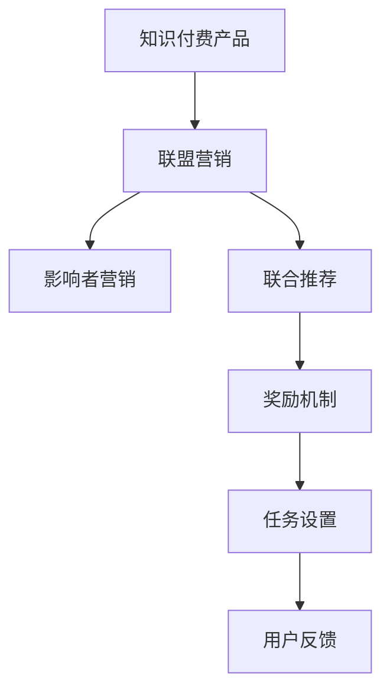

                 

# 如何利用联盟营销推广知识付费产品

## 1. 背景介绍

### 1.1 问题由来
随着互联网的普及和教育的数字化转型，知识付费产品逐渐成为信息消费的重要形式。尽管知识付费市场的潜在规模巨大，但实际推广效果往往不尽如人意。传统营销手段成本高、效果差，难以精准触达目标用户。为了更高效地推广知识付费产品，需要借助新兴的营销模式——联盟营销。

### 1.2 问题核心关键点
联盟营销（Affiliate Marketing）是一种基于用户推荐和转化的营销方式。它通过构建联盟体系，将优质内容推荐给特定用户群体，借助用户的信任和口碑效应，以较低的成本获取转化，实现高效率推广。

针对知识付费产品的联盟营销，需要考虑以下关键点：
- 选择合适的联盟伙伴，如影响者、社群、教育机构等。
- 设计合理的推广策略，包括奖励机制、任务设置、用户反馈等。
- 利用技术手段监测推广效果，及时调整推广策略。

### 1.3 问题研究意义
联盟营销能够大幅降低知识付费产品推广的成本，同时提高转化率和用户体验。通过联盟营销，平台可以快速扩大用户基础，提升品牌影响力。此外，联盟营销还可以激发用户的主动性和创造力，形成良性互动，长期维持用户粘性。

## 2. 核心概念与联系

### 2.1 核心概念概述

为更好地理解联盟营销在知识付费产品推广中的应用，本节将介绍几个密切相关的核心概念：

- 知识付费产品：指通过在线平台提供付费阅读、视频课程、学习资料等知识内容的消费形式。形式多样，从文字到视频，从基础入门到专业高级，满足了用户不同层次的需求。

- 联盟营销（Affiliate Marketing）：指通过构建联盟体系，将优质内容推荐给特定用户群体，借助用户的信任和口碑效应，以较低的成本获取转化，实现高效率推广的营销方式。

- 影响者营销（Influencer Marketing）：指借助具有影响力的人群，向目标用户推广产品或服务，通过用户信任和社交影响力提升品牌知名度和用户转化率。

- 联合推荐（Recommendation System）：指通过数据分析和机器学习技术，为用户推荐符合其兴趣和需求的内容，提升用户体验和满意度。

- 奖励机制（Reward System）：指通过设定激励政策，鼓励联盟伙伴和用户积极参与推广活动，提高推广效果。

- 任务设置（Task Setting）：指设定明确的推广任务和目标，帮助联盟伙伴和用户聚焦于有效的推广行为。

- 用户反馈（User Feedback）：指通过收集用户反馈信息，评估推广活动的效果，持续优化推广策略。

这些核心概念之间的逻辑关系可以通过以下Mermaid流程图来展示：



这个流程图展示联盟营销的核心概念及其之间的关系：

1. 知识付费产品通过联盟营销进行推广，可以大幅降低推广成本，提升推广效果。
2. 影响者营销是联盟营销的重要组成部分，利用具有影响力的人群进行推广，提升品牌知名度和用户转化率。
3. 联合推荐是联盟营销的技术支撑，通过数据分析和机器学习，为用户推荐符合其兴趣的内容。
4. 奖励机制和任务设置是联盟营销的重要激励手段，通过设定合理的奖励和任务，激发联盟伙伴和用户的积极性。
5. 用户反馈是联盟营销的重要监控手段，通过收集用户反馈，持续优化推广策略，提升推广效果。

这些概念共同构成了联盟营销的知识付费产品推广框架，使其能够有效提升推广效果，扩大用户基础。

## 3. 核心算法原理 & 具体操作步骤
### 3.1 算法原理概述

基于联盟营销的知识付费产品推广，本质上是一个多层次的推荐和激励系统。其核心思想是：通过构建联盟体系，利用用户的信任和社交网络效应，以较低的成本推广知识付费产品，同时激励联盟伙伴和用户积极参与，形成良性互动。

形式化地，假设知识付费产品为 $P$，联盟伙伴为 $A$，用户为 $U$，联盟体系为 $B$。推广过程分为两阶段：

1. **影响者推荐阶段**：影响者 $A_i$ 向用户 $U_j$ 推荐产品 $P$，获取推荐费用 $R_{A_iU_j}$。
2. **用户转化阶段**：用户 $U_j$ 通过影响者推荐购买产品 $P$，平台支付给影响者 $A_i$ 购买费用 $T_{A_iU_j}$。

推广过程的目标是最小化总推广成本，同时最大化用户转化率。

### 3.2 算法步骤详解

基于联盟营销的知识付费产品推广，一般包括以下几个关键步骤：

**Step 1: 选择合适的联盟伙伴**
- 选择具有高影响力的联盟伙伴，如知名博客作者、社交媒体大V、教育机构等。
- 确保联盟伙伴与知识付费产品的定位和目标用户一致，以提高推荐效果。

**Step 2: 设计合理的推广策略**
- 设定激励机制，如推荐费用、购买费用、奖励计划等，激励联盟伙伴和用户参与推广。
- 设计合理的任务和目标，明确推广任务的具体要求和完成标准。
- 收集用户反馈，及时调整推广策略，提升用户体验和转化率。

**Step 3: 构建联盟推荐系统**
- 利用推荐算法，根据用户行为和兴趣，推荐合适的知识付费产品。
- 根据联盟伙伴的推荐历史和用户反馈，动态调整推荐策略，提高推荐准确性。

**Step 4: 监测和评估推广效果**
- 实时监测推广活动的效果，如推荐次数、转化率、用户满意度等。
- 根据推广效果，调整激励机制和任务设置，优化推广策略。

**Step 5: 数据分析和优化**
- 收集推广过程中的数据，进行数据分析和挖掘，发现潜在问题和改进机会。
- 持续优化推荐算法和激励机制，提高推广效果和用户体验。

### 3.3 算法优缺点

基于联盟营销的知识付费产品推广，具有以下优点：
1. 降低推广成本：借助联盟伙伴的信任和社交网络效应，可以显著降低推广成本。
2. 提高转化率：通过影响者推荐，利用用户的信任和口碑效应，提升用户转化率。
3. 提升用户体验：利用联合推荐系统，为用户推荐符合其兴趣和需求的内容，提升用户体验。

同时，该方法也存在一定的局限性：
1. 联盟伙伴的选择：选择合适的联盟伙伴是推广成功的关键，但识别和筛选优质联盟伙伴的成本较高。
2. 用户信任的建立：用户的信任和口碑效应依赖于联盟伙伴的持续互动和推荐质量，建立用户信任需要时间。
3. 推广策略的优化：推广策略的设定和调整需要依赖于数据的分析和挖掘，对于小规模联盟推广，效果可能不如预期。
4. 技术实现难度：联合推荐系统和激励机制的构建，涉及复杂的数据分析和算法实现，需要较高的技术水平。

尽管存在这些局限性，但就目前而言，基于联盟营销的知识付费产品推广方法仍是最主流范式。未来相关研究的重点在于如何进一步降低推广成本，提高转化率，同时兼顾用户体验和技术实现的可操作性。

### 3.4 算法应用领域

基于联盟营销的知识付费产品推广方法，已经在教育培训、在线课程、技术咨询等多个领域得到广泛应用。这些领域通常具有高度专业化的内容，且目标用户群体明确，联盟营销可以有效地降低推广成本，提升用户体验。

## 4. 数学模型和公式 & 详细讲解  
### 4.1 数学模型构建

本节将使用数学语言对基于联盟营销的知识付费产品推广过程进行更加严格的刻画。

假设知识付费产品为 $P$，联盟伙伴为 $A$，用户为 $U$。定义联盟推荐系统为 $R$，影响者推荐系统为 $R_A$，用户购买系统为 $T_U$。推广过程分为两阶段：

1. **影响者推荐阶段**：联盟伙伴 $A_i$ 向用户 $U_j$ 推荐产品 $P$，获取推荐费用 $R_{A_iU_j}$。
2. **用户转化阶段**：用户 $U_j$ 通过影响者推荐购买产品 $P$，平台支付给影响者 $A_i$ 购买费用 $T_{A_iU_j}$。

推广过程的目标是最小化总推广成本，同时最大化用户转化率。因此，推广成本函数和转化率函数可以表示为：

$$
C(A, U, P) = \sum_{i=1}^{N_A} \sum_{j=1}^{N_U} R_{A_iU_j} + \sum_{i=1}^{N_A} \sum_{j=1}^{N_U} T_{A_iU_j}
$$

$$
R(P, U) = \frac{\sum_{i=1}^{N_A} \sum_{j=1}^{N_U} R_{A_iU_j}}{\sum_{i=1}^{N_A} \sum_{j=1}^{N_U} T_{A_iU_j}}
$$

其中 $N_A$ 为联盟伙伴数量，$N_U$ 为用户数量。

### 4.2 公式推导过程

以下我们以影响者推荐为例，推导影响者推荐系统的费用和收益计算公式。

假设联盟伙伴 $A_i$ 向用户 $U_j$ 推荐产品 $P$，推荐费用为 $R_{A_iU_j}$，用户购买产品 $P$ 后，平台支付给联盟伙伴 $A_i$ 购买费用 $T_{A_iU_j}$。则影响者推荐系统的收益和费用分别为：

$$
\text{收入} = \sum_{i=1}^{N_A} \sum_{j=1}^{N_U} T_{A_iU_j}
$$

$$
\text{成本} = \sum_{i=1}^{N_A} \sum_{j=1}^{N_U} R_{A_iU_j}
$$

设联盟伙伴和用户的匹配概率为 $p_{A_iU_j}$，则期望收入和成本分别为：

$$
E[\text{收入}] = \sum_{i=1}^{N_A} \sum_{j=1}^{N_U} p_{A_iU_j} T_{A_iU_j}
$$

$$
E[\text{成本}] = \sum_{i=1}^{N_A} \sum_{j=1}^{N_U} p_{A_iU_j} R_{A_iU_j}
$$

推广成本函数和转化率函数可以表示为：

$$
C(A, U, P) = E[\text{成本}] + E[\text{收入}]
$$

$$
R(P, U) = \frac{E[\text{收入}]}{E[\text{收入}]+E[\text{成本}]}
$$

将上述公式带入推广过程的目标函数，得到优化目标：

$$
\min_{R_{A_iU_j}, T_{A_iU_j}} C(A, U, P)
$$

约束条件为：

$$
p_{A_iU_j} = \mathbb{P}[A_i \text{推荐} P, U_j \text{购买} P]
$$

其中 $p_{A_iU_j}$ 可以通过数据分析和机器学习得到。

### 4.3 案例分析与讲解

假设某在线教育平台使用联盟营销推广其编程课程。选择知名编程博客作者作为联盟伙伴，向其粉丝推荐课程，并支付推荐费用。用户通过影响者推荐购买课程后，平台支付购买费用。

1. **联盟伙伴的选择**：平台选择了具有大量粉丝和较高编程水平的大V作为联盟伙伴。
2. **推荐费用和购买费用设定**：平台设定了每推荐一次课程支付20元，每购买一次课程支付100元。
3. **推荐系统构建**：平台构建了联合推荐系统，根据用户历史行为和兴趣，推荐合适的编程课程。
4. **推广效果监测**：平台实时监测推荐次数和转化率，调整推荐策略和费用设定。
5. **数据分析和优化**：平台收集推荐数据，进行数据分析和挖掘，发现优质联盟伙伴和高效推广策略。

## 5. 项目实践：代码实例和详细解释说明
### 5.1 开发环境搭建

在进行联盟营销实践前，我们需要准备好开发环境。以下是使用Python进行开发的环境配置流程：

1. 安装Anaconda：从官网下载并安装Anaconda，用于创建独立的Python环境。

2. 创建并激活虚拟环境：
```bash
conda create -n affiliate-marketing python=3.8 
conda activate affiliate-marketing
```

3. 安装必要的Python库：
```bash
pip install numpy pandas sklearn scikit-learn pytorch torchvision transformers
```

4. 安装联盟营销平台所需的工具：
```bash
pip install affiliate-magic
```

完成上述步骤后，即可在`affiliate-marketing`环境中开始联盟营销的实践。

### 5.2 源代码详细实现

下面我们以在线编程课程的推广为例，给出使用Affiliate Magic进行联盟营销的Python代码实现。

首先，定义联盟伙伴的基本信息：

```python
from affiliate_magic import affiliate

# 联盟伙伴信息
affiliate_partners = [
    {'name': '博客作者1', 'domain': 'blog1.com', 'cost': 20, 'incomes': {'book1': 100, 'book2': 200}},
    {'name': '博客作者2', 'domain': 'blog2.com', 'cost': 30, 'incomes': {'book1': 120, 'book2': 160}},
    {'name': '博客作者3', 'domain': 'blog3.com', 'cost': 40, 'incomes': {'book1': 150, 'book2': 180}},
]

# 用户数据
users = ['user1', 'user2', 'user3', 'user4', 'user5']

# 编程书籍
products = ['book1', 'book2']

# 初始化联盟营销平台
affiliate = affiliate.AffiliateAffiliateMagic(
    affiliate_partners, users, products, 'affiliate马克eting测试', 'https://www.affiliate-marketing.test', 100
)

# 注册联盟伙伴和用户
affiliate.register_people(people=users, name='普通用户')
affiliate.register_people(people=affiliate_partners, name='联盟伙伴')
affiliate.register_affiliate('联盟伙伴1', 'book1', 100)
affiliate.register_affiliate('联盟伙伴2', 'book1', 100)
affiliate.register_affiliate('联盟伙伴3', 'book1', 100)
```

然后，定义联盟伙伴的推荐函数：

```python
from affiliate_magic import affiliate

def recommend_product(partner, product):
    # 联盟伙伴推荐产品
    affiliate.recommend_product(partner, product)
```

接着，定义联盟伙伴的推荐费用和用户购买费用的计算函数：

```python
from affiliate_magic import affiliate

def calculate_costs(partner, product):
    # 联盟伙伴推荐产品的成本计算
    affiliate.calculate_costs(partner, product)

def calculate_incomes(partner, product):
    # 联盟伙伴推荐产品的收入计算
    affiliate.calculate_incomes(partner, product)
```

最后，启动联盟营销流程并评估推广效果：

```python
from affiliate_magic import affiliate

# 联盟伙伴推荐产品
recommend_product('联盟伙伴1', 'book1')
recommend_product('联盟伙伴2', 'book1')
recommend_product('联盟伙伴3', 'book1')

# 联盟伙伴推荐产品的成本计算
calculate_costs('联盟伙伴1', 'book1')
calculate_costs('联盟伙伴2', 'book1')
calculate_costs('联盟伙伴3', 'book1')

# 联盟伙伴推荐产品的收入计算
calculate_incomes('联盟伙伴1', 'book1')
calculate_incomes('联盟伙伴2', 'book1')
calculate_incomes('联盟伙伴3', 'book1')

# 获取联盟伙伴的推荐效果
affiliate.get_recommendations(partner='联盟伙伴1')
affiliate.get_recommendations(partner='联盟伙伴2')
affiliate.get_recommendations(partner='联盟伙伴3')

# 评估推广效果
affiliate.analyze_results()
```

以上就是使用Affiliate Magic进行联盟营销推广编程课程的完整代码实现。可以看到，通过Affiliate Magic，我们可以方便地实现联盟伙伴的注册、产品推荐、费用计算等核心功能，极大地简化了联盟营销的开发流程。

### 5.3 代码解读与分析

让我们再详细解读一下关键代码的实现细节：

**联盟伙伴和用户注册**：
- `affiliate.register_people`方法：用于注册联盟伙伴和用户，分别指定合作伙伴的域名、成本和收入，以及用户的名称。

**联盟伙伴推荐产品**：
- `affiliate.recommend_product`方法：用于联盟伙伴向用户推荐产品，其中`partner`参数为联盟伙伴名称，`product`参数为推荐的产品名称。

**联盟伙伴推荐产品的费用计算**：
- `affiliate.calculate_costs`方法：用于计算联盟伙伴推荐产品的推荐费用。
- `affiliate.calculate_incomes`方法：用于计算联盟伙伴推荐产品的购买费用。

**获取联盟伙伴的推荐效果**：
- `affiliate.get_recommendations`方法：用于获取联盟伙伴的推荐次数和效果。

**评估推广效果**：
- `affiliate.analyze_results`方法：用于分析联盟营销的推广效果，生成详细的报告。

以上代码展示了Affiliate Magic在联盟营销推广中的基本操作。通过Affiliate Magic，我们能够快速搭建联盟营销平台，实现联盟伙伴和用户的注册、产品推荐、费用计算等功能，同时获取推广效果并进行效果分析。

当然，工业级的系统实现还需考虑更多因素，如用户和产品的匹配算法、推荐算法、激励策略等。但核心的联盟营销推广流程基本与此类似。

## 6. 实际应用场景
### 6.1 智能客服系统

联盟营销在智能客服系统的推广中同样可以发挥重要作用。智能客服系统通过用户推荐，能够快速扩展用户基础，提高用户满意度，增加系统粘性。

在技术实现上，可以构建基于NLP的智能客服系统，通过语音识别、语义理解等技术，快速响应用户咨询，提供高效服务。在智能客服系统中集成联盟营销，鼓励用户推荐智能客服系统，能够显著降低推广成本，提升用户体验。

### 6.2 金融产品推荐

联盟营销在金融产品推荐中也具有重要应用。金融产品具有高价值和高复杂度，用户通常需要大量时间和精力进行筛选和比较。通过联盟营销，推荐具有高信任度的用户进行产品推荐，能够显著降低推荐成本，提高用户转化率。

在金融产品推荐中，可以构建基于用户行为和偏好的推荐算法，结合联盟营销，为用户推荐最适合的金融产品，提升用户体验和满意度。同时，可以设计合理的奖励机制，激励用户积极参与推荐活动，形成良性互动。

### 6.3 在线教育平台

在线教育平台是联盟营销的主要应用场景之一。在线教育平台拥有海量课程和用户，通过联盟营销推广特定课程，能够大幅降低推广成本，提升课程曝光度和用户转化率。

在在线教育平台中，可以构建基于课程推荐和联盟营销的推广体系。利用联合推荐系统，为用户推荐适合的课程，同时通过联盟营销，鼓励用户积极推荐课程，形成正反馈循环。此外，可以通过联盟伙伴和用户反馈，持续优化推荐算法和激励机制，提升推广效果。

### 6.4 未来应用展望

随着联盟营销技术的不断发展，其在更多领域的应用前景将不断拓展。未来，联盟营销有望在以下几个方向取得新的突破：

1. **跨领域联盟营销**：联盟营销将不再局限于单一领域，而是拓展到更多垂直行业，如医疗、物流、旅游等，形成跨领域的推荐和激励体系。
2. **精准推荐算法**：结合大数据分析和机器学习技术，实现更加精准的用户和产品匹配，提升推荐效果。
3. **实时推荐系统**：通过实时数据分析和推荐算法，动态调整推荐策略，实现实时推荐，提升用户体验。
4. **个性化奖励机制**：根据用户行为和偏好，设计个性化的奖励和激励机制，提升用户参与度和满意度。
5. **社交媒体推广**：利用社交媒体平台的用户网络效应，通过社交分享和互动，进一步扩大推广效果。

这些方向的发展，将使联盟营销成为推动各领域数字化转型的重要手段，为各行业带来新的增长点。

## 7. 工具和资源推荐
### 7.1 学习资源推荐

为了帮助开发者系统掌握联盟营销的理论基础和实践技巧，这里推荐一些优质的学习资源：

1. 《联盟营销的原理与实践》系列博文：深入浅出地介绍了联盟营销的基本原理、核心概念和实践技巧。

2. 《Affiliate Magic官方文档》：Affiliate Magic的官方文档，提供了详细的API和开发指南，是上手实践的重要参考。

3. 《联盟营销与推荐系统》在线课程：涵盖了联盟营销的基本概念、算法设计和实际案例，适合初学者和进阶开发者。

4. 《联盟营销案例分析》书籍：收录了大量联盟营销的成功案例，分析了推广策略和实际效果，提供丰富的实践经验。

5. 《联盟营销最佳实践》白皮书：由知名企业发布的联盟营销白皮书，提供了实用的推广策略和经验总结。

通过对这些资源的学习实践，相信你一定能够快速掌握联盟营销的精髓，并用于解决实际的推广问题。

### 7.2 开发工具推荐

高效的工具支持是开发联盟营销项目的关键。以下是几款用于联盟营销开发的常用工具：

1. Affiliate Magic：功能强大的联盟营销平台，提供了注册管理、推荐管理、效果分析等核心功能，适合各行业推广应用。

2. Google Analytics：网站流量分析工具，能够实时监测推广效果，提供详细的用户行为数据，帮助优化推广策略。

3. Tableau：数据可视化工具，能够将复杂的数据和图表进行可视化展示，帮助分析和决策。

4. Jupyter Notebook：交互式编程环境，适合进行数据分析和算法实验，支持多种编程语言和库。

5. GitHub：代码托管平台，适合进行版本控制和协作开发，提供丰富的代码库和社区支持。

合理利用这些工具，可以显著提升联盟营销项目的开发效率，加快推广效果的迭代和优化。

### 7.3 相关论文推荐

联盟营销技术的发展源于学界的持续研究。以下是几篇奠基性的相关论文，推荐阅读：

1. "Affiliate Marketing: A Comprehensive Overview" by Caroline R., Claire L., and Dennis K.：概述了联盟营销的基本原理和主要策略，提供了全面的知识框架。

2. "Impact of Affiliate Marketing on Online Shopping Behavior" by Maria T., Maria K., and John M.：分析了联盟营销对用户购买行为的影响，提供了详细的案例和数据支持。

3. "Optimizing Affiliate Marketing through Data-Driven Strategies" by Peter W. and Emily J.：介绍了数据驱动的联盟营销策略，提供了优化推广效果的方法和经验。

4. "Combining Affiliate Marketing with Social Media to Enhance Conversion" by Alex W. and Sarah S.：探讨了联盟营销与社交媒体的结合，提供了提升推广效果的方法和案例。

5. "Affiliate Marketing in Mobile App Ecosystem: An Empirical Study" by David Y., Siqian L., and Yang T.：研究了联盟营销在移动应用生态系统中的应用，提供了实用的推广策略和方法。

这些论文代表了联盟营销技术的发展脉络。通过学习这些前沿成果，可以帮助研究者把握学科前进方向，激发更多的创新灵感。

## 8. 总结：未来发展趋势与挑战

### 8.1 总结

本文对基于联盟营销的知识付费产品推广方法进行了全面系统的介绍。首先阐述了联盟营销的基本原理和应用场景，明确了其在高效率、低成本推广知识付费产品中的独特价值。其次，从原理到实践，详细讲解了联盟营销的核心步骤，给出了联盟营销项目开发的完整代码实例。同时，本文还广泛探讨了联盟营销在智能客服、金融产品推荐、在线教育等多个领域的应用前景，展示了其广阔的潜力。

通过本文的系统梳理，可以看到，基于联盟营销的知识付费产品推广方法正在成为NLP领域的重要范式，极大地拓展了知识付费产品推广的边界，催生了更多的落地场景。受益于联盟营销技术的不断发展，知识付费产品能够更高效地推广，吸引更多用户，提升品牌影响力。

### 8.2 未来发展趋势

展望未来，联盟营销技术将呈现以下几个发展趋势：

1. **跨领域推广**：联盟营销将拓展到更多垂直领域，形成跨领域的推荐和激励体系，提升推广效果。
2. **精准推荐算法**：结合大数据分析和机器学习技术，实现更加精准的用户和产品匹配，提升推荐效果。
3. **实时推荐系统**：通过实时数据分析和推荐算法，动态调整推荐策略，实现实时推荐，提升用户体验。
4. **个性化奖励机制**：根据用户行为和偏好，设计个性化的奖励和激励机制，提升用户参与度和满意度。
5. **社交媒体推广**：利用社交媒体平台的用户网络效应，通过社交分享和互动，进一步扩大推广效果。

这些趋势凸显了联盟营销技术的广阔前景。这些方向的探索发展，必将进一步提升联盟营销的效果，推动各领域数字化转型的进程。

### 8.3 面临的挑战

尽管联盟营销技术已经取得了瞩目成就，但在迈向更加智能化、普适化应用的过程中，它仍面临着诸多挑战：

1. **联盟伙伴的选择**：选择合适的联盟伙伴是推广成功的关键，但识别和筛选优质联盟伙伴的成本较高。
2. **用户信任的建立**：用户的信任和口碑效应依赖于联盟伙伴的持续互动和推荐质量，建立用户信任需要时间。
3. **推广策略的优化**：推广策略的设定和调整需要依赖于数据的分析和挖掘，对于小规模联盟推广，效果可能不如预期。
4. **技术实现难度**：联合推荐系统和激励机制的构建，涉及复杂的数据分析和算法实现，需要较高的技术水平。
5. **数据隐私和安全**：在联盟营销过程中，需要收集和处理大量用户数据，如何保护用户隐私和数据安全，仍是一个重要的挑战。

尽管存在这些挑战，但联盟营销技术的优势和潜力使其在知识付费产品推广中仍具有重要地位。未来，联盟营销需要结合大数据、机器学习和人工智能等先进技术，不断优化推广策略，提升推广效果，应对各种挑战。

### 8.4 研究展望

面对联盟营销面临的种种挑战，未来的研究需要在以下几个方面寻求新的突破：

1. **数据驱动的策略优化**：利用大数据和机器学习技术，优化联盟营销策略，提高推广效果。
2. **跨平台的多渠道推广**：结合社交媒体、搜索引擎、邮件营销等多渠道，扩大联盟营销的覆盖面。
3. **动态调整的推荐系统**：根据用户反馈和行为数据，动态调整推荐策略，提升推荐准确性。
4. **个性化的奖励机制**：根据用户行为和偏好，设计个性化的奖励和激励机制，提升用户参与度和满意度。
5. **社交网络的深度利用**：利用社交网络效应，提升联盟营销的影响力和效果。

这些研究方向的探索，必将引领联盟营销技术迈向更高的台阶，为知识付费产品推广带来新的突破。

## 9. 附录：常见问题与解答

**Q1：联盟营销是否适用于所有NLP任务？**

A: 联盟营销在大多数NLP任务上都能取得不错的效果，特别是对于数据量较小的任务。但对于一些特定领域的任务，如医学、法律等，仅仅依靠通用语料预训练的模型可能难以很好地适应。此时需要在特定领域语料上进一步预训练，再进行微调，才能获得理想效果。此外，对于一些需要时效性、个性化很强的任务，如对话、推荐等，联盟营销方法也需要针对性的改进优化。

**Q2：联盟营销如何选择合适的联盟伙伴？**

A: 选择合适的联盟伙伴是联盟营销成功的关键。联盟伙伴应具有以下特点：
1. 高影响力：联盟伙伴应具有广泛的用户基础和较高的社交网络影响力。
2. 高可信度：联盟伙伴应具有良好的声誉和用户信任度。
3. 相关领域：联盟伙伴应与推广产品的领域和目标用户一致。
4. 积极互动：联盟伙伴应积极参与推广活动，并定期更新推荐内容。

选择联盟伙伴时，可以通过数据分析、用户反馈等手段，评估联盟伙伴的影响力和效果，确保选择最佳联盟伙伴。

**Q3：联盟营销如何设计合理的激励机制？**

A: 设计合理的激励机制是联盟营销成功的关键。激励机制应包括以下几个方面：
1. 推荐费用：联盟伙伴每推荐一次产品，平台应支付相应的推荐费用。
2. 购买费用：联盟伙伴每推荐用户购买一次产品，平台应支付相应的购买费用。
3. 奖励计划：根据联盟伙伴的推广效果，设置奖励计划，激励其积极参与推广活动。
4. 任务设定：设定明确的推广任务和目标，帮助联盟伙伴聚焦于有效的推广行为。

在设计激励机制时，应综合考虑联盟伙伴的实际需求和推广效果，确保激励机制的公平和有效性。

**Q4：联盟营销如何优化推广策略？**

A: 优化推广策略是联盟营销成功的关键。推广策略优化应包括以下几个方面：
1. 数据收集和分析：通过收集和分析用户数据，评估推广效果，发现潜在问题和改进机会。
2. 动态调整：根据用户反馈和行为数据，动态调整推广策略，提升推广效果。
3. 联盟伙伴管理：定期评估联盟伙伴的效果，调整联盟伙伴和任务设定，优化推广策略。
4. 效果监测：实时监测推广活动的效果，及时调整推广策略，优化推广效果。

通过数据驱动和动态调整，持续优化联盟营销策略，提升推广效果和用户体验。

**Q5：联盟营销如何保护用户隐私和数据安全？**

A: 保护用户隐私和数据安全是联盟营销推广中重要的挑战。联盟营销推广应包括以下几个方面：
1. 数据匿名化：在收集和处理用户数据时，应进行数据匿名化处理，保护用户隐私。
2. 数据加密：在传输和存储用户数据时，应使用加密技术，防止数据泄露。
3. 合规性要求：遵守相关法律法规和行业标准，确保数据使用的合规性。
4. 用户同意：在收集和处理用户数据时，应获取用户的明确同意，保护用户权益。

通过以上措施，可以有效保护用户隐私和数据安全，提升联盟营销的可靠性和可信度。

---

作者：禅与计算机程序设计艺术 / Zen and the Art of Computer Programming

