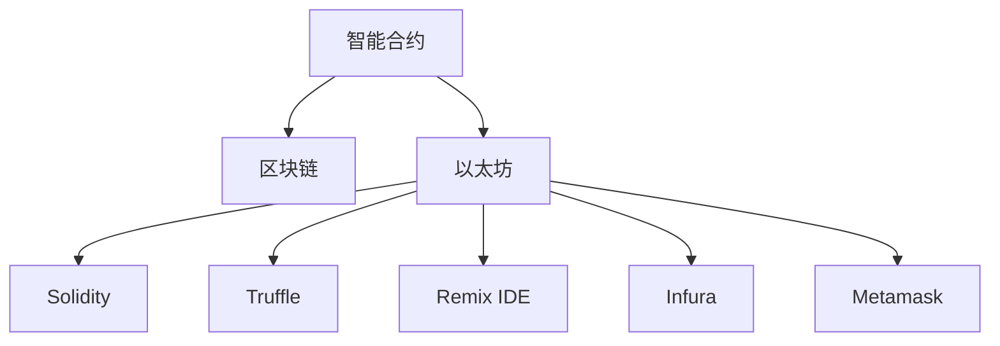

                 

# 如何将编程技能应用于智能合约开发

> 关键词：智能合约, 区块链, 以太坊, 编程技能, 编程语言, 开发框架, 部署工具, 智能合约开发, 示例代码, 实际应用场景

## 1. 背景介绍

### 1.1 问题由来
智能合约作为区块链的核心应用之一，近年来在金融、供应链、物联网等领域逐渐崭露头角。其自动化、去中心化、可验证性等特点，使其成为实现信任机制、提高效率、降低成本的理想方案。然而，智能合约的开发仍面临诸多挑战，包括复杂的学习曲线、繁琐的开发流程、高昂的开发成本等。本文将探讨如何将编程技能应用于智能合约开发，提出一套完整的智能合约开发指南，以期帮助开发者高效、低成本地开发出高质量的智能合约。

### 1.2 问题核心关键点
智能合约开发的核心关键点在于以下几方面：

- **编程技能**：智能合约本质上是一种软件程序，开发人员需要具备扎实的编程基础和经验。
- **区块链技术**：理解区块链的共识机制、加密算法、交易验证等核心技术，能够设计出可靠的智能合约。
- **以太坊平台**：以太坊是目前最为流行的智能合约开发平台，掌握其特性和API是必要的。
- **开发框架**：使用成熟的智能合约开发框架可以简化开发流程，提升开发效率。
- **部署工具**：选择合适的智能合约部署工具，能够便捷地将智能合约部署到区块链网络。

本文将从编程技能出发，全面解析智能合约的开发、部署、测试等关键环节，帮助开发者高效掌握智能合约开发技术。

## 2. 核心概念与联系

### 2.1 核心概念概述

为更好地理解智能合约的开发过程，本节将介绍几个关键概念及其联系：

- **智能合约**：一种能够在区块链网络上自动执行、控制资产转移或状态转换的计算机程序。
- **区块链**：一种分布式账本技术，通过共识机制确保数据的不可篡改和透明性。
- **以太坊**：当前最流行的智能合约平台，提供智能合约开发所需的工具和基础设施。
- **Solidity**：以太坊主用的智能合约编程语言，支持静态类型、事件、访问控制等特性。
- **Truffle**：基于Solidity的智能合约开发框架，提供了开发、测试、部署等工具链支持。
- **Remix IDE**：以太坊的官方集成开发环境，支持智能合约的编写、调试和部署。
- **Infura**：提供以太坊主网的API访问服务，方便开发者进行智能合约的部署和测试。
- **Metamask**：以太坊钱包应用，支持智能合约的交互和测试。

这些概念之间的逻辑关系可以通过以下Mermaid流程图来展示：



这个流程图展示了几大核心概念及其之间的关系：

1. 智能合约基于区块链技术，通过以太坊平台实现。
2. Solidity是用于编写智能合约的编程语言，Truffle提供了开发框架支持。
3. Remix IDE和Infura提供了智能合约的编写、调试、部署工具。
4. Metamask支持智能合约的交互和测试。

## 3. 核心算法原理 & 具体操作步骤
### 3.1 算法原理概述

智能合约的开发过程，本质上是一种编程活动，涉及从需求分析、设计、实现、测试到部署的各个环节。其核心算法原理与传统软件开发相似，包括需求分析、软件设计、软件实现、软件测试和软件部署。

在需求分析阶段，开发者需要明确智能合约的功能和目标，确定需要实现的业务逻辑和智能合约状态。在设计阶段，需要设计智能合约的架构和模块结构，确定事件、函数和变量的名称和类型。在实现阶段，需要编写智能合约的代码，实现指定的功能。在测试阶段，需要编写测试用例，验证智能合约的正确性和安全性。在部署阶段，需要将智能合约部署到区块链网络，并进行性能测试和优化。

### 3.2 算法步骤详解

以下是以太坊智能合约开发的一般步骤：

**Step 1: 需求分析和设计**

1. **需求分析**：
   - 与业务方沟通，明确智能合约的功能需求，包括业务流程、触发条件、状态变化等。
   - 分析智能合约的目标和约束条件，如资金安全、数据隐私、性能要求等。
   - 确定智能合约涉及的资产类型和状态变量，如货币、合同、账户等。

2. **系统设计**：
   - 设计智能合约的架构，确定模块结构、事件、函数和变量。
   - 定义智能合约的状态和状态变化逻辑。
   - 设计智能合约的访问控制机制，确保安全性。

**Step 2: 代码实现**

1. **编写代码**：
   - 使用Solidity编写智能合约的代码，实现指定的功能。
   - 编写函数实现业务逻辑，确保代码的可读性和可维护性。
   - 编写事件记录智能合约的状态变化，便于后续的审计和调试。

2. **测试用例编写**：
   - 编写测试用例，覆盖智能合约的所有功能和边界条件。
   - 使用Truffle或Remix IDE进行单元测试和合约测试。
   - 确保智能合约的代码符合Solidity的安全规范和最佳实践。

**Step 3: 部署和测试**

1. **部署智能合约**：
   - 使用Truffle或Remix IDE将智能合约部署到以太坊主网。
   - 使用Infura或Metamask进行智能合约的部署和测试。
   - 确保智能合约的部署地址和网络状态正确。

2. **性能测试和优化**：
   - 使用Infura或Metamask进行智能合约的性能测试。
   - 分析智能合约的性能瓶颈，优化代码和部署参数。
   - 确保智能合约的性能满足业务需求。

### 3.3 算法优缺点

智能合约开发的优势在于其自动化、去中心化和透明性，但也存在以下缺点：

**优点：**
1. 自动化：智能合约可以自动执行业务逻辑，减少人为干预，提高效率。
2. 去中心化：智能合约运行在区块链上，不受任何单点故障和集中控制的限制。
3. 透明性：智能合约的执行过程和结果对所有人公开透明，确保可信度。
4. 安全性：通过代码审计和测试，确保智能合约的安全性和可靠性。

**缺点：**
1. 学习曲线陡峭：智能合约开发需要掌握区块链和编程技能，对开发者要求较高。
2. 开发成本高：智能合约开发需要测试和优化，成本较高。
3. 部署难度大：智能合约的部署和维护复杂，需要具备一定的区块链技术。
4. 可扩展性受限：智能合约的部署和执行受限于以太坊网络，扩展性受限。

尽管存在这些缺点，但智能合约的自动化和去中心化特性，使其在许多场景中具有不可替代的价值。开发者需权衡利弊，选择适合的智能合约开发方案。

### 3.4 算法应用领域

智能合约开发已应用于多个领域，包括但不限于：

- **金融**：智能合约用于自动执行贷款合同、支付结算、保险理赔等。
- **供应链**：智能合约用于追踪货物运输、支付货款、验证物流状态等。
- **物联网**：智能合约用于设备管理、数据采集、支付服务。
- **投票系统**：智能合约用于公正透明地记录选票和投票结果。
- **知识产权**：智能合约用于版权登记、授权使用、版税分配。

这些应用场景展示了智能合约的广泛适用性，其自动化和去中心化的特性，使其在众多领域具有巨大的潜力。

## 4. 数学模型和公式 & 详细讲解  
### 4.1 数学模型构建

以太坊智能合约的开发过程涉及多个数学模型，包括合约状态模型、合约调用模型和事件模型等。以下我们将详细介绍这些数学模型。

**合约状态模型**：
智能合约的状态可以用多个状态变量来描述，如账户余额、合同状态、审批状态等。状态变量的值可以通过智能合约的函数进行读写。

**合约调用模型**：
智能合约的函数可以接收多个参数，执行特定的业务逻辑。函数的执行结果可以通过事件记录和状态变量进行反馈。

**事件模型**：
事件是智能合约的一种通知机制，用于记录合约状态的变化。事件包含事件名称、参数等信息，可以通过函数调用触发和订阅。

### 4.2 公式推导过程

以一个简单的资产转移智能合约为例，我们将推导其核心数学模型。

假设智能合约用于管理货币资产，包含以下函数：

- `transfer(address to, uint amount)`：将指定金额的资产转移给指定地址。
- `withdraw(uint amount)`：从合约中提取指定金额的资产。

合约的状态变量包括：

- `balances[address]`：记录各个地址的余额。
- `approve(address spender, uint amount)`：记录某地址对某地址的授权。

智能合约的状态模型可以表示为：

$$
\text{State} = (\text{balances}, \text{approves})
$$

合约调用模型可以表示为：

$$
\text{Exec} = (\text{transfer}, \text{withdraw})
$$

事件模型可以表示为：

$$
\text{Events} = (\text{TransferEvent}, \text{WithdrawEvent})
$$

其中，`TransferEvent`包含事件名称和参数：

- `address sender`：发送者地址。
- `address receiver`：接收者地址。
- `uint amount`：转移金额。

`WithdrawEvent`包含事件名称和参数：

- `address sender`：提取者地址。
- `uint amount`：提取金额。

这些数学模型帮助我们理解智能合约的基本结构和功能，是智能合约开发的基础。

### 4.3 案例分析与讲解

下面以一个简单的合约为例，展示智能合约的编写和测试过程。

假设我们要编写一个简单的借贷合约，允许用户借款并定期还款。合约包含以下函数：

- `borrow(address spender, uint amount)`：允许用户借贷指定金额。
- `repay(address spender, uint amount)`：允许用户偿还指定金额的债务。

合约的状态变量包括：

- `balances[address]`：记录各个地址的余额。
- `borrowed[address]`：记录各个地址的借款余额。

合约的代码如下：

```solidity
contract Lending {
    mapping (address => uint) public balances;
    mapping (address => uint) public borrowed;
    
    event TransferEvent(address indexed sender, address indexed receiver, uint amount);
    
    function borrow(address spender, uint amount) public payable {
        require(balances[spender] >= amount);
        balances[spender] -= amount;
        borrowed[spender] += amount;
        emit TransferEvent(msg.sender, spender, amount);
    }
    
    function repay(address spender, uint amount) public payable {
        require(borrowed[spender] >= amount);
        balances[spender] += amount;
        borrowed[spender] -= amount;
        emit TransferEvent(spender, msg.sender, amount);
    }
}
```

在这个合约中，`borrow`函数允许用户借贷指定金额，并将借款余额添加到`borrowed`变量中。`repay`函数允许用户偿还指定金额的债务，并将还款金额从`borrowed`变量中减去。

我们可以通过Truffle IDE编写和测试这个合约，确保其正确性和安全性。

## 5. 项目实践：代码实例和详细解释说明
### 5.1 开发环境搭建

在进行智能合约开发前，我们需要准备好开发环境。以下是使用Truffle进行以太坊智能合约开发的环境配置流程：

1. 安装Node.js和npm。
2. 安装Truffle CLI。
3. 安装Solidity编译器。
4. 创建一个新的Truffle项目。

```bash
mkdir project
cd project
npm init
npm install -g truffle@latest
truffle init
```

完成上述步骤后，即可在项目目录中进行智能合约的开发。

### 5.2 源代码详细实现

以下是一个简单的以太坊智能合约的代码实现。

```solidity
// SPDX-License-Identifier: MIT
pragma solidity ^0.8.0;

contract SimpleContract {
    uint public count;

    constructor() {
        count = 0;
    }

    function increment() public {
        count += 1;
    }

    function decrement() public {
        count -= 1;
    }

    function getCount() public view returns (uint) {
        return count;
    }
}
```

该合约包含三个函数：`increment`、`decrement`和`getCount`。`increment`函数增加计数器的值，`decrement`函数减少计数器的值，`getCount`函数返回计数器的当前值。

### 5.3 代码解读与分析

让我们再详细解读一下关键代码的实现细节：

**Solidity代码**：
- `contract SimpleContract`：定义一个名为`SimpleContract`的智能合约。
- `uint public count`：定义一个公共的`count`变量，类型为`uint`。
- `constructor()`：定义智能合约的构造函数，初始化`count`变量的值为0。
- `function increment() public`：定义一个名为`increment`的公共函数，用于增加计数器的值。
- `function decrement() public`：定义一个名为`decrement`的公共函数，用于减少计数器的值。
- `function getCount() public view returns (uint)`：定义一个名为`getCount`的公共函数，返回计数器的当前值。

**代码实现**：
- `count = 0`：在构造函数中初始化计数器的值为0。
- `count += 1`：在`increment`函数中增加计数器的值。
- `count -= 1`：在`decrement`函数中减少计数器的值。
- `return count`：在`getCount`函数中返回计数器的当前值。

### 5.4 运行结果展示

通过Truffle IDE，我们可以部署和测试这个合约。以下是在Remix IDE中运行合约的示例：

1. 打开Remix IDE，点击“New Project”。
2. 选择“Solidity File”类型，创建一个新的智能合约项目。
3. 将上述Solidity代码复制到项目目录中。
4. 点击“Compile”按钮，编译智能合约。
5. 点击“Deploy”按钮，将智能合约部署到以太坊主网。
6. 点击“Run”按钮，调用智能合约的函数。

在上述示例中，我们可以调用`increment`函数增加计数器的值，调用`decrement`函数减少计数器的值，调用`getCount`函数获取计数器的当前值。

## 6. 实际应用场景
### 6.1 智能合约在供应链中的应用

在供应链管理中，智能合约可以用于追踪货物运输、支付货款、验证物流状态等。具体而言，智能合约可以记录货物的发货和到达时间，一旦货物到达指定地点，自动触发货款支付和物流状态更新。

例如，假设我们有一个全球物流系统，用于管理国际货物运输。我们可以使用智能合约记录货物的运输状态，一旦货物到达指定地点，智能合约自动触发货款支付和物流状态更新。

### 6.2 智能合约在金融领域的应用

在金融领域，智能合约可以用于自动执行贷款合同、支付结算、保险理赔等。具体而言，智能合约可以记录贷款的还款计划、利息计算、违约处理等，一旦条件满足，自动执行相应的操作。

例如，假设我们有一个智能合约用于自动执行贷款合同。智能合约可以记录贷款的还款计划、利息计算和违约处理，一旦贷款到期，自动触发利息计算和还款提醒。

### 6.3 智能合约在投票系统中的应用

在投票系统中，智能合约可以用于公正透明地记录选票和投票结果。具体而言，智能合约可以记录选票，一旦投票结束，自动统计和公布投票结果。

例如，假设我们有一个智能合约用于记录投票结果。智能合约可以记录选票，一旦投票结束，自动统计和公布投票结果，确保投票过程的公正透明。

### 6.4 未来应用展望

随着智能合约技术的不断发展和成熟，其应用领域将不断拓展，带来更多的创新应用场景：

- **去中心化自治组织(DAOs)**：DAOs通过智能合约管理组织治理、资金分配、决策执行等，实现去中心化、透明化的组织管理。
- **供应链金融**：智能合约用于供应链的资金流管理，提高供应链的资金效率和信任度。
- **智能合约保险**：智能合约用于自动理赔保险，提高理赔过程的透明性和公正性。
- **供应链溯源**：智能合约用于记录和验证供应链的各个环节，确保产品来源和质量的透明性。
- **数字身份验证**：智能合约用于验证数字身份的真实性和有效性，确保身份认证的透明性和安全性。

未来，随着区块链技术的不断发展和普及，智能合约将广泛应用于各个领域，带来更多的创新应用场景。

## 7. 工具和资源推荐
### 7.1 学习资源推荐

为了帮助开发者系统掌握智能合约的开发技术，这里推荐一些优质的学习资源：

1. **以太坊官方文档**：以太坊官方提供的文档，涵盖了智能合约开发的各个方面，包括Solidity编程语言、Truffle开发框架等。
2. **Solidity官方文档**：Solidity官方提供的文档，涵盖了Solidity编程语言的各个方面，包括语法、特性、最佳实践等。
3. **Truffle官方文档**：Truffle官方提供的文档，涵盖了Truffle开发框架的各个方面，包括开发、测试、部署等。
4. **Remix IDE官方文档**：Remix IDE官方提供的文档，涵盖了智能合约的编写、调试、部署等。
5. **智能合约开发实战教程**：包含大量实战案例和项目实践，帮助开发者掌握智能合约开发技巧。
6. **智能合约开发指南**：系统介绍智能合约的开发流程和最佳实践，帮助开发者快速上手。

通过对这些资源的学习实践，相信你一定能够快速掌握智能合约开发技术，并用于解决实际的业务问题。

### 7.2 开发工具推荐

高效的开发离不开优秀的工具支持。以下是几款用于智能合约开发常用的工具：

1. **Truffle CLI**：Truffle的命令行工具，用于智能合约的编写、编译、部署和测试。
2. **Remix IDE**：以太坊的官方集成开发环境，支持智能合约的编写、调试和部署。
3. **Infura API**：提供以太坊主网的API访问服务，方便开发者进行智能合约的部署和测试。
4. **Metamask钱包**：以太坊钱包应用，支持智能合约的交互和测试。
5. **Ganache本地区块链**：用于本地测试智能合约，模拟以太坊主网环境。
6. **OpenZeppelin库**：提供智能合约的安全库，帮助开发者编写安全的智能合约。

合理利用这些工具，可以显著提升智能合约开发的效率，加快创新迭代的步伐。

### 7.3 相关论文推荐

智能合约开发的研究源于学界的持续研究。以下是几篇奠基性的相关论文，推荐阅读：

1. **The Ethereum Virtual Machine: A Next-Generation Smart Contract and Decentralized Application Platform**：介绍以太坊虚拟机和智能合约的实现机制。
2. **Solidity Specification**：介绍Solidity编程语言的规范和特性。
3. **A Survey of Smart Contract Security**：综述智能合约的安全性问题，提出相应的防范措施。
4. **Ethereum-based Smart Contract Security Analysis and Design Patterns**：介绍基于以太坊的智能合约的安全分析和设计模式。
5. **Ethereum: A secure platform for critical applications**：介绍以太坊的架构和安全性设计。

这些论文代表了大规模智能合约开发的研究方向，通过学习这些前沿成果，可以帮助研究者把握学科前进方向，激发更多的创新灵感。

## 8. 总结：未来发展趋势与挑战
### 8.1 总结

本文对以太坊智能合约的开发过程进行了全面系统的介绍。首先阐述了智能合约开发的技术背景和应用前景，明确了智能合约开发的重要性和挑战。其次，从需求分析、设计、实现、测试到部署，详细讲解了智能合约开发的全流程。同时，本文还广泛探讨了智能合约在供应链、金融、投票等多个领域的应用场景，展示了智能合约的广泛适用性。此外，本文精选了智能合约开发的各类学习资源和开发工具，力求为读者提供全方位的技术指引。

通过本文的系统梳理，可以看到，智能合约开发技术已经从理论走向实践，其自动化和去中心化的特性，使其在众多领域具有巨大的潜力。未来，伴随区块链技术的不断发展和普及，智能合约将广泛应用于各个领域，带来更多的创新应用场景。

### 8.2 未来发展趋势

展望未来，智能合约开发技术将呈现以下几个发展趋势：

1. **跨链互操作性增强**：智能合约将具备跨链互操作性，支持跨多个区块链网络的应用。
2. **生态系统建设**：智能合约生态系统将逐渐完善，提供更多工具和资源支持。
3. **安全性和合规性提升**：智能合约的安全性和合规性将得到更多关注，确保智能合约的可靠性和合法性。
4. **高性能优化**：智能合约的性能优化将得到更多重视，提升智能合约的执行效率。
5. **扩展性提升**：智能合约的扩展性将得到更多关注，支持大规模和高频交易。
6. **社区和标准化**：智能合约开发将逐渐社区化和标准化，形成更广泛的共识和最佳实践。

以上趋势凸显了智能合约开发技术的广阔前景。这些方向的探索发展，必将进一步提升智能合约的性能和应用范围，为区块链技术带来更多的创新应用场景。

### 8.3 面临的挑战

尽管智能合约开发技术已经取得了一定的进展，但在迈向更加智能化、普适化应用的过程中，仍面临诸多挑战：

1. **安全问题**：智能合约的安全漏洞和攻击手段不断涌现，如何确保智能合约的安全性和可靠性，需要更多的技术手段和社区协作。
2. **扩展性问题**：智能合约的扩展性受限于区块链网络的性能，如何提高智能合约的执行效率，需要更多的优化手段和创新设计。
3. **标准化问题**：智能合约的标准化和规范化仍需进一步推动，确保智能合约的互操作性和可复用性。
4. **生态系统问题**：智能合约的生态系统仍需完善，提供更多的工具和资源支持。
5. **法律合规问题**：智能合约的合法性和合规性仍需进一步明确，确保智能合约的合法性和公正性。

正视智能合约面临的这些挑战，积极应对并寻求突破，将是大规模智能合约开发走向成熟的必由之路。相信随着学界和产业界的共同努力，这些挑战终将一一被克服，智能合约必将在构建人机协同的智能时代中扮演越来越重要的角色。

### 8.4 研究展望

面对智能合约开发面临的种种挑战，未来的研究需要在以下几个方面寻求新的突破：

1. **安全性和鲁棒性**：开发更加安全的智能合约，引入更多的安全机制和防护手段，确保智能合约的可靠性和安全性。
2. **高性能和扩展性**：优化智能合约的执行性能，提高智能合约的扩展性和可扩展性，支持大规模和高频交易。
3. **标准化和规范**：制定智能合约的标准和规范，确保智能合约的互操作性和可复用性。
4. **跨链互操作性**：实现跨多个区块链网络的应用，提升智能合约的互操作性和应用范围。
5. **社区和生态系统**：建立智能合约的社区和生态系统，提供更多的工具和资源支持，推动智能合约的普及和应用。
6. **法律合规性**：研究智能合约的法律合规性问题，确保智能合约的合法性和公正性。

这些研究方向的探索，必将引领智能合约开发技术迈向更高的台阶，为区块链技术带来更多的创新应用场景，推动智能合约在各行各业的应用。总之，智能合约开发需要开发者不断探索和优化，才能真正实现自动化和去中心化的应用目标，构建更加安全、高效、透明、可靠的智能合约系统。

## 9. 附录：常见问题与解答

**Q1：智能合约开发是否需要掌握区块链和编程技能？**

A: 是的，智能合约开发需要掌握区块链和编程技能。智能合约本质上是一种软件程序，开发者需要具备扎实的编程基础和经验。同时，智能合约运行在区块链上，开发者还需要了解区块链的共识机制、加密算法、交易验证等核心技术。

**Q2：智能合约开发有哪些常见挑战？**

A: 智能合约开发面临以下常见挑战：
1. 安全问题：智能合约的安全漏洞和攻击手段不断涌现，需要更多的技术手段和社区协作确保安全。
2. 扩展性问题：智能合约的扩展性受限于区块链网络的性能，需要更多的优化手段和创新设计提高扩展性。
3. 标准化问题：智能合约的标准化和规范化仍需进一步推动，确保互操作性和可复用性。
4. 法律合规问题：智能合约的合法性和合规性仍需进一步明确，确保合法性和公正性。

**Q3：智能合约开发有哪些工具和资源？**

A: 智能合约开发需要的工具和资源包括：
1. Truffle CLI：Truffle的命令行工具，用于智能合约的编写、编译、部署和测试。
2. Remix IDE：以太坊的官方集成开发环境，支持智能合约的编写、调试和部署。
3. Infura API：提供以太坊主网的API访问服务，方便开发者进行智能合约的部署和测试。
4. Metamask钱包：以太坊钱包应用，支持智能合约的交互和测试。
5. Ganache本地区块链：用于本地测试智能合约，模拟以太坊主网环境。
6. OpenZeppelin库：提供智能合约的安全库，帮助开发者编写安全的智能合约。

**Q4：智能合约开发有哪些实际应用场景？**

A: 智能合约开发已应用于多个领域，包括但不限于：
1. 供应链管理：用于追踪货物运输、支付货款、验证物流状态等。
2. 金融领域：用于自动执行贷款合同、支付结算、保险理赔等。
3. 投票系统：用于公正透明地记录选票和投票结果。
4. 数字身份验证：用于验证数字身份的真实性和有效性。
5. 去中心化自治组织(DAOs)：用于管理组织治理、资金分配、决策执行等。

这些应用场景展示了智能合约的广泛适用性，其自动化和去中心化的特性，使其在众多领域具有巨大的潜力。

**Q5：智能合约开发如何确保安全性和合规性？**

A: 智能合约开发需要从多个方面确保安全性和合规性：
1. 代码审计：对智能合约代码进行审计，发现和修复潜在的安全漏洞。
2. 测试用例编写：编写测试用例，覆盖智能合约的所有功能和边界条件。
3. 安全库使用：使用开源的安全库，如OpenZeppelin库，确保智能合约的安全性。
4. 合规性审查：确保智能合约符合当地的法律法规和行业规范。
5. 社区协作：加入智能合约社区，获取更多的技术支持和经验分享。

通过以上措施，可以最大限度地提升智能合约的安全性和合规性，确保智能合约的可靠性和合法性。

