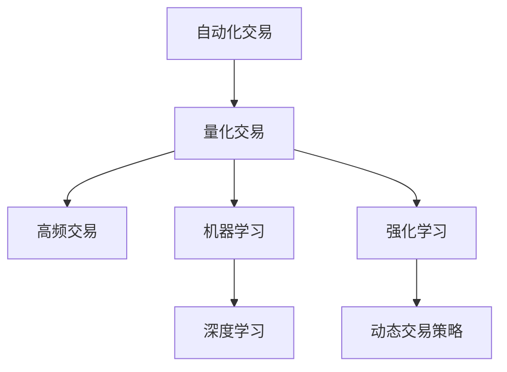

                 

# 如何将编程技能应用于自动化交易

## 1. 背景介绍

自动化交易（Algorithmic Trading, AT）是指通过编写计算机程序来自动化执行交易决策。自动化交易策略基于数学模型和统计方法，旨在利用市场数据和历史数据来预测未来价格走势，从而实现快速、精准、低成本的买卖操作。尽管自动化交易起源于1960年代的股票市场，但随着计算机技术的发展，如今它已成为金融市场不可或缺的一部分，被广泛应用于股票、期货、外汇、加密货币等多种金融资产的交易中。

在过去几十年中，量化交易已积累了丰富的理论基础和实践经验，但随着人工智能（AI）技术的迅猛发展，AI驱动的交易策略开始逐渐崭露头角。如今，利用机器学习、深度学习等AI技术来构建交易策略，已经成为自动化交易领域的前沿方向。

## 2. 核心概念与联系

### 2.1 核心概念概述

为更好地理解将编程技能应用于自动化交易，本节将介绍几个核心概念：

- **自动化交易(Algorithmic Trading, AT)**：通过编写计算机程序来自动化执行交易决策，以降低人为因素对交易决策的影响，提高交易效率和收益。
- **量化交易(Quantitative Trading, QT)**：基于统计学和数学模型进行交易决策，利用历史数据来预测未来价格走势。
- **高频交易(High-Frequency Trading, HFT)**：在短时间内频繁地执行大量交易，以微小的价格差获取收益。
- **机器学习(Machine Learning, ML)**：一种利用数据训练模型以实现预测和决策的AI方法，常用于构建交易策略。
- **深度学习(Deep Learning, DL)**：一种基于神经网络的机器学习技术，具有更强的特征提取和模式识别能力，常用于复杂金融数据的处理和预测。
- **强化学习(Reinforcement Learning, RL)**：一种利用奖励信号训练模型进行决策的AI方法，常用于构建动态交易策略。

这些核心概念之间存在着紧密的联系和相互影响，共同构成了自动化交易和AI驱动交易的基础。

### 2.2 核心概念原理和架构的 Mermaid 流程图



这个流程图展示了自动化交易的核心概念及其之间的关系：

1. 自动化交易是基于量化交易的进一步发展，通过编程实现自动化决策。
2. 量化交易是自动化交易的基础，利用统计学和数学模型进行预测。
3. 高频交易是自动化交易的一种特殊形式，强调速度和效率。
4. 机器学习和深度学习为自动化交易提供了强有力的工具，帮助构建和优化交易策略。
5. 强化学习通过奖励信号训练模型，实现动态和自适应的交易策略。

## 3. 核心算法原理 & 具体操作步骤

### 3.1 算法原理概述

将编程技能应用于自动化交易的核心在于构建和优化交易策略。交易策略通常基于一系列数学模型和统计方法，利用历史数据和市场数据来预测未来价格走势，并通过编写代码实现这些策略。常见的交易策略包括：

- **均值回归策略**：认为价格波动会趋向于均值，利用均值与价格的差值作为买卖信号。
- **趋势跟踪策略**：认为价格走势具有持续性，通过跟踪趋势的移动平均线来进行交易。
- **套利策略**：利用不同市场或不同时间跨度之间的价格差异，进行无风险套利。
- **机器学习策略**：通过训练机器学习模型来预测价格走势，实现更复杂的交易策略。

这些策略的核心在于将编程技能与数学和统计方法结合，通过编写代码实现自动化的交易决策。

### 3.2 算法步骤详解

将编程技能应用于自动化交易的步骤一般包括：

**Step 1: 数据采集**

- 从金融数据提供商（如Yahoo Finance、Quandl等）获取历史和实时市场数据。
- 使用Python等编程语言编写数据采集脚本，定时或实时获取数据。

**Step 2: 数据处理**

- 对采集到的数据进行清洗、去重、归一化等预处理，确保数据质量和一致性。
- 使用Pandas、NumPy等数据处理库进行数据清洗和处理。

**Step 3: 特征工程**

- 设计并提取用于训练模型的特征，如价格、成交量、移动平均线、MACD指标等。
- 使用Scikit-learn、TensorFlow等机器学习库进行特征工程和模型构建。

**Step 4: 模型训练**

- 利用历史数据训练机器学习或深度学习模型，以预测未来价格走势。
- 使用训练集进行模型训练，验证集进行参数调优和模型选择。

**Step 5: 模型优化**

- 根据验证集的表现，对模型进行优化和调参，如增加隐藏层、调整学习率等。
- 使用梯度下降等优化算法优化模型参数。

**Step 6: 回测与回测数据处理**

- 使用训练好的模型进行历史回测，验证其预测准确性和收益情况。
- 处理回测过程中出现的问题，如数据异常、模型预测错误等。

**Step 7: 实时交易策略部署**

- 将训练好的模型部署到交易平台上，进行实时交易。
- 监控模型表现，实时调整交易参数。

### 3.3 算法优缺点

将编程技能应用于自动化交易的优点包括：

1. 提高效率：自动化交易可以24小时不间断地进行交易，大大提高交易效率。
2. 降低成本：自动化交易减少了人力和交易成本，提高了交易的规模和速度。
3. 增强准确性：利用算法和数学模型进行决策，提高了交易的准确性和可靠性。
4. 灵活性高：算法可以根据市场变化进行动态调整，适应不同的市场环境。

缺点包括：

1. 风险高：自动化交易可能受到市场波动和算法漏洞的影响，存在较高的风险。
2. 依赖数据质量：模型的训练和预测依赖于高质量的数据，数据偏差可能导致模型失效。
3. 技术门槛高：自动化交易需要较高的编程技能和数学建模能力，入门难度较大。
4. 过度拟合：模型在训练集上表现良好，但在未见过的数据上可能表现不佳。

尽管存在这些缺点，但自动化交易仍是大数据和AI时代的必然趋势，其优势在于能够充分利用数据和算力，快速响应市场变化。

### 3.4 算法应用领域

将编程技能应用于自动化交易的领域非常广泛，涵盖金融市场各个方面，例如：

- **股票交易**：基于历史股价和市场情绪，编写交易策略进行股票买卖。
- **期货交易**：利用期货价格波动和套利机会，构建期货交易策略。
- **外汇交易**：通过外汇汇率预测和套利，实现外汇交易自动化。
- **加密货币交易**：利用区块链数据和价格走势，构建加密货币交易策略。
- **固定收益证券交易**：通过利率和信用评级预测，构建债券交易策略。
- **衍生品交易**：利用期权、期货等衍生品，构建复杂的交易策略。

这些领域都需要通过编程和算法实现自动化交易，以应对市场变化和提高交易效率。

## 4. 数学模型和公式 & 详细讲解

### 4.1 数学模型构建

本节将使用数学语言对自动化交易的数学模型进行更加严格的刻画。

记历史价格序列为 $P_t$，时间步长为 $\Delta t$，交易价格为 $P$，交易量为 $Q$，交易成本为 $C$，收益为 $R$。假设交易策略基于以下数学模型：

$$
P_{t+1} = P_t + \epsilon_t
$$

其中 $\epsilon_t$ 为随机误差项，假设服从均值为0的正态分布：

$$
\epsilon_t \sim \mathcal{N}(0,\sigma^2)
$$

交易策略通过模型预测未来价格，并通过以下方式选择买卖时机：

$$
Q_t = \alpha(P_t, P_{t+1})
$$

其中 $\alpha$ 为交易策略函数，根据价格变化调整交易量。

交易成本和收益可以表示为：

$$
C_t = \beta Q_t
$$

$$
R_t = Q_t(P_{t+1} - P_t)
$$

其中 $\beta$ 为交易成本系数。

交易策略的总收益为：

$$
R = \sum_{t=0}^T R_t - \sum_{t=0}^T C_t
$$

### 4.2 公式推导过程

基于上述数学模型，我们可以推导出自动化交易的基本思路：

1. 使用历史价格序列训练模型，预测未来价格变化。
2. 根据预测结果和当前价格，选择买卖时机和交易量。
3. 计算交易成本和收益，并进行总收益的评估。

具体推导过程如下：

1. 假设历史价格序列 $P_t$ 服从几何布朗运动：

$$
P_t = P_0 e^{\mu t + \sigma W_t}
$$

其中 $W_t$ 为标准布朗运动，$\mu$ 为价格漂移率。

2. 基于几何布朗运动，预测未来价格变化：

$$
P_{t+1} = P_0 e^{(\mu + \frac{1}{2}\sigma^2)\Delta t + \sigma \sqrt{\Delta t} Z_t}
$$

其中 $Z_t$ 为标准正态分布随机变量。

3. 根据预测结果和当前价格，选择买卖时机和交易量：

$$
Q_t = \alpha(P_t, P_{t+1}) = \alpha(P_0 e^{\mu t + \sigma W_t}, P_0 e^{(\mu + \frac{1}{2}\sigma^2)\Delta t + \sigma \sqrt{\Delta t} Z_t})
$$

4. 计算交易成本和收益，并进行总收益的评估：

$$
C_t = \beta Q_t
$$

$$
R_t = Q_t(P_{t+1} - P_t) = \beta Q_t (P_0 e^{(\mu + \frac{1}{2}\sigma^2)\Delta t + \sigma \sqrt{\Delta t} Z_t} - P_0 e^{\mu t + \sigma W_t})
$$

$$
R = \sum_{t=0}^T R_t - \sum_{t=0}^T C_t
$$

### 4.3 案例分析与讲解

以基于历史价格的均值回归策略为例，推导其具体实现过程：

假设当前价格为 $P_t$，历史价格序列的均值为 $\mu$，标准差为 $\sigma$，交易策略基于以下公式：

$$
Q_t = \alpha(P_t - \mu)
$$

其中 $\alpha$ 为交易量系数。

当 $P_t > \mu$ 时，执行卖出操作，反之执行买入操作。

该策略的数学推导和实现过程如下：

1. 历史价格序列 $P_t$ 服从几何布朗运动：

$$
P_t = P_0 e^{\mu t + \sigma W_t}
$$

2. 预测未来价格变化：

$$
P_{t+1} = P_0 e^{(\mu + \frac{1}{2}\sigma^2)\Delta t + \sigma \sqrt{\Delta t} Z_t}
$$

3. 选择买卖时机和交易量：

$$
Q_t = \alpha(P_t - \mu)
$$

4. 计算交易成本和收益，并进行总收益的评估：

$$
C_t = \beta Q_t
$$

$$
R_t = Q_t(P_{t+1} - P_t) = \beta Q_t (P_0 e^{(\mu + \frac{1}{2}\sigma^2)\Delta t + \sigma \sqrt{\Delta t} Z_t} - P_0 e^{\mu t + \sigma W_t})
$$

$$
R = \sum_{t=0}^T R_t - \sum_{t=0}^T C_t
$$

该策略的优点在于简单易懂，易于实现。缺点在于假设历史价格服从几何布朗运动，可能在实际市场环境中表现不佳。

## 5. 项目实践：代码实例和详细解释说明

### 5.1 开发环境搭建

在进行自动化交易开发前，我们需要准备好开发环境。以下是使用Python进行Pandas和TensorFlow开发的Python环境配置流程：

1. 安装Anaconda：从官网下载并安装Anaconda，用于创建独立的Python环境。

2. 创建并激活虚拟环境：
```bash
conda create -n trading-env python=3.8 
conda activate trading-env
```

3. 安装Pandas、TensorFlow、Scikit-learn等工具包：
```bash
pip install pandas tensorflow scikit-learn
```

完成上述步骤后，即可在`trading-env`环境中开始自动化交易的开发实践。

### 5.2 源代码详细实现

下面我们以基于历史价格均值回归策略为例，给出使用Pandas和TensorFlow进行自动化交易的Python代码实现。

首先，定义历史价格和交易量：

```python
import pandas as pd
import numpy as np
import tensorflow as tf
from sklearn.preprocessing import StandardScaler

# 定义历史价格
price = pd.read_csv('price.csv', index_col=0)
price.index = pd.to_datetime(price.index)

# 定义交易量
quantity = pd.read_csv('quantity.csv', index_col=0)
quantity.index = pd.to_datetime(quantity.index)

# 标准化价格和交易量
scaler = StandardScaler()
price_scaled = scaler.fit_transform(price.values)
quantity_scaled = scaler.fit_transform(quantity.values)
```

然后，定义模型和优化器：

```python
# 定义价格预测模型
model = tf.keras.Sequential([
    tf.keras.layers.Dense(64, activation='relu', input_shape=(1,)),
    tf.keras.layers.Dense(64, activation='relu'),
    tf.keras.layers.Dense(1)
])

# 定义优化器
optimizer = tf.keras.optimizers.Adam(learning_rate=0.001)
```

接着，定义训练和评估函数：

```python
# 定义训练函数
def train_model(model, X_train, y_train, epochs=100, batch_size=32):
    model.compile(optimizer=optimizer, loss='mse')
    model.fit(X_train, y_train, epochs=epochs, batch_size=batch_size, verbose=1)

# 定义评估函数
def evaluate_model(model, X_test, y_test):
    y_pred = model.predict(X_test)
    mse = tf.keras.losses.mean_squared_error(y_test, y_pred)
    print('Mean Squared Error:', mse.numpy())
```

最后，启动训练流程并在回测数据上评估：

```python
# 定义历史价格和交易量
X_train = price_scaled[:-10]
y_train = price_scaled[-10:] - price_scaled[:-10]
X_test = price_scaled[-10:]
y_test = price_scaled[-10:] - price_scaled[:-10]

# 训练模型
train_model(model, X_train, y_train)

# 评估模型
evaluate_model(model, X_test, y_test)
```

以上就是使用Pandas和TensorFlow进行自动化交易的完整代码实现。可以看到，通过Pandas进行数据处理，通过TensorFlow构建和训练模型，能够高效地实现自动化交易策略。

### 5.3 代码解读与分析

让我们再详细解读一下关键代码的实现细节：

**历史价格和交易量定义**：
- 使用Pandas读取历史价格和交易量数据，并转换为时间序列。
- 使用StandardScaler对价格和交易量进行标准化处理，以提高模型的收敛速度和泛化能力。

**模型定义**：
- 使用TensorFlow构建一个简单的神经网络模型，用于预测价格变化。
- 模型包含两个全连接层和一个输出层，输出层的激活函数为线性，用于预测价格变化。
- 使用Adam优化器进行模型训练，学习率为0.001。

**训练函数定义**：
- 使用TensorFlow的fit方法训练模型，在训练集上进行epochs轮的训练，batch_size为32。
- 在每个epoch结束时打印训练进度。

**评估函数定义**：
- 在测试集上计算模型预测值与真实值之间的均方误差（MSE）。

**训练和评估流程**：
- 在训练集上训练模型，并在测试集上评估模型性能。
- 输出均方误差，评估模型的预测准确性。

可以看到，自动化交易的代码实现并不复杂，主要是利用Python的Pandas和TensorFlow库进行数据处理和模型构建。但需要注意的是，实际应用中可能需要对模型进行调参和优化，以获得更好的预测效果。

## 6. 实际应用场景

### 6.1 股票交易

基于历史股价和市场情绪，编写交易策略进行股票买卖，是自动化交易的重要应用场景。例如，可以使用基于历史价格均值回归策略，预测股票价格变化，并在价格偏离均值时进行买卖操作。此外，还可以利用深度学习和强化学习等高级技术，构建更加复杂的交易策略。

在实际应用中，可以使用自动化交易平台，如QuantConnect、Alpaca等，实现股票交易策略的部署和监控。

### 6.2 期货交易

期货交易策略通常基于历史价格和市场情绪，利用期货价格波动和套利机会，构建期货交易策略。例如，可以使用基于技术分析的策略，如移动平均线交叉策略，预测期货价格变化，并在价格交叉时进行买卖操作。此外，还可以利用机器学习等高级技术，构建更加复杂的交易策略。

在实际应用中，可以使用自动化交易平台，如Interactive Brokers、E*TRADE等，实现期货交易策略的部署和监控。

### 6.3 外汇交易

外汇交易策略通常基于汇率波动和套利机会，利用区块链数据和价格走势，构建加密货币交易策略。例如，可以使用基于技术分析的策略，如移动平均线交叉策略，预测汇率变化，并在价格交叉时进行买卖操作。此外，还可以利用机器学习等高级技术，构建更加复杂的交易策略。

在实际应用中，可以使用自动化交易平台，如MetaTrader、FOREX.com等，实现外汇交易策略的部署和监控。

### 6.4 未来应用展望

随着AI技术的不断发展，自动化交易领域将迎来更多创新和突破。未来，AI驱动的交易策略将更加智能化、自适应和自动化，能够在更复杂的市场环境中取得更好的效果。

1. **自适应交易策略**：利用深度学习和强化学习等技术，构建能够自动适应市场变化的自适应交易策略。例如，基于强化学习，模型能够在交易过程中实时调整交易参数，以应对市场波动和变化。

2. **多策略组合**：利用组合优化技术，将多种交易策略进行组合，实现风险分散和收益最大化。例如，可以使用风险对冲策略，降低单策略的风险。

3. **高频交易**：利用高频交易技术，在短时间内频繁地执行大量交易，以微小的价格差获取收益。例如，可以使用高频交易策略，实时监控市场数据，快速执行交易。

4. **跨市场交易**：利用区块链技术和加密货币市场，构建跨市场交易策略。例如，可以使用区块链技术，实现跨交易所的交易和结算。

5. **数据驱动交易**：利用大数据技术和机器学习算法，构建基于数据的交易策略。例如，可以使用大数据技术，分析市场数据和用户行为，预测未来价格走势。

6. **智能合约交易**：利用智能合约技术，实现自动化交易策略的部署和执行。例如，可以使用智能合约，实现自动化的股票和加密货币交易。

## 7. 工具和资源推荐

### 7.1 学习资源推荐

为了帮助开发者系统掌握自动化交易的理论基础和实践技巧，这里推荐一些优质的学习资源：

1. **《算法交易实用指南》**：一本系统介绍自动化交易原理和策略的书籍，适合初学者和进阶者阅读。
2. **QuantConnect**：一个开源的自动化交易平台，提供丰富的学习资源和社区支持，适合学习和实践自动化交易。
3. **Alpaca Trading**：一个提供实时市场数据和API的自动化交易平台，适合实践和测试交易策略。
4. **Interactive Brokers**：一个提供多种金融市场的自动化交易平台，适合研究和实践期货交易等。
5. **E*TRADE**：一个提供多种金融市场的自动化交易平台，适合研究和实践股票和外汇交易。

通过对这些资源的学习实践，相信你一定能够快速掌握自动化交易的精髓，并用于解决实际的金融问题。

### 7.2 开发工具推荐

高效的开发离不开优秀的工具支持。以下是几款用于自动化交易开发的常用工具：

1. **Pandas**：一个强大的数据处理库，支持多维数据分析、时间序列处理、数据可视化等。
2. **TensorFlow**：一个开源的机器学习框架，支持深度学习和强化学习等高级技术。
3. **Scikit-learn**：一个开源的机器学习库，支持多种经典的机器学习算法。
4. **QuantConnect**：一个开源的自动化交易平台，提供丰富的学习资源和社区支持。
5. **Alpaca Trading**：一个提供实时市场数据和API的自动化交易平台。
6. **Interactive Brokers**：一个提供多种金融市场的自动化交易平台。
7. **E*TRADE**：一个提供多种金融市场的自动化交易平台。

合理利用这些工具，可以显著提升自动化交易的开发效率，加快创新迭代的步伐。

### 7.3 相关论文推荐

自动化交易领域的研究已经积累了丰富的成果，以下是几篇奠基性的相关论文，推荐阅读：

1. **《程序化交易》**：一本系统介绍自动化交易原理和策略的书籍，适合初学者和进阶者阅读。
2. **《算法交易：策略、技术与实践》**：一本介绍自动化交易策略和技术的书籍，适合学习者和实践者阅读。
3. **《高维统计分析》**：一本介绍高维统计分析方法的书籍，适合研究者阅读。
4. **《深度学习与人工智能交易》**：一本介绍深度学习在交易中的应用，适合研究者和实践者阅读。
5. **《强化学习与智能交易》**：一本介绍强化学习在交易中的应用，适合研究者和实践者阅读。

这些论文代表了大规模语言模型微调技术的发展脉络。通过学习这些前沿成果，可以帮助研究者把握学科前进方向，激发更多的创新灵感。

## 8. 总结：未来发展趋势与挑战

### 8.1 总结

本文对将编程技能应用于自动化交易的方法进行了全面系统的介绍。首先阐述了自动化交易的理论基础和应用场景，明确了将编程技能应用于交易决策的核心价值。其次，从原理到实践，详细讲解了自动化交易的数学模型和关键步骤，给出了自动化交易策略的完整代码实例。同时，本文还广泛探讨了自动化交易在股票、期货、外汇、加密货币等多个领域的应用前景，展示了自动化交易的巨大潜力。此外，本文精选了自动化交易的各类学习资源，力求为读者提供全方位的技术指引。

通过本文的系统梳理，可以看到，将编程技能应用于自动化交易的实践，已经在金融市场取得了显著成效，推动了交易效率和收益的提升。未来，伴随AI技术的不断演进，自动化交易将迎来更多创新和突破，成为金融市场的重要力量。

### 8.2 未来发展趋势

展望未来，自动化交易领域将呈现以下几个发展趋势：

1. **智能化交易**：利用深度学习和强化学习等高级技术，构建更加智能化和自适应的交易策略。例如，基于强化学习，模型能够在交易过程中实时调整交易参数，以应对市场波动和变化。

2. **自适应交易策略**：利用强化学习等技术，构建能够自动适应市场变化的自适应交易策略。例如，基于强化学习，模型能够在交易过程中实时调整交易参数，以应对市场波动和变化。

3. **高频交易**：利用高频交易技术，在短时间内频繁地执行大量交易，以微小的价格差获取收益。例如，可以使用高频交易策略，实时监控市场数据，快速执行交易。

4. **多策略组合**：利用组合优化技术，将多种交易策略进行组合，实现风险分散和收益最大化。例如，可以使用风险对冲策略，降低单策略的风险。

5. **跨市场交易**：利用区块链技术和加密货币市场，构建跨市场交易策略。例如，可以使用区块链技术，实现跨交易所的交易和结算。

6. **数据驱动交易**：利用大数据技术和机器学习算法，构建基于数据的交易策略。例如，可以使用大数据技术，分析市场数据和用户行为，预测未来价格走势。

以上趋势凸显了自动化交易技术的广阔前景。这些方向的探索发展，必将进一步提升交易系统的性能和应用范围，为金融市场带来新的变革。

### 8.3 面临的挑战

尽管自动化交易技术已经取得了显著成效，但在迈向更加智能化和自适应交易的过程中，仍面临诸多挑战：

1. **数据质量问题**：数据质量对交易策略的准确性和可靠性至关重要，但获取高质量的交易数据往往需要较高的成本和时间。如何提高数据质量和可用性，将是未来的重要挑战。

2. **算法鲁棒性不足**：自动化交易算法面临市场波动和数据噪声的影响，容易出现算法失效或预测错误。如何提高算法的鲁棒性和稳定性，将是未来的重要课题。

3. **计算资源限制**：大型交易策略的计算资源需求较高，往往需要高性能的计算设备。如何优化算法和模型，减少计算资源消耗，实现高效的交易策略，将是未来的重要方向。

4. **监管合规问题**：自动化交易策略需要符合金融市场的监管要求，但如何在保证交易策略合规性的同时，最大化收益，将是未来的重要挑战。

5. **市场波动风险**：自动化交易策略面临市场波动和突发事件的考验，容易出现策略失效或预测错误。如何提高策略的鲁棒性和适应性，将是未来的重要课题。

6. **系统安全问题**：自动化交易系统面临网络攻击和数据泄露的风险，如何保证系统的安全性和稳定性，将是未来的重要方向。

这些挑战凸显了自动化交易技术在实际应用中需要解决的重要问题。只有通过不断优化和改进，才能实现更加智能化和自适应的交易策略，提高金融市场的效率和收益。

### 8.4 研究展望

面对自动化交易面临的诸多挑战，未来的研究需要在以下几个方面寻求新的突破：

1. **提升数据质量**：通过大数据技术和人工智能技术，提高数据质量和可用性，确保交易策略的准确性和可靠性。例如，利用大数据技术，分析市场数据和用户行为，预测未来价格走势。

2. **增强算法鲁棒性**：利用深度学习和强化学习等技术，提高算法的鲁棒性和稳定性，减少预测误差和策略失效的风险。例如，基于强化学习，模型能够在交易过程中实时调整交易参数，以应对市场波动和变化。

3. **优化计算资源**：通过算法和模型优化，减少计算资源消耗，提高交易策略的计算效率和实时性。例如，使用混合精度训练和模型压缩等技术，优化计算资源消耗。

4. **合规性研究**：研究自动化交易策略的合规性问题，确保策略符合金融市场的监管要求，最大化收益。例如，研究自动化交易策略的合法性、透明性和公平性，保证策略合规性。

5. **系统安全性研究**：研究自动化交易系统的安全性和稳定性，防止网络攻击和数据泄露。例如，利用加密技术和安全协议，保护交易数据和系统安全。

6. **市场适应性研究**：研究自动化交易策略的市场适应性，提高策略的鲁棒性和适应性。例如，利用大数据技术和人工智能技术，分析市场数据和用户行为，预测未来价格走势。

这些研究方向将为自动化交易技术的进一步发展提供新的思路和方法，推动金融市场向更加智能化和自适应的方向迈进。

## 9. 附录：常见问题与解答

**Q1：自动化交易的优点和缺点是什么？**

A: 自动化交易的优点包括：
1. 提高效率：自动化交易可以24小时不间断地进行交易，大大提高交易效率。
2. 降低成本：自动化交易减少了人力和交易成本，提高了交易的规模和速度。
3. 增强准确性：利用算法和数学模型进行决策，提高了交易的准确性和可靠性。

自动化交易的缺点包括：
1. 风险高：自动化交易可能受到市场波动和算法漏洞的影响，存在较高的风险。
2. 依赖数据质量：模型的训练和预测依赖于高质量的数据，数据偏差可能导致模型失效。
3. 技术门槛高：自动化交易需要较高的编程技能和数学建模能力，入门难度较大。

**Q2：如何进行自动化交易策略的测试和优化？**

A: 自动化交易策略的测试和优化通常包括以下步骤：
1. 回测：使用历史数据对交易策略进行回测，评估其历史表现和收益情况。
2. 优化：根据回测结果，对交易策略进行参数调优，改进模型结构和算法。
3. 模拟交易：使用模拟交易平台，对优化后的交易策略进行模拟交易，评估其在真实市场中的表现。
4. 实盘交易：在实际交易平台进行实盘交易，验证交易策略的实际效果和收益。
5. 监控和调整：实时监控交易策略的表现，及时调整策略参数，适应市场变化。

**Q3：如何选择自动化交易策略？**

A: 选择自动化交易策略需要考虑以下因素：
1. 市场环境：不同市场环境下的交易策略可能有所不同，需要根据市场特征选择合适的策略。
2. 交易成本：交易成本对收益有重要影响，需要选择低成本的交易策略。
3. 风险承受能力：不同风险承受能力的投资者需要选择不同的交易策略。
4. 技术复杂度：交易策略的技术复杂度需要与自身技术水平相匹配。

**Q4：如何提高自动化交易的鲁棒性？**

A: 提高自动化交易的鲁棒性需要从以下几个方面入手：
1. 数据清洗：对数据进行清洗和去重，确保数据质量和一致性。
2. 特征工程：设计合适的特征，提高模型的泛化能力。
3. 模型优化：通过优化算法和模型，提高模型的鲁棒性和稳定性。
4. 异常检测：利用异常检测技术，识别和排除异常数据和异常事件。
5. 多重验证：使用多重验证方法，评估模型的鲁棒性和稳定性。

**Q5：如何防范自动化交易的风险？**

A: 防范自动化交易的风险需要从以下几个方面入手：
1. 回测测试：使用回测测试，评估交易策略的历史表现和风险。
2. 风险管理：建立风险管理体系，对交易策略进行风险评估和控制。
3. 合规性审查：确保交易策略符合金融市场的监管要求，最大化收益。
4. 实时监控：实时监控交易策略的表现，及时调整策略参数，适应市场变化。
5. 应急预案：建立应急预案，应对市场波动和突发事件。

---

作者：禅与计算机程序设计艺术 / Zen and the Art of Computer Programming

