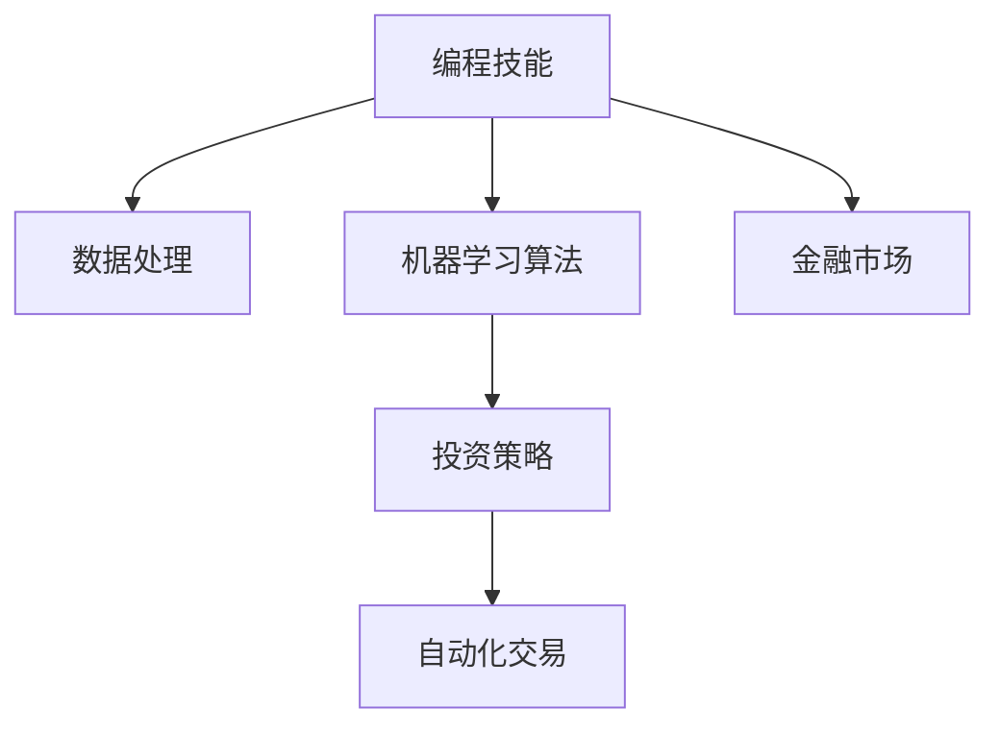

                 

# 如何将编程技能应用于自动化投资

## 1. 背景介绍

随着人工智能技术的迅猛发展，自动化投资成为了金融领域的新热点。自动化投资不仅能够大幅提升投资效率和精度，还能在复杂多变的市场环境中保持长期稳定的收益。本文将从编程技能的角度，探讨如何将编程技能应用于自动化投资，介绍一些核心的算法和框架，以期对读者在自动化投资领域的应用提供参考。

### 1.1 问题由来

传统的投资流程繁琐复杂，依赖人工分析、决策和交易操作。这不仅效率低下，且容易受到人为情绪和偏见的影响。而自动化投资则利用先进算法和模型，能够24/7进行市场分析、决策和交易，大幅提升投资效率和精准度。

### 1.2 问题核心关键点

实现自动化投资的核心在于构建高效的数据处理、模型训练和交易执行系统。这一过程需要掌握多种编程语言、数据处理技术、机器学习算法和金融市场知识。本文将详细介绍编程技能在这些关键点上的应用，帮助读者理解如何将编程技能转化为自动化投资能力。

### 1.3 问题研究意义

自动化投资是未来金融发展的重要方向，掌握编程技能将大大提升投资者在自动化投资中的竞争力。编程技能不仅能够帮助构建高效的投资系统，还能让投资者深入理解市场动态，制定更为科学合理的投资策略。

## 2. 核心概念与联系

### 2.1 核心概念概述

为了更好地理解编程技能在自动化投资中的应用，本节将介绍几个关键概念：

- **编程技能**：指使用一种或多种编程语言，进行算法设计、数据处理、模型训练、系统部署等任务的能力。
- **数据处理**：从原始数据中提取、清洗、特征工程、数据表示等，为模型训练提供高质量输入数据。
- **机器学习算法**：通过训练数据构建预测模型，用于自动化决策和分析。
- **金融市场**：全球股票、债券、期货、外汇等多种金融产品的交易市场，其动态变化需要深入分析。
- **投资策略**：基于市场分析和模型预测，制定投资组合选择和买卖时机决策的方案。
- **自动化交易**：使用算法自动执行投资策略中的买卖操作，减少人为干预。

这些概念之间的联系可以通过以下Mermaid流程图来展示：



这个流程图展示了几组核心概念之间的联系：

1. 编程技能提供了实现数据处理、算法设计和系统部署的技术手段。
2. 数据处理从原始数据中提取有价值信息，为模型训练提供输入。
3. 机器学习算法利用数据构建预测模型，提供决策依据。
4. 金融市场动态变化，是投资策略制定和模型验证的环境。
5. 投资策略指导自动化交易，完成买卖操作。

这些概念共同构成了自动化投资的核心框架，帮助投资者利用编程技能高效地构建投资系统。

## 3. 核心算法原理 & 具体操作步骤

### 3.1 算法原理概述

自动化投资的核心算法包括数据预处理、特征工程、模型训练和投资策略设计。以下对各个环节的算法原理进行概述：

**数据预处理**：
- 数据清洗：去除缺失值、异常值和重复数据。
- 数据归一化：将数据缩放到[0,1]或[-1,1]之间，避免模型偏向某个数值范围。
- 特征工程：选择和构造有意义的特征，如技术指标、市场情绪指标等。

**特征工程**：
- 特征选择：筛选与目标预测相关的特征。
- 特征转换：对原始特征进行转换，如对数转换、标准化等。
- 特征提取：利用PCA、LDA等算法提取数据中的隐含信息。

**模型训练**：
- 监督学习：使用历史数据训练模型，如回归、分类模型。
- 无监督学习：利用无标签数据进行模型训练，如聚类、降维等。
- 强化学习：通过模拟交易环境训练模型，学习最优交易策略。

**投资策略设计**：
- 技术分析：利用历史价格、交易量等数据进行策略设计。
- 基本面分析：分析公司财务报表、行业动态等数据。
- 量化分析：使用高级统计和计算模型，如随机游走模型、回归模型等。

### 3.2 算法步骤详解

自动化投资系统的构建主要包括以下几个关键步骤：

**Step 1: 数据采集与预处理**
- 从各大金融市场获取实时数据。
- 对原始数据进行清洗和预处理，如去除噪音、归一化、特征提取等。
- 将数据分为训练集、验证集和测试集。

**Step 2: 模型训练与评估**
- 选择合适的模型，如线性回归、随机森林、深度学习等。
- 使用训练集训练模型，验证集评估模型性能。
- 调整模型参数，使用测试集评估最终模型效果。

**Step 3: 投资策略设计**
- 基于模型预测结果，设计投资策略，如多策略组合、动态权重调整等。
- 模拟交易环境进行策略测试，评估策略效果。

**Step 4: 自动化交易部署**
- 将模型集成到自动化交易系统中，实现实时交易操作。
- 监控交易系统性能，定期更新模型和策略。

### 3.3 算法优缺点

自动化投资的算法有以下优点：
1. 效率高：自动化算法能够24/7进行市场分析和交易操作，大幅提高投资效率。
2. 精度高：自动化算法能够避免人为情绪和偏见，提高投资决策的准确性。
3. 策略多样化：自动化算法能够设计多种投资策略，灵活应对市场变化。
4. 灵活性强：自动化算法可以不断更新和优化，适应新的市场环境。

同时，这些算法也存在一些局限性：
1. 数据依赖性强：自动化算法依赖高质量的数据输入，数据偏差会影响模型效果。
2. 模型复杂度高：复杂模型容易过拟合，需要大量数据和计算资源进行训练。
3. 系统风险高：自动化交易系统可能存在技术故障或错误，带来不可预知的风险。
4. 算法透明度低：复杂的自动化算法难以解释，投资决策缺乏可解释性。

尽管存在这些局限性，但就目前而言，自动化投资仍是金融领域的重要趋势。未来相关研究的重点在于如何进一步降低数据依赖，提高算法的可解释性，同时兼顾系统稳定性和鲁棒性等因素。

### 3.4 算法应用领域

自动化投资的核心算法和框架已经在多个金融领域得到应用，例如：

- **股票投资**：利用机器学习模型预测股票价格走势，制定交易策略。
- **债券投资**：分析公司财务报表和信用评级，构建投资组合。
- **外汇交易**：使用强化学习模型学习最优交易策略，实现高收益。
- **商品投资**：分析市场供需关系，预测商品价格波动。
- **对冲基金**：利用复杂量化模型，设计高风险高收益策略。
- **保险行业**：分析市场风险和用户需求，制定精算策略。

除了上述这些经典应用外，自动化投资还被创新性地应用到更多场景中，如大宗商品交易、量化套利、期权定价等，为金融市场带来了新的活力和机遇。

## 4. 数学模型和公式 & 详细讲解  
### 4.1 数学模型构建

在自动化投资中，常见的数学模型包括线性回归、逻辑回归、随机森林、深度学习等。以下以线性回归模型为例，介绍其数学模型构建和优化过程。

**线性回归模型**：
- 目标函数：最小化预测误差平方和，即$ \sum_{i=1}^n(y_i-\hat{y_i})^2 $。
- 优化目标：求取模型参数$\theta$，使目标函数最小化。
- 求解方法：使用梯度下降等优化算法，逐步更新参数$\theta$，最小化目标函数。

**公式推导过程**：
1. 建立线性回归模型：$\hat{y_i} = \theta_0 + \theta_1x_{i1} + \theta_2x_{i2} + ... + \theta_nx_{in}$
2. 目标函数：$J(\theta) = \frac{1}{2m} \sum_{i=1}^m(y_i-\hat{y_i})^2$
3. 梯度下降公式：$\theta_k = \theta_k - \alpha\frac{1}{m}\sum_{i=1}^m(y_i-\hat{y_i})x_{ik}$

在得到目标函数和梯度公式后，即可带入具体的数据和参数进行模型训练。线性回归模型是一种简单有效的预测模型，适合于金融市场中的价格预测和风险分析。

### 4.2 公式推导过程

以下是线性回归模型的详细推导过程：

1. 线性回归模型假设：$y = \theta_0 + \theta_1x_1 + \theta_2x_2 + ... + \theta_nx_n$
2. 目标函数：$J(\theta) = \frac{1}{2m}\sum_{i=1}^m(y_i-\hat{y_i})^2$
3. 梯度公式：$\frac{\partial J}{\partial \theta_k} = \frac{1}{m}\sum_{i=1}^m(y_i-\hat{y_i})x_{ik}$
4. 求解方法：$\nabla J = \begin{bmatrix}\frac{\partial J}{\partial \theta_0} \\ \frac{\partial J}{\partial \theta_1} \\ ... \\ \frac{\partial J}{\partial \theta_n}\end{bmatrix} = \begin{bmatrix}0 \\ 0 \\ ... \\ 0\end{bmatrix}$

将梯度公式带入目标函数，即得到线性回归模型的求解公式。通过迭代计算，逐步更新模型参数$\theta$，直至目标函数收敛，即可得到线性回归模型。

### 4.3 案例分析与讲解

以下以金融市场价格预测为例，说明线性回归模型的应用过程。

假设要预测某股票的价格，模型输入为时间序列的历史价格数据$(x_1,x_2,...,x_n)$，目标输出为预测价格$y$。

1. 数据准备：将历史价格数据分为训练集和测试集。
2. 特征工程：选择时间、开盘价、收盘价等特征。
3. 模型训练：使用梯度下降算法，训练线性回归模型。
4. 模型评估：在测试集上评估模型预测精度，调整模型参数。
5. 实时预测：使用训练好的模型，对未来价格进行预测。

通过以上步骤，线性回归模型能够准确预测金融市场价格走势，辅助投资者进行投资决策。

## 5. 项目实践：代码实例和详细解释说明
### 5.1 开发环境搭建

在进行自动化投资系统开发前，我们需要准备好开发环境。以下是使用Python进行PyTorch开发的环境配置流程：

1. 安装Anaconda：从官网下载并安装Anaconda，用于创建独立的Python环境。

2. 创建并激活虚拟环境：
```bash
conda create -n investment-env python=3.8 
conda activate investment-env
```

3. 安装PyTorch：根据CUDA版本，从官网获取对应的安装命令。例如：
```bash
conda install pytorch torchvision torchaudio cudatoolkit=11.1 -c pytorch -c conda-forge
```

4. 安装相关库：
```bash
pip install pandas numpy scikit-learn matplotlib tensorflow
```

5. 安装数据库和API库：
```bash
pip install sqlite3 pyodbc requests
```

完成上述步骤后，即可在`investment-env`环境中开始自动化投资系统的开发。

### 5.2 源代码详细实现

下面我们以线性回归模型为例，给出使用PyTorch进行金融市场价格预测的完整代码实现。

首先，导入必要的库和模块：

```python
import pandas as pd
import numpy as np
import matplotlib.pyplot as plt
import torch
from torch import nn, optim
from torch.utils.data import DataLoader
from sklearn.model_selection import train_test_split
```

然后，加载数据集并进行预处理：

```python
# 加载历史价格数据
data = pd.read_csv('price_data.csv')

# 将数据转换为Numpy数组
X = np.array(data[['open_price', 'close_price', 'time']]).reshape(-1, 3)
y = np.array(data['close_price'])

# 将数据分为训练集和测试集
X_train, X_test, y_train, y_test = train_test_split(X, y, test_size=0.2, random_state=42)
```

接着，定义线性回归模型并进行训练：

```python
# 定义线性回归模型
class LinearRegression(nn.Module):
    def __init__(self):
        super(LinearRegression, self).__init__()
        self.linear = nn.Linear(3, 1)

    def forward(self, x):
        return self.linear(x)

# 创建模型实例
model = LinearRegression()

# 定义损失函数和优化器
criterion = nn.MSELoss()
optimizer = optim.SGD(model.parameters(), lr=0.01)

# 数据批处理
batch_size = 64
train_loader = DataLoader(X_train, batch_size=batch_size, shuffle=True)
test_loader = DataLoader(X_test, batch_size=batch_size, shuffle=False)

# 训练模型
num_epochs = 100
for epoch in range(num_epochs):
    for i, (X, y) in enumerate(train_loader):
        X = torch.from_numpy(X).float()
        y = torch.from_numpy(y).float()
        
        # 前向传播
        outputs = model(X)
        
        # 计算损失
        loss = criterion(outputs, y)
        
        # 反向传播和参数更新
        optimizer.zero_grad()
        loss.backward()
        optimizer.step()
        
        if (i+1) % 10 == 0:
            print(f'Epoch [{epoch+1}/{num_epochs}], Step [{i+1}/{len(train_loader)}], Loss: {loss.item():.4f}')
```

最后，在测试集上评估模型性能并进行价格预测：

```python
# 在测试集上评估模型性能
model.eval()
test_loss = 0
with torch.no_grad():
    for X, y in test_loader:
        X = torch.from_numpy(X).float()
        y = torch.from_numpy(y).float()
        
        # 前向传播
        outputs = model(X)
        
        # 计算损失
        test_loss += criterion(outputs, y).item()
        
    print(f'Test Loss: {test_loss/len(test_loader):.4f}')

# 进行价格预测
num_steps = 30
X_predict = np.array(data[['open_price', 'close_price', 'time']]).reshape(-1, 3)
X_predict = torch.from_numpy(X_predict).float()
with torch.no_grad():
    y_predict = model(X_predict).squeeze()

# 绘制预测曲线
plt.plot(y, label='Actual')
plt.plot(y_predict.numpy(), label='Predicted')
plt.legend()
plt.show()
```

以上就是使用PyTorch进行金融市场价格预测的完整代码实现。可以看到，借助PyTorch的强大计算能力，我们可以快速搭建并训练线性回归模型，实现对金融市场价格的精准预测。

### 5.3 代码解读与分析

让我们再详细解读一下关键代码的实现细节：

**线性回归模型类定义**：
- `__init__`方法：定义模型参数，创建线性层。
- `forward`方法：定义前向传播过程，使用线性层进行预测。

**训练模型**：
- 定义损失函数和优化器。
- 使用DataLoader对数据进行批处理。
- 在每个epoch内，遍历训练集数据，进行前向传播、计算损失、反向传播和参数更新。

**模型评估**：
- 使用DataLoader对测试集数据进行批处理。
- 在测试集上计算模型损失，评估模型性能。

**价格预测**：
- 将测试集数据转换为模型输入。
- 在模型上前向传播，得到预测结果。
- 使用Matplotlib绘制实际价格与预测价格的曲线图。

可以看到，PyTorch提供了丰富的工具和框架，使得自动化投资系统的开发变得更加简单高效。开发者只需关注算法逻辑，不必过多关注底层实现细节，便能快速搭建并运行自动化投资系统。

当然，工业级的系统实现还需考虑更多因素，如模型的实时更新、异常处理、系统安全性等。但核心的编程技能和机器学习算法在自动化投资中仍然是不可或缺的。通过以上步骤，相信你一定能够利用编程技能，构建出高效、精准的自动化投资系统。

## 6. 实际应用场景
### 6.1 智能投顾

智能投顾系统是一种基于自动化投资的高级应用。智能投顾利用人工智能算法进行市场分析和投资决策，辅助投资者制定科学合理的投资策略。

在技术实现上，可以收集用户的投资偏好、风险承受能力等数据，结合市场动态进行多策略组合设计。智能投顾系统能够实时监控市场变化，动态调整投资组合，确保用户获得最佳投资回报。

### 6.2 高频交易

高频交易（HFT）是自动化投资的一种高级形式，利用高速算法和机器学习模型进行高频交易操作。HFT系统能够在大规模数据流中实时分析市场动态，快速决策执行，获取微小的时间套利机会。

在实现上，HFT系统需要构建高效率的算法和数据处理架构，实现毫秒级别的决策和执行。同时，HFT系统还需要具备高度的算法透明性和可解释性，确保交易决策的公正性和合理性。

### 6.3 量化对冲

量化对冲（Quantitative Hedge Fund）是一种利用量化模型进行对冲投资的策略。量化对冲系统通过构建复杂的算法模型，对冲市场风险，实现稳定的高收益。

在实现上，量化对冲系统需要构建多层次的模型架构，融合基本面分析和技术分析，进行多策略组合设计。同时，量化对冲系统还需要具备高度的鲁棒性和可扩展性，以应对复杂的市场环境。

### 6.4 未来应用展望

随着自动化投资技术的不断发展，未来将出现更多创新的应用场景，例如：

- **区块链投资**：利用区块链技术和智能合约，实现去中心化的自动化投资。
- **虚拟现实投教**：构建虚拟现实场景，让用户通过互动方式学习和体验投资知识。
- **NLP驱动投资**：利用自然语言处理技术，对新闻、社交媒体等非结构化数据进行情感分析，辅助投资决策。
- **无人驾驶投顾**：利用无人驾驶技术，实现智能投顾的自动化部署和动态管理。
- **智能合约交易**：利用智能合约技术，实现自动化的投资策略执行和风险控制。

这些创新应用将大幅拓展自动化投资的应用范围，提升投资系统的智能化水平。未来，自动化投资必将在更多的金融场景中发挥重要作用，成为金融领域的重要驱动力。

## 7. 工具和资源推荐
### 7.1 学习资源推荐

为了帮助开发者系统掌握自动化投资的理论基础和实践技巧，这里推荐一些优质的学习资源：

1. **《机器学习基础》**：斯坦福大学Andrew Ng教授的在线课程，全面介绍机器学习的基本概念和常用算法。

2. **《金融市场与投资》**：Princeton大学的Coursera课程，涵盖金融市场的基本原理和投资策略。

3. **《PyTorch深度学习入门》**：官方文档和教程，详细讲解PyTorch的使用方法，适合初学者入门。

4. **《金融编程：Python篇》**：Sutter教授的书籍，全面介绍金融市场分析和投资策略的Python实现。

5. **《投资策略实战》**：Tuckman和Dos Santos的书籍，介绍多种投资策略的详细实现和案例分析。

通过学习这些资源，相信你一定能够快速掌握自动化投资的理论基础和实践技巧，构建高效的投资系统。

### 7.2 开发工具推荐

高效的开发离不开优秀的工具支持。以下是几款用于自动化投资开发的常用工具：

1. **PyTorch**：基于Python的开源深度学习框架，灵活动态的计算图，适合快速迭代研究。

2. **TensorFlow**：由Google主导开发的开源深度学习框架，生产部署方便，适合大规模工程应用。

3. **Scikit-learn**：Python的机器学习库，包含丰富的统计和机器学习算法，适合快速原型设计和模型验证。

4. **QuantConnect**：Python量化投资平台，提供实时数据接口和算法交易引擎，适合量化策略开发和测试。

5. **Alpaca API**：提供股票、期货、加密货币等多种金融产品的API接口，方便进行自动化交易和数据采集。

6. **OANDA API**：提供外汇交易的API接口，支持实时市场数据采集和自动化交易。

合理利用这些工具，可以显著提升自动化投资系统的开发效率，加快创新迭代的步伐。

### 7.3 相关论文推荐

自动化投资是金融领域的重要研究方向，以下是几篇奠基性的相关论文，推荐阅读：

1. **《深度学习在金融市场中的应用的现状》**：Han和Zhang的综述文章，介绍深度学习在金融市场中的多个应用场景。

2. **《股票价格预测的机器学习技术》**：Wang等人的论文，介绍多种机器学习算法在股票价格预测中的应用。

3. **《投资组合管理的数学方法》**：Markowitz的经典著作，涵盖投资组合管理的数学原理和模型设计。

4. **《机器学习在金融市场中的优化策略》**：Chen和Sun的论文，介绍多种机器学习算法在金融市场中的优化策略。

这些论文代表了大数据和人工智能在金融市场中的最新研究进展，可以帮助你了解自动化投资的前沿技术和发展方向。

## 8. 总结：未来发展趋势与挑战

### 8.1 总结

本文从编程技能的角度，介绍了如何将编程技能应用于自动化投资。通过系统的理论和实践介绍，帮助读者理解自动化投资的算法原理和实现细节，掌握构建高效投资系统的关键技术。

自动化投资是未来金融领域的重要趋势，编程技能在其中扮演了重要的角色。通过合理的算法设计和系统架构，利用先进的数据处理和机器学习技术，能够实现高效的自动化投资。

### 8.2 未来发展趋势

展望未来，自动化投资技术将呈现以下几个发展趋势：

1. **算法复杂化**：未来将出现更多复杂的算法模型，如深度强化学习、进化算法等，提升投资决策的准确性和灵活性。

2. **数据多样化**：未来的自动化投资将综合利用多种数据源，包括金融市场数据、社交媒体数据、新闻报道等，提高投资决策的多样性和准确性。

3. **系统集成化**：未来的自动化投资系统将更加集成化，涵盖多种金融产品，提供一站式的投资管理服务。

4. **实时化**：自动化投资系统将具备实时分析能力和快速执行功能，满足高频交易和实时投顾的需求。

5. **量化对冲**：量化对冲系统将更加复杂和多样化，融合多种策略和模型，实现更高的风险控制和收益。

6. **AI+Fintech**：自动化投资将与人工智能和其他金融科技技术深度融合，提升投资系统的智能化和自动化水平。

这些趋势将进一步推动自动化投资技术的发展，提升投资决策的精准性和效率。未来，自动化投资必将成为金融领域的重要工具，帮助投资者在复杂多变的市场环境中实现稳定收益。

### 8.3 面临的挑战

尽管自动化投资技术取得了显著进展，但在迈向更加智能化、普适化应用的过程中，仍面临诸多挑战：

1. **数据质量问题**：高质量数据的获取和维护是自动化投资的核心，数据偏差和噪音将影响模型效果。

2. **模型复杂性**：复杂的算法模型需要大量的计算资源和训练数据，难以快速部署和优化。

3. **系统安全问题**：自动化投资系统涉及大量资金和数据，安全性问题不容忽视。

4. **法规合规问题**：自动化投资系统需要符合各国的法律法规，确保公平性和透明度。

5. **模型透明性**：复杂算法模型难以解释，投资决策的透明性和可解释性需要进一步提升。

6. **市场不确定性**：金融市场存在不确定性，自动化投资系统需要具备一定的鲁棒性和应对能力。

尽管存在这些挑战，但通过不断优化算法和系统设计，自动化投资技术将逐步克服这些难题，实现更高的应用价值。未来，自动化投资技术将在金融领域扮演越来越重要的角色，推动金融市场的持续发展和创新。

### 8.4 研究展望

自动化投资技术的未来研究应在以下几个方向进行深入探索：

1. **模型优化与提升**：开发更高效、更灵活的算法模型，提升投资决策的精度和鲁棒性。

2. **系统优化与集成**：优化系统架构和设计，提升自动化投资系统的可扩展性和稳定性。

3. **数据处理与治理**：构建高质量的数据处理流程，确保数据质量和一致性。

4. **法规合规与监管**：研究自动化投资系统的法规合规问题，确保系统的合法合规性。

5. **透明性与解释性**：提高算法的透明性和可解释性，确保投资决策的公正性和合理性。

6. **安全与防护**：加强系统的安全性防护，防止数据泄露和攻击。

这些研究方向将进一步推动自动化投资技术的进步，确保其在金融领域的安全和稳定应用。

## 9. 附录：常见问题与解答

**Q1：自动化投资是否适合所有投资者？**

A: 自动化投资适合大多数投资者，特别是那些缺乏时间、精力和专业知识的投资者。自动化投资能够实现24/7的交易操作，避免人为情绪和偏见的影响。但对于一些追求高频交易和高风险的投资者，仍需结合自身需求进行个性化的投资策略设计。

**Q2：自动化投资与人工投资的区别是什么？**

A: 自动化投资与人工投资的主要区别在于决策机制和执行效率。自动化投资依靠算法模型进行决策，快速高效地执行买卖操作，避免了人为情绪和偏见的影响。而人工投资则依赖投资者的经验和直觉，可能受到情绪波动和市场变化的影响。

**Q3：自动化投资是否需要高昂的初始投资？**

A: 自动化投资不需要高昂的初始投资。系统可以通过小规模资金进行持续优化和迭代，逐步提升投资效果。而高昂的初始投资通常是人工投资的特点，难以应对市场的快速变化。

**Q4：自动化投资是否需要持续学习？**

A: 是的，自动化投资系统需要持续学习和优化，以适应市场的变化和新的投资机会。通过实时数据反馈和模型更新，自动化投资系统可以不断提高投资决策的精准性和效率。

**Q5：自动化投资是否安全可靠？**

A: 自动化投资系统需要设计全面的安全措施，防止系统故障和恶意攻击。同时，系统的透明性和可解释性也是确保其安全可靠的重要因素。

通过以上问题的解答，相信你一定能够全面了解自动化投资的核心概念和实践技巧，构建高效、安全的投资系统。未来，自动化投资必将在金融领域发挥重要作用，成为投资者实现稳定收益的重要工具。

---

作者：禅与计算机程序设计艺术 / Zen and the Art of Computer Programming

