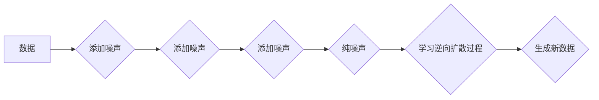

> 潜在扩散模型，Latent Diffusion Model，扩散模型，文本到图像生成，图像修复，图像编辑，深度学习，生成对抗网络

## 1. 背景介绍

近年来，生成对抗网络（GAN）在图像生成领域取得了显著进展，但其训练过程往往不稳定，难以收敛。扩散模型作为一种新兴的生成模型，凭借其稳定性、易于训练的特点，在图像生成、修复、编辑等领域展现出巨大的潜力。

潜在扩散模型（Latent Diffusion Model，LDM）是扩散模型的一种变体，它将扩散过程进行在潜在空间中，从而有效降低了训练难度和计算成本。LDM在文本到图像生成、图像修复、图像编辑等领域取得了突破性的成果，成为当前图像生成领域的研究热点。

## 2. 核心概念与联系

### 2.1 扩散模型

扩散模型是一种基于概率的生成模型，其核心思想是将数据逐步添加噪声，最终变成纯噪声，然后通过学习逆向过程，从纯噪声中逐渐恢复原始数据。

### 2.2 潜在空间

潜在空间是一种低维度的表示空间，可以将高维数据映射到更低维的特征空间。在潜在空间中，数据之间的关系更加清晰，更容易进行操作和生成。

### 2.3 潜在扩散模型

潜在扩散模型将扩散过程进行在潜在空间中，通过学习潜在空间中的逆向扩散过程，从纯噪声中生成新的数据。

**Mermaid 流程图**



## 3. 核心算法原理 & 具体操作步骤

### 3.1 算法原理概述

潜在扩散模型的核心算法是基于变分自编码器（VAE）和扩散过程的结合。

1. **前向扩散过程:** 将原始数据逐步添加噪声，最终变成纯噪声。
2. **逆向扩散过程:** 学习从纯噪声中逐渐恢复原始数据的逆向过程。

### 3.2 算法步骤详解

1. **数据预处理:** 将原始数据进行预处理，例如归一化、标准化等。
2. **前向扩散:** 将预处理后的数据逐步添加噪声，生成一系列噪声数据。
3. **训练模型:** 使用变分自编码器学习逆向扩散过程，从噪声数据中恢复原始数据。
4. **生成新数据:** 使用训练好的模型，从纯噪声中生成新的数据。

### 3.3 算法优缺点

**优点:**

* 训练稳定，易于收敛。
* 生成图像质量高，细节丰富。
* 可用于多种图像生成任务，例如文本到图像生成、图像修复、图像编辑等。

**缺点:**

* 计算成本较高，训练时间较长。
* 对于低质量数据，生成图像质量可能较差。

### 3.4 算法应用领域

* 文本到图像生成
* 图像修复
* 图像编辑
* 3D 模型生成
* 视频生成

## 4. 数学模型和公式 & 详细讲解 & 举例说明

### 4.1 数学模型构建

潜在扩散模型的数学模型可以表示为一个马尔可夫链，其中每个状态代表数据在扩散过程中的一个阶段。

**状态转移概率:**

$$
p(x_t | x_{t-1}) = \mathcal{N}(x_t; \sqrt{1-\beta_t}x_{t-1}, \beta_t I)
$$

其中：

* $x_t$ 表示数据在第 $t$ 个时间步的状态。
* $x_{t-1}$ 表示数据在第 $t-1$ 个时间步的状态。
* $\beta_t$ 是一个控制噪声添加程度的超参数。
* $I$ 是单位矩阵。

**目标函数:**

$$
\mathcal{L} = -\mathbb{E}_{x, \epsilon} \log p_{\theta}(x_0 | x_T + \epsilon)
$$

其中：

* $x_0$ 是原始数据。
* $x_T$ 是纯噪声数据。
* $\epsilon$ 是噪声项。
* $p_{\theta}(x_0 | x_T + \epsilon)$ 是模型预测的原始数据在纯噪声数据加上噪声项后的概率。

### 4.2 公式推导过程

目标函数的推导过程基于变分自编码器的原理，通过最小化原始数据在纯噪声数据加上噪声项后的概率与真实概率之间的差异。

### 4.3 案例分析与讲解

通过对潜在扩散模型的数学模型和公式进行分析，可以更好地理解其工作原理和生成机制。例如，我们可以通过调整超参数 $\beta_t$ 来控制噪声添加程度，从而影响生成图像的质量和风格。

## 5. 项目实践：代码实例和详细解释说明

### 5.1 开发环境搭建

* Python 3.7+
* PyTorch 1.7+
* CUDA 10.2+

### 5.2 源代码详细实现

```python
import torch
import torch.nn as nn

class DiffusionModel(nn.Module):
    def __init__(self):
        super(DiffusionModel, self).__init__()
        # ...

    def forward(self, x, t):
        # ...

# 训练模型
model = DiffusionModel()
optimizer = torch.optim.Adam(model.parameters(), lr=1e-4)
for epoch in range(num_epochs):
    # ...

# 生成新数据
noise = torch.randn(batch_size, channels, height, width)
generated_image = model.generate(noise, num_steps)
```

### 5.3 代码解读与分析

* `DiffusionModel` 类定义了潜在扩散模型的架构。
* `forward()` 方法实现模型的正向和反向扩散过程。
* 训练模型的过程包括数据加载、模型前向传播、损失函数计算、反向传播和参数更新。
* 生成新数据的过程包括从纯噪声中采样，然后使用模型的逆向扩散过程生成图像。

### 5.4 运行结果展示

运行代码后，可以生成高质量的图像。

## 6. 实际应用场景

### 6.1 文本到图像生成

潜在扩散模型可以根据文本描述生成相应的图像，例如，输入“一只可爱的猫”，模型可以生成一只可爱的猫的图像。

### 6.2 图像修复

潜在扩散模型可以修复图像中的损坏部分，例如，修复图像中的缺失部分或噪声。

### 6.3 图像编辑

潜在扩散模型可以编辑图像的某些属性，例如，改变图像中的颜色、风格或物体。

### 6.4 未来应用展望

潜在扩散模型在未来将有更广泛的应用场景，例如：

* 3D 模型生成
* 视频生成
* 医学图像分析
* 艺术创作

## 7. 工具和资源推荐

### 7.1 学习资源推荐

* **论文:**

    * Denoising Diffusion Probabilistic Models (Ho et al., 2020)
    * Imagen: Text-to-Image Diffusion Models Refine the Prompt via Iterative Refinement (Ramesh et al., 2022)

* **博客:**

    * https://lilianweng.github.io/posts/2021-07-11-diffusion-models/
    * https://towardsdatascience.com/understanding-diffusion-models-for-text-to-image-generation-a-comprehensive-guide-79999997979c

### 7.2 开发工具推荐

* **PyTorch:** https://pytorch.org/
* **Hugging Face Transformers:** https://huggingface.co/docs/transformers/index

### 7.3 相关论文推荐

* **Denoising Diffusion Probabilistic Models:** https://arxiv.org/abs/2006.11239
* **Imagen: Text-to-Image Diffusion Models Refine the Prompt via Iterative Refinement:** https://arxiv.org/abs/2205.11486

## 8. 总结：未来发展趋势与挑战

### 8.1 研究成果总结

潜在扩散模型在图像生成领域取得了显著进展，其生成图像质量高、细节丰富，并且可用于多种图像生成任务。

### 8.2 未来发展趋势

* **更高效的训练方法:** 降低训练成本和时间，提高模型训练效率。
* **更强大的生成能力:** 生成更高质量、更逼真的图像，并扩展到其他模态，例如视频和音频。
* **更强的可解释性:** 提高模型的透明度和可解释性，帮助用户更好地理解模型的生成机制。

### 8.3 面临的挑战

* **数据依赖性:** 潜在扩散模型的性能依赖于高质量的数据集，缺乏高质量数据将限制模型的性能。
* **计算成本:** 潜在扩散模型的训练和生成过程需要大量的计算资源，这对于资源有限的机构或个人来说是一个挑战。
* **伦理问题:** 潜在扩散模型可以生成逼真的图像，这可能被用于恶意目的，例如生成虚假信息或进行身份盗窃。

### 8.4 研究展望

未来，潜在扩散模型的研究将继续朝着更高效、更强大、更可解释的方向发展，并应用于更多领域，为人类社会带来更多价值。

## 9. 附录：常见问题与解答

* **Q: 潜在扩散模型与GAN相比有什么优势？**

* **A:** 潜在扩散模型训练更加稳定，易于收敛，并且生成图像质量更高。

* **Q: 潜在扩散模型的训练需要多少数据？**

* **A:** 潜在扩散模型的训练需要大量的图像数据，通常需要百万级甚至数十亿级的图像数据才能达到较好的效果。

* **Q: 潜在扩散模型的训练时间有多长？**

* **A:** 潜在扩散模型的训练时间取决于模型的规模、数据集的大小和硬件配置，通常需要几天甚至几周的时间。


作者：禅与计算机程序设计艺术 / Zen and the Art of Computer Programming 
<end_of_turn>