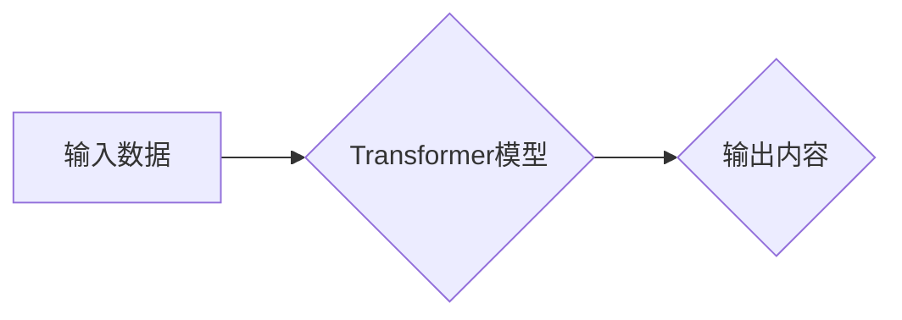

> 生成式AI、Transformer模型、文本生成、图像生成、多模态生成、伦理问题、安全问题、未来趋势

## 1. 背景介绍

近年来，人工智能（AI）领域取得了令人瞩目的进展，其中生成式AI作为一类重要的应用，展现出强大的潜力，正在深刻地改变着我们与世界交互的方式。生成式AI是指能够根据输入数据生成新内容的AI模型，例如文本、图像、音频、视频等。

传统的AI模型主要侧重于分类、预测等任务，而生成式AI则能够创造全新的内容，这使得其在许多领域拥有广泛的应用前景，例如：

* **文本生成:** 自动写作、机器翻译、对话系统、代码生成等。
* **图像生成:** 艺术创作、图像编辑、3D建模、虚拟现实等。
* **音频生成:** 音乐创作、语音合成、音效制作等。
* **视频生成:** 视频剪辑、动画制作、虚拟人物演绎等。

## 2. 核心概念与联系

生成式AI的核心概念是**深度学习**和**神经网络**。深度学习是一种机器学习的子领域，它利用多层神经网络来学习数据中的复杂模式。神经网络是一种模仿人脑神经元结构的计算模型，它通过连接多个神经元，并赋予每个连接权重，来学习数据之间的关系。

**Transformer模型**是近年来生成式AI领域取得突破性进展的关键技术。Transformer模型采用**自注意力机制**，能够有效地捕捉文本中的长距离依赖关系，从而生成更流畅、更自然的文本。

**Mermaid 流程图:**



## 3. 核心算法原理 & 具体操作步骤

### 3.1  算法原理概述

Transformer模型的核心是**自注意力机制**和**多头注意力机制**。自注意力机制能够让模型关注输入序列中不同位置的词语之间的关系，从而更好地理解文本的语义。多头注意力机制则通过使用多个注意力头，来捕捉不同类型的语义关系。

### 3.2  算法步骤详解

1. **词嵌入:** 将输入文本中的每个词语转换为向量表示。
2. **位置编码:** 为每个词语添加位置信息，以便模型能够区分词语的顺序。
3. **多头注意力:** 使用多个注意力头，分别关注不同类型的语义关系。
4. **前馈神经网络:** 对每个词语的注意力输出进行进一步处理。
5. **解码器:** 根据编码器的输出，生成目标文本。

### 3.3  算法优缺点

**优点:**

* 能够捕捉长距离依赖关系，生成更流畅、更自然的文本。
* 训练效率高，能够处理大规模文本数据。

**缺点:**

* 计算量大，需要强大的计算资源。
* 训练数据量大，需要大量高质量的文本数据。

### 3.4  算法应用领域

* 文本生成: 自动写作、机器翻译、对话系统、代码生成等。
* 图像生成: 艺术创作、图像编辑、3D建模、虚拟现实等。
* 音频生成: 音乐创作、语音合成、音效制作等。
* 视频生成: 视频剪辑、动画制作、虚拟人物演绎等。

## 4. 数学模型和公式 & 详细讲解 & 举例说明

### 4.1  数学模型构建

Transformer模型的数学模型主要包括以下几个部分:

* **词嵌入层:** 将每个词语映射到一个低维向量空间。
* **位置编码层:** 为每个词语添加位置信息。
* **多头注意力层:** 使用多个注意力头，分别关注不同类型的语义关系。
* **前馈神经网络层:** 对每个词语的注意力输出进行进一步处理。
* **解码器:** 根据编码器的输出，生成目标文本。

### 4.2  公式推导过程

**自注意力机制:**

$$
Attention(Q, K, V) = \frac{exp(Q \cdot K^T / \sqrt{d_k})}{exp(Q \cdot K^T / \sqrt{d_k})} \cdot V
$$

其中:

* $Q$ 是查询矩阵
* $K$ 是键矩阵
* $V$ 是值矩阵
* $d_k$ 是键向量的维度

**多头注意力机制:**

$$
MultiHead(Q, K, V) = Concat(head_1, head_2, ..., head_h) \cdot W_o
$$

其中:

* $head_i$ 是第 $i$ 个注意力头的输出
* $h$ 是注意力头的数量
* $W_o$ 是一个线性变换矩阵

### 4.3  案例分析与讲解

**举例说明:**

假设我们有一个句子 "The cat sat on the mat"，我们使用 Transformer 模型进行文本生成，目标是生成下一个词语。

1. 将句子中的每个词语转换为向量表示。
2. 使用位置编码层为每个词语添加位置信息。
3. 使用多头注意力层，让模型关注句子中不同词语之间的关系。
4. 使用前馈神经网络层，对每个词语的注意力输出进行进一步处理。
5. 使用解码器，根据编码器的输出，生成下一个词语 "."。

## 5. 项目实践：代码实例和详细解释说明

### 5.1  开发环境搭建

* Python 3.7+
* PyTorch 1.7+
* CUDA 10.2+

### 5.2  源代码详细实现

```python
import torch
import torch.nn as nn

class Transformer(nn.Module):
    def __init__(self, vocab_size, embedding_dim, num_heads, num_layers):
        super(Transformer, self).__init__()
        self.embedding = nn.Embedding(vocab_size, embedding_dim)
        self.pos_encoder = PositionalEncoding(embedding_dim)
        self.transformer_encoder = nn.TransformerEncoder(nn.TransformerEncoderLayer(embedding_dim, num_heads), num_layers)

    def forward(self, x):
        x = self.embedding(x)
        x = self.pos_encoder(x)
        x = self.transformer_encoder(x)
        return x

class PositionalEncoding(nn.Module):
    def __init__(self, embedding_dim):
        super(PositionalEncoding, self).__init__()
        self.embedding_dim = embedding_dim

    def forward(self, x):
        # ...

```

### 5.3  代码解读与分析

* **Transformer类:** 定义了Transformer模型的结构，包括词嵌入层、位置编码层和Transformer编码器。
* **PositionalEncoding类:** 定义了位置编码层，用于为每个词语添加位置信息。
* **forward方法:** 定义了模型的正向传播过程。

### 5.4  运行结果展示

运行代码后，可以生成新的文本内容。

## 6. 实际应用场景

### 6.1  文本生成

* **自动写作:** 生成新闻报道、产品描述、小说等文本。
* **机器翻译:** 将文本从一种语言翻译成另一种语言。
* **对话系统:** 创建能够与人类进行自然对话的聊天机器人。
* **代码生成:** 根据自然语言描述生成代码。

### 6.2  图像生成

* **艺术创作:** 生成绘画、雕塑、音乐等艺术作品。
* **图像编辑:** 修复图像、添加元素、生成新的图像。
* **3D建模:** 生成三维模型，用于游戏、电影、建筑等领域。
* **虚拟现实:** 生成虚拟场景和人物，用于虚拟现实体验。

### 6.3  音频生成

* **音乐创作:** 生成新的音乐作品，包括旋律、和声、节奏等。
* **语音合成:** 将文本转换为语音，用于语音助手、播报系统等。
* **音效制作:** 生成各种音效，用于游戏、电影、视频等。

### 6.4  未来应用展望

* **个性化内容生成:** 根据用户的喜好生成个性化的内容，例如新闻、音乐、视频等。
* **跨模态生成:** 生成多种模态的混合内容，例如文本和图像、文本和音频等。
* **增强现实:** 将虚拟内容叠加到现实世界中，例如增强现实游戏、虚拟试衣间等。

## 7. 工具和资源推荐

### 7.1  学习资源推荐

* **书籍:**
    * 《深度学习》
    * 《自然语言处理》
    * 《Transformer模型》
* **在线课程:**
    * Coursera: 深度学习
    * Udacity: 自然语言处理
    * fast.ai: 深度学习

### 7.2  开发工具推荐

* **PyTorch:** 深度学习框架
* **TensorFlow:** 深度学习框架
* **HuggingFace:** 预训练模型库

### 7.3  相关论文推荐

* **Attention Is All You Need:** https://arxiv.org/abs/1706.03762
* **BERT: Pre-training of Deep Bidirectional Transformers for Language Understanding:** https://arxiv.org/abs/1810.04805
* **GPT-3: Language Models are Few-Shot Learners:** https://arxiv.org/abs/2005.14165

## 8. 总结：未来发展趋势与挑战

### 8.1  研究成果总结

近年来，生成式AI取得了显著进展，例如Transformer模型的出现，使得文本生成、图像生成等任务取得了突破性进展。

### 8.2  未来发展趋势

* **多模态生成:** 生成多种模态的混合内容，例如文本和图像、文本和音频等。
* **个性化生成:** 根据用户的喜好生成个性化的内容。
* **可解释性:** 提高生成式AI模型的可解释性，让用户能够理解模型的决策过程。
* **安全性和伦理:** 确保生成式AI模型的安全性和伦理性，避免其被用于恶意目的。

### 8.3  面临的挑战

* **数据需求:** 生成式AI模型需要大量的训练数据，获取高质量的训练数据仍然是一个挑战。
* **计算资源:** 训练大型生成式AI模型需要大量的计算资源，这对于个人开发者和小型公司来说是一个障碍。
* **伦理问题:** 生成式AI模型可能被用于生成虚假信息、恶意内容等，需要解决相关的伦理问题。

### 8.4  研究展望

未来，生成式AI将继续朝着更强大、更智能的方向发展，并将应用于越来越多的领域，改变我们的生活方式。


## 9. 附录：常见问题与解答

**Q1: 生成式AI模型的训练需要多长时间？**

**A1:** 训练大型生成式AI模型可能需要数天甚至数周的时间，具体时间取决于模型的大小、训练数据量和计算资源等因素。

**Q2: 如何评估生成式AI模型的性能？**

**A2:** 可以使用BLEU、ROUGE等指标来评估文本生成模型的性能，可以使用PSNR、FID等指标来评估图像生成模型的性能。

**Q3: 生成式AI模型的安全性和伦理问题如何解决？**

**A3:** 

* 开发者需要在设计模型时考虑安全性和伦理问题，避免模型被用于恶意目的。
* 需要建立相关的法律法规和伦理规范，规范生成式AI的应用。
* 需要加强对生成式AI技术的监管，防止其被滥用。


作者：禅与计算机程序设计艺术 / Zen and the Art of Computer Programming 
<end_of_turn>