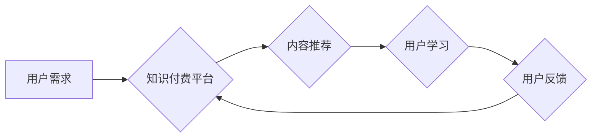

> 知识付费、用户价值、最大化、商业模式、用户体验、数据分析、个性化推荐

## 1. 背景介绍

知识付费行业近年来发展迅速，成为互联网经济的重要组成部分。从在线课程、付费咨询到知识库订阅，各种知识付费模式层出不穷。然而，在激烈的市场竞争中，如何最大化用户价值，提升用户粘性和转化率，成为知识付费创业者面临的共同挑战。

传统商业模式往往以产品或服务的交易为核心，而知识付费则更注重用户价值的创造和传递。用户付费不仅仅是为了获取知识本身，更希望获得提升自身能力、解决实际问题、实现个人成长等价值。因此，知识付费创业者需要深入理解用户的需求和痛点，构建以用户价值为中心的商业模式。

## 2. 核心概念与联系

**2.1 用户价值**

用户价值是指用户通过使用产品或服务获得的实际或潜在利益。在知识付费领域，用户价值可以体现在以下几个方面：

* **知识获取:** 用户通过付费获得专业知识、技能和洞察力。
* **能力提升:** 用户通过学习和实践，提升自身的能力和竞争力。
* **问题解决:** 用户通过学习获得解决实际问题的方案和方法。
* **个人成长:** 用户通过学习拓展视野、提升认知水平，实现个人成长。

**2.2 用户价值最大化**

用户价值最大化是指通过优化产品、服务和运营，最大程度地满足用户需求，提升用户体验，从而实现用户价值的放大效应。

**2.3 商业模式创新**

知识付费创业者需要不断探索新的商业模式，以更好地满足用户需求和实现用户价值最大化。一些常见的知识付费商业模式包括：

* **订阅制:** 用户按月或年订阅知识内容，获得持续的学习和更新服务。
* **课程销售:** 用户购买单个课程或课程套餐，获得一次性的知识学习体验。
* **付费咨询:** 用户付费咨询专业人士，获得个性化的指导和帮助。
* **知识库订阅:** 用户订阅知识库，获得海量知识资源和搜索服务。

**2.4 数据驱动决策**

数据分析是实现用户价值最大化的关键。知识付费创业者需要收集用户行为数据、学习数据和反馈数据，通过数据分析，洞察用户需求、优化产品和服务，提升用户体验。

**2.5 个性化推荐**

个性化推荐是指根据用户的学习兴趣、学习进度和学习目标，推荐个性化的知识内容。个性化推荐可以帮助用户更有效地学习，提升学习效率和用户满意度。

**Mermaid 流程图**



## 3. 核心算法原理 & 具体操作步骤

**3.1 算法原理概述**

用户价值最大化算法通常基于以下核心原理：

* **用户画像构建:** 通过收集用户数据，构建用户画像，了解用户的兴趣、需求、行为等特征。
* **内容推荐算法:** 基于用户画像和内容特征，使用推荐算法，推荐个性化的知识内容。
* **学习路径规划:** 根据用户的学习目标和进度，规划个性化的学习路径，引导用户高效学习。
* **用户反馈收集:** 收集用户对内容、服务和平台的反馈，用于优化产品和服务。

**3.2 算法步骤详解**

1. **数据收集:** 收集用户注册信息、学习行为数据、学习反馈数据等。
2. **数据清洗:** 对收集到的数据进行清洗和处理，去除无效数据和噪声数据。
3. **用户画像构建:** 基于用户数据，构建用户画像，包括用户兴趣、学习目标、学习习惯等特征。
4. **内容特征提取:** 对知识内容进行特征提取，包括内容主题、难度等级、学习时长等。
5. **推荐算法训练:** 使用机器学习算法，训练推荐模型，预测用户对不同内容的兴趣和偏好。
6. **个性化推荐:** 根据用户画像和推荐模型预测结果，为用户推荐个性化的知识内容。
7. **学习路径规划:** 根据用户的学习目标和进度，规划个性化的学习路径，引导用户高效学习。
8. **用户反馈收集:** 收集用户对内容、服务和平台的反馈，用于优化产品和服务。

**3.3 算法优缺点**

**优点:**

* **个性化推荐:** 可以根据用户的兴趣和需求，推荐个性化的知识内容，提升用户学习体验。
* **数据驱动决策:** 基于数据分析，优化产品和服务，提升用户价值。
* **持续优化:** 通过用户反馈和数据分析，不断优化算法模型，提升推荐效果。

**缺点:**

* **数据依赖:** 算法效果依赖于数据质量和数据量。
* **算法复杂度:** 算法模型训练和优化需要一定的技术难度。
* **用户隐私保护:** 需要妥善处理用户数据，保护用户隐私安全。

**3.4 算法应用领域**

用户价值最大化算法广泛应用于以下领域：

* **在线教育:** 个性化推荐课程、学习路径规划。
* **知识付费平台:** 个性化推荐内容、提升用户粘性和转化率。
* **电商平台:** 个性化推荐商品、提升用户购物体验。
* **内容平台:** 个性化推荐文章、视频等内容。

## 4. 数学模型和公式 & 详细讲解 & 举例说明

**4.1 数学模型构建**

用户价值最大化模型可以构建为一个优化问题，目标是最大化用户价值函数，约束条件是平台资源和用户需求。

**用户价值函数:**

$$
V(u, c) = \sum_{i=1}^{n} w_i \cdot f_i(u, c_i)
$$

其中:

* $V(u, c)$ 表示用户 $u$ 在内容 $c$ 下获得的价值。
* $w_i$ 表示第 $i$ 个价值指标的权重。
* $f_i(u, c_i)$ 表示用户 $u$ 在内容 $c_i$ 下获得的第 $i$ 个价值指标的得分。

**4.2 公式推导过程**

用户价值函数的具体形式取决于具体的价值指标和得分函数。例如，如果我们认为用户学习效率和学习满意度是两个重要的价值指标，那么我们可以定义如下得分函数:

* 学习效率得分函数: $f_{学习效率}(u, c_i) = \frac{用户学习完内容 c_i 的时间}{内容 c_i 的总时长}$
* 学习满意度得分函数: $f_{学习满意度}(u, c_i) = 用户对内容 c_i 的评价分数$

**4.3 案例分析与讲解**

假设我们有一个在线学习平台，平台上有许多不同的课程。我们可以使用用户价值最大化模型，为用户推荐最适合他们的课程。

例如，如果一个用户的学习效率得分函数较高，但学习满意度得分函数较低，那么我们可以推荐一些难度适中、内容丰富、评价较高的课程，以提高用户的学习满意度。

## 5. 项目实践：代码实例和详细解释说明

**5.1 开发环境搭建**

* 操作系统: Ubuntu 20.04
* Python 版本: 3.8
* 必要的库: pandas, numpy, scikit-learn, tensorflow

**5.2 源代码详细实现**

```python
import pandas as pd
from sklearn.model_selection import train_test_split
from sklearn.linear_model import LogisticRegression

# 加载用户数据
data = pd.read_csv('user_data.csv')

# 选择特征和目标变量
features = ['age', 'gender', 'education', 'occupation']
target = 'purchase'

# 将数据分成训练集和测试集
X_train, X_test, y_train, y_test = train_test_split(data[features], data[target], test_size=0.2)

# 训练逻辑回归模型
model = LogisticRegression()
model.fit(X_train, y_train)

# 预测测试集结果
y_pred = model.predict(X_test)

# 评估模型性能
from sklearn.metrics import accuracy_score
accuracy = accuracy_score(y_test, y_pred)
print(f'模型准确率: {accuracy}')
```

**5.3 代码解读与分析**

这段代码演示了如何使用逻辑回归模型进行用户价值预测。

1. 首先，加载用户数据并选择特征和目标变量。
2. 然后，将数据分成训练集和测试集。
3. 接着，训练逻辑回归模型，并使用测试集评估模型性能。

**5.4 运行结果展示**

运行代码后，会输出模型的准确率。

## 6. 实际应用场景

**6.1 在线教育平台**

在线教育平台可以利用用户价值最大化算法，为用户推荐个性化的课程和学习路径，提升用户学习效率和学习满意度。

**6.2 知识付费平台**

知识付费平台可以利用用户价值最大化算法，为用户推荐个性化的知识内容，提升用户粘性和转化率。

**6.3 内容平台**

内容平台可以利用用户价值最大化算法，为用户推荐个性化的文章、视频等内容，提升用户阅读和观看体验。

**6.4 未来应用展望**

随着人工智能技术的不断发展，用户价值最大化算法将应用于更多领域，例如：

* **医疗保健:** 为患者推荐个性化的医疗方案和健康建议。
* **金融服务:** 为用户推荐个性化的理财产品和投资策略。
* **零售业:** 为用户推荐个性化的商品和服务。

## 7. 工具和资源推荐

**7.1 学习资源推荐**

* **书籍:**
    * 《推荐系统实践》
    * 《机器学习》
* **在线课程:**
    * Coursera: 机器学习
    * edX: 数据科学

**7.2 开发工具推荐**

* **Python:** 广泛应用于数据分析和机器学习。
* **Scikit-learn:** Python 机器学习库。
* **TensorFlow:** 深度学习框架。

**7.3 相关论文推荐**

* 《Collaborative Filtering for Implicit Feedback Datasets》
* 《Matrix Factorization Techniques for Recommender Systems》

## 8. 总结：未来发展趋势与挑战

**8.1 研究成果总结**

用户价值最大化算法在知识付费领域取得了显著成果，能够有效提升用户体验和商业效益。

**8.2 未来发展趋势**

未来，用户价值最大化算法将朝着以下方向发展:

* **更精准的个性化推荐:** 利用更丰富的用户数据和更先进的算法模型，实现更精准的个性化推荐。
* **更智能的学习路径规划:** 基于用户的学习进度和学习目标，智能规划个性化的学习路径，提升学习效率。
* **更丰富的用户价值指标:** 探索更多用户价值指标，例如学习成果、职业发展等，构建更全面的用户价值模型。

**8.3 面临的挑战**

用户价值最大化算法也面临一些挑战:

* **数据隐私保护:** 如何收集和使用用户数据，保护用户隐私安全是一个重要问题。
* **算法公平性:** 算法模型需要避免偏见和歧视，确保公平性。
* **用户信任:** 用户需要信任平台的推荐和服务，才能真正实现用户价值最大化。

**8.4 研究展望**

未来，我们需要继续探索更有效的用户价值最大化算法，并解决算法带来的伦理和社会问题，为用户创造更优质的知识付费体验。

## 9. 附录：常见问题与解答

**9.1 如何构建用户画像？**

用户画像可以构建于用户注册信息、学习行为数据、学习反馈数据等多方面数据的基础上。可以使用聚类算法、关联规则挖掘等技术，将用户进行分类，并描述每个用户群体的特征。

**9.2 如何选择合适的推荐算法？**

推荐算法的选择取决于具体的应用场景和数据特点。常见的推荐算法包括协同过滤、内容过滤、基于知识的推荐等。

**9.3 如何评估推荐算法的性能？**

推荐算法的性能可以评估指标