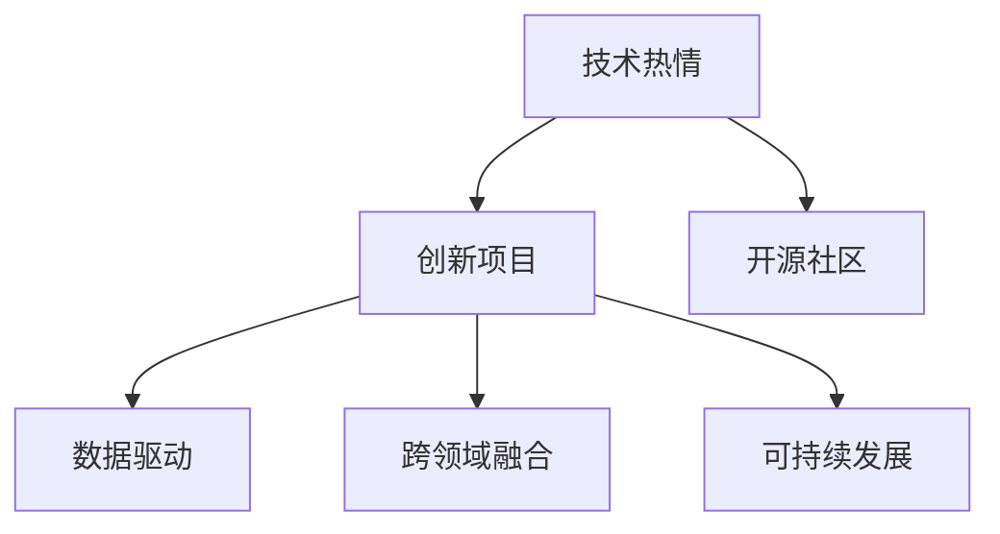

                 

# 如何将编程热情转化为改变世界的项目

## 1. 背景介绍

### 1.1 问题由来
编程是人类探索、理解和改造世界的一种重要工具。许多有志于改变世界的年轻人，通过学习编程找到了他们的热情所在。然而，面对这个竞争激烈、复杂多变的技术领域，如何将编程热情转化为真正有影响力的项目，成为了每位编程爱好者必须面对的问题。本文旨在通过系统分析，帮助广大程序员在技术热情的驱动下，成功实现影响世界的创新项目。

### 1.2 问题核心关键点
将编程热情转化为有影响力的项目，核心关键点在于：
1. **明确目标**：确立明确的项目目标，理解项目对于社会、企业和个人发展的潜在影响。
2. **深入理解**：透彻理解项目所涉及的技术原理和实际应用场景，识别项目的关键点。
3. **系统规划**：制定详细的项目规划，包括时间表、资源分配、风险管理等，确保项目顺利推进。
4. **跨界合作**：与不同领域的专家和团队合作，拓宽项目的技术和应用边界，增强项目的竞争力。
5. **持续迭代**：通过持续的反馈和优化，不断提升项目的质量和效果，确保项目始终走在前沿。
6. **社会责任**：将社会责任和伦理考量纳入项目设计，确保项目符合道德标准，造福社会。

## 2. 核心概念与联系

### 2.1 核心概念概述

为更好地理解如何将编程热情转化为有影响力的项目，本节将介绍几个密切相关的核心概念：

- **技术热情**：指程序员对编程技术和解决问题的热爱与激情，是推动项目成功的内在动力。
- **创新项目**：指通过编程实现的新颖、实用、具有变革潜力的技术应用，旨在解决实际问题、创造社会价值。
- **开源社区**：指基于开放的代码库、文档和交流平台，汇聚全球程序员的智慧和资源，共同推进技术进步。
- **数据驱动**：指以数据为基础，进行科学决策和问题求解，提升项目的准确性和可靠性。
- **跨领域融合**：指技术在多领域中的应用和融合，如将人工智能与医疗、教育等结合，产生更广泛的创新应用。
- **可持续发展**：指项目在技术、经济、社会和环境等方面均具备可持续发展的能力，确保项目的长期效益和影响。

这些核心概念之间的逻辑关系可以通过以下Mermaid流程图来展示：



这个流程图展示了大语言模型的核心概念及其之间的关系：

1. 技术热情驱动创新项目的产生。
2. 开源社区为项目提供了丰富的资源和交流平台。
3. 数据驱动增强项目的科学性和可靠性。
4. 跨领域融合拓展项目的应用范围。
5. 可持续发展确保项目的长期影响。

这些概念共同构成了编程热情转化为创新项目的基本框架，指导程序员如何在技术热情的驱动下，实现真正有影响力的项目。

## 3. 核心算法原理 & 具体操作步骤
### 3.1 算法原理概述

将编程热情转化为创新项目，本质上是一个复杂的技术与管理过程。其核心算法原理可以概括为：

1. **需求分析**：深入理解项目需求，明确项目的边界和目标。
2. **技术选型**：根据项目需求选择合适的技术栈和工具。
3. **设计规划**：设计项目的整体架构和技术实现，制定详细的项目计划。
4. **开发实施**：按计划推进项目开发，持续迭代和优化。
5. **测试评估**：通过测试和评估，确保项目质量符合预期。
6. **部署上线**：将项目部署到生产环境，进行实时监控和优化。
7. **用户反馈**：收集用户反馈，持续改进项目功能和性能。
8. **持续改进**：根据用户反馈和市场变化，不断调整和优化项目。

### 3.2 算法步骤详解

以下是将编程热情转化为创新项目的详细算法步骤：

**Step 1: 需求分析**
- 与相关利益方（如用户、客户、团队成员等）进行深入沟通，明确项目的业务需求和技术要求。
- 通过调研和分析，识别项目的核心功能和关键性能指标。
- 使用用户故事、功能规格、技术规范等文档形式记录需求，确保所有相关方对项目目标有清晰的理解。

**Step 2: 技术选型**
- 基于项目需求，选择最适合的技术栈、开发工具和平台。
- 评估各种技术的优缺点，考虑其可扩展性、维护性、安全性等综合因素。
- 根据团队的专长和资源，合理分配技术任务，避免技术瓶颈。

**Step 3: 设计规划**
- 设计项目的整体架构和系统模块，制定详细的设计文档和数据模型。
- 定义数据流、接口规范和交互逻辑，确保各模块之间高效协作。
- 规划项目的开发进度和资源分配，制定详细的项目时间表和里程碑。

**Step 4: 开发实施**
- 按照设计文档和技术规范，进行代码编写和系统实现。
- 使用版本控制工具（如Git）进行代码管理，确保代码的清晰、可维护。
- 定期进行代码审查和测试，确保代码质量和系统稳定性。

**Step 5: 测试评估**
- 设计并实施全面的测试策略，涵盖单元测试、集成测试、系统测试和性能测试等。
- 根据测试结果进行问题定位和修复，确保项目满足所有需求。
- 使用持续集成（CI）和持续交付（CD）工具，自动化测试和部署过程。

**Step 6: 部署上线**
- 将项目部署到生产环境，进行实时监控和性能优化。
- 配置自动备份和恢复机制，确保系统的高可用性和数据安全。
- 使用日志和监控工具，实时分析系统状态和性能指标，及时发现和解决问题。

**Step 7: 用户反馈**
- 收集用户反馈，通过问卷调查、用户访谈等方式获取真实需求和问题。
- 分析用户反馈，进行问题分类和优先级排序，制定改进计划。
- 与用户进行互动，及时响应和解决问题，提升用户满意度和忠诚度。

**Step 8: 持续改进**
- 根据用户反馈和市场变化，持续调整和优化项目功能。
- 引入新技术和工具，提升项目的性能和效率。
- 定期进行技术评估和知识更新，确保项目的技术前沿性和可持续性。

以上是将编程热情转化为创新项目的核心算法步骤。在实际应用中，还需要针对具体项目的特点，对各步骤进行优化设计和调整。

### 3.3 算法优缺点

将编程热情转化为创新项目的算法，具有以下优点：

1. **系统性**：通过系统化的需求分析、设计规划、开发实施、测试评估、部署上线、用户反馈和持续改进等步骤，确保项目的科学性和成功率。
2. **可扩展性**：设计灵活、模块化的架构，适应项目需求的动态变化，便于后续的扩展和优化。
3. **持续性**：通过持续的用户反馈和改进，确保项目具备持续的生命力和市场竞争力。
4. **社会效益**：基于技术热情的项目，往往具备更强的社会责任感和伦理意识，能够更好地服务于社会。

同时，该算法也存在一定的局限性：

1. **资源投入高**：项目涉及多方面工作，需要较高的资源投入，包括人力、时间和资金等。
2. **管理复杂**：项目规模和复杂度增加，管理难度也随之增大，需要高效的项目管理和团队协作。
3. **风险未知**：项目的市场和技术风险难以完全预知，可能导致项目失败或无法实现预期目标。

尽管存在这些局限性，但就目前而言，将编程热情转化为创新项目的方法仍是大规模技术应用的重要手段。未来相关研究的重点在于如何进一步降低项目的资源消耗和管理难度，提高项目的成功率和可持续性。

### 3.4 算法应用领域

将编程热情转化为创新项目的方法，在多个领域得到了广泛的应用，例如：

- **人工智能**：开发AI模型、应用算法和产品，提升智能交互和决策能力。
- **大数据分析**：利用数据分析技术，挖掘和应用数据价值，驱动业务决策。
- **区块链技术**：设计区块链应用，解决信任和数据共享问题，提升系统透明性和安全性。
- **物联网应用**：开发智能设备和系统，实现设备互联和数据协同，提升生产效率和生活便利性。
- **企业信息化**：构建企业级信息化系统，提升管理水平和业务效率。

除了上述这些经典领域外，将编程热情转化为创新项目的方法也在更多创新应用中不断涌现，为各行各业带来了新的发展机遇。

## 4. 数学模型和公式 & 详细讲解 & 举例说明（备注：数学公式请使用latex格式，latex嵌入文中独立段落使用 $$，段落内使用 $)
### 4.1 数学模型构建

将编程热情转化为创新项目，涉及的数学模型可以概括为：

- **需求模型**：用于描述项目需求和用户期望，通常使用用户故事、功能规格等文档形式表达。
- **技术模型**：用于描述项目的技术实现和架构设计，包括系统架构、数据模型、接口规范等。
- **测试模型**：用于描述项目的测试策略和测试数据，包括单元测试、集成测试、系统测试等。
- **性能模型**：用于描述项目的性能指标和优化策略，包括负载测试、压力测试、响应时间等。

以一个典型的电商推荐系统为例，其需求模型、技术模型、测试模型和性能模型可以分别描述为：

- **需求模型**：系统需要根据用户浏览历史、购买历史等数据，为用户推荐感兴趣的商品。
- **技术模型**：系统采用推荐算法（如协同过滤、基于内容的推荐等），将用户和商品表示为向量，计算相似度得分。
- **测试模型**：系统需要进行多轮测试，包括单元测试、集成测试、系统测试和负载测试，确保算法的正确性和系统的稳定性。
- **性能模型**：系统需要评估响应时间、推荐准确率和用户满意度等指标，根据评估结果进行算法优化和性能调整。

### 4.2 公式推导过程

以下我们以推荐系统为例，推导推荐算法中的核心公式。

假设用户 $u$ 对 $n$ 个商品 $i$ 的评分向量为 $r_u$，商品 $i$ 的属性向量为 $x_i$，用户和商品相似度矩阵为 $S$。则推荐系统可以形式化表示为：

$$
\hat{r}_{ui} = \text{rating}_u = \alpha r_u^T S x_i + \beta \lVert x_i \rVert_2 + \gamma r_u^T x_i
$$

其中，$\alpha$、$\beta$、$\gamma$ 为系数，$r_u^T S x_i$ 为相似度项，$\lVert x_i \rVert_2$ 为归一化项，$r_u^T x_i$ 为协同过滤项。通过优化系数 $\alpha$、$\beta$、$\gamma$，可以获得最优的推荐结果。

在得到推荐算法公式后，即可进行模型的训练和优化。通过最大化用户满意度（即准确率），进行参数调优，最终得到推荐系统的效果最优解。

### 4.3 案例分析与讲解

推荐系统是一个典型的将编程热情转化为创新项目的应用案例。以下是推荐系统的具体实现步骤：

1. **需求分析**：分析用户需求，明确推荐系统的目标，如提升用户购买率、优化用户体验等。
2. **技术选型**：选择合适的推荐算法，如协同过滤、基于内容的推荐等。
3. **设计规划**：设计推荐系统的架构，包括用户管理、商品管理、推荐算法等模块。
4. **开发实施**：按照设计文档进行代码编写，实现推荐算法和系统功能。
5. **测试评估**：进行多轮测试，评估推荐系统的性能和准确率，优化算法和模型参数。
6. **部署上线**：将系统部署到生产环境，进行实时监控和优化。
7. **用户反馈**：收集用户反馈，进行算法优化和功能改进。
8. **持续改进**：根据用户反馈和市场变化，持续调整和优化推荐系统。

推荐系统的成功实现，充分展示了如何将编程热情转化为有影响力的项目。通过系统化的需求分析、技术选型、设计规划、开发实施、测试评估、部署上线、用户反馈和持续改进等步骤，实现了系统的创新和优化，显著提升了用户的购物体验和满意度。

## 5. 项目实践：代码实例和详细解释说明
### 5.1 开发环境搭建

在进行项目实践前，我们需要准备好开发环境。以下是使用Python进行Flask开发的环境配置流程：

1. 安装Anaconda：从官网下载并安装Anaconda，用于创建独立的Python环境。

2. 创建并激活虚拟环境：
```bash
conda create -n flask-env python=3.8 
conda activate flask-env
```

3. 安装Flask：从官网获取Flask安装包，进行安装。
```bash
pip install Flask
```

4. 安装SQLAlchemy：用于数据库访问和数据管理。
```bash
pip install SQLAlchemy
```

5. 安装Flask-RESTful：用于构建RESTful API接口。
```bash
pip install Flask-RESTful
```

6. 安装Flask-CORS：用于处理跨域请求。
```bash
pip install Flask-CORS
```

完成上述步骤后，即可在`flask-env`环境中开始项目开发。

### 5.2 源代码详细实现

这里我们以一个简单的电商推荐系统为例，给出使用Flask进行开发的Python代码实现。

首先，定义用户和商品数据模型：

```python
from flask_sqlalchemy import SQLAlchemy

db = SQLAlchemy()

class User(db.Model):
    id = db.Column(db.Integer, primary_key=True)
    name = db.Column(db.String(50))
    email = db.Column(db.String(120), unique=True)

class Item(db.Model):
    id = db.Column(db.Integer, primary_key=True)
    name = db.Column(db.String(100))
    category = db.Column(db.String(50))
    price = db.Column(db.Float)
    description = db.Column(db.String(500))
```

然后，定义API接口：

```python
from flask import Flask, request, jsonify

app = Flask(__name__)
app.config['SQLALCHEMY_DATABASE_URI'] = 'sqlite:///data.db'
db.init_app(app)

@app.route('/users', methods=['GET'])
def get_users():
    users = User.query.all()
    return jsonify([{'id': user.id, 'name': user.name, 'email': user.email} for user in users])

@app.route('/items', methods=['GET'])
def get_items():
    items = Item.query.all()
    return jsonify([{'id': item.id, 'name': item.name, 'category': item.category, 'price': item.price, 'description': item.description} for item in items])

@app.route('/recommend', methods=['POST'])
def recommend_items():
    data = request.json
    user_id = data['user_id']
    item_ids = data['item_ids']

    # 进行推荐算法计算，返回推荐商品列表
    recommendations = perform_recommendation(user_id, item_ids)
    return jsonify(recommendations)
```

最后，启动Flask应用：

```python
if __name__ == '__main__':
    app.run(debug=True)
```

以上就是使用Flask进行电商推荐系统开发的完整代码实现。可以看到，通过Flask的简洁API接口，我们能够快速构建功能丰富的推荐系统。

### 5.3 代码解读与分析

让我们再详细解读一下关键代码的实现细节：

**User和Item类**：
- `__init__`方法：定义了用户和商品的初始化参数。
- `query`方法：用于查询数据库中的用户和商品数据。

**API接口**：
- `get_users`方法：获取所有用户信息，返回JSON格式的字典列表。
- `get_items`方法：获取所有商品信息，返回JSON格式的字典列表。
- `recommend_items`方法：接收用户ID和商品ID列表，调用推荐算法生成推荐列表，并返回JSON格式的推荐结果。

**主函数**：
- `if __name__ == '__main__':`：判断当前文件是否为入口文件，如果是，则启动Flask应用。
- `app.run(debug=True)`：启动Flask应用，开启调试模式，自动重启。

通过Flask的强大API接口，我们能够快速构建电商推荐系统，并在实际应用中进行测试和优化。

## 6. 实际应用场景
### 6.1 智能客服系统

基于编程热情的智能客服系统，可以广泛应用于各行各业。传统客服往往需要配备大量人力，高峰期响应缓慢，且一致性和专业性难以保证。通过编程热情，我们可以开发出智能客服系统，实现7x24小时不间断服务，快速响应客户咨询，用自然流畅的语言解答各类常见问题。

在技术实现上，可以收集企业内部的历史客服对话记录，将问题和最佳答复构建成监督数据，在此基础上对预训练模型进行微调。微调后的对话模型能够自动理解用户意图，匹配最合适的答案模板进行回复。对于客户提出的新问题，还可以接入检索系统实时搜索相关内容，动态组织生成回答。如此构建的智能客服系统，能大幅提升客户咨询体验和问题解决效率。

### 6.2 金融舆情监测

金融机构需要实时监测市场舆论动向，以便及时应对负面信息传播，规避金融风险。传统的人工监测方式成本高、效率低，难以应对网络时代海量信息爆发的挑战。通过编程热情，我们可以开发金融舆情监测系统，利用自然语言处理和机器学习技术，自动分析金融新闻、社交媒体、论坛等来源的舆情信息，及时发现和预警负面舆情。

在技术实现上，可以收集金融领域相关的新闻、报道、评论等文本数据，并对其进行主题标注和情感标注。在此基础上对预训练语言模型进行微调，使其能够自动判断文本属于何种主题，情感倾向是正面、中性还是负面。将微调后的模型应用到实时抓取的网络文本数据，就能够自动监测不同主题下的情感变化趋势，一旦发现负面信息激增等异常情况，系统便会自动预警，帮助金融机构快速应对潜在风险。

### 6.3 个性化推荐系统

当前的推荐系统往往只依赖用户的历史行为数据进行物品推荐，无法深入理解用户的真实兴趣偏好。通过编程热情，我们可以开发个性化推荐系统，通过自然语言处理和机器学习技术，挖掘用户从文本中获取到的兴趣信息，从而提供更精准、多样的推荐内容。

在技术实现上，可以收集用户浏览、点击、评论、分享等行为数据，提取和用户交互的物品标题、描述、标签等文本内容。将文本内容作为模型输入，用户的后续行为（如是否点击、购买等）作为监督信号，在此基础上微调预训练语言模型。微调后的模型能够从文本内容中准确把握用户的兴趣点。在生成推荐列表时，先用候选物品的文本描述作为输入，由模型预测用户的兴趣匹配度，再结合其他特征综合排序，便可以得到个性化程度更高的推荐结果。

### 6.4 未来应用展望

随着编程热情的不断提升和技术的不断进步，基于编程热情的创新项目将在更多领域得到应用，为传统行业带来变革性影响。

在智慧医疗领域，基于编程热情的医疗问答、病历分析、药物研发等应用将提升医疗服务的智能化水平，辅助医生诊疗，加速新药开发进程。

在智能教育领域，编程热情的应用可实现作业批改、学情分析、知识推荐等方面，因材施教，促进教育公平，提高教学质量。

在智慧城市治理中，编程热情的应用可实现城市事件监测、舆情分析、应急指挥等环节，提高城市管理的自动化和智能化水平，构建更安全、高效的未来城市。

此外，在企业生产、社会治理、文娱传媒等众多领域，基于编程热情的人工智能应用也将不断涌现，为NLP技术带来了全新的突破。相信随着编程热情的持续投入和技术的不断演进，编程爱好者将能够创造更多改变世界的创新项目，推动人工智能技术的深入应用和发展。

## 7. 工具和资源推荐
### 7.1 学习资源推荐

为了帮助开发者系统掌握将编程热情转化为创新项目的技术基础和实践技巧，这里推荐一些优质的学习资源：

1. 《Python编程：从入门到实践》：一本系统介绍Python编程语言的入门书籍，适合编程初学者和进阶者。

2. 《深入理解计算机系统》：一本经典的计算机系统书籍，深入浅出地介绍了计算机系统和编程原理。

3. 《算法导论》：一本全面介绍算法和数据结构的经典教材，涵盖算法设计、分析、实现等方方面面。

4. 《机器学习实战》：一本介绍机器学习算法和实战应用的实用书籍，适合有一定编程基础的读者。

5. 《深度学习入门：基于Python的理论与实现》：一本详细介绍深度学习理论和实践的书籍，适合深度学习初学者和中级读者。

6. Coursera和edX等在线教育平台：提供大量优质的计算机科学和数据科学课程，涵盖从基础到高级的各个阶段。

通过对这些资源的学习实践，相信你一定能够快速掌握将编程热情转化为创新项目的技术和方法，并在实际应用中取得良好的效果。

### 7.2 开发工具推荐

高效的开发离不开优秀的工具支持。以下是几款用于编程热情转化为创新项目开发的常用工具：

1. Visual Studio Code：一款功能强大的IDE，支持代码编辑、调试、测试等功能，适用于多种编程语言。

2. GitHub：一个全球最大的代码托管平台，支持版本控制、代码协作、项目管理等功能，适用于团队开发。

3. Docker和Kubernetes：用于容器化和分布式部署的工具，支持高效的应用部署和管理。

4. PyCharm和IntelliJ IDEA：用于Python和Java等编程语言的IDE，支持代码自动补全、重构、调试等功能。

5. Git和GitHub：版本控制工具和代码托管平台，支持代码的协同开发和版本管理。

6. JIRA和Trello：项目管理工具，支持任务分配、进度跟踪、协作沟通等功能，适用于团队协作。

合理利用这些工具，可以显著提升编程热情转化为创新项目的过程效率，加速项目的迭代和优化。

### 7.3 相关论文推荐

将编程热情转化为创新项目的研究源于学界的持续探索。以下是几篇奠基性的相关论文，推荐阅读：

1. "Deep Learning" by Ian Goodfellow, Yoshua Bengio, and Aaron Courville：一本全面介绍深度学习原理和应用的经典教材，是深度学习领域的重要参考。

2. "Grokking Python: A Beginner's Guide to Python 3" by Americanshank Mishra：一本面向初学者的Python编程指南，深入浅出地介绍了Python编程的基础和高级应用。

3. "Programming: Principles and Practice Using Python" by John Zelle：一本介绍编程原理和实践的教材，适合初学者入门。

4. "The Hundred-Page Machine Learning Book" by Andriy Burkov：一本简明的机器学习入门书籍，涵盖了机器学习的基础和应用。

5. "Artificial Intelligence: A Modern Approach" by Stuart Russell and Peter Norvig：一本介绍人工智能原理和应用的经典教材，涵盖了机器学习、自然语言处理、计算机视觉等多个方向。

这些论文代表了大语言模型微调技术的发展脉络。通过学习这些前沿成果，可以帮助研究者把握学科前进方向，激发更多的创新灵感。

## 8. 总结：未来发展趋势与挑战
### 8.1 总结

本文对如何将编程热情转化为创新项目进行了全面系统的介绍。首先阐述了将编程热情转化为创新项目的背景和意义，明确了项目目标、需求分析、技术选型、设计规划、开发实施、测试评估、部署上线、用户反馈和持续改进等关键步骤。其次，通过系统讲解需求模型、技术模型、测试模型和性能模型，提供了具体的代码实例和详细解释说明，帮助读者深入理解编程热情转化为创新项目的技术细节。

通过本文的系统梳理，可以看到，编程热情转化为创新项目是一个复杂但可行的过程。通过系统化的需求分析、技术选型、设计规划、开发实施、测试评估、部署上线、用户反馈和持续改进等步骤，程序员能够在技术热情的驱动下，实现真正有影响力的创新项目。

### 8.2 未来发展趋势

展望未来，将编程热情转化为创新项目的方法将呈现以下几个发展趋势：

1. **人工智能与编程热情的深度融合**：人工智能技术的发展将进一步推动编程热情转化为创新项目，实现更智能、更高效的编程和应用开发。

2. **跨领域融合与创新**：编程热情将跨越多个领域，实现多学科的融合与创新，推动更多领域的智能应用。

3. **社会责任与伦理导向**：项目的设计和开发将更多地考虑社会责任和伦理问题，确保技术的健康发展和应用。

4. **持续学习和自我优化**：编程爱好者将不断学习新技术、新知识，自我优化和提升，保持项目的持续创新和优化。

5. **开源与社区协作**：开源文化将进一步推动编程热情转化为创新项目，实现资源的共享和协作，提升项目的开发效率和质量。

6. **国际化和本地化**：编程热情将更多地考虑国际化和本地化问题，推动全球范围内的创新应用和合作。

这些趋势凸显了将编程热情转化为创新项目的广阔前景。通过持续的技术创新、多学科的融合、社会责任的考虑、持续学习和协作，编程爱好者将能够创造出更多改变世界的创新项目，为全球的科技和社会发展做出重要贡献。

### 8.3 面临的挑战

尽管将编程热情转化为创新项目在技术热情的驱动下，取得了显著的成果，但在迈向更加智能化、普适化应用的过程中，仍面临诸多挑战：

1. **资源和成本**：创新项目需要高昂的开发和运营成本，需要更多的资源和资金支持。

2. **时间管理**：项目的开发和优化需要更多的时间和精力，对编程爱好者的个人和时间管理能力提出更高的要求。

3. **技术复杂性**：项目的技术实现复杂度增加，需要更高的技术水平和团队协作能力。

4. **市场需求**：项目的市场应用需要更多的用户反馈和验证，才能真正实现商业化。

5. **技术风险**：项目的市场需求和用户反馈可能存在不确定性，技术风险难以完全预知。

6. **伦理和隐私**：项目的技术应用可能涉及伦理和隐私问题，需要更多的伦理考量和隐私保护措施。

正视这些挑战，积极应对并寻求突破，将是大语言模型微调技术走向成熟的必由之路。相信随着编程热情的持续投入和技术的不断演进，将编程热情转化为创新项目的方法将不断成熟和完善，推动人工智能技术的深入应用和发展。

### 8.4 研究展望

面对将编程热情转化为创新项目所面临的挑战，未来的研究需要在以下几个方面寻求新的突破：

1. **资源优化与成本控制**：探索更高效的项目开发和管理方法，降低项目的资源消耗和成本。

2. **时间管理与项目管理**：开发高效的项目时间管理工具，提升项目的开发效率和质量。

3. **跨领域融合与创新**：推动多学科的融合与创新，拓展项目的领域和应用范围。

4. **社会责任与伦理导向**：引入伦理导向的项目评估指标，确保技术的健康发展和应用。

5. **国际化和本地化**：考虑项目的国际化和本地化问题，提升项目的全球影响力和竞争力。

6. **技术风险与市场分析**：引入市场分析和风险管理工具，减少技术风险，提升项目的市场应用价值。

这些研究方向的探索，将进一步推动将编程热情转化为创新项目的方法走向成熟，为全球的科技和社会发展提供更多的创新动力和应用价值。

## 9. 附录：常见问题与解答

**Q1：如何将编程热情转化为具体项目？**

A: 将编程热情转化为具体项目，关键在于明确项目目标，理解项目需求，并进行系统的需求分析、技术选型、设计规划、开发实施、测试评估、部署上线、用户反馈和持续改进等步骤。

**Q2：如何提升项目的开发效率？**

A: 提升项目的开发效率，可以通过引入敏捷开发方法、自动化测试、持续集成（CI）和持续交付（CD）工具等方式，确保项目的快速迭代和持续优化。

**Q3：如何降低项目的资源消耗？**

A: 降低项目的资源消耗，可以通过资源优化和成本控制、时间管理与项目管理、跨领域融合与创新等方法，提升项目的开发效率和资源利用率。

**Q4：如何确保项目的社会责任和伦理导向？**

A: 确保项目的社会责任和伦理导向，需要在项目的设计和开发过程中引入伦理导向的评估指标，确保技术的健康发展和应用，同时加强人工干预和审核，建立模型行为的监管机制。

**Q5：如何应对项目的市场风险和技术风险？**

A: 应对项目的市场风险和技术风险，需要引入市场分析和风险管理工具，进行详细的市场需求和用户反馈分析，同时进行技术评估和优化，减少技术风险，提升项目的市场应用价值。

这些问题的解答，可以帮助编程爱好者更好地理解和实践将编程热情转化为创新项目的方法，实现技术热情和社会价值的双赢。通过系统化的需求分析、技术选型、设计规划、开发实施、测试评估、部署上线、用户反馈和持续改进等步骤，程序员能够在技术热情的驱动下，实现真正有影响力的创新项目。

---

作者：禅与计算机程序设计艺术 / Zen and the Art of Computer Programming

