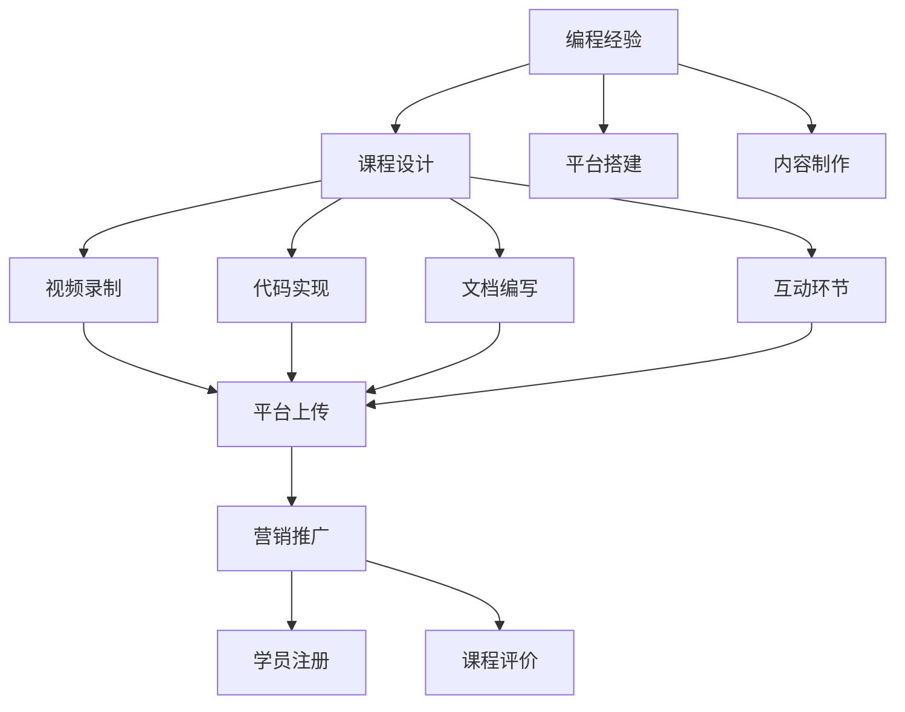

                 

## 1. 背景介绍

### 1.1 问题由来
在当前数字化转型加速的背景下，IT专业人士面临的职业发展和技能提升需求日益增长。而在线教育平台的兴起，为从业者提供了新的途径，通过分享自己的专业经验，不仅能够自我增值，还能帮助他人成长。将编程经验转化为付费培训课程，成为越来越多IT专业人士的共同选择。

### 1.2 问题核心关键点
从编程经验到付费课程的转化，涉及多个关键步骤，包括课程设计、平台搭建、内容制作、营销推广等。本文将详细探讨这一转化过程中的核心问题，为IT专业人士提供系统化的指导。

### 1.3 问题研究意义
将编程经验转化为付费培训课程，不仅有助于个人品牌建设，提升职业竞争力，还能促进知识传播，帮助更多人掌握关键技能，推动技术进步和产业升级。这一过程对IT教育体系的完善、知识共享的促进具有重要意义。

## 2. 核心概念与联系

### 2.1 核心概念概述

- **编程经验**：指IT专业人士在日常工作中积累的知识、技能和解决问题的思路。通常包括编程语言熟练度、算法实现、架构设计、项目管理和技术创新等方面。

- **付费培训课程**：指通过在线教育平台提供，有偿传授特定技能或知识体系的教育内容。形式包括视频课程、代码实例、项目实战、在线讲座等。

- **课程设计**：根据培训目标和受众需求，设计课程结构和内容的过程。包括课程主题、教学方法、实践环节、评估机制等。

- **平台搭建**：搭建和配置在线课程制作和发布平台，如Udemy、Coursera、EdX等，确保课程上线后能够稳定运行。

- **内容制作**：创建高质量的课程内容，包括视频录制、代码实现、文档编写、互动环节等，保证内容的专业性和互动性。

- **营销推广**：通过各种渠道和手段，推广课程内容，吸引潜在学员，提高课程注册率和学员满意度。

这些核心概念之间的关系，可以通过以下Mermaid流程图来展示：



这个流程图展示了从编程经验到付费课程的基本流程：

1. 编程经验通过课程设计、平台搭建和内容制作，转化为实际课程内容。
2. 课程内容通过视频录制、代码实现、文档编写、互动环节等形式呈现。
3. 课程内容上传至平台后，进行营销推广，吸引学员注册。
4. 学员注册后，通过课程学习并参与互动评价，完成课程体验。

## 3. 核心算法原理 & 具体操作步骤
### 3.1 算法原理概述

将编程经验转化为付费培训课程的过程，本质上是一种内容创作和知识传播的创新活动。其核心在于将复杂的专业知识，通过简洁、易懂的教学方法，传递给不同层次的学习者。

形式化地，假设编程经验为 $E$，目标课程为 $C$，则转化过程可以表示为：

$$
C = f(E)
$$

其中 $f$ 为内容创作和知识传播的映射函数，将原始的编程经验 $E$ 映射为具体的课程内容 $C$。

### 3.2 算法步骤详解

将编程经验转化为付费课程的具体步骤包括：

**Step 1: 课程需求分析**
- 确定课程目标受众，分析其知识背景、技能水平和学习需求。
- 根据受众需求，明确课程内容重点和覆盖范围。
- 制定课程大纲，规划各个环节的教学目标和时长。

**Step 2: 课程内容设计**
- 选择合适的编程语言和工具，设计课程的核心案例和实战项目。
- 编写详细的课程讲义、代码注释和项目文档，确保知识点的清晰传达。
- 设计互动环节，如问题讨论、代码挑战、作业反馈等，增强课程互动性。

**Step 3: 内容制作与呈现**
- 使用专业视频制作工具录制课程视频，确保讲解内容清晰、生动。
- 利用代码编辑器和IDE，实现核心代码的可视化和可执行性。
- 将文档、视频和代码整合，生成完整的课程素材，上传至课程平台。

**Step 4: 平台搭建与发布**
- 选择合适的在线课程平台，注册账号并搭建课程页面。
- 设置课程价格、支付方式、课程描述等信息，确保平台数据无误。
- 上线课程，进行推广，吸引目标受众注册并购买。

**Step 5: 学员互动与反馈**
- 定期更新课程内容，回应学员问题，提升课程质量。
- 收集学员反馈，根据需求进行调整和优化。
- 提供学员证书或徽章，增强课程的认可度和吸引力。

### 3.3 算法优缺点

将编程经验转化为付费课程，具有以下优点：

1. **知识共享与传播**：通过课程分享专业经验，帮助更多人掌握关键技能，促进技术进步和知识共享。
2. **自我增值**：通过课程设计和教学，提升个人的专业能力和品牌影响力。
3. **灵活与方便**：课程形式多样，学员可以自主选择学习时间和节奏，适合不同职业路径和个人需求。

同时，也存在一些缺点：

1. **时间和精力投入**：课程制作和发布需要大量的时间和精力，需要持续更新和维护。
2. **质量控制**：课程内容需要精心设计和制作，确保专业性和互动性，避免出现低质量内容。
3. **市场竞争**：在线教育市场竞争激烈，需要具备一定的营销和推广能力，才能吸引目标受众。

### 3.4 算法应用领域

将编程经验转化为付费课程，适用于多种教育和技术传播场景，包括但不限于：

- **企业内训**：为公司员工提供技术培训，提升团队整体技术水平。
- **开源社区**：在GitHub等开源平台上分享项目案例和代码实现，促进开源文化。
- **个人品牌建设**：通过课程制作，增强个人在技术领域的影响力和品牌价值。
- **在线教育平台**：如Udemy、Coursera、edX等，为全球学员提供多样化的技术课程。
- **技术博客与论坛**：通过博客文章、论坛讨论分享编程经验，形成知识社区。

## 4. 数学模型和公式 & 详细讲解 & 举例说明
### 4.1 数学模型构建

假设课程内容的总时长为 $T$，总课时为 $N$，学员学习进度为 $p$，课程质量为 $Q$，课程价格为 $P$。则课程的期望收益 $R$ 可以表示为：

$$
R = T \times N \times p \times Q \times P
$$

其中，$T$ 和 $N$ 表示课程的时长和课时，$p$ 表示学员的学习进度和完成率，$Q$ 表示课程的质量和互动性，$P$ 表示课程的价格和市场竞争力。

### 4.2 公式推导过程

为了最大化课程收益 $R$，需要从各个维度进行优化：

1. **课程时长和课时设计**：合理规划课程时长和课时，避免内容冗长或过于简短，确保知识点的深度和广度。
2. **学员学习进度和完成率**：通过互动反馈和进度跟踪，提高学员的学习积极性和完成率，确保课程的有效利用。
3. **课程质量和互动性**：通过专业内容制作和互动环节设计，提升课程的质量和学员的参与感。
4. **课程价格和市场竞争力**：合理定价，提高课程的市场竞争力，吸引更多学员。

### 4.3 案例分析与讲解

以Python编程语言入门课程为例，分析其核心内容设计：

- **课程时长和课时**：设计总时长为30小时，分为10个课时，每个课时3小时。
- **学员学习进度和完成率**：通过每周一次的小测验和作业反馈，确保学员按时完成课程内容。
- **课程质量和互动性**：录制高质量的视频讲解，每节课后设计代码练习和讨论环节，增强互动性。
- **课程价格和市场竞争力**：定价为$99，提供优惠套餐和免费试学，提高市场竞争力。

## 5. 项目实践：代码实例和详细解释说明
### 5.1 开发环境搭建

为了制作和发布课程内容，我们需要搭建相应的开发环境。以下是使用Python和Jupyter Notebook的环境配置流程：

1. 安装Python：从官网下载并安装Python 3.8以上版本。
2. 安装Jupyter Notebook：通过pip命令安装jupyter notebook，命令为 `pip install jupyter notebook`。
3. 安装Git：通过官网下载安装Git客户端。
4. 配置Git和SSH：设置Git用户名、邮箱和密码，配置SSH公钥。
5. 安装必要的开发工具：如代码编辑器、IDE、视频录制软件等。

完成上述步骤后，即可在本地环境中开始课程制作和发布。

### 5.2 源代码详细实现

以下是一个简单的Python课程项目，用于制作和发布课程内容的示例：

```python
# 1. 课程内容设计
# 假设课程内容为Python编程语言入门，包括基础语法、函数、模块等。

# 2. 内容制作与呈现
# 使用Jupyter Notebook创建课程内容，包括视频录制和代码实现。

# 3. 平台搭建与发布
# 使用Coursera平台搭建课程页面，上传课程内容和相关资源。

# 4. 学员互动与反馈
# 使用在线论坛和问答工具，与学员互动并收集反馈，优化课程内容。
```

### 5.3 代码解读与分析

让我们详细解读一下关键代码的实现细节：

**课程内容设计**：
- 确定课程目标：Python编程语言入门，包括基础语法、函数、模块等。
- 制定课程大纲：分模块设计课程结构，每个模块包括核心知识点、案例分析、实战项目等。

**内容制作与呈现**：
- 使用Jupyter Notebook创建课程内容，每个Notebook包含一段视频讲解和代码实现。
- 视频讲解使用Python的MoviePy库进行录制和剪辑，确保讲解内容清晰、生动。
- 代码实现使用Python的Sympy库进行数学推导，结合Matplotlib库进行可视化展示。

**平台搭建与发布**：
- 使用Coursera平台注册账号，创建课程页面。
- 上传课程内容，包括视频、代码、文档等。
- 设置课程价格、支付方式、课程描述等信息，确保平台数据无误。

**学员互动与反馈**：
- 使用Discourse论坛，与学员互动并收集反馈。
- 定期更新课程内容，回应学员问题，优化课程质量。
- 提供学员证书或徽章，增强课程的认可度和吸引力。

## 6. 实际应用场景

### 6.1 企业内训

企业可以通过内部培训课程，提升员工的技能水平，提高团队的整体工作效率。例如，某公司为提升大数据团队的技能，推出了一门“大数据处理与分析”课程，通过视频讲解和实战项目，帮助员工掌握Hadoop、Spark等技术，提升数据处理和分析能力。

### 6.2 开源社区

在开源社区，技术专家可以分享自己的项目案例和代码实现，促进技术传播和知识共享。例如，GitHub上的一个Python库项目，通过发布一系列视频教程和代码示例，帮助社区成员掌握库的使用方法，提升开发效率。

### 6.3 个人品牌建设

通过在线教育平台，技术专家可以分享自己的专业经验，建立个人品牌，提升职业影响力。例如，某知名软件架构师在Udemy上开设了“高级架构设计”课程，通过系统讲解和实战项目，帮助学员掌握架构设计思路，提升技术能力。

### 6.4 在线教育平台

在线教育平台如Udemy、Coursera等，为全球学员提供多样化的技术课程，促进知识传播和技术普及。例如，某知名机器学习专家在Udacity上开设了“深度学习基础”课程，通过视频讲解和实战项目，帮助学员掌握深度学习的基本概念和实现方法。

### 6.5 技术博客与论坛

技术博客和论坛是技术知识传播的重要渠道，技术专家可以通过文章分享和互动讨论，形成知识社区，促进技术交流和创新。例如，某知名前端开发者在Medium上开设了“JavaScript高级编程”系列文章，通过系统讲解和案例分析，帮助读者掌握JavaScript的高级应用，提升编程能力。

## 7. 工具和资源推荐
### 7.1 学习资源推荐

为了帮助开发者系统掌握将编程经验转化为付费培训课程的理论基础和实践技巧，这里推荐一些优质的学习资源：

1. **《编程教育的艺术》系列博文**：由教育技术专家撰写，深入浅出地介绍了编程教育的设计原理和实践技巧。
2. **Coursera《编程教育与课程设计》课程**：斯坦福大学开设的编程教育课程，涵盖编程教育的基础理论和实际案例，适合教育工作者和课程开发者。
3. **edX《编程实践与设计》书籍**：由编程教育专家撰写，全面介绍了编程教育的设计方法和实践策略，适合编程爱好者和课程开发者。
4. **Codecademy在线学习平台**：提供丰富的编程课程和实践项目，适合各层次的编程学习者。
5. **Udemy编程课程市场**：汇集了大量高质量的编程课程，适合各层次的编程学习者和课程开发者。

通过对这些资源的学习实践，相信你一定能够快速掌握将编程经验转化为付费课程的精髓，并用于解决实际的编程教育问题。

### 7.2 开发工具推荐

高效的开发离不开优秀的工具支持。以下是几款用于将编程经验转化为付费课程开发的常用工具：

1. **Jupyter Notebook**：用于创建和编辑课程内容，支持代码和文档的混合编辑。
2. **MoviePy**：用于录制和编辑视频，支持多种视频格式和剪辑工具。
3. **GitHub**：用于管理课程代码和资源，支持版本控制和协作开发。
4. **Coursera**：用于搭建和发布课程内容，支持丰富的课程展示和管理功能。
5. **Discourse**：用于与学员互动和收集反馈，支持论坛和讨论功能。

合理利用这些工具，可以显著提升将编程经验转化为付费课程的开发效率，加快创新迭代的步伐。

### 7.3 相关论文推荐

将编程经验转化为付费课程的技术涉及教育学、心理学、信息技术等多个领域，以下是几篇奠基性的相关论文，推荐阅读：

1. **《编程教育的认知心理基础》**：探讨编程教育中的认知心理原理，帮助教育者更好地设计课程内容。
2. **《编程教育的系统化设计》**：介绍编程教育的设计方法和系统化框架，适合课程开发者和教育工作者。
3. **《编程教育的评估与反馈机制》**：研究编程教育的评估和反馈机制，帮助教育者提升课程效果。
4. **《在线教育的挑战与对策》**：探讨在线教育面临的挑战和解决方案，适合课程开发者和教育工作者。
5. **《编程教育的未来展望》**：展望编程教育的发展趋势和未来方向，适合课程开发者和教育工作者。

这些论文代表了大规模编程教育的最新研究进展，通过学习这些前沿成果，可以帮助开发者更好地理解和设计编程课程。

## 8. 总结：未来发展趋势与挑战

### 8.1 总结

本文对将编程经验转化为付费培训课程的过程进行了全面系统的介绍。首先阐述了编程经验转化为课程的理论基础和实践流程，明确了课程设计、平台搭建、内容制作、营销推广等关键环节。其次，通过数学模型和实际案例，详细讲解了课程设计的优化策略和实施细节。最后，分析了实际应用场景，推荐了相关的学习资源和开发工具。

通过本文的系统梳理，可以看到，将编程经验转化为付费课程的过程，涉及内容创作、知识传播、平台搭建等多个维度。这一过程不仅需要技术专家的专业知识，还需要教育学、心理学等领域的理论支持。只有全面考虑各个环节，才能打造高质量的课程，实现知识和技术的有效传播。

### 8.2 未来发展趋势

展望未来，将编程经验转化为付费课程的技术将呈现以下几个发展趋势：

1. **课程内容的精细化**：随着技术的发展，课程内容将更加精细化，注重知识点之间的关联和实际应用。
2. **教学方法的创新**：将更多教育学和心理学的研究成果引入课程设计，提升教学效果和学员满意度。
3. **平台的多样化和个性化**：在线教育平台将更加多样化，结合AI和个性化推荐技术，提供更加贴合学员需求的课程。
4. **课程的社交化和互动性**：通过社交网络和技术工具，增强学员之间的互动和交流，形成良好的学习社区。
5. **课程的多模态化和多渠道传播**：结合视频、代码、文档等多种形式的课程内容，通过多种渠道传播，提升课程的可访问性和互动性。

这些趋势凸显了将编程经验转化为付费课程的广阔前景。随着技术的不断进步和教育理念的深化，这一过程将更加高效、灵活、个性化，为IT教育体系的完善和知识共享的促进提供新的可能性。

### 8.3 面临的挑战

尽管将编程经验转化为付费课程的技术已经取得了显著进展，但在实践中仍面临诸多挑战：

1. **课程质量和内容设计**：课程内容需要精心设计和制作，确保专业性和互动性，避免出现低质量内容。
2. **学员的学习动机和参与度**：如何激发学员的学习兴趣和参与度，提高课程的完成率和效果，是课程开发者面临的重大挑战。
3. **课程的市场竞争和推广**：在线教育市场竞争激烈，如何吸引目标受众，提升课程的知名度和注册率，是课程开发者需要重点考虑的问题。
4. **课程的持续更新和维护**：课程内容需要不断更新和优化，以适应技术进步和学员需求的变化。
5. **课程的可扩展性和灵活性**：如何设计灵活的课程架构，支持不同层次和需求的学员，是课程开发者需要重点考虑的问题。

这些挑战需要课程开发者具备丰富的教育经验和专业知识，结合教育学和心理学的研究成果，不断优化课程设计，提升课程质量和学员满意度。

### 8.4 研究展望

面对将编程经验转化为付费课程所面临的种种挑战，未来的研究需要在以下几个方面寻求新的突破：

1. **教育技术的应用**：结合AI、VR/AR、数据分析等技术，提升课程的互动性和可访问性。
2. **课程设计的科学化**：借鉴教育学和心理学的研究成果，提升课程设计的科学性和系统性。
3. **学习动机的激发**：研究如何通过情感化设计和互动环节，激发学员的学习兴趣和参与度。
4. **课程的个性化推荐**：开发个性化推荐算法，根据学员的学习历史和兴趣，推荐适合的课程内容。
5. **课程的可持续性和社会效益**：研究课程的社会效益和可持续性，确保课程内容的健康和积极传播。

这些研究方向的探索，将进一步推动将编程经验转化为付费课程的技术发展，为IT教育体系的完善和知识共享的促进提供新的动力。面向未来，课程开发者需要不断创新和优化，才能将编程经验转化为高质量的课程，实现知识和技术的有效传播。

## 9. 附录：常见问题与解答

**Q1：如何选择合适的编程语言进行课程设计？**

A: 选择合适的编程语言需要考虑目标受众的背景和需求。对于初学者，建议选择易于上手的语言，如Python、JavaScript等。对于有一定基础的学习者，可以选择一些更高级的语言，如Java、C++等。同时，结合课程内容和实际应用场景，选择最适合的语言进行教学。

**Q2：如何进行课程内容的筛选和设计？**

A: 课程内容的筛选和设计需要结合目标受众的需求和特点。通过调研和需求分析，确定课程的核心知识点和实战项目。设计过程中，注重知识点之间的关联和实际应用，避免内容冗长或过于简短，确保知识点的深度和广度。同时，结合互动环节和实战项目，增强课程的互动性和实践性。

**Q3：如何进行课程内容的呈现和录制？**

A: 课程内容的呈现和录制需要结合视频讲解和代码实现。使用Jupyter Notebook等工具，将代码和文档整合，生成完整的课程素材。视频讲解可以使用Python的MoviePy库进行录制和剪辑，确保讲解内容清晰、生动。代码实现可以使用Python的Sympy库进行数学推导，结合Matplotlib库进行可视化展示。

**Q4：如何搭建和发布课程内容？**

A: 课程内容的搭建和发布需要选择合适的在线教育平台。使用Coursera、Udemy等平台注册账号，创建课程页面，上传课程内容和相关资源。设置课程价格、支付方式、课程描述等信息，确保平台数据无误。上线课程后，进行推广，吸引目标受众注册并购买。

**Q5：如何进行学员互动和反馈？**

A: 学员互动和反馈可以通过在线论坛和问答工具实现。使用Discourse论坛，与学员互动并收集反馈。定期更新课程内容，回应学员问题，优化课程质量。提供学员证书或徽章，增强课程的认可度和吸引力。通过数据和反馈，不断改进课程设计和教学方法，提升课程效果和学员满意度。

---

作者：禅与计算机程序设计艺术 / Zen and the Art of Computer Programming

