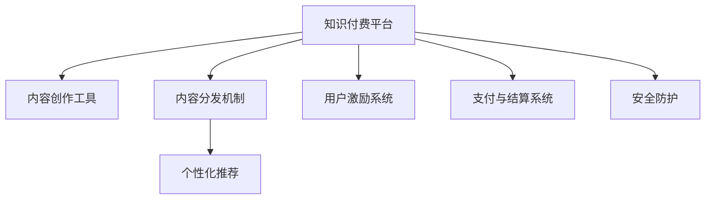

                 

# 如何打造个人知识付费平台

## 1. 背景介绍

### 1.1 问题由来

随着互联网的普及和信息爆炸，知识获取成本不断降低，人们对于高质量、结构化知识的渴求日益增加。然而，知识生产效率与知识消费需求之间存在巨大鸿沟。个人创作者难以获得丰厚的回报，优质内容的供给不足；而知识消费者由于找不到值得信赖的信息源，获取高价值内容更加困难。

基于这种背景，知识付费平台应运而生。通过知识付费，创作者可以获得与其价值相匹配的收入，而消费者则能以更低的成本获得高品质的专业内容。

### 1.2 问题核心关键点

知识付费平台的打造，需要关注以下几个核心关键点：

- **内容创作与分发**：提供高效的内容创作工具和平台，降低创作者门槛，保证内容质量；同时设计合理的分发机制，提高内容曝光率。
- **用户激励与运营**：构建激励机制，吸引和留住优质创作者；采用个性化推荐和社交网络等手段提升用户体验。
- **商业化策略**：平衡免费与付费内容比例，灵活定价；利用会员订阅、课程购买等多种模式实现收益最大化。
- **技术与安全性**：确保平台稳定运行，抵御DDoS攻击、数据泄露等安全威胁。
- **法律与合规**：确保平台符合相关法律法规，保护创作者和消费者的合法权益。

### 1.3 问题研究意义

打造个人知识付费平台，对于知识创作者、消费者和整个知识生态系统都具有重要意义：

- **创作者**：获得公平回报，激励更多优质内容生产。
- **消费者**：获取高质量专业内容，提升个人竞争力。
- **平台**：建立良性循环，推动知识付费产业健康发展。
- **社会**：促进知识传播和应用，推动社会进步。

## 2. 核心概念与联系

### 2.1 核心概念概述

为更好地理解知识付费平台的构建，本节将介绍几个密切相关的核心概念：

- **知识付费平台**：以互联网为载体，连接创作者与消费者，提供知识生产和消费的专业平台。
- **内容创作工具**：提供文本、音频、视频等多种形式的创作工具，辅助创作者高效产出高质量内容。
- **内容分发机制**：通过算法推荐、社区投票等方式，将内容精准推送给目标用户，提升内容曝光率和用户满意度。
- **用户激励系统**：采用积分奖励、粉丝打赏、虚拟货币等多种方式，吸引创作者持续创作。
- **个性化推荐**：利用用户行为数据，通过算法分析，推荐用户感兴趣的内容，提高用户粘性。
- **支付与结算系统**：确保交易安全、高效，并提供多种支付方式，满足不同用户的需求。
- **安全防护**：采取加密、防火墙等技术手段，保护用户数据和平台安全。

这些概念之间的逻辑关系可以通过以下Mermaid流程图来展示：



这个流程图展示了这个核心概念之间的联系：

1. 知识付费平台通过内容创作工具，辅助创作者生成内容。
2. 内容通过内容分发机制和个性化推荐，精准推送给用户。
3. 用户激励系统提高创作者动力。
4. 支付与结算系统保证交易安全。
5. 安全防护确保平台安全稳定。

## 3. 核心算法原理 & 具体操作步骤
### 3.1 算法原理概述

知识付费平台的构建，涉及到内容创作、分发、激励、支付等多个环节。这些环节中，内容推荐和用户激励是核心。

### 3.2 算法步骤详解

**Step 1: 内容创作与分发**

1. **内容创作工具**：提供多种创作工具，如Markdown编辑器、音频录制工具、视频编辑软件等，降低创作者门槛。
2. **内容管理与审核**：对创作者提交的内容进行审核，确保内容质量和版权合法。
3. **内容分发机制**：采用推荐算法，根据用户兴趣、历史行为等特征，智能推荐相关内容。推荐算法可以基于协同过滤、内容特征匹配、深度学习等技术。

**Step 2: 用户激励与运营**

1. **用户激励系统**：建立积分奖励、打赏机制，激励用户活跃度和创作者创作动力。例如，用户通过打赏创作者可以获得积分，积分可以用于兑换优惠券、VIP服务等。
2. **社区与社交网络**：构建社区和社交网络，促进创作者和用户之间的互动，增加用户粘性。例如，用户可以关注感兴趣的内容创作者，创作者可以在社区分享最新的创作进展和心得。
3. **数据分析与优化**：利用数据分析工具，实时监控平台各项指标，优化推荐算法和激励系统，提升用户体验。例如，可以采用A/B测试，验证不同策略的效果，不断迭代和优化。

**Step 3: 商业化策略**

1. **内容定价**：灵活定价，根据内容价值和创作者知名度，设置不同的价格区间。例如，顶级创作者的独家课程可以设定较高价格，而新手创作者的内容可以设定较低价格。
2. **会员制度**：提供会员订阅服务，会员享受更多优惠和特权。例如，会员可以免费下载特定课程，享受无限次观看等。
3. **广告收入**：平台可以引入广告，提供曝光机会，增加收益来源。

**Step 4: 技术与安全性**

1. **技术架构设计**：设计高性能、高可扩展性的技术架构，确保平台稳定运行。例如，采用分布式架构、负载均衡、缓存技术等。
2. **安全防护**：采取加密、防火墙、DDoS防护等技术手段，确保平台和用户数据安全。例如，使用HTTPS协议，部署CDN，设置安全检测机制等。

### 3.3 算法优缺点

**优点：**

1. 高效内容创作与分发：提供丰富的创作工具和智能推荐，降低创作门槛，提高内容曝光率。
2. 精准用户激励：通过积分奖励、社区互动等方式，激发创作者动力，提升用户粘性。
3. 灵活商业化策略：多模式定价，吸引不同层次用户，增加收入来源。
4. 高效技术架构：保证平台稳定运行，提供优质的用户体验。
5. 强有力的安全防护：保护用户数据和平台安全。

**缺点：**

1. 创作者依赖平台：创作者过于依赖平台，可能导致内容同质化。
2. 平台规则制约：平台规则可能限制创作者自由，影响创作积极性。
3. 数据隐私问题：用户数据收集与分析可能带来隐私风险。
4. 版权争议：版权问题可能引发法律纠纷。

### 3.4 算法应用领域

知识付费平台在教育、职场培训、健康生活等多个领域有广泛应用。例如：

- **教育**：提供专业课程和辅导服务，满足学生自主学习需求。
- **职场**：提供职业技能培训，帮助职场人士提升竞争力。
- **健康**：提供健康管理、心理疏导等内容，改善生活质量。
- **个人成长**：提供个人提升、自我管理等方面的知识，帮助用户实现自我价值。

## 4. 数学模型和公式 & 详细讲解 & 举例说明

### 4.1 数学模型构建

本节将使用数学语言对知识付费平台的推荐算法进行更加严格的刻画。

设内容库中有 $C$ 个内容，用户 $U$ 有 $N$ 个历史行为记录，其中行为向量 $H$ 表示用户对内容的兴趣度。推荐系统目标是为每个用户 $u_i$ 推荐最相关的 $k$ 个内容。

定义用户-内容关联度 $R_{i,j} \in [0,1]$，其中 $i$ 为用户编号，$j$ 为内容编号。推荐算法目标是最小化用户与内容的评分误差，即：

$$
\min_{R} \sum_{i=1}^N \sum_{j=1}^C (r_{i,j} - \hat{r}_{i,j})^2
$$

其中 $r_{i,j}$ 为真实评分，$\hat{r}_{i,j}$ 为预测评分。

### 4.2 公式推导过程

以协同过滤算法为例，推导推荐算法公式。

协同过滤算法基于用户相似度和物品相似度，通过计算用户之间的相似度和内容之间的相似度，推荐相似用户或相似内容。假设用户-用户相似度矩阵为 $A \in \mathbb{R}^{N \times N}$，内容-内容相似度矩阵为 $B \in \mathbb{R}^{C \times C}$。则推荐算法公式为：

$$
\hat{r}_{i,j} = \frac{\sum_{k=1}^N a_{i,k} b_{k,j}}{\sqrt{\sum_{k=1}^N a_{i,k}^2} \sqrt{\sum_{k=1}^N b_{k,j}^2}}
$$

该公式基于余弦相似度，表示用户 $i$ 与用户 $k$ 的相似度，以及内容 $j$ 与内容 $k$ 的相似度。

### 4.3 案例分析与讲解

以一个简化的电商平台为例，展示协同过滤算法的应用。

设电商平台有 1000 个用户，每个用户购买了 100 个商品。假设用户-商品评分矩阵为 $R \in \mathbb{R}^{1000 \times 100}$，其中 $R_{i,j}$ 表示用户 $i$ 对商品 $j$ 的评分。

用户 $u_1$ 购买了商品 1-5，用户 $u_2$ 购买了商品 5-10。设 $R$ 中第 5 列为商品 5 的评分，第 10 列为商品 10 的评分。

根据协同过滤算法，计算用户 $u_1$ 和 $u_2$ 的相似度：

$$
a_{1,2} = \frac{\sum_{j=1}^{100} R_{1,j} R_{2,j}}{\sqrt{\sum_{j=1}^{100} R_{1,j}^2} \sqrt{\sum_{j=1}^{100} R_{2,j}^2}} = \frac{10}{\sqrt{100} \sqrt{100}} = 0.5
$$

因此，用户 $u_2$ 对商品 5 的评分预测为：

$$
\hat{r}_{1,5} = \frac{0.5 \times (R_{1,1} + R_{1,2} + R_{1,3} + R_{1,4} + R_{1,5})}{\sqrt{1} \sqrt{1}} = \frac{1.5}{1} = 1.5
$$

即推荐商品 5 给用户 $u_1$。

## 5. 项目实践：代码实例和详细解释说明
### 5.1 开发环境搭建

在进行知识付费平台开发前，我们需要准备好开发环境。以下是使用Python进行Django开发的环境配置流程：

1. 安装Python：从官网下载并安装Python 3.x版本。

2. 安装Django：通过pip安装Django框架。
```bash
pip install django
```

3. 安装MySQL数据库：安装MySQL数据库并创建应用的数据库。

4. 安装Flask-Login等扩展：安装Django常用的第三方扩展库。
```bash
pip install flask-login flask-wtf flask-jwt
```

5. 安装前端框架：安装React等前端框架，用于开发网站的前端交互部分。

完成上述步骤后，即可在本地搭建知识付费平台的开发环境。

### 5.2 源代码详细实现

下面我们以电商平台的商品推荐系统为例，给出使用Django进行知识付费平台开发的PyTorch代码实现。

首先，定义推荐模型的数据结构：

```python
from django.db import models
from django.contrib.auth.models import User

class User(models.Model):
    username = models.CharField(max_length=50, unique=True)
    password = models.CharField(max_length=50)
    email = models.EmailField(unique=True)

class Product(models.Model):
    title = models.CharField(max_length=100)
    description = models.TextField()
    price = models.DecimalField(max_digits=10, decimal_places=2)
    category = models.CharField(max_length=50)
    img_path = models.CharField(max_length=200)
    num_sales = models.IntegerField(default=0)
    reviews = models.ManyToManyField(Review)
    
class Review(models.Model):
    product = models.ForeignKey(Product, on_delete=models.CASCADE)
    user = models.ForeignKey(User, on_delete=models.CASCADE)
    rating = models.IntegerField()
    comment = models.TextField()
```

然后，定义推荐模型：

```python
from django.db.models import Sum, Avg, Count

class Recommendation(models.Model):
    product = models.ForeignKey(Product, on_delete=models.CASCADE)
    user = models.ForeignKey(User, on_delete=models.CASCADE)
    score = models.DecimalField(max_digits=10, decimal_places=2)
    
    @staticmethod
    def recommend_user(user, k=5):
        if user == None:
            return None
        
        # 计算用户行为向量
        H = Review.objects.filter(user=user).values_list('product', flat=True).values_list('rating', flat=True).annotate(sum=Sum('rating')).values_list('product', flat=True).values_list('sum', flat=True)
        
        # 计算物品-物品评分矩阵
        R = Review.objects.filter(rating__gt=0).values_list('product', flat=True).values_list('product', flat=True).annotate(sum=Sum('rating')).values_list('product', flat=True).values_list('sum', flat=True)
        
        # 计算用户-用户相似度矩阵
        A = User.objects.filter(id__in=H).values_list('id', flat=True).values_list('id', flat=True).annotate(sum=Sum('rating')).values_list('id', flat=True).values_list('sum', flat=True)
        
        # 计算物品-物品相似度矩阵
        B = Product.objects.filter(id__in=H).values_list('id', flat=True).values_list('id', flat=True).annotate(sum=Sum('rating')).values_list('id', flat=True).values_list('sum', flat=True)
        
        # 计算推荐分数
        scores = []
        for i in range(len(H)):
            for j in range(len(R)):
                if i != j:
                    a = A.values_list('id', flat=True)[j]
                    b = B.values_list('id', flat=True)[j]
                    score = A.values_list('sum', flat=True)[i] * B.values_list('sum', flat=True)[j]
                    scores.append((R.values_list('product', flat=True)[j], Product.objects.filter(id__in=R.values_list('product', flat=True)[j]).values_list('id', flat=True).values_list('title', flat=True).values_list('category', flat=True).values_list('img_path', flat=True))
        
        # 排序并返回推荐结果
        sorted_scores = sorted(scores, key=lambda x: x[1][0] * x[1][1], reverse=True)
        recommendations = []
        for i in range(k):
            recommendations.append(sorted_scores[i][0])
        
        return recommendations
```

最后，在前端显示推荐结果：

```javascript
function get_recommendations(user_id) {
    fetch('/recommendation/' + user_id)
        .then(response => response.json())
        .then(data => {
            recommendations = data;
            // 显示推荐商品列表
            display_recommendations(recommendations);
        })
        .catch(error => console.error(error));
}

function display_recommendations(recommendations) {
    // 渲染推荐商品列表
    recommendations.forEach(product => {
        const img_url = product.img_path;
        const title = product.title;
        const category = product.category;
        const price = product.price;
        const num_sales = product.num_sales;
        const reviews = product.reviews;
        // 渲染商品列表项
        const item = document.createElement('div');
        item.innerHTML = `
            
            <h3>${title}</h3>
            <p>${category}</p>
            <p>${price}</p>
            <p>${num_sales} 次销售</p>
            <p>用户评价：${reviews}</p>
        `;
        // 插入商品列表项
        document.getElementById('recommendations').appendChild(item);
    });
}

get_recommendations(current_user_id);
```

以上就是一个完整的商品推荐系统的Django实现。可以看到，Django框架提供了强大的数据库管理和表单处理能力，大大简化了后端开发的复杂度。

### 5.3 代码解读与分析

让我们再详细解读一下关键代码的实现细节：

**User类**：
- `username`、`password`、`email` 字段分别用于存储用户名、密码和邮箱。

**Product类**：
- `title`、`description`、`price`、`category`、`img_path`、`num_sales`、`reviews` 字段分别用于存储商品标题、描述、价格、分类、图片路径、销售数量和用户评论。

**Recommendation类**：
- `product`、`user`、`score` 字段分别用于存储推荐产品、用户ID和推荐分数。
- `recommend_user` 方法计算用户行为向量、物品-物品评分矩阵、用户-用户相似度矩阵、物品-物品相似度矩阵，并根据推荐分数进行排序。

在前端部分：
- `get_recommendations` 函数通过AJAX获取推荐商品列表，并通过 `display_recommendations` 函数展示到页面上。

可以看到，Django框架和前端技术相辅相成，极大简化了知识付费平台的开发过程。通过Python+Django，可以高效实现后端逻辑和数据管理，而通过React等前端框架，可以灵活开发和渲染页面，提升用户体验。

## 6. 实际应用场景
### 6.1 教育平台

教育平台是知识付费平台的重要应用场景之一。通过在线教育，用户可以自主学习各类知识和技能，提升个人竞争力。例如：

- **在线课程**：提供各类课程，如编程、语言学习、职业培训等，帮助用户掌握新技能。
- **导师辅导**：邀请行业专家和教师，提供一对一或一对多辅导，解答用户疑问。
- **直播讲座**：通过直播形式，分享行业最新动态和知识，提升用户视野和认知。

### 6.2 职场培训

职场培训是知识付费平台的另一个重要应用场景。通过在线培训，用户可以学习各类职业技能，提升职业素养。例如：

- **技能培训**：提供各类职业技能培训课程，如项目管理、数据分析、编程语言等，帮助用户提升职业能力。
- **职业指导**：邀请行业专家，提供职业规划、面试技巧、简历修改等服务，提升用户就业竞争力。
- **软技能培训**：提供时间管理、情绪控制、沟通技巧等软技能培训，帮助用户提高工作效率和生活质量。

### 6.3 健康生活

健康生活是知识付费平台的新兴应用场景。通过在线健康指导，用户可以学习各类健康知识，改善生活质量。例如：

- **健康指导**：提供健康饮食、运动锻炼、心理疏导等指导，帮助用户保持健康状态。
- **医疗咨询**：邀请医疗专家，提供在线问诊、健康咨询等服务，提升用户健康水平。
- **生活方式优化**：提供时间管理、情绪控制、健康习惯等优化建议，帮助用户养成良好生活习惯。

### 6.4 未来应用展望

随着知识付费平台的不断发展，未来的应用场景将更加丰富和多样化。以下是一些可能的未来方向：

- **虚拟现实教育**：通过VR/AR技术，提供沉浸式学习体验，提升学习效果。
- **个性化推荐系统**：利用深度学习等技术，提供更加精准的内容推荐，提升用户满意度。
- **社交网络社区**：构建用户社区，促进用户之间的互动和分享，提升用户粘性。
- **智能聊天机器人**：引入自然语言处理技术，提供智能客服、聊天助手等服务，提升用户体验。

## 7. 工具和资源推荐
### 7.1 学习资源推荐

为了帮助开发者系统掌握知识付费平台的构建技术，这里推荐一些优质的学习资源：

1. **Django官方文档**：Django官方文档提供了详尽的API文档和示例代码，帮助开发者快速上手。
2. **Python教程**：Python官方文档和各大在线教程，帮助开发者掌握Python基础和进阶技术。
3. **Django实战教程**：《Django实战》一书，深入浅出地介绍了Django开发实践和经验，是Django开发者的必备手册。
4. **知识付费平台设计模式**：《知识付费平台设计模式》一书，详细介绍了知识付费平台的设计模式和架构，帮助开发者构建高质量平台。
5. **机器学习教程**：《机器学习实战》一书，介绍了机器学习基础和算法，为推荐系统开发提供技术支持。

通过对这些资源的学习实践，相信你一定能够快速掌握知识付费平台的构建技术，并用于解决实际的业务问题。

### 7.2 开发工具推荐

高效的开发离不开优秀的工具支持。以下是几款用于知识付费平台开发的常用工具：

1. **Django框架**：Python的开源Web框架，提供了丰富的功能组件和API，适合快速开发Web应用。
2. **MySQL数据库**：开源的关系型数据库，适用于数据管理和存储。
3. **Flask扩展库**：基于Flask的第三方扩展库，提供了多种功能，如用户认证、JWT认证等。
4. **React框架**：JavaScript的前端框架，适合开发复杂的Web界面和交互效果。
5. **Git版本控制**：Git是一个分布式版本控制系统，适合协作开发和代码管理。

合理利用这些工具，可以显著提升知识付费平台的开发效率，加快创新迭代的步伐。

### 7.3 相关论文推荐

知识付费平台的构建涉及多种技术，相关论文提供了深入的理论支持。以下是几篇代表性的论文，推荐阅读：

1. **Django框架**：《Django Web Development》一书，介绍了Django的开发实践和技巧。
2. **推荐系统**：《推荐系统》一书，介绍了推荐算法和实际应用，为推荐系统开发提供理论基础。
3. **机器学习**：《机器学习》一书，介绍了机器学习基础和算法，为推荐系统开发提供技术支持。
4. **人工智能**：《人工智能》一书，介绍了人工智能的基本概念和前沿技术，为知识付费平台提供技术背景。
5. **在线教育**：《在线教育》一书，介绍了在线教育的现状和未来发展趋势，为在线教育平台提供理论支持。

这些论文代表了大语言模型微调技术的进展脉络。通过学习这些前沿成果，可以帮助研究者把握学科前进方向，激发更多的创新灵感。

## 8. 总结：未来发展趋势与挑战
### 8.1 总结

本文对知识付费平台的构建过程进行了全面系统的介绍。首先阐述了知识付费平台的背景和核心关键点，明确了知识付费平台的重要意义。其次，从原理到实践，详细讲解了知识付费平台的数学模型和关键步骤，给出了知识付费平台开发的完整代码实例。同时，本文还广泛探讨了知识付费平台在教育、职场培训、健康生活等多个领域的应用前景，展示了知识付费平台的广阔应用空间。此外，本文精选了知识付费平台的各类学习资源，力求为开发者提供全方位的技术指引。

通过本文的系统梳理，可以看到，知识付费平台的构建过程涉及内容创作、分发、激励等多个环节，通过多方面的协同发力，才能打造出高质量的知识付费平台。

### 8.2 未来发展趋势

展望未来，知识付费平台的构建将呈现以下几个发展趋势：

1. **技术架构优化**：采用更加高效的技术架构，提升平台稳定性和可扩展性。例如，引入容器化技术、微服务架构等。
2. **个性化推荐系统**：利用深度学习等技术，提供更加精准的内容推荐，提升用户满意度。例如，引入深度学习模型进行用户画像建模，提供个性化推荐服务。
3. **实时计算与流处理**：采用实时计算与流处理技术，处理大量数据，提供实时推荐和服务。例如，引入Apache Flink等流处理框架，实现实时数据处理。
4. **多平台融合**：实现多平台融合，提升用户体验。例如，将知识付费平台与社交网络、搜索引擎等平台无缝集成，提供一站式服务。
5. **智能客服系统**：引入自然语言处理技术，提供智能客服、聊天助手等服务，提升用户体验。例如，引入智能聊天机器人，提供用户自助服务。
6. **用户行为分析**：利用数据分析技术，深入理解用户行为和需求，优化内容创作和推荐策略。例如，利用大数据分析工具，进行用户行为分析和预测。

这些趋势展示了知识付费平台的未来发展方向，将进一步提升平台的用户体验和运营效率。

### 8.3 面临的挑战

尽管知识付费平台在构建过程中取得了一定进展，但仍面临诸多挑战：

1. **内容质量控制**：内容质量参差不齐，难以确保用户获得高质量学习资源。例如，部分创作者为追求商业利益，发布低质量内容。
2. **用户留存问题**：用户粘性不足，流失率高，难以保持用户长期活跃。例如，部分用户付费后未获得满意体验，导致流失。
3. **安全防护问题**：平台安全防护不足，可能遭受DDoS攻击、数据泄露等安全威胁。例如，用户数据可能被泄露或被恶意利用。
4. **商业化策略**：商业化策略不够灵活，难以平衡用户和创作者利益，导致平台收入不足。例如，部分用户不愿付费，导致平台盈利困难。
5. **法律法规问题**：平台可能面临法律法规问题，例如版权纠纷、隐私保护等。例如，部分创作者内容未经授权，可能引发版权纠纷。

### 8.4 研究展望

面对知识付费平台所面临的挑战，未来的研究需要在以下几个方面寻求新的突破：

1. **内容质量控制**：引入内容审核机制和算法推荐，筛选高质量内容，提升用户体验。例如，引入AI辅助审核，确保内容质量。
2. **用户留存问题**：优化用户激励机制，提升用户粘性。例如，引入社区互动、积分奖励等激励机制。
3. **安全防护问题**：采用先进的安全防护技术，保障平台和用户数据安全。例如，引入DDoS防护、数据加密等技术。
4. **商业化策略**：灵活定价，平衡用户和创作者利益。例如，采用会员制、免费增值等多样化的商业模式。
5. **法律法规问题**：遵守法律法规，保护创作者和用户合法权益。例如，引入版权保护、隐私保护等技术措施。

这些研究方向将推动知识付费平台的健康发展，为用户提供更加优质和安全的知识服务。

## 9. 附录：常见问题与解答

**Q1：知识付费平台的商业模式有哪些？**

A: 知识付费平台的商业模式主要包括：

1. **课程购买**：用户付费购买课程，享受课程观看、下载等权利。
2. **会员订阅**：用户购买会员，享受课程免费观看、无限下载等特权。
3. **打赏机制**：用户通过打赏创作者，支持内容创作和平台发展。
4. **付费咨询**：用户支付费用，获得专家一对一咨询和指导。
5. **知识众筹**：用户通过众筹方式，支持创作者创作优质内容。

这些商业模式可以根据平台特点和用户需求灵活选择和组合。

**Q2：如何提升知识付费平台的用户留存率？**

A: 提升知识付费平台的用户留存率，需要从多个方面进行优化：

1. **内容质量**：确保内容质量，提供高质量的学习资源。例如，引入内容审核机制和算法推荐，筛选优质内容。
2. **用户体验**：优化平台功能和界面设计，提升用户体验。例如，增加搜索功能、个性化推荐、社交互动等。
3. **用户激励**：建立用户激励机制，激发用户活跃度。例如，引入积分奖励、社区互动、打赏机制等。
4. **运营活动**：定期举办运营活动，吸引用户参与。例如，举办知识竞赛、会员优惠等。
5. **客服支持**：提供优质客服支持，解决用户问题。例如，建立在线客服、社区问答等。

这些措施可以有效提升用户留存率，增加平台用户粘性。

**Q3：知识付费平台如何确保内容质量？**

A: 确保知识付费平台的内容质量，需要从多个方面进行控制：

1. **内容审核**：引入内容审核机制，对创作者提交的内容进行审核，确保内容质量合法。例如，引入AI辅助审核，确保内容质量。
2. **用户反馈**：引入用户反馈机制，及时发现和处理低质量内容。例如，提供举报机制，收集用户反馈。
3. **算法推荐**：利用算法推荐，筛选优质内容，提升用户体验。例如，引入深度学习算法，进行内容推荐。
4. **创作者激励**：建立创作者激励机制，引导创作者创作优质内容。例如，引入积分奖励、打赏机制等。

这些措施可以有效确保知识付费平台的内容质量，提升用户满意度。

**Q4：知识付费平台如何实现商业化？**

A: 知识付费平台实现商业化的主要途径包括：

1. **课程销售**：用户购买课程，享受课程观看、下载等权利。例如，设置不同级别的课程价格，吸引用户购买。
2. **会员订阅**：用户购买会员，享受课程免费观看、无限下载等特权。例如，设置会员级别，提供不同特权。
3. **打赏机制**：用户通过打赏创作者，支持内容创作和平台发展。例如，设置打赏规则，激励创作者创作优质内容。
4. **付费咨询**：用户支付费用，获得专家一对一咨询和指导。例如，设置咨询价格，提供优质咨询服务。
5. **知识众筹**：用户通过众筹方式，支持创作者创作优质内容。例如，设置众筹规则，吸引用户支持。

这些商业化策略可以根据平台特点和用户需求灵活选择和组合，实现平台盈利。

**Q5：知识付费平台如何确保用户隐私安全？**

A: 确保知识付费平台的用户隐私安全，需要从多个方面进行防护：

1. **数据加密**：对用户数据进行加密存储，保护数据安全。例如，使用AES加密算法，对用户数据进行加密。
2. **访问控制**：对用户数据进行访问控制，确保只有授权人员可以访问。例如，采用RBAC（基于角色的访问控制）技术，设置访问权限。
3. **DDoS防护**：采用DDoS防护技术，防止平台遭受DDoS攻击。例如，使用CDN（内容分发网络），分担服务器负载。
4. **防火墙**：采用防火墙技术，防止恶意攻击和入侵。例如，部署防火墙，监控网络流量。
5. **安全检测**：采用安全检测技术，及时发现和处理安全威胁。例如，部署安全检测系统，实时监控平台安全状态。

这些措施可以有效保障用户隐私安全，提升平台可靠性和用户信任度。

**Q6：知识付费平台如何提升用户粘性？**

A: 提升知识付费平台的用户粘性，需要从多个方面进行优化：

1. **内容质量**：确保内容质量，提供高质量的学习资源。例如，引入内容审核机制和算法推荐，筛选优质内容。
2. **用户体验**：优化平台功能和界面设计，提升用户体验。例如，增加搜索功能、个性化推荐、社交互动等。
3. **用户激励**：建立用户激励机制，激发用户活跃度。例如，引入积分奖励、社区互动、打赏机制等。
4. **运营活动**：定期举办运营活动，吸引用户参与。例如，举办知识竞赛、会员优惠等。
5. **客服支持**：提供优质客服支持，解决用户问题。例如，建立在线客服、社区问答等。

这些措施可以有效提升用户粘性，增加平台用户粘性。

---

作者：禅与计算机程序设计艺术 / Zen and the Art of Computer Programming

